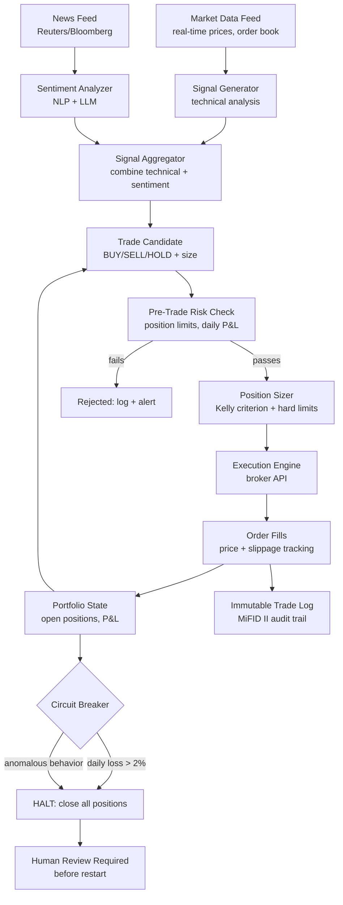
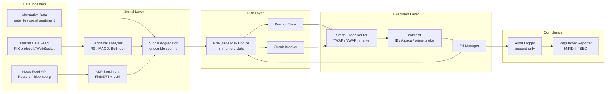

# Design an Autonomous Trading Agent — AI-Driven Market Execution with Risk Controls

**Difficulty**: 🔴 Advanced → ⚫ Senior
**Reading Time**: 40 minutes
**Interview Frequency**: Medium — essential for fintech/quant trading interviews; excellent for demonstrating risk engineering thinking

> **Warning: Autonomous trading agents can lose money faster than any human. A bug in position sizing that trades 10× the intended size, or a stale market data feed that misses a news event, can result in seven-figure losses in seconds. Risk controls are not optional extras — they are the most important part of the architecture.**

---

## Table of Contents

| Section | What You'll Learn |
|---------|-------------------|
| [Mental Model](#mental-model) | Market data through execution pipeline |
| [Requirements](#requirements) | Latency, risk limits, and regulatory constraints |
| [Architecture](#architecture) | Signal generation, risk management, execution layers |
| [Deep Dive: Signal Generation](#deep-dive-signal-generation) | Technical analysis + news sentiment + LLM reasoning |
| [Deep Dive: Risk Management](#deep-dive-risk-management) | Position limits, daily loss limits, Kelly criterion |
| [Deep Dive: Circuit Breakers](#deep-dive-circuit-breakers) | Auto-halt conditions and manual override |
| [Deep Dive: Regulatory Compliance](#deep-dive-regulatory-compliance) | MiFID II, SEC, audit trails |
| [Failure Modes](#failure-modes) | Flash crashes, stale data, adversarial news |
| [Interview Q&A](#interview-qa) | How to answer common questions |

---

## Mental Model

The agent continuously ingests market data and news, generates trading signals by combining technical indicators with news sentiment analysis and LLM reasoning, passes each candidate trade through a multi-layer risk management system, sizes the position according to Kelly criterion with hard limits, executes through the broker API with slippage controls, and logs every decision to an immutable audit trail.



---

## Requirements

### Functional Requirements

1. Ingest real-time market data (Level 2 order book, trades) with < 1ms processing latency
2. Generate trading signals from technical indicators (RSI, MACD, Bollinger Bands, momentum)
3. Augment signals with news sentiment analysis (NLP on headlines + LLM for ambiguous events)
4. Multi-layer pre-trade risk checks before any order submission
5. Size positions using Kelly criterion bounded by hard limits
6. Execute orders via broker API with slippage and market impact controls
7. Real-time P&L tracking with automated circuit breakers
8. Immutable audit trail for every signal, decision, and trade execution

### Non-Functional Requirements

| Requirement | Target |
|-------------|--------|
| Market data processing latency | < 1ms for tick data processing |
| Signal generation to order submission | < 10ms total pipeline |
| Pre-trade risk check latency | < 1ms (in-memory risk state) |
| Daily loss limit (hard) | 2% of portfolio value — automatic halt |
| Max single position size | 5% of portfolio value |
| Max portfolio concentration (one sector) | 20% of portfolio value |
| Audit log | Immutable, 7-year retention (MiFID II requirement) |
| System availability during market hours | 99.99% |

### Capacity Estimation

- Level 2 order book: ~50,000 messages/second for S&P 500 equities
- Trade ticks: ~10,000/second across liquid equities
- News articles: ~100/hour for relevant market-moving news
- Signal events: ~1,000/day of actionable signals (from technical screener)
- Actual trades: ~20-100/day (most signals filtered by risk checks)

---

## Architecture



---

## Deep Dive: Signal Generation

### Technical Analysis Signals

Computed in real-time as price ticks arrive:

```python
# Signal computation on each price tick (< 1ms budget)
class TechnicalSignal:
    def compute(self, ticker: str, prices: TimeSeries) -> Signal:
        rsi_14 = self.rsi(prices.close, period=14)
        macd_signal = self.macd(prices.close, fast=12, slow=26, signal=9)
        bb_position = self.bollinger_band_position(prices.close, period=20, std=2)
        volume_ratio = prices.volume[-1] / prices.volume[-20:].mean()

        # Composite score: -1 (strong sell) to +1 (strong buy)
        score = 0
        if rsi_14 < 30: score += 0.3     # oversold
        if rsi_14 > 70: score -= 0.3     # overbought
        if macd_signal.crossover: score += 0.4 * macd_signal.direction
        if bb_position < 0.1: score += 0.2   # near lower band
        if volume_ratio > 2.0: score *= 1.5  # high volume amplifies signal

        return Signal(ticker=ticker, score=score, confidence=self.calibrate(score))
```

### LLM News Sentiment Analysis

For ambiguous news events, rule-based NLP isn't sufficient:
- "Apple reports $90B revenue, beating estimates by $2B" → clearly positive
- "Fed Chairman says rate cuts depend on further data" → ambiguous, market-dependent
- "Tesla recalls 2M vehicles but Musk says software fix resolves it" → conflicting signals

LLM analysis prompt:
```
You are a financial analyst. Analyze the market impact of this news for {TICKER}:

News: "{HEADLINE}"
Published: {TIMESTAMP}

Assess:
1. Directional impact on {TICKER} stock: positive / negative / neutral / mixed
2. Magnitude: large (>2% move expected) / medium (0.5-2%) / small (<0.5%)
3. Confidence: 0-1
4. Key uncertainty factors
5. Time horizon of impact: intraday / this week / longer

Respond in JSON only.
```

**Latency management**: LLM call takes ~1s. News sentiment is not on the critical path for high-frequency signals — it enriches directional decisions with a 5-minute lag. Assign a signal decay function: news sentiment score decays over 15 minutes unless subsequent confirming news extends it.

---

## Deep Dive: Risk Management

### Pre-Trade Risk Check (< 1ms budget)

All risk state is maintained in-memory (never hit DB on hot path):

```python
class PreTradeRiskEngine:
    def check(self, order: TradeOrder) -> RiskCheckResult:
        # 1. Position limit check
        new_position = self.positions[order.ticker] + order.size
        if abs(new_position * order.price) > self.portfolio_value * 0.05:
            return REJECT("Position would exceed 5% portfolio limit")

        # 2. Sector concentration check
        sector = self.sector_map[order.ticker]
        sector_exposure = self.sector_exposures[sector] + order.notional
        if sector_exposure > self.portfolio_value * 0.20:
            return REJECT("Would exceed 20% sector concentration limit")

        # 3. Daily P&L check
        if self.daily_pnl < -self.portfolio_value * 0.015:
            # At 1.5% daily loss, reduce position sizing by 50%
            order.size = order.size * 0.5

        if self.daily_pnl < -self.portfolio_value * 0.02:
            return REJECT("Daily loss limit hit — trading halted")

        # 4. Velocity check (prevent runaway ordering)
        if self.orders_last_minute > 100:
            return REJECT("Order velocity limit exceeded")

        # 5. Notional size sanity check
        if order.notional > 500_000:
            return FLAG_FOR_HUMAN_REVIEW(order)

        return APPROVED
```

### Kelly Criterion for Position Sizing

Kelly criterion maximizes long-term growth rate given win probability and win/loss ratio:

```
f* = (p * b - q) / b

Where:
  f* = fraction of portfolio to risk
  p  = probability of winning (from signal confidence)
  q  = probability of losing = 1 - p
  b  = win/loss ratio (avg win / avg loss from historical data)

Example:
  Signal confidence = 0.6 (60% win probability)
  Historical avg win = 2.0% / avg loss = 1.5% → b = 2.0/1.5 = 1.33
  f* = (0.6 * 1.33 - 0.4) / 1.33 = (0.798 - 0.4) / 1.33 = 0.299 = ~30%

Reality: Full Kelly is too aggressive (very high variance).
Use fractional Kelly: f = f* * 0.25 → 7.5% of portfolio

Then apply hard caps: min(kelly_fraction * portfolio, max_position_limit)
```

---

## Deep Dive: Circuit Breakers

### Automatic Halt Conditions

```yaml
circuit_breakers:
  daily_loss_limit:
    threshold: -2% of portfolio
    action: close_all_positions, halt_trading, alert_human
    recovery: manual_human_restart_only

  position_spike:
    threshold: any position > 3× intended size
    action: reduce_to_intended_size, alert, pause_5_minutes
    trigger: execution bug or runaway retry

  velocity_anomaly:
    threshold: > 100 orders in 60 seconds
    action: halt_trading, alert_human, log_all_recent_orders
    expected_rate: < 10 orders / 60 seconds

  market_halt:
    trigger: exchange circuit breaker active
    action: cancel_all_open_orders, halt_new_orders_until_market_resumes

  price_sanity:
    threshold: order price > 5% away from last trade price
    action: reject_order, alert
    prevents: stale data causing erroneous price reference
```

### Manual Override Protocol

To restart after circuit breaker:
1. Human review of recent trade log and P&L attribution
2. Identify root cause of halt
3. Two-person sign-off required (risk officer + head trader)
4. Restart with reduced position limits (50% of normal) for 2 hours
5. Restore normal limits only after 2 hours of clean operation

---

## Deep Dive: Regulatory Compliance

### MiFID II Requirements for Algorithmic Trading

European MiFID II (and equivalent US SEC rules) require:

1. **Algorithm registration**: Register the algorithm with the exchange before trading. Include description of strategy and risk controls.

2. **Kill switch**: Must be able to immediately halt all orders from a single command. Response time < 1 second. Tested monthly.

3. **Annual self-assessment**: Risk controls documented and tested annually. Results reported to regulator.

4. **Pre-trade controls**: Order limits, position limits, and market-wide circuit breaker awareness must be implemented and tested.

5. **Post-trade reporting**: All trades reported to trade repository within T+1. Includes algorithm ID, decision time, order submission time, execution time.

6. **Audit trail**: 5-year minimum retention (we do 7 for safety margin). Must include: every signal, risk check result, order, fill, and modification. Timestamps to microsecond precision.

**Audit trail schema**:
```json
{
  "event_id": "uuid",
  "algo_id": "STRAT-001-v3.2",
  "timestamp_decision_ns": 1735500000000000000,
  "timestamp_order_submitted_ns": 1735500000008000000,
  "timestamp_fill_ns": 1735500000023000000,
  "ticker": "AAPL",
  "order_type": "LIMIT",
  "direction": "BUY",
  "quantity": 100,
  "limit_price": 189.50,
  "fill_price": 189.52,
  "signal_score": 0.72,
  "signal_components": {
    "technical_rsi": 28.3,
    "technical_macd": 0.45,
    "news_sentiment": 0.3,
    "news_confidence": 0.6
  },
  "risk_checks_passed": ["position_limit", "sector_limit", "velocity_limit"],
  "kelly_fraction": 0.12,
  "slippage_bps": 1.1
}
```

---

## Failure Modes

### 1. Flash Crash Amplification
**Scenario**: Market drops 2% in 30 seconds; agent's stop-losses trigger; agent sells into declining market; amplifies crash; agent buys on rebound signal; loses on the round-trip
**Impact**: Significant losses; possible regulatory scrutiny for market disruption
**Mitigation**:
- Market-wide circuit breaker awareness: if exchange triggers L1 circuit breaker (5% drop), auto-halt all trading
- Stop-loss limits on single-day moves: don't chase cascading stop-losses when market-wide volatility is extreme (VIX > 40)
- Trend detection on speed of market move: if price drops > 1% in < 60 seconds, pause new orders for 60 seconds

### 2. Stale Market Data Causing Wrong Signal
**Scenario**: Market data feed disconnects for 2 seconds; prices are stale; RSI computes on old data; signal triggers buy on a stock that has already dropped 3%
**Impact**: Losses on stale-data-driven trades
**Mitigation**:
- Data freshness check on every tick: if last price update > 1 second ago, mark signal as STALE and reject new orders
- Redundant data feeds: primary + secondary provider; automatic failover in < 100ms
- Price sanity check: reject any order where signal price deviates > 2% from current mid-market price

### 3. Regulatory Violation from Excessive Order Speed
**Scenario**: Bug causes order retry loop; agent submits 10,000 orders in 1 second for the same stock; exchange detects potential market manipulation
**Impact**: Exchange ban; regulatory investigation; unlimited liability
**Mitigation**:
- Velocity circuit breaker: > 100 orders/minute triggers immediate halt (see circuit breakers section)
- Order deduplication: idempotency key on every order — same ticker + direction + size within 5 seconds = reject as duplicate
- Exchange rate limits: implement client-side rate limiting that stays well below exchange limits

### 4. Adversarial News Causing Wrong Sentiment
**Scenario**: False news article published claiming FDA denied drug approval for MRNA; sentiment classifier rates it as NEGATIVE; agent short-sells; news retracted; stock rebounds; agent loses
**Impact**: Losses from fake news; potential SEC scrutiny for trading on manipulated information
**Mitigation**:
- News source whitelist: only trade on news from verified sources (Reuters, Bloomberg, AP, SEC EDGAR)
- Cross-source verification: only act on news sentiment if same signal from ≥ 2 independent sources within 5 minutes
- Position hold time minimum: hold news-sentiment-driven positions for minimum 15 minutes before exit — prevents chasing immediate retractions

---

## Interview Q&A

### "How do you back-test the trading strategy without overfitting?"

> "Three-layer validation: (1) Walk-forward testing — train on years 1-3, test on year 4, then train on 1-4, test on year 5, etc. This prevents look-ahead bias. (2) Out-of-sample holdout — withhold the most recent 12 months entirely until final validation. Strategy must meet performance thresholds on this holdout period. (3) Paper trading — run the live algorithm in simulation with real market data for 90 days before committing capital. Compare paper P&L to backtest expectations; divergence > 20% indicates the backtest is overfit. The biggest overfitting risk is data snooping — when you've tried 50 strategy variations and 'found' one that works well historically, you're likely fitting noise. We address this with a Bonferroni-corrected significance threshold and requiring a plausible causal mechanism for each signal (not just correlation)."

### "How would you handle a scenario where the LLM misinterprets a major earnings announcement?"

> "LLM misinterpretation on binary events (earnings beats/misses) is a real risk. Our mitigation: (1) For major scheduled events (earnings, Fed meetings, economic reports), we have a blackout window 30 minutes before and 30 minutes after the event — no new positions opened. (2) The LLM is used for reasoning and context, not as the primary signal for binary announcements. For earnings, we use numerical comparison (reported EPS vs consensus EPS from financial data provider) as the primary signal — this is deterministic, not LLM-dependent. (3) LLM sentiment is limited to 30% weight in the signal aggregator; technical signals and quantitative sentiment provide the remaining 70%. (4) Any trade with LLM as majority contributor (>50% weight) requires confidence > 0.85 before execution — the LLM is often uncertain on complex events, and that uncertainty is our protection."

---

## Key Takeaways

| Number | What It Means |
|--------|--------------|
| **2% daily loss limit** | Hard halt trigger — non-negotiable; automated, not human-initiated |
| **5% single position cap** | Max concentration per holding — Kelly criterion in practice |
| **< 10ms pipeline** | Signal to order submission budget — most latency in execution, not analysis |
| **7-year audit retention** | MiFID II minimum is 5 years; 7 for safety margin |
| **2-person restart** | After circuit breaker — prevents single person from resuming risky behavior |
| **2-source news verification** | Before acting on news sentiment — prevents fake news exploitation |

---

## 📚 Resources & References

| Resource | Type | What You'll Learn |
|----------|------|------------------|
| [MiFID II Algorithmic Trading Requirements — ESMA](https://www.esma.europa.eu/regulation/trading/algorithmic-trading) | 📚 Docs | EU regulatory requirements for algorithmic trading systems |
| [Flash Crash 2010: SEC/CFTC Joint Report](https://www.sec.gov/news/studies/2010/marketevents-report.pdf) | 📖 Blog | How automated trading contributed to the 2010 Flash Crash — essential case study |
| [Andrej Karpathy — Let's Build a GPT from Scratch](https://www.youtube.com/@AndrejKarpathy) | 📺 YouTube | Understanding the LLM foundation underlying news sentiment analysis |
| [Bloomberg: How Renaissance Technologies Made $66B](https://www.bloomberg.com/news/articles/2023-12-08) | 📖 Blog | Real-world algorithmic trading at scale — risk management culture |
| [AI Explained — Reinforcement Learning for Trading](https://www.youtube.com/@AIExplained-official) | 📺 YouTube | Conceptual overview of RL approaches vs rule-based systems in trading |
| [Lilian Weng — Reward Shaping in RL](https://lilianweng.github.io/posts/2020-06-07-exploration-process-rl/) | 📖 Blog | Reinforcement learning concepts applicable to reward-based trading strategies |
