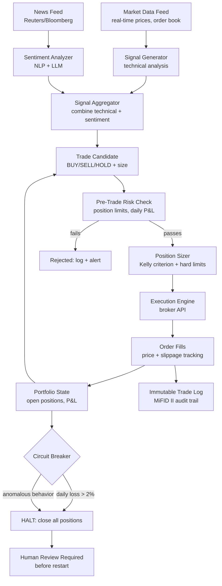
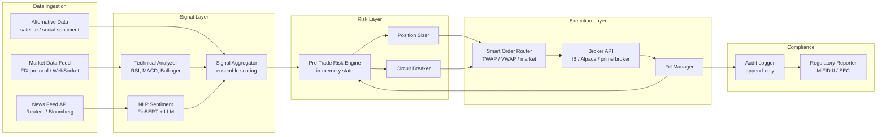
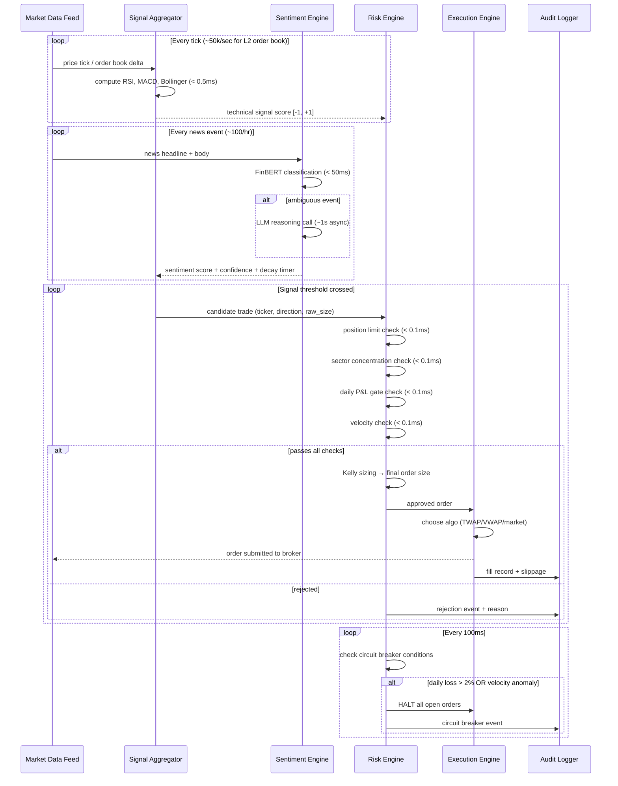
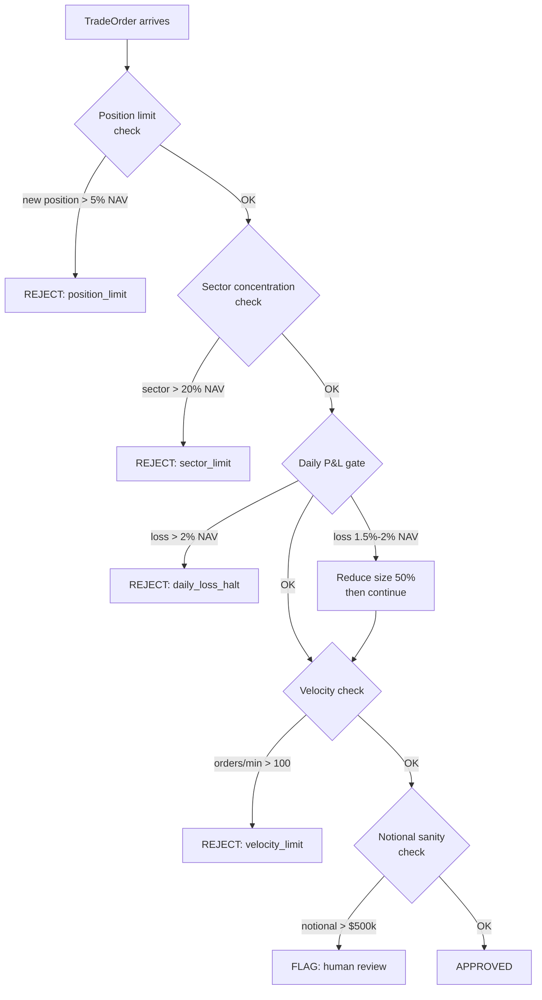
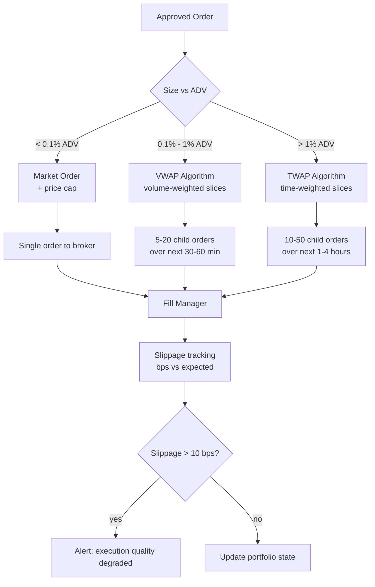

# Design an Autonomous Trading Agent — AI-Driven Market Execution with Risk Controls

**Difficulty**: 🔴 Advanced → ⚫ Senior
**Reading Time**: 40 minutes
**Interview Frequency**: Medium — essential for fintech/quant trading interviews; excellent for demonstrating risk engineering thinking

> **Warning: Autonomous trading agents can lose money faster than any human. A bug in position sizing that trades 10× the intended size, or a stale market data feed that misses a news event, can result in seven-figure losses in seconds. Risk controls are not optional extras — they are the most important part of the architecture.**

---

## Table of Contents

| Section | What You'll Learn |
|---------|-------------------|
| [Mental Model](#mental-model) | Market data through execution pipeline |
| [Requirements](#requirements) | Latency, risk limits, and regulatory constraints |
| [Architecture](#architecture) | Signal generation, risk management, execution layers |
| [Deep Dive: Signal Generation](#deep-dive-signal-generation) | Technical analysis + news sentiment + LLM reasoning |
| [Deep Dive: Risk Management](#deep-dive-risk-management) | Position limits, daily loss limits, Kelly criterion |
| [Deep Dive: Circuit Breakers](#deep-dive-circuit-breakers) | Auto-halt conditions and manual override |
| [Deep Dive: Regulatory Compliance](#deep-dive-regulatory-compliance) | MiFID II, SEC, audit trails |
| [Failure Modes](#failure-modes) | Flash crashes, stale data, adversarial news |
| [Interview Q&A](#interview-qa) | How to answer common questions |

---

## Mental Model

The agent continuously ingests market data and news, generates trading signals by combining technical indicators with news sentiment analysis and LLM reasoning, passes each candidate trade through a multi-layer risk management system, sizes the position according to Kelly criterion with hard limits, executes through the broker API with slippage controls, and logs every decision to an immutable audit trail.



---

## Requirements

### Functional Requirements

1. Ingest real-time market data (Level 2 order book, trades) with < 1ms processing latency
2. Generate trading signals from technical indicators (RSI, MACD, Bollinger Bands, momentum)
3. Augment signals with news sentiment analysis (NLP on headlines + LLM for ambiguous events)
4. Multi-layer pre-trade risk checks before any order submission
5. Size positions using Kelly criterion bounded by hard limits
6. Execute orders via broker API with slippage and market impact controls
7. Real-time P&L tracking with automated circuit breakers
8. Immutable audit trail for every signal, decision, and trade execution

### Non-Functional Requirements

| Requirement | Target |
|-------------|--------|
| Market data processing latency | < 1ms for tick data processing |
| Signal generation to order submission | < 10ms total pipeline |
| Pre-trade risk check latency | < 1ms (in-memory risk state) |
| Daily loss limit (hard) | 2% of portfolio value — automatic halt |
| Max single position size | 5% of portfolio value |
| Max portfolio concentration (one sector) | 20% of portfolio value |
| Audit log | Immutable, 7-year retention (MiFID II requirement) |
| System availability during market hours | 99.99% |

### Capacity Estimation

- Level 2 order book: ~50,000 messages/second for S&P 500 equities
- Trade ticks: ~10,000/second across liquid equities
- News articles: ~100/hour for relevant market-moving news
- Signal events: ~1,000/day of actionable signals (from technical screener)
- Actual trades: ~20-100/day (most signals filtered by risk checks)

---

## Architecture



---

## Deep Dive: Signal Generation

### Technical Analysis Signals

Computed in real-time as price ticks arrive:

```python
# Signal computation on each price tick (< 1ms budget)
class TechnicalSignal:
    def compute(self, ticker: str, prices: TimeSeries) -> Signal:
        rsi_14 = self.rsi(prices.close, period=14)
        macd_signal = self.macd(prices.close, fast=12, slow=26, signal=9)
        bb_position = self.bollinger_band_position(prices.close, period=20, std=2)
        volume_ratio = prices.volume[-1] / prices.volume[-20:].mean()

        # Composite score: -1 (strong sell) to +1 (strong buy)
        score = 0
        if rsi_14 < 30: score += 0.3     # oversold
        if rsi_14 > 70: score -= 0.3     # overbought
        if macd_signal.crossover: score += 0.4 * macd_signal.direction
        if bb_position < 0.1: score += 0.2   # near lower band
        if volume_ratio > 2.0: score *= 1.5  # high volume amplifies signal

        return Signal(ticker=ticker, score=score, confidence=self.calibrate(score))
```

### LLM News Sentiment Analysis

For ambiguous news events, rule-based NLP isn't sufficient:
- "Apple reports $90B revenue, beating estimates by $2B" → clearly positive
- "Fed Chairman says rate cuts depend on further data" → ambiguous, market-dependent
- "Tesla recalls 2M vehicles but Musk says software fix resolves it" → conflicting signals

LLM analysis prompt:
```
You are a financial analyst. Analyze the market impact of this news for {TICKER}:

News: "{HEADLINE}"
Published: {TIMESTAMP}

Assess:
1. Directional impact on {TICKER} stock: positive / negative / neutral / mixed
2. Magnitude: large (>2% move expected) / medium (0.5-2%) / small (<0.5%)
3. Confidence: 0-1
4. Key uncertainty factors
5. Time horizon of impact: intraday / this week / longer

Respond in JSON only.
```

**Latency management**: LLM call takes ~1s. News sentiment is not on the critical path for high-frequency signals — it enriches directional decisions with a 5-minute lag. Assign a signal decay function: news sentiment score decays over 15 minutes unless subsequent confirming news extends it.

---

## Deep Dive: Risk Management

### Pre-Trade Risk Check (< 1ms budget)

All risk state is maintained in-memory (never hit DB on hot path):

```python
class PreTradeRiskEngine:
    def check(self, order: TradeOrder) -> RiskCheckResult:
        # 1. Position limit check
        new_position = self.positions[order.ticker] + order.size
        if abs(new_position * order.price) > self.portfolio_value * 0.05:
            return REJECT("Position would exceed 5% portfolio limit")

        # 2. Sector concentration check
        sector = self.sector_map[order.ticker]
        sector_exposure = self.sector_exposures[sector] + order.notional
        if sector_exposure > self.portfolio_value * 0.20:
            return REJECT("Would exceed 20% sector concentration limit")

        # 3. Daily P&L check
        if self.daily_pnl < -self.portfolio_value * 0.015:
            # At 1.5% daily loss, reduce position sizing by 50%
            order.size = order.size * 0.5

        if self.daily_pnl < -self.portfolio_value * 0.02:
            return REJECT("Daily loss limit hit — trading halted")

        # 4. Velocity check (prevent runaway ordering)
        if self.orders_last_minute > 100:
            return REJECT("Order velocity limit exceeded")

        # 5. Notional size sanity check
        if order.notional > 500_000:
            return FLAG_FOR_HUMAN_REVIEW(order)

        return APPROVED
```

### Kelly Criterion for Position Sizing

Kelly criterion maximizes long-term growth rate given win probability and win/loss ratio:

```
f* = (p * b - q) / b

Where:
  f* = fraction of portfolio to risk
  p  = probability of winning (from signal confidence)
  q  = probability of losing = 1 - p
  b  = win/loss ratio (avg win / avg loss from historical data)

Example:
  Signal confidence = 0.6 (60% win probability)
  Historical avg win = 2.0% / avg loss = 1.5% → b = 2.0/1.5 = 1.33
  f* = (0.6 * 1.33 - 0.4) / 1.33 = (0.798 - 0.4) / 1.33 = 0.299 = ~30%

Reality: Full Kelly is too aggressive (very high variance).
Use fractional Kelly: f = f* * 0.25 → 7.5% of portfolio

Then apply hard caps: min(kelly_fraction * portfolio, max_position_limit)
```

---

## Deep Dive: Circuit Breakers

### Automatic Halt Conditions

```yaml
circuit_breakers:
  daily_loss_limit:
    threshold: -2% of portfolio
    action: close_all_positions, halt_trading, alert_human
    recovery: manual_human_restart_only

  position_spike:
    threshold: any position > 3× intended size
    action: reduce_to_intended_size, alert, pause_5_minutes
    trigger: execution bug or runaway retry

  velocity_anomaly:
    threshold: > 100 orders in 60 seconds
    action: halt_trading, alert_human, log_all_recent_orders
    expected_rate: < 10 orders / 60 seconds

  market_halt:
    trigger: exchange circuit breaker active
    action: cancel_all_open_orders, halt_new_orders_until_market_resumes

  price_sanity:
    threshold: order price > 5% away from last trade price
    action: reject_order, alert
    prevents: stale data causing erroneous price reference
```

### Manual Override Protocol

To restart after circuit breaker:
1. Human review of recent trade log and P&L attribution
2. Identify root cause of halt
3. Two-person sign-off required (risk officer + head trader)
4. Restart with reduced position limits (50% of normal) for 2 hours
5. Restore normal limits only after 2 hours of clean operation

---

## Deep Dive: Regulatory Compliance

### MiFID II Requirements for Algorithmic Trading

European MiFID II (and equivalent US SEC rules) require:

1. **Algorithm registration**: Register the algorithm with the exchange before trading. Include description of strategy and risk controls.

2. **Kill switch**: Must be able to immediately halt all orders from a single command. Response time < 1 second. Tested monthly.

3. **Annual self-assessment**: Risk controls documented and tested annually. Results reported to regulator.

4. **Pre-trade controls**: Order limits, position limits, and market-wide circuit breaker awareness must be implemented and tested.

5. **Post-trade reporting**: All trades reported to trade repository within T+1. Includes algorithm ID, decision time, order submission time, execution time.

6. **Audit trail**: 5-year minimum retention (we do 7 for safety margin). Must include: every signal, risk check result, order, fill, and modification. Timestamps to microsecond precision.

**Audit trail schema**:
```json
{
  "event_id": "uuid",
  "algo_id": "STRAT-001-v3.2",
  "timestamp_decision_ns": 1735500000000000000,
  "timestamp_order_submitted_ns": 1735500000008000000,
  "timestamp_fill_ns": 1735500000023000000,
  "ticker": "AAPL",
  "order_type": "LIMIT",
  "direction": "BUY",
  "quantity": 100,
  "limit_price": 189.50,
  "fill_price": 189.52,
  "signal_score": 0.72,
  "signal_components": {
    "technical_rsi": 28.3,
    "technical_macd": 0.45,
    "news_sentiment": 0.3,
    "news_confidence": 0.6
  },
  "risk_checks_passed": ["position_limit", "sector_limit", "velocity_limit"],
  "kelly_fraction": 0.12,
  "slippage_bps": 1.1
}
```

---

## Failure Modes

### 1. Flash Crash Amplification
**Scenario**: Market drops 2% in 30 seconds; agent's stop-losses trigger; agent sells into declining market; amplifies crash; agent buys on rebound signal; loses on the round-trip
**Impact**: Significant losses; possible regulatory scrutiny for market disruption
**Mitigation**:
- Market-wide circuit breaker awareness: if exchange triggers L1 circuit breaker (5% drop), auto-halt all trading
- Stop-loss limits on single-day moves: don't chase cascading stop-losses when market-wide volatility is extreme (VIX > 40)
- Trend detection on speed of market move: if price drops > 1% in < 60 seconds, pause new orders for 60 seconds

### 2. Stale Market Data Causing Wrong Signal
**Scenario**: Market data feed disconnects for 2 seconds; prices are stale; RSI computes on old data; signal triggers buy on a stock that has already dropped 3%
**Impact**: Losses on stale-data-driven trades
**Mitigation**:
- Data freshness check on every tick: if last price update > 1 second ago, mark signal as STALE and reject new orders
- Redundant data feeds: primary + secondary provider; automatic failover in < 100ms
- Price sanity check: reject any order where signal price deviates > 2% from current mid-market price

### 3. Regulatory Violation from Excessive Order Speed
**Scenario**: Bug causes order retry loop; agent submits 10,000 orders in 1 second for the same stock; exchange detects potential market manipulation
**Impact**: Exchange ban; regulatory investigation; unlimited liability
**Mitigation**:
- Velocity circuit breaker: > 100 orders/minute triggers immediate halt (see circuit breakers section)
- Order deduplication: idempotency key on every order — same ticker + direction + size within 5 seconds = reject as duplicate
- Exchange rate limits: implement client-side rate limiting that stays well below exchange limits

### 4. Adversarial News Causing Wrong Sentiment
**Scenario**: False news article published claiming FDA denied drug approval for MRNA; sentiment classifier rates it as NEGATIVE; agent short-sells; news retracted; stock rebounds; agent loses
**Impact**: Losses from fake news; potential SEC scrutiny for trading on manipulated information
**Mitigation**:
- News source whitelist: only trade on news from verified sources (Reuters, Bloomberg, AP, SEC EDGAR)
- Cross-source verification: only act on news sentiment if same signal from ≥ 2 independent sources within 5 minutes
- Position hold time minimum: hold news-sentiment-driven positions for minimum 15 minutes before exit — prevents chasing immediate retractions

---

## Interview Q&A

### "How do you back-test the trading strategy without overfitting?"

> "Three-layer validation: (1) Walk-forward testing — train on years 1-3, test on year 4, then train on 1-4, test on year 5, etc. This prevents look-ahead bias. (2) Out-of-sample holdout — withhold the most recent 12 months entirely until final validation. Strategy must meet performance thresholds on this holdout period. (3) Paper trading — run the live algorithm in simulation with real market data for 90 days before committing capital. Compare paper P&L to backtest expectations; divergence > 20% indicates the backtest is overfit. The biggest overfitting risk is data snooping — when you've tried 50 strategy variations and 'found' one that works well historically, you're likely fitting noise. We address this with a Bonferroni-corrected significance threshold and requiring a plausible causal mechanism for each signal (not just correlation)."

### "How would you handle a scenario where the LLM misinterprets a major earnings announcement?"

> "LLM misinterpretation on binary events (earnings beats/misses) is a real risk. Our mitigation: (1) For major scheduled events (earnings, Fed meetings, economic reports), we have a blackout window 30 minutes before and 30 minutes after the event — no new positions opened. (2) The LLM is used for reasoning and context, not as the primary signal for binary announcements. For earnings, we use numerical comparison (reported EPS vs consensus EPS from financial data provider) as the primary signal — this is deterministic, not LLM-dependent. (3) LLM sentiment is limited to 30% weight in the signal aggregator; technical signals and quantitative sentiment provide the remaining 70%. (4) Any trade with LLM as majority contributor (>50% weight) requires confidence > 0.85 before execution — the LLM is often uncertain on complex events, and that uncertainty is our protection."

---

## Key Takeaways

| Number | What It Means |
|--------|--------------|
| **2% daily loss limit** | Hard halt trigger — non-negotiable; automated, not human-initiated |
| **5% single position cap** | Max concentration per holding — Kelly criterion in practice |
| **< 10ms pipeline** | Signal to order submission budget — most latency in execution, not analysis |
| **7-year audit retention** | MiFID II minimum is 5 years; 7 for safety margin |
| **2-person restart** | After circuit breaker — prevents single person from resuming risky behavior |
| **2-source news verification** | Before acting on news sentiment — prevents fake news exploitation |

---

## Agent Architecture

The trading agent follows a continuous sense-plan-act loop. Each iteration consumes fresh market data, runs inference, checks risk, and optionally submits an order — all within a 10ms budget.



The async nature of LLM calls is critical: the sentiment engine runs on a separate goroutine (or async task). It enriches the signal aggregator's context map for a ticker with a 5-minute TTL. The main signal loop never blocks waiting for an LLM response — it reads the cached sentiment score if available, or proceeds with purely technical signals if not.

---

## Tool / Function Registry

The agent can invoke the following external tools. Each tool call is wrapped with a timeout, retry budget, and circuit breaker so a slow upstream never stalls the main loop.

| Tool | Latency SLA | Retry Policy | Fallback |
|------|-------------|-------------|---------|
| `get_level2_book(ticker)` | < 1ms (local cache) | No retry — stale = reject | Mark data as stale, reject signals |
| `submit_order(order)` | < 5ms (broker API) | 1 retry after 2ms | Log failure, size down 50%, retry once |
| `get_news_headlines(since_ts)` | < 200ms (REST poll) | 3 retries with exp backoff | Use last known sentiment score |
| `llm_analyze_news(text)` | < 2000ms (async) | 1 retry if timeout | Skip LLM; use FinBERT score only |
| `get_portfolio_state()` | < 1ms (in-memory) | No retry — always in-memory | N/A (critical path, no DB) |
| `write_audit_log(event)` | < 5ms (async write) | Infinite retry to durable queue | Buffer in-memory, drain on reconnect |

### Tool Selection Logic

The agent does NOT use an LLM to select tools. Tool selection is deterministic and rule-based — the LLM is used only for news interpretation, not for agent orchestration. This eliminates a whole class of failure modes:

- No risk of LLM hallucinating a tool name that doesn't exist
- No token cost for orchestration decisions
- Fully auditable control flow — every branch is in source code, not in a prompt

```python
class TradingAgentLoop:
    def on_signal_threshold(self, signal: Signal):
        # Deterministic tool call sequence — no LLM routing
        portfolio = self.portfolio_tool.get_state()          # tool: get_portfolio_state
        risk_result = self.risk_engine.check(signal, portfolio)
        if risk_result.approved:
            order = self.sizer.size(signal, portfolio, risk_result)
            fill = self.execution_tool.submit(order)          # tool: submit_order
            self.audit_tool.log(signal, risk_result, order, fill)  # tool: write_audit_log
```

---

## Prompt Engineering

The LLM is used in exactly one place: interpreting ambiguous news events. The system prompt is stable and version-controlled. Prompt changes go through the same code review process as algorithm changes.

### System Prompt Structure

```
[ROLE]
You are a financial news analyst with expertise in equity markets.
Your job is to assess the short-term market impact of news events on specific stocks.
You must be conservative: when uncertain, lean toward neutral.
You must never fabricate data not present in the provided news text.

[CONSTRAINTS]
- Analyze ONLY the provided text. Do not use prior knowledge of the company's recent performance.
- If the news is ambiguous, return confidence < 0.4.
- Your response MUST be valid JSON matching the schema below.
- Do NOT include explanatory text outside the JSON.

[OUTPUT SCHEMA]
{
  "direction": "positive" | "negative" | "neutral" | "mixed",
  "magnitude": "large" | "medium" | "small",
  "confidence": 0.0 to 1.0,
  "time_horizon": "intraday" | "multi_day" | "long_term",
  "key_uncertainties": ["string", ...]
}
```

### Context Management

Each LLM call is stateless — no conversation history is maintained between news events. This is intentional:
- Eliminates context window overflow as a failure mode
- Prevents the LLM from anchoring on earlier bullish/bearish assessments
- Reduces cost per call (shorter prompt = fewer tokens)
- Makes each call independently auditable

Token budget per call: ~600 tokens input, ~150 tokens output. At GPT-4o pricing ($0.005/1k input), each news analysis costs ~$0.003. With 100 news events per hour across a trading day (6.5 hours), total LLM cost per day is ~$2.

---

## Failure Modes

### Hallucination

**When it happens:** LLM fabricates a fact not present in the news — e.g., "Apple's iPhone 17 launch was canceled" when the article only said "launch delayed." The LLM conflates "delayed" with "canceled" and returns a more negative sentiment.

**Detection:** Post-hoc verification against the source article. Extract named entities and key claims from the LLM response; verify each is present in the original text. If any claim is absent, downgrade confidence to 0.1 and flag for human review.

**Mitigation:**
- System prompt constraint: "analyze ONLY the provided text"
- Low-confidence threshold: any LLM call returning confidence > 0.7 for a "large" magnitude event requires source text snippet in audit log for manual review
- LLM is capped at 30% signal weight — even a fully hallucinated response shifts the composite score by at most 0.3 out of 1.0

### Agent Loop Detection

**When it happens:** A bug causes the signal aggregator to keep re-emitting the same signal (e.g., RSI stuck at 28 due to stale data); the agent keeps submitting BUY orders for the same stock.

**Detection:** Idempotency check: if the same ticker + direction appears in submitted orders more than 3 times in the last 60 seconds, the 4th order is rejected and a velocity alert fires.

**Mitigation:**
- Order deduplication by idempotency key: `{ticker}-{direction}-{size}-{minute_bucket}`
- Velocity circuit breaker: > 100 orders per minute halts all trading
- Maximum open orders per ticker: 3 (prevents accumulation while waiting for fills)

### Cost Control

Each LLM call costs ~$0.003. But the risk is not per-call cost — it is a runaway call loop if the news polling loop has a bug:

```python
class NewsProcessor:
    def __init__(self):
        self.llm_calls_this_hour = 0
        self.llm_hourly_budget = 200  # max calls/hr = max $0.60/hr

    def analyze(self, article: NewsArticle) -> Sentiment:
        if self.llm_calls_this_hour >= self.llm_hourly_budget:
            # Hard cap: fall back to FinBERT only
            return self.finbert.classify(article)
        self.llm_calls_this_hour += 1
        return self.llm_client.call(article)
```

Hard token budget: 200 LLM calls/hour. Beyond that, FinBERT handles sentiment — faster (50ms vs 1s) and cheaper ($0) but less nuanced for complex events.

---

## Component Deep Dive 1: Pre-Trade Risk Engine

The risk engine is the most critical component in the entire system. A bug in signal generation loses you a trade. A bug in the risk engine can lose the fund. This distinction shapes every design decision: the risk engine is the most tested, most monitored, and most conservatively implemented component.

### How It Works Internally

The risk engine maintains an in-memory snapshot of the entire portfolio state: all open positions, sector exposures, daily realized + unrealized P&L, order velocity counters, and a timestamp of the last state sync. This snapshot is updated on every fill event (synchronously, under a mutex) and read on every pre-trade check. There is no database call on the hot path.

The check is sequential, fail-fast: if check 1 rejects, checks 2-5 are skipped. This keeps average latency under 0.3ms even when all checks pass.



### Why Naive Approaches Fail at Scale

**Naive approach 1: Query the database on every trade check.** A PostgreSQL query for portfolio state takes 2-10ms. At 1,000 signal events/day this is tolerable, but on days with high volatility when signal frequency spikes 10x, you get 10,000 checks/day with DB latency. More dangerously, a DB outage (even a 500ms hiccup) would either block all trading or require bypassing the risk check — both are unacceptable.

**Naive approach 2: No sector concentration check, only per-position limit.** You can have 20 positions at 5% each in tech stocks and be 100% concentrated in tech. A sector crash wipes the portfolio even though no single position violated its limit. Real implementations maintain a sector map loaded from a static reference file at startup, updated nightly.

**Naive approach 3: Synchronous LLM call in the risk engine.** If news sentiment is part of the risk decision and the LLM call takes 1s, the entire trading pipeline is blocked for 1s per news event. At 100 news events/hour, you lose 100 seconds of trading per hour. The fix: risk engine reads cached sentiment from the signal aggregator context map (updated asynchronously) — never calls the LLM directly.

### Implementation Options

| Approach | Latency | Fault Tolerance | Complexity |
|----------|---------|-----------------|------------|
| In-memory state, mutex-protected | < 0.5ms | State lost on crash; recovery from trade log replay | Low |
| Redis-backed state, read-through cache | 1-3ms | Survives process restart; Redis must be HA | Medium |
| Event sourcing (replay from trade log) | 50-200ms at startup only | Full audit trail, perfect recovery | High |

**Production choice**: In-memory with event sourcing for recovery. On startup, replay the last trading day's fills from the immutable audit log to reconstruct portfolio state. On crash and restart (which should happen at most once per trading day, and never during market hours), recovery takes < 5 seconds.

---

## Component Deep Dive 2: Smart Order Router

Once the risk engine approves a trade and the position sizer determines the target shares, the smart order router (SOR) decides *how* to execute — market order vs limit order, and if limit, what execution algorithm to use.

### How It Works Internally

The SOR classifies orders into three buckets based on urgency and size relative to market volume:

- **Small + urgent** (< 0.1% of average daily volume, event-driven): market order with a maximum price limit (price + 5 bps) to prevent execution at absurd prices if the book is thin
- **Medium size** (0.1% - 1% of ADV): VWAP algorithm — break the order into child orders and submit them throughout the trading period weighted by expected volume profile
- **Large size** (> 1% of ADV): TWAP algorithm — distribute evenly over time to minimize market impact; accept worse average price in exchange for not moving the market against yourself



### Scale Behavior at 10x Load

Normal day: 20-100 orders. High-volatility day (earnings season, macro events): 200-1,000 orders. At 10x load:

- The SOR's order splitting creates 10-50 child orders per parent order. At 1,000 parent orders, that's up to 50,000 child orders — well within exchange rate limits (most prime brokers allow 10,000 orders/second)
- The fill manager processes each child fill and updates portfolio state. At 50,000 fills/day, the in-memory update (mutex + HashMap update) handles this comfortably
- The audit logger becomes the bottleneck: writing 50,000 structured events/day at 2KB each = 100MB/day. A buffered async write to an append-only log (with durable flush every 100ms) handles this with < 5ms p99 latency

| Metric | Normal Day | 10x Load Day | Mitigation |
|--------|------------|-------------|-----------|
| Parent orders | 50 | 500 | No change needed |
| Child orders | 500 | 5,000 | Async submission |
| Fill events | 500 | 5,000 | Async audit write |
| Audit log size | 1MB | 10MB | Append-only, no issue |
| Risk engine checks | 500 | 5,000 | In-memory, < 3ms total |

---

## Component Deep Dive 3: Immutable Audit Trail

MiFID II mandates a 5-year audit trail for all algorithmic trading activity. We retain 7 years for safety margin. Every signal, risk check, order, fill, modification, and circuit breaker event is logged to an immutable append-only store.

### Technical Decisions

**Storage**: Apache Kafka as the primary write path (append-only by design, 7-year retention configured), with async replication to S3 in Parquet format for cost-effective long-term storage and analytical queries.

**Why Kafka over PostgreSQL**: A relational DB with an `audit_events` table requires careful management to stay INSERT-only (no DELETEs), and regulators can ask you to prove the log hasn't been tampered with. Kafka's topic partitions are append-only at the protocol level. Coupled with Kafka's log compaction disabled on this topic (we want full history, not compacted), it provides a stronger tamper-evidence story.

**Tamper evidence**: Each event includes a SHA-256 hash of the previous event's hash + current payload. Auditors can verify the chain integrity. The root hash of each trading day is stored in a third-party escrow (S3 bucket in a separate AWS account controlled by compliance team).

**Query pattern**: Regulators typically ask for all trades for a specific ticker in a time window, or all decisions made by a specific algorithm version. These are served from the Parquet archive on S3 queried via Athena — no need to query live Kafka for historical lookups.

| Decision | Option A | Option B | Chosen |
|----------|---------|---------|-------|
| Write path | PostgreSQL (INSERT only) | Kafka append-only topic | Kafka — stronger tamper evidence |
| Long-term storage | Kafka forever | S3 Parquet archive | S3 — 80% cost reduction after 30 days |
| Query access | SQL on Postgres | Athena on S3 Parquet | Athena — handles 7 years without index bloat |

---

## Data Model

### Core schemas used in the trading pipeline

```sql
-- Immutable trade events (write to Kafka; mirrored to Postgres for fast recent lookups)
CREATE TABLE trade_events (
    event_id          UUID PRIMARY KEY,
    algo_id           VARCHAR(32) NOT NULL,          -- e.g. 'STRAT-001-v3.2'
    event_type        VARCHAR(32) NOT NULL,           -- SIGNAL | RISK_CHECK | ORDER | FILL | CIRCUIT_BREAKER
    ticker            VARCHAR(16) NOT NULL,
    ts_decision_ns    BIGINT NOT NULL,               -- nanosecond epoch of decision
    ts_submitted_ns   BIGINT,                        -- nanosecond epoch of order submission
    ts_filled_ns      BIGINT,                        -- nanosecond epoch of fill (null if not filled)
    direction         CHAR(4),                       -- BUY | SELL | null for non-order events
    quantity          INTEGER,
    limit_price       NUMERIC(12,4),
    fill_price        NUMERIC(12,4),
    slippage_bps      NUMERIC(6,2),
    signal_score      NUMERIC(5,4),                  -- composite score -1.0 to +1.0
    signal_rsi        NUMERIC(5,2),
    signal_macd       NUMERIC(8,4),
    signal_sentiment  NUMERIC(5,4),                  -- from NLP/LLM, null if no news
    sentiment_confidence NUMERIC(4,3),
    kelly_fraction    NUMERIC(5,4),
    risk_result       VARCHAR(32),                   -- APPROVED | REJECT_POSITION | REJECT_SECTOR | etc.
    prev_event_hash   CHAR(64),                      -- SHA-256 of previous event for chain integrity
    event_hash        CHAR(64) GENERATED ALWAYS AS (sha256(event_id::text || signal_score::text)) STORED
);

-- Indexes for regulatory query patterns
CREATE INDEX idx_trade_events_ticker_ts ON trade_events(ticker, ts_decision_ns);
CREATE INDEX idx_trade_events_algo_ts   ON trade_events(algo_id, ts_decision_ns);
CREATE INDEX idx_trade_events_type      ON trade_events(event_type, ts_decision_ns);

-- In-memory risk state (not persisted to DB; reconstructed from trade_events on startup)
-- Represented as a struct in application memory:
/*
  PortfolioState {
    positions:         HashMap<ticker, {shares, avg_cost, market_value}>
    sector_exposures:  HashMap<sector, notional_usd>
    daily_pnl_realized:  f64
    daily_pnl_unrealized: f64
    orders_last_minute: VecDeque<timestamp>  -- sliding window for velocity check
    last_updated_ns:    i64
  }
*/

-- Signal decay context (in-memory with TTL, not persisted)
/*
  SentimentContext {
    ticker:     String
    score:      f64       -- -1.0 to +1.0
    confidence: f64
    source:     "finbert" | "llm"
    expires_at: Instant   -- typically now + 15min for news events
  }
*/
```

---

## Scale Bottlenecks

| Traffic Level | Component That Breaks | Symptoms | Mitigation |
|---------------|----------------------|----------|------------|
| 10x baseline (1,000 orders/day) | Audit logger write buffer | Audit log write latency p99 > 100ms; possible event loss on crash | Increase Kafka producer batch size; add async flush with durable WAL |
| 50x baseline (5,000 orders/day) | Smart Order Router child order fan-out | Broker API rate limit errors; child orders queued but not submitted | Implement token-bucket rate limiter per broker endpoint; use multiple broker connections |
| 100x baseline (10,000 orders/day) | Portfolio state mutex contention | Signal processing latency increases as risk check locks block signal loop | Shard portfolio state by asset class; separate mutex per sector bucket |
| 100x baseline | LLM sentiment service | Hourly LLM budget exhausted in first 30 minutes; fallback to FinBERT only | Dynamically scale LLM budget based on market volatility; pre-cache sentiment for watchlist tickers |
| 1000x baseline (100,000 orders/day) | Single-process architecture | Cannot schedule 100k risk checks in < 10ms each on one core | Horizontal scaling requires distributed risk state with consistency guarantees — fundamentally different architecture (CRDT-based position tracking or centralized risk bus) |

---

## How Two Sigma Built This

Two Sigma, the New York-based quantitative hedge fund managing over $60 billion in assets, built one of the most sophisticated autonomous trading systems in the world. Their engineering blog and conference talks (SREcon 2019, USENIX 2020) reveal several non-obvious design decisions.

**Technology stack**: Python for signal research and backtesting, C++ for the production execution engine (latency-critical path), Apache Kafka for event streaming, Apache Spark for overnight backtesting on 20TB+ of historical market data.

**Specific numbers**: Their production systems process over 1 million market data messages per second across all strategies. A single strategy may generate 50,000 trading signals per day, of which 500-2,000 result in actual orders. They run hundreds of independent strategies simultaneously, each with its own risk budget.

**Non-obvious architectural decision**: Two Sigma separates "alpha research" from "production execution" with a strict API boundary. Researchers iterate on signal models in a sandbox environment that has read-only access to market data and no connection to production systems. Signals are packaged as versioned model artifacts (similar to ML model registries) and must pass a battery of backtesting requirements before being deployed to production. This prevents the common failure mode where a "research tweak" accidentally changes production behavior.

**Key lesson they share publicly**: The biggest risk is not a catastrophic bug — it is "model decay," where a signal that worked historically stops working as market conditions change. Their solution is continuous monitoring of each signal's out-of-sample performance with automatic weight reduction when a signal's Sharpe ratio drops below threshold. An LLM-based news sentiment model trained on pre-COVID news may systematically misread pandemic-era communications — Two Sigma addresses this with rolling retraining and production performance gates.

**Source**: Two Sigma engineering blog, "Data-Driven Decision Making at Scale" (2019); USENIX SREcon 2020 talk on "Reliability Engineering for Quantitative Finance."

---

## Interview Angle

**What the interviewer is testing:** Whether you treat risk management as a first-class architectural concern rather than an afterthought. Trading systems separate candidates who think about happy-path execution from candidates who think about catastrophic failure modes, regulatory obligations, and audit requirements.

**Common mistakes candidates make:**

1. **Putting risk checks after execution** — Some candidates design the flow as "generate signal → execute → check position." This is backwards and dangerous. Pre-trade risk checks must block execution before the order is submitted. Post-trade risk monitoring is complementary, not a replacement.

2. **Using an LLM to make trading decisions directly** — A common mistake is having the LLM output "BUY 100 shares of AAPL." LLMs are not reliable enough for direct order generation. Their role should be strictly bounded: interpret ambiguous natural language (news) into a structured signal score, with the score capped in influence. Deterministic, auditable code makes the actual trading decision.

3. **Ignoring audit trail as a core requirement** — Candidates who design audit logging as a "nice to have" or plan to "log to a database" without addressing tamper evidence, 7-year retention, and microsecond timestamps will lose marks in any financial systems interview. Compliance is not a layer you add later — it must be baked into the data model from day one.

**The insight that separates good from great answers:** The best candidates recognize that the LLM's role in this system is fundamentally different from agentic AI in consumer products. Here the LLM is a *perception module* (translating unstructured text to structured sentiment), not an *orchestration layer*. Trading decisions are made by deterministic rule-based systems because they are auditable, testable, and fail predictably. Mixing LLM orchestration into the execution path introduces non-determinism that cannot be audited or certified under MiFID II.

---

## Key Numbers to Remember

| Metric | Value | Context |
|--------|-------|---------|
| Market data throughput | 50,000 messages/sec | L2 order book for S&P 500 equities |
| Signal-to-order pipeline | < 10ms end-to-end | From tick arrival to broker order submission |
| Pre-trade risk check latency | < 0.5ms | In-memory only; no DB calls |
| LLM news analysis latency | ~1,000ms | Async; never on the critical path |
| Daily loss hard halt | 2% of portfolio NAV | Automated; no human required to trigger |
| Max single position | 5% of portfolio NAV | Kelly criterion bounded by hard cap |
| Max sector concentration | 20% of portfolio NAV | Requires sector map at startup |
| Audit log retention | 7 years | MiFID II minimum is 5 years |
| LLM call budget | 200 calls/hour | ~$0.60/hr at GPT-4o pricing |
| Two Sigma signal volume | 50,000 signals/day per strategy | 500-2,000 result in actual orders |
| Order velocity circuit breaker | 100 orders/minute | Triggers immediate halt and human review |
| News sentiment decay | 15 minutes TTL | After which score reverts to neutral |

---

## 📚 Resources & References

| Resource | Type | What You'll Learn |
|----------|------|------------------|
| [MiFID II Algorithmic Trading Requirements — ESMA](https://www.esma.europa.eu/regulation/trading/algorithmic-trading) | 📚 Docs | EU regulatory requirements for algorithmic trading systems |
| [Flash Crash 2010: SEC/CFTC Joint Report](https://www.sec.gov/news/studies/2010/marketevents-report.pdf) | 📖 Blog | How automated trading contributed to the 2010 Flash Crash — essential case study |
| [Andrej Karpathy — Let's Build a GPT from Scratch](https://www.youtube.com/@AndrejKarpathy) | 📺 YouTube | Understanding the LLM foundation underlying news sentiment analysis |
| [Bloomberg: How Renaissance Technologies Made $66B](https://www.bloomberg.com/news/articles/2023-12-08) | 📖 Blog | Real-world algorithmic trading at scale — risk management culture |
| [AI Explained — Reinforcement Learning for Trading](https://www.youtube.com/@AIExplained-official) | 📺 YouTube | Conceptual overview of RL approaches vs rule-based systems in trading |
| [Lilian Weng — Reward Shaping in RL](https://lilianweng.github.io/posts/2020-06-07-exploration-process-rl/) | 📖 Blog | Reinforcement learning concepts applicable to reward-based trading strategies |
