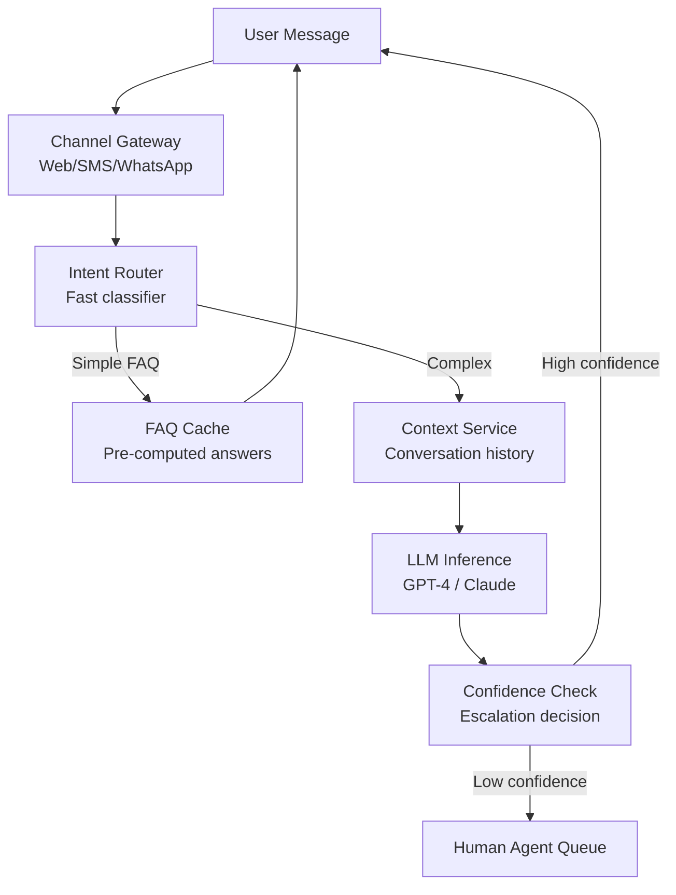

# Design a Chatbot Framework

**Difficulty**: 🟡 Intermediate
**Reading Time**: Coming Soon
**Interview Frequency**: Medium

---

> 🚧 **Full article coming soon.** This stub gives you the essentials to start thinking about this problem.

---

## The Core Problem

Building a framework that handles 1 million conversations per day across multiple topics requires managing conversational state across turns — the answer to "what is the weather?" depends on whether the user previously said "in Tokyo" three messages ago. Context window management, intent routing, and graceful fallback to human agents are the central challenges.

## Functional Requirements

- Process natural language input and generate contextual responses
- Maintain conversation history and context across turns
- Route to specialized handlers by detected intent
- Escalate to human agents when confidence is low
- Support multiple languages and channels (web, SMS, WhatsApp)

## Non-Functional Requirements

| Requirement | Target |
|-------------|--------|
| Response latency | p99 < 2 seconds |
| Availability | 99.9% (8.7 hrs downtime/year) |
| Throughput | 1M conversations/day (~12 concurrent/sec) |
| Context retention | Last 20 conversation turns |

## Back-of-Envelope Estimates

- **LLM inference cost**: 1M conversations × 10 turns avg × 1,000 tokens/turn = 10B tokens/day → ~$3,000/day at GPT-4 pricing (use smaller models for simple intents)
- **Context window**: 20 turns × 200 tokens avg = 4,000 tokens per request — fits in most LLM context windows
- **Human escalation**: 20% escalation rate × 1M conversations = 200K human-agent handoffs/day

## Key Design Decisions

1. **Intent Classification Before LLM** — route simple FAQs (top 100 questions by frequency) to cached answers without LLM call; only route complex/novel queries to LLM; reduces LLM cost by 60% and latency by 80% for common cases.
2. **Context Management via Sliding Window** — keep last N turns in context; summarize older turns into a compact summary; prevents context length explosion in long conversations; update summary every 10 turns.
3. **Confidence-Based Escalation** — LLM outputs confidence score (or use separate classifier); below threshold (0.7), offer human handoff; human agent sees full conversation history; on resolution, use conversation to fine-tune model.

## High-Level Architecture

## Top Interview Questions for This Problem

| Question | Tests |
|----------|-------|
| How do you handle a user asking about something that requires context from 30 messages ago? | Context window management, summarization |
| How do you reduce LLM inference costs without degrading quality for simple questions? | Intent routing, cache, model tiering |
| How do you measure chatbot quality and know when to trigger a retrain? | Evaluation metrics, feedback loops |

## Related Concepts

- [AI Customer Support Agent for production deployment](./customer-support-agent)
- [RAG QA agent for knowledge-base grounded responses](../09-ai-agents)

---

*📚 Full deep-dive with multiple approaches, trade-off tables, and pseudocode coming soon.*

## 📚 Resources & References

| Resource | Type | What You'll Learn |
|----------|------|------------------|
| [ByteByteGo — Design a Chatbot System](https://www.youtube.com/@ByteByteGo) | 📺 YouTube | Search "chatbot architecture" — intent routing and scalability |
| [Intercom Engineering: Building AI Chatbots](https://www.intercom.com/blog/engineering-ai-chatbot/) | 📖 Blog | Production chatbot architecture with intent classification and escalation |
| [Lilian Weng — Task-Oriented Dialogue Systems](https://lilianweng.github.io/posts/2020-11-30-task-oriented-dialogue/) | 📖 Blog | Deep dive into dialogue management and slot-filling for structured conversations |
| [Sam Witteveen — Production Chatbot Patterns](https://www.youtube.com/@samwitteveenai) | 📺 YouTube | Real-world LangChain patterns for chatbot context management |
| [Anthropic — Claude for Customer Support](https://www.anthropic.com/research) | 📚 Docs | Safety and reliability considerations for deployed conversational AI |
