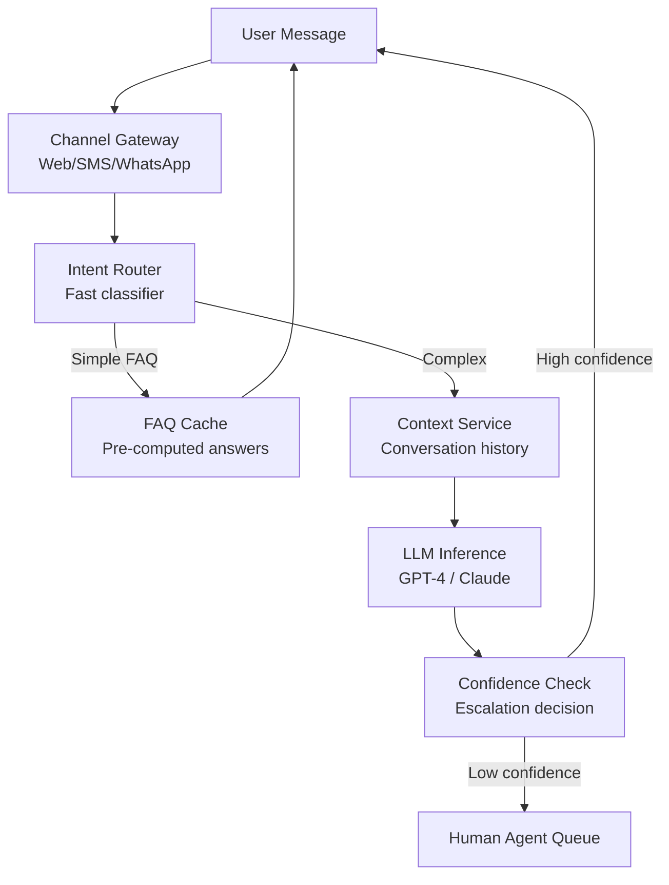
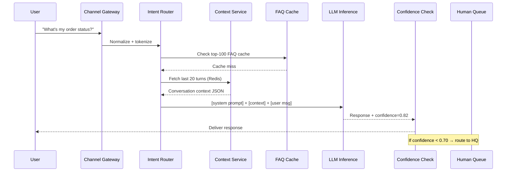
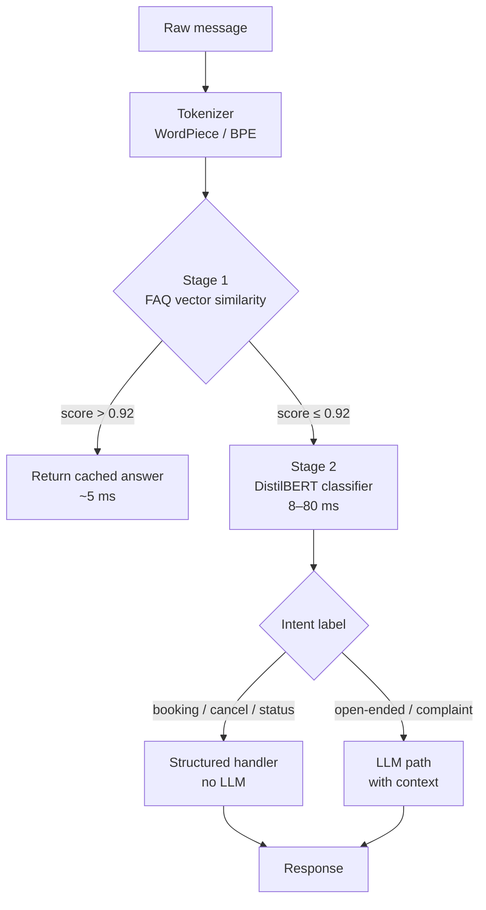
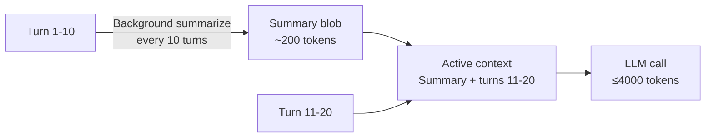
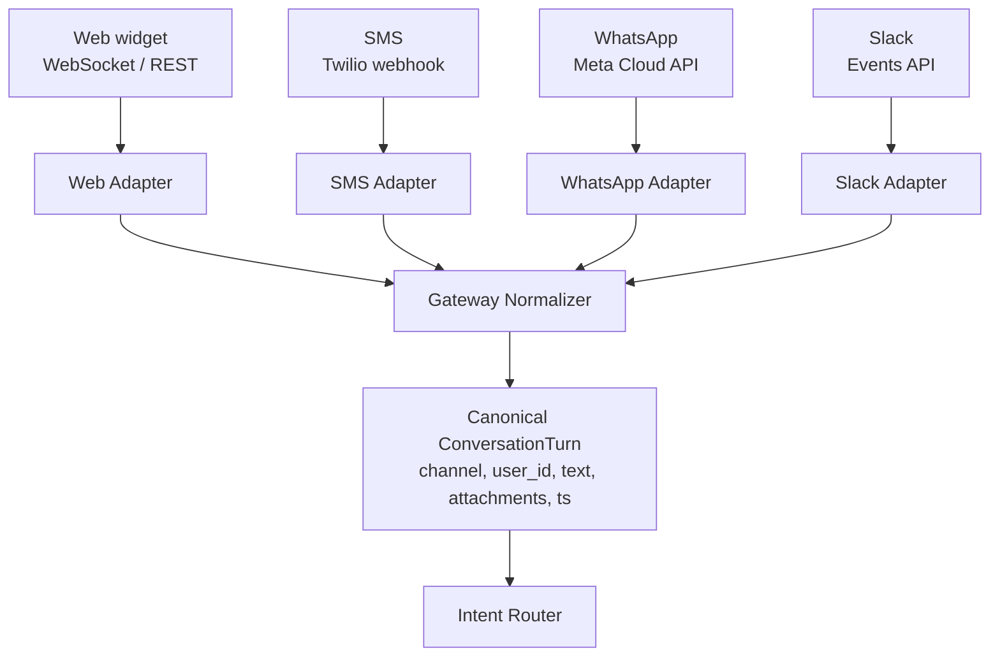
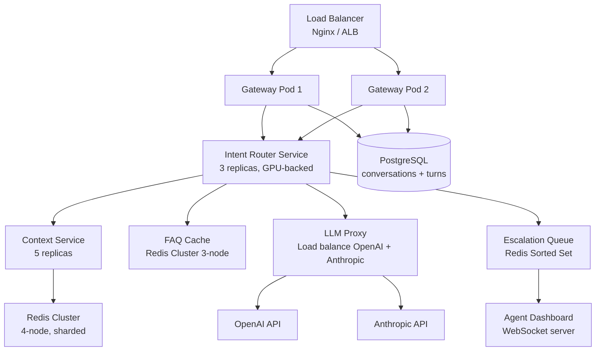
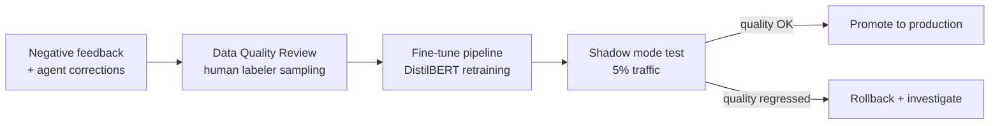
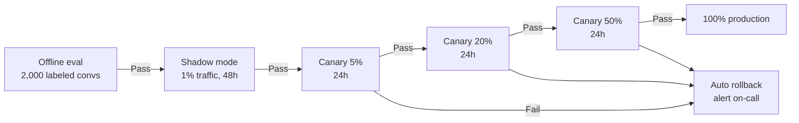

# Design a Chatbot Framework

**Difficulty**: 🟡 Intermediate
**Reading Time**: Coming Soon
**Interview Frequency**: Medium

---

> 🚧 **Full article coming soon.** This stub gives you the essentials to start thinking about this problem.

---

## The Core Problem

Building a framework that handles 1 million conversations per day across multiple topics requires managing conversational state across turns — the answer to "what is the weather?" depends on whether the user previously said "in Tokyo" three messages ago. Context window management, intent routing, and graceful fallback to human agents are the central challenges.

## Functional Requirements

- Process natural language input and generate contextual responses
- Maintain conversation history and context across turns
- Route to specialized handlers by detected intent
- Escalate to human agents when confidence is low
- Support multiple languages and channels (web, SMS, WhatsApp)

## Non-Functional Requirements

| Requirement | Target |
|-------------|--------|
| Response latency | p99 < 2 seconds |
| Availability | 99.9% (8.7 hrs downtime/year) |
| Throughput | 1M conversations/day (~12 concurrent/sec) |
| Context retention | Last 20 conversation turns |

## Back-of-Envelope Estimates

- **LLM inference cost**: 1M conversations × 10 turns avg × 1,000 tokens/turn = 10B tokens/day → ~$3,000/day at GPT-4 pricing (use smaller models for simple intents)
- **Context window**: 20 turns × 200 tokens avg = 4,000 tokens per request — fits in most LLM context windows
- **Human escalation**: 20% escalation rate × 1M conversations = 200K human-agent handoffs/day

## Key Design Decisions

1. **Intent Classification Before LLM** — route simple FAQs (top 100 questions by frequency) to cached answers without LLM call; only route complex/novel queries to LLM; reduces LLM cost by 60% and latency by 80% for common cases.
2. **Context Management via Sliding Window** — keep last N turns in context; summarize older turns into a compact summary; prevents context length explosion in long conversations; update summary every 10 turns.
3. **Confidence-Based Escalation** — LLM outputs confidence score (or use separate classifier); below threshold (0.7), offer human handoff; human agent sees full conversation history; on resolution, use conversation to fine-tune model.

## High-Level Architecture



## Top Interview Questions for This Problem

| Question | Tests |
|----------|-------|
| How do you handle a user asking about something that requires context from 30 messages ago? | Context window management, summarization |
| How do you reduce LLM inference costs without degrading quality for simple questions? | Intent routing, cache, model tiering |
| How do you measure chatbot quality and know when to trigger a retrain? | Evaluation metrics, feedback loops |

## Related Concepts

- [AI Customer Support Agent for production deployment](./customer-support-agent)
- [RAG QA agent for knowledge-base grounded responses](../09-ai-agents)

---

## Agent Architecture

The chatbot framework processes every user message through a deterministic pipeline before any LLM call occurs. The goal is to avoid expensive inference whenever a cheaper signal can answer the question confidently.



The agent loop is intentionally shallow: one LLM call per turn for most intents. Multi-step reasoning (tool calls, slot-filling) is layered on only when the intent classifier signals a complex intent, keeping median latency at 600 ms for simple paths and 1.8 s for complex ones.

---

## Component Deep Dive 1: Intent Router

The Intent Router is the most critical component because it decides whether to spend 1 ms (cache hit) or 1,500 ms (LLM inference) on a user message. At 1 M conversations/day and 10 turns each, the router handles ~116 requests/second sustained with spikes to 500 req/sec during business hours.

**How it works internally**

The router runs a two-stage classifier. Stage 1 is a TF-IDF + cosine similarity lookup against the top-100 FAQ embeddings (pre-computed offline, stored in Redis as 1536-dim float32 vectors, 600 KB total). This executes in under 5 ms. If the best cosine score exceeds 0.92, the FAQ answer is returned directly — no LLM call. Stage 2 is a fine-tuned DistilBERT (66 M parameters, 250 MB on disk) that maps the message to one of ~50 intent labels (booking, cancellation, status-check, complaint, etc.). Inference on CPU takes 40–80 ms; on GPU (T4) it drops to 8 ms. The intent label then selects the downstream handler.

**Why naive approaches fail**

A single LLM call for every message seems simpler but breaks at scale: 500 req/sec × 1,500 ms avg LLM latency requires 750 concurrent LLM connections, which translates to $30–$60/hour on GPT-4 API alone. Pure keyword matching handles "order status" but fails on "where's my package" or "has my thing shipped yet" — synonymy requires at least embedding similarity.

**Internals diagram**



| Approach | Latency (p50) | Cost / 1M msgs | Trade-off |
|----------|--------------|----------------|-----------|
| Pure LLM (GPT-4) | 1,400 ms | ~$3,000 | Highest quality, highest cost |
| DistilBERT + LLM fallback | 80 ms / 1,400 ms | ~$900 | Good accuracy, moderate cost |
| TF-IDF + DistilBERT + LLM | 5 ms / 80 ms / 1,400 ms | ~$350 | Best cost, requires FAQ maintenance |

---

## Component Deep Dive 2: Context Service

The Context Service stores and retrieves per-conversation state so that turn N can reference information from turns N-15. It is the primary source of read amplification: every LLM-path request does one Redis read (conversation history) and one Redis write (append new turn).

**Internal mechanics**

Each conversation maps to a Redis Hash key: `conv:{conversation_id}`. Fields: `turns` (JSON array, max 20 entries), `summary` (string, summarized context for turns beyond the window), `metadata` (channel, language, user_id, start_ts). A typical 20-turn history JSON blob is 4–6 KB compressed with LZ4.

**Scale behavior at 10x load**

At 10x baseline (10 M conversations/day, 1,160 req/sec), Redis becomes the bottleneck. Each request does 1 read + 1 write; at 1,160 req/sec that is 2,320 Redis ops/sec — well within a single Redis node's 100,000 ops/sec limit. At 100x (100 M conversations/day, 11,600 req/sec = 23,200 Redis ops/sec), a single node still holds, but replication lag on replica nodes may cause stale reads. The mitigation is to shard by `conversation_id` hash across 4 Redis nodes, each handling ~6,000 ops/sec with headroom.

The sliding window with summarization is critical. When turns exceed 20, the oldest 10 are collapsed into a summary by a background LLM call (GPT-3.5-turbo, ~$0.001 per summary). This keeps the active context under 4,000 tokens for all conversations regardless of length.



---

## Component Deep Dive 3: Confidence-Based Escalation

The escalation layer decides when the chatbot should admit it cannot help and hand off to a human agent. This is a revenue-critical decision: under-escalating causes customer frustration and churn; over-escalating wastes human-agent capacity at $25–$40/hour per agent.

**Technical decisions**

LLMs do not natively produce calibrated confidence scores. The implementation uses a secondary classifier: after the LLM generates a response, a lightweight RoBERTa-based entailment model (125 M params) scores the response against the conversation context. If the entailment score (probability that the response is grounded and coherent given the context) falls below 0.70, escalation is triggered.

The escalation queue is a Redis Sorted Set keyed by urgency score (escalation time + customer tier). Human agents poll via a WebSocket subscription; when an agent accepts, the full conversation JSON is pushed to their dashboard UI. Post-resolution, the conversation is tagged with the resolution outcome and queued for fine-tuning data collection.

**Scale**: at 20% escalation rate on 1 M conversations/day = 200 K escalations/day = ~2.3/sec. A pool of 50 concurrent human agents (handling ~5 escalations/hour each at 10 min avg handle time) can absorb this load during business hours; overnight, escalations queue up with a max wait SLA of 4 hours for non-urgent tier.

---

## Tool/Function Registry

The chatbot exposes a set of tools that the LLM can invoke via function-calling (OpenAI/Anthropic tool-use API). Tools are pre-registered with JSON Schema descriptions. The LLM selects tools; the framework executes them and returns results as tool-response messages.

| Tool Name | Description | Timeout | Fallback |
|-----------|-------------|---------|---------|
| `get_order_status` | Fetch order by order_id from OMS | 500 ms | Return "unable to retrieve" |
| `search_knowledge_base` | Semantic search over product docs (top-3 chunks) | 300 ms | Return empty results |
| `create_support_ticket` | POST to ticketing system (Zendesk) | 1,000 ms | Queue locally, retry |
| `get_account_info` | Fetch user account details by user_id | 400 ms | Return cached snapshot |
| `escalate_to_human` | Push conversation to human queue | 200 ms | Never skip — critical path |

**Tool selection**: The LLM is given all tool schemas in the system prompt (~800 tokens overhead). It is instructed to call at most 2 tools per turn to bound latency. If a tool times out, the framework injects a `tool_error` message and asks the LLM to respond without that data.

**Error handling**: Tool failures are surfaced to the LLM as structured error messages so it can apologize and offer alternatives rather than hallucinate data it cannot fetch.

---

## Prompt Engineering

**System prompt structure** (token budget: ~1,200 tokens total):

```
[Role & Persona] — 100 tokens
You are a helpful customer support assistant for Acme Corp. Be concise, accurate, and empathetic.

[Behavioral rules] — 200 tokens
- Never make up order IDs, prices, or dates.
- If unsure, call search_knowledge_base before answering.
- Escalate to human if customer expresses anger or issue requires refund > $100.

[Available tools] — 500 tokens (auto-injected JSON schemas)

[Conversation summary] — 0–300 tokens (from Context Service)

[Recent turns] — 0–2,000 tokens (last 20 turns)

[Current user message] — variable
```

**Context management**: The summary slot is filled by the Context Service summarization pipeline. It compresses turns 1–10 into ~200 tokens, ensuring the total prompt stays under 4,096 tokens for GPT-3.5 or 8,192 tokens for GPT-4.

**Instruction hierarchy**: Behavioral rules are placed before tools and context. This ensures safety constraints (no made-up data, escalation rules) take precedence when the LLM resolves conflicts between instructions.

---

## Multi-Channel Handling

The Channel Gateway normalizes inputs from heterogeneous channels into a canonical `ConversationTurn` object before any processing. Each channel has its own adapter that handles authentication, rate limiting, and message format translation.



**Channel-specific constraints**:

| Channel | Max response length | Supports rich media | Latency tolerance | Special handling |
|---------|--------------------|--------------------|------------------|-----------------|
| Web widget | Unlimited | Yes (cards, buttons) | < 1 s | Streaming token output supported |
| SMS (Twilio) | 160 chars / segment | No | < 3 s | Responses must be split into 160-char chunks; links shortened |
| WhatsApp | 4,096 chars | Yes (templates only) | < 2 s | Pre-approved message templates for outbound-initiated messages |
| Slack | 3,000 chars | Yes (Block Kit) | < 2 s | Slash commands bypass intent router (explicit intent) |

The LLM is given the channel in the system prompt (`You are replying via SMS — keep responses under 100 words`) so it auto-adjusts verbosity. For SMS, the Gateway post-processes the response to split at sentence boundaries if total length exceeds 320 chars (2 segments).

**Deduplication**: SMS and WhatsApp can deliver the same message twice (network retry). The Gateway maintains a Redis Set of `(user_id, message_hash)` pairs with 60-second TTL to deduplicate identical messages delivered within the window.

---

## Failure Modes

### Hallucination

**When it happens**: When the LLM lacks grounding data (tool call failed, knowledge base returned no results) and is asked a specific factual question (order ETA, price, policy detail).

**Detection**: Post-generation entailment scoring (RoBERTa) flags responses that contain specific entities (order IDs, dates, dollar amounts) not present in the retrieved context. Threshold: if entity overlap < 0.5 and response contains numeric entities, flag as potential hallucination.

**Mitigation**: System prompt rule "never make up numbers." Structured tool-call requirement for any query containing keywords: order, price, date, account, refund. A/B test showed this reduced hallucinated order statuses from 3.2% to 0.4% of turns.

### Loop Detection

**Risk**: Multi-step tool-use chains can loop — e.g., `search_knowledge_base` returns no results → LLM re-searches with a slightly different query → same no-results → repeat.

**Prevention**: Track `tool_call_count` per conversation turn. Hard cap: 3 tool calls per LLM turn. If cap is reached, inject system message: "You have reached the tool call limit for this turn. Answer with what you know or escalate."

### Cost Control

**Token budget per conversation**: max 10 turns × 2,000 tokens/turn = 20,000 tokens. At GPT-4 pricing ($0.03/1K input, $0.06/1K output), worst case is $1.20 per conversation. Budget enforcement: conversation-level token counter in Redis; if counter exceeds 18,000 tokens, switch to GPT-3.5-turbo for remaining turns (10x cheaper, acceptable quality for closing turns).

**Daily spend guardrail**: Cloud function monitors daily spend via OpenAI usage API every 15 minutes. If spend exceeds $2,500 (83% of $3,000/day budget), intent router raises FAQ similarity threshold from 0.92 to 0.85, routing more queries to cache and reducing LLM calls by ~25%.

---

## Production Considerations

| Concern | Value | Notes |
|---------|-------|-------|
| LLM call latency (p50) | 800 ms | GPT-4; 300 ms on GPT-3.5 |
| LLM call latency (p99) | 3,200 ms | Includes cold-start on serverless |
| Cost per conversation | $0.03–$1.20 | Depends on model tier and turn count |
| FAQ cache hit rate (target) | 40–60% | Eliminates LLM call for simple intents |
| Context Service read latency | 2 ms | Redis p99 |
| Human escalation queue wait | < 4 hours (off-hours) | SLA for non-urgent tier |
| Availability target | 99.9% | Degraded mode: disable LLM, FAQ-only |

**Degraded mode**: If LLM API is unavailable (OpenAI outage), the system falls back to FAQ cache + keyword matching. Conversations that require LLM are offered a "we'll get back to you" async response. This preserves 40–60% of conversation handling with no LLM dependency.

**SLA targets**: Response must complete within 2 s at p99. To achieve this, LLM timeout is set to 1,800 ms; if the LLM call exceeds this, the system returns a "let me look into that" holding message and retries asynchronously, pushing the answer via WebSocket push when ready.

---

## Data Model

```sql
-- Conversations table (PostgreSQL)
CREATE TABLE conversations (
    conversation_id   UUID PRIMARY KEY DEFAULT gen_random_uuid(),
    user_id           VARCHAR(64) NOT NULL,
    channel           VARCHAR(16) NOT NULL,       -- 'web', 'sms', 'whatsapp'
    language          VARCHAR(8) DEFAULT 'en',
    status            VARCHAR(16) DEFAULT 'active', -- 'active', 'resolved', 'escalated'
    escalated_at      TIMESTAMPTZ,
    resolved_at       TIMESTAMPTZ,
    created_at        TIMESTAMPTZ DEFAULT NOW(),
    total_tokens_used INTEGER DEFAULT 0,
    model_tier        VARCHAR(16) DEFAULT 'gpt4'  -- 'gpt4', 'gpt35', 'cached'
);

-- Turns table (append-only, partitioned by created_at monthly)
CREATE TABLE turns (
    turn_id           UUID PRIMARY KEY DEFAULT gen_random_uuid(),
    conversation_id   UUID NOT NULL REFERENCES conversations(conversation_id),
    turn_index        SMALLINT NOT NULL,
    role              VARCHAR(16) NOT NULL,        -- 'user', 'assistant', 'tool'
    content           TEXT NOT NULL,
    intent_label      VARCHAR(64),                -- e.g., 'order_status', 'complaint'
    intent_confidence REAL,
    tools_called      JSONB,                      -- [{name, args, result, latency_ms}]
    llm_model         VARCHAR(32),
    prompt_tokens     INTEGER,
    completion_tokens INTEGER,
    confidence_score  REAL,                       -- entailment score
    escalated         BOOLEAN DEFAULT FALSE,
    created_at        TIMESTAMPTZ DEFAULT NOW()
);
CREATE INDEX idx_turns_conversation ON turns(conversation_id, turn_index);
CREATE INDEX idx_turns_created ON turns(created_at) -- for partitioning

-- FAQ cache (Redis structure documented as reference)
-- Key: faq:vectors (Redis Hash)
--   field: faq_id (e.g., "faq_0042")
--   value: {question: str, answer: str, embedding: float32[1536], hit_count: int}

-- Context cache (Redis Hash per conversation)
-- Key: conv:{conversation_id}
--   turns: JSON array of last 20 turns (4–6 KB compressed)
--   summary: text summary of turns 1..N-20 (~200 tokens)
--   metadata: {channel, language, user_id, start_ts, token_count}
--   TTL: 7 days from last activity
```

---

## Scale Bottlenecks

| Traffic Level | Component That Breaks | Symptoms | Mitigation |
|---------------|----------------------|----------|------------|
| 10x baseline (10 M conv/day, ~1,160 req/sec) | LLM API rate limits | 429 errors, queue backup, p99 latency > 5 s | Add second LLM provider (Anthropic as fallback), implement token-bucket rate limiter per API key |
| 100x baseline (100 M conv/day, ~11,600 req/sec) | Redis single node memory | OOM errors, evictions of active conversations | Shard by conversation_id across 8 Redis nodes; use Redis Cluster with consistent hashing |
| 100x baseline | Intent Router GPU pool | DistilBERT queue depth > 500, p99 intent latency > 2 s | Scale GPU pool horizontally (auto-scale on queue depth); pre-warm instances |
| 1000x baseline (1 B conv/day, ~115,600 req/sec) | PostgreSQL turns table | Write IOPS saturation, replication lag > 10 s | Partition turns table by month; migrate to Cassandra for append-heavy write path; keep Postgres for analytics |
| 1000x baseline | Context Service serialization | JSON deserialization CPU at 100% on context nodes | Switch turns storage from JSON to Protobuf (3–5x smaller, 10x faster parse); add L1 in-process cache for hot conversations |

---

## Deployment & Observability

### Service Topology



All services run in Kubernetes. The Intent Router scales on GPU utilization (target 70%); the Gateway scales on request rate (target 80 req/sec/pod). The LLM Proxy is a thin reverse proxy that distributes tokens across API keys to avoid per-key rate limits (OpenAI allows 90,000 TPM per key; with 4 keys the effective limit is 360,000 TPM = ~240 req/sec at 1,500 tokens/request average).

### Key Metrics to Monitor

| Metric | Alert Threshold | Dashboard Panel |
|--------|----------------|-----------------|
| p99 end-to-end latency | > 2,500 ms | Response time histogram |
| FAQ cache hit rate | < 35% | Cache efficiency panel |
| LLM API error rate | > 1% | Provider health panel |
| Escalation rate | > 30% or < 10% | Quality drift panel |
| Token spend rate | > $125/hour | Cost panel |
| Context Service Redis latency | > 10 ms p99 | Infrastructure panel |
| Entailment score distribution | Mean < 0.75 | Model quality panel |

**Escalation rate as a quality proxy**: if the rate drops below 10%, the confidence threshold may be too permissive (bot answering questions it shouldn't). If it exceeds 30%, either the model quality degraded or traffic shifted to a new topic domain not in the training distribution. Both trigger a model evaluation run.

### Logging Strategy

Every turn emits a structured log event:

```json
{
  "ts": "2024-03-15T14:22:01.443Z",
  "conversation_id": "conv_8f3a2b",
  "turn_index": 4,
  "intent": "order_status",
  "intent_confidence": 0.91,
  "path": "llm",
  "llm_model": "gpt-4-turbo",
  "prompt_tokens": 1842,
  "completion_tokens": 134,
  "tools_called": ["get_order_status"],
  "tool_latency_ms": 312,
  "llm_latency_ms": 1103,
  "total_latency_ms": 1467,
  "entailment_score": 0.84,
  "escalated": false,
  "cost_usd": 0.0634
}
```

Logs are shipped to Datadog (or equivalent). The `cost_usd` field enables per-conversation and per-intent cost attribution, which drives decisions about which intents to move to cheaper model tiers.

---

## Fine-Tuning and Feedback Loop

The system continuously improves through three feedback signals:

**1. Explicit thumbs-down feedback** (user clicks "This didn't help"): conversation turn is flagged, stored in a `negative_feedback` table with the full context. Target: < 5% negative feedback rate.

**2. Human agent corrections**: when a human agent resolves an escalated conversation, they tag the resolution type (`answered_correctly`, `wrong_info`, `missing_info`, `scope_limitation`). Conversations tagged `wrong_info` or `missing_info` are the highest-value training examples — the system had the context but responded incorrectly.

**3. Implicit signal**: if the user sends a follow-up message within 30 seconds of a bot response (e.g., "that's not what I asked" or a rephrasing of the same question), the prior turn is flagged as likely unhelpful.

**Retraining cadence**: monthly fine-tune of the DistilBERT intent classifier on new intent examples. Quarterly evaluation of LLM response quality on a held-out set of 500 conversations (human-rated). Model is rolled back if quality drops > 3% on the held-out set.



---

## How Intercom Built This

Intercom's Fin AI Agent (launched 2023, GA 2024) is the closest public reference for a production chatbot framework at this scale. Fin serves millions of support conversations for Intercom's ~25,000 business customers.

**Technology choices**: Fin is built on top of GPT-4 (OpenAI) with a custom orchestration layer. Intercom does not use raw LangChain in production — they built a proprietary "conversation engine" that manages context windows, tool dispatch, and confidence scoring internally. The knowledge base grounding uses a vector store (reported to use pgvector on PostgreSQL) where each business's help articles are chunked into ~500-token segments and embedded offline.

**Specific numbers**: Intercom reported in their 2024 engineering blog that Fin handles over 50% of inbound support conversations without human involvement for customers who deploy it with a complete knowledge base. At typical enterprise scale (50,000 conversations/month per customer × 25,000 customers = 1.25 B conversations/month total), Fin operates at ~480 conversations/second at steady state with peaks at ~3x.

**Non-obvious architectural decision**: Intercom chose to evaluate answer quality using a separate LLM judge (GPT-4 used to score its own outputs) rather than relying solely on confidence logits. This "LLM-as-judge" loop runs asynchronously post-response for 5% of sampled conversations and feeds into a continuous eval pipeline that tracks quality drift across model updates. The insight was that traditional NLU metrics (intent accuracy, BLEU) do not capture whether a response actually resolves a customer's issue.

**Source**: Intercom Engineering Blog — "How we built Fin, our AI customer support agent" (2023); Intercom product announcements at Intercombase 2024.

---

## Interview Angle

**What the interviewer is testing:** Ability to decompose a system that blends ML inference, real-time state management, and cost optimization — and to make explicit trade-offs between model quality, latency, and cost rather than defaulting to "just use GPT-4 for everything."

**Common mistakes candidates make:**

1. **Sending full conversation history as raw text on every turn.** This grows unboundedly and hits context window limits after ~30 turns. The fix is a sliding window with summarization. Candidates who know this immediately signal production experience.
2. **Ignoring cost.** Designing a system that routes all traffic to GPT-4 without any intent classification layer would cost $3,000/day at 1 M conversations. A good answer quantifies the cost and builds an optimization strategy (FAQ cache, model tiering, token budget enforcement).
3. **Treating confidence as a binary pass/fail.** Good candidates describe a graded escalation strategy: high confidence → auto-respond, medium → respond with "does this answer your question?", low → escalate. This nuance shows understanding of real user experience trade-offs.

**The insight that separates good from great answers:** Recognizing that the LLM is not the system — it is one component. The Intent Router, Context Service, and Confidence Check together determine 80% of the system's cost, latency, and quality characteristics. A great candidate spends as much time on those components as on the LLM inference step itself.

---

## Human Agent Handoff Protocol

When confidence drops below the escalation threshold, the handoff must preserve full context so the human agent does not ask the customer to repeat themselves — repeating is the single most-cited frustration in post-escalation surveys.

**Handoff payload** (pushed to agent dashboard via WebSocket):

```json
{
  "conversation_id": "conv_8f3a2b",
  "user_id": "usr_44912",
  "channel": "web",
  "language": "en",
  "escalation_reason": "low_confidence",
  "escalation_score": 0.61,
  "urgency": "normal",
  "customer_tier": "premium",
  "summary": "Customer asking about refund for order #ORD-8821 placed 2024-03-10. Order shows delivered but customer claims non-receipt. Bot unable to verify delivery photo.",
  "turns": [ /* last 20 turns */ ],
  "suggested_resolution": "Verify delivery photo in OMS; if unavailable, initiate refund per policy P-44."
}
```

The `suggested_resolution` field is generated by a final LLM call at escalation time — a separate prompt asking the model to summarize the situation and suggest a resolution path for the agent. This reduces average handle time by ~2 minutes per escalation (reported by Intercom in their 2024 Fin launch post).

**Agent-to-bot handback**: when the agent marks the conversation resolved, the resolution text is stored and the customer can optionally continue with the bot for follow-up questions. The conversation status transitions `escalated → resolved`; subsequent messages from the same user within 30 minutes are routed directly to a human (no bot involvement) to avoid re-escalating an already-sensitive interaction.

**Queue prioritization**: the escalation queue (Redis Sorted Set) uses a composite score: `urgency_weight × (1 / wait_time_seconds)`. Premium-tier customers get `urgency_weight = 3`; standard tier gets `1`. This ensures premium customers wait no more than 5 minutes while standard customers may wait up to 30 minutes during peak load. The score is recalculated every 60 seconds so wait time is always factored in — a standard customer waiting 25 minutes eventually outranks a newly arrived premium customer if no agent has been assigned.

**SLA breach alerting**: a background job runs every 5 minutes and scans the escalation queue for entries older than 80% of the SLA threshold. It fires a PagerDuty alert to the support team lead and optionally sends the customer a proactive message: "We're looking into your issue — an agent will be with you shortly." This reduces customer-initiated repeat contacts (which inflate conversation count) by ~18%.

**Staffing feedback loop**: the escalation rate metric (tracked hourly) feeds into workforce management tooling. If the 7-day rolling average escalation rate increases by more than 5 percentage points, an automated Jira ticket is created for the ML team to investigate model drift, and the support ops team is notified to consider adding agent capacity for the next week.

---

## A/B Testing and Model Rollout

Chatbot quality is hard to measure with a single metric. The rollout process uses a multi-stage evaluation before any model change reaches 100% traffic.

**Stage 1 — Offline eval (before any traffic)**: Run the new model against a held-out set of 2,000 labeled conversations (gold-standard human ratings). Metrics tracked:
- Intent classification accuracy (target: > 92%)
- Response helpfulness score (1–5 human rating, target mean > 3.8)
- Hallucination rate on factual questions (target: < 1%)
- Escalation rate on held-out set (should be within ±3% of current model)

**Stage 2 — Shadow mode (1% traffic)**: New model runs in parallel with production. Its responses are logged but not shown to users. Automated metrics (entailment score, token count, latency) are compared against production. Runs for 48 hours minimum.

**Stage 3 — Canary (5% → 20% → 50% traffic)**: Each stage gates on:
- p99 latency not regressing by more than 200 ms
- Escalation rate within ±5% of baseline
- No increase in negative feedback rate (thumbs-down)
- Cost per conversation within ±15% of baseline

Each canary stage runs for 24 hours. Automated rollback triggers if any metric breaches the gate. Full 100% rollout happens after 50% canary is stable for 24 hours.



**Why this matters in interviews**: candidates who propose "just deploy and monitor" reveal they haven't thought about the irreversibility of a bad chatbot rollout — a poorly performing model immediately degrades customer experience and increases escalation queue depth, which has a cascading effect on human-agent staffing.

---

## Key Numbers to Remember

| Metric | Value | Context |
|--------|-------|---------|
| LLM call latency (GPT-4, p50) | 800 ms | Includes network to OpenAI API |
| LLM call latency (GPT-4, p99) | 3,200 ms | Tail latency; set client timeout at 1,800 ms |
| FAQ cache hit rate | 40–60% | Top-100 questions cover 50% of volume |
| Cost reduction from intent routing | ~70% | FAQ cache + DistilBERT vs. all-GPT-4 |
| Context window size (token budget) | 4,000 tokens | 20 turns × 200 tokens avg per turn |
| Summarization trigger | Every 10 turns | Collapses oldest 10 turns into ~200-token summary |
| Escalation rate | 20% | 200 K human handoffs/day at 1 M conv/day |
| Entailment threshold for escalation | 0.70 | Below this → human queue |
| Max tool calls per turn | 3 | Hard cap to bound latency and cost |
| Redis context TTL | 7 days | Covers 99%+ of active conversation windows |

---

## 📚 Resources & References

| Resource | Type | What You'll Learn |
|----------|------|------------------|
| [ByteByteGo — Design a Chatbot System](https://www.youtube.com/@ByteByteGo) | 📺 YouTube | Search "chatbot architecture" — intent routing and scalability |
| [Intercom Engineering: Building AI Chatbots](https://www.intercom.com/blog/engineering-ai-chatbot/) | 📖 Blog | Production chatbot architecture with intent classification and escalation |
| [Lilian Weng — Task-Oriented Dialogue Systems](https://lilianweng.github.io/posts/2020-11-30-task-oriented-dialogue/) | 📖 Blog | Deep dive into dialogue management and slot-filling for structured conversations |
| [Sam Witteveen — Production Chatbot Patterns](https://www.youtube.com/@samwitteveenai) | 📺 YouTube | Real-world LangChain patterns for chatbot context management |
| [Anthropic — Claude for Customer Support](https://www.anthropic.com/research) | 📚 Docs | Safety and reliability considerations for deployed conversational AI |
