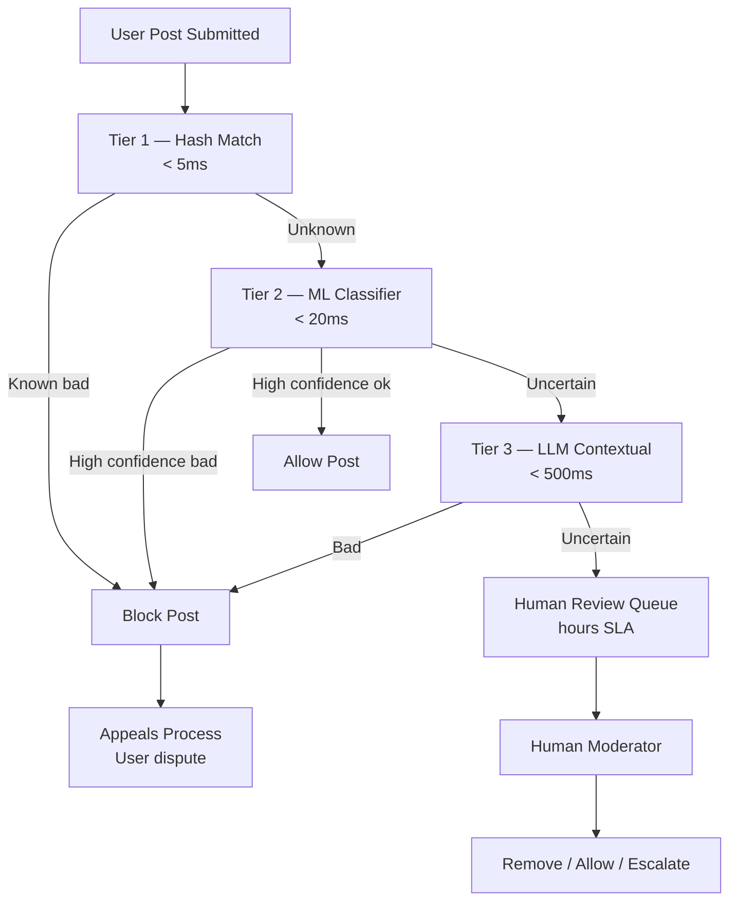

# Design an AI Content Moderation System

**Difficulty**: 🔴 Advanced
**Reading Time**: Coming Soon
**Interview Frequency**: High

---

> 🚧 **Full article coming soon.** This stub gives you the essentials to start thinking about this problem.

---

## The Core Problem

Reviewing 100 million posts per day for policy violations with under 100ms blocking decisions requires a tiered approach — no single AI model can be fast enough, cheap enough, and accurate enough for all content types. Violent extremism requires different signals than spam, and false positives that remove legitimate content are as damaging as false negatives that allow harmful content.

## Functional Requirements

- Automatically review text, image, and video content before/after publishing
- Block clear policy violations in under 100ms (synchronous)
- Queue ambiguous content for human review (async)
- Support appeals process for users who dispute moderation decisions
- Detect coordinated campaigns, not just individual violations

## Non-Functional Requirements

| Requirement | Target |
|-------------|--------|
| Blocking latency | p99 < 100ms for synchronous path |
| Throughput | 100M posts/day (~1,160/sec) |
| False positive rate | < 0.1% (legitimate content removed) |
| False negative rate | < 5% (violating content not removed) |

## Back-of-Envelope Estimates

- **Tier 1 (fast classifier)**: 1,160 posts/sec × 10ms per inference = 11.6 CPU-seconds/sec → ~12 CPU cores for tier 1
- **Human review volume**: 10% of 100M = 10M posts/day to human review → 10,000 moderators at 1,000 reviews/day
- **Appeal rate**: 1% of removed posts appealed × 5M removes/day = 50K appeals/day

## Key Design Decisions

1. **Tiered Moderation Pipeline** — Tier 1: fast rule-based + simple classifier (<5ms, blocks clear spam/known hashes); Tier 2: ML classifier (20ms, handles most text violations); Tier 3: LLM-based contextual review (500ms, edge cases); Tier 4: human review (hours, appeals + new violation types).
2. **PhotoDNA-style Hash Matching** — maintain database of hashes of known violating content (CSAM, terrorist propaganda); new content hashed and compared in <1ms; exact and near-duplicate matching via perceptual hashing; prevents re-sharing of known-bad content.
3. **Adversarial Robustness** — bad actors deliberately evade classifiers (misspellings, image perturbations, embedding bypass text in images); defense: diversify signals (OCR text in images, audio transcription in videos, account age/reputation), adversarial training.

## High-Level Architecture

## Top Interview Questions for This Problem

| Question | Tests |
|----------|-------|
| How do you handle a new type of harmful content that your model hasn't seen before? | Zero-shot generalization, human escalation |
| How would you reduce the 10M posts/day requiring human review to 1M? | Classifier threshold tuning, precision/recall |
| How do you handle context-dependent content (hunting photos vs violence)? | Contextual signals, account history |

## Related Concepts

- [Document processing agent for similar classification pipeline patterns](./document-processing-agent)
- [Customer support agent for similar human-in-the-loop escalation](./customer-support-agent)

---

*📚 Full deep-dive with multiple approaches, trade-off tables, and pseudocode coming soon.*

## 📚 Resources & References

| Resource | Type | What You'll Learn |
|----------|------|------------------|
| [Meta's Approach to Content Moderation at Scale](https://ai.meta.com/blog/hateful-memes-challenge-and-data-set/) | 📖 Blog | How Meta handles multimodal harmful content detection |
| [YouTube's Three-Stage Moderation Pipeline](https://blog.youtube/inside-youtube/our-ongoing-work-to-tackle-harassment/) | 📖 Blog | How YouTube combines ML and human review at 500 hours of video/minute |
| [Anthropic — Constitutional AI and Harmlessness](https://www.anthropic.com/research/constitutional-ai-harmlessness-from-ai-feedback) | 📖 Blog | AI-assisted content policy enforcement and calibration |
| [AI Explained — Content Moderation Systems](https://www.youtube.com/@AIExplained-official) | 📺 YouTube | Overview of ML approaches to automated content policy enforcement |
| [Trust & Safety Engineering at Twitter/X](https://blog.twitter.com/engineering/en_us/topics/insights/2023/twitter-recommendation-algorithm) | 📖 Blog | Signals and ranking used for content safety decisions at scale |
