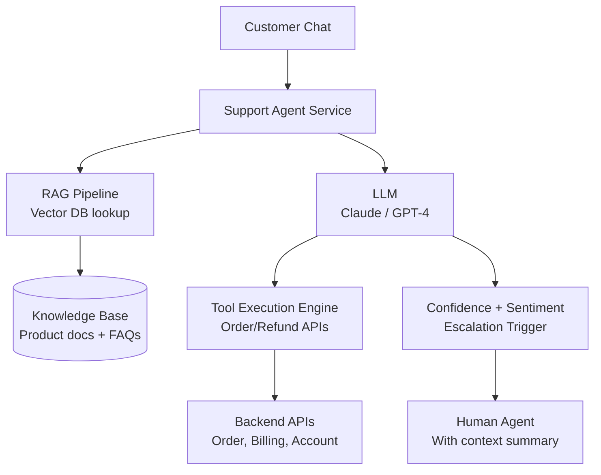

# Design an AI Customer Support Agent

**Difficulty**: 🟡 Intermediate
**Reading Time**: Coming Soon
**Interview Frequency**: Medium

---

> 🚧 **Full article coming soon.** This stub gives you the essentials to start thinking about this problem.

---

## The Core Problem

Automating 80% of support tickets while escalating complex cases to humans requires knowing where the boundary lies — if the confidence threshold is too high, too many easy tickets go to humans (expensive); too low and frustrated customers get wrong answers from the bot (damaging). The system must continuously learn from resolutions to move the boundary.

## Functional Requirements

- Automatically respond to customer support tickets via chat/email
- Retrieve relevant answers from a product knowledge base (RAG)
- Take actions via tools (check order status, process refund, update account)
- Escalate to human agents when confidence < threshold or user requests it
- Provide full conversation history to human agents on handoff

## Non-Functional Requirements

| Requirement | Target |
|-------------|--------|
| Auto-resolution rate | 80% of tickets (target) |
| Response latency | p99 < 5 seconds |
| Accuracy | < 2% harmful/incorrect responses |
| Scale | 100K tickets/day |

## Back-of-Envelope Estimates

- **Ticket rate**: 100K tickets/day ÷ 86,400 = ~1.2 tickets/sec
- **RAG retrieval**: 1.2 tickets/sec × 3 KB lookups = 3.6 KB/sec from vector DB — trivial
- **LLM cost**: 100K tickets × 2K tokens avg × $0.003/1K tokens = $600/day; compare vs $30/ticket human = $3M/day → ROI obvious

## Key Design Decisions

1. **RAG for Knowledge Base Grounding** — chunk product docs, FAQs, and past resolutions into 512-token chunks; embed with text-embedding-3-small; store in vector DB; retrieve top-5 relevant chunks per query; prevents hallucination of policy details.
2. **Tool Use for Actions** — agent can call: `check_order_status(order_id)`, `process_refund(order_id, amount)`, `update_shipping_address(order_id, address)`; each tool has pre-checks (is user authenticated? does order belong to this user?); agent proposes action, system confirms.
3. **Escalation with Warm Handoff** — when escalating, don't just end the bot session; compile: conversation summary, detected intent, confidence score, relevant KB articles already tried, customer sentiment score; human agent sees this instantly — no need to re-read full history.

## High-Level Architecture

## Top Interview Questions for This Problem

| Question | Tests |
|----------|-------|
| How do you prevent the agent from processing a refund without verifying customer identity? | Auth checks, tool guardrails |
| How do you measure whether the 80% auto-resolution rate is maintaining quality? | Human review sampling, CSAT comparison |
| How do you keep the knowledge base up to date as the product changes? | Doc sync pipeline, stale detection |

## Related Concepts

- [Chatbot framework for the underlying dialog infrastructure](./chatbot-framework)
- [Document processing agent for KB ingestion pipeline](./document-processing-agent)

---

*📚 Full deep-dive with multiple approaches, trade-off tables, and pseudocode coming soon.*

## 📚 Resources & References

| Resource | Type | What You'll Learn |
|----------|------|------------------|
| [Zendesk AI: How We Built Answer Bot](https://www.zendesk.com/blog/zendesk-ai-answer-bot/) | 📖 Blog | Production architecture for AI-assisted ticket resolution |
| [Salesforce Einstein: AI for Service Cloud](https://www.salesforce.com/blog/einstein-ai-service-cloud/) | 📖 Blog | LLM-powered agent assist and auto-resolution patterns |
| [Sam Witteveen — Customer Support Agent with LangChain](https://www.youtube.com/@samwitteveenai) | 📺 YouTube | End-to-end customer support agent with RAG and tool calling |
| [Lilian Weng — LLM Powered Autonomous Agents](https://lilianweng.github.io/posts/2023-06-23-agent/) | 📖 Blog | Tool-use and memory patterns for customer support context |
| [Anthropic — Claude for Enterprise Support](https://www.anthropic.com/research) | 📚 Docs | Safety constraints and guardrails for customer-facing AI agents |
