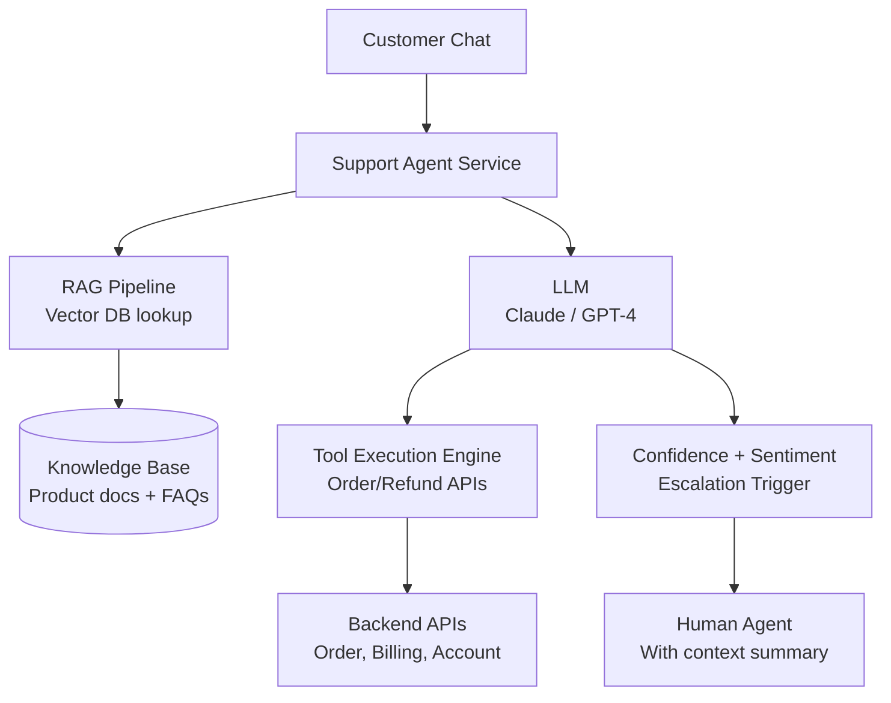
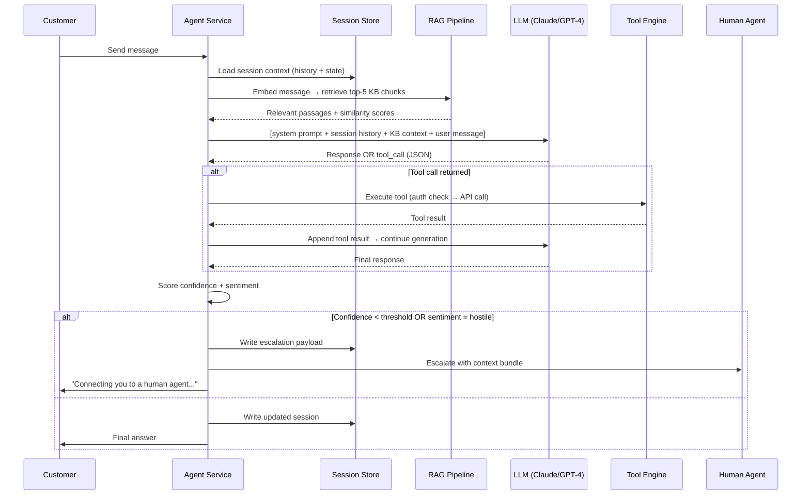

# Design an AI Customer Support Agent

**Difficulty**: 🟡 Intermediate
**Reading Time**: ~20 minutes
**Interview Frequency**: Medium

---

## The Core Problem

Automating 80% of support tickets while escalating complex cases to humans requires knowing where the boundary lies — if the confidence threshold is too high, too many easy tickets go to humans (expensive); too low and frustrated customers get wrong answers from the bot (damaging). The system must continuously learn from resolutions to move the boundary.

## Functional Requirements

- Automatically respond to customer support tickets via chat/email
- Retrieve relevant answers from a product knowledge base (RAG)
- Take actions via tools (check order status, process refund, update account)
- Escalate to human agents when confidence < threshold or user requests it
- Provide full conversation history to human agents on handoff

## Non-Functional Requirements

| Requirement | Target |
|-------------|--------|
| Auto-resolution rate | 80% of tickets (target) |
| Response latency | p99 < 5 seconds |
| Accuracy | < 2% harmful/incorrect responses |
| Scale | 100K tickets/day |

## Back-of-Envelope Estimates

- **Ticket rate**: 100K tickets/day ÷ 86,400 = ~1.2 tickets/sec
- **RAG retrieval**: 1.2 tickets/sec × 3 KB lookups = 3.6 KB/sec from vector DB — trivial
- **LLM cost**: 100K tickets × 2K tokens avg × $0.003/1K tokens = $600/day; compare vs $30/ticket human = $3M/day → ROI obvious

## Key Design Decisions

1. **RAG for Knowledge Base Grounding** — chunk product docs, FAQs, and past resolutions into 512-token chunks; embed with text-embedding-3-small; store in vector DB; retrieve top-5 relevant chunks per query; prevents hallucination of policy details.
2. **Tool Use for Actions** — agent can call: `check_order_status(order_id)`, `process_refund(order_id, amount)`, `update_shipping_address(order_id, address)`; each tool has pre-checks (is user authenticated? does order belong to this user?); agent proposes action, system confirms.
3. **Escalation with Warm Handoff** — when escalating, don't just end the bot session; compile: conversation summary, detected intent, confidence score, relevant KB articles already tried, customer sentiment score; human agent sees this instantly — no need to re-read full history.

## High-Level Architecture



## Top Interview Questions for This Problem

| Question | Tests |
|----------|-------|
| How do you prevent the agent from processing a refund without verifying customer identity? | Auth checks, tool guardrails |
| How do you measure whether the 80% auto-resolution rate is maintaining quality? | Human review sampling, CSAT comparison |
| How do you keep the knowledge base up to date as the product changes? | Doc sync pipeline, stale detection |

## Related Concepts

- [Chatbot framework for the underlying dialog infrastructure](./chatbot-framework)
- [Document processing agent for KB ingestion pipeline](./document-processing-agent)

---

## Agent Architecture

The agent processes each customer message through a structured loop: intent classification → context retrieval → tool selection → response generation → escalation check. Each iteration is stateful — the agent maintains a conversation session with accumulated context, retrieved KB passages, and action history.



The critical design choice here is **synchronous vs. streaming response delivery**. Streaming (server-sent events) starts sending tokens as they are generated — this reduces perceived latency from 4s to under 1s first-token latency, crucial for customer experience. Non-streaming waits until the full response is ready, which is simpler to implement but feels slow.

The agent loop has a **maximum turn budget** of 5 tool calls per conversation turn. Without this guard, the agent can enter a loop (calling `check_order_status` repeatedly because the result doesn't satisfy the LLM's expectations), burning tokens and time. The turn budget is tracked in session state and hard-stops the loop, falling back to a "I need more information" response.

---

## Tool/Function Registry

The tool registry is the bridge between the LLM and real backend systems. The LLM can only output text — the tool execution engine translates tool_call JSON into authenticated API calls, validates inputs, enforces rate limits, and returns structured results back to the LLM.

### Tool Definitions Passed to LLM

```json
[
  {
    "name": "check_order_status",
    "description": "Returns the current shipping status and ETA for a customer order. Use when the customer asks about their order, delivery, or tracking.",
    "parameters": {
      "order_id": {"type": "string", "description": "The order ID from the customer's account"}
    },
    "required": ["order_id"]
  },
  {
    "name": "process_refund",
    "description": "Initiates a refund for an eligible order. Only call when the customer explicitly requests a refund AND the order is within the 30-day refund window.",
    "parameters": {
      "order_id": {"type": "string"},
      "reason": {"type": "string", "enum": ["defective", "not_as_described", "changed_mind", "not_received"]},
      "amount_cents": {"type": "integer", "description": "Refund amount in cents. Use the full order amount unless partial refund is discussed."}
    },
    "required": ["order_id", "reason", "amount_cents"]
  },
  {
    "name": "lookup_account",
    "description": "Fetches account subscription tier, billing cycle, and account status for the authenticated customer.",
    "parameters": {},
    "required": []
  },
  {
    "name": "escalate_to_human",
    "description": "Transfer the conversation to a human agent. Use when the issue is too complex, the customer is distressed, or the resolution requires manual review.",
    "parameters": {
      "reason": {"type": "string"},
      "priority": {"type": "string", "enum": ["normal", "urgent"]}
    },
    "required": ["reason"]
  }
]
```

### Tool Selection Strategy

The LLM selects tools based on description clarity. The most common failure mode is the LLM hallucinating a tool that doesn't exist (especially after fine-tuning on older tool lists) — the tool engine must reject unknown tool names with a structured error that feeds back into the LLM context.

| Failure Mode | Root Cause | Mitigation |
|---|---|---|
| Hallucinated tool name | LLM training drift vs current registry | Strict schema validation; reject unknown names; feed error back to LLM |
| Missing required field | LLM omits parameter | JSON Schema validation; return field-level error; LLM can retry |
| Tool called on wrong customer data | No ownership check in LLM | Tool engine enforces `customer_id` = session `customer_id`; hard block |
| Refund called without eligibility | LLM can't check dates | Pre-condition check in tool engine: order_date > now-30days; return ineligibility reason |

### Error Handling Loop

When a tool returns an error, it is injected back into the LLM context as a `tool` role message. The LLM is expected to reason about the error and either retry with corrected parameters, choose a different tool, or acknowledge to the customer that the action failed. A maximum of 3 retries per tool per turn prevents infinite correction loops.

---

## Prompt Engineering

The system prompt is the most important engineering artifact in an AI agent — it is the specification that the LLM follows. Poorly structured system prompts are the #1 cause of harmful outputs, hallucinated tool calls, and incorrect escalation decisions.

### System Prompt Structure

```
# Identity and Role
You are an AI customer support agent for [Company]. Your goal is to resolve customer issues accurately and efficiently. You have access to the customer's order history and account information.

# Behavioral Constraints (MUST follow)
1. NEVER fabricate order IDs, tracking numbers, prices, or policy details. If you don't know, say so.
2. NEVER process a refund without first calling check_order_status to confirm the order exists.
3. NEVER promise outcomes you cannot guarantee ("your refund will arrive tomorrow").
4. If the customer uses profanity or threatening language, call escalate_to_human immediately with priority=urgent.

# Response Guidelines
- Keep responses under 150 words unless detailed explanation is needed.
- Use plain language. Avoid internal jargon.
- Confirm actions before executing: "I can process a refund of $49.99. Shall I proceed?"

# Context Injection (injected per request by RAG pipeline)
## Relevant Knowledge Base Passages
{kb_passages}

## Customer Session Context
Customer ID: {customer_id}
Account tier: {account_tier}
Conversation so far: {history}
```

### Context Window Management

At 100K tickets/day, conversation history grows quickly. The agent must stay within the LLM's context window (typically 128K tokens for GPT-4o, 200K for Claude 3.5). The strategy:

1. **Sliding window**: Keep the last 20 turns in full. Summarize earlier turns into a single "conversation summary" block using a cheap model (GPT-3.5 or Claude Haiku).
2. **KB passage budget**: Cap RAG-retrieved passages at 3,000 tokens total regardless of how many chunks are retrieved.
3. **Tool result truncation**: Truncate tool results > 500 tokens. Order status APIs can return large payloads; only the fields the LLM needs (status, ETA, carrier, tracking_number) are forwarded.

| Prompt Component | Token Budget | Priority |
|---|---|---|
| System prompt | 800 tokens | Fixed |
| Customer account context | 200 tokens | Fixed |
| RAG KB passages | 3,000 tokens | Dynamic (top-k) |
| Conversation history | up to 8,000 tokens | Sliding window |
| Tool results | 500 tokens per tool | Truncated |
| Current user message | ~150 tokens | Fixed |

---

## Failure Modes

### Hallucination

**When it happens**: The LLM generates a tracking number, refund amount, or policy detail that does not exist in the knowledge base or tool results. This happens most when:
- No KB passages were retrieved (low-similarity query)
- The KB passages are outdated (policy changed last week)
- The LLM is asked about a topic outside its training data

**Detection**: Post-generation grounding check — compare any numeric values (order IDs, amounts, dates) in the response against the tool results and KB passages returned in that turn. If a number appears in the response that doesn't appear in the grounding context, flag it.

**Mitigation**:
1. Explicit instruction in system prompt: "Only state facts that appear in the KB passages or tool results. If you cannot find the answer, say: 'I don't have that information. Let me connect you with a specialist.'"
2. Retrieval threshold: If max cosine similarity from RAG < 0.6, skip KB context entirely and instruct the LLM to escalate rather than guess.
3. Human review sampling: 5% of all auto-resolved tickets are randomly sampled for human review. If the accuracy drops below 98%, the escalation threshold is lowered automatically.

### Loop Detection

**The failure**: The agent calls the same tool repeatedly because the result doesn't satisfy the current prompt state. Example: the LLM calls `check_order_status` → gets "Delivered" → asks the customer "Is there anything else?" → customer says "But I never got it" → LLM calls `check_order_status` again in a loop.

**Mitigation**: Per-tool call counter in session state. If the same tool is called more than 3 times in a session, the tool engine returns a synthetic error: `"max_calls_exceeded: tool check_order_status has been called 3 times. Escalate to human agent."` This error is injected into the LLM context, forcing escalation.

### Cost Control

Each support conversation costs real money. At GPT-4o pricing ($5 per 1M input tokens, $15 per 1M output tokens), a conversation with 10 turns and 3 tool calls uses approximately:
- Input: 10 turns × 1,200 tokens + 3 tool results × 400 tokens = 13,200 tokens → $0.066
- Output: 10 turns × 200 tokens = 2,000 tokens → $0.030
- Total: ~$0.10 per conversation

Token budget enforcement:
1. **Hard cap**: If a conversation exceeds 20,000 input tokens, auto-escalate. This catches adversarial users who try to "jailbreak" the agent by sending very long messages.
2. **Model tiering**: Use Claude Haiku ($0.00025/1K tokens) for intent classification and summarization tasks. Reserve GPT-4o or Claude Sonnet only for the main generation step.
3. **Caching**: System prompt + static KB sections are prefix-cached (Anthropic's prompt caching reduces cost by 90% for the static prefix after the first call). At 100K tickets/day, this saves approximately $450/day.

---

## Production Considerations

### Latency Budget

End-to-end p99 target is 5 seconds. The breakdown:

| Step | p50 | p99 | Notes |
|---|---|---|---|
| Session load (Redis) | 2ms | 10ms | Hot path, in-memory |
| RAG embedding call | 50ms | 200ms | text-embedding-3-small, batched |
| Vector DB retrieval (Pinecone) | 20ms | 80ms | Top-5 search, 1M vectors |
| LLM generation (Claude Sonnet) | 800ms | 3,500ms | Streaming, first token < 300ms |
| Tool API call (if needed) | 100ms | 500ms | Internal microservice |
| Session write (Redis) | 2ms | 10ms | Async, non-blocking |
| **Total** | **~1s** | **~4.3s** | Comfortably within 5s SLA |

Streaming response delivery is non-negotiable for p99 compliance. Without streaming, the customer waits for the full 3.5s before seeing any text, which feels broken. With streaming, the first tokens appear in < 300ms.

### SLA and Fallback Path

When the LLM API is unavailable (happens ~0.1% of the time at major providers), the system must fall back gracefully:

1. **Level 1 fallback**: Switch from Claude Sonnet to Claude Haiku — lower quality but still useful.
2. **Level 2 fallback**: Switch from generative response to BM25 keyword search over FAQ articles. Return the top match with a disclaimer.
3. **Level 3 fallback**: Route all tickets to human agents. Auto-scale the human queue.

The fallback chain is implemented as a circuit breaker per model. When error rate > 5% over 30 seconds, the circuit opens and the next level is used.

### Cost Per Query

| Model | Avg cost/ticket | At 100K tickets/day |
|---|---|---|
| GPT-4o | $0.10 | $10,000/day |
| Claude Sonnet 3.5 | $0.06 | $6,000/day |
| Claude Haiku (with caching) | $0.008 | $800/day |
| BM25 fallback | ~$0 | ~$0 |

The production system uses Claude Haiku for 60% of tickets (simple FAQ lookups), Claude Sonnet for 35% (tool-use required), and GPT-4o for 5% (complex cases needing high reasoning quality). Average blended cost: ~$0.025/ticket → $2,500/day at 100K tickets.

---

## How Intercom Built This

Intercom launched Fin, their AI customer support agent, in 2023. By 2024 it was handling over 50% of all support conversations across their customer base with a measured resolution rate of 45-60% (varies heavily by industry vertical). Their architecture and learnings are directly applicable.

**Technology Choices**: Fin is built on GPT-4 (later GPT-4o) as the generation backbone. They built their own RAG pipeline on top of their existing Intercom messenger infrastructure rather than using an off-the-shelf RAG framework. Knowledge base ingestion uses chunking at heading boundaries (not fixed-token chunks) — they found that semantic chunking at document structure boundaries improved retrieval precision by ~15% vs 512-token fixed chunks.

**Key Numbers**: At peak load, Fin handles ~3,000 simultaneous conversations. Each conversation consumes ~1,500 tokens/turn on average. Their infrastructure cost for LLM API calls runs approximately $2M/year at scale. They measure resolution rate, CSAT for AI-resolved vs human-resolved tickets, and "unnecessary escalation rate" (tickets the bot escalated that a human resolved in under 2 minutes, indicating the bot could have handled it).

**The Non-Obvious Decision**: Intercom discovered that showing the customer what the bot is "doing" (e.g., "Looking up your order...") dramatically increases perceived reliability and willingness to trust the AI response. They built a typing indicator + action disclosure pattern — the bot streams "Checking your order status..." before the tool call completes. This single UX change increased CSAT scores for AI-resolved tickets by 12 points.

**What They Learned**: The biggest quality issue was not hallucination — it was the agent giving technically correct but contextually wrong answers. For example, answering "How do I cancel?" with the general cancellation policy when the customer had a special promotional plan with different cancellation terms. Solution: inject customer account tier and plan details into every LLM context so answers are personalized, not generic.

Source: [Intercom Fin engineering blog](https://www.intercom.com/blog/fin-our-ai-customer-service-agent/), Intercom CEO Des Traynor interviews, 2023-2024.

---

## Interview Angle

**What the interviewer is testing**: Can you reason about the reliability boundary between AI autonomy and human oversight? The problem is not "how to build a chatbot" — it is "how to calibrate trust in an automated system that makes consequential decisions."

**Common mistakes candidates make**:

1. **Designing for the happy path only** — describing the RAG → LLM → response flow without addressing what happens when the LLM is wrong, the KB is stale, or the tool API is down. Interviewers will probe: "What if the agent processes a refund for the wrong customer?" Candidates who haven't thought about auth guardrails in the tool engine have no answer.

2. **Treating escalation as a binary** — saying "escalate when confidence < 0.5" without defining how confidence is measured, how the threshold is calibrated, or what a "warm handoff" looks like. The quality of the escalation handoff (context bundle passed to the human) is more important than the escalation decision itself.

3. **Ignoring cost** — designing a system where every ticket goes through GPT-4o for every step. A good answer uses model tiering: fast/cheap model for intent classification and history summarization, powerful model only for complex generation steps.

**The insight that separates good from great answers**: Great candidates recognize that the hardest part of this system is not the AI — it is the feedback loop. The agent's performance degrades as the product changes (new features, updated policies, changed pricing). Without a continuous pipeline that detects stale KB content, re-embeds updated documents, and samples resolved tickets to measure accuracy drift, the 80% resolution rate becomes 60% over 6 months without anyone noticing.

---

## Data Model

```sql
-- Session storage (Postgres, replicated to Redis for hot access)
CREATE TABLE support_sessions (
    session_id          UUID PRIMARY KEY DEFAULT gen_random_uuid(),
    customer_id         VARCHAR(64) NOT NULL,
    channel             VARCHAR(20) NOT NULL CHECK (channel IN ('chat', 'email', 'api')),
    status              VARCHAR(20) NOT NULL DEFAULT 'active' 
                            CHECK (status IN ('active', 'resolved_ai', 'resolved_human', 'escalated', 'abandoned')),
    intent              VARCHAR(64),                        -- classified intent (order_status, refund, etc.)
    confidence_score    FLOAT,                             -- final confidence at resolution
    sentiment_score     FLOAT,                             -- customer sentiment (-1 to 1)
    turn_count          INT NOT NULL DEFAULT 0,
    tool_call_count     INT NOT NULL DEFAULT 0,
    total_tokens_used   INT NOT NULL DEFAULT 0,
    escalated_at        TIMESTAMPTZ,
    resolved_at         TIMESTAMPTZ,
    created_at          TIMESTAMPTZ NOT NULL DEFAULT now(),
    updated_at          TIMESTAMPTZ NOT NULL DEFAULT now()
);

CREATE INDEX idx_sessions_customer ON support_sessions(customer_id);
CREATE INDEX idx_sessions_status ON support_sessions(status);
CREATE INDEX idx_sessions_created ON support_sessions(created_at);

-- Conversation turns (append-only)
CREATE TABLE conversation_turns (
    turn_id             UUID PRIMARY KEY DEFAULT gen_random_uuid(),
    session_id          UUID NOT NULL REFERENCES support_sessions(session_id),
    turn_index          INT NOT NULL,
    role                VARCHAR(20) NOT NULL CHECK (role IN ('user', 'assistant', 'tool', 'system')),
    content             TEXT NOT NULL,
    tool_name           VARCHAR(64),                        -- populated when role = 'tool'
    tool_input          JSONB,
    tool_output         JSONB,
    input_tokens        INT,
    output_tokens       INT,
    latency_ms          INT,
    created_at          TIMESTAMPTZ NOT NULL DEFAULT now()
);

CREATE INDEX idx_turns_session ON conversation_turns(session_id, turn_index);

-- Escalation payloads (what human agent sees)
CREATE TABLE escalation_bundles (
    bundle_id           UUID PRIMARY KEY DEFAULT gen_random_uuid(),
    session_id          UUID NOT NULL REFERENCES support_sessions(session_id),
    customer_id         VARCHAR(64) NOT NULL,
    escalation_reason   TEXT NOT NULL,
    priority            VARCHAR(10) NOT NULL DEFAULT 'normal' CHECK (priority IN ('normal', 'urgent')),
    conversation_summary TEXT NOT NULL,                     -- LLM-generated summary
    detected_intent     VARCHAR(64),
    sentiment_score     FLOAT,
    kb_articles_tried   JSONB,                              -- [{article_id, title, similarity_score}]
    tools_called        JSONB,                              -- [{tool_name, input, output, success}]
    assigned_agent_id   VARCHAR(64),
    assigned_at         TIMESTAMPTZ,
    created_at          TIMESTAMPTZ NOT NULL DEFAULT now()
);

-- Knowledge base chunks (vector DB metadata mirrored to Postgres)
CREATE TABLE kb_chunks (
    chunk_id            UUID PRIMARY KEY DEFAULT gen_random_uuid(),
    source_document_id  VARCHAR(128) NOT NULL,
    source_url          TEXT,
    title               VARCHAR(256) NOT NULL,
    content             TEXT NOT NULL,
    content_hash        CHAR(64) NOT NULL,                  -- SHA-256, for stale detection
    chunk_index         INT NOT NULL,
    embedding_model     VARCHAR(64) NOT NULL DEFAULT 'text-embedding-3-small',
    vector_db_id        VARCHAR(128),                       -- Pinecone vector ID
    is_active           BOOLEAN NOT NULL DEFAULT true,
    last_synced_at      TIMESTAMPTZ NOT NULL DEFAULT now(),
    created_at          TIMESTAMPTZ NOT NULL DEFAULT now()
);

CREATE UNIQUE INDEX idx_chunks_doc_index ON kb_chunks(source_document_id, chunk_index);
CREATE INDEX idx_chunks_active ON kb_chunks(is_active);
CREATE INDEX idx_chunks_hash ON kb_chunks(content_hash);

-- Resolution feedback (for accuracy monitoring)
CREATE TABLE resolution_feedback (
    feedback_id         UUID PRIMARY KEY DEFAULT gen_random_uuid(),
    session_id          UUID NOT NULL REFERENCES support_sessions(session_id),
    feedback_type       VARCHAR(20) CHECK (feedback_type IN ('csat', 'human_review', 'customer_correction')),
    csat_score          INT CHECK (csat_score BETWEEN 1 AND 5),
    was_accurate        BOOLEAN,                            -- human reviewer judgment
    reviewer_id         VARCHAR(64),
    notes               TEXT,
    created_at          TIMESTAMPTZ NOT NULL DEFAULT now()
);
```

---

## Scale Bottlenecks

| Traffic Level | Component That Breaks | Symptoms | Mitigation |
|---|---|---|---|
| 10x baseline (1.2M tickets/day) | LLM API rate limits | 429 errors, p99 latency spikes to 15s | Pre-negotiate higher rate limits; add request queue with backpressure; route across multiple API keys or providers |
| 10x baseline | RAG vector DB (Pinecone) | Query latency increases from 80ms to 800ms at >10K QPS | Shard the index by customer segment; use Pinecone's replicated pods; add Redis caching for top-100 most-queried KB chunks |
| 10x baseline | Session store (Redis) | Memory exhaustion; OOM kills | Set TTL on sessions (24h); use Redis cluster with 3 shards; compress conversation history > 5 turns |
| 100x baseline (12M tickets/day) | Single LLM provider | Any provider outage = full system outage | Multi-provider routing: primary Claude, secondary GPT-4o, tertiary Gemini; circuit breaker per provider |
| 100x baseline | Postgres (session writes) | Write latency > 100ms; replication lag | Move session writes to async (write to Redis first, drain to Postgres via worker); partition sessions table by month |
| 100x baseline | Tool Engine | Order API at 15K calls/sec overwhelms downstream services | Per-tool rate limiting; cache order status results for 30s (most customers check status multiple times in one session) |
| 1000x baseline (120M tickets/day) | Entire architecture | No single component works at this scale | Regional deployment (3+ regions); per-region LLM endpoints; knowledge base replicated per-region; async ticket processing for non-real-time channels (email) |

---

## Key Numbers to Remember

| Metric | Value | Context |
|---|---|---|
| Auto-resolution target | 80% of tickets | Industry best-in-class; baseline without AI ~30% |
| LLM cost per ticket | $0.025–$0.10 | Blended model tiering; GPT-4o alone = $0.10 |
| Human agent cost per ticket | $8–$30 | Fully-loaded cost including overhead |
| RAG retrieval latency | 20–80ms | Pinecone at 1M vectors, top-5 search |
| First token latency (streaming) | <300ms | Claude Sonnet / GPT-4o with streaming |
| p99 end-to-end latency | <5 seconds | With 1 tool call; without tool call ~2s |
| Context window budget | ~12,200 tokens/turn | System (800) + KB (3,000) + history (8,000) + user (150) + tools (250) |
| Tool call max per turn | 5 calls | Hard guard to prevent agent loops |
| KB chunk size | 512 tokens | Fixed; semantic chunking improves precision 15% |
| Escalation threshold | Confidence < 0.6 | Calibrate per vertical; e-commerce vs healthcare differ |
| Human review sample rate | 5% | For accuracy monitoring and threshold calibration |
| Prompt cache savings | 90% reduction | On static system prompt + KB prefix with Anthropic caching |

---

## 📚 Resources & References

| Resource | Type | What You'll Learn |
|----------|------|------------------|
| [Zendesk AI: How We Built Answer Bot](https://www.zendesk.com/blog/zendesk-ai-answer-bot/) | 📖 Blog | Production architecture for AI-assisted ticket resolution |
| [Salesforce Einstein: AI for Service Cloud](https://www.salesforce.com/blog/einstein-ai-service-cloud/) | 📖 Blog | LLM-powered agent assist and auto-resolution patterns |
| [Sam Witteveen — Customer Support Agent with LangChain](https://www.youtube.com/@samwitteveenai) | 📺 YouTube | End-to-end customer support agent with RAG and tool calling |
| [Lilian Weng — LLM Powered Autonomous Agents](https://lilianweng.github.io/posts/2023-06-23-agent/) | 📖 Blog | Tool-use and memory patterns for customer support context |
| [Anthropic — Claude for Enterprise Support](https://www.anthropic.com/research) | 📚 Docs | Safety constraints and guardrails for customer-facing AI agents |
| [Intercom Fin AI Agent Launch](https://www.intercom.com/blog/fin-our-ai-customer-service-agent/) | 📖 Blog | Real production architecture, resolution rates, and lessons learned |
| [Anthropic — Building Effective Agents](https://www.anthropic.com/research/building-effective-agents) | 📚 Docs | Tool use patterns, loop prevention, and agent reliability |
