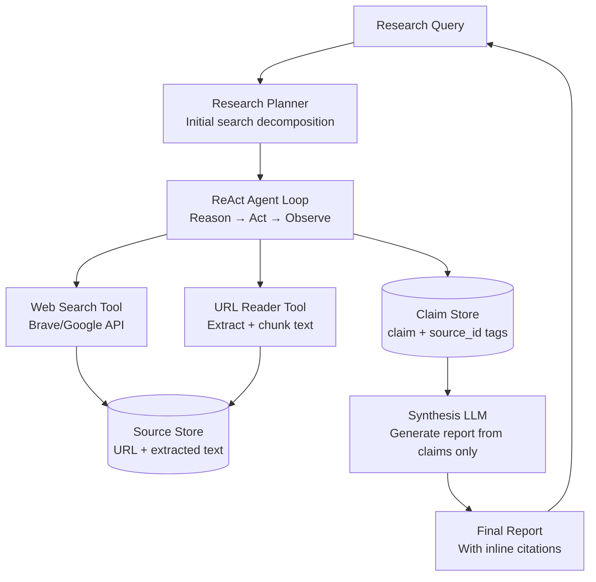

# Design a Deep Research Agent

**Difficulty**: 🔴 Advanced
**Reading Time**: Coming Soon
**Interview Frequency**: High

---

> 🚧 **Full article coming soon.** This stub gives you the essentials to start thinking about this problem.

---

## The Core Problem

Autonomously researching a topic by searching the web, reading sources, and synthesizing findings into a coherent report requires an agent that can plan multi-step searches, decide when it has enough information, and detect contradictions across sources — all without hallucinating facts or losing track of which claim came from which source.

## Functional Requirements

- Accept a research question or topic
- Autonomously search the web, read relevant articles, and follow citations
- Synthesize findings into a structured report with inline citations
- Track which claims are supported by which sources
- Allow user to request deeper investigation on subtopics

## Non-Functional Requirements

| Requirement | Target |
|-------------|--------|
| Research depth | 10-50 sources per question |
| Completion time | < 5 minutes for standard research |
| Hallucination rate | < 1% ungrounded claims |
| Citation accuracy | 100% of claims link to real source |

## Back-of-Envelope Estimates

- **LLM calls per research task**: 5 search queries × 3 read/summarize iterations × 2 synthesis passes = ~30 LLM calls at avg 2K tokens = 60K tokens/task → ~$0.18/task at Claude Sonnet pricing
- **Web pages read**: 50 sources × avg 10KB extracted text = 500KB per research task
- **Agent loop iterations**: Typical research completes in 10-20 ReAct iterations before deciding "sufficient evidence"

## Key Design Decisions

1. **ReAct Loop (Reason + Act)** — alternate between: THINK (what do I know, what's missing, what to search next?), ACT (call search tool or read_url tool), OBSERVE (parse result); continue until stopping condition (sufficient coverage or iteration limit); grounding each reasoning step in observations prevents drift.
2. **Citation Tracking via Source Attribution** — when extracting claims from a source, tag each claim with source_id; never allow claim to enter synthesis step without source tag; final report generation step can only use tagged claims; untagged claims are flagged for review.
3. **Deduplication and Cross-Referencing** — after reading N sources, cluster similar claims by semantic embedding; contradictory claims (two sources disagree on a fact) flagged for special treatment (report both with sources); this detects fake news and outdated information.

## High-Level Architecture

## Top Interview Questions for This Problem

| Question | Tests |
|----------|-------|
| How do you prevent the agent from hallucinating facts not in any source? | Grounded generation, citation enforcement |
| How do you decide when the agent has done enough research and should stop? | Stopping criteria, coverage scoring |
| How would you handle conflicting information from two reputable sources? | Contradiction detection, dual citation |

## Related Concepts

- [Document processing agent for reading and extracting from sources](./document-processing-agent)
- [Multi-agent orchestration for parallelizing research subtasks](/16-system-design-problems/09-ai-agents)

---

*📚 Full deep-dive with multiple approaches, trade-off tables, and pseudocode coming soon.*

## 📚 Resources & References

| Resource | Type | What You'll Learn |
|----------|------|------------------|
| [OpenAI Deep Research System Card](https://openai.com/research) | 📚 Docs | How OpenAI's deep research agent plans and executes multi-step web research |
| [Perplexity Engineering: Building an Answer Engine](https://blog.perplexity.ai/blog/introducing-pplx-api) | 📖 Blog | Search-augmented generation pipeline at production scale |
| [Lilian Weng — LLM Powered Autonomous Agents](https://lilianweng.github.io/posts/2023-06-23-agent/) | 📖 Blog | Planning, memory, and tool-use patterns for research agents |
| [AI Explained — Deep Research Agent Breakdown](https://www.youtube.com/@AIExplained-official) | 📺 YouTube | Analysis of multi-step research agent architectures and limitations |
| [Sam Witteveen — Building Research Agents](https://www.youtube.com/@samwitteveenai) | 📺 YouTube | Practical implementation of iterative web search + synthesis agents |
