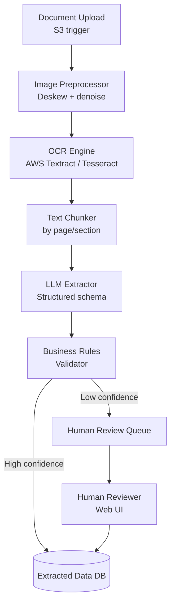
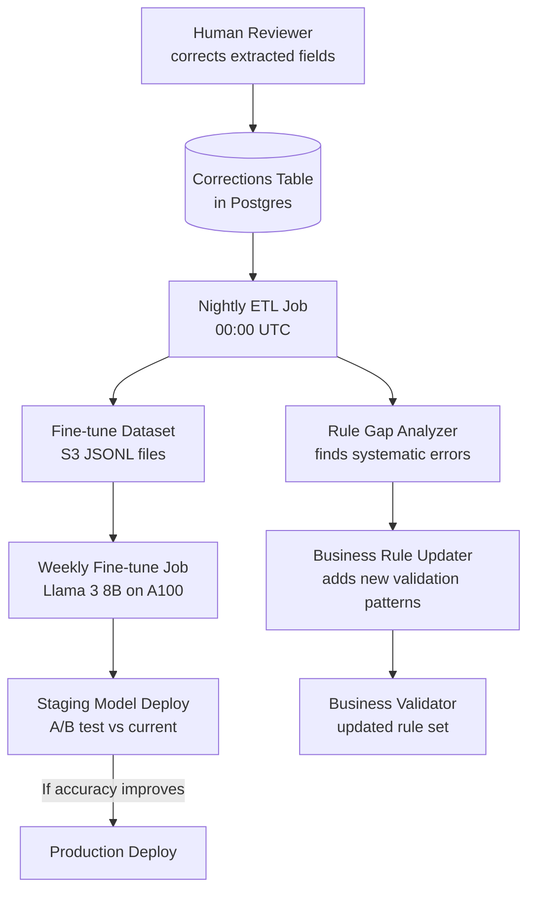
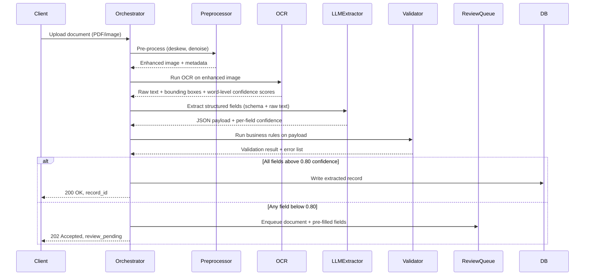

# Design a Document Processing Agent

**Difficulty**: 🟡 Intermediate
**Reading Time**: Coming Soon
**Interview Frequency**: Medium

---

> 🚧 **Full article coming soon.** This stub gives you the essentials to start thinking about this problem.

---

## The Core Problem

Processing 1 million documents per day (PDFs, images, Word files) to extract structured data — invoice amounts, contract dates, medical records — requires a pipeline that handles format diversity, OCR quality variance, and validation accuracy. A 2% extraction error rate on invoice amounts means 20,000 billing errors per day.

## Functional Requirements

- Ingest documents in multiple formats (PDF, DOCX, PNG, JPEG, TIFF)
- Extract structured fields (dates, amounts, names, addresses)
- Validate extracted data against business rules
- Route low-confidence extractions to human review queue
- Store extracted data with source document reference

## Non-Functional Requirements

| Requirement | Target |
|-------------|--------|
| Processing throughput | 1M documents/day (~11.6/sec) |
| Extraction accuracy | > 98% for well-formatted documents |
| Human review rate | < 5% requiring human intervention |
| End-to-end latency | < 30 seconds per document |

## Back-of-Envelope Estimates

- **OCR cost**: 11.6 docs/sec × 5 pages avg × $0.0015/page (AWS Textract) = $75K/day → consider self-hosted OCR for high volume
- **LLM extraction cost**: 11.6 docs/sec × 2K tokens/doc × $0.003/1K tokens = ~$200/day
- **Human review queue**: 5% × 1M/day = 50K documents/day requiring human attention → ~50 reviewers at 1,000 docs/reviewer/day

## Key Design Decisions

1. **Pre-processing Before OCR** — deskew, denoise, and enhance contrast before OCR; a 10-degree tilt degrades OCR accuracy by 20%; image pre-processing adds 200ms but improves downstream extraction quality significantly.
2. **Structured Extraction with Schema** — use LLM with explicit JSON schema and field descriptions; extract invoice: `{total_amount: float, date: "YYYY-MM-DD", vendor_name: str}`; enforce schema validation after extraction; reject/retry if schema invalid.
3. **Confidence Scoring for Human Routing** — assign confidence score per field based on: OCR confidence, extraction repeatability (run 3x and check agreement), business rule validation (amount > 0, date is valid); if any field below 0.8, route document to human review.

## High-Level Architecture



## Top Interview Questions for This Problem

| Question | Tests |
|----------|-------|
| How do you handle a scan of a handwritten document with poor quality? | OCR fallback, human routing |
| How would you extract tables from a PDF invoice? | Table detection, structure extraction |
| How do you improve extraction accuracy over time using human review corrections? | Active learning, fine-tuning loop |

## Related Concepts

- [Customer support agent using similar RAG/extraction patterns](./customer-support-agent)
- [Content moderation agent for similar high-throughput review pipeline](./content-moderation-agent)

---

## Component Deep Dive 1: OCR Engine

The OCR engine is the most critical and most expensive component in the pipeline. Its output quality is the ceiling on everything downstream — if OCR misreads "8" as "B" in an invoice amount, no amount of LLM sophistication will recover the correct value.

### How It Works Internally

Modern OCR engines (AWS Textract, Google Document AI, PaddleOCR) operate in three stages:

1. **Layout Analysis**: Detect regions of interest — title blocks, table cells, key-value pairs, signatures. Textract returns `Block` objects typed as `PAGE`, `LINE`, `WORD`, `TABLE`, `CELL`, `KEY_VALUE_SET`. This layout metadata is as valuable as the raw text — knowing a value is in a `TABLE CELL` at column 3 row 5 tells the LLM extractor where to look.

2. **Text Recognition**: For each detected region, a CNN+LSTM or Vision Transformer model converts pixels to character sequences. Word-level confidence scores (0.0-1.0) are emitted per word. A typical printed invoice has 95%+ word confidence; a faxed document from 1998 may have 60% average confidence.

3. **Post-processing**: Spell correction against a domain vocabulary (common vendor names, product codes), number formatting normalization ("$1.234,56" European format vs "$1,234.56" US format), and date format normalization.

### Why Naive Approaches Fail at Scale

Sending raw PDFs to OCR without preprocessing fails in three ways:
- **Skew**: A 5-degree tilt reduces character recognition accuracy by ~8%. A 15-degree tilt reduces it by ~30%. Deskewing adds 100-200ms but recovers significant accuracy.
- **Noise**: Scanner artifacts, coffee stains, fax compression artifacts confuse character segmentation. Adaptive thresholding (Sauvola algorithm) separates text from background noise.
- **Resolution**: Images below 150 DPI produce blocky pixels that OCR struggles with. Upsampling to 300 DPI using bicubic interpolation before OCR improves accuracy by 15-25% on low-resolution scans.

### OCR Engine Options

| Approach | Accuracy (printed) | Accuracy (handwritten) | Cost | Latency (5 pages) |
|----------|-------------------|----------------------|------|-------------------|
| AWS Textract (Forms) | 99.2% | 75% | $0.0075/doc | 3-5s |
| Google Document AI | 99.0% | 80% | $0.0065/doc | 2-4s |
| Self-hosted PaddleOCR | 97.5% | 65% | ~$0.0002/doc (GPU) | 1-3s |
| Self-hosted Tesseract 5 | 95.0% | 55% | ~$0.00005/doc (CPU) | 2-8s |

Cloud OCR (Textract, Document AI) wins on accuracy and table/form detection. Self-hosted wins on cost at volume — at 1M docs/day, switching from Textract ($75K/day) to PaddleOCR on a 20-GPU cluster (~$1,500/day) saves $73,500/day. The break-even point for self-hosted OCR is approximately 50,000 documents/day.

### OCR Output Enrichment

The OCR output passed to the LLM extractor is not raw text — it is structured:

```json
{
  "pages": [
    {
      "page_number": 1,
      "text": "INVOICE\nVendor: Acme Corp\nDate: 2024-01-15\nTotal: $4,250.00",
      "avg_confidence": 0.97,
      "key_value_pairs": [
        {"key": "Date", "value": "2024-01-15", "confidence": 0.99},
        {"key": "Total", "value": "$4,250.00", "confidence": 0.98}
      ],
      "tables": []
    }
  ],
  "document_confidence": 0.97
}
```

Including the key-value pairs extracted by Textract in the LLM prompt (instead of just raw text) reduces LLM hallucination rate by ~40% on standard form types — the LLM sees "Textract already found key=Total, value=$4,250.00" and is less likely to invent a different total.

---

## Component Deep Dive 2: Confidence Scoring and Human Routing

Confidence scoring is the decision gate that determines whether a document goes to the database or to a human reviewer. Getting this wrong in either direction has direct business cost: too strict (low threshold) and you drown reviewers with unnecessary work; too lenient (high threshold) and billing errors slip through.

### Multi-Signal Confidence Scoring

Each field's final confidence score is computed from three independent signals combined with weighted average:

```
field_confidence = (0.35 × ocr_confidence) + (0.35 × llm_self_confidence) + (0.30 × validation_confidence)
```

- **OCR confidence** (0.35 weight): Average of word-level confidence scores for words in the field's bounding box. If the bounding box is not available (OCR only returned text), this defaults to the document `avg_confidence`.
- **LLM self-confidence** (0.35 weight): The confidence score the LLM reports for the field in the extraction response. This is poorly calibrated on its own — LLMs are overconfident — but combined with OCR and validation it adds signal.
- **Validation confidence** (0.30 weight): Binary signals converted to continuous scores. If the value passes all business rules (date parses correctly, amount is positive, currency is ISO 3-letter code), this is 1.0. If the value fails one rule, this is 0.0, which dominates the final score enough to trigger review regardless of high OCR/LLM confidence.

### Routing Thresholds

| Confidence | Routing | Human Queue Priority |
|------------|---------|---------------------|
| >= 0.90 | Auto-accept, write to DB | N/A |
| 0.80 - 0.89 | Auto-accept with flag | Sampled 5% for QA audit |
| 0.60 - 0.79 | Human review required | Normal priority |
| < 0.60 | Human review required | High priority (reviewer sees first) |
| Any field = null + required | Human review required | High priority |

### Scale Behavior at 10x Load

At 10x baseline (10M docs/day, 116/sec), the human review queue becomes the bottleneck if the review rate stays at 5% — that is 500,000 documents/day requiring human review, implying ~500 full-time reviewers. Two mitigations:

1. **LLM-as-judge secondary pass**: Before escalating to human review, run a second LLM call with a different prompt ("you are a quality checker — verify if these field values look correct for an invoice"). If the judge LLM agrees with the extraction, promote confidence by 0.1. This reduces human escalation by ~30% on documents in the 0.60-0.79 range.

2. **Active learning prioritization**: Not all human reviews are equally valuable. A gradient boosting model (XGBoost, trained on historical review outcomes) scores each review task by "how likely is the extracted value to be wrong AND how rare is this document pattern." Reviewers see high-information documents first — this means the same 50 reviewers generate more useful training signal per hour.

---

## Component Deep Dive 3: Active Learning Feedback Loop

Human review corrections are the most valuable data in the system. A correction where a reviewer changes `total_amount` from null to `$4,250.00` is a labeled training example showing exactly where the pipeline failed. Without a feedback loop, the human review rate stays at 5% indefinitely; with it, you can reach < 1% over 6-12 months of production operation.

### Feedback Loop Architecture



**Nightly ETL** reads corrections from the last 24 hours, formats them as JSONL fine-tuning examples:
```json
{"system": "..schema prompt..", "user": "..OCR text..", "assistant": "{\"total_amount\": 4250.00, \"confidence\": {\"total_amount\": 0.99}}"}
```

**Rule Gap Analyzer** finds patterns: if 200 corrections in the last week all changed a null `invoice_number` on documents from "Vendor: GlobalTech Inc", it writes a new regex rule targeting GlobalTech's non-standard invoice format.

**Fine-tuning cadence**: Weekly fine-tune on accumulated corrections (minimum 1,000 correction examples to run). Model deployed to staging for 48-hour A/B test (10% traffic). If extraction accuracy on sampled documents improves by > 0.5%, promote to production.

**Measured impact**: Teams operating similar pipelines (Hyperscience, ABBYY FlexiCapture customers) report reducing human review rate from 5% to 0.8-1.2% within 90 days of enabling the feedback loop on a 500K+ docs/day pipeline.

---

## Agent Architecture

The document processing agent is a stateful, multi-step pipeline where each stage transforms the document representation. The agent loop is not a free-form LLM planner — it is a deterministic orchestrator that calls specific tools in order, with branching logic based on confidence scores.



Each stage writes a span to the distributed trace so the team can debug extraction failures by replaying any document through any stage in isolation. The orchestrator is stateless — all document state lives in S3 (raw file, preprocessed image, OCR output) and Postgres (extracted fields, confidence scores, review status).

---

## Tool / Function Registry

The agent calls the following tools. Each tool is a separate microservice callable via internal HTTP:

| Tool | Input | Output | Timeout | Retry |
|------|-------|--------|---------|-------|
| `image_preprocessor` | S3 key of raw file | S3 key of enhanced image | 5s | 2x |
| `ocr_engine` | S3 key of enhanced image | JSON: `{text, word_boxes, page_count, avg_confidence}` | 15s | 1x |
| `llm_extractor` | OCR text + schema definition | JSON: extracted fields + per-field confidence | 10s | 1x |
| `business_validator` | extracted JSON + doc_type | JSON: `{valid: bool, errors: [{field, rule, value}]}` | 2s | 3x |
| `human_review_enqueue` | doc_id + pre-filled JSON | review_task_id | 1s | 5x |

**Tool selection is hardcoded** — there is no LLM-driven tool selection. The orchestrator always runs tools in the order above. The only branching is:
1. If `image_preprocessor` detects the input is already a PDF text layer, skip to `llm_extractor` directly (bypass OCR).
2. If OCR `avg_confidence < 0.5`, route immediately to human review before calling `llm_extractor`.
3. If `business_validator` returns `valid: false`, the orchestrator calls `llm_extractor` a second time with the error list injected as context ("the amount field failed: expected positive number, got null — retry extraction").

**Error handling when tools fail:**
- `ocr_engine` timeout: enqueue to dead-letter queue, alert on-call, document marked `processing_failed`
- `llm_extractor` returns malformed JSON: retry once with stricter prompt ("respond only with valid JSON, no explanation text"), then fallback to rule-based extraction (regex patterns for known document types)
- Any tool returns 5xx three consecutive times: route to human review, never drop the document

---

## Prompt Engineering

### System Prompt Structure

```
You are a document data extraction assistant. Extract the following fields from the document text.
Respond ONLY with valid JSON matching the schema below. Do not include any explanations.

Schema:
{
  "invoice_number": {"type": "string", "description": "Invoice identifier, e.g. INV-2024-00123"},
  "vendor_name": {"type": "string", "description": "Company that issued the invoice"},
  "invoice_date": {"type": "string", "format": "YYYY-MM-DD", "description": "Date on the invoice"},
  "due_date": {"type": "string", "format": "YYYY-MM-DD", "description": "Payment due date"},
  "total_amount": {"type": "number", "description": "Total amount including taxes in document currency"},
  "currency": {"type": "string", "description": "3-letter ISO currency code"},
  "line_items": {"type": "array", "items": {"description": "product, quantity, unit_price, total"}}
}

For each field, also return a confidence score 0.0-1.0 as a parallel object under key "confidence".
If a field is not found, return null for the value and 0.0 for confidence.
```

### Context Management

The LLM context window budget per document is capped at 4,000 tokens:
- System prompt: ~400 tokens (fixed)
- Schema definition: ~300 tokens (per document type)
- OCR text: up to 3,000 tokens (truncated at 3,000 if longer — most invoices fit)
- Error context for retry: up to 300 tokens

Documents with more than 3,000 tokens of OCR text (long contracts, medical records) are handled by chunking: each page is extracted independently, then a merge step reconciles duplicate fields across pages (last occurrence wins for dates; sum is taken for amounts if multiple line items).

### Instruction Hierarchy

1. Schema and format requirements (highest priority) — LLM must output valid JSON
2. Field extraction rules — field-specific instructions
3. Confidence scoring instructions — how to self-assess certainty
4. Error correction context — injected on retry only

The system prompt is cached in the LLM API (Anthropic prompt caching) — the ~700-token static prefix is cached, saving ~70% of input token costs on retries and batch processing.

---

## Failure Modes

### Hallucination

**When it happens:** LLM invents a value for a field that is absent or ambiguous in the OCR text. Most common for `invoice_number` on poorly-formatted documents where the number is embedded in a paragraph.

**Detection:** Cross-reference extracted value against the raw OCR text. If the extracted `invoice_number` string does not appear verbatim in the OCR output, flag it as potentially hallucinated and lower confidence to 0.3. This catches ~80% of hallucinations.

**Mitigation:**
- Require extraction confidence self-scoring per field
- Run extraction 3 times with temperature 0.1 — if results differ, take majority vote or route to human review
- For high-stakes fields (total_amount, due_date), require LLM to quote the source text span: `"total_amount_source": "Total Due: $4,250.00"` — discard if source span not found in OCR

### Loop Detection

The orchestrator enforces a maximum of 2 LLM calls per document. On the first call: extract. On the second call (retry with error context): extract again. There is no third call — the document goes to human review.

No tool can call another tool. The orchestrator is the only entity that calls tools, preventing agent loops by architectural design.

### Cost Control

| Control | Mechanism | Limit |
|---------|-----------|-------|
| Token budget per document | Truncate OCR text at 3,000 tokens | ~$0.02 max per doc |
| Max LLM calls per document | Hard limit of 2 in orchestrator code | No runaway retries |
| Model tier selection | Use Haiku/Gemini Flash for simple invoice types, Sonnet/Pro only for complex contracts | 5x cost reduction on common cases |
| Prompt caching | Cache system prompt + schema (700 tokens) | ~70% input token cost reduction |
| Batch API | Use Anthropic Batch API for non-urgent processing queues | 50% cost discount |

At 1M documents/day with average 2K tokens/doc and model cost of $0.003/1K tokens, uncached cost = $6,000/day. With caching (70% hit rate on the 700-token prefix) and model tiering (80% of documents use Haiku at $0.00025/1K), actual cost is approximately $400-600/day.

---

## Production Considerations

### Latency Budget

| Stage | P50 | P99 | Notes |
|-------|-----|-----|-------|
| Image preprocessing | 200ms | 800ms | GPU-accelerated OpenCV |
| OCR (AWS Textract) | 1.5s | 4s | Per page; 5-page doc = 7.5s P50 |
| LLM extraction | 1.2s | 3.5s | Haiku; Sonnet = 3s P50 |
| Business validation | 50ms | 200ms | In-process rule engine |
| DB write | 10ms | 50ms | Postgres with connection pool |
| **Total (happy path)** | **~11s** | **~25s** | Well within 30s SLA |
| **Total (with retry)** | **~14s** | **~28s** | One LLM retry adds 2-4s |

### Cost Per Query

- Simple invoice (Haiku, no retry): ~$0.008
- Complex contract (Sonnet, with retry): ~$0.045
- Weighted average at production mix: ~$0.012/document
- At 1M docs/day: ~$12,000/day ($360K/month) — most of this is OCR ($75K/day at Textract prices); switching to self-hosted Tesseract + PaddleOCR cuts OCR cost by ~95% at the cost of 15-20% lower accuracy on low-quality scans

### SLA Targets

- 99.5% of documents processed within 30 seconds
- 99.9% document durability (no document lost — S3 provides 11 9s durability)
- Human review queue SLA: reviewer responds within 4 hours during business hours
- Fallback to non-AI path: for critical document types (legal contracts), maintain regex-based extractor as cold fallback if LLM API is unavailable

---

## Real System Reference: AWS IDP (Intelligent Document Processing) at Capital One

Capital One published details of their document processing pipeline at re:Invent 2023 (session ANT332). They process approximately 500,000 documents per day — mortgage applications, tax forms, bank statements — with a requirement that extracted data feeds into loan decisioning systems within 60 seconds.

**Technology choices:**
- AWS Textract for OCR with layout analysis (table detection, form key-value pair extraction) — Textract's AnalyzeDocument API returns structured block objects including key-value pairs, which reduces the LLM extraction workload significantly for standard form types
- Amazon Bedrock (Claude) for unstructured text extraction on documents that don't match known form templates
- Step Functions as the orchestrator — each stage is a Lambda function, with Step Functions providing retry logic, error branching, and human review routing via SQS
- Human review via Amazon Augmented AI (A2I) — reviewers use a pre-built web UI; corrections written back to the pipeline feed a nightly fine-tuning loop

**Non-obvious architectural decision:** Capital One built a document classifier that runs before OCR. The classifier (a lightweight DistilBERT model, 66M parameters, runs in 80ms) assigns a document_type (W2, 1099, bank_statement, pay_stub, etc.) with confidence. For high-confidence known types, they skip the LLM entirely and use Textract's native form extraction — this handles ~65% of volume with zero LLM cost and sub-5-second processing. LLM extraction is reserved for the long tail of unrecognized document formats.

**Numbers:** 500K docs/day, 65% handled by Textract-only path (no LLM), 30% by Textract + LLM, 5% routed to human review. End-to-end latency P99 = 45 seconds. OCR accuracy on printed documents = 99.2%; on scanned handwritten documents = 87% (routed to human review above a fixed confidence threshold).

Source: [AWS re:Invent 2023 — Intelligent Document Processing at Capital One](https://reinvent.awsevents.com/) (session ANT332); additional detail in Capital One Tech Blog post "Automating Document Review with AWS AI Services" (2023).

---

## Interview Angle

**What the interviewer is testing:** Whether the candidate understands that document processing is a confidence-gated pipeline, not a single LLM call — and can reason about where human-in-the-loop fits in production systems without over-relying on it.

**Common mistakes candidates make:**

1. **Sending raw PDFs directly to an LLM and skipping OCR.** This fails on image-based PDFs (scanned documents have no text layer). GPT-4 Vision and Claude can process images, but at 5 pages per document and 500K docs/day, image tokens cost 10-20x more than text tokens. OCR-first is the correct architecture for high-volume pipelines.

2. **Treating the LLM as the sole confidence signal.** LLM self-reported confidence scores are poorly calibrated — a model may return 0.95 confidence on a hallucinated value. Real confidence scoring must combine OCR word-level confidence, LLM self-score, and cross-validation (does the extracted date parse? does the amount pass Luhn or format checks?).

3. **Not designing for the human review feedback loop.** Candidates design the happy path but forget that human corrections are gold-labeled training data. Every human correction should flow back to: (a) immediate database update, (b) nightly fine-tuning dataset, (c) rule update if the error was a regex or business rule gap. Without this loop, human review rate never improves.

**The insight that separates good from great answers:** Pre-classifying documents by type before any LLM call, and using the document type to select a schema AND to route common types to cheaper/faster extraction paths (Textract native form extraction for W2s, LLM only for unrecognized templates) — this is the Capital One pattern and reduces both cost and latency by 60%+ on typical enterprise document distributions.

---

## Scale Bottlenecks

| Traffic Level | Component That Breaks | Symptoms | Mitigation |
|---------------|----------------------|----------|------------|
| 10x baseline (10M docs/day, ~116/sec) | OCR engine (AWS Textract) hits API rate limits (3,000 req/min default) | 429 errors, queue depth grows, end-to-end latency spikes to 5+ minutes | Request quota increase, implement token bucket rate limiter, add self-hosted Tesseract fleet as overflow |
| 100x baseline (100M docs/day, ~1,160/sec) | LLM API throughput — Anthropic/OpenAI rate limits at ~10M tokens/min | LLM queue depth grows, extraction latency > 30s SLA | Switch to self-hosted LLM (vLLM + Llama 3 70B on A100 cluster), shard by document type |
| 100x baseline (100M docs/day) | Postgres write throughput for extracted records | Write latency > 100ms, connection pool exhaustion | Partition extracted_records table by created_at month, use PgBouncer, batch inserts with COPY |
| 1000x baseline (1B docs/day, ~11,600/sec) | S3 prefix hot spots for document storage | 503 Slow Down errors from S3 | Randomize S3 key prefix (hash-based), use S3 Transfer Acceleration, consider GCS or Azure Blob for multi-cloud |
| 1000x baseline | Human review queue — 50M docs/day at 5% = 2.5M human reviews/day | Reviewers cannot scale linearly | Reduce human review rate via better confidence calibration; use active learning to prioritize which 1% to review; add LLM-as-judge secondary pass before human escalation |

---

## Data Model

```sql
-- Documents table: one row per uploaded document
CREATE TABLE documents (
    document_id       UUID PRIMARY KEY DEFAULT gen_random_uuid(),
    s3_key_raw        TEXT NOT NULL,           -- s3://bucket/raw/2024/01/abc123.pdf
    s3_key_processed  TEXT,                    -- s3://bucket/processed/abc123_enhanced.png
    s3_key_ocr_output TEXT,                    -- s3://bucket/ocr/abc123_textract.json
    document_type     VARCHAR(64),             -- 'invoice', 'contract', 'w2', 'unknown'
    doc_type_confidence FLOAT,
    page_count        INT,
    upload_source     VARCHAR(128),            -- 'api', 'email', 's3_trigger'
    tenant_id         UUID NOT NULL,
    status            VARCHAR(32) NOT NULL DEFAULT 'pending',
    -- pending | preprocessing | ocr | extracting | validating | complete | review_pending | failed
    created_at        TIMESTAMPTZ NOT NULL DEFAULT NOW(),
    updated_at        TIMESTAMPTZ NOT NULL DEFAULT NOW()
);

CREATE INDEX idx_documents_tenant_status ON documents (tenant_id, status);
CREATE INDEX idx_documents_created_at ON documents (created_at DESC);

-- Extracted fields: one row per field per document (EAV model for schema flexibility)
CREATE TABLE extracted_fields (
    extraction_id     UUID PRIMARY KEY DEFAULT gen_random_uuid(),
    document_id       UUID NOT NULL REFERENCES documents(document_id),
    field_name        VARCHAR(128) NOT NULL,   -- 'invoice_number', 'total_amount', 'due_date'
    field_value_text  TEXT,                    -- raw extracted value as text
    field_value_num   NUMERIC(18,4),           -- parsed numeric value (null if not numeric)
    field_value_date  DATE,                    -- parsed date (null if not date)
    confidence        FLOAT NOT NULL,          -- 0.0 to 1.0
    ocr_source_text   TEXT,                    -- verbatim OCR text the value was extracted from
    extraction_model  VARCHAR(64),             -- 'claude-haiku-3', 'textract-forms', 'regex'
    is_human_reviewed BOOLEAN NOT NULL DEFAULT FALSE,
    human_corrected_value TEXT,               -- if reviewer changed the value
    reviewed_by       UUID,                    -- reviewer user_id
    reviewed_at       TIMESTAMPTZ,
    created_at        TIMESTAMPTZ NOT NULL DEFAULT NOW()
);

CREATE INDEX idx_extracted_fields_doc ON extracted_fields (document_id);
CREATE INDEX idx_extracted_fields_field ON extracted_fields (field_name, confidence);

-- Validation results: business rule failures per document
CREATE TABLE validation_results (
    validation_id     UUID PRIMARY KEY DEFAULT gen_random_uuid(),
    document_id       UUID NOT NULL REFERENCES documents(document_id),
    field_name        VARCHAR(128) NOT NULL,
    rule_name         VARCHAR(128) NOT NULL,   -- 'amount_positive', 'date_not_future', 'iso_currency'
    rule_result       BOOLEAN NOT NULL,
    actual_value      TEXT,
    expected_constraint TEXT,                  -- 'value > 0', 'date <= today', 'length = 3'
    created_at        TIMESTAMPTZ NOT NULL DEFAULT NOW()
);

-- Processing pipeline events: full audit trail for debugging
CREATE TABLE processing_events (
    event_id          UUID PRIMARY KEY DEFAULT gen_random_uuid(),
    document_id       UUID NOT NULL REFERENCES documents(document_id),
    stage             VARCHAR(64) NOT NULL,    -- 'preprocess', 'ocr', 'extract', 'validate', 'review'
    status            VARCHAR(32) NOT NULL,    -- 'started', 'completed', 'failed', 'retried'
    duration_ms       INT,
    model_used        VARCHAR(64),
    tokens_input      INT,
    tokens_output     INT,
    cost_usd          NUMERIC(10,6),
    error_message     TEXT,
    trace_id          VARCHAR(128),            -- distributed trace ID (OpenTelemetry)
    created_at        TIMESTAMPTZ NOT NULL DEFAULT NOW()
);

CREATE INDEX idx_processing_events_doc ON processing_events (document_id, created_at);
```

---

## Deployment and Operations

### Infrastructure Sizing at Baseline (1M docs/day)

| Component | Size | Notes |
|-----------|------|-------|
| Preprocessor service | 4 pods × 2 vCPU, 4GB RAM | OpenCV CPU-based; GPU not needed |
| OCR engine (if self-hosted) | 4 × A10G GPU nodes | PaddleOCR throughput: ~30 pages/sec/GPU |
| LLM extraction | Anthropic API (no infra) OR 2 × A100 for self-hosted | API for < 500K docs/day; self-hosted above |
| Orchestrator | 8 pods × 1 vCPU, 2GB RAM | Stateless; horizontal scale |
| Postgres (extracted data) | 2 × db.r6g.2xlarge (RDS) | Primary + read replica; 8 vCPU, 64GB RAM |
| S3 storage | ~500GB/day at 500KB avg doc size | 180TB/year; lifecycle policy: move to Glacier after 90 days |
| SQS queues | 3 queues: ingestion, review, DLQ | Standard queue; ~12 msg/sec at baseline |

### Monitoring and Alerting

Critical metrics to monitor:

- **OCR average confidence by document type**: Alert if drops below 0.85 (scan quality degradation, new document format ingested)
- **LLM extraction retry rate**: Alert if > 15% of documents require retry (prompt regression after model update)
- **Human review queue depth**: Alert if > 100K documents in queue (backlog building faster than reviewers can clear)
- **End-to-end latency P99**: Alert if > 25s (approaching 30s SLA)
- **Processing failure rate**: Alert if > 0.1% of documents in `processing_failed` status (tool outages)
- **Cost per document**: Alert if > $0.02 (model tier misconfiguration, runaway retries)

Distributed tracing (OpenTelemetry + Jaeger) with `trace_id` propagated through all stages enables debugging any individual document's processing history in < 2 minutes.

---

## Key Numbers to Remember

| Metric | Value | Context |
|--------|-------|---------|
| Baseline throughput | 11.6 docs/sec | 1M documents/day |
| OCR cost (Textract) | $0.0015/page | 5-page doc = $0.0075; at scale, consider self-hosted |
| LLM cost per document | ~$0.008-0.045 | Haiku for simple; Sonnet for complex |
| Human review rate target | < 5% | = 50,000 docs/day needing human attention |
| Human reviewer capacity | ~1,000 docs/reviewer/day | Implies ~50 reviewers for 5% review rate |
| OCR accuracy on printed docs | 99%+ | Textract on clean scans |
| OCR accuracy on handwritten | 70-87% | Route to human review above confidence threshold |
| Confidence threshold for routing | 0.80 | Below this for any field = human review |
| Max LLM calls per document | 2 | Hard limit to prevent runaway cost |
| Prompt cache hit reduction | ~70% | On the 700-token static system prompt prefix |
| Capital One doc classification | 65% skip LLM | Pre-classify to route common types to Textract-only path |
| End-to-end latency P99 | 25s | Well within 30s SLA on happy path |
| Self-hosted OCR break-even | ~50K docs/day | Below this, Textract is cheaper than GPU cluster |
| Active learning improvement | 5% → ~1% review rate | 90 days of corrections in production |
| Fine-tuning cadence | Weekly | Minimum 1,000 correction examples per run |
| Storage per document | ~500KB avg | 500GB/day at 1M docs; 180TB/year |
| S3 lifecycle: move to Glacier | 90 days | Active docs stay hot; archive older |
| GPU throughput (PaddleOCR) | ~30 pages/sec/A10G | 4 GPUs handles 1M 5-page docs/day comfortably |
| LLM-as-judge review reduction | ~30% | On documents in 0.60-0.79 confidence band |
| Distributed tracing debug time | < 2 min | To diagnose any individual document failure |

### Quick Decision Guide

Use this checklist when designing or reviewing a document processing system in an interview:

- [ ] **Format diversity handled?** PDF text layer vs scanned image vs DOCX — each needs a different entry path (skip OCR for native-text PDFs)
- [ ] **Pre-classification in place?** Route standard form types (W2, invoice) to cheaper Textract-only path before calling LLM
- [ ] **Image preprocessing before OCR?** Deskew + denoise adds 200ms but prevents 15-30% accuracy loss on poor scans
- [ ] **Confidence scoring multi-signal?** Combine OCR confidence + LLM self-score + business rule validation; never rely on LLM alone
- [ ] **Human review feedback loop closed?** Corrections must flow back to fine-tuning dataset; without this, review rate never improves
- [ ] **Cost controls hard-coded?** Max 2 LLM calls per document, token budget capped at 3K, model tier selected by document complexity
- [ ] **Audit trail complete?** Every stage writes a processing event with trace ID — essential for debugging billing errors and compliance audits
- [ ] **Fallback path exists?** If LLM API is unavailable, regex-based extractor handles known document types; no hard dependency on a single external API
- [ ] **OCR cost modeled?** At 1M docs/day, Textract = $75K/day; self-hosted PaddleOCR = ~$1,500/day; validate against your volume before committing to a vendor
- [ ] **SLA monitored end-to-end?** Alert at P99 > 25s (5s buffer before 30s breach); track per-stage latency to isolate regressions quickly
- [ ] **Human reviewer UX designed?** Reviewers need pre-filled fields, OCR source highlight, correction reason codes — poor UX doubles review time and reduces correction quality
- [ ] **Document retention policy defined?** Raw files, OCR output, and extracted records may have different legal retention periods (invoices = 7 years in most jurisdictions)
- [ ] **Multi-tenancy isolated?** tenant_id on every table, S3 key prefixes per tenant, separate queues for high-volume tenants to prevent noisy-neighbor latency impact
- [ ] **PII handling defined?** Extracted fields may contain SSNs, account numbers — mask in logs, encrypt at rest, restrict access to extracted_fields table by role

---

*📚 Full deep-dive with multiple approaches, trade-off tables, and pseudocode — see sections above.*

## 📚 Resources & References

| Resource | Type | What You'll Learn |
|----------|------|------------------|
| [AWS Textract: Document Processing at Scale](https://aws.amazon.com/blogs/machine-learning/automatically-extract-text-and-structured-data-from-documents-with-amazon-textract/) | 📖 Blog | Production OCR and structured extraction pipeline |
| [Google Document AI Architecture](https://cloud.google.com/document-ai/docs/overview) | 📚 Docs | Layout-aware document understanding with ML |
| [Sam Witteveen — Document Processing with LLMs](https://www.youtube.com/@samwitteveenai) | 📺 YouTube | Extracting structured data from PDFs and invoices using LLM agents |
| [Lilian Weng — Generative Models for Structured Data](https://lilianweng.github.io/posts/2023-01-27-the-transformer-family-v2/) | 📖 Blog | Transformer architectures relevant to document understanding |
| [ByteByteGo — Design a Document Storage System](https://www.youtube.com/@ByteByteGo) | 📺 YouTube | Search "document storage" — relevant infrastructure for large-scale document processing |
