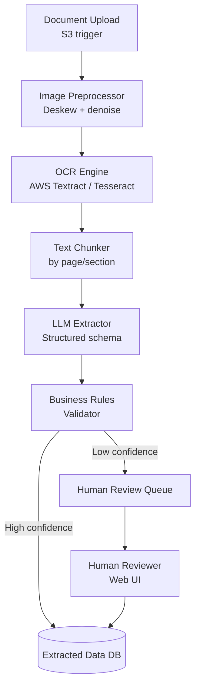

# Design a Document Processing Agent

**Difficulty**: 🟡 Intermediate
**Reading Time**: Coming Soon
**Interview Frequency**: Medium

---

> 🚧 **Full article coming soon.** This stub gives you the essentials to start thinking about this problem.

---

## The Core Problem

Processing 1 million documents per day (PDFs, images, Word files) to extract structured data — invoice amounts, contract dates, medical records — requires a pipeline that handles format diversity, OCR quality variance, and validation accuracy. A 2% extraction error rate on invoice amounts means 20,000 billing errors per day.

## Functional Requirements

- Ingest documents in multiple formats (PDF, DOCX, PNG, JPEG, TIFF)
- Extract structured fields (dates, amounts, names, addresses)
- Validate extracted data against business rules
- Route low-confidence extractions to human review queue
- Store extracted data with source document reference

## Non-Functional Requirements

| Requirement | Target |
|-------------|--------|
| Processing throughput | 1M documents/day (~11.6/sec) |
| Extraction accuracy | > 98% for well-formatted documents |
| Human review rate | < 5% requiring human intervention |
| End-to-end latency | < 30 seconds per document |

## Back-of-Envelope Estimates

- **OCR cost**: 11.6 docs/sec × 5 pages avg × $0.0015/page (AWS Textract) = $75K/day → consider self-hosted OCR for high volume
- **LLM extraction cost**: 11.6 docs/sec × 2K tokens/doc × $0.003/1K tokens = ~$200/day
- **Human review queue**: 5% × 1M/day = 50K documents/day requiring human attention → ~50 reviewers at 1,000 docs/reviewer/day

## Key Design Decisions

1. **Pre-processing Before OCR** — deskew, denoise, and enhance contrast before OCR; a 10-degree tilt degrades OCR accuracy by 20%; image pre-processing adds 200ms but improves downstream extraction quality significantly.
2. **Structured Extraction with Schema** — use LLM with explicit JSON schema and field descriptions; extract invoice: `{total_amount: float, date: "YYYY-MM-DD", vendor_name: str}`; enforce schema validation after extraction; reject/retry if schema invalid.
3. **Confidence Scoring for Human Routing** — assign confidence score per field based on: OCR confidence, extraction repeatability (run 3x and check agreement), business rule validation (amount > 0, date is valid); if any field below 0.8, route document to human review.

## High-Level Architecture

## Top Interview Questions for This Problem

| Question | Tests |
|----------|-------|
| How do you handle a scan of a handwritten document with poor quality? | OCR fallback, human routing |
| How would you extract tables from a PDF invoice? | Table detection, structure extraction |
| How do you improve extraction accuracy over time using human review corrections? | Active learning, fine-tuning loop |

## Related Concepts

- [Customer support agent using similar RAG/extraction patterns](./customer-support-agent)
- [Content moderation agent for similar high-throughput review pipeline](./content-moderation-agent)

---

*📚 Full deep-dive with multiple approaches, trade-off tables, and pseudocode coming soon.*

## 📚 Resources & References

| Resource | Type | What You'll Learn |
|----------|------|------------------|
| [AWS Textract: Document Processing at Scale](https://aws.amazon.com/blogs/machine-learning/automatically-extract-text-and-structured-data-from-documents-with-amazon-textract/) | 📖 Blog | Production OCR and structured extraction pipeline |
| [Google Document AI Architecture](https://cloud.google.com/document-ai/docs/overview) | 📚 Docs | Layout-aware document understanding with ML |
| [Sam Witteveen — Document Processing with LLMs](https://www.youtube.com/@samwitteveenai) | 📺 YouTube | Extracting structured data from PDFs and invoices using LLM agents |
| [Lilian Weng — Generative Models for Structured Data](https://lilianweng.github.io/posts/2023-01-27-the-transformer-family-v2/) | 📖 Blog | Transformer architectures relevant to document understanding |
| [ByteByteGo — Design a Document Storage System](https://www.youtube.com/@ByteByteGo) | 📺 YouTube | Search "document storage" — relevant infrastructure for large-scale document processing |
