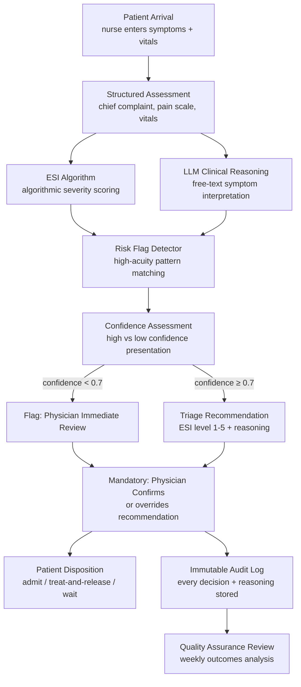
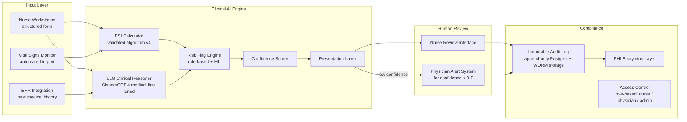

# Design a Medical Triage Agent — AI-Assisted Emergency Department Patient Assessment

**Difficulty**: 🔴 Advanced
**Reading Time**: 35 minutes
**Interview Frequency**: Medium — critical for healthcare tech roles; excellent differentiator for AI safety discussions

> **CRITICAL: This system is a clinical decision SUPPORT tool. Every recommendation requires mandatory human physician review and confirmation. The agent assists; it never decides alone. This is a hard architectural requirement, not a preference.**

---

## Table of Contents

| Section | What You'll Learn |
|---------|-------------------|
| [Mental Model](#mental-model) | From patient arrival to triage recommendation |
| [Requirements](#requirements) | Safety, accuracy, and regulatory constraints |
| [Architecture](#architecture) | Clinical decision support with mandatory human review |
| [Deep Dive: ESI Scoring](#deep-dive-esi-scoring) | Algorithmic triage + LLM augmentation |
| [Deep Dive: Risk Flag Detection](#deep-dive-risk-flag-detection) | High-acuity pattern recognition |
| [Deep Dive: Bias and Fairness](#deep-dive-bias-and-fairness) | Preventing demographic under-triage |
| [Deep Dive: Audit Trail](#deep-dive-audit-trail) | Immutable logging for regulatory compliance |
| [Failure Modes](#failure-modes) | Missed symptoms, algorithmic bias, system latency |
| [Interview Q&A](#interview-qa) | How to answer common questions |

---

## Mental Model

A patient arrives at the ED and a triage nurse enters their chief complaint, vital signs, and brief history. The AI agent runs ESI scoring in parallel with LLM-based reasoning, flags any high-acuity patterns (chest pain + age > 50 = cardiac workup), and presents a recommended triage level (1-5) with full reasoning to the nurse. The nurse reviews, can accept or override, and the physician makes the final disposition decision. Every step is logged immutably.



---

## Requirements

### Functional Requirements

1. Accept structured input: chief complaint (text), vital signs (numeric), pain scale, relevant history flags
2. Compute ESI (Emergency Severity Index) score using validated algorithm
3. LLM augmentation for ambiguous presentations and free-text symptoms
4. Detect high-acuity risk flags: chest pain patterns, stroke symptoms, sepsis indicators
5. Present recommendation with full reasoning and confidence level to nurse
6. Flag low-confidence cases for immediate physician review — no recommendation withheld
7. Accept human override with required reason code
8. Log every input, recommendation, reasoning, and human decision to immutable audit log

### Non-Functional Requirements

| Requirement | Target |
|-------------|--------|
| Recommendation latency | < 10s P99 (emergency context — speed matters) |
| Under-triage rate (ESI too low) | < 1% (false sense of security = patient harm) |
| Over-triage rate (ESI too high) | < 15% (acceptable — conservative is safe) |
| System availability | 99.99% — ED cannot function without triage capability |
| Audit log integrity | Append-only, cryptographically signed, 10-year retention |
| HIPAA compliance | All PHI encrypted at rest and in transit, audit log for all access |
| Regulatory approval | FDA cleared as SaMD (Software as Medical Device) — Class II |

### Capacity Estimation

- Typical ED: 150 patient visits/day = ~6/hour steady state, peak 20/hour
- Large academic medical center ED: 500 visits/day = ~21/hour steady state
- Latency budget: nurse interaction ~3-5 min total; AI assessment must complete in < 10s
- Concurrent assessments (multi-bay): 10 simultaneous nurse stations × 10s = trivial throughput

---

## Architecture



### HIPAA Compliance Architecture

All PHI (Protected Health Information) flows through an encryption layer:
- In transit: TLS 1.3 minimum
- At rest: AES-256, keys managed in AWS KMS with 90-day rotation
- Database: column-level encryption for patient name, DOB, SSN — stored as ciphertext
- Audit log: every PHI access logged with user ID, timestamp, access reason
- Minimum necessary: nurse workstation sees only current patient's data; no bulk exports

---

## Deep Dive: ESI Scoring

### ESI Algorithm Overview

The Emergency Severity Index is a validated 5-level triage algorithm used in US emergency departments. Level 1 = immediate life threat; Level 5 = non-urgent.

```
ESI Decision Tree:
  Step 1: Does patient require immediate life-saving intervention?
    YES → ESI Level 1

  Step 2: Is this a high-risk situation? Is the patient confused/lethargic/disoriented?
    YES → ESI Level 2

  Step 3: How many different resources will the patient need?
    0 resources → ESI Level 5
    1 resource  → ESI Level 4
    ≥2 resources → continue to Step 4

  Step 4: Are vital signs within danger zones?
    HR > 100 or HR < 60 with symptoms → Up-triage to Level 2
    SpO2 < 92% → Up-triage to Level 2
    Otherwise → ESI Level 3
```

**AI augmentation of ESI**:

1. **Structured algorithm execution** (deterministic, < 1ms): ESI computed from numeric vital signs and binary flags
2. **LLM augmentation for free text** (< 5s): Nurse enters "patient says chest feels tight and left arm is numb." LLM maps this to: possible ACS (Acute Coronary Syndrome) → flag chest pain + radiation pattern → recommend ESI Level 2 if not already assigned
3. **Override detection**: If nurse-entered text contains stroke keywords (FAST: face drooping, arm weakness, speech difficulty, time) and ESI algorithm scored Level 3, LLM flags for Level 2 up-triage with reasoning

---

## Deep Dive: Risk Flag Detection

### High-Acuity Pattern Matching

Certain symptom combinations require immediate escalation regardless of initial ESI score:

```yaml
risk_flags:
  - name: possible_stemi
    pattern:
      - chief_complaint_contains: ["chest pain", "chest pressure", "chest tightness"]
      - AND age > 35
      - AND (symptom_contains: ["left arm", "jaw", "diaphoresis", "shortness of breath"])
    action: up_triage_to_level_2, order_12_lead_ecg, notify_cardiologist

  - name: stroke_fast
    pattern:
      - symptom_contains: ["face droop", "arm weakness", "speech difficulty"]
      - AND symptom_onset_minutes < 180
    action: up_triage_to_level_1, activate_stroke_code, immediate_CT_order

  - name: sepsis_sirs
    pattern:
      - temperature > 38.3 OR temperature < 36
      - AND heart_rate > 90
      - AND respiratory_rate > 20
      - AND chief_complaint_contains: ["infection", "fever", "chills", "confusion"]
    action: up_triage_to_level_2, order_blood_cultures, flag_for_sepsis_protocol

  - name: pediatric_fever
    pattern:
      - age < 3_months
      - AND temperature > 38.0
    action: up_triage_to_level_2_minimum, immediate_physician_notification
```

**LLM layer for ambiguous presentations**: A patient who says "I feel weird and my heart is doing something funny" doesn't trigger the keyword rules. The LLM interprets this in context of age, history, and vitals — if 65-year-old diabetic with prior cardiac history, the LLM flags it as potentially cardiac even without the classic keywords.

---

## Deep Dive: Bias and Fairness

### The Under-Triage Risk for Specific Demographics

Medical literature documents systematic under-triage for:
- Black patients presenting with chest pain (less likely to receive same workup as white patients)
- Women presenting with cardiac symptoms (atypical presentation less recognized)
- Elderly patients with altered mental status (sometimes dismissed as "just confused")
- Patients with language barriers (symptoms undertransmitted through interpreters)

**Algorithmic bias mitigation**:

1. **Training data audit**: Ensure training data for ML components includes representative demographics. Track model performance broken down by age, sex, and race — alert if any demographic group has > 2% higher under-triage rate.

2. **Symptom prompting**: Nurse input form explicitly asks about atypical cardiac symptoms for patients over 50: "Does the patient have back pain, jaw discomfort, unexplained nausea, or unusual fatigue?" This surfaces symptoms that patients (especially women) may not volunteer.

3. **Override analysis**: If nurse overrides the AI recommendation and changes ESI to a lower acuity, track these overrides by demographics. Pattern: nurses consistently downgrading AI's Level 2 recommendations for certain patient groups → retrain model with corrected labels.

4. **Monthly equity report**: Report under-triage rate by demographic to hospital quality committee. If any group's under-triage rate > 2× overall rate → mandatory model review.

---

## Deep Dive: Audit Trail

### Immutable Logging Requirements

Medical records have strict retention requirements: HIPAA requires 6 years from last use; many states require 10 years. Every triage decision must be reconstructable:

```
Audit Log Entry Schema:
{
  event_id: "uuid",
  patient_id: "encrypted_patient_identifier",
  timestamp: "ISO 8601 with timezone",
  event_type: "triage_recommendation | nurse_override | physician_review",

  ai_inputs: {
    chief_complaint: "encrypted",
    vital_signs: {...},
    risk_flags_detected: ["possible_stemi"],
    ehr_data_accessed: ["prior_cardiac_history"]
  },

  ai_output: {
    esi_level_recommended: 2,
    confidence: 0.89,
    reasoning: "Patient presents with chest tightness, left arm pain, age 58...",
    risk_flags: ["possible_stemi"],
    model_version: "triage-v3.2.1"
  },

  human_decision: {
    nurse_id: "encrypted_nurse_id",
    decision: "accepted | overridden",
    override_reason_code: null,
    final_esi_level: 2,
    decision_timestamp: "..."
  },

  integrity_hash: "SHA-256 of all fields + previous entry hash (blockchain-style chain)"
}
```

**Append-only enforcement**:
- Database role: write-only, no UPDATE or DELETE permissions on audit log table
- WORM storage: audit logs also written to S3 Object Lock (WORM) — cannot be modified even by admins
- Hash chaining: each entry includes hash of previous entry — any tampering breaks the chain

---

## Failure Modes

### 1. Missing Critical Symptom
**Scenario**: Nurse is busy; doesn't ask about radiation of chest pain; patient doesn't volunteer it; AI scores as Level 3 MSK (musculoskeletal); patient has MI
**Impact**: Patient waits 2 hours; deteriorates in waiting room
**Mitigation**:
- Mandatory symptom checklist: if chief complaint contains "chest" → system requires nurse to explicitly answer: radiation, onset time, diaphoresis, prior cardiac history
- Cannot progress without answering mandatory fields for high-risk chief complaints
- Real-time vital sign monitoring: if SpO2 drops below 92% while waiting → immediate alert to nurse

### 2. Algorithmic Bias — Under-Triage for Certain Demographics
**Scenario**: AI model under-detects cardiac presentations in women with atypical symptoms
**Impact**: Women systematically assigned lower triage level → worse outcomes
**Mitigation**:
- Monthly equity audits comparing outcomes by demographic
- Force-prompt for atypical cardiac symptoms in all patients > 50 regardless of chief complaint
- Human-in-the-loop cannot be overridden: nurse/physician always makes final call

### 3. System Latency in Emergencies
**Scenario**: LLM API has 10-second latency spike during shift change; nurse waiting; patient deteriorating
**Impact**: ED workflow delayed; nurse relies on raw observation without AI support
**Mitigation**:
- LLM call is non-blocking: ESI algorithm (< 1ms) returns immediately; LLM augmentation loads when ready
- If LLM returns in > 5s, show ESI result with "AI analysis loading…" indicator
- If LLM fails: show ESI result with "AI analysis unavailable — use clinical judgment" warning
- System degrades gracefully to algorithm-only mode — never blocks triage workflow

### 4. Model Version Mismatch After Update
**Scenario**: New model version deployed mid-shift; audit trail references model-v3.2 for first half of shift and model-v3.3 for second half; analysis inconsistent
**Impact**: Quality reviewers confused; regulatory audit finds inconsistency
**Mitigation**:
- Model version is an immutable field in every audit log entry
- Model updates only deployed between shifts (3am-5am), not mid-shift
- Each deployment requires dual sign-off: clinical informatics + attending physician
- Shadow mode: new model runs in parallel for 2 weeks before promotion, reviewed by quality committee

---

## Interview Q&A

### "How do you get FDA clearance for this system?"

> "The FDA classifies AI triage support as Software as a Medical Device (SaMD), likely Class II, requiring 510(k) clearance. The clearance process requires: (1) Clinical evidence — prospective or retrospective study showing the AI's recommendations don't worsen patient outcomes compared to nurse-only triage; (2) Algorithm documentation — full transparency of how the ESI algorithm and ML components work, training data, validation performance; (3) Change control procedure — any model update above a defined performance threshold requires re-clearance. The 'predetermined change control plan' (PCCP) path lets you pre-specify what types of updates can be made without new 510(k), which is how continuous learning models maintain regulatory compliance. The system must also have a clear 'human in the loop' architecture documented — the FDA requires that clinicians maintain ultimate decision authority."

### "How do you handle a scenario where the AI recommends Level 2 but the nurse overrides to Level 4?"

> "All overrides are logged with a mandatory reason code: 'patient_appears_well', 'symptoms_resolved', 'vital_signs_stable', 'clinical_judgment'. No free-text override reasons — reason codes are standardized to enable analysis. The override is flagged for quality review within 24 hours. If the patient later deteriorates and the outcome data shows the Level 4 assignment was wrong, that case is reviewed in the weekly QA meeting. If a specific nurse has override patterns that correlate with worse outcomes, that's a training issue escalated to nursing leadership. If the AI consistently gets overridden in a specific symptom pattern, that's a model improvement opportunity. The key is that overrides are neither blocked nor silently accepted — they're a data source for continuous improvement."

---

## Key Takeaways

| Number | What It Means |
|--------|--------------|
| **< 1% under-triage** | The safety constraint — conservative is always preferred; patient harm from missed escalation >> inefficiency from over-triage |
| **< 10s recommendation** | Latency budget in emergency context — AI analysis cannot slow down care |
| **100% human confirmation** | Non-negotiable architectural requirement — agent assists, never decides |
| **10-year audit retention** | Medical-grade logging requirement — every decision reconstructable forever |
| **Monthly equity audit** | Bias detection for demographic groups — under-triage disparity > 2× triggers model review |
| **Graceful degradation** | LLM failure → algorithm-only mode — never block triage workflow |

---

## 📚 Resources & References

| Resource | Type | What You'll Learn |
|----------|------|------------------|
| [ESI Triage Handbook — AHRQ](https://www.ahrq.gov/sites/default/files/wysiwyg/professionals/systems/hospital/esi/esihandbk.pdf) | 📚 Docs | The validated ESI algorithm this system is built on |
| [FDA AI/ML-Based Software as Medical Device Guidance](https://www.fda.gov/medical-devices/software-medical-device-samd/artificial-intelligence-and-machine-learning-aiml-enabled-medical-devices) | 📚 Docs | Regulatory requirements for AI medical devices including triage support |
| [Google Health: AI for Clinical Decision Support](https://health.google/intl/us/caregivers/condition-research/) | 📖 Blog | How Google approaches AI safety and validation in healthcare |
| [Andrej Karpathy — Neural Networks in Medicine](https://www.youtube.com/@AndrejKarpathy) | 📺 YouTube | Understanding ML model reliability and limitations |
| [AI Explained — AI in Healthcare](https://www.youtube.com/@AIExplained-official) | 📺 YouTube | Overview of AI applications and safety considerations in clinical settings |
| [Anthropic — AI Safety for High-Stakes Applications](https://www.anthropic.com/research) | 📖 Blog | Constitutional AI and safety mechanisms relevant to medical decision support |
