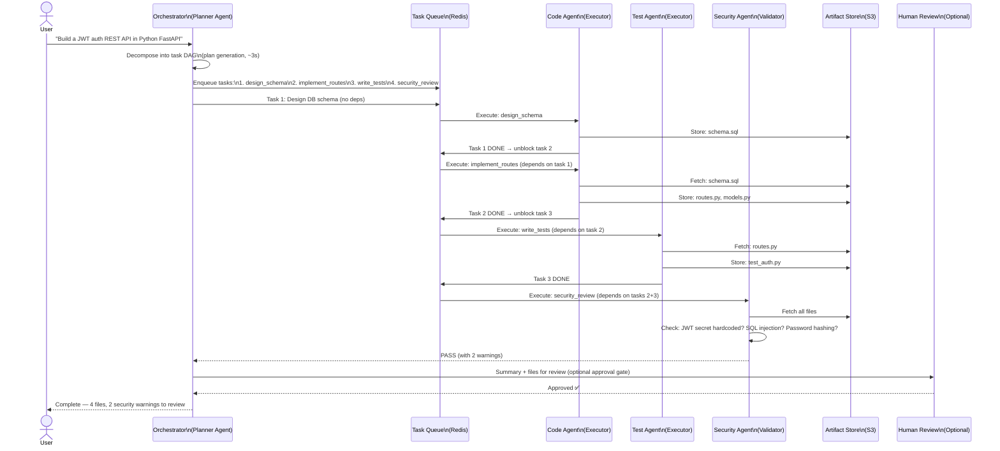
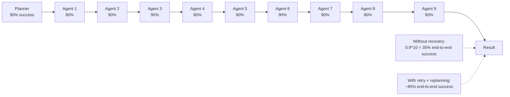
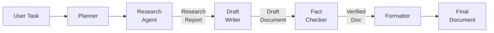
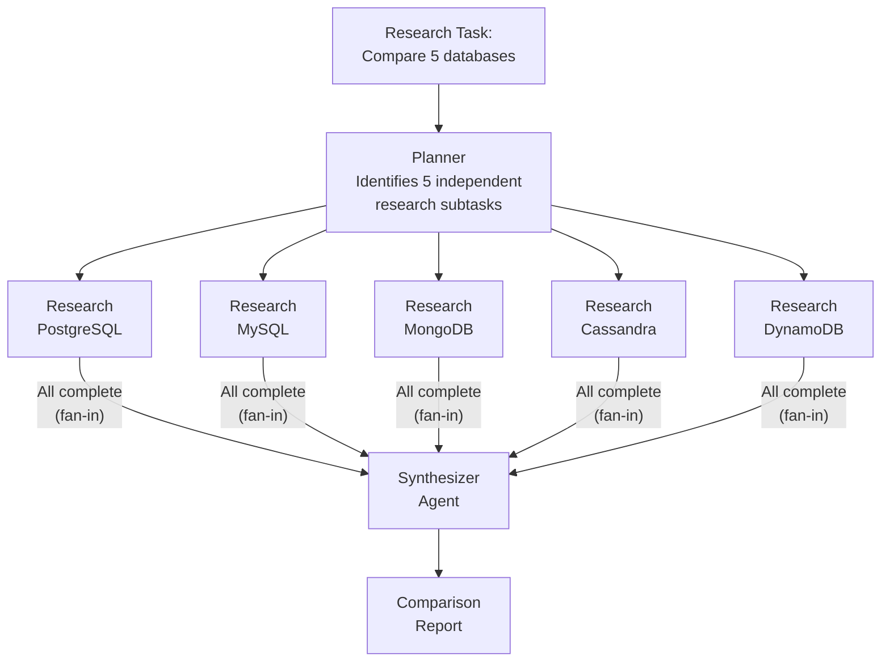
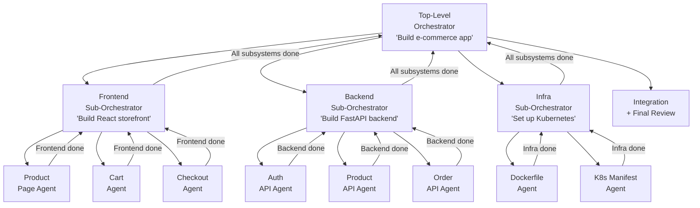
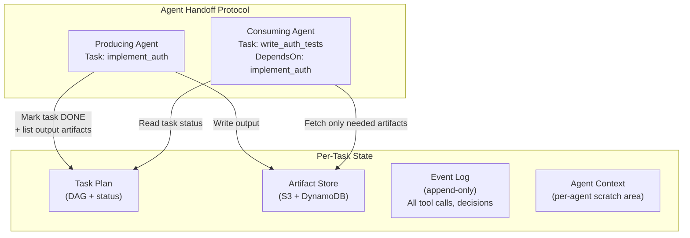
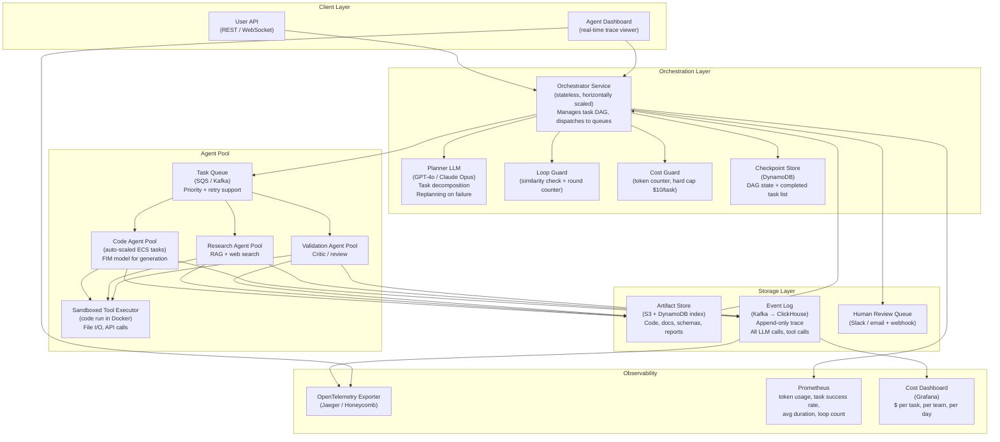

# Design a Multi-Agent Orchestration System — Long-Horizon AI Tasks

**Difficulty**: ⚫ Senior / Staff
**Reading Time**: 45 minutes
**Interview Frequency**: Emerging — appears in senior AI system design interviews at Anthropic, OpenAI, Google DeepMind, and AI-forward product companies

> **A single LLM call can answer a question in 2 seconds. A multi-agent system can autonomously complete a software feature in 4 minutes — or get stuck in an infinite loop for 45 minutes burning $200 in tokens. The engineering challenge is making the former reliable and the latter impossible.**

---

## Table of Contents

| Section | What You'll Learn |
|---------|-------------------|
| [Mental Model](#mental-model) | What a multi-agent system actually does |
| [Why It's Hard](#why-its-hard) | The compounding failure problem |
| [Requirements](#requirements) | Functional + non-functional with real numbers |
| [Capacity Estimation](#capacity-estimation) | Cost and latency math for long-horizon tasks |
| [Deep Dive 1: Orchestration Patterns](#deep-dive-1-orchestration-patterns) | Sequential, parallel, hierarchical — with diagrams |
| [Deep Dive 2: State & Artifact Management](#deep-dive-2-state--artifact-management) | Shared context, handoff protocol, checkpoint/resume |
| [Deep Dive 3: Failure Recovery](#deep-dive-3-failure-recovery) | Retry, replanning, idempotent tool calls |
| [Full System Architecture](#full-system-architecture) | Every service, every data store |
| [Framework Comparison](#framework-comparison) | ReAct vs Plan-and-Execute vs LATS |
| [Problems at Scale](#problems-at-scale) | 3 production failure modes |
| [Interview Q&A Map](#interview-qa-map) | Exact phrases for AI system design interviews |
| [Key Takeaways](#key-takeaways) | 6 numbers to walk in with |

---

## Mental Model

### What Is a Multi-Agent System?

A single LLM prompt can do one thing well: answer a question, summarize a document, generate a function. But real tasks require sequences of actions, tool use, verification, and adaptation when things go wrong.

A multi-agent system decomposes a complex task across **specialized agents** that collaborate:

- **Planner (Orchestrator)**: Takes the goal, creates a task DAG (directed acyclic graph)
- **Executor (Worker)**: Performs atomic subtasks — calls APIs, writes code, searches the web
- **Validator (Critic)**: Reviews executor output, decides if it's correct enough to proceed
- **Retriever**: Fetches information from external sources (RAG, web search, database)

### The Happy Path: "Write a REST API for user authentication"



**Key insight**: The orchestrator never touches files directly. It manages the task graph. Executors do the work. Validators check quality. The artifact store is the shared memory.

---

## Why It's Hard

### Compounding Failures in Agent Chains

A single LLM call has a ~90% success rate (produces useful output). A chain of 10 agents, each with 90% success, has a 0.9^10 = **34.9% end-to-end success rate without error recovery**.



**The three categories of failure**:

1. **Tool failure**: Code execution throws an exception, web search returns no results, API rate limit hit
2. **LLM output failure**: Executor produces code that doesn't compile, validator wrongly approves bad output, planner generates an infeasible task graph
3. **State corruption**: Artifact store gets partial write, task queue loses a message, two agents modify the same artifact concurrently

---

## Requirements

### Functional Requirements

| Feature | Description |
|---------|-------------|
| Task decomposition | Planner breaks natural-language goal into executable task DAG |
| Parallel execution | Independent tasks run concurrently across multiple agents |
| Tool use | Agents can call: web search, code execution, file read/write, APIs |
| Human-in-the-loop | Pause at approval gates for sensitive actions (e.g., deploying to production) |
| Checkpoint & resume | If orchestrator crashes at step 30 of 50, resume from step 30 |
| Observability | Full trace of every agent's reasoning, tool calls, and output |
| Cost controls | Hard cap on token budget per task ($10 max), timeout per agent (5 min) |
| Reproducibility | Given the same input and seed, produce the same task plan (deterministic planning) |

### Non-Functional Requirements (with numbers)

| Metric | Target | Why |
|--------|--------|-----|
| End-to-end latency (simple task, 5 agents) | 30-90s | 5 agents × 10-20s LLM call each, some parallel |
| End-to-end latency (complex task, 20 agents) | 5-15 min | 20 agents, 4-5 sequential rounds, 3 agents parallel per round |
| LLM calls per complex task | 20-50 calls | 1 planning + 15-40 execution + 3-8 validation calls |
| Token cost per complex task | $0.50-$5.00 | GPT-4o at ~$0.002/1K input → 250K-2.5M tokens per task |
| Task success rate (with recovery) | > 85% | For 10-agent pipelines with retry + replanning |
| Agent loop detection | < 5 rounds | Detect and break infinite loops before $50 threshold |
| Availability | 99.9% | Agents are async — brief orchestrator downtime just pauses tasks |
| Trace storage | 90 days | Per-task full trace for debugging and model improvement |

---

## Capacity Estimation

### Throughput Analysis

```
Concurrent task sessions: 10,000 (enterprise SaaS with 1,000 teams × 10 active tasks)
Avg LLM calls per task: 30 calls
Avg task duration: 5 minutes
LLM calls/sec = 10,000 tasks × 30 calls / 300 seconds = 1,000 LLM calls/sec

At 3,000 tokens/call average:
  Tokens/sec: 3M tokens/sec
  At $0.0015/1K tokens (GPT-4o): $4.50/sec = $16,200/hr
```

### Cost Per Task (Detailed Breakdown)

```
Simple research task (5 agents, 10 LLM calls):
  Planner:          1 call × 2,000 tokens = 2,000 tokens
  Retriever × 3:    3 calls × 1,500 tokens = 4,500 tokens
  Synthesizer:      1 call × 5,000 tokens = 5,000 tokens
  Validator:        1 call × 3,000 tokens = 3,000 tokens
  Total: 14,500 tokens × $0.0015/1K = $0.022 per task

Complex software dev task (20 agents, 40 LLM calls):
  Planner:           2 calls × 3,000 tokens = 6,000 tokens
  Code agents × 10: 20 calls × 4,000 tokens = 80,000 tokens
  Test agents × 5:  10 calls × 3,000 tokens = 30,000 tokens
  Security agent:    3 calls × 6,000 tokens = 18,000 tokens
  Validators:        5 calls × 2,000 tokens = 10,000 tokens
  Total: 144,000 tokens × $0.0015/1K = $0.22 per task
  With replanning (1.5× avg):  $0.33 per task
```

---

## Deep Dive 1: Orchestration Patterns

### Pattern 1: Sequential Pipeline

Agents execute one after another. Output of agent N becomes input to agent N+1.



**Latency**: Sum of all agents = N × avg_agent_latency
**Fault tolerance**: One failure blocks the entire pipeline
**Best for**: Strictly ordered workflows (write → test → review)
**Example**: Perplexity research answers (search → extract → synthesize)

---

### Pattern 2: Parallel Fan-Out / Fan-In

The planner identifies independent subtasks and dispatches them simultaneously.



**Latency**: max(agent_latencies) instead of sum → 5× speedup in this example
**Fault tolerance**: One agent failure can be retried without blocking others
**Coordination challenge**: Synthesizer must wait for ALL agents (slowest determines total latency)
**Best for**: Research synthesis, parallel code generation across modules

**Fan-in implementation**:

```python
async def fan_out_fan_in(subtasks: list[Task], timeout_per_task=60) -> list[TaskResult]:
    async def run_with_timeout(task: Task) -> TaskResult:
        try:
            return await asyncio.wait_for(run_agent(task), timeout=timeout_per_task)
        except asyncio.TimeoutError:
            return TaskResult(task_id=task.id, status="timeout", error="Agent timed out")

    results = await asyncio.gather(*[run_with_timeout(t) for t in subtasks])

    # Partial failure handling: if < 20% of tasks failed, proceed with successful results
    success_rate = sum(1 for r in results if r.status == "success") / len(results)
    if success_rate < 0.80:
        raise OrchestratorError(f"Too many subtask failures: {1-success_rate:.0%}")
    return [r for r in results if r.status == "success"]
```

---

### Pattern 3: Hierarchical Subagent Delegation

The planner delegates high-level subtasks to **sub-orchestrators**, which further decompose into atomic tasks.



**Benefit**: Each sub-orchestrator has focused context. The top planner never sees file-level details.
**Challenge**: Sub-orchestrator coordination — if Frontend assumes an API contract that Backend implements differently, integration fails.
**Solution**: Shared contract definition (OpenAPI spec, database schema) stored in the artifact store before any implementation begins.

---

## Deep Dive 2: State & Artifact Management

### The Shared Scratchpad Problem

Agents need to communicate. The naive approach — pass full conversation history to every agent — breaks at scale:

```
Task: 20 agents, each producing 500 tokens of output
After 10 agents complete: 5,000 tokens of history
If each subsequent agent gets full history: 5,000 + 10,000 + 15,000... = quadratic growth
By agent 20: 20 × 10,000 = 200,000 tokens in context → hits context window limit
```

**Solution**: Structured artifact store + agent handoff protocol



### Artifact Schema

```python
@dataclass
class Artifact:
    artifact_id: str        # UUID
    task_id: str            # Which task produced this
    artifact_type: str      # "code", "spec", "test", "report", "schema"
    content: str            # The actual content
    summary: str            # 1-2 sentence LLM-generated summary for context
    created_at: datetime
    version: int            # Incremented on update
    dependencies: list[str] # artifact_ids this was produced from

# When an agent needs context:
def get_agent_context(task: Task, artifact_store: ArtifactStore) -> str:
    context_parts = []

    # 1. Task description and goal
    context_parts.append(f"Your task: {task.description}")

    # 2. Direct dependency artifacts (full content)
    for dep_task_id in task.depends_on:
        artifacts = artifact_store.get_by_task(dep_task_id)
        for artifact in artifacts:
            context_parts.append(f"=== {artifact.artifact_type}: {artifact.artifact_id} ===\n{artifact.content}")

    # 3. Sibling artifacts (summaries only, not full content)
    for sibling_artifact in artifact_store.get_sibling_summaries(task):
        context_parts.append(f"=== Summary of {sibling_artifact.artifact_id} ===\n{sibling_artifact.summary}")

    return "\n\n".join(context_parts)
```

### Checkpoint and Resume

For long-running tasks (15+ minutes), the orchestrator must survive crashes:

```python
class OrchestratorCheckpoint:
    task_id: str
    completed_subtasks: list[str]     # list of task IDs done
    in_progress_subtasks: list[str]   # being worked on when checkpoint saved
    failed_subtasks: list[str]        # failed, need retry or replanning
    artifact_manifest: dict           # artifact_id → S3 location
    plan_version: int                 # allows detecting if plan was replanned
    checkpointed_at: datetime

def save_checkpoint(state: OrchestratorState, checkpoint_store: CheckpointStore):
    checkpoint = OrchestratorCheckpoint.from_state(state)
    checkpoint_store.upsert(state.task_id, checkpoint)  # atomic upsert

def resume_from_checkpoint(task_id: str, checkpoint_store: CheckpointStore):
    checkpoint = checkpoint_store.get(task_id)
    if not checkpoint:
        raise CheckpointNotFound(task_id)

    # Re-enqueue in-progress tasks (they may have been lost)
    for task_id in checkpoint.in_progress_subtasks:
        task_queue.enqueue(task_id, priority="high")  # re-run incomplete tasks

    # Skip completed tasks
    return OrchestratorState.from_checkpoint(checkpoint)
```

---

## Deep Dive 3: Failure Recovery

### Tier 1: Tool Retry (Transient Failures)

Tool failures (API 500, network timeout, code execution crash) are transient. Retry with exponential backoff.

```python
async def execute_tool_with_retry(
    tool_fn: Callable,
    args: dict,
    max_retries: int = 3,
    base_delay_ms: int = 500,
) -> ToolResult:
    for attempt in range(max_retries + 1):
        try:
            result = await tool_fn(**args)
            return ToolResult(status="success", output=result)
        except ToolTransientError as e:
            if attempt == max_retries:
                return ToolResult(status="failed", error=str(e))
            delay = base_delay_ms * (2 ** attempt) + random.randint(0, 100)
            await asyncio.sleep(delay / 1000)
        except ToolPermanentError as e:
            # Don't retry permanent errors (e.g., invalid API key, permission denied)
            return ToolResult(status="failed", error=str(e), retryable=False)
```

### Tier 2: Replanning (LLM Output Failures)

When an executor's output is invalid (code doesn't compile, test coverage is 0%), the validator rejects it and the orchestrator **replans** that subtask.

```python
def handle_task_failure(
    failed_task: Task,
    failure_reason: str,
    orchestrator_state: OrchestratorState,
    planner_llm: LLM,
) -> list[Task]:
    """
    Returns a new list of tasks to replace the failed task.
    May return the same task with a different prompt, or decompose into smaller tasks.
    """
    replan_prompt = f"""
    Task "{failed_task.description}" failed with reason: {failure_reason}

    Previous attempt produced: {failed_task.last_output[:500]}

    Options:
    1. Retry with a more specific instruction
    2. Decompose into smaller subtasks
    3. Skip and mark as best-effort (only if non-critical)

    Generate a revised plan for this task only.
    """
    revised_tasks = planner_llm.generate_task_plan(replan_prompt)
    return revised_tasks

# Replan budget: max 3 replan attempts per subtask before escalating to human
```

### Tier 3: Human-in-the-Loop Escalation

When all automatic recovery fails, or when a task requires irreversible actions:

```python
HUMAN_ESCALATION_TRIGGERS = [
    "task_failed_after_3_replans",
    "destructive_action_requested",  # DELETE, DROP TABLE, rm -rf
    "cost_threshold_exceeded",       # $10 per task
    "low_confidence_on_external_api", # calling a payment API with < 90% confidence
    "security_vulnerability_detected",
]

async def maybe_escalate_to_human(event: str, context: dict) -> HumanDecision:
    if event not in HUMAN_ESCALATION_TRIGGERS:
        return HumanDecision.AUTO_PROCEED

    notification = HumanReviewRequest(
        task_id=context["task_id"],
        event=event,
        summary=context["summary"],
        options=["approve", "reject", "modify_plan"],
        timeout_seconds=3600,  # 1 hour SLA for human review
    )
    await notification_service.send(notification)

    decision = await decision_store.wait_for_decision(notification.id, timeout=3600)
    if decision is None:
        return HumanDecision.TIMEOUT_REJECT  # fail safe: reject if no human responds
    return decision
```

### Loop Detection

Infinite loops are the most dangerous failure mode — an agent stuck in a loop can burn hundreds of dollars.

```python
class LoopDetector:
    def __init__(self, max_rounds: int = 5, similarity_threshold: float = 0.90):
        self.action_history = []
        self.max_rounds = max_rounds
        self.similarity_threshold = similarity_threshold

    def check_for_loop(self, current_action: str) -> bool:
        """
        Returns True if we're in a loop and should halt.
        """
        if len(self.action_history) < 3:
            self.action_history.append(current_action)
            return False

        # Check if current action is too similar to recent actions
        recent = self.action_history[-3:]
        similarities = [
            cosine_sim(embed(current_action), embed(past))
            for past in recent
        ]

        if max(similarities) > self.similarity_threshold:
            return True  # 🚨 LOOP DETECTED

        if len(self.action_history) >= self.max_rounds:
            return True  # 🚨 MAX ROUNDS EXCEEDED

        self.action_history.append(current_action)
        return False
```

---

## Full System Architecture



---

## Framework Comparison

| | ReAct | Plan-and-Execute | LATS |
|---|---|---|---|
| **Approach** | Interleave reasoning (Thought) + action (Act) in single LLM | Separate planning phase → execution phase | Monte Carlo Tree Search over action trajectories |
| **Planning** | Implicit — agent decides next action per step | Explicit DAG generated upfront | Exploration — tries multiple paths, backtrack on failure |
| **Parallelism** | Sequential only — one action at a time | Full parallelism (DAG-based) | Parallel exploration of branches |
| **Failure recovery** | Implicit — agent self-corrects via reasoning | Explicit replanning step | Automatic backtracking in the search tree |
| **Latency (10-step task)** | 10 × 10s = 100s | ~40s (parallel execution) | 100-300s (explores many paths) |
| **Cost** | Low — fewest LLM calls | Medium — planning + execution | High — exploration multiplies calls 3-5× |
| **Hallucination risk** | High — no structured verification | Medium — validator step | Low — best path selected from successful trajectories |
| **Best for** | Simple tool-use tasks, chatbots with tools | **Production workflows — structured tasks** | Research problems where the right approach is unknown |
| **Examples** | LangChain Agent, Claude tool_use | AutoGen, LangGraph workflows | AlphaCode-style code synthesis |

**Recommendation**: **Plan-and-Execute** for production systems. ReAct is fine for demos and simple tools. LATS is research-grade — too expensive for production unless the task value justifies the cost.

---

## Problems at Scale

### Failure Mode 1: Planner Generates an Infeasible Task DAG

**Scenario**: The user asks "Build a Kubernetes cluster and deploy my app." The planner creates tasks:
- Task 1: Deploy app to Kubernetes
- Task 2: Set up Kubernetes cluster (depends on Task 1)

Task 1 has a dependency on Task 2, but Task 2 depends on Task 1 — a circular dependency. The executor agents get stuck waiting for each other indefinitely.

**What happens**: Both tasks wait in the queue forever. No loop detected (no action repetition — they never even start). The task session times out after 1 hour.

**Root cause**: The planner LLM generated an invalid DAG (cycle). No validation was run on the plan output.

**Fix**:
1. After plan generation, **validate DAG topology**: run topological sort before executing. If a cycle exists, send the plan back to the planner with the error message and ask for a revised plan
2. Add a DAG validation step to the planning prompt: "Before returning the plan, verify that no task depends on a task that depends on itself (check for cycles)."
3. Limit planner output schema — use a Pydantic model that enforces `depends_on` is a list of task IDs that appear earlier in the plan list (simple linear ordering as a fallback)

```python
def validate_task_dag(tasks: list[Task]) -> None:
    task_ids = {t.id for t in tasks}
    graph = {t.id: t.depends_on for t in tasks}

    # Topological sort to detect cycles
    visited = set()
    in_stack = set()

    def dfs(node_id: str) -> None:
        if node_id in in_stack:
            raise CyclicDependencyError(f"Cycle detected involving task: {node_id}")
        if node_id in visited:
            return
        in_stack.add(node_id)
        for dep in graph.get(node_id, []):
            if dep not in task_ids:
                raise MissingDependencyError(f"Task {node_id} depends on unknown task {dep}")
            dfs(dep)
        in_stack.discard(node_id)
        visited.add(node_id)

    for task_id in task_ids:
        dfs(task_id)
```

---

### Failure Mode 2: One Slow Agent Blocks the Entire Pipeline

**Scenario**: The planner creates 5 parallel research tasks (fan-out). Four complete in 30 seconds. The fifth agent is researching a topic that requires 10 web searches (rate-limited). It takes 8 minutes. The synthesizer is blocked, waiting for all 5. Total task time: 8 minutes instead of 30 seconds.

**What happens**: Developers complain the system is "slow and unreliable" — because it was fast before and now seems stuck. The "longest chain" problem is invisible to users.

**Root cause**: Fan-in with `asyncio.gather` waits for ALL tasks. No timeout per subtask.

**Fix**:
1. **Timeout per subtask**: 2× the P90 latency for that agent type. Research agent P90 = 45s → timeout = 90s
2. **Partial results proceeding**: If 4/5 subtasks succeed and the 5th times out, proceed to synthesis with available results. Add a note: "Research on [topic] was incomplete — the following synthesized report excludes that source."
3. **Predictive slow-task detection**: After 60 seconds, if a subtask has made < 20% progress (check token output count), escalate priority and try a different agent or a simpler sub-strategy
4. **Critical path awareness**: The planner should mark which tasks are on the critical path. Deprioritize non-critical slow tasks (they don't block the final output)

---

### Failure Mode 3: Context Accumulation Fills the 200K Token Context Window

**Scenario**: An agent is tasked with writing a comprehensive technical report through a 50-turn planning loop. Each turn appends the agent's reasoning (~2,000 tokens) and tool results (~3,000 tokens) to the conversation history. By turn 25, the context is 125,000 tokens. By turn 33, it hits the 200K token limit. The agent crashes with a `context_length_exceeded` error.

**What happens**: The entire 33-turn session is lost. If there's no checkpointing, the task must restart from scratch. All previous work (33 LLM calls × $0.005 = $0.165) is wasted.

**Root cause**: No context compression strategy. The agent accumulates every previous turn verbatim.

**Fix**:
1. **Sliding window compression**: Keep the last 5 turns verbatim. Compress turns 1 through N-5 into a running summary using a cheaper model (Claude Haiku).

```python
def compress_context(history: list[Turn], current_window_tokens: int, max_tokens=180000) -> list[Turn]:
    if current_window_tokens < max_tokens * 0.70:  # 70% threshold
        return history  # no compression needed yet

    # Keep last 5 turns verbatim
    recent_turns = history[-5:]
    older_turns = history[:-5]

    if not older_turns:
        return history

    # Summarize older turns with a cheap model
    summary_prompt = f"Summarize the key decisions, artifacts created, and facts discovered in these {len(older_turns)} turns:\n" + "\n".join(str(t) for t in older_turns)
    summary = cheap_llm.generate(summary_prompt, max_tokens=1000)

    return [Turn(role="system", content=f"[Context Summary]\n{summary}")] + recent_turns
```

2. **External artifact store**: After each tool call produces a significant artifact (> 500 tokens), write it to the artifact store and replace the content in the conversation with a pointer: `[Artifact: routes.py — 450 lines stored at artifact://task-123/routes.py]`. The agent can re-fetch specific artifacts when needed, rather than carrying them in context.

3. **Context budget monitoring**: Alert at 50% and 80% context usage. At 90%, trigger compression automatically.

---

## Interview Q&A Map

### "How do you prevent agents from getting stuck in an infinite loop?"

> "Three layers. First, a semantic loop detector: after each agent action, embed the action description and compare it against the last 5 actions via cosine similarity. If any similarity exceeds 0.90, we've seen this action before — halt and replan. Second, a round counter: regardless of semantic similarity, if a single subtask has generated more than 5 LLM calls without completing, it's escalated to the planner for replanning or to human review. Third, a cost guard: a hard $10 budget cap per task. Once the token meter hits $10, the task is automatically paused and sent to human review. In practice, legitimate tasks rarely exceed $2 — anything over $5 is almost certainly stuck."

### "How do you ensure reproducibility of agent workflows for debugging?"

> "Four mechanisms. First, deterministic planning: when a task is created, we record the exact model, temperature (set to 0 for planning), and system prompt version. This means replaying the same input will produce the same plan. Second, the event log is append-only and immutable — every LLM call with its full input, output, timestamp, and model version is recorded in ClickHouse. Third, artifacts are versioned and never mutated in place — every write creates a new version. Fourth, we assign a trace ID that spans the entire task, visible in our Jaeger dashboard. Given any bug report, we can replay the exact sequence of events by replaying the event log against the same models. The one thing we can't fully reproduce is external tool results (web pages change, APIs return different data) — we address this by caching tool results for replay purposes."

### "How do you handle a long-running task that fails at step 40 of 50?"

> "Checkpoint and resume. After every completed subtask, we write a checkpoint to DynamoDB: the task DAG status, the list of completed subtask IDs, and the artifact manifest (which artifacts exist in S3). If the orchestrator crashes, on restart it reads the checkpoint, re-enqueues any in-progress tasks (they may have been orphaned), and skips completed tasks. For the failed task at step 40, we run failure triage: is it a transient tool error (retry up to 3 times with exponential backoff)? Is it a bad LLM output (replan the subtask with a different prompt)? Is it something unexpected (escalate to human)? The key property is that completed work is never discarded — we resume from the last good state, not from scratch."

### "How do you limit the blast radius when an agent does something wrong?"

> "Defense in depth. At the tool layer, dangerous operations are sandboxed: code runs in a Docker container with no network access except whitelisted endpoints, and no file system access outside the task workspace directory. Destructive actions (DELETE, DROP TABLE, `git push --force`, any cloud resource deletion) require human approval via the escalation queue — the agent generates the action but can't execute it without a human pressing Approve. At the cost layer, the $10/task hard cap means a runaway agent can cause at most $10 in LLM damage before being halted. At the monitoring layer, we have anomaly detection on token rate (if a task is consuming 50K tokens/minute — 10× normal — it's paged to an on-call engineer)."

---

## Key Takeaways

| Number | What It Means |
|--------|--------------|
| **0.9^10 = 35%** | Baseline end-to-end success for 10-agent chain without recovery — error handling is not optional |
| **20-50 LLM calls** | Cost unit for a complex task — multiply by your LLM rate to estimate task cost |
| **5 max rounds** | Loop detection threshold — any subtask generating 5 LLM calls without completing is suspect |
| **$10 hard cap** | Token budget per task — protects against infinite loops, runaway agents |
| **Checkpoint every subtask** | Resume from step 40 of 50 on failure, not from step 0 |
| **85% success rate** | Achievable end-to-end rate with retry (Tier 1) + replanning (Tier 2) + human escalation (Tier 3) |

**The architecture principle**: Agents are unreliable. Systems of agents must be reliable. Every design decision — task DAG validation, checkpoint/resume, loop detection, cost guards, human escalation — exists to make a probabilistic system behave deterministically enough for production use.

---

## References

- 📖 [ReAct: Synergizing Reasoning and Acting in Language Models](https://arxiv.org/abs/2210.03629)
- 📖 [Plan-and-Solve: Improving Zero-Shot Chain-of-Thought Reasoning](https://arxiv.org/abs/2305.04091)
- 📖 [LATS: Language Agent Tree Search](https://arxiv.org/abs/2310.04406)
- 📚 [LangGraph: Building Stateful Multi-Actor Applications](https://langchain-ai.github.io/langgraph/)
- 📚 [Anthropic Claude: Tool Use and Agent Patterns](https://docs.anthropic.com/en/docs/build-with-claude/tool-use)
- 📖 [OpenAI: A Practical Guide to Building Agents](https://cdn.openai.com/business-guides-and-resources/a-practical-guide-to-building-agents.pdf)
