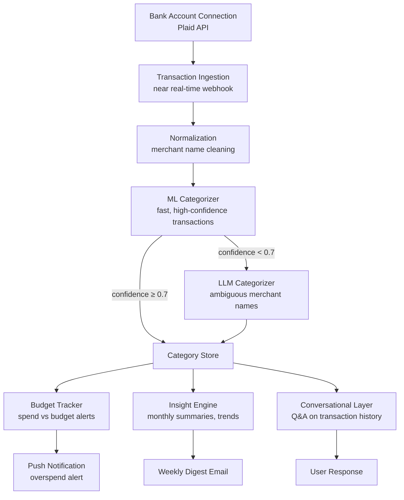
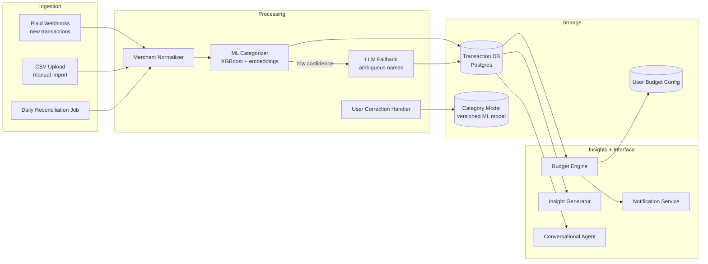

# Design a Personal Finance Agent — Conversational Spending Tracker with ML Categorization

**Difficulty**: 🟢 Easy
**Reading Time**: 20 minutes
**Interview Frequency**: Medium — good for demonstrating ML + conversational design understanding

> **The core challenge is trust: a finance agent that miscategorizes $500 of groceries as "entertainment" destroys user trust immediately. Accuracy and explainability must be built in from day one, not retrofitted.**

---

## Table of Contents

| Section | What You'll Learn |
|---------|-------------------|
| [Mental Model](#mental-model) | Transaction flow from bank to insight |
| [Requirements](#requirements) | Accuracy, privacy, and latency targets |
| [Architecture](#architecture) | Ingestion, categorization, and conversational layer |
| [Deep Dive: Transaction Categorization](#deep-dive-transaction-categorization) | ML + LLM hybrid approach |
| [Deep Dive: Insight Generation](#deep-dive-insight-generation) | Budget tracking and anomaly detection |
| [Deep Dive: Privacy Architecture](#deep-dive-privacy-architecture) | Handling sensitive financial data |
| [Failure Modes](#failure-modes) | Miscategorization, privacy risk, stale data |
| [Interview Q&A](#interview-qa) | How to answer common questions |

---

## Mental Model

The user connects their bank account. Every transaction syncs automatically, gets categorized (groceries / rent / dining / etc.), is tracked against budgets, and generates insights. The user can also ask conversational questions: "How much did I spend on Amazon last 3 months?" — the agent queries their transaction history and explains the answer.



---

## Requirements

### Functional Requirements

1. Connect bank accounts and credit cards via Plaid API (OAuth, no credential storage)
2. Sync transactions automatically via webhook (near real-time) and daily reconciliation
3. Categorize transactions with ML classifier + LLM fallback for ambiguous merchants
4. Allow user to manually correct categorization and learn from corrections
5. Track spending against user-defined monthly budgets per category
6. Generate insights ("you spent 35% more on dining this month vs last")
7. Answer conversational questions about spending history

### Non-Functional Requirements

| Requirement | Target |
|-------------|--------|
| Transaction sync latency | < 5 min via Plaid webhook |
| Categorization latency | < 2s per transaction |
| Categorization accuracy | > 92% for known merchants, > 75% for ambiguous |
| User data encryption | AES-256 at rest, TLS 1.3 in transit |
| Bank credentials stored | Never — OAuth tokens only, rotated every 90 days |
| GDPR/CCPA compliance | Right to deletion within 72h of request |
| Concurrent active users | 500,000 |

### Capacity Estimation

- 500,000 users × avg 100 transactions/month = 50M transactions/month
- 50M/month = ~19 transactions/second steady state, 60/sec at month-end billing cycles
- ML inference: 19 transactions/sec × 2ms each = trivial on a single GPU
- LLM fallback: ~5% of transactions = ~1 transaction/sec — well within API rate limits

---

## Architecture



---

## Deep Dive: Transaction Categorization

### Merchant Name Normalization

Raw bank transaction strings are messy:
```
"AMZN Mktp US*2B3K4L5M9"    → Amazon
"SQ *BLUE BOTTLE COFFE"      → Blue Bottle Coffee
"WHOLEFDS#10095 AUSTIN TX"   → Whole Foods
"UBER* TRIP HELP.UBER.COM"   → Uber
```

Normalization pipeline:
1. Strip transaction codes (asterisks, store numbers, state codes)
2. Match against merchant dictionary (2M known merchants with canonical names)
3. If not in dictionary: use fuzzy string matching (Levenshtein distance < 5 characters)
4. Enrich with MCC code from Plaid (Merchant Category Code — provided by card network)

### ML Classifier: XGBoost + Embeddings

Two-stage approach:

**Stage 1 — Rule-based fast path** (covers 60% of transactions):
- MCC code → category mapping (MCC 5411 = Grocery Stores → "Groceries")
- Known merchant dictionary → direct lookup
- Latency: < 1ms

**Stage 2 — ML classifier** (remaining 40%):
- Features: normalized merchant name embedding (sentence-transformers), MCC code, transaction amount, day of week, time of day, user's past categorization of same merchant
- Model: XGBoost, trained on 10M labeled transactions (crowdsourced corrections from users who opt into data sharing)
- Output: category + confidence score
- Latency: < 5ms

**Stage 3 — LLM fallback** (5% with confidence < 0.7):
- Prompt: "Categorize this bank transaction for personal finance tracking: merchant='[name]', amount=$[X], time=[datetime]. Choose one category from: [grocery, dining, entertainment, utilities, rent, healthcare, travel, shopping, subscriptions, other]"
- Latency: ~1s — async, doesn't block UI

### Learning from User Corrections

When a user changes "Amazon Kindle" from "Shopping" to "Subscriptions":
1. Store correction: `{merchant: "Amazon Kindle", user: "usr-123", correct_category: "Subscriptions"}`
2. Apply immediately to this user's future Amazon Kindle transactions
3. Aggregate corrections across users: if 1,000+ users correct Amazon Prime to "Subscriptions" → update merchant dictionary
4. Retrain ML model monthly incorporating new corrections (differential privacy: no individual's corrections traceable)

---

## Deep Dive: Insight Generation

### Spending Anomaly Detection

For each user, maintain a rolling 3-month baseline for each category:
```
Dining baseline (3-month avg): $420/month
Current month dining: $650
Delta: +55% — trigger insight
```

Insight text generation via LLM:
```
You spent $650 on dining this month — $230 (55%) more than your 3-month average of $420.
Top contributors:
  • Nobu Restaurant: $280 (2 visits)
  • UberEats: $145 (vs avg $60)

Would you like to set a dining budget for next month?
```

### Conversational Q&A

User query: "How much did I spend on Amazon last 3 months?"

```
1. Parse intent: merchant="Amazon", time_range="last 3 months", metric="total spend"
2. SQL query: SELECT SUM(amount), COUNT(*) FROM transactions
             WHERE merchant_normalized = 'Amazon'
               AND user_id = current_user
               AND date >= NOW() - INTERVAL '3 months'
3. Fetch results: $847 across 34 transactions
4. LLM explanation: "You spent $847 on Amazon over the last 3 months across 34 transactions.
   That's an average of $282/month. Your highest month was February at $412,
   which included a $289 Amazon device purchase. Your regular Amazon spending
   (excluding large one-time items) averages $174/month."
```

The conversational layer maintains session context so follow-up questions work:
- "Break it down by category" → uses previous query context (Amazon, last 3 months)
- "What was the big purchase in February?" → drill-down on the $289 item identified earlier

---

## Deep Dive: Privacy Architecture

### Data Sensitivity Tiers

| Data Type | Sensitivity | Storage | Encryption |
|-----------|-------------|---------|------------|
| Bank credentials | Never stored | — | — |
| OAuth access tokens | High | Secrets manager (Vault) | Envelope encryption |
| Transaction amounts | High | Postgres | Column-level encryption |
| Merchant names | Medium | Postgres | DB-level encryption |
| Spending insights | Low | Postgres | DB-level encryption |
| ML training data | Aggregate only | S3 | S3-SSE |

### Plaid Integration Security

- OAuth 2.0 flow: user authenticates directly with their bank on Plaid's secure page — we never see credentials
- Access tokens stored in HashiCorp Vault, not in application DB
- Tokens rotated every 90 days; revocation on account deletion within 1 hour
- Least-privilege Plaid scope: request only `transactions` and `accounts` — not `liabilities`, `investments`, or `identity`

### Right to Deletion

GDPR Article 17 requires deletion within 30 days; CCPA requires 45 days. We target 72 hours:

```
Deletion request received:
1. Revoke Plaid access token (immediate)
2. Delete transaction records (cascade delete all user data)
3. Delete ML corrections attributed to this user
4. Delete user profile and preferences
5. Issue deletion confirmation email with list of deleted data categories
6. Retain only: billing records (required by law for 7 years), anonymized aggregated data (no PII)
```

---

## Failure Modes

### 1. Miscategorization of Large Transactions
**Scenario**: $2,400 charge from "APPLE" categorized as "Electronics Shopping" — it's actually rent payment through Apple Cash
**Impact**: Budget tracking shows shopping over-budget; rent appears unpaid; user loses trust
**Mitigation**:
- Flag transactions > $500 for user review even if ML confidence is high
- Show categorization rationale: "Categorized as 'Shopping' because APPLE is typically a retailer. Is this a rent or bill payment?"
- One-click correction in notification: "Tap to recategorize"
- Learn from correction: future Apple Cash transfers → Rent

### 2. Privacy Risk from Bank Credential Phishing
**Scenario**: Attacker creates fake "connect bank" page that captures credentials
**Impact**: Account takeover, financial fraud
**Mitigation**:
- Always redirect to Plaid Link (Plaid's certified OAuth screen) — never our own bank login form
- Phishing-resistant MFA for the finance agent account itself
- Security awareness: in-app reminder "We will never ask for your bank password"
- Monitor for credential stuffing: excessive failed login attempts → account lock

### 3. Inconsistent Insights Across Sessions
**Scenario**: User asks "how much did I spend last month?" on Monday → $1,200. Asks same question Thursday → $1,150. Data changed due to transaction posting delays
**Impact**: User confusion; loss of trust in accuracy
**Mitigation**:
- Distinguish between posted transactions (confirmed) and pending (may change)
- Always state data freshness: "As of today (pending transactions may not yet be reflected)"
- Monthly snapshots: on the 1st of each month, take a snapshot of the prior month's data for historical Q&A to ensure consistent answers

### 4. Plaid API Outage Blocking Sync
**Scenario**: Plaid has 4-hour outage; no new transactions sync; user gets stale balance notification
**Impact**: Budget alerts delayed; user overspends thinking they're under budget
**Mitigation**:
- Cache last successful sync time; show "Last synced X hours ago" prominently when stale > 2h
- Implement exponential backoff retry for failed Plaid calls (5min, 15min, 1h, 4h)
- Daily reconciliation job catches any transactions missed during Plaid outage
- User notification: "Bank sync temporarily unavailable — showing data as of [time]"

---

## Interview Q&A

### "How would you handle a user who has 5 bank accounts and wants a unified view?"

> "This is a fan-out aggregation problem. Each bank account has its own Plaid integration and transaction stream. On the storage side, every transaction has a user_id and account_id — queries naturally aggregate across accounts with WHERE user_id = X. The categorization model runs identically regardless of source account. The tricky part is deduplication: if the user transfers from Account A to Account B, both appear as transactions. We detect internal transfers by matching amount + opposite direction within 72 hours and tag them as 'Internal Transfer' — excluded from budget calculations. For the conversational layer, users can scope questions: 'How much on Chase vs total?' The agent queries by account_id when specified."

### "How would you approach the cold start problem — a new user with no transaction history?"

> "Three layers: (1) The ML categorizer works from day one because it's based on merchant name + MCC code, not user history — Amazon is categorized the same for everyone. User history only improves confidence for ambiguous cases. (2) For budgets, we offer a 'quick setup' based on income and household type (single, couple, family) — we populate suggested budgets from aggregate benchmarks (median single-person household spends $400/month on groceries). (3) For insights, we don't show comparisons for the first 30 days — we accumulate a baseline first. After 30 days, we switch from 'here are your transactions' to 'here are your trends.' Premature comparisons with insufficient data create misleading insights."

---

## Key Takeaways

| Number | What It Means |
|--------|--------------|
| **92% accuracy** | ML categorization target for known merchants — LLM handles the rest |
| **< 5 min** | Transaction sync latency via Plaid webhook |
| **3 FP corrections** | Before auto-updating merchant dictionary — prevents one user's mistake from affecting others |
| **72h deletion** | Target for GDPR/CCPA right-to-erasure response |
| **$500 threshold** | Flag large transactions for user review even at high ML confidence |
| **Never store credentials** | OAuth token only — Plaid handles auth; we only see access tokens |

---

## 📚 Resources & References

| Resource | Type | What You'll Learn |
|----------|------|------------------|
| [Plaid API Documentation](https://plaid.com/docs/) | 📚 Docs | How to integrate bank data via OAuth and transaction webhooks |
| [Mint Engineering: How We Categorize Transactions](https://www.businessinsider.com/how-mint-categorizes-transactions-2012-9) | 📖 Blog | Real-world ML categorization at scale from a pioneer in personal finance |
| [Sam Witteveen — Conversational Finance Agent](https://www.youtube.com/@samwitteveenai) | 📺 YouTube | Building a conversational agent with financial data tools |
| [Differential Privacy for ML Models](https://arxiv.org/abs/2106.02776) | 📖 Blog | Privacy-preserving learning from user corrections |
| [ByteByteGo — Design a Payment System](https://www.youtube.com/@ByteByteGo) | 📺 YouTube | Search "payment system design" — relevant financial data architecture |
| [Lilian Weng — Building LLM Applications for Production](https://lilianweng.github.io/posts/2023-10-25-adv-attack-llm/) | 📖 Blog | Security considerations for LLM-powered consumer apps |
