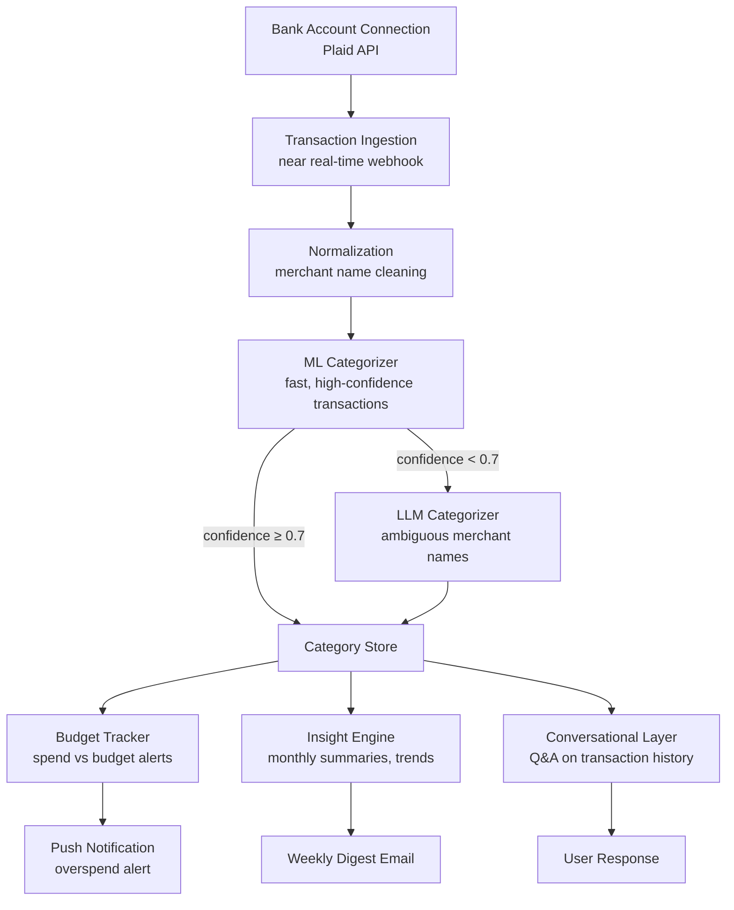
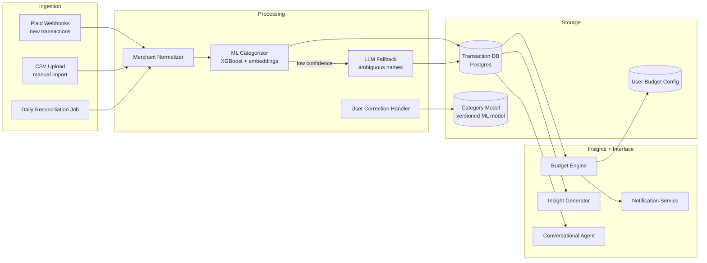
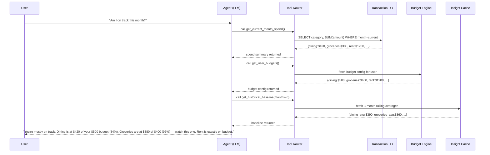
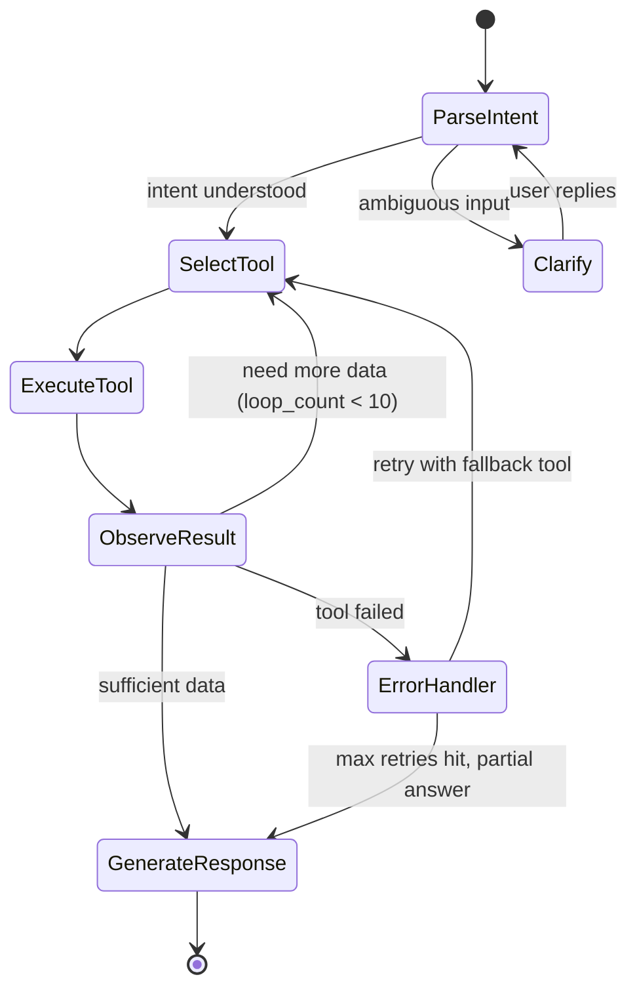

# Design a Personal Finance Agent — Conversational Spending Tracker with ML Categorization

**Difficulty**: 🟢 Easy
**Reading Time**: 20 minutes
**Interview Frequency**: Medium — good for demonstrating ML + conversational design understanding

> **The core challenge is trust: a finance agent that miscategorizes $500 of groceries as "entertainment" destroys user trust immediately. Accuracy and explainability must be built in from day one, not retrofitted.**

---

## Table of Contents

| Section | What You'll Learn |
|---------|-------------------|
| [Mental Model](#mental-model) | Transaction flow from bank to insight |
| [Requirements](#requirements) | Accuracy, privacy, and latency targets |
| [Architecture](#architecture) | Ingestion, categorization, and conversational layer |
| [Deep Dive: Transaction Categorization](#deep-dive-transaction-categorization) | ML + LLM hybrid approach |
| [Deep Dive: Insight Generation](#deep-dive-insight-generation) | Budget tracking and anomaly detection |
| [Deep Dive: Privacy Architecture](#deep-dive-privacy-architecture) | Handling sensitive financial data |
| [Failure Modes](#failure-modes) | Miscategorization, privacy risk, stale data |
| [Interview Q&A](#interview-qa) | How to answer common questions |

---

## Mental Model

The user connects their bank account. Every transaction syncs automatically, gets categorized (groceries / rent / dining / etc.), is tracked against budgets, and generates insights. The user can also ask conversational questions: "How much did I spend on Amazon last 3 months?" — the agent queries their transaction history and explains the answer.



---

## Requirements

### Functional Requirements

1. Connect bank accounts and credit cards via Plaid API (OAuth, no credential storage)
2. Sync transactions automatically via webhook (near real-time) and daily reconciliation
3. Categorize transactions with ML classifier + LLM fallback for ambiguous merchants
4. Allow user to manually correct categorization and learn from corrections
5. Track spending against user-defined monthly budgets per category
6. Generate insights ("you spent 35% more on dining this month vs last")
7. Answer conversational questions about spending history

### Non-Functional Requirements

| Requirement | Target |
|-------------|--------|
| Transaction sync latency | < 5 min via Plaid webhook |
| Categorization latency | < 2s per transaction |
| Categorization accuracy | > 92% for known merchants, > 75% for ambiguous |
| User data encryption | AES-256 at rest, TLS 1.3 in transit |
| Bank credentials stored | Never — OAuth tokens only, rotated every 90 days |
| GDPR/CCPA compliance | Right to deletion within 72h of request |
| Concurrent active users | 500,000 |

### Capacity Estimation

- 500,000 users × avg 100 transactions/month = 50M transactions/month
- 50M/month = ~19 transactions/second steady state, 60/sec at month-end billing cycles
- ML inference: 19 transactions/sec × 2ms each = trivial on a single GPU
- LLM fallback: ~5% of transactions = ~1 transaction/sec — well within API rate limits

---

## Architecture



---

## Deep Dive: Transaction Categorization

### Merchant Name Normalization

Raw bank transaction strings are messy:
```
"AMZN Mktp US*2B3K4L5M9"    → Amazon
"SQ *BLUE BOTTLE COFFE"      → Blue Bottle Coffee
"WHOLEFDS#10095 AUSTIN TX"   → Whole Foods
"UBER* TRIP HELP.UBER.COM"   → Uber
```

Normalization pipeline:
1. Strip transaction codes (asterisks, store numbers, state codes)
2. Match against merchant dictionary (2M known merchants with canonical names)
3. If not in dictionary: use fuzzy string matching (Levenshtein distance < 5 characters)
4. Enrich with MCC code from Plaid (Merchant Category Code — provided by card network)

### ML Classifier: XGBoost + Embeddings

Two-stage approach:

**Stage 1 — Rule-based fast path** (covers 60% of transactions):
- MCC code → category mapping (MCC 5411 = Grocery Stores → "Groceries")
- Known merchant dictionary → direct lookup
- Latency: < 1ms

**Stage 2 — ML classifier** (remaining 40%):
- Features: normalized merchant name embedding (sentence-transformers), MCC code, transaction amount, day of week, time of day, user's past categorization of same merchant
- Model: XGBoost, trained on 10M labeled transactions (crowdsourced corrections from users who opt into data sharing)
- Output: category + confidence score
- Latency: < 5ms

**Stage 3 — LLM fallback** (5% with confidence < 0.7):
- Prompt: "Categorize this bank transaction for personal finance tracking: merchant='[name]', amount=$[X], time=[datetime]. Choose one category from: [grocery, dining, entertainment, utilities, rent, healthcare, travel, shopping, subscriptions, other]"
- Latency: ~1s — async, doesn't block UI

### Learning from User Corrections

When a user changes "Amazon Kindle" from "Shopping" to "Subscriptions":
1. Store correction: `{merchant: "Amazon Kindle", user: "usr-123", correct_category: "Subscriptions"}`
2. Apply immediately to this user's future Amazon Kindle transactions
3. Aggregate corrections across users: if 1,000+ users correct Amazon Prime to "Subscriptions" → update merchant dictionary
4. Retrain ML model monthly incorporating new corrections (differential privacy: no individual's corrections traceable)

---

## Deep Dive: Insight Generation

### Spending Anomaly Detection

For each user, maintain a rolling 3-month baseline for each category:
```
Dining baseline (3-month avg): $420/month
Current month dining: $650
Delta: +55% — trigger insight
```

Insight text generation via LLM:
```
You spent $650 on dining this month — $230 (55%) more than your 3-month average of $420.
Top contributors:
  • Nobu Restaurant: $280 (2 visits)
  • UberEats: $145 (vs avg $60)

Would you like to set a dining budget for next month?
```

### Conversational Q&A

User query: "How much did I spend on Amazon last 3 months?"

```
1. Parse intent: merchant="Amazon", time_range="last 3 months", metric="total spend"
2. SQL query: SELECT SUM(amount), COUNT(*) FROM transactions
             WHERE merchant_normalized = 'Amazon'
               AND user_id = current_user
               AND date >= NOW() - INTERVAL '3 months'
3. Fetch results: $847 across 34 transactions
4. LLM explanation: "You spent $847 on Amazon over the last 3 months across 34 transactions.
   That's an average of $282/month. Your highest month was February at $412,
   which included a $289 Amazon device purchase. Your regular Amazon spending
   (excluding large one-time items) averages $174/month."
```

The conversational layer maintains session context so follow-up questions work:
- "Break it down by category" → uses previous query context (Amazon, last 3 months)
- "What was the big purchase in February?" → drill-down on the $289 item identified earlier

---

## Deep Dive: Privacy Architecture

### Data Sensitivity Tiers

| Data Type | Sensitivity | Storage | Encryption |
|-----------|-------------|---------|------------|
| Bank credentials | Never stored | — | — |
| OAuth access tokens | High | Secrets manager (Vault) | Envelope encryption |
| Transaction amounts | High | Postgres | Column-level encryption |
| Merchant names | Medium | Postgres | DB-level encryption |
| Spending insights | Low | Postgres | DB-level encryption |
| ML training data | Aggregate only | S3 | S3-SSE |

### Plaid Integration Security

- OAuth 2.0 flow: user authenticates directly with their bank on Plaid's secure page — we never see credentials
- Access tokens stored in HashiCorp Vault, not in application DB
- Tokens rotated every 90 days; revocation on account deletion within 1 hour
- Least-privilege Plaid scope: request only `transactions` and `accounts` — not `liabilities`, `investments`, or `identity`

### Right to Deletion

GDPR Article 17 requires deletion within 30 days; CCPA requires 45 days. We target 72 hours:

```
Deletion request received:
1. Revoke Plaid access token (immediate)
2. Delete transaction records (cascade delete all user data)
3. Delete ML corrections attributed to this user
4. Delete user profile and preferences
5. Issue deletion confirmation email with list of deleted data categories
6. Retain only: billing records (required by law for 7 years), anonymized aggregated data (no PII)
```

---

## Failure Modes

### 1. Miscategorization of Large Transactions
**Scenario**: $2,400 charge from "APPLE" categorized as "Electronics Shopping" — it's actually rent payment through Apple Cash
**Impact**: Budget tracking shows shopping over-budget; rent appears unpaid; user loses trust
**Mitigation**:
- Flag transactions > $500 for user review even if ML confidence is high
- Show categorization rationale: "Categorized as 'Shopping' because APPLE is typically a retailer. Is this a rent or bill payment?"
- One-click correction in notification: "Tap to recategorize"
- Learn from correction: future Apple Cash transfers → Rent

### 2. Privacy Risk from Bank Credential Phishing
**Scenario**: Attacker creates fake "connect bank" page that captures credentials
**Impact**: Account takeover, financial fraud
**Mitigation**:
- Always redirect to Plaid Link (Plaid's certified OAuth screen) — never our own bank login form
- Phishing-resistant MFA for the finance agent account itself
- Security awareness: in-app reminder "We will never ask for your bank password"
- Monitor for credential stuffing: excessive failed login attempts → account lock

### 3. Inconsistent Insights Across Sessions
**Scenario**: User asks "how much did I spend last month?" on Monday → $1,200. Asks same question Thursday → $1,150. Data changed due to transaction posting delays
**Impact**: User confusion; loss of trust in accuracy
**Mitigation**:
- Distinguish between posted transactions (confirmed) and pending (may change)
- Always state data freshness: "As of today (pending transactions may not yet be reflected)"
- Monthly snapshots: on the 1st of each month, take a snapshot of the prior month's data for historical Q&A to ensure consistent answers

### 4. Plaid API Outage Blocking Sync
**Scenario**: Plaid has 4-hour outage; no new transactions sync; user gets stale balance notification
**Impact**: Budget alerts delayed; user overspends thinking they're under budget
**Mitigation**:
- Cache last successful sync time; show "Last synced X hours ago" prominently when stale > 2h
- Implement exponential backoff retry for failed Plaid calls (5min, 15min, 1h, 4h)
- Daily reconciliation job catches any transactions missed during Plaid outage
- User notification: "Bank sync temporarily unavailable — showing data as of [time]"

---

## Interview Q&A

### "How would you handle a user who has 5 bank accounts and wants a unified view?"

> "This is a fan-out aggregation problem. Each bank account has its own Plaid integration and transaction stream. On the storage side, every transaction has a user_id and account_id — queries naturally aggregate across accounts with WHERE user_id = X. The categorization model runs identically regardless of source account. The tricky part is deduplication: if the user transfers from Account A to Account B, both appear as transactions. We detect internal transfers by matching amount + opposite direction within 72 hours and tag them as 'Internal Transfer' — excluded from budget calculations. For the conversational layer, users can scope questions: 'How much on Chase vs total?' The agent queries by account_id when specified."

### "How would you approach the cold start problem — a new user with no transaction history?"

> "Three layers: (1) The ML categorizer works from day one because it's based on merchant name + MCC code, not user history — Amazon is categorized the same for everyone. User history only improves confidence for ambiguous cases. (2) For budgets, we offer a 'quick setup' based on income and household type (single, couple, family) — we populate suggested budgets from aggregate benchmarks (median single-person household spends $400/month on groceries). (3) For insights, we don't show comparisons for the first 30 days — we accumulate a baseline first. After 30 days, we switch from 'here are your transactions' to 'here are your trends.' Premature comparisons with insufficient data create misleading insights."

---

## Key Takeaways

| Number | What It Means |
|--------|--------------|
| **92% accuracy** | ML categorization target for known merchants — LLM handles the rest |
| **< 5 min** | Transaction sync latency via Plaid webhook |
| **3 FP corrections** | Before auto-updating merchant dictionary — prevents one user's mistake from affecting others |
| **72h deletion** | Target for GDPR/CCPA right-to-erasure response |
| **$500 threshold** | Flag large transactions for user review even at high ML confidence |
| **Never store credentials** | OAuth token only — Plaid handles auth; we only see access tokens |

---

## Agent Architecture

The personal finance agent operates as a **ReAct-style loop** (Reason + Act): it reasons about what information it needs, selects the right tool, executes it, observes the result, and either produces a final answer or reasons again. A single user question like "Am I on track this month?" can trigger 3–5 tool calls before the agent has enough data to give a confident, grounded response.



The agent loop has a hard cap of **10 tool calls per query** to prevent runaway costs. Most queries resolve in 2–4 calls. The LLM used for reasoning is Claude 3 Haiku or GPT-4o-mini (low cost, low latency), with Claude 3 Sonnet reserved for complex multi-step financial planning questions that require deeper reasoning.

### Agent Loop State Machine



---

## Tool/Function Registry

The agent has access to a curated set of tools — each is a typed function with a JSON schema the LLM uses to decide when and how to call it.

### Core Tools

| Tool Name | Description | Typical Latency | Failure Mode |
|-----------|-------------|-----------------|--------------|
| `get_transactions(user_id, start_date, end_date, category?)` | Fetch raw or filtered transactions from Postgres | 20–80ms | DB overload → cached fallback |
| `get_monthly_spend_summary(user_id, month)` | Aggregated spend by category for a given month | 15–40ms | Stale cache → recompute |
| `get_user_budgets(user_id)` | User's budget config per category | 5ms (KV cache) | Cache miss → Postgres fallback |
| `get_historical_baseline(user_id, months)` | Rolling N-month averages per category | 30–60ms | Insufficient history → graceful degradation |
| `search_transactions(user_id, merchant_name, date_range)` | Full-text merchant search with fuzzy matching | 25–70ms | Empty result → suggest alternatives |
| `get_category_trend(user_id, category, months)` | Month-over-month trend for one category | 40ms | — |
| `flag_transaction(transaction_id, reason)` | Mark a transaction for user review | 10ms (write) | Write conflict → optimistic retry |
| `recategorize_transaction(transaction_id, new_category)` | Apply user correction + trigger ML retraining signal | 15ms | Conflict → idempotent upsert |
| `get_upcoming_bills(user_id)` | Subscription and recurring charge predictions | 50ms | Missing data → show known bills only |
| `calculate_savings_rate(user_id, month)` | (Income − spend) / income | 60ms | No income data → skip with note |

### Tool Selection Strategy

The LLM receives a system prompt that includes all tool schemas. Tool selection is handled by the model's function-calling interface (OpenAI function calling or Claude tool_use). The agent uses the following priority logic embedded in the system prompt:

```
1. For time-range questions → prefer get_monthly_spend_summary over raw get_transactions (10x faster)
2. For merchant-specific questions → use search_transactions with fuzzy merchant name
3. For "am I on track" → always call get_user_budgets AND get_monthly_spend_summary together (parallel calls)
4. For trend questions → use get_category_trend, not manual aggregation of raw transactions
5. If a tool returns an error → log it, try one alternative, then answer with available data + caveat
```

### Error Handling When Tools Fail

```
Tool failure hierarchy:
  1. Transient DB error → retry once after 50ms
  2. Timeout (> 200ms) → use cached result if < 1 hour old
  3. No cache available → return partial answer: "I can tell you about groceries and dining, but
     couldn't fetch your rent data right now. Try again in a few minutes."
  4. Rate limit on LLM → queue request, respond with ETA: "I'll have your answer ready in ~30s"
  5. All tools unavailable → "Your bank sync is temporarily unavailable. Showing data as of [last sync time]."
```

---

## Prompt Engineering

### System Prompt Structure

The system prompt has four layers, ordered by authority (higher layers override lower):

```
LAYER 1 — Identity & Constraints (immutable)
  You are a personal finance assistant. You only answer questions about the user's
  own financial data. You never provide investment advice, tax advice, or legal advice.
  You never fabricate numbers — if data is unavailable, say so explicitly.

LAYER 2 — User Context (injected at session start)
  User: {user_id}
  Accounts: Chase Checking (...4521), Amex Gold (...8834), Ally Savings (...2201)
  Currency: USD
  Budget month: June 2026
  Timezone: America/New_York

LAYER 3 — Available Tools (auto-generated from tool registry)
  [JSON schema for each tool — injected dynamically]

LAYER 4 — Behavioral Instructions
  - Always state which time period your answer covers
  - When spend > 80% of budget, add a gentle heads-up
  - Show amounts in dollars with 2 decimal places
  - For follow-up questions, use context from the previous turn — don't re-fetch if data is fresh (< 5 min)
  - Respond in ≤ 3 short paragraphs unless the user asks for detail
```

### Context Management

The agent maintains a **sliding window context** of the last 8 conversation turns plus the current query. This is ~2,000–4,000 tokens typical, keeping inference costs under $0.002 per query at Haiku pricing.

When a session exceeds 12 turns, older turns are summarized and compressed:
```
[Compressed context: User asked about Amazon spending ($847 over 3 months), dining trend
(+15% vs prior month), and set a $400 dining budget for July. Outstanding: user asked to
remind them about Netflix — not yet addressed.]
```

This summary is generated by the same LLM as a background task when turn count hits 10, so it is ready before turn 12 is needed.

---

## Failure Modes

### Hallucination

**When it happens**: The LLM reasons about numbers it does not have access to. Classic example: "You typically spend around $300/month on entertainment" — when the model has not called `get_historical_baseline()` and is inferring from general knowledge.

**Detection**: All dollar figures in the final response are validated against a whitelist of numbers returned by tool calls in the current session. Any number in the response not present in tool outputs triggers a re-generation with an explicit instruction: "Only state amounts you retrieved from the tools. Do not estimate."

**Mitigation**:
- Strict grounding instruction in system prompt: "Every dollar figure you state must come from a tool call result in this session."
- Post-generation fact checker: regex extracts all numeric values from response, validates each against tool call outputs, rejects if any are ungrounded.
- Confidence scoring: if tool results are sparse (< 3 transactions in the time range), the agent adds: "Note: this is based on limited data."

### Loop Detection

**When it happens**: The agent calls `get_transactions`, gets results, calls `get_transactions` again with the same parameters (model thinks it needs more data), and loops.

**Prevention**:
- Tool call deduplication: cache tool calls by (tool_name, params_hash) within a session. If the same call is made twice, return the cached result and inject a note into the context: "You already called this tool with these parameters. Use the results you have."
- Hard cap of 10 tool calls per query, enforced in the agent runner (not in the LLM prompt).
- Loop detector: if the last 3 tool calls are identical → terminate with partial answer.

### Cost Control

At $0.00025/1K input tokens for Haiku and ~3,000 tokens per query (system prompt + context + tools), each query costs approximately **$0.00075 in LLM tokens**. At 500K users × 10 queries/day = 5M queries/day = **$3,750/day in LLM costs** before optimization.

| Optimization | Savings | How |
|---|---|---|
| Route simple queries to rule-based engine | 40% of queries | Balance checks, "last transaction" queries need no LLM |
| Cache repeated identical queries | 15% of queries | "What's my rent?" asked daily — cache 5 minutes |
| Use Haiku by default, escalate to Sonnet only | 60% cost reduction on complex queries | Complexity classifier routes to Haiku vs Sonnet |
| Compress context aggressively | 20% token reduction | Session summary replaces raw turn history |
| Batch insight generation offline | Removes 30% of queries | Pre-generate weekly summaries so user "pull" is fast |

**Token budget per query**: hard cap at 8,000 tokens total (prompt + completion). If context exceeds 6,000 tokens, trigger compression before proceeding.

---

## Production Considerations

### Latency Budget

A user types "How much did I spend eating out this month?" — here is where the time goes:

| Step | Time | Notes |
|------|------|-------|
| API gateway + auth | 10ms | JWT validation, rate limit check |
| LLM intent parse + tool selection | 600ms | Haiku P50; 1,200ms P99 |
| Tool call 1: `get_monthly_spend_summary` | 35ms | Postgres with partial index on (user_id, month) |
| Tool call 2: `get_user_budgets` | 5ms | Redis cache hit |
| LLM response generation | 800ms | Haiku P50 for ~200 token response |
| Response serialization + delivery | 15ms | — |
| **Total P50** | **~1,465ms** | — |
| **Total P99** | **~3,500ms** | LLM tail latency dominates |

**SLA target**: 95th percentile < 4s. Streaming is used for LLM responses — the user sees text appearing after ~700ms rather than waiting for the full response.

### Cost Per Query

| Model | Tokens (avg) | Cost/query | Use Case |
|-------|-------------|------------|----------|
| GPT-4o-mini / Haiku | 3,200 | $0.0008 | Standard spend questions |
| Claude Sonnet 3.5 | 4,500 | $0.012 | Financial planning, debt payoff |
| Rule-based engine | 0 | $0.000 | Balance checks, last transaction |

At 500K users × 6 LLM queries/day (40% routed to rule engine): ~$1,440/day LLM cost = **~$43,200/month**.

### Fallback to Non-AI Path

For high-load periods or LLM API outages, the system falls back to a **structured query interface**: pre-built cards for common questions (current month spend, budget status, last 5 transactions). This covers 80% of user queries with zero LLM cost and < 200ms latency. The conversational UI shows: "Quick answers available below — or type your question for AI analysis."

---

## Real System Reference: Intuit's Mint and AI-Powered Finance Insights

**Intuit** (Mint, TurboTax, QuickBooks) has published extensively on their ML and AI journey in personal finance.

**Scale**: At peak, Mint had 25 million users with 30M+ linked accounts, processing **500M+ transactions per month** — roughly 200 transactions/second sustained, spiking to 800/sec at month-end.

**Technology choices**:
- **Transaction categorization**: Intuit's ML team trained a gradient boosted tree model on 10+ billion labeled transactions (their scale dwarfs any individual user dataset). Features included merchant MCC codes, transaction amount, time of day, and — critically — the **neighboring transactions in the same statement** (a $200 charge right after a flight booking is more likely to be baggage fees than random shopping).
- **Merchant normalization**: Intuit built a proprietary merchant database of 5M+ merchant names with canonical forms. This alone required a dedicated data engineering team to maintain and was their biggest competitive moat — normalization accuracy directly gates categorization accuracy.
- **LLM integration (post-2023)**: After acquiring Credit Karma and integrating with TurboTax, Intuit built "Intuit Assist" — a finance AI assistant powered by their own fine-tuned LLMs. A key non-obvious decision: they fine-tuned on **anonymized tax return data** to give the model grounding in realistic household financial patterns, which dramatically reduced hallucinated financial advice compared to a base LLM.
- **Privacy architecture**: User financial data never leaves Intuit's data centers for LLM inference — they run their fine-tuned models on-premise in AWS GovCloud-equivalent isolated environments.
- **Numbers**: Intuit's 2024 earnings call cited 14M Intuit Assist monthly active users with 93% categorization accuracy across 30 financial data types.

**Source**: Intuit Engineering Blog (https://www.intuit.com/blog/technology/), Intuit Assist announcements (2023–2024), and their ML Research publications.

**The non-obvious lesson**: Intuit's most impactful engineering investment was not the ML model itself — it was the **merchant normalization database**. A 95%-accurate categorizer on clean merchant names is more valuable than a 99%-accurate model on messy raw strings. Data quality upstream determines model quality downstream.

---

## Interview Angle

**What the interviewer is testing:** The ability to design an AI agent that is grounded (doesn't hallucinate financial numbers), cost-controlled (LLM calls are expensive at scale), and trustworthy to users handling sensitive personal data. The interviewer wants to see that you think about the non-AI components (data ingestion, normalization, storage) as much as the AI components.

**Common mistakes candidates make:**

1. **Over-relying on the LLM for everything**: Saying "the LLM will figure out the SQL query" ignores that LLM-generated SQL on user financial data is a security and correctness nightmare. Tool calls with pre-validated, parameterized queries are the correct pattern — the LLM selects tools, it does not write raw queries.

2. **Ignoring cost at scale**: A design that costs $0.05 per query sounds fine until you multiply by 5M queries/day — that's $250K/day. Candidates who don't reason about token budgets, model routing (cheap model for simple queries), and caching are designing an undeployable system.

3. **Not addressing hallucination mitigation**: Saying "I'll use a good LLM and it won't hallucinate" is not an architecture decision. Grounding validation (every number in the response must trace to a tool call result), confidence thresholds, and fallback language ("I don't have enough data to answer this confidently") are required components.

**The insight that separates good from great answers:** The hardest problem is not the AI — it's merchant normalization and data quality. A great answer identifies that "AMZN Mktp US*2B3K4L5M9" and "Amazon.com" and "AmazonPrime" are the same entity, and that solving this mapping problem at scale (millions of unique raw merchant strings) is more valuable than any ML model improvement. Great candidates also note that user corrections are a flywheel: each correction improves the model for all users, creating a compounding data advantage that is nearly impossible for competitors to replicate.

---

## Key Numbers to Remember

| Metric | Value | Context |
|--------|-------|---------|
| Transaction categorization accuracy | 92% known merchants, 75% ambiguous | With XGBoost + LLM fallback hybrid |
| LLM fallback rate | 5% of transactions | Transactions where ML confidence < 0.7 |
| Transaction sync latency | < 5 minutes | Via Plaid webhook; daily reconciliation catches stragglers |
| Agent query P50 latency | ~1,500ms | Haiku model; 2 tool calls average |
| Agent query P99 latency | ~3,500ms | LLM tail latency dominates |
| LLM cost per query | $0.0008 (Haiku) to $0.012 (Sonnet) | Haiku for standard, Sonnet for complex planning |
| Monthly LLM cost at 500K users | ~$43,000/month | With 40% routed to rule-based engine |
| Max tool calls per query | 10 (hard cap) | Loop prevention; typical query uses 2–4 |
| Context window per session | 8 turns + summary | ~3,000–4,000 tokens typical |
| GDPR/CCPA deletion SLA | 72 hours | Legal minimum is 30–45 days; we target 72h |
| Merchant normalization DB size | 2M+ known merchants | Canonical name lookup before ML |
| Intuit Mint scale | 500M transactions/month | 200 tx/sec sustained at 25M users |

---

## 📚 Resources & References

| Resource | Type | What You'll Learn |
|----------|------|------------------|
| [Plaid API Documentation](https://plaid.com/docs/) | 📚 Docs | How to integrate bank data via OAuth and transaction webhooks |
| [Mint Engineering: How We Categorize Transactions](https://www.businessinsider.com/how-mint-categorizes-transactions-2012-9) | 📖 Blog | Real-world ML categorization at scale from a pioneer in personal finance |
| [Sam Witteveen — Conversational Finance Agent](https://www.youtube.com/@samwitteveenai) | 📺 YouTube | Building a conversational agent with financial data tools |
| [Differential Privacy for ML Models](https://arxiv.org/abs/2106.02776) | 📖 Blog | Privacy-preserving learning from user corrections |
| [ByteByteGo — Design a Payment System](https://www.youtube.com/@ByteByteGo) | 📺 YouTube | Search "payment system design" — relevant financial data architecture |
| [Lilian Weng — Building LLM Applications for Production](https://lilianweng.github.io/posts/2023-10-25-adv-attack-llm/) | 📖 Blog | Security considerations for LLM-powered consumer apps |
