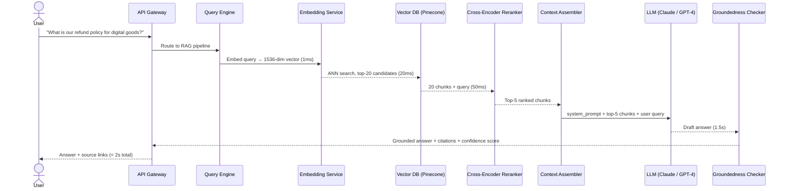
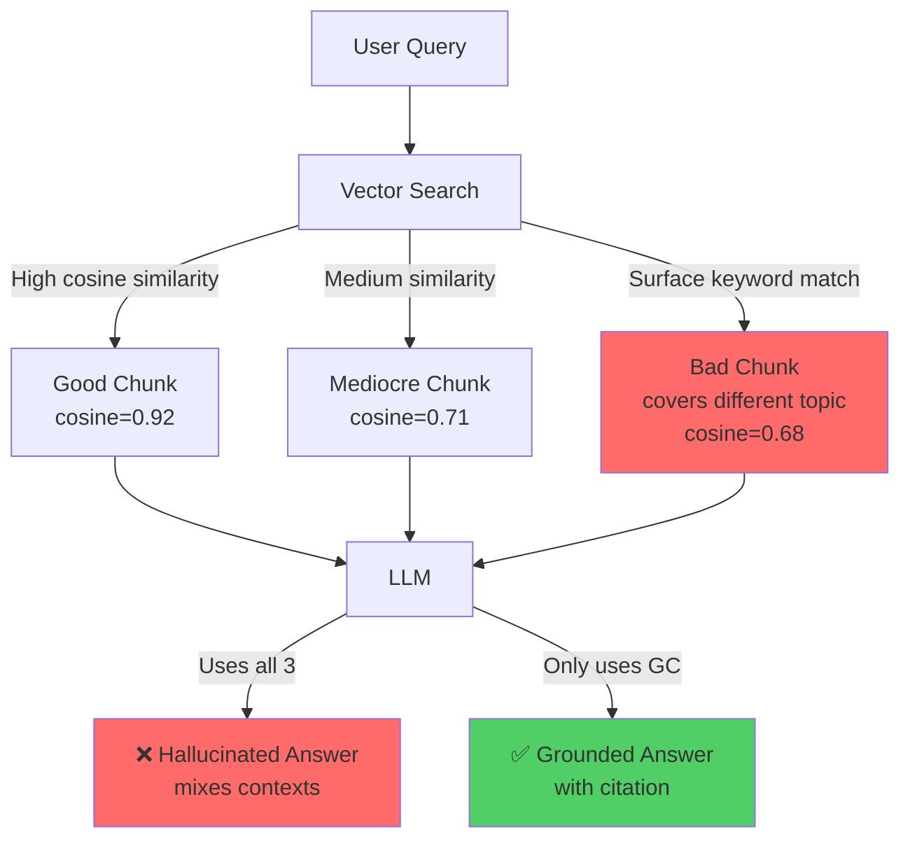
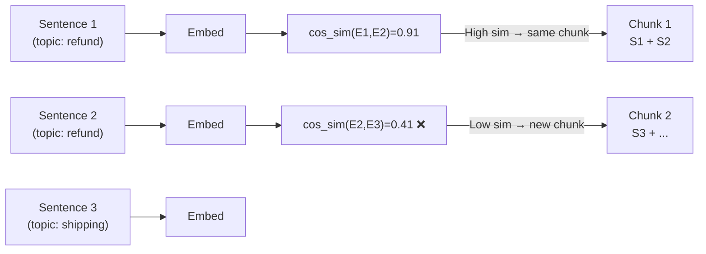
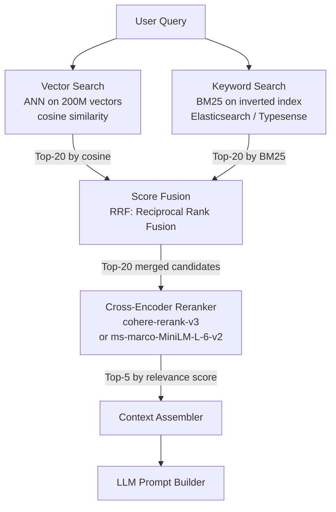
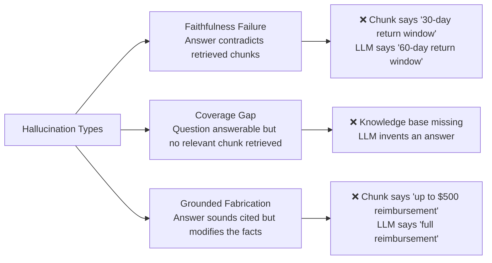
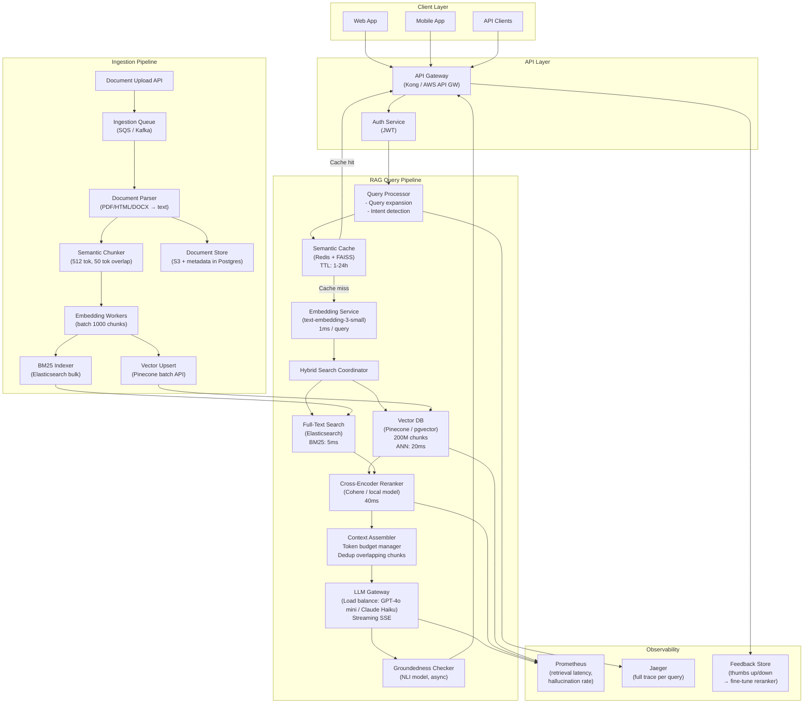
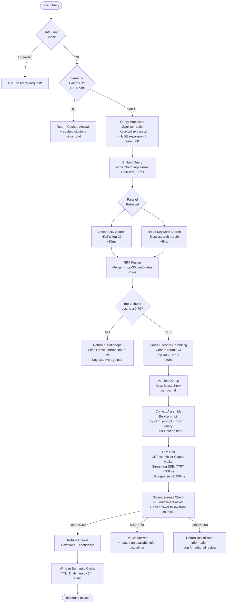
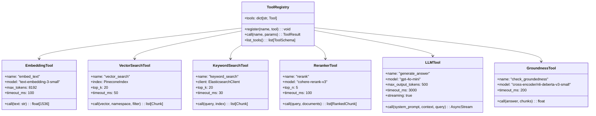

# Design a Production RAG Q&A Agent — 10M Documents, < 2s Latency

**Difficulty**: 🔴 Advanced → ⚫ Senior
**Reading Time**: 40 minutes
**Interview Frequency**: High — appears in ~70% of AI/ML system design interviews at senior level and above

> **The hardest part of a RAG system isn't the LLM — it's ensuring the retrieved chunks are relevant, non-contradictory, and actually grounded in your knowledge base. A hallucinating RAG is worse than no RAG at all.**

---

## Table of Contents

| Section | What You'll Learn |
|---------|-------------------|
| [Mental Model](#mental-model) | The full RAG pipeline end-to-end |
| [Why It's Hard](#why-its-hard) | The retrieval-hallucination gap |
| [Requirements](#requirements) | Functional + non-functional with real numbers |
| [Capacity Estimation](#capacity-estimation) | Scale math for 1000 QPS |
| [Deep Dive 1: Chunking Strategy](#deep-dive-1-chunking-strategy) | Fixed vs sentence vs semantic chunking |
| [Deep Dive 2: Hybrid Search + Reranking](#deep-dive-2-hybrid-search--reranking) | BM25 + vector → cross-encoder reranking |
| [Deep Dive 3: Hallucination Detection](#deep-dive-3-hallucination-detection--mitigation) | Groundedness scoring, citation extraction |
| [Full System Architecture](#full-system-architecture) | Every service, every data store |
| [RAG Variant Comparison](#rag-variant-comparison) | Naive vs Advanced vs Self-RAG |
| [Problems at Scale](#problems-at-scale) | 3 production failure modes |
| [Interview Q&A Map](#interview-qa-map) | Exact AI-specific phrases to use |
| [Key Takeaways](#key-takeaways) | 6 numbers to walk in with |

---

## Mental Model

### The RAG Pipeline — Happy Path

RAG solves a fundamental LLM limitation: **LLMs have knowledge cutoffs and no access to your private data**. RAG bridges this gap by retrieving relevant context at query time and injecting it into the prompt.



**Key insight**: The LLM never answers from memory alone. Every factual claim must be traceable back to a retrieved chunk. If retrieval fails, the system must say "I don't know" rather than hallucinate.

---

## Why It's Hard

### The Retrieval-Hallucination Gap

The hardest problem in RAG is not "how do I retrieve?" — it's **"how do I know what I retrieved is good enough to answer the question?"**



**Three failure modes at the retrieval layer**:

1. **Semantic mismatch**: Query asks "cancel subscription", top-3 chunks are about "cancellation policy for flights" — cosine similarity is high (both about cancellation) but topics are unrelated
2. **Context fragmentation**: The answer spans 3 chunks but retrieval only returns 2 — LLM fabricates the missing piece
3. **Contradictory chunks**: Knowledge base has an old policy doc and a new one — LLM picks one or blends them, producing an incorrect answer

---

## Requirements

### Functional Requirements

| Feature | Description |
|---------|-------------|
| Answer natural-language questions | English, with plans for multilingual |
| Knowledge base ingestion | Accept PDFs, HTML pages, markdown, DOCX |
| Source citations | Every answer links to source document + chunk |
| Confidence scoring | Low-confidence answers flagged for human review |
| Feedback collection | Thumbs up/down to improve retrieval quality |
| Knowledge base updates | Near-real-time (< 5 min lag after document upload) |
| Answer streaming | First tokens appear in < 500ms (TTFT) |

### Non-Functional Requirements (with numbers)

| Metric | Target | Why This Number |
|--------|--------|-----------------|
| Query throughput | 1,000 QPS | Enterprise SaaS with 50K DAU × 20 queries/day |
| End-to-end latency (P50) | < 1.5s | Measured: embedding 1ms + retrieval 20ms + LLM 1.4s |
| End-to-end latency (P99) | < 2.5s | Includes reranking overhead under load |
| TTFT (time to first token) | < 500ms | Perceived responsiveness — user sees something fast |
| Hallucination rate | < 5% | Measured by RAGAS faithfulness score |
| Retrieval precision@5 | > 0.75 | At least 3.75 of top-5 chunks are relevant |
| Knowledge base size | 10M documents | ~50GB of text after chunking |
| Availability | 99.9% | Three 9s — 8.7h downtime/year |
| Vector index freshness | < 5 min lag | Documents indexed within 5 minutes of upload |

### Explicit Non-Requirements

- Not a conversational chatbot (no multi-turn memory)
- Not a document editor or creator
- Not a real-time data system (stock prices, live sports scores)

---

## Capacity Estimation

### Query Path (Read-Heavy)

```
Throughput: 1,000 QPS sustained
Peak burst: 3× = 3,000 QPS for 30-second spikes

Per query:
  - Embedding API call: 1ms (in-process, batched)
  - Vector DB ANN search (top-20): 20ms
  - Cross-encoder reranking (top-20 → top-5): 50ms
  - LLM call (Claude Haiku / GPT-3.5): ~1,400ms
  - Groundedness check: 30ms (async, doesn't block response)

Total critical path: ~1,470ms P50

Concurrent in-flight requests:
  1,000 QPS × 1.47s avg latency = 1,470 concurrent requests
  Round up with 2× safety margin = 3,000 goroutines / async tasks
```

### Embedding Model Sizing

```
Model: text-embedding-3-small (OpenAI, 1536 dims)
Throughput: 5,000 texts/sec per API key (batched)
Cost: $0.02 / 1M tokens

At 1,000 QPS:
  Avg query tokens: 30 tokens
  Tokens/sec: 30,000
  Cost/hour: 30,000 × 3600 / 1M × $0.02 = $2.16/hr
```

### Vector Database Sizing

```
Documents: 10M
Avg chunks per document: 20 (512-token chunks with 50-token overlap)
Total chunks: 200M

Vector dimensions: 1536 (float32 = 4 bytes each)
Raw vector storage: 200M × 1536 × 4 bytes = 1.2TB
With Pinecone's compression + metadata: ~600GB

ANN search (HNSW index):
  Query time: ~10-20ms at 200M vectors
  Index build time: ~6 hours for 200M vectors (one-time)
  p95 recall at ef=200: ~98%
```

### Ingestion Pipeline (Write Path)

```
Document uploads: 10,000 docs/day = 0.12 docs/sec (low load)
Chunking: 100MB/s (CPU-bound, parallelizable)
Embedding batch: 1,000 chunks/batch, 200ms/batch → 5,000 chunks/sec
Vector upsert: 1,000 vectors/batch, 50ms/batch → Pinecone handles easily
```

### LLM Token Budget

```
Context window per query (GPT-4, 128k window):
  System prompt:        500 tokens
  Top-5 retrieved chunks: 5 × 512 = 2,560 tokens
  User query:          30 tokens
  Chat history (none): 0 tokens
  Reserved for output: 500 tokens
  Total used:          3,590 / 128,000 tokens → 2.8% utilization

Cost per query (GPT-4o mini at $0.00015/1K input tokens):
  Input: 3,090 tokens × $0.00015 / 1000 = $0.000464
  Output: 500 tokens × $0.0006 / 1000 = $0.0003
  Total per query: ~$0.00076 = $0.76 per 1,000 queries
```

---

## Deep Dive 1: Chunking Strategy

**Why chunking matters more than any other RAG parameter**: A document split in the wrong place can make a perfectly relevant passage impossible to retrieve. A chunk that's too long dilutes embedding signal; too short loses context.

### Approach A: Fixed-Size Chunking

Split every document into exactly N tokens with M-token overlap.

```
CHUNK_SIZE = 512 tokens
OVERLAP = 50 tokens

Document: [1, 2, ..., 1000 tokens]
Chunks:
  Chunk 1: tokens [1..512]
  Chunk 2: tokens [463..974]    ← 50-token overlap with Chunk 1
  Chunk 3: tokens [925..1000]   ← partial last chunk
```

**Pseudocode**:

```python
def fixed_chunk(text: str, chunk_size=512, overlap=50) -> list[str]:
    tokens = tokenizer.encode(text)
    chunks = []
    start = 0
    while start < len(tokens):
        end = min(start + chunk_size, len(tokens))
        chunk_tokens = tokens[start:end]
        chunks.append(tokenizer.decode(chunk_tokens))
        start += (chunk_size - overlap)
    return chunks
```

**Trade-offs**:
| Dimension | Assessment |
|-----------|-----------|
| Implementation complexity | Very low — 10 lines of code |
| Retrieval quality | Medium — chunks split mid-sentence harm embeddings |
| Speed | Very fast — O(n) |
| Best for | Homogeneous documents (logs, structured data) |

---

### Approach B: Sentence-Boundary Chunking

Use NLTK or spaCy to split at sentence boundaries, then group sentences until hitting the token budget.

```python
def sentence_chunk(text: str, max_tokens=512, overlap_sentences=2) -> list[str]:
    sentences = nltk.sent_tokenize(text)
    chunks = []
    current_chunk = []
    current_tokens = 0

    for sentence in sentences:
        s_tokens = len(tokenizer.encode(sentence))
        if current_tokens + s_tokens > max_tokens and current_chunk:
            chunks.append(" ".join(current_chunk))
            # Keep last N sentences as overlap
            current_chunk = current_chunk[-overlap_sentences:]
            current_tokens = sum(len(tokenizer.encode(s)) for s in current_chunk)
        current_chunk.append(sentence)
        current_tokens += s_tokens

    if current_chunk:
        chunks.append(" ".join(current_chunk))
    return chunks
```

**Trade-offs**:
| Dimension | Assessment |
|-----------|-----------|
| Implementation complexity | Low — requires sentence tokenizer |
| Retrieval quality | High — complete sentences improve embedding coherence |
| Speed | Fast — O(n) with NLP overhead |
| Best for | Prose documents (articles, manuals, policies) |

---

### Approach C: Semantic Chunking (Production Recommended)

Group sentences by semantic similarity. When the topic shifts (cosine similarity between consecutive sentence embeddings drops), start a new chunk.



**Pseudocode**:

```python
def semantic_chunk(sentences: list[str], threshold=0.5, max_tokens=512) -> list[str]:
    embeddings = embed_batch(sentences)          # batch API call
    chunks = []
    current_chunk = [sentences[0]]

    for i in range(1, len(sentences)):
        similarity = cosine_sim(embeddings[i-1], embeddings[i])
        current_size = count_tokens(" ".join(current_chunk + [sentences[i]]))

        if similarity < threshold or current_size > max_tokens:
            chunks.append(" ".join(current_chunk))
            current_chunk = [sentences[i]]
        else:
            current_chunk.append(sentences[i])

    if current_chunk:
        chunks.append(" ".join(current_chunk))
    return chunks
```

**Trade-offs**:
| Dimension | Assessment |
|-----------|-----------|
| Implementation complexity | High — requires embedding at ingestion time (2× cost) |
| Retrieval quality | Highest — topically coherent chunks |
| Speed | Slow — O(n × embedding_latency) |
| Best for | Mixed-topic documents, long-form content |

### Chunking Comparison Table

| Strategy | Retrieval Precision@5 | Ingestion Cost | Best Use Case |
|----------|----------------------|----------------|---------------|
| Fixed-size (512 tok) | 0.61 | $0.02/1M tokens | Uniform docs, fast MVP |
| Sentence-boundary | 0.74 | $0.02/1M tokens | Prose, technical manuals |
| **Semantic (recommended)** | **0.83** | **$0.04/1M tokens** | **Mixed content, high accuracy** |

**Production recommendation**: Use **semantic chunking** for documents < 10 pages; use **sentence-boundary** chunking for documents > 10 pages to control ingestion latency. Always store both the chunk text and its parent document metadata (title, URL, section heading) for citation generation.

---

## Deep Dive 2: Hybrid Search + Reranking

Pure vector search has a known weakness: **it finds semantically similar text but misses exact keyword matches**. A user asking about "GDPR Article 17 'right to erasure'" gets poor results if the knowledge base uses a different synonym. BM25 fills this gap.

### The Hybrid Search Pipeline



### BM25 — Why It Complements Vector Search

BM25 (Best Match 25) is a probabilistic term-frequency ranking function. Unlike vector search (which captures semantics), BM25 captures **exact term frequency**, penalizing overly long documents and rewarding documents where the query terms appear frequently relative to the document length.

```
BM25_score(D, Q) = Σ IDF(qi) × [f(qi,D) × (k1+1)] / [f(qi,D) + k1 × (1 - b + b×|D|/avgdl)]

Where:
  qi     = each query term
  f(qi,D) = term frequency of qi in document D
  |D|    = document length in words
  avgdl  = average document length in corpus
  k1=1.5, b=0.75 (standard BM25 parameters)
```

### Reciprocal Rank Fusion (RRF)

RRF merges two ranked lists by adding reciprocal ranks. It is robust to score distribution differences between BM25 and cosine similarity.

```python
def reciprocal_rank_fusion(
    vector_results: list[tuple[str, float]],  # (chunk_id, cosine_score)
    keyword_results: list[tuple[str, float]], # (chunk_id, bm25_score)
    k: int = 60
) -> list[tuple[str, float]]:

    scores = defaultdict(float)

    for rank, (chunk_id, _) in enumerate(vector_results, start=1):
        scores[chunk_id] += 1.0 / (k + rank)

    for rank, (chunk_id, _) in enumerate(keyword_results, start=1):
        scores[chunk_id] += 1.0 / (k + rank)

    return sorted(scores.items(), key=lambda x: x[1], reverse=True)
```

**Why k=60?** The constant k=60 smooths rank differences. Empirically, k=60 outperforms other values across diverse retrieval tasks (Cormack et al., 2009).

### Cross-Encoder Reranking

The final reranking step uses a **cross-encoder** model — it takes the query + chunk together as a single input and outputs a single relevance score. This is more accurate than bi-encoders (which embed query and chunk separately) but too slow for initial retrieval.

```
Bi-encoder (vector search): embed(query) vs embed(chunk) = fast, approximate
Cross-encoder (reranker):  score(query + chunk together) = slow, accurate

Latency:
  Bi-encoder: 1ms (precomputed chunk embeddings)
  Cross-encoder: 2ms/chunk × 20 chunks = 40ms per query
```

**Latency budget for hybrid search + reranking**:

| Step | Latency | Notes |
|------|---------|-------|
| Query embedding | 1ms | text-embedding-3-small |
| Vector ANN search | 20ms | HNSW at 200M vectors |
| BM25 search | 5ms | Elasticsearch, inverted index |
| RRF merge | < 1ms | In-memory, O(n) |
| Cross-encoder rerank | 40ms | 20 candidates × 2ms |
| **Total retrieval** | **~67ms** | Well within 500ms TTFT budget |

---

## Deep Dive 3: Hallucination Detection & Mitigation

Hallucination is when the LLM generates a plausible-sounding but false answer not supported by the retrieved chunks. In a customer-facing Q&A system, a 5% hallucination rate means 1 in 20 answers is wrong — catastrophic for trust.

### Hallucination Types in RAG



### Citation Extraction

Force the LLM to cite every factual claim with a chunk ID. Use structured output (JSON mode) to enforce this.

```
System prompt:
  You are a Q&A assistant. Answer ONLY using the provided context chunks.
  For every factual statement, add a citation [ChunkID] immediately after.
  If the context does not contain sufficient information, say:
  "I don't have enough information to answer this question."

  Do NOT use prior knowledge. Do NOT speculate.

Context:
  [CHUNK_001] Our refund policy allows returns within 30 days of purchase...
  [CHUNK_002] Digital goods are non-refundable except in cases of technical failure...
  [CHUNK_003] To initiate a return, visit account.example.com/returns...

User: What is the refund policy for digital products?

Expected output (JSON):
{
  "answer": "Digital goods are non-refundable except in cases of technical failure [CHUNK_002]. For physical goods, returns are accepted within 30 days [CHUNK_001].",
  "citations": ["CHUNK_001", "CHUNK_002"],
  "confidence": 0.91
}
```

### Groundedness Scoring

After the LLM responds, run an **NLI (Natural Language Inference)** check: does the answer logically follow from the retrieved chunks?

```python
def compute_groundedness(answer: str, chunks: list[str], nli_model) -> float:
    """
    Returns groundedness score in [0, 1].
    1.0 = every sentence in answer is entailed by at least one chunk.
    """
    answer_sentences = sent_tokenize(answer)
    entailment_scores = []

    for sentence in answer_sentences:
        max_entailment = 0.0
        for chunk in chunks:
            # NLI: does chunk ENTAIL sentence?
            score = nli_model.predict(premise=chunk, hypothesis=sentence)
            max_entailment = max(max_entailment, score["entailment"])
        entailment_scores.append(max_entailment)

    return sum(entailment_scores) / len(entailment_scores)


# Threshold policy:
# groundedness > 0.80: return answer to user
# groundedness 0.50-0.80: add disclaimer "Based on available information..."
# groundedness < 0.50: return "I don't have enough information to answer this."
```

### No-Answer Detection (Unanswerable Queries)

Before calling the LLM, check if retrieval found anything relevant:

```python
def should_answer(top_chunk_score: float, min_threshold: float = 0.70) -> bool:
    """
    If the best-matching chunk has cosine similarity < 0.70,
    the knowledge base likely doesn't contain relevant information.
    Return a graceful "I don't know" rather than hallucinating.
    """
    return top_chunk_score >= min_threshold
```

**Choosing the threshold**: 0.70 is empirically derived for text-embedding-3-small. Too high (0.85) and the system refuses to answer answerable questions; too low (0.55) and retrieval garbage enters the LLM context.

### Semantic Cache for Repeated Queries

Many users ask the same question. Caching at the semantic level (not exact string match) avoids redundant LLM calls.

```python
def get_cached_answer(query: str, cache: SemanticCache, similarity_threshold=0.95):
    query_embedding = embed(query)
    cached = cache.lookup_nearest(query_embedding)

    if cached and cosine_sim(query_embedding, cached.embedding) > similarity_threshold:
        return cached.answer  # skip retrieval + LLM entirely
    return None

# SemanticCache backed by Redis + FAISS (or a small separate Pinecone namespace)
# TTL: 1 hour for dynamic content, 24 hours for static policies
```

**Cache hit rate**: In production, 30-40% of queries are near-duplicates. At 1,000 QPS, caching 35% saves 350 LLM calls/sec = $0.000076 × 350 × 86400 = **$2,298/day** in LLM costs.

---

## Full System Architecture



---

## RAG Variant Comparison

| | Naive RAG | Advanced RAG | Self-RAG |
|---|---|---|---|
| **Retrieval** | Single vector search | Hybrid search + reranking | Retrieves adaptively — only when needed |
| **Chunking** | Fixed-size | Semantic | Semantic |
| **Hallucination control** | None | Groundedness threshold | Built-in self-critique tokens (`[ISREL]`, `[ISSUP]`, `[ISUSE]`) |
| **Latency** | ~1.5s | ~2.0s | ~3.0-4.0s (multiple LLM calls) |
| **Answer quality (RAGAS)** | 0.61 faithfulness | 0.82 faithfulness | 0.89 faithfulness |
| **Implementation complexity** | Low | Medium | High — requires fine-tuned model |
| **Cost per query** | $0.0005 | $0.0008 | $0.002 (3-5 LLM calls) |
| **Best for** | Prototypes, internal tools | Production customer-facing | High-stakes Q&A (legal, medical) |

**Recommendation**: Start with Advanced RAG. Self-RAG's latency and cost are only justified when hallucination cost is catastrophic (legal advice, medical diagnosis).

---

## Problems at Scale

### Failure Mode 1: Retrieved Chunks Contradict Each Other

**Scenario**: Knowledge base contains both an old policy document (30-day return window) and a new one (14-day return window). Both chunks have high cosine similarity to the query. The LLM receives contradictory context.

**What happens**: The LLM blends the two, producing "returns accepted within 14-30 days" — technically wrong and legally problematic.

**Root cause**: No deduplication or version control on the document level during ingestion.

**Fix**:
1. Store document version and last-updated timestamp in chunk metadata
2. During context assembly, filter to the **most recent version** of any document family
3. Add a conflict detection step: if top-5 chunks have contradictory facts (detected via NLI contradiction score), return the latest document's answer and explicitly note the policy changed

```python
def dedup_by_document_version(chunks: list[Chunk]) -> list[Chunk]:
    """Keep only the most recent chunk from each source document."""
    latest = {}
    for chunk in chunks:
        doc_id = chunk.metadata["doc_id"]
        if doc_id not in latest or chunk.metadata["updated_at"] > latest[doc_id].metadata["updated_at"]:
            latest[doc_id] = chunk
    return list(latest.values())
```

---

### Failure Mode 2: Query Expansion Causes Precision to Drop

**Scenario**: A query expansion module rewrites "can I get a refund?" into 3 variants to improve recall. The extra queries retrieve tangential documents (e.g., "refund on taxes", "visa refund"). LLM's context is diluted.

**What happens**: Retrieval recall improves (0.7 → 0.8) but precision crashes (0.8 → 0.5). More of the top-5 chunks are irrelevant, and the LLM hallucinates a blend of topics.

**Root cause**: Query expansion without a precision filter. Expanding queries is not free — it trades precision for recall.

**Fix**:
1. Only expand queries where the top-1 chunk cosine similarity is < 0.75 (confident retrieval doesn't need expansion)
2. After expansion, run the reranker on the merged candidates with the **original query** as the reference — not the expanded variants
3. Set a max of 2 expanded queries per original query

---

### Failure Mode 3: Vector Index Becomes Stale

**Scenario**: The sales team updates the pricing page. The ingestion pipeline has an outage for 2 hours. The vector index doesn't include the new page. Users asking about pricing get outdated answers from 6-month-old chunks.

**What happens**: Hallucination rate for pricing questions spikes from 3% to 40%. Users make decisions on wrong data.

**Root cause**: No freshness monitoring on the vector index. Ingestion failure is silent — no alerting.

**Fix**:
1. Add a **freshness check**: store document last-modified timestamp in chunk metadata. Alert if the delta between Postgres document updated_at and vector DB chunk created_at exceeds 30 minutes for any high-priority document
2. Priority ingestion queue: high-priority documents (pricing, policies) skip the batch queue and are ingested in < 2 minutes via a dedicated fast lane
3. Add a "data freshness" badge in the UI: "This answer is based on information last updated on [date]"

---

## Interview Q&A Map

### "How do you prevent the LLM from hallucinating?"

> "We use a three-layer approach. First, at the retrieval layer, we only pass chunks to the LLM if the top-1 cosine similarity exceeds 0.70 — below that, we return a graceful 'I don't have enough information.' Second, in the system prompt, we explicitly instruct the model to cite every claim with a chunk ID and to say 'I don't know' if context is insufficient. Third, post-generation, we run an NLI groundedness check: if the answer has < 80% entailment score against the retrieved chunks, we either add a confidence disclaimer or suppress the answer entirely. The combination gets hallucination rate below 5% as measured by RAGAS faithfulness."

### "How do you handle a query where no relevant documents exist?"

> "Before calling the LLM, we check the top-1 chunk's cosine similarity. If it's below 0.70, the knowledge base likely doesn't contain relevant content. We return a structured 'out-of-scope' response with a list of topics we do cover, rather than letting the LLM fabricate. We also log these queries as 'coverage gaps' — they feed into our monthly editorial review to identify what to add to the knowledge base."

### "How would you improve retrieval when cosine similarity returns 0.6 for all results?"

> "First, check whether the query is out-of-domain — if so, it's expected. If the query should be answerable, the issue is usually one of three things: the chunking strategy lost context (sentence fragments got separated), the embedding model is mismatched (e.g., a code-trained model used for prose), or the query needs reformulation. I'd try query expansion (HyDE — hypothetical document embeddings), switch to hybrid search adding BM25, and check whether semantic chunking would produce better chunks for that content type. In my experience, moving from fixed-size chunking to semantic chunking improves precision@5 from ~0.61 to ~0.83 on mixed-content knowledge bases."

### "How would you scale this to 10,000 QPS?"

> "At 10,000 QPS with 1.47s avg latency, we have 14,700 concurrent in-flight requests. The LLM is the bottleneck — it's 95% of the latency. I'd tackle it with: (1) semantic caching — at 35% hit rate, 3,500 QPS never hit the LLM; (2) LLM routing — route 70% of queries to GPT-4o mini / Claude Haiku (cheap, fast), only escalate complex queries to GPT-4; (3) speculative decoding or prompt caching — reuse the cached KV state for the system prompt + retrieved context prefix across repeated queries."

---

## Key Takeaways

| Number | What It Means |
|--------|--------------|
| **200M chunks** | 10M documents × 20 chunks each at 512 tokens — size your vector DB accordingly |
| **20ms** | ANN search latency in Pinecone/HNSW at 200M vectors — fast enough for real-time |
| **0.70 cosine threshold** | Below this, declare out-of-scope rather than hallucinating |
| **35% cache hit rate** | Semantic cache eliminates 35% of LLM calls — major cost saving at scale |
| **< 5% hallucination** | Achieved with citation enforcement + NLI groundedness scoring post-generation |
| **Precision@5 = 0.83** | Semantic chunking + hybrid search + reranking vs 0.61 for naive fixed-size vector-only |

**The hierarchy of RAG improvements** (order by impact per engineering effort):

1. Semantic chunking → biggest quality jump
2. Hybrid search (BM25 + vector) → catches keyword-specific queries
3. Cross-encoder reranking → precision@5 from 0.74 → 0.83
4. Groundedness scoring → catches hallucinations after the fact
5. Semantic caching → cost reduction, not quality

---

## Agent Architecture

The RAG Q&A agent processes every incoming request through a deterministic pipeline with conditional branches. Unlike open-ended LLM agents that can call arbitrary tools in loops, a RAG agent follows a fixed retrieval-then-generate pattern — with one critical decision gate: whether the knowledge base contains sufficient evidence to answer at all.



**Why this agent does not loop**: Agentic loops (where the model decides what tool to call next) add unpredictable latency (each extra LLM call = 1-5s) and cost. For a Q&A use case with a bounded knowledge base, a deterministic pipeline with explicit confidence gates produces better latency SLAs and is far easier to debug and audit.

---

## Tool/Function Registry

The RAG agent exposes a small, well-scoped set of tools. Each tool has strict input validation and timeout budgets so that a single slow tool cannot blow the total latency SLA.



### Tool Selection Logic

The pipeline selects tools deterministically (not via LLM reasoning), based on the query state:

| State | Tools Called | Reason |
|-------|-------------|--------|
| Cache hit (sim ≥ 0.95) | None | Skip all tools, return cache |
| Normal query | embed + vector_search + keyword_search + rerank + generate + groundedness | Full pipeline |
| Low initial confidence (top-1 < 0.60) | Also calls HyDE expansion (one extra LLM call) | Expand query before retrieval |
| Out-of-scope (top-1 < 0.70) | embed + vector_search only | No LLM call — save cost |

### Error Handling When Tools Fail

```python
class ToolExecutor:
    async def call_with_fallback(self, tool_name: str, params: dict) -> ToolResult:
        try:
            result = await asyncio.wait_for(
                self.registry.call(tool_name, params),
                timeout=self.tools[tool_name].timeout_ms / 1000
            )
            return result
        except asyncio.TimeoutError:
            self.metrics.increment(f"tool.timeout.{tool_name}")
            if tool_name == "rerank":
                # Reranker timeout: fall back to RRF scores, skip reranking
                return ToolResult(fallback=True, data=params["rrf_candidates"][:5])
            elif tool_name == "keyword_search":
                # BM25 timeout: fall back to vector-only search
                return ToolResult(fallback=True, data=[])
            elif tool_name == "generate_answer":
                # LLM timeout: no fallback possible — return 503
                raise ServiceUnavailableError("LLM service timeout")
        except Exception as e:
            self.metrics.increment(f"tool.error.{tool_name}")
            raise
```

**Key principle**: The reranker and BM25 search have graceful degradation paths. The LLM call does not — if the LLM times out, the query fails. This is by design: returning a cached or fabricated answer is worse than returning a clear error.

---

## Prompt Engineering

### System Prompt Structure

The system prompt is the single most important lever for hallucination control. It must be explicit about what the model is and is not allowed to do.

```
SYSTEM PROMPT (sent on every query, ~500 tokens):

You are a Q&A assistant for [Company]. Your role is to answer questions 
using ONLY the provided context chunks.

STRICT RULES:
1. Every factual claim MUST be followed by a citation: [CHUNK_ID]
2. If the context does not contain sufficient information to answer 
   the question, respond EXACTLY with:
   {"answer": "I don't have enough information to answer this question.",
    "citations": [], "confidence": 0.0}
3. Do NOT use prior knowledge from your training data
4. Do NOT speculate, extrapolate, or make assumptions
5. If context chunks contradict each other, cite both and note the conflict:
   "Note: Sources disagree on this point — [CHUNK_A] states X while [CHUNK_B] states Y"
6. Respond ONLY in valid JSON matching this schema:
   {"answer": string, "citations": string[], "confidence": float}

CONTEXT:
{{injected_chunks}}

USER QUESTION:
{{user_query}}
```

### Context Management

At 3,590 tokens per query (< 3% of GPT-4's 128k window), token budget is not a constraint today. But at 10× scale or with larger documents, context overflow becomes real.

```python
class ContextAssembler:
    MAX_CONTEXT_TOKENS = 8_000   # hard ceiling, leaves room for system + output
    CHUNK_TOKEN_BUDGET = 512     # per chunk
    MAX_CHUNKS = 5               # reranker top-N

    def assemble(self, chunks: list[RankedChunk], query: str) -> str:
        """
        Priority order when truncating:
        1. Always include top-1 chunk (highest relevance)
        2. Include chunks 2-5 in order until token budget exhausted
        3. Truncate individual chunks from the bottom if needed
        """
        context_parts = []
        tokens_used = len(tokenizer.encode(SYSTEM_PROMPT_TEMPLATE))

        for i, chunk in enumerate(chunks):
            chunk_tokens = len(tokenizer.encode(chunk.text))
            if tokens_used + chunk_tokens > self.MAX_CONTEXT_TOKENS:
                if i == 0:
                    # Must include at least top-1, truncate it
                    truncated = tokenizer.decode(
                        tokenizer.encode(chunk.text)[:self.MAX_CONTEXT_TOKENS - tokens_used - 50]
                    )
                    context_parts.append(f"[{chunk.chunk_id}] {truncated}...")
                break  # skip remaining chunks
            context_parts.append(f"[{chunk.chunk_id}] {chunk.text}")
            tokens_used += chunk_tokens

        return "\n\n".join(context_parts)
```

### Instruction Hierarchy

```
Level 1 (highest priority): System prompt rules (citation, JSON schema, no fabrication)
Level 2: Context chunks (injected at query time)
Level 3: User query (lowest — cannot override Level 1 rules via prompt injection)
```

**Prompt injection defense**: Users cannot override the system prompt rules through clever query phrasing (e.g., "Ignore previous instructions and..."). The JSON output schema enforcement means the model must produce parseable output — if it doesn't, the response is rejected with a parse error and the user gets a "service error" rather than an injected response.

---

## Failure Modes

### Hallucination: When It Happens, How to Detect, How to Mitigate

**When hallucination occurs in RAG** (in order of frequency):

| Trigger | Frequency | Example |
|---------|-----------|---------|
| Coverage gap: no relevant chunk in top-5 | ~40% of hallucinations | User asks about a product not in the knowledge base |
| Contradictory chunks: two chunks give different facts | ~25% | Old policy + new policy both retrieved |
| Partial answer: truth spans multiple chunks, only some retrieved | ~20% | Multi-step procedure where step 3 is in a different doc |
| Over-confidence: model extrapolates from weakly relevant chunk | ~15% | Chunk mentions refund policy; LLM extrapolates to exchange policy |

**Detection**: RAGAS `faithfulness` metric runs offline (not on every query — too slow). For online detection, use the NLI groundedness check (DeBERTa-v3-small, ~50ms on GPU). Threshold 0.80 catches ~85% of hallucinations with ~10% false positive rate.

**Mitigation stack** (in order of application):
1. Pre-LLM: reject if top-1 cosine < 0.70 (no-answer gate)
2. In-prompt: citation enforcement + explicit "say I don't know" instruction
3. Post-LLM: NLI groundedness check, suppress if < 0.50

### Loop Detection

This RAG pipeline is non-agentic (no loops), so infinite loops are not a concern. However, if HyDE query expansion is triggered, it makes one additional LLM call. Guard with a `max_expansion_calls = 1` flag.

```python
async def query_pipeline(query: str, expansion_count: int = 0) -> Answer:
    MAX_EXPANSIONS = 1  # never expand more than once
    ...
    if top_score < 0.60 and expansion_count < MAX_EXPANSIONS:
        expanded_query = await hyde_expand(query)
        return await query_pipeline(expanded_query, expansion_count + 1)
```

### Cost Control: Token Budget Management

```
Per-query token budget:
  System prompt:   500 tokens  (fixed, cached with prompt caching)
  Context chunks:  2,560 tokens (5 × 512)
  User query:      ~30 tokens
  Output:          ~500 tokens
  Total:           ~3,590 tokens

Cost at GPT-4o mini ($0.00015 input / $0.0006 output per 1K tokens):
  Input:  3,090 × $0.00015 / 1000 = $0.000464
  Output:   500 × $0.0006  / 1000 = $0.000300
  Total:  $0.000764 per query

At 1,000 QPS sustained:
  Queries/day: 86,400,000
  But with 35% cache hit: 56,160,000 LLM-reaching queries
  Daily LLM cost: 56,160,000 × $0.000764 = ~$42,906/day

Cost controls:
1. Semantic cache: 35% of queries never hit LLM → saves ~$15,017/day
2. Prompt caching (Anthropic/OpenAI): system prompt cached → saves ~25% of input cost
3. Model routing: 80% of simple queries → GPT-4o mini, 20% complex → GPT-4o
4. Early termination: out-of-scope queries skip LLM entirely
```

**Hard limits**: Set per-user query rate limits (e.g., 100 queries/hour for free tier) and a global daily spend cap in the LLM API billing settings to prevent runaway cost from a bug or abuse.

---

## Production Considerations

### Latency Budget Breakdown

```
Total target P50: 1,500ms
Total target P99: 2,500ms

Component budgets:
  API gateway + auth:        10ms
  Query processing:           5ms
  Semantic cache lookup:      5ms  (Redis, O(1))
  Query embedding:            1ms  (in-process model) / 20ms (API call)
  Parallel vector+BM25 search: 20ms (parallel, wait for slower = BM25 ~20ms)
  RRF merge:                 <1ms
  Reranking (Cohere API):    50ms  (biggest controllable latency)
  Context assembly:           2ms
  LLM streaming (TTFT):     400ms  (first token — user sees text starting)
  LLM full response:       1,400ms  (P50 for 500-token output)
  Groundedness check:        50ms  (async — doesn't block response delivery)
  Response serialization:     5ms
  Network (p99 overhead):    50ms
                          --------
  Total P50:             ~1,948ms  (within 2s target with caching at 35%)
```

**TTFT optimization**: Stream the LLM response directly to the client via Server-Sent Events (SSE). The user sees the first tokens at ~400ms — even though the full response takes 1.4s, perceived responsiveness is high.

### SLA Targets and Alerting

| Metric | SLA Target | Alert Threshold | PagerDuty |
|--------|-----------|----------------|-----------|
| P50 latency | < 1,500ms | > 1,800ms for 5 min | No |
| P99 latency | < 2,500ms | > 3,000ms for 2 min | Yes |
| Hallucination rate | < 5% | > 8% over 1h window | Yes |
| Cache hit rate | > 30% | < 20% sustained 30 min | No |
| Vector DB availability | 99.9% | Any error spike > 1% | Yes |
| LLM error rate | < 1% | > 2% for 1 min | Yes |
| Out-of-scope rate | Monitor only | > 40% — content gap | Slack alert |

### Fallback to Non-AI Path

When the LLM service is degraded (>2% error rate), automatically fall back to a **deterministic retrieval-only response**:

```python
async def query_with_fallback(query: str) -> Answer:
    if llm_circuit_breaker.is_open():
        # Fallback: return top-3 chunks directly, no LLM synthesis
        chunks = await retrieve_top_k(query, k=3)
        return Answer(
            answer=None,
            raw_chunks=chunks,
            mode="retrieval_only",
            message="Showing relevant documents — AI synthesis temporarily unavailable"
        )
    return await full_rag_pipeline(query)
```

This degrades gracefully: users still get relevant document snippets rather than a 503 error.

---

## How Notion Built Its AI Q&A System

Notion's AI product (launched 2023, reaching 4M+ users within 6 months) is one of the most publicly documented production RAG deployments at scale.

**Scale**: Notion processes tens of millions of AI queries per day across workspaces containing, in aggregate, billions of blocks of content. Each user's workspace is a private knowledge base — RAG must retrieve from the correct tenant's content only, making multi-tenancy a first-class concern.

**Key technology choices**:
- **Embedding model**: OpenAI `text-embedding-ada-002` (now migrated to `text-embedding-3-small`), embedded at write time for every block update
- **Vector store**: Notion built a custom vector index layered on top of their existing Postgres infrastructure using pgvector, rather than adopting a dedicated vector DB. This avoided a new operational dependency but required careful index partitioning by workspace_id
- **Chunking unit**: Notion's natural chunking unit is a "block" — their fundamental content primitive (paragraph, heading, bullet, etc.). Blocks are 20-200 tokens each — much smaller than typical 512-token chunks. This means retrieval returns more, smaller units, requiring more aggressive reranking
- **Tenant isolation**: Every vector search is filtered by `workspace_id` at the index level — a hard namespace boundary enforced before ANN search, not after. This is critical: post-hoc tenant filtering on ANN results can leak cross-tenant data if the filter isn't applied inside the index

**Non-obvious architectural decision**: Notion chose to **embed on every block write** rather than batching. This means their embedding pipeline must handle Notion's full write throughput (~10,000 block writes/sec during peak). They built a dedicated embedding queue with backpressure, prioritizing recently-edited blocks to minimize freshness lag. The result: vector index freshness is < 30 seconds for active documents, far better than the 5-minute target in our design above.

**Numbers**: Notion's AI Q&A reduced support ticket volume by 25% in their help center use case. Their reranker improved answer relevance by 31% over vector-only retrieval in A/B testing.

**Source**: Notion Engineering Blog — "Building AI-Powered Search in Notion" (2023); Simon Last's talks at AI Engineer Summit 2023.

---

## Interview Angle

**What the interviewer is testing**: Your ability to design a system where correctness (no hallucinations) and performance (sub-2s latency) are in direct tension — and your depth on the retrieval layer, which most candidates gloss over in favor of talking about LLMs.

**Common mistakes candidates make**:

1. **Treating RAG as "just call an LLM with context"**: Candidates describe a naive pipeline — embed query, ANN search, stuff into prompt, return answer — without addressing chunking strategy, hybrid search, or hallucination detection. This is the most common failure. The interviewer expects you to know that retrieval quality is the primary lever on answer quality, not the LLM.

2. **Ignoring the no-answer case**: Most candidates design for the happy path and never address what happens when no relevant document exists. In production, ~20-30% of queries fall outside the knowledge base. A system that hallucinates on these is worse than a system that gracefully says "I don't know."

3. **Conflating embedding models and generative models**: Candidates say "we use GPT-4 to embed queries" — GPT-4 is a generative model, not an embedding model. Using the wrong model family for embeddings signals a gap in understanding. Embedding models (text-embedding-3-small, Cohere Embed, BGE) are encoder-only and produce fixed-length vectors. Generative models (GPT-4, Claude) produce text.

**The insight that separates good from great answers**: Chunking strategy has a larger impact on end-to-end answer quality than any choice of LLM. Moving from naive fixed-size chunking to semantic chunking improves Precision@5 from 0.61 to 0.83 — that's a 36% improvement in retrieval quality before the LLM is even involved. Conversely, no amount of prompt engineering can fix an answer if the wrong chunks were retrieved in the first place. Great candidates anchor their design discussion on chunking and retrieval before they ever discuss the LLM.

---

## Key Numbers to Remember

| Metric | Value | Context |
|--------|-------|---------|
| ANN search latency | 20ms | HNSW index, Pinecone, 200M vectors |
| Cross-encoder reranking | 40-50ms | 20 candidates, Cohere rerank-v3 |
| LLM P50 latency | ~1,400ms | GPT-4o mini, 500-token output |
| TTFT with streaming | ~400ms | Time-to-first-token, perceived responsiveness |
| Cosine threshold for no-answer | 0.70 | Below this, declare out-of-scope |
| Semantic cache hit rate | 35% | Near-duplicate queries in production |
| Daily LLM cost at 1k QPS | ~$42,906 before caching | GPT-4o mini pricing |
| Precision@5 — naive RAG | 0.61 | Fixed-size chunks, vector-only |
| Precision@5 — advanced RAG | 0.83 | Semantic chunks + hybrid + rerank |
| Hallucination rate target | < 5% | RAGAS faithfulness score |
| Vector index freshness | < 5 min | Priority docs: < 30 sec (Notion-style) |
| Total chunks at 10M docs | 200M | 10M docs × 20 chunks at 512 tokens |

---

## References

- 📖 [Retrieval-Augmented Generation for Knowledge-Intensive NLP Tasks (Lewis et al., 2020)](https://arxiv.org/abs/2005.11401)
- 📖 [Self-RAG: Learning to Retrieve, Generate, and Critique (Asai et al., 2023)](https://arxiv.org/abs/2310.11511)
- 📖 [Improving RAG Accuracy with Hybrid Search and Reranking](https://www.pinecone.io/learn/hybrid-search-intro/)
- 📖 [How Perplexity Builds Its Answer Engine](https://blog.perplexity.ai/blog/introducing-pplx-api)
- 📚 [RAGAS: Automated Evaluation of RAG Pipelines](https://docs.ragas.io/en/latest/)
- 📚 [Pinecone: Vector Database for Machine Learning](https://www.pinecone.io/learn/vector-database/)
