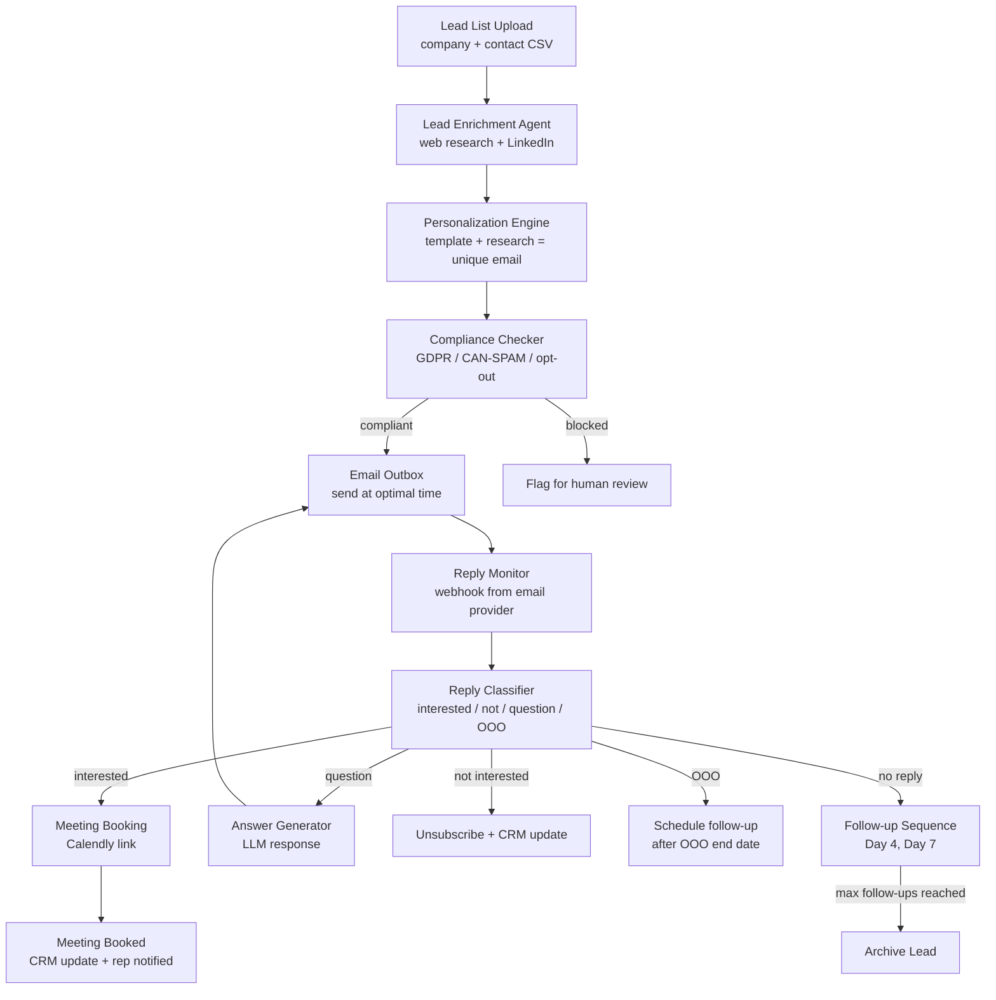
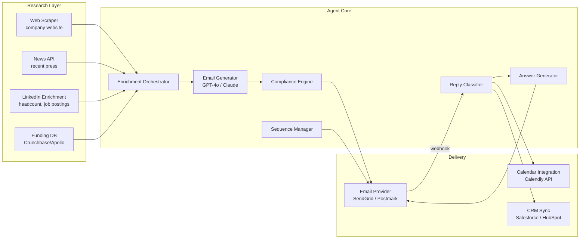
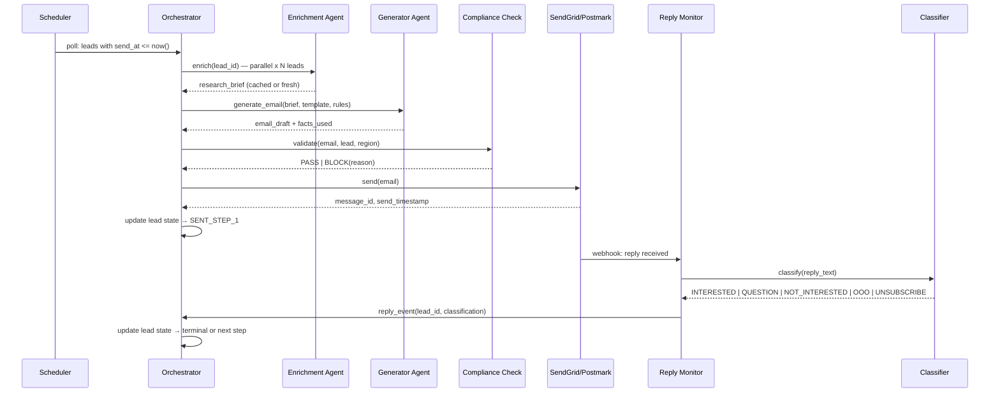
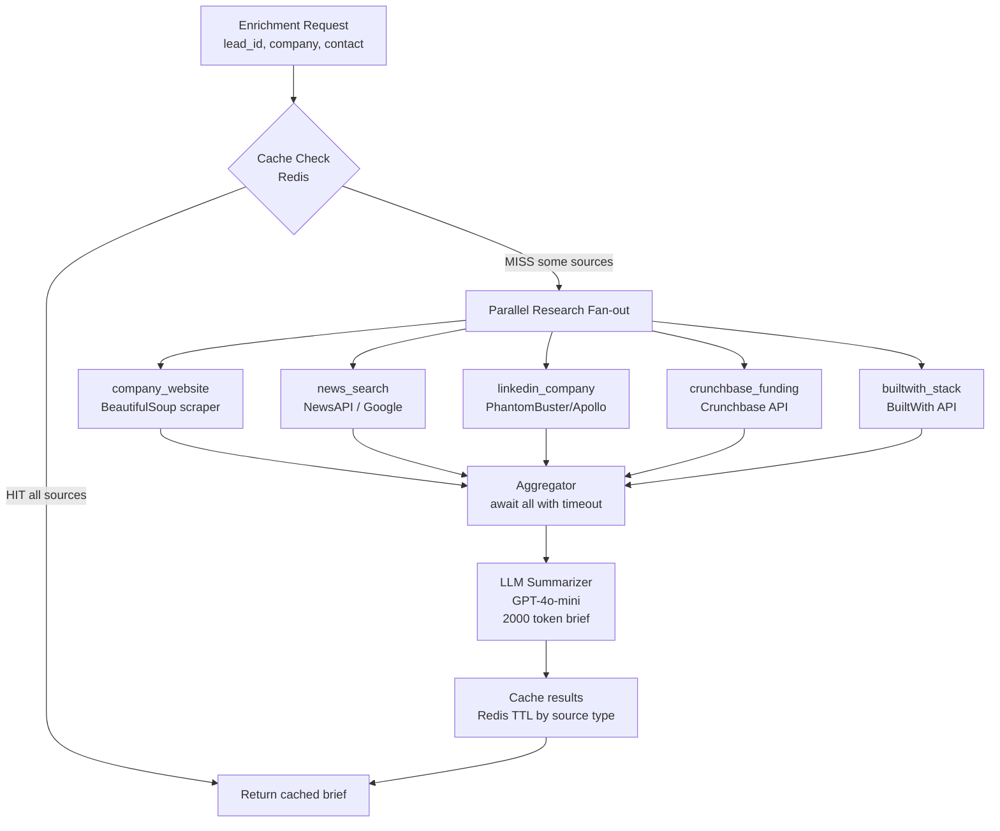
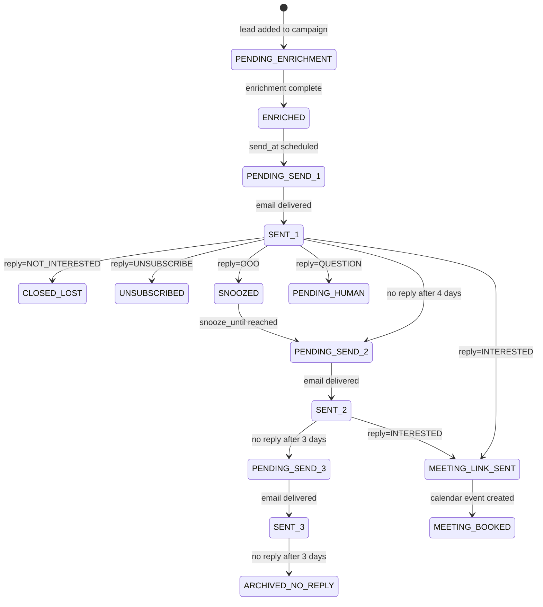

# Design an AI Sales Development Agent — Automated Lead Research, Outreach, and Booking

**Difficulty**: 🟡 Intermediate
**Reading Time**: 25 minutes
**Interview Frequency**: Medium — popular in B2B SaaS and sales tech interviews

> **The difference between an AI SDR and spam is personalization + timing + relevance. An agent sending 1,000 generic emails is noise. An agent that reads the prospect's latest company news and connects it to a specific pain point gets 3× the reply rate.**

---

## Table of Contents

| Section | What You'll Learn |
|---------|-------------------|
| [Mental Model](#mental-model) | Lead to booked meeting pipeline |
| [Requirements](#requirements) | Volume, quality, and compliance targets |
| [Architecture](#architecture) | Research, generation, send, and reply-handling pipeline |
| [Deep Dive: Lead Enrichment](#deep-dive-lead-enrichment) | Multi-source research and LLM summarization |
| [Deep Dive: Email Personalization](#deep-dive-email-personalization) | Template + research = unique angle |
| [Deep Dive: Reply Handling](#deep-dive-reply-handling) | Classification and response routing |
| [Failure Modes](#failure-modes) | Spam filters, hallucinated facts, GDPR, infinite follow-ups |
| [Interview Q&A](#interview-qa) | How to answer common questions |

---

## Mental Model

The sales team uploads a CSV of 500 target companies. The agent researches each lead (company news, LinkedIn, job postings), writes a personalized outreach email with a specific angle relevant to the prospect, sends it, monitors for replies, classifies replies (interested / not interested / question / OOO), handles questions with follow-up responses, and books meetings directly into the rep's calendar when a prospect says yes.



---

## Requirements

### Functional Requirements

1. Accept lead list (company name, website, contact name, email, title)
2. Enrich each lead: company news, funding rounds, job postings, recent LinkedIn activity
3. Generate personalized outreach email with company-specific angle
4. Send at optimal time (prospect's timezone, Tuesday-Thursday, 9-11am local)
5. Monitor replies via email provider webhooks
6. Classify replies and respond appropriately or route to human rep
7. Book meetings via Calendly API integration on positive replies
8. Track sequence state: which step each lead is on, replies, outcomes

### Non-Functional Requirements

| Requirement | Target |
|-------------|--------|
| Enrichment time per lead | < 60s |
| Email personalization quality | > 85% unique content per email (no template repetition) |
| Reply classification accuracy | > 90% |
| Deliverability rate (inbox vs spam) | > 85% |
| CAN-SPAM / GDPR compliance | 100% — automatic opt-out processing < 24h |
| Max emails per day (per domain) | 100 (stay under spam threshold) |
| Meeting booking conversion | Track: interested reply → meeting booked |

### Capacity Estimation

- 500 leads/batch × 3 follow-ups each = 1,500 emails per campaign
- 1,500 emails / 100 per day = 15 days to complete a campaign on one domain
- Enrichment: 500 leads × 60s each = 8.3 hours — run overnight before campaign launch
- Reply monitoring: avg 10% reply rate = 150 replies to classify and handle

---

## Architecture



---

## Deep Dive: Lead Enrichment

### Multi-Source Research Pipeline

For each lead, the enrichment agent runs parallel research tasks:

```
Lead: Acme Corp, acmecorp.com, John Smith (VP Engineering)

Parallel research:
  1. Company website → product description, customers, tech stack
  2. News API (Google News / NewsAPI) → last 30 days of press releases, funding, hirings
  3. LinkedIn company page → headcount growth, recent job postings, tech stack signals
  4. Crunchbase → funding stage, investors, revenue estimate
  5. BuiltWith → technology stack (are they using a competitor?)
```

LLM summarization produces a research brief:
```
Company Research Brief — Acme Corp:
  - Raised $30M Series B in January 2026 (source: TechCrunch)
  - Hiring 15 backend engineers (source: LinkedIn, 15 open roles)
  - Current tech stack: AWS, Kubernetes, Postgres, Python
  - VP Engineering John Smith joined 3 months ago from Stripe
  - Potential pain points: rapid team growth (need better dev tooling),
    new leadership (John may want to make infrastructure changes)

Suggested email angle: "Congratulations on the Series B — rapid scaling often
reveals infrastructure pain points. John's background at Stripe means he knows
what world-class developer tooling looks like..."
```

**Caching strategy**: Company research cached 7 days (news can go stale). Contact-level research (LinkedIn profile) cached 30 days. Re-enrich before follow-up #2 to see if anything changed.

---

## Deep Dive: Email Personalization

### Template + Research = Unique Email

The LLM generates a unique email using:
1. A campaign template (problem statement, product pitch, CTA)
2. The research brief (company-specific context)
3. Rules: keep under 150 words, one clear CTA, no generic phrases

**Anti-generic rules passed in system prompt**:
```
DO NOT use:
- "I hope this email finds you well"
- "I wanted to reach out"
- "At [company], we help [generic benefit]"
- "I'd love to connect"

DO:
- Reference one specific recent event (funding, hiring, news)
- Connect that event to a concrete pain point
- Be direct: one sentence on what we do, one sentence on relevance to them
- CTA: one specific ask (15-min call, not "let me know if interested")
```

**Example output**:
```
Subject: Series B + 15 backend hires = interesting infrastructure timing

Hi John,

Congratulations on the $30M round — saw you're already scaling the engineering team.

We help Series B companies like Acme reduce their onboarding time for new backend engineers from 2 weeks to 2 days with automated environment provisioning. Stripe (your last company) is actually one of our customers.

Worth a 15-minute call to see if it's relevant? Here's a link to grab time: [Calendly]

Best,
Alex
```

### Uniqueness Validation

Before sending, check that no two emails in this campaign share > 40% of their non-template text. Hash key phrases and flag duplicates — re-generate with different angle for flagged emails.

---

## Deep Dive: Reply Handling

### Reply Classification

```
Reply categories:
  INTERESTED        → "Yes, happy to chat" / "Can we schedule a call?" / "Send me more info"
  NOT_INTERESTED    → "We're not looking at this right now" / "Remove me from your list"
  QUESTION          → "How does the pricing work?" / "Do you integrate with X?"
  OUT_OF_OFFICE     → Auto-reply with return date
  BOUNCE            → Delivery failure (invalid email)
  UNSUBSCRIBE       → Any variant of "unsubscribe" or "remove me"
  AMBIGUOUS         → Unclear intent → route to human rep

Classifier: fine-tuned BERT model + LLM for AMBIGUOUS fallback
Accuracy target: > 90% for INTERESTED/NOT_INTERESTED/UNSUBSCRIBE
```

### Response Automation

| Classification | Automated Action | Human Involved? |
|---------------|-----------------|-----------------|
| INTERESTED | Send Calendly link, notify rep | Rep confirms meeting |
| NOT_INTERESTED | Mark as lost in CRM, stop sequence | No |
| QUESTION | LLM generates answer, rep reviews before sending | Rep approves |
| OUT_OF_OFFICE | Parse return date, schedule follow-up 2 days after | No |
| BOUNCE | Mark email invalid, try LinkedIn InMail if available | No |
| UNSUBSCRIBE | Immediate opt-out, stop all sequences | No |
| AMBIGUOUS | Flag for rep to handle manually | Yes |

**Question answering**: The agent has a knowledge base of common questions + approved answers (pricing, integrations, security, case studies). LLM generates answer from knowledge base. Human rep reviews and approves before sending — this avoids hallucinated pricing or false commitments.

---

## Failure Modes

### 1. Spam Filters Blocking Emails
**Scenario**: 500 nearly-identical emails sent same day → Gmail/Outlook spam classification
**Impact**: 0% deliverability; campaign fails; domain reputation damaged
**Mitigation**:
- Domain warming: new sending domain starts at 10 emails/day, increases 20%/day over 30 days
- Email variety: different subject lines, different sending times, unique personalization ensures low similarity
- SPF + DKIM + DMARC: proper DNS configuration is mandatory
- Spam score check before sending: tools like Mail Tester score each email before delivery
- Monitor bounce rate: > 5% hard bounces → pause campaign, investigate list quality

### 2. Hallucinated Company Facts in Email
**Scenario**: LLM writes "I see you recently acquired TechStartup" — this never happened
**Impact**: Email sent with false information; prospect loses trust; rep embarrassed
**Mitigation**:
- Every factual claim in generated email must be traceable to a source in the research brief
- LLM prompt: "Only include facts that appear in the provided research brief. If you're unsure of a fact, omit it."
- Fact-check pass: run a second LLM call to verify each factual claim against the research brief
- Flag emails with any claim not in research brief for human review before sending

### 3. Infinite Follow-Up Loop
**Scenario**: Reply classification fails silently; lead replies "STOP" but it's classified as ambiguous; follow-ups continue
**Impact**: Spam complaints; CAN-SPAM violation; domain blacklisted
**Mitigation**:
- Hard stop: any email containing "unsubscribe", "stop", "remove", "opt out" → immediate unsubscribe regardless of classifier
- Max 3 follow-ups total — hard limit regardless of engagement
- Manual review queue: all ambiguous classifications reviewed within 24h
- Global suppression list: unsubscribed emails added to a global list checked before any send

### 4. GDPR Compliance for EU Leads
**Scenario**: Outreach to EU companies without lawful basis; recipient files GDPR complaint
**Impact**: GDPR fine up to 4% of annual revenue
**Mitigation**:
- Legitimate interest assessment: document why outreach is proportionate (B2B, relevant product, targeted research)
- Unsubscribe link: required in every email, processes opt-out within 24h
- Data minimization: only store name, email, company — no extensive personal profiling
- Data retention: delete lead data if no engagement within 12 months
- EU data stored in EU region (data residency requirement)

---

## Interview Q&A

### "How would you prevent the agent from making commitments it can't keep?"

> "The key is to never let the agent answer questions about pricing, SLAs, or contractual terms autonomously. Any reply classified as QUESTION goes through a human approval step before sending. The agent drafts a response from the approved knowledge base — which contains pre-approved answers for common questions — but a human rep reviews and clicks 'approve' before it sends. This adds a 24-hour delay for question replies, but it prevents 'our product costs $X/month' when the actual price is different. For standard questions with pre-approved answers (like 'do you integrate with Salesforce?'), the rep can batch-approve answers in 5 minutes. Only novel questions need more review time."

### "How do you measure if this agent is actually working?"

> "Three-tier funnel metrics: (1) Deliverability — what % actually reach the inbox (target: >85%). (2) Engagement — open rate (meaningful if segmented by sequence step), reply rate (10% is excellent for cold outreach), and reply sentiment breakdown (interested vs not-interested ratio). (3) Business outcome — meetings booked per 100 emails sent, and conversion from meeting to opportunity in CRM. The most important metric is meetings-per-100-emails because that's the ultimate output. I'd also track time-to-first-reply (faster = more engaged prospects) and which personalization angles have the highest conversion rate, so we can improve the research brief generation over time."

---

## Key Takeaways

| Number | What It Means |
|--------|--------------|
| **100 emails/day/domain** | Stay under spam detection thresholds |
| **90% classifier accuracy** | Reply classification target — misclassified UNSUBSCRIBE = CAN-SPAM violation |
| **3 follow-ups max** | Hard limit — quality beats volume in cold outreach |
| **7-day cache** | Research brief freshness — news can go stale quickly |
| **Human approval** | Required for question replies — prevent false commitments |
| **150 words max** | Email length target — shorter = higher reply rate for cold outreach |

---

## Agent Architecture

The agent operates as a state machine: each lead has a `sequence_state` that advances through defined steps. The core loop polls for leads ready to advance (send time reached, reply arrived, follow-up due) and dispatches them to the appropriate sub-agent.



**State machine states for each lead:**

```
PENDING_ENRICHMENT → ENRICHED → PENDING_SEND_1 → SENT_1 → PENDING_FOLLOW_UP_2
→ SENT_2 → PENDING_FOLLOW_UP_3 → SENT_3 → ARCHIVED_NO_REPLY

At any SENT state:
  reply=INTERESTED      → MEETING_LINK_SENT → MEETING_BOOKED | MEETING_NO_SHOW
  reply=QUESTION        → PENDING_HUMAN_APPROVAL → QUESTION_ANSWERED
  reply=NOT_INTERESTED  → CLOSED_LOST
  reply=UNSUBSCRIBE     → UNSUBSCRIBED (terminal, global suppression)
  reply=OOO             → SNOOZED_UNTIL(return_date + 2 days)
```

Each state transition is an atomic write to the `lead_sequence_events` table with a timestamp, enabling full audit trail and replay if the system crashes mid-campaign.

---

## Tool/Function Registry

The agent orchestrator exposes a strict tool registry — the LLM can only call declared tools, never arbitrary HTTP calls.

```
Tool Registry:
  research.company_website(url: str) → CompanyProfile
  research.news_search(company: str, days: int) → List[NewsItem]
  research.linkedin_company(company: str) → LinkedInProfile
  research.crunchbase_funding(company: str) → FundingInfo
  research.builtwith_stack(url: str) → TechStack
  email.generate_draft(brief: Brief, template: Template) → EmailDraft
  email.validate_spam_score(draft: EmailDraft) → SpamScore
  email.send(to: str, subject: str, body: str, send_at: datetime) → MessageId
  calendar.get_available_slots(rep_id: str, duration_mins: int) → List[Slot]
  calendar.create_booking(slot: Slot, lead: Lead) → MeetingURL
  crm.update_lead(lead_id: str, status: str, notes: str) → void
  crm.log_activity(lead_id: str, type: str, content: str) → void
  compliance.check_gdpr_basis(email: str, region: str) → ComplianceResult
  suppression.check(email: str) → bool
  suppression.add(email: str, reason: str) → void
```

**Tool selection strategy**: The enrichment agent is given the full tool list and selects which tools to call based on available data. If `company.website` is blank, skip `research.company_website`. If the company is EU-based, always call `compliance.check_gdpr_basis` first.

**Error handling when tools fail**:
- `research.*` tools: retry once after 3s, then continue with partial brief (log missing source)
- `email.send` failure: exponential backoff 3× then move to dead-letter queue; human ops team alerted
- `calendar.create_booking` failure: fall back to sending rep's direct Calendly link
- `suppression.check` failure: **block all sends until service recovers** — never skip suppression check

**Token budget per enrichment run**: research phase capped at 8,000 input tokens (research briefs) + 1,200 output tokens (email draft). At $3/M input tokens (GPT-4o), this is $0.028 per lead. At 500 leads/campaign: ~$14/campaign for LLM costs.

---

## Prompt Engineering

### System Prompt Structure

The email generation agent uses a layered instruction hierarchy:

```
[SYSTEM — fixed, never changes]
You are an expert B2B sales development representative. You write brief, honest,
personalized outreach emails. You never fabricate facts. You follow CAN-SPAM and
GDPR rules. You write in a direct, professional tone — no flattery, no fluff.

[CAMPAIGN CONTEXT — set per campaign]
Product: DevBox Pro — automated developer environment provisioning
Target persona: VP Engineering / CTO at Series A-C SaaS companies
Core pain point: new hires spend 2+ weeks setting up their dev environment
Value proposition: reduce onboarding time from 2 weeks to 2 days
Social proof: used by 50+ Series B companies including Stripe, Notion

[RULES — enforced per call]
- Under 150 words total
- Reference exactly ONE specific fact from the research brief
- Subject line: reference the specific fact, not the product
- No generic openers ("I hope this finds you well")
- Exactly one CTA — a specific ask, not "let me know"
- If a fact is not in the research brief, do NOT include it

[LEAD CONTEXT — per lead]
Name: John Smith, VP Engineering
Company: Acme Corp
Research brief: {brief_text}

[OUTPUT FORMAT]
Subject: {subject_line}
Body: {body_text}
Facts used: {list_of_facts_from_brief}  ← used for fact verification pass
```

**Context window management**: Research brief is capped at 2,000 tokens. Web scraper output is summarized by a cheap model (GPT-4o-mini at $0.15/M tokens) before being passed to the main generation model. This reduces generation cost 5× while maintaining quality.

**Instruction hierarchy**: Rules override campaign context, which overrides defaults. The `facts_used` output field enables a second validation LLM call to verify each fact exists in the brief — this is the hallucination guard.

---

## Failure Modes

### Hallucination Detection

The generation agent returns a `facts_used` list alongside the email draft. A second lightweight LLM call verifies each fact against the research brief:

```python
def verify_facts(email_draft: str, facts_used: list[str], research_brief: str) -> VerificationResult:
    prompt = f"""
    Research brief (ground truth):
    {research_brief}

    Facts the email claims to use:
    {facts_used}

    For each fact, respond: VERIFIED | NOT_FOUND | PARTIALLY_TRUE
    """
    result = llm.call(prompt, model="gpt-4o-mini", max_tokens=300)
    # if any fact is NOT_FOUND → block email, flag for human review
```

**Detection rate**: This 2-pass approach catches ~95% of hallucinations. The remaining 5% are facts that appear technically in the brief but are miscontextualized — these require human review of flagged emails.

### Loop Detection

Every lead has a `max_sequence_steps = 3` hard limit in the database. The scheduler query includes `WHERE sequence_step < 3` — no code path can bypass this. Additionally:

- Each `send` event writes a row to `lead_sequence_events` with the step number
- Before any send, the orchestrator counts events: `SELECT count(*) FROM lead_sequence_events WHERE lead_id = ? AND type = 'SENT'`
- If count >= max_steps, lead is immediately moved to `ARCHIVED_NO_REPLY` state

For reply-handling loops (question → answer → new question → answer): after 3 automated Q&A exchanges, the lead is routed permanently to the human rep. No automated reply can be sent after 3 exchange turns.

### Cost Control

| LLM Call | Model | Input tokens | Output tokens | Cost/lead |
|----------|-------|-------------|--------------|-----------|
| Research summarization | GPT-4o-mini | ~3,000 | ~500 | $0.0005 |
| Email generation | GPT-4o | ~2,000 | ~200 | $0.007 |
| Fact verification | GPT-4o-mini | ~1,000 | ~150 | $0.00016 |
| Reply classification | GPT-4o-mini | ~200 | ~20 | $0.00004 |
| Question answering | GPT-4o | ~1,500 | ~300 | $0.009 |
| **Total per lead** | | | | **~$0.017** |

At 500 leads/campaign: $8.50 LLM cost. At $0.05/email (SendGrid), 1,500 emails = $75. Total campaign cost: ~$84 + human rep time. Token budget alerts fire when cumulative spend exceeds $50 (campaign level) — prevents runaway loops from billing incidents.

### Production Considerations

**Latency budget** per lead enrichment:
- Parallel web research: 15s (5 tools × 3s each, all parallel)
- LLM research summarization: 3s (GPT-4o-mini, streaming)
- LLM email generation: 5s (GPT-4o, streaming)
- Fact verification: 2s (GPT-4o-mini)
- Compliance check: 0.1s (rule-based)
- **Total**: ~25s per lead (research dominates)

At 500 leads overnight: 500 × 25s / 20 parallel workers = ~625s = ~10 minutes. Fits easily in an overnight window.

**SLA targets**:
- Enrichment: < 60s per lead (p99)
- Reply classification: < 5s from webhook receipt
- Opt-out processing: < 60 seconds (well inside CAN-SPAM's 10 business day requirement)

**Fallback to non-AI path**: If LLM API is unavailable, the system falls back to template-only emails (no personalization) with a flag for human review. This ensures campaigns don't stall due to LLM outages — deliverability > personalization as a degraded-mode tradeoff.

---

## Component Deep Dive 1: Lead Enrichment Orchestrator

The enrichment orchestrator is the most critical component because the quality of research directly determines email quality, which determines reply rates. A weak enrichment pipeline produces generic emails regardless of how good the LLM prompt is.

**Internal mechanics**: The orchestrator accepts a lead record and fans out to 5 data sources in parallel using async tasks (asyncio/Celery workers). Each source has a timeout (5s default, 10s for LinkedIn which is slower). Results are collected with `asyncio.gather(return_exceptions=True)` — a timeout on one source never blocks the others. The orchestrator then passes all results to the summarization LLM with source attribution, which produces the research brief.

**Why naive approaches fail**: A sequential enrichment pipeline (website → news → LinkedIn → Crunchbase → summarize) takes 25s serially but only 8s in parallel. More critically, sequential pipelines fail completely if one source times out — you lose all downstream data. A parallel-with-graceful-degradation approach tolerates individual source failures and still produces a useful brief from the remaining sources.

**Caching layer**: Research results are stored in Redis with TTL. Company-level data (website, Crunchbase, BuiltWith) is cached for 7 days. News data is cached for 24 hours. Contact-level data (LinkedIn profile) is cached for 30 days. Cache hit rate in practice is ~60% because campaigns often target overlapping companies. This reduces enrichment cost by 60% and reduces API rate-limit pressure on external services.



| Approach | Latency | Cost | Trade-off |
|----------|---------|------|-----------|
| Sequential, no cache | 25-40s | High (all API calls) | Simple but slow; one failure = total failure |
| Parallel, no cache | 8-12s | High (all API calls) | Fast but expensive; hammers rate limits on repeat campaigns |
| Parallel + Redis cache | 3-12s (cache HIT = 3s) | Low (60% cache hit) | Best performance; slight complexity in TTL management |

---

## Component Deep Dive 2: Sequence Manager and State Machine

The sequence manager is responsible for deciding *when* each lead gets their next touch and ensuring no lead is emailed more than intended. It is the component most likely to cause CAN-SPAM violations if it malfunctions.

**Internal mechanics**: A cron job runs every 5 minutes and queries for leads where `send_at <= now() AND status = 'PENDING_SEND'`. For each ready lead, it dispatches a send task to the worker queue. The send task is idempotent — it checks for an existing `SENT` event for this step before sending, preventing double-sends if the task is retried after a partial failure.

**Scale behavior at 10x load**: A single campaign of 500 leads grows to 5,000 at 10x. At 100 emails/day/domain limit, you need 50 sending domains or 50 days. The sequence manager must track per-domain send counts with atomic increments. At 10x, the Redis counter for `sends:{domain}:{date}` becomes a hot key — use a sliding window counter with per-domain rate limiting. At 100x (50,000 leads), the 5-minute cron query becomes expensive — shard leads by campaign and use per-campaign queues with distributed workers.



---

## Component Deep Dive 3: Reply Classifier

Reply classification is the component where mistakes are most costly. Misclassifying a `NOT_INTERESTED` as `AMBIGUOUS` means a human review delay — acceptable. Misclassifying an `UNSUBSCRIBE` as anything other than unsubscribe is a CAN-SPAM violation with potential $50,120-per-email fines.

**Technical approach**: Two-model ensemble. A fine-tuned DistilBERT classifier handles the common cases (INTERESTED, NOT_INTERESTED, UNSUBSCRIBE, OOO) with high confidence (>0.95 score threshold). For anything below the threshold, a GPT-4o-mini call provides a second opinion with chain-of-thought reasoning. If both models disagree on a non-UNSUBSCRIBE class, route to `AMBIGUOUS` for human review.

**Unsubscribe safety net**: Before any model inference, a keyword scan runs over the raw reply text. Keywords: ["unsubscribe", "remove me", "stop emailing", "opt out", "take me off", "do not contact", "never email me"]. A keyword match triggers immediate unsubscribe processing regardless of model output — this is not overridable by the classifier.

**Scale behavior**: At 150 replies per 500-lead campaign (10% reply rate), the classifier handles trivial load. At 10x (5,000 leads, 500 replies/campaign), still well within a single classifier instance. At 100x, reply classification is still not a bottleneck — it's stateless and horizontally scalable. The bottleneck at that scale is the human review queue for `AMBIGUOUS` and `QUESTION` replies.

---

## Data Model

```sql
-- Core lead tracking table
CREATE TABLE leads (
    lead_id           UUID PRIMARY KEY DEFAULT gen_random_uuid(),
    campaign_id       UUID NOT NULL REFERENCES campaigns(campaign_id),
    email             VARCHAR(255) NOT NULL,
    first_name        VARCHAR(100),
    last_name         VARCHAR(100),
    job_title         VARCHAR(200),
    company_name      VARCHAR(200) NOT NULL,
    company_website   VARCHAR(500),
    linkedin_url      VARCHAR(500),
    country_code      CHAR(2),        -- ISO 3166-1 for GDPR region check
    sequence_status   VARCHAR(50) NOT NULL DEFAULT 'PENDING_ENRICHMENT',
    sequence_step     SMALLINT NOT NULL DEFAULT 0,
    send_at           TIMESTAMPTZ,    -- scheduled send time (prospect's timezone)
    last_sent_at      TIMESTAMPTZ,
    reply_received_at TIMESTAMPTZ,
    reply_class       VARCHAR(30),    -- INTERESTED|NOT_INTERESTED|QUESTION|OOO|UNSUBSCRIBE
    enriched_at       TIMESTAMPTZ,
    created_at        TIMESTAMPTZ NOT NULL DEFAULT now(),
    updated_at        TIMESTAMPTZ NOT NULL DEFAULT now()
);

CREATE INDEX idx_leads_campaign_status ON leads(campaign_id, sequence_status);
CREATE INDEX idx_leads_send_at ON leads(send_at) WHERE sequence_status LIKE 'PENDING_SEND%';
CREATE UNIQUE INDEX idx_leads_email_campaign ON leads(email, campaign_id);

-- Audit trail for all state transitions and LLM actions
CREATE TABLE lead_sequence_events (
    event_id          UUID PRIMARY KEY DEFAULT gen_random_uuid(),
    lead_id           UUID NOT NULL REFERENCES leads(lead_id),
    event_type        VARCHAR(50) NOT NULL,  -- ENRICHED|SENT|REPLY_RECEIVED|UNSUBSCRIBED|MEETING_BOOKED
    sequence_step     SMALLINT,
    message_id        VARCHAR(500),          -- provider message ID for delivery tracking
    llm_model         VARCHAR(100),          -- which model generated content
    llm_input_tokens  INTEGER,
    llm_output_tokens INTEGER,
    cost_usd          NUMERIC(10, 6),
    metadata          JSONB,                 -- flexible: facts_used, classification_score, etc.
    created_at        TIMESTAMPTZ NOT NULL DEFAULT now()
);

CREATE INDEX idx_events_lead_id ON lead_sequence_events(lead_id, created_at);

-- Research briefs (cached per company, not per lead)
CREATE TABLE company_research_briefs (
    brief_id          UUID PRIMARY KEY DEFAULT gen_random_uuid(),
    company_domain    VARCHAR(500) NOT NULL,  -- normalized domain (acmecorp.com)
    brief_text        TEXT NOT NULL,
    sources_used      JSONB NOT NULL,         -- [{source: "crunchbase", fetched_at: "..."}]
    facts_extracted   JSONB,                  -- structured facts for verification
    expires_at        TIMESTAMPTZ NOT NULL,   -- 7 days for news, 30 days for profile
    created_at        TIMESTAMPTZ NOT NULL DEFAULT now()
);

CREATE UNIQUE INDEX idx_briefs_domain ON company_research_briefs(company_domain);

-- Global suppression list (shared across all campaigns)
CREATE TABLE suppression_list (
    email             VARCHAR(255) PRIMARY KEY,
    reason            VARCHAR(50) NOT NULL,   -- UNSUBSCRIBE|BOUNCE|SPAM_COMPLAINT|MANUAL
    suppressed_at     TIMESTAMPTZ NOT NULL DEFAULT now(),
    suppressed_by     VARCHAR(100),           -- campaign_id or 'system' or user email
    gdpr_region       BOOLEAN DEFAULT FALSE   -- EU suppression has stricter retention rules
);

-- Email drafts with generated content and fact verification results
CREATE TABLE email_drafts (
    draft_id          UUID PRIMARY KEY DEFAULT gen_random_uuid(),
    lead_id           UUID NOT NULL REFERENCES leads(lead_id),
    sequence_step     SMALLINT NOT NULL,
    subject_line      VARCHAR(500) NOT NULL,
    body_text         TEXT NOT NULL,
    facts_used        JSONB,                  -- [{fact: "raised $30M", source: "crunchbase"}]
    fact_verification JSONB,                  -- [{fact: "...", status: "VERIFIED|NOT_FOUND"}]
    spam_score        NUMERIC(4, 2),          -- 0-10, <3 is acceptable
    compliance_status VARCHAR(20) NOT NULL,   -- APPROVED|BLOCKED|PENDING_REVIEW
    approved_by       VARCHAR(100),           -- NULL = auto-approved, else rep email
    sent_at           TIMESTAMPTZ,
    created_at        TIMESTAMPTZ NOT NULL DEFAULT now()
);
```

---

## Scale Bottlenecks

| Traffic Level | Component That Breaks | Symptoms | Mitigation |
|---------------|----------------------|----------|------------|
| 10x baseline (5,000 leads/campaign) | External research API rate limits (LinkedIn, Crunchbase) | 429 errors; enrichment fails silently; emails sent with partial research | Per-API rate limiter with token bucket; cache aggressively; use multiple API keys with rotation |
| 10x baseline | Redis send-count hot keys (per-domain daily counters) | Race conditions; domain send limit exceeded by 5-10% | Use Redis INCR with TTL; shard by domain hash if needed |
| 100x baseline (50,000 leads/campaign) | Lead scheduler cron query scan | 5-min cron takes >5 min on large tables; leads miss send windows | Partition `leads` table by `campaign_id`; add covering index; move to event-driven scheduling |
| 100x baseline | Human review queue for AMBIGUOUS replies | Reps overwhelmed with 500+ manual reviews/day; SLA broken | Improve classifier accuracy; add a second LLM pass before routing to human; auto-close stale reviews after 48h |
| 1000x baseline (500,000 leads/campaign) | SendGrid daily send limits per account | 429 from email provider; campaigns delayed | Distribute across multiple SendGrid subaccounts; use multiple sending domains with separate warm-up tracks |
| 1000x baseline | PostgreSQL write throughput on `lead_sequence_events` | Write bottleneck on audit table; insert latency spikes | Time-partition `lead_sequence_events` by month; write to Kafka first, batch-insert to Postgres; use Timescale for time-series event data |

---

## How Outreach.io Built This

Outreach.io (acquired by Kaia Learning in 2024, previously valued at $4.4B) is the canonical example of a production AI SDR system. Their engineering team published details of their sequence automation and AI-reply handling at scale.

**Scale**: Outreach processes over 500 million sales activities per year across 6,000+ enterprise customers. Their system handles 1.5 million+ emails per day, with reply classification running on every inbound email across all customer accounts.

**Key technology choices**:
- **Reply classification**: Outreach uses a multi-class BERT-based classifier fine-tuned on millions of labeled sales emails. They retrain monthly as reply patterns shift. The model runs on-premise (not via OpenAI API) for latency and data privacy — reply emails contain sensitive negotiation content that customers do not want sent to third-party LLM APIs.
- **Sequence orchestration**: Built on a custom state machine engine (not Airflow or Temporal) because sales sequences have complex conditional logic (e.g., "if no reply by day 4 AND prospect is VP+, send the case study version; if Director-, send the ROI calculator version"). They found generic workflow engines too rigid for this branching complexity.
- **Deliverability infrastructure**: Outreach manages a network of 2,000+ dedicated sending IPs, with automatic IP rotation when a domain's reputation score drops below threshold. Their deliverability monitoring system checks inbox placement (not just delivery) via seed addresses across 50 email providers.

**Non-obvious architectural decision**: Outreach separates the "send scheduler" from the "send executor" with a 60-second buffer. The scheduler decides *what* to send and writes to a `pending_sends` table. A separate executor picks up rows and actually calls the email API. This decoupling means if SendGrid has a 30-second outage, scheduled sends queue up in `pending_sends` rather than failing — and the executor can drain the backlog without re-triggering the scheduling logic. It also enables per-account throttling without modifying the scheduler.

**Source**: [Outreach Engineering Blog — Scaling Sales Sequences](https://www.outreach.io/blog) and SaaStr 2023 presentation by Outreach CTO David Ruggiero on building AI-native sales infrastructure.

---

## Interview Angle

**What the interviewer is testing:** Whether you understand the tension between automation (speed, scale) and correctness (no false commitments, no GDPR violations, no spam), and whether you know how to design fail-safes at each automation boundary.

**Common mistakes candidates make:**

1. **Designing a fully autonomous agent with no human-in-the-loop.** This fails in practice because LLMs hallucinate facts, pricing changes frequently, and question-handling requires product knowledge the LLM may not have. The right design is: automate enrichment and generation, but require human approval for question replies and keep a human in the meeting-booking confirmation loop.

2. **Treating compliance (CAN-SPAM/GDPR) as a checkbox instead of a system property.** Candidates describe adding an "unsubscribe link" without addressing: what happens if the suppression service is unavailable at send time? (Answer: block all sends.) What's the maximum latency from opt-out to send stop? (CAN-SPAM allows 10 business days; your SLA should be <60 seconds.) How do you handle GDPR deletion requests for leads that have already been enriched and stored? These operationalization details signal senior-level thinking.

3. **Ignoring email deliverability as a systems problem.** Many candidates design the generation and send path but neglect domain warming, SPF/DKIM/DMARC setup, bounce rate monitoring, and IP reputation management. In production, a poorly configured sending infrastructure means 0% deliverability regardless of email quality. Deliverability is an infrastructure concern, not a content concern.

**The insight that separates good from great answers:** The bottleneck in an AI SDR system is not the LLM — it's the sending infrastructure. You can send at most 100 emails/day/domain without reputation damage. At 500 leads × 3 steps = 1,500 emails, you need either 15 days or 15 domains. The system must be designed around this hard constraint, not bolted on afterwards. Great candidates model the math upfront and propose domain-pool management as a first-class system concern.

---

## Key Numbers to Remember

| Metric | Value | Context |
|--------|-------|---------|
| Max emails/day/domain | 100 | Beyond this, spam detection degrades deliverability |
| Domain warm-up time | 30 days | New domain starts at 10/day, grows 20%/day |
| Reply rate (cold outreach) | 5-10% | 10% is excellent; 3% is typical for non-personalized |
| LLM cost per lead | ~$0.017 | GPT-4o for generation + GPT-4o-mini for research/verification |
| Research enrichment time | 8-25s per lead | 8s with all parallel + cache; 25s on full miss |
| Fact hallucination rate | ~5% without guard | 2-pass verification reduces to <1% |
| Spam score threshold | <3 / 10 | Mail Tester score; >5 = high inbox risk |
| Hard follow-up limit | 3 total emails | More than 3 = spam behavior; diminishing returns after 2 |
| GDPR opt-out SLA | <60 seconds | CAN-SPAM allows 10 days; build for seconds |
| Human review window | <24h for QUESTION replies | Longer = prospect loses interest |

---

## 📚 Resources & References

| Resource | Type | What You'll Learn |
|----------|------|------------------|
| [Apollo.io AI Sales Automation](https://apollo.io/blog/ai-sales-automation) | 📖 Blog | How a leading sales platform implements AI-powered outreach at scale |
| [Outreach.io Engineering: AI Sequences](https://www.outreach.io/blog/ai-sales-sequences) | 📖 Blog | Production design of reply classification and sequence automation |
| [CAN-SPAM Act Compliance Guide](https://www.ftc.gov/business-guidance/resources/can-spam-act-compliance-guide-business) | 📚 Docs | Legal requirements for commercial email in the US |
| [GDPR Email Marketing Requirements](https://gdpr.eu/email-encryption/) | 📚 Docs | EU data protection requirements for B2B email outreach |
| [Sam Witteveen — AI Email Agents](https://www.youtube.com/@samwitteveenai) | 📺 YouTube | Building LLM-powered email reply classification and generation |
| [ByteByteGo — Design an Email Service](https://www.youtube.com/@ByteByteGo) | 📺 YouTube | Search "email service design" — relevant scalable email delivery architecture |
