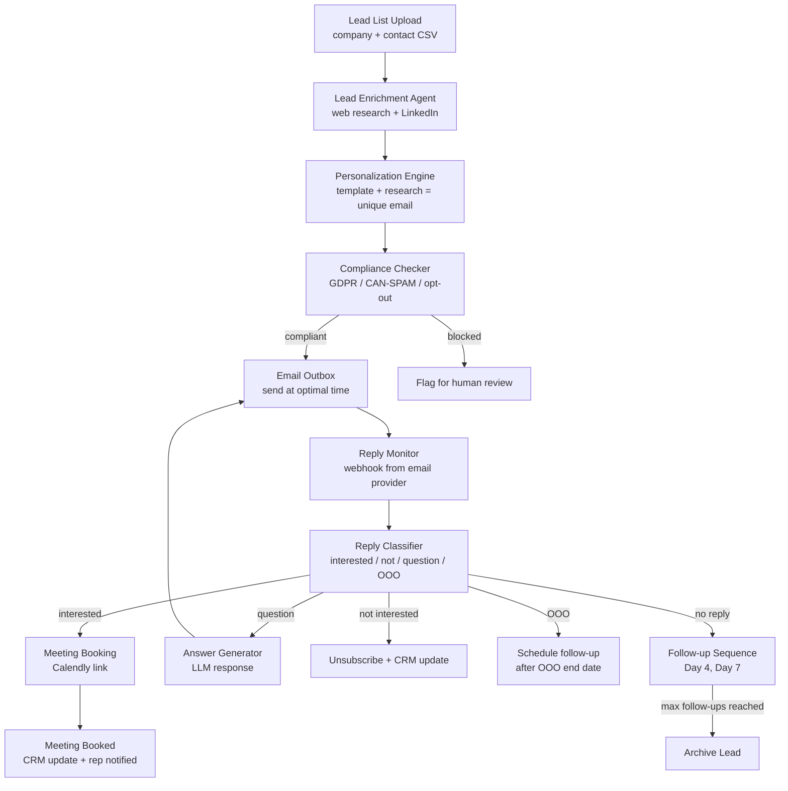
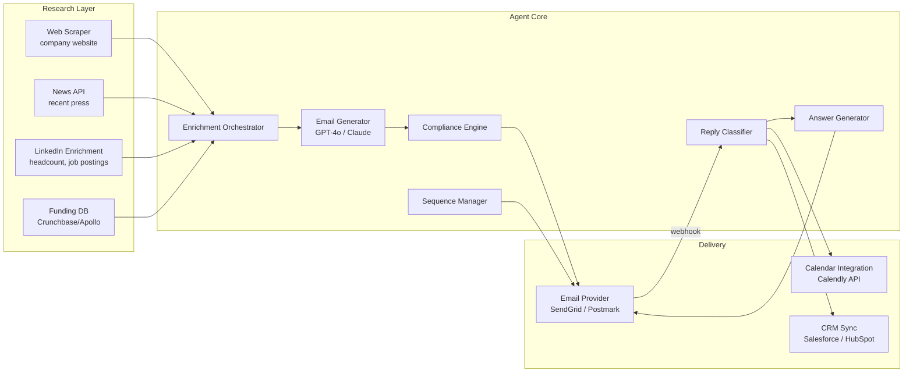

# Design an AI Sales Development Agent — Automated Lead Research, Outreach, and Booking

**Difficulty**: 🟡 Intermediate
**Reading Time**: 25 minutes
**Interview Frequency**: Medium — popular in B2B SaaS and sales tech interviews

> **The difference between an AI SDR and spam is personalization + timing + relevance. An agent sending 1,000 generic emails is noise. An agent that reads the prospect's latest company news and connects it to a specific pain point gets 3× the reply rate.**

---

## Table of Contents

| Section | What You'll Learn |
|---------|-------------------|
| [Mental Model](#mental-model) | Lead to booked meeting pipeline |
| [Requirements](#requirements) | Volume, quality, and compliance targets |
| [Architecture](#architecture) | Research, generation, send, and reply-handling pipeline |
| [Deep Dive: Lead Enrichment](#deep-dive-lead-enrichment) | Multi-source research and LLM summarization |
| [Deep Dive: Email Personalization](#deep-dive-email-personalization) | Template + research = unique angle |
| [Deep Dive: Reply Handling](#deep-dive-reply-handling) | Classification and response routing |
| [Failure Modes](#failure-modes) | Spam filters, hallucinated facts, GDPR, infinite follow-ups |
| [Interview Q&A](#interview-qa) | How to answer common questions |

---

## Mental Model

The sales team uploads a CSV of 500 target companies. The agent researches each lead (company news, LinkedIn, job postings), writes a personalized outreach email with a specific angle relevant to the prospect, sends it, monitors for replies, classifies replies (interested / not interested / question / OOO), handles questions with follow-up responses, and books meetings directly into the rep's calendar when a prospect says yes.



---

## Requirements

### Functional Requirements

1. Accept lead list (company name, website, contact name, email, title)
2. Enrich each lead: company news, funding rounds, job postings, recent LinkedIn activity
3. Generate personalized outreach email with company-specific angle
4. Send at optimal time (prospect's timezone, Tuesday-Thursday, 9-11am local)
5. Monitor replies via email provider webhooks
6. Classify replies and respond appropriately or route to human rep
7. Book meetings via Calendly API integration on positive replies
8. Track sequence state: which step each lead is on, replies, outcomes

### Non-Functional Requirements

| Requirement | Target |
|-------------|--------|
| Enrichment time per lead | < 60s |
| Email personalization quality | > 85% unique content per email (no template repetition) |
| Reply classification accuracy | > 90% |
| Deliverability rate (inbox vs spam) | > 85% |
| CAN-SPAM / GDPR compliance | 100% — automatic opt-out processing < 24h |
| Max emails per day (per domain) | 100 (stay under spam threshold) |
| Meeting booking conversion | Track: interested reply → meeting booked |

### Capacity Estimation

- 500 leads/batch × 3 follow-ups each = 1,500 emails per campaign
- 1,500 emails / 100 per day = 15 days to complete a campaign on one domain
- Enrichment: 500 leads × 60s each = 8.3 hours — run overnight before campaign launch
- Reply monitoring: avg 10% reply rate = 150 replies to classify and handle

---

## Architecture



---

## Deep Dive: Lead Enrichment

### Multi-Source Research Pipeline

For each lead, the enrichment agent runs parallel research tasks:

```
Lead: Acme Corp, acmecorp.com, John Smith (VP Engineering)

Parallel research:
  1. Company website → product description, customers, tech stack
  2. News API (Google News / NewsAPI) → last 30 days of press releases, funding, hirings
  3. LinkedIn company page → headcount growth, recent job postings, tech stack signals
  4. Crunchbase → funding stage, investors, revenue estimate
  5. BuiltWith → technology stack (are they using a competitor?)
```

LLM summarization produces a research brief:
```
Company Research Brief — Acme Corp:
  - Raised $30M Series B in January 2026 (source: TechCrunch)
  - Hiring 15 backend engineers (source: LinkedIn, 15 open roles)
  - Current tech stack: AWS, Kubernetes, Postgres, Python
  - VP Engineering John Smith joined 3 months ago from Stripe
  - Potential pain points: rapid team growth (need better dev tooling),
    new leadership (John may want to make infrastructure changes)

Suggested email angle: "Congratulations on the Series B — rapid scaling often
reveals infrastructure pain points. John's background at Stripe means he knows
what world-class developer tooling looks like..."
```

**Caching strategy**: Company research cached 7 days (news can go stale). Contact-level research (LinkedIn profile) cached 30 days. Re-enrich before follow-up #2 to see if anything changed.

---

## Deep Dive: Email Personalization

### Template + Research = Unique Email

The LLM generates a unique email using:
1. A campaign template (problem statement, product pitch, CTA)
2. The research brief (company-specific context)
3. Rules: keep under 150 words, one clear CTA, no generic phrases

**Anti-generic rules passed in system prompt**:
```
DO NOT use:
- "I hope this email finds you well"
- "I wanted to reach out"
- "At [company], we help [generic benefit]"
- "I'd love to connect"

DO:
- Reference one specific recent event (funding, hiring, news)
- Connect that event to a concrete pain point
- Be direct: one sentence on what we do, one sentence on relevance to them
- CTA: one specific ask (15-min call, not "let me know if interested")
```

**Example output**:
```
Subject: Series B + 15 backend hires = interesting infrastructure timing

Hi John,

Congratulations on the $30M round — saw you're already scaling the engineering team.

We help Series B companies like Acme reduce their onboarding time for new backend engineers from 2 weeks to 2 days with automated environment provisioning. Stripe (your last company) is actually one of our customers.

Worth a 15-minute call to see if it's relevant? Here's a link to grab time: [Calendly]

Best,
Alex
```

### Uniqueness Validation

Before sending, check that no two emails in this campaign share > 40% of their non-template text. Hash key phrases and flag duplicates — re-generate with different angle for flagged emails.

---

## Deep Dive: Reply Handling

### Reply Classification

```
Reply categories:
  INTERESTED        → "Yes, happy to chat" / "Can we schedule a call?" / "Send me more info"
  NOT_INTERESTED    → "We're not looking at this right now" / "Remove me from your list"
  QUESTION          → "How does the pricing work?" / "Do you integrate with X?"
  OUT_OF_OFFICE     → Auto-reply with return date
  BOUNCE            → Delivery failure (invalid email)
  UNSUBSCRIBE       → Any variant of "unsubscribe" or "remove me"
  AMBIGUOUS         → Unclear intent → route to human rep

Classifier: fine-tuned BERT model + LLM for AMBIGUOUS fallback
Accuracy target: > 90% for INTERESTED/NOT_INTERESTED/UNSUBSCRIBE
```

### Response Automation

| Classification | Automated Action | Human Involved? |
|---------------|-----------------|-----------------|
| INTERESTED | Send Calendly link, notify rep | Rep confirms meeting |
| NOT_INTERESTED | Mark as lost in CRM, stop sequence | No |
| QUESTION | LLM generates answer, rep reviews before sending | Rep approves |
| OUT_OF_OFFICE | Parse return date, schedule follow-up 2 days after | No |
| BOUNCE | Mark email invalid, try LinkedIn InMail if available | No |
| UNSUBSCRIBE | Immediate opt-out, stop all sequences | No |
| AMBIGUOUS | Flag for rep to handle manually | Yes |

**Question answering**: The agent has a knowledge base of common questions + approved answers (pricing, integrations, security, case studies). LLM generates answer from knowledge base. Human rep reviews and approves before sending — this avoids hallucinated pricing or false commitments.

---

## Failure Modes

### 1. Spam Filters Blocking Emails
**Scenario**: 500 nearly-identical emails sent same day → Gmail/Outlook spam classification
**Impact**: 0% deliverability; campaign fails; domain reputation damaged
**Mitigation**:
- Domain warming: new sending domain starts at 10 emails/day, increases 20%/day over 30 days
- Email variety: different subject lines, different sending times, unique personalization ensures low similarity
- SPF + DKIM + DMARC: proper DNS configuration is mandatory
- Spam score check before sending: tools like Mail Tester score each email before delivery
- Monitor bounce rate: > 5% hard bounces → pause campaign, investigate list quality

### 2. Hallucinated Company Facts in Email
**Scenario**: LLM writes "I see you recently acquired TechStartup" — this never happened
**Impact**: Email sent with false information; prospect loses trust; rep embarrassed
**Mitigation**:
- Every factual claim in generated email must be traceable to a source in the research brief
- LLM prompt: "Only include facts that appear in the provided research brief. If you're unsure of a fact, omit it."
- Fact-check pass: run a second LLM call to verify each factual claim against the research brief
- Flag emails with any claim not in research brief for human review before sending

### 3. Infinite Follow-Up Loop
**Scenario**: Reply classification fails silently; lead replies "STOP" but it's classified as ambiguous; follow-ups continue
**Impact**: Spam complaints; CAN-SPAM violation; domain blacklisted
**Mitigation**:
- Hard stop: any email containing "unsubscribe", "stop", "remove", "opt out" → immediate unsubscribe regardless of classifier
- Max 3 follow-ups total — hard limit regardless of engagement
- Manual review queue: all ambiguous classifications reviewed within 24h
- Global suppression list: unsubscribed emails added to a global list checked before any send

### 4. GDPR Compliance for EU Leads
**Scenario**: Outreach to EU companies without lawful basis; recipient files GDPR complaint
**Impact**: GDPR fine up to 4% of annual revenue
**Mitigation**:
- Legitimate interest assessment: document why outreach is proportionate (B2B, relevant product, targeted research)
- Unsubscribe link: required in every email, processes opt-out within 24h
- Data minimization: only store name, email, company — no extensive personal profiling
- Data retention: delete lead data if no engagement within 12 months
- EU data stored in EU region (data residency requirement)

---

## Interview Q&A

### "How would you prevent the agent from making commitments it can't keep?"

> "The key is to never let the agent answer questions about pricing, SLAs, or contractual terms autonomously. Any reply classified as QUESTION goes through a human approval step before sending. The agent drafts a response from the approved knowledge base — which contains pre-approved answers for common questions — but a human rep reviews and clicks 'approve' before it sends. This adds a 24-hour delay for question replies, but it prevents 'our product costs $X/month' when the actual price is different. For standard questions with pre-approved answers (like 'do you integrate with Salesforce?'), the rep can batch-approve answers in 5 minutes. Only novel questions need more review time."

### "How do you measure if this agent is actually working?"

> "Three-tier funnel metrics: (1) Deliverability — what % actually reach the inbox (target: >85%). (2) Engagement — open rate (meaningful if segmented by sequence step), reply rate (10% is excellent for cold outreach), and reply sentiment breakdown (interested vs not-interested ratio). (3) Business outcome — meetings booked per 100 emails sent, and conversion from meeting to opportunity in CRM. The most important metric is meetings-per-100-emails because that's the ultimate output. I'd also track time-to-first-reply (faster = more engaged prospects) and which personalization angles have the highest conversion rate, so we can improve the research brief generation over time."

---

## Key Takeaways

| Number | What It Means |
|--------|--------------|
| **100 emails/day/domain** | Stay under spam detection thresholds |
| **90% classifier accuracy** | Reply classification target — misclassified UNSUBSCRIBE = CAN-SPAM violation |
| **3 follow-ups max** | Hard limit — quality beats volume in cold outreach |
| **7-day cache** | Research brief freshness — news can go stale quickly |
| **Human approval** | Required for question replies — prevent false commitments |
| **150 words max** | Email length target — shorter = higher reply rate for cold outreach |

---

## 📚 Resources & References

| Resource | Type | What You'll Learn |
|----------|------|------------------|
| [Apollo.io AI Sales Automation](https://apollo.io/blog/ai-sales-automation) | 📖 Blog | How a leading sales platform implements AI-powered outreach at scale |
| [Outreach.io Engineering: AI Sequences](https://www.outreach.io/blog/ai-sales-sequences) | 📖 Blog | Production design of reply classification and sequence automation |
| [CAN-SPAM Act Compliance Guide](https://www.ftc.gov/business-guidance/resources/can-spam-act-compliance-guide-business) | 📚 Docs | Legal requirements for commercial email in the US |
| [GDPR Email Marketing Requirements](https://gdpr.eu/email-encryption/) | 📚 Docs | EU data protection requirements for B2B email outreach |
| [Sam Witteveen — AI Email Agents](https://www.youtube.com/@samwitteveenai) | 📺 YouTube | Building LLM-powered email reply classification and generation |
| [ByteByteGo — Design an Email Service](https://www.youtube.com/@ByteByteGo) | 📺 YouTube | Search "email service design" — relevant scalable email delivery architecture |
