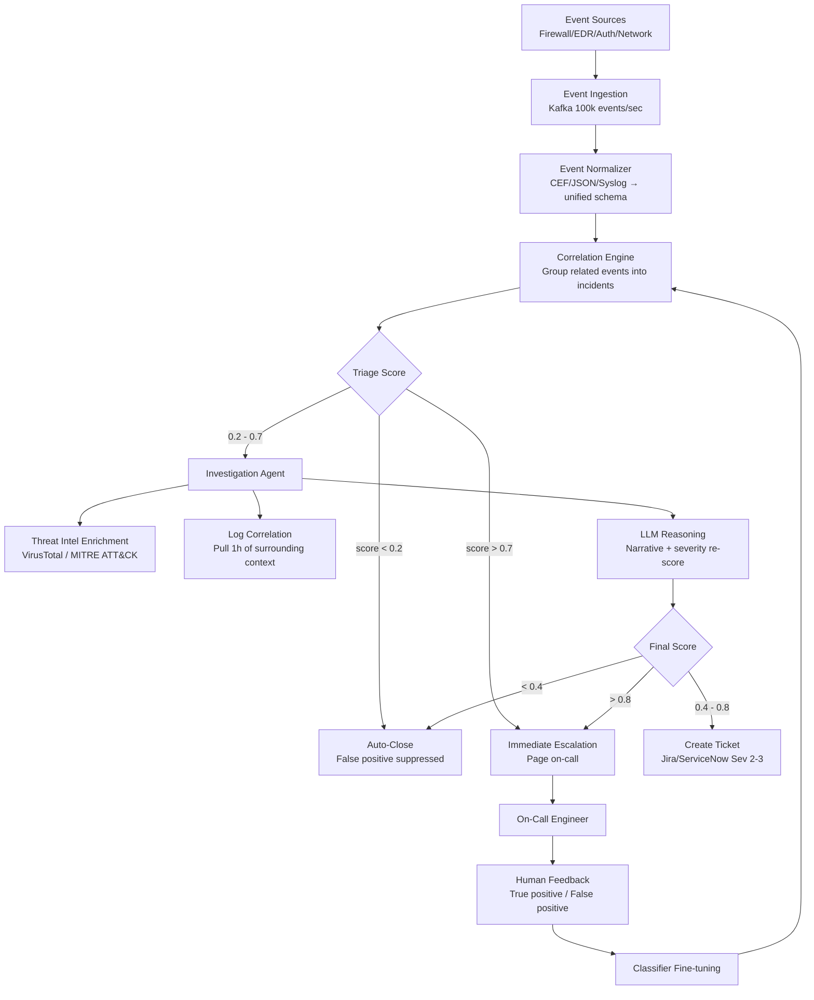
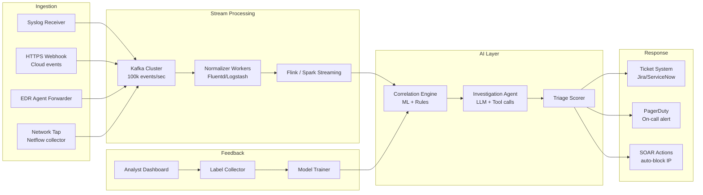
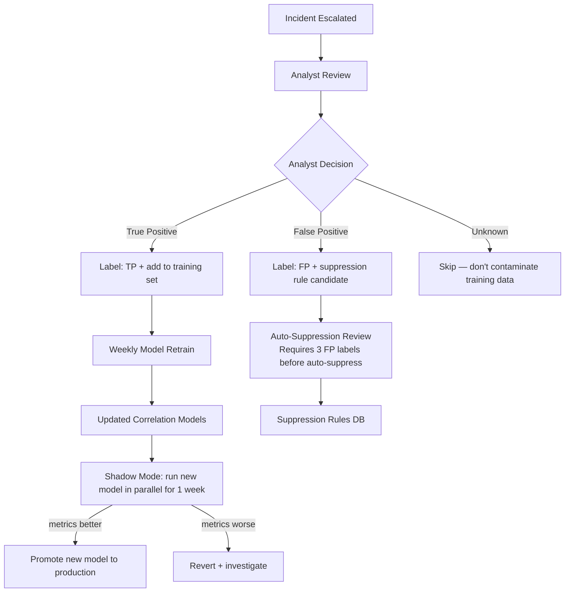
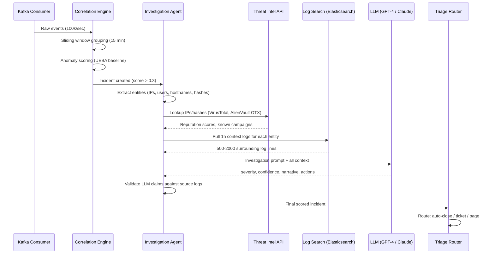
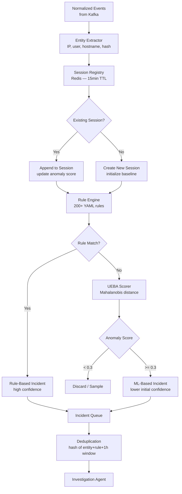
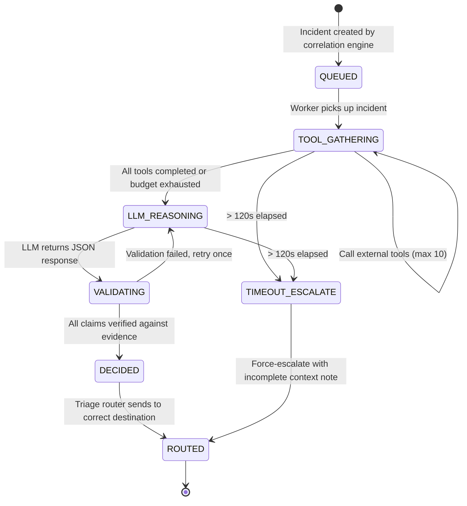

# Design a Security Monitoring Agent — AI-Driven Threat Detection and Triage

**Difficulty**: 🔴 Advanced
**Reading Time**: 35 minutes
**Interview Frequency**: Medium-High — popular in security-focused engineering interviews and principal/staff roles

> **Alert fatigue kills security posture. The real problem isn't detecting threats — it's separating 50 real incidents from 50,000 false positives per day, at machine speed, without missing a single lateral movement campaign.**

---

## Table of Contents

| Section | What You'll Learn |
|---------|-------------------|
| [Mental Model](#mental-model) | Event correlation through escalation pipeline |
| [Requirements](#requirements) | Throughput, accuracy, and latency targets |
| [Architecture](#architecture) | Stream processing with AI investigation layer |
| [Deep Dive: Correlation Engine](#deep-dive-correlation-engine) | Grouping events into actionable incidents |
| [Deep Dive: Investigation Agent](#deep-dive-investigation-agent) | AI-driven log enrichment and reasoning |
| [Deep Dive: False Positive Reduction](#deep-dive-false-positive-reduction) | Feedback loop and classifier improvement |
| [Failure Modes](#failure-modes) | Alert storms, adversarial alerts, false negatives |
| [Interview Q&A](#interview-qa) | How to answer common questions |

---

## Mental Model

Thousands of raw security events arrive every second from firewalls, EDR agents, authentication logs, and network taps. The agent correlates related events into incidents, investigates each incident by querying threat intelligence and pulling additional context, assigns a severity and confidence score, and either auto-closes obvious false positives, opens a ticket for medium-severity items, or immediately pages on-call for critical threats.



---

## Requirements

### Functional Requirements

1. Ingest events from heterogeneous sources: SIEM, EDR, network flows, auth logs, cloud trails
2. Normalize events to a unified schema (Common Event Format compatible)
3. Correlate related events into incidents using rule-based and ML-based correlation
4. Investigate suspicious incidents: enrich with threat intel, pull surrounding log context
5. Score each incident (severity 1-5, confidence 0-1)
6. Escalate: auto-close clear false positives, open tickets for medium, page on-call for critical
7. Learn from human feedback: analyst labels → improve classifier

### Non-Functional Requirements

| Requirement | Target |
|-------------|--------|
| Event ingestion throughput | 100,000 events/second |
| Correlation latency (event to incident) | < 30s P95 |
| Investigation latency (incident to score) | < 120s P95 |
| False positive rate (of escalated incidents) | < 10% |
| False negative rate (missed real threats) | < 1% |
| System availability | 99.99% (4 nines — security cannot go down) |
| Alert fatigue reduction vs rule-only SIEM | > 80% reduction in paged incidents |

### Capacity Estimation

- 100,000 events/second = 6M events/minute = 8.64B events/day
- Storage: events at avg 500 bytes = 4.3TB/day raw, ~500GB after compression
- Correlation window: 15-minute sliding window = 90M events in working memory
- Kafka partitioning: 100 partitions × 1,000 events/sec/partition = 100k/sec throughput

---

## Architecture



---

## Deep Dive: Correlation Engine

### The Correlation Problem

Raw events are atomic observations: "IP 10.1.2.3 scanned port 22 on 10.1.2.100." Alone, this could be an IT admin or an attacker. In context of: "same IP triggered 50 failed SSH logins 5 minutes ago, and 2 minutes ago it accessed a file server" — it's a brute-force followed by lateral movement.

### Three Correlation Methods

**1. Rule-Based Correlation** (fast, low-latency, catches known patterns):
```yaml
rule: brute_force_ssh
conditions:
  - event_type: authentication_failure
  - protocol: SSH
  - count: > 20
  - time_window: 5m
  - same_source_ip: true
severity: 3
confidence: 0.9
```

**2. Session-Based Correlation** (group by entity):
- Maintain a 15-minute rolling session per (source_ip, destination) pair
- Any anomaly within a session elevates all events in that session to the same incident
- Entity resolution: `10.1.2.3` + hostname lookup → `prod-db-01` → `admin user jsmith` → full attribution

**3. ML-Based Behavioral Anomaly** (catches novel patterns):
- Train user and entity behavior baselines (UEBA): typical login time, typical data volume, typical destination IPs
- Anomaly score = distance from baseline (Mahalanobis distance across 20 behavioral features)
- Threshold: anomaly score > 3 standard deviations → feed to investigation agent

### Correlation Window Management

15-minute sliding window across 100k events/sec = 90 million events in memory. Memory constraint forces sampling strategy:
- Keep all events with anomaly score > 0.3 (full fidelity)
- Sample high-volume low-risk events at 1% (firewall permit events from known IPs)
- Never sample: auth events, admin actions, data exfiltration indicators

---

## Deep Dive: Investigation Agent

### LLM-Powered Incident Investigation

When an incident is created, the investigation agent runs autonomously:

```
Step 1: Retrieve the incident's correlated events (last 1h context window)
Step 2: Entity extraction — list all IPs, users, hostnames, file paths involved
Step 3: Threat intel lookup (VirusTotal API for IPs/hashes, MITRE ATT&CK for TTPs)
Step 4: Pull surrounding logs for each entity (auth logs, process creation, network flows)
Step 5: Feed all context to LLM with investigation prompt
Step 6: LLM generates: severity assessment + confidence + narrative + recommended actions
```

**Investigation prompt structure**:
```
You are a senior security analyst. Analyze this security incident:

Incident Events:
  [list of normalized events with timestamps]

Entity Intelligence:
  IP 185.220.101.45: VirusTotal score 8/92, known Tor exit node
  User jsmith: Last login from 192.168.1.10 (normal) — this login from 185.220.101.45 (anomalous)
  File accessed: /etc/shadow — highly sensitive, accessed 2 min after SSH login

MITRE ATT&CK Techniques detected:
  T1110.001 — Brute Force: Password Guessing
  T1003.008 — OS Credential Dumping: /etc/passwd and /etc/shadow

Assess:
1. Is this a true threat or false positive?
2. Severity (1=critical, 5=informational)
3. Confidence (0-1)
4. What happened (narrative for analyst)
5. Recommended immediate actions
```

**Output example**:
```json
{
  "assessment": "true_threat",
  "severity": 1,
  "confidence": 0.95,
  "narrative": "Attacker at Tor exit node 185.220.101.45 successfully brute-forced jsmith's SSH credentials after 47 failed attempts. Following login, /etc/shadow was accessed within 120 seconds — consistent with credential harvesting. High confidence this is active lateral movement.",
  "recommended_actions": [
    "Block 185.220.101.45 at perimeter firewall immediately",
    "Disable jsmith account pending investigation",
    "Check all other servers jsmith has accessed in last 24h",
    "Rotate all root passwords on affected server"
  ]
}
```

---

## Deep Dive: False Positive Reduction

### The Alert Fatigue Problem

A typical rule-based SIEM generates 10,000-50,000 alerts per day for a mid-size company. Security teams can realistically investigate 100-200 alerts per day. The gap creates alert fatigue — analysts start ignoring alerts or rubber-stamping closures.

**Target**: 80% reduction in escalated alerts while maintaining < 1% false negative rate.

### Feedback Loop Architecture



### Suppression Rule Safety

Suppression rules are dangerous: one incorrect rule can suppress real attacks. Safety controls:
- Require 3 independent analyst labels of "false positive" before creating auto-suppression
- All suppression rules have 30-day expiry (must be explicitly renewed)
- Suppression rules cannot cover Severity 1 or 2 events (always investigate)
- Monthly audit: show suppressed event count per rule; rules suppressing > 10k/month require security team review

---

## Failure Modes

### 1. Alert Storm Overwhelming Agent (10k alerts/minute)
**Scenario**: DDoS attack generates 10,000 alerts/min from perimeter firewall; investigation agent falls behind
**Impact**: Real threats buried under DDoS noise; investigation queue depth grows to hours
**Mitigation**:
- Dynamic deduplication: if 1,000+ events share same source IP in 1 minute, collapse to single "DDoS campaign" incident
- Priority queue: Severity 1 incidents always processed first; auto-deprioritize high-volume low-severity bursts
- Circuit breaker: if DDoS traffic from single IP exceeds threshold, auto-block at perimeter AND stop generating individual alerts
- Separate queue for DDoS events with different SLA (15min investigation vs 2min for novel threats)

### 2. Adversarial Alerts Designed to Confuse Classifier
**Scenario**: Attacker deliberately triggers 5,000 low-confidence alerts to cause alert fatigue before launching real attack
**Impact**: SOC team exhausted; real attack classified as false positive
**Mitigation**:
- Never suppress Severity 1 indicators regardless of volume (credential dumping, privilege escalation)
- Novelty detection: sudden 10× increase in alert volume from a specific rule → flag as potential adversarial activity
- Human-in-the-loop for suppression decisions — no auto-suppression of new patterns within 7 days
- Red team exercises: regularly test whether alert flooding successfully hides lateral movement

### 3. False Negative — Real Attack Not Detected
**Scenario**: Novel ransomware uses encrypted C2 channels — no known malware signatures; missed by rule-based detection
**Impact**: Ransomware encrypts backup servers; $10M recovery cost
**Mitigation**:
- Behavioral anomaly detection as second layer — unusual encryption activity at high rate triggers anomaly alert even without signature match
- Threat intel feeds: subscribe to real-time IOC feeds (AlienVault OTX, Mandiant) with < 1h lag
- Regular "detection gap" analysis: map incidents from threat intelligence reports against what our rules would have caught
- Canary tokens: synthetic sensitive files that should never be accessed — any access → immediate Severity 1

### 4. LLM Hallucination in Investigation Narrative
**Scenario**: LLM generates investigation narrative stating "attacker used CVE-2024-1234" when no such evidence exists in logs
**Impact**: Analyst wastes 2 hours investigating wrong CVE; real attack vector missed
**Mitigation**:
- Constrained generation: LLM must cite specific log entries for every claim ("Brute force detected: see events 1-47 in this incident")
- Separate factual claims from inference: "Evidence: 47 failed logins. Analysis: consistent with brute force. Confidence: high."
- Analyst validation UI: every claim in the narrative is hyperlinked to the source log entry

---

## Interview Q&A

### "How do you ensure 99.99% availability for a security monitoring system?"

> "Security monitoring is non-negotiable for uptime. At 99.99%, we have < 53 minutes of downtime per year. I'd design for this with: (1) Active-active multi-region deployment — events replicated to two regions via Kafka MirrorMaker; if one region fails, events continue flowing to the other within seconds. (2) Kafka as the durable buffer — even if processing falls behind, events aren't lost; the consumer can catch up when processing recovers. (3) The investigation agent is stateless — it reads from Kafka and writes to a durable state store; any worker can be restarted without losing work. (4) On-call automation: if investigation queue depth > 10,000 (90th percentile spike), auto-scale workers rather than waiting for human intervention. (5) Chaos engineering: monthly game days where we kill regions and verify monitoring continues."

### "How do you handle tuning the false positive threshold when you're just starting out?"

> "With a new deployment, you don't have labeled data to tune the ML threshold, so you start conservative — use only high-confidence rule-based detection for initial escalation. The ML model runs in shadow mode (scores incidents but doesn't escalate) for the first 4 weeks while analysts review all rule-based escalations and provide labels. After 1,000 labeled incidents (achievable in 4 weeks for a mid-size org), you have enough data to calibrate the ML threshold. Start with a threshold that maintains < 5% FPR even if it means some false positives — you can tighten it after building analyst trust. Never jump straight to aggressive suppression without a calibration period."

---

## Key Takeaways

| Number | What It Means |
|--------|--------------|
| **100,000 events/sec** | Ingestion throughput target — Kafka with 100 partitions handles this |
| **80% reduction** | Alert fatigue reduction goal vs rule-only SIEM |
| **< 1% false negative** | Real threats missed — the cost of a miss is enormous; err on FP side |
| **3 FP labels** | Required before auto-suppression — prevents adversarial rule injection |
| **30-day expiry** | On all suppression rules — forces periodic review of what's being silenced |
| **15-min correlation window** | Sufficient for most lateral movement patterns; longer windows cost too much memory |

---

## Agent Architecture

The security monitoring agent operates as a continuous, event-driven loop. Unlike a simple classifier that scores a single event and returns, this agent maintains state across a 15-minute correlation window, makes multiple LLM calls per incident, and invokes external tools (threat intel APIs, log search) before reaching a final verdict.



**Agent loop design constraints:**
- Each full investigation cycle must complete in < 120 seconds P95
- LLM call budget: max 2 LLM calls per incident (initial reasoning + optional follow-up clarification)
- Tool call budget: max 10 external API calls per incident (prevents runaway cost on noisy incidents)
- If budget exceeded: force a decision with available context rather than waiting indefinitely

---

## Tool/Function Registry

The investigation agent can invoke a controlled set of tools. Tools are selected by the agent's planning step before the LLM reasoning call — not by the LLM itself (avoids hallucinated tool names).

| Tool | API | Input | Output | Timeout | Cost |
|------|-----|-------|--------|---------|------|
| `lookup_ip_reputation` | VirusTotal v3 | IP address | malicious score 0-100, known campaigns | 3s | $0.001 |
| `lookup_file_hash` | VirusTotal v3 | SHA256 hash | malware family, detection rate | 3s | $0.001 |
| `search_logs` | Elasticsearch | entity + time range | raw log lines (max 2000) | 5s | $0.0001 |
| `get_mitre_techniques` | Local MITRE ATT&CK DB | technique ID or keyword | tactic, technique description, sub-techniques | 100ms | $0 |
| `get_user_baseline` | Internal UEBA service | username | typical login times, source IPs, data volumes | 200ms | $0 |
| `lookup_asset_owner` | CMDB API | hostname or IP | business owner, sensitivity tier, team | 500ms | $0 |
| `get_related_incidents` | Incident DB | entity or IP | prior incidents involving same entity (90 days) | 200ms | $0 |
| `block_ip_firewall` | SOAR API | IP address | confirmation | 1s | $0 |
| `disable_user_account` | IAM API | username | confirmation | 1s | $0 |

**Tool selection logic** (deterministic, not LLM-driven):
```python
def select_tools(incident: Incident) -> list[str]:
    tools = ["search_logs", "get_user_baseline", "get_mitre_techniques"]
    if incident.has_external_ips:
        tools.append("lookup_ip_reputation")
    if incident.has_file_hashes:
        tools.append("lookup_file_hash")
    if incident.has_hostnames:
        tools.append("lookup_asset_owner")
    if incident.prior_incident_count > 0:
        tools.append("get_related_incidents")
    return tools[:MAX_TOOL_CALLS]  # hard cap at 10
```

**Error handling when tools fail:**
- VirusTotal API timeout: mark IP reputation as "unknown" (not "clean") — fail safe toward investigation
- Elasticsearch timeout: proceed with correlation events only; note "log pull incomplete" in narrative
- CMDB missing asset: assume Tier 1 (highest sensitivity) — fail safe toward escalation
- SOAR action failure: alert human on-call to perform manual block; never silently skip remediation

---

## Prompt Engineering

### System Prompt Structure

The LLM system prompt is structured in four layers, ordered by authority:

```
[ROLE]
You are a senior security analyst with 10 years of experience in incident response.
Your analysis must be grounded strictly in the provided evidence.
Do NOT speculate about attack techniques not evidenced in the logs.

[OUTPUT FORMAT - MANDATORY]
Return JSON only. Schema: {"assessment": "true_threat|false_positive|uncertain",
"severity": 1-5, "confidence": 0.0-1.0, "narrative": "string",
"evidence_citations": ["event_id_1", "event_id_2"],
"recommended_actions": ["action1", "action2"],
"missing_context": "string or null"}

[EVIDENCE]
{incident_events}
{entity_intelligence}
{mitre_techniques}
{historical_incidents}

[CONSTRAINTS]
- Every claim in "narrative" must reference at least one event ID from EVIDENCE
- If confidence < 0.5, set assessment to "uncertain"
- Severity 1 = immediate compromise; Severity 5 = informational only
- Recommended actions must be specific and immediately executable
```

### Context Management

An incident can have 500-2,000 surrounding log lines. At GPT-4 context window of 128k tokens, this comfortably fits — but cost scales with token count. Strategy:

- **Summarize high-volume repetitive events**: 500 identical firewall permit events → "500 permit events from 192.168.1.10 to 8.8.8.8:443 between 14:00-14:15"
- **Full fidelity for anomalous events**: authentication failures, privilege escalation, unusual file access — always include verbatim
- **Recency bias**: events within 5 minutes of the triggering event get full detail; older events get summarized
- **Token budget**: max 20,000 tokens for log context (approximately 1,000 log lines uncompressed)

### Instruction Hierarchy

When the LLM's reasoning conflicts with deterministic rules, rules win:
- If LLM says "false positive" but a canary token was accessed → escalate anyway
- If LLM confidence is 0.9 "true threat" but source IP is internal RFC1918 → require human validation before blocking
- If LLM recommends disabling a service account used by 50 applications → flag for human approval, do not auto-execute

---

## Failure Modes

### Hallucination: LLM Claims Non-Existent Evidence

**When it happens**: The LLM generates a narrative citing "CVE-2024-44243 exploitation" or claims "attacker exfiltrated 50GB to 185.220.x.x" when no such evidence exists in the provided context.

**Detection**:
- Post-processing validation: extract all specific claims from narrative (CVE IDs, data volumes, IP addresses) and verify each against the provided evidence JSON
- Confidence mismatch detection: if LLM claims high confidence (0.9+) but `evidence_citations` array is empty → flag as potential hallucination
- Schema enforcement: structured output (JSON schema) prevents free-form fabrication of evidence

**Mitigation**:
- Constrained generation with JSON schema + `evidence_citations` required field forces the LLM to cite specific event IDs
- Analyst UI shows each claim hyperlinked to the cited source log entry — analyst immediately sees unsupported claims
- If validation fails (< 70% claims verified): downgrade confidence by 0.3 and add "VALIDATION WARNING: some claims unverified" to the narrative

### Loop Detection: Agent Stuck in Investigation

**When it happens**: An incident's LLM response returns `"assessment": "uncertain"` and requests more context. The agent fetches more logs, re-runs the LLM, gets `"uncertain"` again. Without a stop condition, this loops indefinitely.

**Mitigation**:
- Hard loop limit: max 2 LLM reasoning iterations per incident
- Escalation on uncertainty: after 2 iterations with `uncertain` result → escalate to human analyst with all gathered context
- Time budget: if total investigation time exceeds 120 seconds → force a decision using best available data
- Minimum confidence floor: if LLM returns `confidence < 0.3` on second pass → treat as `uncertain` and escalate (never auto-close based on low-confidence uncertain)

### Cost Control: Token Budget Management

Each GPT-4 (128k) investigation call costs approximately $0.20-$1.50 depending on context size. At 1,000 incidents/day, uncontrolled cost = $200-$1,500/day.

**Budget controls**:
- Low-triage incidents (score < 0.3): no LLM call — rule-based decision only
- Medium-triage (0.3-0.7): single LLM call, max 10,000 token context
- High-triage (> 0.7): up to 2 LLM calls, max 30,000 token context
- Monthly token budget alarm: if projected monthly spend exceeds $15,000 → alert engineering team
- Model routing: use GPT-4o-mini for initial pass; only escalate to GPT-4o for Severity 1-2 incidents

---

## Component Deep Dive 1: Correlation Engine Internals

The correlation engine is the most critical component because every downstream decision — LLM investigation cost, analyst workload, false negative rate — depends on how well raw events are grouped into meaningful incidents. A bad correlation engine either creates 10,000 micro-incidents (overwhelming the investigation agent) or merges unrelated events into a single noisy incident (hiding the real signal).

### Internal Architecture



**Session Registry (Redis)**:
- Key: `session:{src_ip}:{dst_ip}:{protocol}` with 15-minute TTL
- Value: sorted set of event IDs (by timestamp) + rolling anomaly score
- At 100k events/sec with average 5 entities per event = 500k Redis writes/sec
- Redis Cluster with 20 shards handles 500k writes/sec at P99 < 2ms
- Session expiry is sliding (reset on each new event) — a long attack campaign keeps its session alive

**Rule Engine**:
- 200+ detection rules stored as YAML, compiled to bytecode at startup
- Rule evaluation: parallel evaluation across all matching rules per event (not sequential)
- Rule priority: Severity 1 rules short-circuit — if matched, skip ML scoring and escalate immediately
- Hot reload: rules updated via Git commit → deploy pipeline pushes new ruleset to all workers without restart

**Why naive correlation fails at scale**:
A simple "group by source IP" approach creates sessions that are too broad. One corporate proxy (10.0.0.1) makes requests on behalf of 10,000 users — grouping by source IP creates a single session with millions of events and zero meaningful correlation. Entity resolution is mandatory: resolve IP to user to device before creating a session.

| Approach | Session Key | Precision | Recall | Memory Usage |
|----------|-------------|-----------|--------|--------------|
| IP-only grouping | src_ip | Low (proxy problem) | High | 10GB |
| IP + port | src_ip + dst_port | Medium | Medium | 50GB |
| Entity-resolved | user + device + campaign | High | High | 8GB (after resolution) |
| ML graph clustering | embedding similarity | High | High | 20GB (model + state) |

---

## Component Deep Dive 2: Investigation Agent Loop

The investigation agent manages the transition from a correlated incident (a structured set of events) to an actionable verdict. At 10x baseline load (10,000 incidents/day), the agent must maintain throughput without degrading investigation quality for high-severity incidents.

### Agent State Machine



**Scale behavior at 10x load (10,000 incidents/day)**:
- Normal: 10 investigation workers, avg 30s per incident, utilization 40%
- 10x load: 100 incidents/hour → with 30s avg = need 100 × 30s / 3600s = ~1 worker (math works)
- But: 10x load means 100 incidents/hour, not 1,000 — the 10x affects event volume, not necessarily incident count (correlation reduces 10x events to 2-3x incidents)
- Real bottleneck at 10x: VirusTotal API rate limits (4 requests/min on free tier; need enterprise plan at 500 requests/min for 100 incidents/hour with IP lookups)
- Solution: bulk enrichment — batch 50 IPs per VirusTotal API call, available in enterprise tier

**Priority queue design**:
```
Queue 1 (Severity 1): processed by dedicated 5 workers, max wait 10s
Queue 2 (Severity 2-3): processed by 20 shared workers, max wait 60s  
Queue 3 (Severity 4-5): processed by 5 background workers, max wait 600s
Overflow: if any queue depth > 1000, scale workers automatically (K8s HPA)
```

---

## Component Deep Dive 3: False Positive Storage and Classifier State

The feedback loop's effectiveness depends entirely on how analyst labels are stored, retrieved, and used for retraining. A classification model is only as good as its labeled training set — and in security, labels arrive slowly (analysts review 100-200 incidents/day) and expire quickly (attacker techniques evolve every 6-12 months).

**Storage design for labeled incidents**:
- Labeled incidents stored in PostgreSQL with full event JSON, analyst label, analyst ID, label timestamp
- Label confidence: analysts can mark "high confidence TP/FP" vs "uncertain" — uncertain labels excluded from training
- Label drift detection: if same incident type is labeled TP in January but FP in March by multiple analysts → trigger review (technique may have changed character)
- Training set management: rolling 90-day window for ML retraining; older labels archived but not used for active training (attacker behavior from 18 months ago may not generalize)

**Suppression rule safety at scale**:
- At 100k events/sec, a single incorrect suppression rule could silence 100,000 events/sec of legitimate attacks
- Suppression rules go through a 24-hour shadow mode: the rule is applied in shadow (counts what would be suppressed) but doesn't actually suppress
- Shadow mode metrics reviewed by senior analyst before rule goes live
- Canary events: synthetic events matching known attack patterns are injected at 1/hour into each suppression rule's pattern — if a suppression rule fires on a canary, it is immediately disabled and flagged

---

## Data Model

```sql
-- Core event table (write-heavy, partition by hour)
CREATE TABLE security_events (
    event_id        UUID PRIMARY KEY DEFAULT gen_random_uuid(),
    event_time      TIMESTAMPTZ NOT NULL,
    source_type     VARCHAR(50) NOT NULL,        -- 'firewall', 'edr', 'auth', 'network'
    source_host     VARCHAR(255),
    src_ip          INET,
    dst_ip          INET,
    src_port        INTEGER,
    dst_port        INTEGER,
    username        VARCHAR(255),
    hostname        VARCHAR(255),
    file_hash       CHAR(64),                    -- SHA256
    event_type      VARCHAR(100) NOT NULL,       -- 'auth_failure', 'port_scan', 'file_access'
    severity_hint   SMALLINT DEFAULT 5,          -- source-reported severity 1-5
    raw_payload     JSONB,                       -- original event in source format
    normalized_at   TIMESTAMPTZ DEFAULT now(),
    session_key     VARCHAR(512),                -- entity-resolved session identifier
    anomaly_score   FLOAT4,
    INDEX idx_event_time (event_time),
    INDEX idx_src_ip (src_ip),
    INDEX idx_session_key (session_key),
    INDEX idx_event_type (event_type)
) PARTITION BY RANGE (event_time);

-- Incidents (correlated groups of events)
CREATE TABLE incidents (
    incident_id     UUID PRIMARY KEY DEFAULT gen_random_uuid(),
    created_at      TIMESTAMPTZ NOT NULL DEFAULT now(),
    updated_at      TIMESTAMPTZ NOT NULL DEFAULT now(),
    status          VARCHAR(20) NOT NULL,        -- 'open', 'investigating', 'escalated', 'closed', 'suppressed'
    severity        SMALLINT,                    -- 1 (critical) to 5 (informational)
    confidence      FLOAT4,                      -- 0.0 to 1.0
    rule_triggered  VARCHAR(200)[],              -- array of rule names that fired
    entity_ips      INET[],
    entity_users    TEXT[],
    entity_hosts    TEXT[],
    mitre_tactics   TEXT[],                      -- e.g. ['TA0001', 'TA0008']
    mitre_techniques TEXT[],                     -- e.g. ['T1110.001', 'T1003.008']
    event_count     INTEGER NOT NULL,
    first_event_at  TIMESTAMPTZ,
    last_event_at   TIMESTAMPTZ,
    investigation_started_at  TIMESTAMPTZ,
    investigation_completed_at TIMESTAMPTZ,
    INDEX idx_incidents_status (status),
    INDEX idx_incidents_severity (severity),
    INDEX idx_incidents_created (created_at)
);

-- LLM investigation results
CREATE TABLE incident_investigations (
    investigation_id UUID PRIMARY KEY DEFAULT gen_random_uuid(),
    incident_id     UUID NOT NULL REFERENCES incidents(incident_id),
    llm_model       VARCHAR(100) NOT NULL,       -- 'gpt-4o', 'claude-3-5-sonnet'
    llm_assessment  VARCHAR(20) NOT NULL,        -- 'true_threat', 'false_positive', 'uncertain'
    llm_severity    SMALLINT,
    llm_confidence  FLOAT4,
    narrative       TEXT,
    evidence_citations UUID[],                   -- event_ids cited by LLM
    recommended_actions JSONB,
    token_cost_usd  FLOAT4,
    created_at      TIMESTAMPTZ NOT NULL DEFAULT now(),
    validation_passed BOOLEAN,
    validation_notes TEXT
);

-- Analyst labels (feedback for retraining)
CREATE TABLE analyst_labels (
    label_id        UUID PRIMARY KEY DEFAULT gen_random_uuid(),
    incident_id     UUID NOT NULL REFERENCES incidents(incident_id),
    analyst_id      VARCHAR(100) NOT NULL,
    label           VARCHAR(20) NOT NULL,        -- 'true_positive', 'false_positive', 'uncertain'
    label_confidence VARCHAR(10),                -- 'high', 'medium', 'low'
    notes           TEXT,
    time_to_label_seconds INTEGER,              -- how long analyst spent reviewing
    labeled_at      TIMESTAMPTZ NOT NULL DEFAULT now(),
    included_in_training BOOLEAN DEFAULT false
);

-- Suppression rules
CREATE TABLE suppression_rules (
    rule_id         UUID PRIMARY KEY DEFAULT gen_random_uuid(),
    rule_name       VARCHAR(200) NOT NULL UNIQUE,
    pattern_json    JSONB NOT NULL,              -- event matching pattern
    created_by      VARCHAR(100) NOT NULL,
    created_at      TIMESTAMPTZ NOT NULL DEFAULT now(),
    expires_at      TIMESTAMPTZ NOT NULL,        -- mandatory 30-day expiry
    fp_label_count  INTEGER DEFAULT 0,           -- number of FP labels that triggered this rule
    suppressed_count BIGINT DEFAULT 0,           -- lifetime events suppressed
    last_shadow_review TIMESTAMPTZ,
    active          BOOLEAN DEFAULT false,       -- false during 24h shadow mode
    max_severity_covered SMALLINT DEFAULT 3      -- cannot cover Severity 1 or 2
);
```

---

## Scale Bottlenecks

| Traffic Level | Component That Breaks | Symptoms | Mitigation |
|---------------|----------------------|----------|------------|
| **10x baseline** (1M events/sec) | Kafka consumer lag grows | Investigation queue depth increases from seconds to minutes; P95 latency for incident creation degrades from 30s to 5min | Add 10 Kafka consumer partitions per event type; scale Flink workers horizontally (K8s HPA on consumer lag metric) |
| **10x baseline** | VirusTotal API rate limit | Tool call failures; 30% of IP lookups return "unknown" instead of reputation score | Switch to enterprise VirusTotal ($10k/month, 500 req/min); cache reputation scores in Redis with 4h TTL (reputation doesn't change minute-to-minute) |
| **100x baseline** (10M events/sec) | Redis session registry OOM | Session TTL evictions cause session splits; correlated attack appears as 50 separate micro-incidents | Redis Cluster scale-out (40 shards); reduce session state to only entity key + anomaly score (drop raw event IDs from Redis, look them up from Elasticsearch on demand) |
| **100x baseline** | Elasticsearch log query latency | Log pull for investigation context degrades from 2s to 30s P95; total investigation exceeds 120s budget | Pre-aggregate entity timelines in a dedicated index; hot-warm-cold storage tiers; async log pull with partial results at 5s timeout |
| **100x baseline** | LLM API throughput limit | Investigation agent queue grows exponentially; Severity 1 incidents wait hours for LLM verdict | Model routing: GPT-4o-mini for Severity 3-5 (10x cheaper, 5x faster); reserve GPT-4o for Severity 1-2; consider self-hosted Llama-3-70B for cost predictability at scale |
| **1000x baseline** (100M events/sec) | Entire stream processing tier | Flink job checkpoint time > restart window; exactly-once semantics fail under load | Switch to approximate processing: probabilistic data structures (HyperLogLog for cardinality, Count-Min Sketch for frequency); sacrifice perfect accuracy for throughput; sample 10% of low-risk events |
| **1000x baseline** | PostgreSQL incident writes | Write throughput saturates at ~50k writes/sec for incidents table | Shard incidents table by incident_id hash; use append-only event sourcing with Kafka as system of record; PostgreSQL as read-optimized query layer only |

---

## How Microsoft Sentinel Built This

Microsoft Sentinel is one of the most well-documented production SIEM systems built on AI/ML principles. Microsoft's security engineering team has published detailed architecture breakdowns through their TechCommunity blog and Ignite conference sessions.

**Scale numbers**: Sentinel processes over 10 petabytes of security data per day across thousands of enterprise customers. Individual large enterprises can generate 1M+ events/second. Microsoft runs Sentinel across Azure's global infrastructure — 60+ regions — with cross-region correlation for multinational attack campaigns.

**Technology choices**:
- **Kusto Query Language (KQL)** as the primary query language for both real-time detection rules and historical investigation — Microsoft built KQL specifically for high-cardinality time-series security data, achieving sub-second query response on petabyte-scale datasets
- **Azure Data Explorer (ADX)** as the underlying storage and compute engine — columnar storage with aggressive compression achieves 10:1 compression on security logs; ingestion rate of 200 MB/second per cluster
- **UEBA engine**: User and Entity Behavior Analytics uses Azure Machine Learning with feature stores that maintain 90-day behavioral baselines per user/entity. The baseline update runs as a nightly batch job — streaming baseline updates were tried but created instability when legitimate behavior shifts (e.g., new job role) temporarily appeared as anomalous
- **Fusion detection**: Microsoft's non-obvious architectural decision was the "Fusion" multi-stage attack detection system. Rather than correlating events within a single data source, Fusion correlates alerts across completely different products (Azure AD + Microsoft Defender + Azure Firewall) using a proprietary probabilistic graph model. This catches attacks that deliberately avoid triggering any single product's detection threshold — the attacker looks "clean" to each individual product but the cross-product correlation reveals the kill chain.
- **LLM integration (2024)**: Microsoft Security Copilot integrates GPT-4 for natural language investigation queries ("Show me all events related to this IP in the last 7 days") and automated incident summarization. Microsoft reported a 40% reduction in mean time to respond (MTTR) in internal red team exercises.

**Source**: Microsoft Sentinel blog posts and Ignite 2023 session "Building AI-Powered Security with Microsoft Sentinel" — available at techcommunity.microsoft.com/category/microsoftsentinel.

---

## Interview Angle

**What the interviewer is testing:** The ability to reason about the intersection of ML systems engineering and security domain requirements — specifically, understanding that security monitoring has asymmetric failure costs (false negative = real breach = catastrophic; false positive = analyst time = expensive but recoverable) and designing the system to reflect this asymmetry at every layer.

**Common mistakes candidates make:**

1. **Treating this as a pure ML classification problem.** Candidates jump to "train a model, tune a threshold" without acknowledging that you cannot auto-suppress Severity 1 events based on ML confidence alone. Security decisions require human-in-the-loop for critical paths, and the system design must enforce this structurally, not just as a guideline.

2. **Ignoring the feedback loop latency.** Candidates describe "analysts label incidents → model retrains → better accuracy" without specifying the retraining cadence. If retraining is weekly but attackers change techniques daily, the model is always 7 days stale. The real answer is: rule-based detection adapts in hours (rule update via Git), ML model retrains weekly, and UEBA behavioral baselines update nightly.

3. **Underspecifying entity resolution.** Most candidates say "correlate events by source IP." This fails immediately in enterprise environments where a single NAT gateway or corporate proxy represents 10,000 users behind one IP. The interviewer is testing whether you know to resolve IP → user → device → business context before building a session.

**The insight that separates good from great answers:** Great candidates recognize that the correlation engine and investigation agent have opposing optimization pressures — the correlation engine should be conservative (group events broadly, create fewer but richer incidents) while the investigation agent should be aggressive (investigate deeply, enrich with all available context). The failure mode of splitting one attack into 50 micro-incidents (under-correlation) is worse than merging two unrelated events into one incident (over-correlation), because the LLM investigation will correctly de-conflate the merged incident but cannot reconstruct a fragmented kill chain across 50 separate tickets.

---

## Key Numbers to Remember

| Metric | Value | Context |
|--------|-------|---------|
| Event ingestion throughput | 100,000 events/sec | Requires Kafka with 100 partitions, 1k events/sec/partition |
| Kafka partition count | 100 partitions | Each partition handles 1,000 events/sec at safe throughput |
| Correlation window | 15 minutes | Covers most lateral movement patterns; 30-min window 2x memory cost |
| Redis session state memory | ~8GB | At 100k events/sec with entity-resolved sessions (15-min TTL) |
| Investigation latency P95 | < 120 seconds | End-to-end from event to verdict; includes LLM call time |
| LLM calls per incident | max 2 | Hard budget; third call replaced by force-escalation to human |
| LLM cost per incident | $0.20 – $1.50 | GPT-4o with 30k token context; use GPT-4o-mini for Sev 3-5 |
| Alert fatigue reduction | > 80% | vs baseline rule-only SIEM; primary business value metric |
| False negative rate target | < 1% | Real threats missed; asymmetric cost means optimize FP over FN |
| False positive rate (escalated) | < 10% | Of incidents paged to on-call; > 10% destroys analyst trust |
| Suppression rule FP threshold | 3 independent labels | Before auto-suppression is created; prevents adversarial injection |
| Suppression rule expiry | 30 days | All rules expire; must be explicitly renewed by senior analyst |
| Analyst label volume needed for first calibration | 1,000 labeled incidents | Achievable in 4 weeks for mid-size org; required before enabling ML routing |
| Microsoft Sentinel daily ingest | > 10 petabytes/day | Across all enterprise customers; ADX columnar storage at 10:1 compression |

---

## 📚 Resources & References

| Resource | Type | What You'll Learn |
|----------|------|------------------|
| [Elastic SIEM: Machine Learning for Security](https://www.elastic.co/guide/en/security/current/machine-learning.html) | 📚 Docs | Production ML-based anomaly detection in SIEM |
| [MITRE ATT&CK Framework](https://attack.mitre.org/) | 📚 Docs | Adversary tactics and techniques — foundation for detection rules |
| [Microsoft Sentinel AI-Powered SIEM Blog](https://techcommunity.microsoft.com/category/microsoftsentinel) | 📖 Blog | How Microsoft uses LLMs for automated threat investigation |
| [Crowdstrike AI/ML Detection Engineering](https://www.crowdstrike.com/blog/ai-machine-learning-detection/) | 📖 Blog | Real-world ML approaches to endpoint threat detection |
| [AI Explained — AI Security Systems](https://www.youtube.com/@AIExplained-official) | 📺 YouTube | Conceptual overview of AI in cybersecurity |
| [Andrej Karpathy — Neural Net Intuition](https://www.youtube.com/@AndrejKarpathy) | 📺 YouTube | Understanding the ML models underlying anomaly detection |
