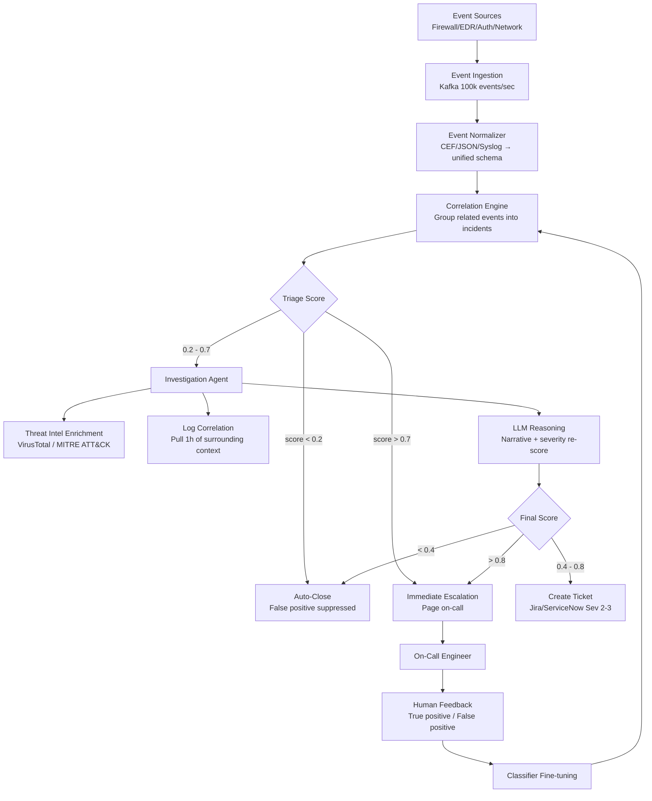
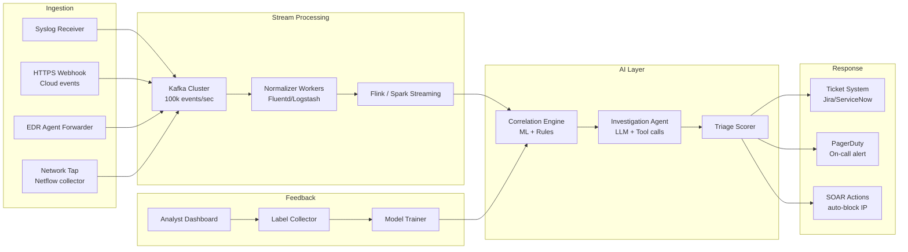
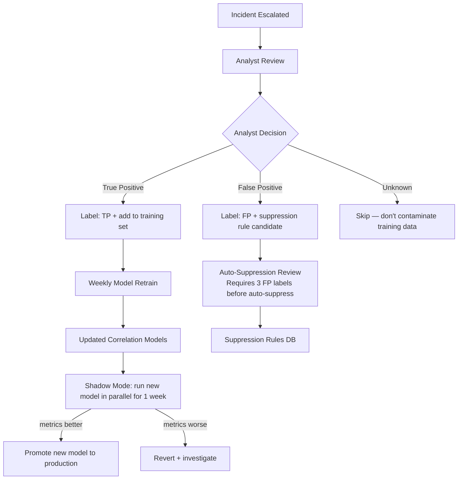

# Design a Security Monitoring Agent — AI-Driven Threat Detection and Triage

**Difficulty**: 🔴 Advanced
**Reading Time**: 35 minutes
**Interview Frequency**: Medium-High — popular in security-focused engineering interviews and principal/staff roles

> **Alert fatigue kills security posture. The real problem isn't detecting threats — it's separating 50 real incidents from 50,000 false positives per day, at machine speed, without missing a single lateral movement campaign.**

---

## Table of Contents

| Section | What You'll Learn |
|---------|-------------------|
| [Mental Model](#mental-model) | Event correlation through escalation pipeline |
| [Requirements](#requirements) | Throughput, accuracy, and latency targets |
| [Architecture](#architecture) | Stream processing with AI investigation layer |
| [Deep Dive: Correlation Engine](#deep-dive-correlation-engine) | Grouping events into actionable incidents |
| [Deep Dive: Investigation Agent](#deep-dive-investigation-agent) | AI-driven log enrichment and reasoning |
| [Deep Dive: False Positive Reduction](#deep-dive-false-positive-reduction) | Feedback loop and classifier improvement |
| [Failure Modes](#failure-modes) | Alert storms, adversarial alerts, false negatives |
| [Interview Q&A](#interview-qa) | How to answer common questions |

---

## Mental Model

Thousands of raw security events arrive every second from firewalls, EDR agents, authentication logs, and network taps. The agent correlates related events into incidents, investigates each incident by querying threat intelligence and pulling additional context, assigns a severity and confidence score, and either auto-closes obvious false positives, opens a ticket for medium-severity items, or immediately pages on-call for critical threats.



---

## Requirements

### Functional Requirements

1. Ingest events from heterogeneous sources: SIEM, EDR, network flows, auth logs, cloud trails
2. Normalize events to a unified schema (Common Event Format compatible)
3. Correlate related events into incidents using rule-based and ML-based correlation
4. Investigate suspicious incidents: enrich with threat intel, pull surrounding log context
5. Score each incident (severity 1-5, confidence 0-1)
6. Escalate: auto-close clear false positives, open tickets for medium, page on-call for critical
7. Learn from human feedback: analyst labels → improve classifier

### Non-Functional Requirements

| Requirement | Target |
|-------------|--------|
| Event ingestion throughput | 100,000 events/second |
| Correlation latency (event to incident) | < 30s P95 |
| Investigation latency (incident to score) | < 120s P95 |
| False positive rate (of escalated incidents) | < 10% |
| False negative rate (missed real threats) | < 1% |
| System availability | 99.99% (4 nines — security cannot go down) |
| Alert fatigue reduction vs rule-only SIEM | > 80% reduction in paged incidents |

### Capacity Estimation

- 100,000 events/second = 6M events/minute = 8.64B events/day
- Storage: events at avg 500 bytes = 4.3TB/day raw, ~500GB after compression
- Correlation window: 15-minute sliding window = 90M events in working memory
- Kafka partitioning: 100 partitions × 1,000 events/sec/partition = 100k/sec throughput

---

## Architecture



---

## Deep Dive: Correlation Engine

### The Correlation Problem

Raw events are atomic observations: "IP 10.1.2.3 scanned port 22 on 10.1.2.100." Alone, this could be an IT admin or an attacker. In context of: "same IP triggered 50 failed SSH logins 5 minutes ago, and 2 minutes ago it accessed a file server" — it's a brute-force followed by lateral movement.

### Three Correlation Methods

**1. Rule-Based Correlation** (fast, low-latency, catches known patterns):
```yaml
rule: brute_force_ssh
conditions:
  - event_type: authentication_failure
  - protocol: SSH
  - count: > 20
  - time_window: 5m
  - same_source_ip: true
severity: 3
confidence: 0.9
```

**2. Session-Based Correlation** (group by entity):
- Maintain a 15-minute rolling session per (source_ip, destination) pair
- Any anomaly within a session elevates all events in that session to the same incident
- Entity resolution: `10.1.2.3` + hostname lookup → `prod-db-01` → `admin user jsmith` → full attribution

**3. ML-Based Behavioral Anomaly** (catches novel patterns):
- Train user and entity behavior baselines (UEBA): typical login time, typical data volume, typical destination IPs
- Anomaly score = distance from baseline (Mahalanobis distance across 20 behavioral features)
- Threshold: anomaly score > 3 standard deviations → feed to investigation agent

### Correlation Window Management

15-minute sliding window across 100k events/sec = 90 million events in memory. Memory constraint forces sampling strategy:
- Keep all events with anomaly score > 0.3 (full fidelity)
- Sample high-volume low-risk events at 1% (firewall permit events from known IPs)
- Never sample: auth events, admin actions, data exfiltration indicators

---

## Deep Dive: Investigation Agent

### LLM-Powered Incident Investigation

When an incident is created, the investigation agent runs autonomously:

```
Step 1: Retrieve the incident's correlated events (last 1h context window)
Step 2: Entity extraction — list all IPs, users, hostnames, file paths involved
Step 3: Threat intel lookup (VirusTotal API for IPs/hashes, MITRE ATT&CK for TTPs)
Step 4: Pull surrounding logs for each entity (auth logs, process creation, network flows)
Step 5: Feed all context to LLM with investigation prompt
Step 6: LLM generates: severity assessment + confidence + narrative + recommended actions
```

**Investigation prompt structure**:
```
You are a senior security analyst. Analyze this security incident:

Incident Events:
  [list of normalized events with timestamps]

Entity Intelligence:
  IP 185.220.101.45: VirusTotal score 8/92, known Tor exit node
  User jsmith: Last login from 192.168.1.10 (normal) — this login from 185.220.101.45 (anomalous)
  File accessed: /etc/shadow — highly sensitive, accessed 2 min after SSH login

MITRE ATT&CK Techniques detected:
  T1110.001 — Brute Force: Password Guessing
  T1003.008 — OS Credential Dumping: /etc/passwd and /etc/shadow

Assess:
1. Is this a true threat or false positive?
2. Severity (1=critical, 5=informational)
3. Confidence (0-1)
4. What happened (narrative for analyst)
5. Recommended immediate actions
```

**Output example**:
```json
{
  "assessment": "true_threat",
  "severity": 1,
  "confidence": 0.95,
  "narrative": "Attacker at Tor exit node 185.220.101.45 successfully brute-forced jsmith's SSH credentials after 47 failed attempts. Following login, /etc/shadow was accessed within 120 seconds — consistent with credential harvesting. High confidence this is active lateral movement.",
  "recommended_actions": [
    "Block 185.220.101.45 at perimeter firewall immediately",
    "Disable jsmith account pending investigation",
    "Check all other servers jsmith has accessed in last 24h",
    "Rotate all root passwords on affected server"
  ]
}
```

---

## Deep Dive: False Positive Reduction

### The Alert Fatigue Problem

A typical rule-based SIEM generates 10,000-50,000 alerts per day for a mid-size company. Security teams can realistically investigate 100-200 alerts per day. The gap creates alert fatigue — analysts start ignoring alerts or rubber-stamping closures.

**Target**: 80% reduction in escalated alerts while maintaining < 1% false negative rate.

### Feedback Loop Architecture



### Suppression Rule Safety

Suppression rules are dangerous: one incorrect rule can suppress real attacks. Safety controls:
- Require 3 independent analyst labels of "false positive" before creating auto-suppression
- All suppression rules have 30-day expiry (must be explicitly renewed)
- Suppression rules cannot cover Severity 1 or 2 events (always investigate)
- Monthly audit: show suppressed event count per rule; rules suppressing > 10k/month require security team review

---

## Failure Modes

### 1. Alert Storm Overwhelming Agent (10k alerts/minute)
**Scenario**: DDoS attack generates 10,000 alerts/min from perimeter firewall; investigation agent falls behind
**Impact**: Real threats buried under DDoS noise; investigation queue depth grows to hours
**Mitigation**:
- Dynamic deduplication: if 1,000+ events share same source IP in 1 minute, collapse to single "DDoS campaign" incident
- Priority queue: Severity 1 incidents always processed first; auto-deprioritize high-volume low-severity bursts
- Circuit breaker: if DDoS traffic from single IP exceeds threshold, auto-block at perimeter AND stop generating individual alerts
- Separate queue for DDoS events with different SLA (15min investigation vs 2min for novel threats)

### 2. Adversarial Alerts Designed to Confuse Classifier
**Scenario**: Attacker deliberately triggers 5,000 low-confidence alerts to cause alert fatigue before launching real attack
**Impact**: SOC team exhausted; real attack classified as false positive
**Mitigation**:
- Never suppress Severity 1 indicators regardless of volume (credential dumping, privilege escalation)
- Novelty detection: sudden 10× increase in alert volume from a specific rule → flag as potential adversarial activity
- Human-in-the-loop for suppression decisions — no auto-suppression of new patterns within 7 days
- Red team exercises: regularly test whether alert flooding successfully hides lateral movement

### 3. False Negative — Real Attack Not Detected
**Scenario**: Novel ransomware uses encrypted C2 channels — no known malware signatures; missed by rule-based detection
**Impact**: Ransomware encrypts backup servers; $10M recovery cost
**Mitigation**:
- Behavioral anomaly detection as second layer — unusual encryption activity at high rate triggers anomaly alert even without signature match
- Threat intel feeds: subscribe to real-time IOC feeds (AlienVault OTX, Mandiant) with < 1h lag
- Regular "detection gap" analysis: map incidents from threat intelligence reports against what our rules would have caught
- Canary tokens: synthetic sensitive files that should never be accessed — any access → immediate Severity 1

### 4. LLM Hallucination in Investigation Narrative
**Scenario**: LLM generates investigation narrative stating "attacker used CVE-2024-1234" when no such evidence exists in logs
**Impact**: Analyst wastes 2 hours investigating wrong CVE; real attack vector missed
**Mitigation**:
- Constrained generation: LLM must cite specific log entries for every claim ("Brute force detected: see events 1-47 in this incident")
- Separate factual claims from inference: "Evidence: 47 failed logins. Analysis: consistent with brute force. Confidence: high."
- Analyst validation UI: every claim in the narrative is hyperlinked to the source log entry

---

## Interview Q&A

### "How do you ensure 99.99% availability for a security monitoring system?"

> "Security monitoring is non-negotiable for uptime. At 99.99%, we have < 53 minutes of downtime per year. I'd design for this with: (1) Active-active multi-region deployment — events replicated to two regions via Kafka MirrorMaker; if one region fails, events continue flowing to the other within seconds. (2) Kafka as the durable buffer — even if processing falls behind, events aren't lost; the consumer can catch up when processing recovers. (3) The investigation agent is stateless — it reads from Kafka and writes to a durable state store; any worker can be restarted without losing work. (4) On-call automation: if investigation queue depth > 10,000 (90th percentile spike), auto-scale workers rather than waiting for human intervention. (5) Chaos engineering: monthly game days where we kill regions and verify monitoring continues."

### "How do you handle tuning the false positive threshold when you're just starting out?"

> "With a new deployment, you don't have labeled data to tune the ML threshold, so you start conservative — use only high-confidence rule-based detection for initial escalation. The ML model runs in shadow mode (scores incidents but doesn't escalate) for the first 4 weeks while analysts review all rule-based escalations and provide labels. After 1,000 labeled incidents (achievable in 4 weeks for a mid-size org), you have enough data to calibrate the ML threshold. Start with a threshold that maintains < 5% FPR even if it means some false positives — you can tighten it after building analyst trust. Never jump straight to aggressive suppression without a calibration period."

---

## Key Takeaways

| Number | What It Means |
|--------|--------------|
| **100,000 events/sec** | Ingestion throughput target — Kafka with 100 partitions handles this |
| **80% reduction** | Alert fatigue reduction goal vs rule-only SIEM |
| **< 1% false negative** | Real threats missed — the cost of a miss is enormous; err on FP side |
| **3 FP labels** | Required before auto-suppression — prevents adversarial rule injection |
| **30-day expiry** | On all suppression rules — forces periodic review of what's being silenced |
| **15-min correlation window** | Sufficient for most lateral movement patterns; longer windows cost too much memory |

---

## 📚 Resources & References

| Resource | Type | What You'll Learn |
|----------|------|------------------|
| [Elastic SIEM: Machine Learning for Security](https://www.elastic.co/guide/en/security/current/machine-learning.html) | 📚 Docs | Production ML-based anomaly detection in SIEM |
| [MITRE ATT&CK Framework](https://attack.mitre.org/) | 📚 Docs | Adversary tactics and techniques — foundation for detection rules |
| [Microsoft Sentinel AI-Powered SIEM Blog](https://techcommunity.microsoft.com/category/microsoftsentinel) | 📖 Blog | How Microsoft uses LLMs for automated threat investigation |
| [Crowdstrike AI/ML Detection Engineering](https://www.crowdstrike.com/blog/ai-machine-learning-detection/) | 📖 Blog | Real-world ML approaches to endpoint threat detection |
| [AI Explained — AI Security Systems](https://www.youtube.com/@AIExplained-official) | 📺 YouTube | Conceptual overview of AI in cybersecurity |
| [Andrej Karpathy — Neural Net Intuition](https://www.youtube.com/@AndrejKarpathy) | 📺 YouTube | Understanding the ML models underlying anomaly detection |
