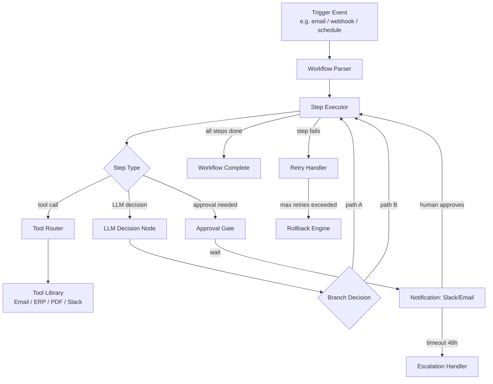
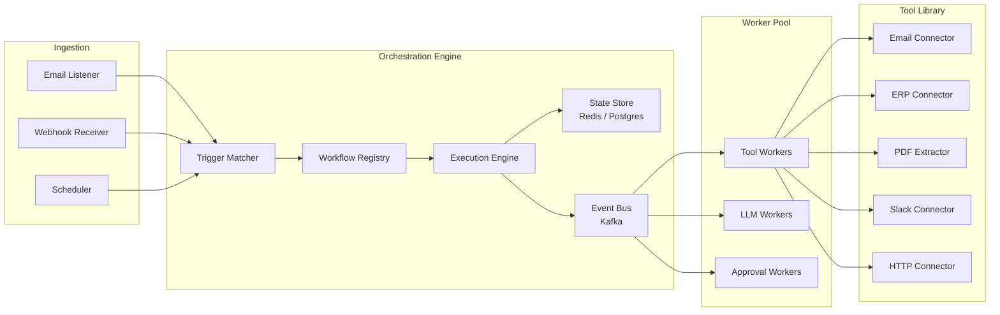
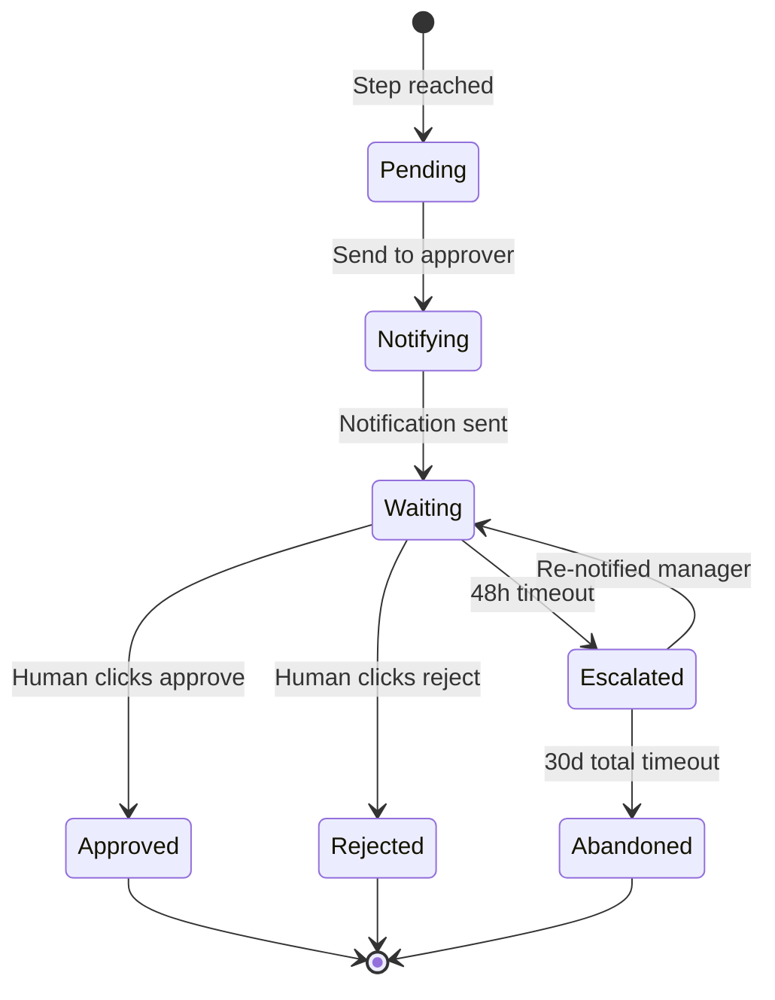
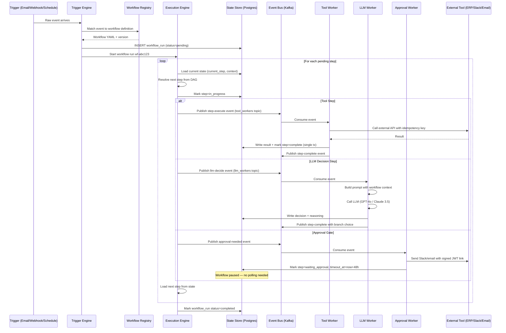
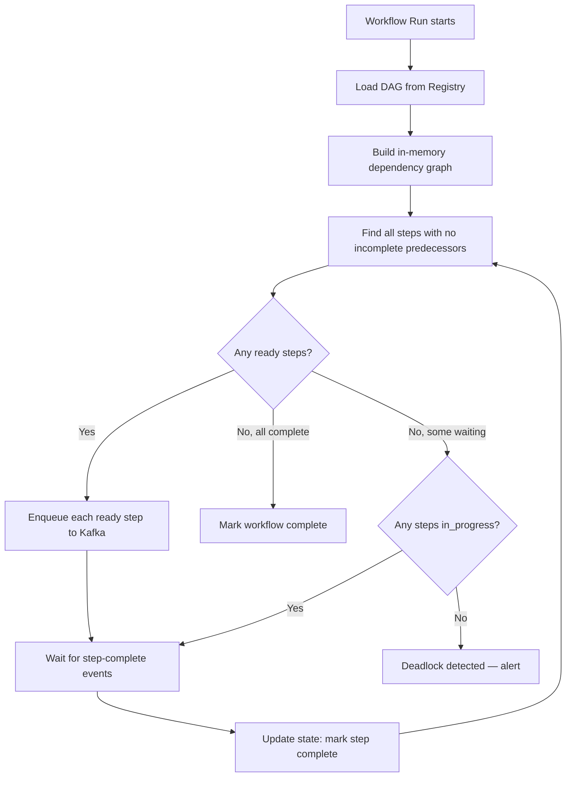

# Design a Workflow Automation Agent — Event-Driven Business Process Orchestration

**Difficulty**: 🟡 Intermediate
**Reading Time**: 25 minutes
**Interview Frequency**: Medium — popular in enterprise AI and intelligent automation interviews

> **The critical insight: workflow automation agents fail not on the happy path but on the exception path — a tool timeout at step 7 of 12 that requires rollback of steps 1-6 while notifying the right humans.**

---

## Table of Contents

| Section | What You'll Learn |
|---------|-------------------|
| [Mental Model](#mental-model) | DAG-based workflow execution with AI decision points |
| [Requirements](#requirements) | Scale targets and reliability constraints |
| [Architecture](#architecture) | Component breakdown with event-driven design |
| [Deep Dive: Workflow DAG](#deep-dive-workflow-dag) | YAML workflow definition and execution engine |
| [Deep Dive: Human Approval Gates](#deep-dive-human-approval-gates) | Pause/resume and dead workflow prevention |
| [Deep Dive: Retry and Rollback](#deep-dive-retry-and-rollback) | Compensating transactions at workflow level |
| [Failure Modes](#failure-modes) | Loop detection, timeouts, orphaned workflows |
| [Interview Q&A](#interview-qa) | How to answer common questions |

---

## Mental Model

A workflow automation agent replaces manual multi-step business processes. "Process all invoices received today, extract line items, update the ERP, and notify approvers for anything over $10,000" becomes a durable, observable, retryable execution — triggered by an event, stepped through by the agent, paused for human input when needed.



---

## Requirements

### Functional Requirements

1. Define workflows as YAML DAGs with steps, conditions, and tool calls
2. Execute multi-step workflows triggered by events (email, webhook, schedule, file upload)
3. Support tool library: email read/send, ERP API, PDF extraction, Slack notify, HTTP calls
4. LLM decision nodes for content understanding (classify invoice → route to correct approver)
5. Human approval gates: pause workflow, notify via Slack/email, resume on response
6. Retry failed steps with configurable backoff
7. Rollback completed steps when a downstream step fails irrecoverably

### Non-Functional Requirements

| Requirement | Target |
|-------------|--------|
| Workflow step execution latency | < 2s for tool calls, < 10s for LLM nodes |
| Workflow state persistence | Survives agent restart — durable execution |
| Max workflow duration | 30 days (approval gate can wait up to 30d) |
| Concurrent active workflows | 10,000 simultaneous |
| Step retry budget | 3 retries with exponential backoff (1s, 4s, 16s) |
| Dead workflow detection | Any workflow idle > 48h without expected pause → alert |
| Audit log retention | 7 years (regulatory requirement for finance workflows) |

### Capacity Estimation

- 10,000 concurrent workflows × avg 12 steps each = 120,000 pending step executions
- Steps complete in ~2s avg → throughput needed: ~1,000 step executions/second
- Tool call rate: 1,000/s across ERP/email/Slack integrations → needs connection pooling

---

## Architecture



### Key Design: Durable Execution

Workflow state is persisted after every step completion. If the agent process crashes mid-workflow at step 7, on restart it loads state from `G[State Store]` and resumes from step 8. This is the **sagas pattern** applied to AI workflows.

```
Workflow State Schema:
{
  workflow_id: "wf-abc123",
  definition_id: "invoice-processing-v3",
  trigger: { type: "email", message_id: "msg-456" },
  status: "running",
  current_step: 7,
  completed_steps: [
    { step_id: 1, tool: "email_read", result: {...}, completed_at: "..." },
    ...
  ],
  context: { invoice_amount: 15000, vendor: "Acme Corp" },
  created_at: "...",
  last_active_at: "..."
}
```

---

## Deep Dive: Workflow DAG

### YAML Workflow Definition

```yaml
name: invoice-processing
version: 3
trigger:
  type: email
  filter:
    subject_contains: "Invoice"
    from_domain: "*.vendor.com"

steps:
  - id: extract_invoice
    tool: pdf_extractor
    input:
      attachment: "{{ trigger.attachment }}"
    output: invoice_data

  - id: classify_invoice
    type: llm_decision
    prompt: |
      Classify this invoice by department:
      Amount: {{ invoice_data.total_amount }}
      Line items: {{ invoice_data.line_items }}
      Choose one: [engineering, marketing, finance, operations]
    output: department

  - id: check_approval_required
    type: condition
    condition: "{{ invoice_data.total_amount }} > 10000"
    if_true: request_approval
    if_false: auto_approve

  - id: request_approval
    type: approval_gate
    notify:
      channel: slack
      recipient: "{{ department }}-approver"
      message: "Invoice from {{ invoice_data.vendor }} for ${{ invoice_data.total_amount }} needs approval"
    timeout_hours: 48
    on_timeout: escalate_to_manager

  - id: update_erp
    tool: erp_api
    input:
      endpoint: /invoices
      method: POST
      body: "{{ invoice_data }}"
    retry:
      max_attempts: 3
      backoff: exponential
    rollback:
      tool: erp_api
      endpoint: /invoices/{{ erp_result.id }}
      method: DELETE

  - id: notify_finance
    tool: slack_notify
    input:
      channel: "#finance-ops"
      message: "Invoice {{ invoice_data.id }} processed and added to ERP"
```

### LLM Decision Nodes

Decision nodes use the LLM to interpret unstructured content and route the workflow. Key design rules:

1. **Always enumerate output options** — "choose one: [A, B, C]" prevents hallucinated branch names
2. **Include confidence threshold** — if LLM returns confidence < 0.8, route to human review step
3. **Cache decisions** — same invoice from same vendor likely gets same classification; cache with TTL 24h
4. **Log reasoning** — store LLM's chain-of-thought in audit log for compliance

---

## Deep Dive: Human Approval Gates

### Gate State Machine



### Preventing Dead Workflows

**Problem**: Approver leaves company; workflow waits forever.

**Solution — three-layer timeout**:
1. **Primary timeout** (48h): notify original approver's manager
2. **Secondary timeout** (7 days from escalation): notify department head
3. **Terminal timeout** (30 days total): auto-abandon workflow, notify workflow owner, create Jira ticket

**Approval link security**:
- Each approval link contains a signed JWT (expires after gate timeout)
- JWT includes: workflow_id, step_id, approver_email, action (approve/reject)
- One-time use: after first click, token is invalidated to prevent double-approval

---

## Deep Dive: Retry and Rollback

### Compensating Transactions

When step N fails after M steps have succeeded, the rollback engine executes compensating actions in reverse order:

```
Forward execution:    Step 1 → Step 2 → Step 3 → Step 4 (FAIL)
Rollback execution:   Step 3_rollback → Step 2_rollback → Step 1_rollback
```

Not all steps are rollbackable:
- **Rollbackable**: ERP POST → DELETE, file upload → delete, calendar booking → cancel
- **Not rollbackable**: Sent emails, Slack messages, SMS notifications (idempotency note appended)
- **Best-effort**: External API calls where rollback depends on third-party support

For non-rollbackable steps, the system logs a "compensation required" record and notifies a human operator: "Invoice processing workflow failed at step 4. Steps 1-3 completed and cannot be undone. Manual intervention required."

### Idempotency Keys

Every tool call generates an idempotency key: `{workflow_id}:{step_id}:{attempt_number}`. The Tool Library uses this key to prevent duplicate actions on retry:

```
ERP API call: POST /invoices
Headers:
  Idempotency-Key: wf-abc123:step-5:attempt-2

If ERP already received attempt-1 with same key: return 200 with cached result
If ERP not seen key yet: execute and store result against key for 24h
```

---

## Failure Modes

### 1. Infinite Loop in Conditional Branches
**Scenario**: Step 3 branches to Step 5, Step 5 branches back to Step 3
**Impact**: Workflow runs forever, consuming quota and generating duplicate tool calls
**Mitigation**:
- Static analysis at workflow load time: detect cycles in DAG using DFS
- Runtime guard: if same step_id executed > 10 times in a workflow, halt with "cycle detected" error
- Reject workflow YAML upload if static analysis finds a cycle

### 2. Tool Timeout Blocking Whole Workflow
**Scenario**: ERP API is slow; step times out at 30s; 1,000 workflows pile up
**Impact**: All workflows depending on ERP stall; cascading queue backup
**Mitigation**:
- Each tool call is async: step submits call to Tool Workers via Kafka, doesn't block Execution Engine
- Tool-level circuit breaker: if ERP returns 5xx on > 50% of calls in 60s, open circuit — all ERP steps get immediate "circuit open" error with human notification
- Tool timeout budget per step: configurable in YAML (default 30s, max 300s for slow APIs)

### 3. Approval Gate Never Fulfilled (Dead Workflows)
**Scenario**: Approver on vacation; escalation email goes to wrong manager; 30-day timeout hits
**Impact**: Invoice never processed; vendor payment delayed; potential late fees
**Mitigation**:
- Out-of-office detection: integrate with calendar API; if approver OOO, immediately escalate
- Approval dashboard: show all pending approvals sorted by age; highlight > 24h items in red
- Weekly digest to workflow owners: "You have 12 workflows awaiting approval, oldest: 5 days"

### 4. Workflow State Corruption on Crash
**Scenario**: Agent crashes mid-step between writing result to state store and marking step complete
**Impact**: Step runs twice on restart (double ERP insert, duplicate Slack message)
**Mitigation**:
- Two-phase state update: write result → mark step complete in single DB transaction
- Idempotency keys on all tool calls prevent duplicate effects even if step re-runs
- Step completion is idempotent: marking an already-complete step as complete is a no-op

---

## Interview Q&A

### "How do you handle a workflow that depends on an external API that's down?"

> "Circuit breaker at the tool level. We track error rate per tool over a 60-second sliding window. If ERP errors > 50%, we open the circuit — new ERP calls immediately return a 'service unavailable' error without trying. This prevents queue buildup and cascading timeouts. The workflow step is marked as failed with reason 'circuit open.' We then have two options based on the step's configuration: (1) park the workflow in a 'waiting' state and retry automatically when the circuit closes, or (2) notify a human operator immediately. Most financial workflows choose option 2 since SLA timelines can't be paused arbitrarily."

### "How would you handle GDPR compliance for workflows processing EU customer data?"

> "Several layers: (1) Data minimization — only extract and pass the specific fields needed for each tool call, not entire records. (2) Audit log encryption — workflow state containing personal data is encrypted at rest with customer-managed keys. (3) Right to erasure — when a GDPR deletion request arrives, we have a workflow-scrubber job that redacts personal data from completed workflow state while preserving structural audit logs. (4) Data residency — EU customers' workflows run on EU-region workers only, enforced by a routing tag on each workflow. (5) Retention — workflow state with personal data auto-deleted after 90 days unless overridden by a longer legal hold."

---

## Key Takeaways

| Number | What It Means |
|--------|--------------|
| **Durable execution** | Persist state after every step — agent restart ≠ workflow restart |
| **10 iterations max** | Runtime cycle guard on any step — prevents infinite loops |
| **3 retry attempts** | Exponential backoff (1s, 4s, 16s) before escalating to rollback |
| **48h approval timeout** | Primary gate; 3-layer escalation prevents orphaned workflows |
| **Idempotency keys** | Every tool call tagged — safe to retry without duplicate side effects |
| **Circuit breaker** | 50% error rate in 60s → open circuit — prevents cascading tool timeouts |

---

## Agent Architecture

The workflow automation agent processes requests through a multi-stage loop that combines deterministic execution (tool calls with known inputs/outputs) with non-deterministic reasoning (LLM decision nodes). Understanding this end-to-end loop is essential for designing a system that can resume after crashes, detect stuck states, and enforce cost budgets.



The key insight here is **event-driven asynchrony**: the Execution Engine never blocks waiting for a tool call result. It publishes an event to Kafka, and the result is written back to the State Store by the worker. A separate heartbeat process checks for in-progress steps older than their timeout budget and marks them as timed_out for retry logic to handle.

---

## Tool/Function Registry

The tool registry is the agent's interface to the external world. Each registered tool has a schema defining its inputs, outputs, timeout, and rollback specification. Tool selection is deterministic — the workflow YAML specifies which tool to call at each step. There is no free-form tool selection by the LLM except inside LLM decision nodes where the LLM may optionally invoke tools to gather context before making a routing decision.

### Tool Registration Schema

```json
{
  "tool_id": "erp_api",
  "display_name": "ERP REST Connector",
  "version": "2.1.0",
  "category": "integration",
  "timeout_ms": 30000,
  "max_retries": 3,
  "circuit_breaker": {
    "error_rate_threshold": 0.5,
    "window_seconds": 60,
    "half_open_probe_interval_seconds": 30
  },
  "input_schema": {
    "endpoint": "string",
    "method": "GET|POST|PUT|DELETE",
    "body": "object|null",
    "headers": "object"
  },
  "output_schema": {
    "status_code": "integer",
    "body": "object",
    "latency_ms": "integer"
  },
  "rollback": {
    "strategy": "DELETE",
    "endpoint_template": "/invoices/{{ result.body.id }}"
  },
  "idempotency": {
    "key_template": "{{ workflow_id }}:{{ step_id }}:{{ attempt }}",
    "ttl_seconds": 86400
  }
}
```

### Error Handling When Tools Fail

Tools fail in predictable categories, each with a different response strategy:

| Failure Type | HTTP Status | Action | Workflow Impact |
|---|---|---|---|
| Transient network error | 502, 503, 504 | Exponential backoff retry | Retry up to 3 times, then escalate |
| Rate limit | 429 | Retry-After header delay | Pause step, resume after delay |
| Client error | 400, 422 | No retry — invalid input | Fail step immediately, notify human |
| Auth failure | 401, 403 | Refresh token, retry once | If still fails, notify ops team |
| Circuit open | N/A (local) | No call made | Park workflow in waiting state |
| Timeout (> 30s) | N/A (local) | Count as failure attempt | Apply normal retry logic |

The circuit breaker state per tool is stored in Redis with a 60-second sliding window. This state is shared across all worker instances — a circuit opened by worker-1 prevents worker-2 from also hammering the failing tool.

---

## Prompt Engineering

### System Prompt Structure

LLM decision nodes use a three-tier context structure that keeps prompts focused while giving the model enough grounding to make correct decisions.

```
SYSTEM PROMPT (static, cached):
You are a workflow routing assistant for [Company Name]'s invoice processing system.
Your job is to analyze provided data and select exactly one option from a given list.
Rules:
1. Always respond with a valid JSON object.
2. Your "choice" field must be exactly one value from the provided options list.
3. Include a "confidence" score (0.0-1.0) and a "reasoning" field (max 100 words).
4. If confidence < 0.8, set "choice" to "human_review".
Output schema: {"choice": "string", "confidence": float, "reasoning": "string"}

CONTEXT BLOCK (per workflow run, cached per workflow):
Workflow: invoice-processing-v3
Company context: [Company Name] processes invoices for 4 departments.
Routing rules: Engineering > $50k requires VP approval. Marketing > $10k requires Director.

QUERY (per step execution):
Classify this invoice for department routing:
Vendor: Acme Corp
Amount: $15,000
Line items: [Cloud infrastructure services, Support contract]
Options: [engineering, marketing, finance, operations, human_review]
```

### Context Management

The workflow context object grows as steps complete — early steps produce outputs that later steps reference via template variables like `{{ invoice_data.vendor }}`. This context is passed to LLM nodes selectively. A context projector extracts only the fields referenced in the prompt template, preventing token bloat from passing the full 10KB workflow state to a model that needs 3 fields.

Context size limits by model tier:
- GPT-4o-mini: 8K context budget per decision node call
- Claude Haiku 3.5: 16K context budget
- GPT-4o / Claude Sonnet 3.7: 32K context budget (reserved for complex multi-document decisions)

### Instruction Hierarchy

The system uses a three-level instruction hierarchy to prevent prompt injection attacks where a malicious vendor might embed instructions in an invoice PDF:

1. **System-level rules** (highest priority, cannot be overridden): tool call format, output schema, safety constraints
2. **Workflow-level context** (medium priority): routing rules, company-specific logic
3. **Data-derived content** (lowest priority, treated as untrusted): extracted text from PDFs, email bodies, API responses

Content from untrusted sources is always enclosed in XML tags like `<untrusted_data>...</untrusted_data>` so the model and the output validator can distinguish between instructions and data.

---

## Failure Modes

### Hallucination: When It Happens and How to Mitigate

LLM decision nodes hallucinate in three common scenarios in workflow agents:

**Scenario 1 — Branch name hallucination**: The LLM invents a department name not in the options list (e.g., outputs `"legal"` when options are `[engineering, marketing, finance, operations]`). Mitigation: strict output validation with JSON schema; if `choice` is not in the options list, the step fails with error type `invalid_llm_output` and is retried with a more explicit prompt that lists each valid option on a separate line.

**Scenario 2 — Confidence inflation**: The LLM returns `confidence: 0.95` for ambiguous cases. Mitigation: calibration with held-out test cases for each workflow type. Weekly job samples 1% of decisions where LLM confidence > 0.9 and routes them to human review for validation. If accuracy drops below 90%, alert fires to review prompt.

**Scenario 3 — Context contamination**: Long workflows accumulate context from many steps; the LLM uses context from step 2 to affect a decision at step 9 that should only use step 8's output. Mitigation: context projector (described above) limits the context passed to each LLM node to only its declared `input_context` fields.

### Loop Detection

Static loop detection runs when a workflow YAML is uploaded:

```python
def detect_cycles(steps: list[Step]) -> list[str]:
    """DFS on DAG to find cycles. Returns list of cycle paths."""
    graph = build_adjacency_list(steps)  # step_id -> [next_step_ids]
    visited = set()
    rec_stack = set()
    cycles = []

    def dfs(node, path):
        visited.add(node)
        rec_stack.add(node)
        for neighbor in graph.get(node, []):
            if neighbor not in visited:
                dfs(neighbor, path + [neighbor])
            elif neighbor in rec_stack:
                cycles.append(path + [neighbor])
        rec_stack.remove(node)

    for start in graph:
        if start not in visited:
            dfs(start, [start])
    return cycles
```

Runtime loop guard: a step execution counter per workflow run tracks how many times each step_id has been executed. If any step reaches 10 executions, the workflow is immediately halted with status `cycle_detected` and the workflow owner is notified with the full execution trace.

### Cost Control

Each LLM call has a measurable token cost. Without controls, a single workflow could consume $50+ in LLM calls if it hits error loops with long prompts.

Token budget per workflow run is configurable in the YAML (default: 50,000 tokens). A token ledger tracks usage per run:

```
Token budget enforcement:
- Before each LLM node: check remaining_budget = budget_limit - tokens_used
- If remaining_budget < estimated_tokens_for_this_call: fail step with BUDGET_EXCEEDED
- On BUDGET_EXCEEDED: route to human review (free fallback path)
- Alert fires to workflow owner when a run exceeds 80% of budget
```

Model selection is cost-tiered: simple classification tasks use GPT-4o-mini ($0.00015/1K input tokens); multi-document analysis uses Claude Sonnet 3.7 ($0.003/1K input tokens). The workflow YAML specifies model tier per LLM step, with a default of `mini` for most routing decisions.

---

## Production Considerations

### Latency Budget

End-to-end workflow latency is dominated by two factors: number of sequential LLM calls and depth of approval gate waits. The latency budget for automated (no human approval) workflows:

| Step Type | P50 Latency | P99 Latency | Notes |
|---|---|---|---|
| Trigger ingestion | 50ms | 200ms | Kafka consumer lag |
| DAG resolution + step dispatch | 10ms | 50ms | In-memory DAG from Redis cache |
| Tool call (ERP/Slack/Email) | 300ms | 2,000ms | External API variance |
| LLM decision node (mini model) | 800ms | 3,000ms | GPT-4o-mini streaming |
| LLM decision node (full model) | 2,500ms | 8,000ms | Claude Sonnet 3.7 |
| State persistence per step | 5ms | 30ms | Postgres write |
| **10-step workflow (no LLM)** | **3s** | **22s** | All tool calls |
| **10-step workflow (3 LLM nodes)** | **7s** | **35s** | Mixed tool + LLM |

Approval gates do not contribute to latency in the worst case (human waits hours or days). The system sets a conservative SLA of 30 minutes for fully automated workflows and excludes approval wait time from SLA calculations.

### Cost Per Query

| Workflow Type | LLM Tokens (avg) | Model | Cost/Run | Monthly (10k runs/day) |
|---|---|---|---|---|
| Simple routing (1 LLM node) | 1,200 tokens | GPT-4o-mini | $0.0004 | $120 |
| Invoice classification (3 LLM nodes) | 4,500 tokens | GPT-4o-mini | $0.0014 | $420 |
| Contract review (1 full-model node) | 15,000 tokens | Claude Sonnet | $0.045 | $13,500 |
| Complex multi-doc analysis (5 nodes) | 40,000 tokens | Claude Sonnet | $0.12 | $36,000 |

Most business workflow automation operates in the "simple routing" or "invoice classification" tier, putting monthly LLM costs well below infrastructure costs at typical enterprise scale.

### SLA Targets and Fallback

Primary SLA: 99.9% of automated workflows complete within 60 minutes.

Fallback to non-AI path: if LLM service unavailability exceeds 30 seconds (detected by the circuit breaker), LLM decision nodes fall back to a rule-based classifier. The rules are compiled from the workflow YAML's `llm_fallback_rules` block:

```yaml
- id: classify_invoice
  type: llm_decision
  prompt: "..."
  llm_fallback_rules:
    - if: "invoice_data.total_amount > 50000"
      then: "engineering"
    - if: "invoice_data.line_items contains 'marketing'"
      then: "marketing"
    - default: "human_review"
```

Rule-based fallback adds zero latency and zero cost. Its accuracy is lower (~70% vs ~94% for LLM), so all fallback-path decisions are queued for human review audit within 24 hours.

---

## Component Deep Dive: Execution Engine

The Execution Engine is the most critical component — it transforms a YAML DAG into a series of durable, ordered, exactly-once step executions. Naive implementations break at scale in three common ways.

**Why a simple for-loop fails**: A synchronous loop over steps blocks on every tool call. With 10,000 concurrent workflows, this requires 10,000 threads — one per workflow. At typical 2MB stack size per thread, that is 20GB just for thread stacks. Modern event-driven runtimes handle concurrency with far fewer threads by treating step execution as a task submitted to a worker pool.

**Why a simple task queue fails**: A dumb task queue (like Celery with Redis backend) doesn't understand DAG dependencies. It can execute step 5 before step 3 completes if step 3 is slow. The execution engine must enforce ordering by only enqueuing a step when all its predecessor steps are in `completed` status in the state store.

### DAG Resolution Algorithm



Steps can be run in parallel when they have no data dependency on each other. The YAML syntax supports this with a `depends_on` field — steps without `depends_on` are parallel candidates. In the invoice workflow example, `notify_finance` and `archive_pdf` could execute in parallel after `update_erp` completes.

### Execution Engine Implementation Options

| Approach | Latency | Throughput | Operational Complexity |
|---|---|---|---|
| In-process DAG (single service) | 5ms step dispatch | ~2,000 workflows/s | Low — one service to operate |
| Temporal workflow engine | 20ms step dispatch | ~5,000 workflows/s | High — requires Temporal cluster |
| Kafka-native (step=Kafka message) | 10ms step dispatch | ~10,000 workflows/s | Medium — requires Kafka expertise |

At 10,000 concurrent workflows and 1,000 steps/second throughput, the in-process DAG approach works until approximately 100,000 concurrent workflows. Above that, the single execution engine becomes a bottleneck and partitioning by workflow_id across multiple engine instances is needed. Temporal's approach — distributing state across its cluster — handles this natively at the cost of operational complexity.

---

## Component Deep Dive: State Store

The state store is the backbone of durable execution. Every step completion, every approval gate transition, and every retry attempt must be persisted durably before the result is considered real. The state store also serves as the coordination layer between the Execution Engine and Workers.

### Scale Behavior at 10x Load

At baseline (10,000 concurrent workflows, 1,000 steps/second):
- Postgres write throughput: ~1,000 row updates/second — comfortably within single Postgres instance limits (~10,000 writes/s with WAL)
- Redis read throughput for circuit breaker state: ~5,000 reads/second — trivial

At 10x load (100,000 concurrent workflows, 10,000 steps/second):
- Postgres write throughput: ~10,000 row updates/second — approaching single-instance limits
- Connection pool exhaustion: 1,000 workers × 10 connections each = 10,000 connections — needs PgBouncer or Postgres connection pooling
- Solution: partition `workflow_runs` and `workflow_steps` tables by `workflow_id` hash across 4 Postgres shards

At 100x load (1,000,000 concurrent workflows):
- Postgres not viable as primary state store
- Switch to CockroachDB or YugabyteDB for horizontally scalable OLTP with Postgres-compatible SQL
- Redis for hot state (in_progress steps) with Postgres as durable backing store

### Two-Phase State Update Protocol

The most critical correctness invariant: step result must be persisted atomically with step status transition. No "write result, then mark complete" as two separate operations — a crash between them causes double execution on restart.

```sql
-- Single transaction: write result AND update status
BEGIN;
  UPDATE workflow_steps
  SET
    status = 'completed',
    result = '{"erp_id": 4521, "created_at": "2026-06-01T10:23:00Z"}'::jsonb,
    completed_at = NOW(),
    attempt_count = attempt_count + 1
  WHERE workflow_run_id = 'wf-abc123'
    AND step_id = 'update_erp'
    AND status = 'in_progress';  -- Optimistic lock: only succeeds once

  -- If above updated 0 rows, another worker completed this step — safe to ignore
  INSERT INTO workflow_events (workflow_run_id, step_id, event_type, payload, created_at)
  VALUES ('wf-abc123', 'update_erp', 'step_completed', '{}', NOW());
COMMIT;
```

The `AND status = 'in_progress'` clause in the UPDATE acts as an optimistic lock. If two workers somehow both pick up the same step (e.g., due to a Kafka re-delivery), only one will succeed in marking it complete — the other will update 0 rows and treat the step as already done.

---

## Component Deep Dive: Workflow Registry

The Workflow Registry stores versioned workflow definitions, validates their structure, and serves them to the Execution Engine on demand. It is the schema layer of the system — a poorly designed registry leads to invalid workflow runs and silent errors at execution time.

### Critical Design Decisions

**Versioned definitions with pinned runs**: When a workflow run is created, it is pinned to a specific version of the workflow definition. This means a YAML update at version 4 does not affect the 500 in-flight runs still executing against version 3. The `workflow_runs.definition_version` column stores the pinned version. Only new triggers use the latest version.

**Schema validation at upload**: When a new YAML is uploaded, the registry runs five validation passes before accepting it:
1. YAML syntax parsing
2. JSON schema validation against the workflow definition schema
3. Template variable resolution check (all `{{ var }}` references must be defined by earlier steps)
4. DAG cycle detection (DFS as described in Failure Modes section)
5. Tool reference validation (all `tool` values must exist in the Tool Registry)

If any pass fails, the upload is rejected with a specific error message pointing to the failing step and field. This prevents invalid workflows from ever reaching production.

**Hot path caching**: The Execution Engine reads the workflow definition for every step it dispatches. With 10,000 concurrent workflows, that could be 10,000 definition fetches per second. The registry serves definitions from an in-memory LRU cache keyed by `(definition_id, version)`. Cache TTL is 5 minutes with cache invalidation on new version upload. At 50KB average definition size and 100 unique workflows, the cache uses ~5MB — negligible.

---

## Data Model

```sql
-- Workflow definitions (versioned YAML definitions)
CREATE TABLE workflow_definitions (
    definition_id     UUID PRIMARY KEY DEFAULT gen_random_uuid(),
    name              VARCHAR(100) NOT NULL,
    version           INTEGER NOT NULL,
    yaml_content      TEXT NOT NULL,
    compiled_dag      JSONB NOT NULL,        -- Pre-parsed adjacency list
    tool_dependencies JSONB NOT NULL,        -- ["erp_api", "slack_notify", ...]
    status            VARCHAR(20) DEFAULT 'active',  -- active | deprecated | draft
    created_by        VARCHAR(100) NOT NULL,
    created_at        TIMESTAMPTZ DEFAULT NOW(),
    UNIQUE (name, version)
);

-- Active workflow runs
CREATE TABLE workflow_runs (
    run_id              UUID PRIMARY KEY DEFAULT gen_random_uuid(),
    definition_id       UUID NOT NULL REFERENCES workflow_definitions(definition_id),
    definition_version  INTEGER NOT NULL,
    trigger_type        VARCHAR(50) NOT NULL,   -- email | webhook | schedule | manual
    trigger_payload     JSONB NOT NULL,          -- Original trigger event
    status              VARCHAR(30) NOT NULL DEFAULT 'pending',
    -- pending | running | waiting_approval | completed | failed | rolled_back | abandoned
    context             JSONB NOT NULL DEFAULT '{}',  -- Accumulated step outputs
    token_budget        INTEGER NOT NULL DEFAULT 50000,
    tokens_used         INTEGER NOT NULL DEFAULT 0,
    started_at          TIMESTAMPTZ,
    completed_at        TIMESTAMPTZ,
    last_active_at      TIMESTAMPTZ DEFAULT NOW(),
    owner_email         VARCHAR(200),
    tenant_id           UUID NOT NULL,           -- Multi-tenant isolation
    created_at          TIMESTAMPTZ DEFAULT NOW()
);

-- Step execution records
CREATE TABLE workflow_steps (
    step_pk             BIGSERIAL PRIMARY KEY,
    run_id              UUID NOT NULL REFERENCES workflow_runs(run_id),
    step_id             VARCHAR(100) NOT NULL,   -- Matches YAML step id
    step_type           VARCHAR(30) NOT NULL,    -- tool | llm_decision | approval_gate | condition
    tool_id             VARCHAR(100),            -- NULL for non-tool steps
    status              VARCHAR(30) NOT NULL DEFAULT 'pending',
    -- pending | in_progress | completed | failed | retrying | rolled_back | waiting_approval
    attempt_count       INTEGER NOT NULL DEFAULT 0,
    input_payload       JSONB,
    result              JSONB,
    llm_reasoning       TEXT,                    -- For audit: LLM chain-of-thought
    llm_model           VARCHAR(100),            -- Which model was used
    llm_tokens_used     INTEGER,
    idempotency_key     VARCHAR(200),            -- workflow_id:step_id:attempt
    error_code          VARCHAR(100),
    error_message       TEXT,
    started_at          TIMESTAMPTZ,
    completed_at        TIMESTAMPTZ,
    UNIQUE (run_id, step_id)
);

-- Approval gate records
CREATE TABLE approval_gates (
    gate_id             UUID PRIMARY KEY DEFAULT gen_random_uuid(),
    run_id              UUID NOT NULL REFERENCES workflow_runs(run_id),
    step_id             VARCHAR(100) NOT NULL,
    approver_email      VARCHAR(200) NOT NULL,
    approver_channel    VARCHAR(50) NOT NULL,    -- slack | email | teams
    notification_sent_at TIMESTAMPTZ,
    jwt_token           TEXT NOT NULL,           -- Signed token for approve/reject link
    jwt_expires_at      TIMESTAMPTZ NOT NULL,
    decision            VARCHAR(20),             -- approved | rejected | expired
    decision_by         VARCHAR(200),
    decision_at         TIMESTAMPTZ,
    escalation_level    INTEGER NOT NULL DEFAULT 0,  -- 0=primary, 1=manager, 2=dept_head
    primary_timeout_at  TIMESTAMPTZ NOT NULL,
    terminal_timeout_at TIMESTAMPTZ NOT NULL
);

-- Circuit breaker state (also kept in Redis for hot path)
CREATE TABLE tool_circuit_breakers (
    tool_id             VARCHAR(100) PRIMARY KEY,
    state               VARCHAR(20) NOT NULL DEFAULT 'closed',  -- closed | open | half_open
    error_count         INTEGER NOT NULL DEFAULT 0,
    total_count         INTEGER NOT NULL DEFAULT 0,
    last_error_at       TIMESTAMPTZ,
    opened_at           TIMESTAMPTZ,
    next_probe_at       TIMESTAMPTZ,
    updated_at          TIMESTAMPTZ DEFAULT NOW()
);

-- Audit log (immutable, long-retention)
CREATE TABLE workflow_audit_log (
    log_id              BIGSERIAL PRIMARY KEY,
    run_id              UUID NOT NULL,
    step_id             VARCHAR(100),
    event_type          VARCHAR(100) NOT NULL,
    actor               VARCHAR(200),            -- system | human email
    payload             JSONB,
    tenant_id           UUID NOT NULL,
    created_at          TIMESTAMPTZ DEFAULT NOW()
);

-- Indexes for common query patterns
CREATE INDEX idx_runs_status_tenant ON workflow_runs(tenant_id, status)
    WHERE status NOT IN ('completed', 'abandoned');
CREATE INDEX idx_runs_last_active ON workflow_runs(last_active_at)
    WHERE status = 'running';                    -- Dead workflow detection
CREATE INDEX idx_steps_run ON workflow_steps(run_id, status);
CREATE INDEX idx_approval_timeout ON approval_gates(primary_timeout_at)
    WHERE decision IS NULL;                      -- Find gates needing escalation
CREATE INDEX idx_audit_run ON workflow_audit_log(run_id, created_at);
```

---

## Scale Bottlenecks

| Traffic Level | Component That Breaks | Symptoms | Mitigation |
|---|---|---|---|
| 10x baseline (100k concurrent workflows) | Postgres write throughput | Step completion latency rises from 5ms to 200ms; workflow step queue backs up | Add PgBouncer connection pooling; partition `workflow_steps` by `run_id` hash mod 4 |
| 10x baseline (100k concurrent workflows) | Kafka partition saturation | Consumer lag grows; step execution delays increase linearly | Increase `tool_workers` topic partitions from 16 to 128; add worker instances |
| 10x baseline | LLM API rate limits | LLM worker returns 429s; LLM steps queue up; workflows stall | Implement token bucket per model tier; fallback to rule-based classifier when rate limited |
| 100x baseline (1M concurrent workflows) | Execution Engine single-process DAG | Dispatch latency grows; single engine cannot evaluate 100k DAGs/second | Partition execution engine by `tenant_id % N`; N=16 horizontal instances |
| 100x baseline | State store read amplification | Context JSONB reads for large workflows (many completed steps) slow down | Separate hot context (in Redis) from cold history (Postgres); only load steps needed for current decision |
| 100x baseline | Tool worker saturation for ERP | ERP connector becomes single external bottleneck | Per-tenant ERP connection pools; queue-ahead scheduling to spread ERP calls in time |
| 1000x baseline (10M concurrent workflows) | Postgres storage | `workflow_steps` table grows to 10TB+ annually | Partition by month + archive completed rows to S3/Parquet after 90 days; keep Postgres hot for last 90 days only |
| 1000x baseline | Approval gate notification storms | 10M pending approval emails/Slacks per day overwhelm notification services | Batch notifications into digests; deduplicate same-approver gates; rate limit per approver |

---

## How Zapier Built This

Zapier is the canonical example of workflow automation at scale, and their engineering blog post "Automating Billions of Tasks" (2021) reveals the specific architectural decisions they made.

**Scale**: Zapier processes over 20 billion tasks per month (~7,700 tasks/second average, with peaks exceeding 100,000 tasks/second during high-traffic events). Their "Zaps" are equivalent to the workflow definitions in this system.

**Technology choices**: Zapier runs on Python/Django with Celery as the task queue, backed by Redis and RabbitMQ. Their task workers are horizontally scaled on AWS Auto Scaling Groups. At the time of the blog post, they had deployed several hundred worker instances. They use PostgreSQL for workflow state, with aggressive read replicas for the dashboard queries that show users their Zap execution history.

**The non-obvious architectural decision**: Zapier segregates tasks by "tier" based on the user's plan. Free-tier tasks share worker pools, while paid-tier tasks run on dedicated worker pools. This prevents noisy-neighbor problems where one free user running a viral Zap (e.g., triggered by every Reddit comment on a popular post) would slow down paying customers' critical business automations. This is enforced at the Celery queue level — different queues, different worker pools, different autoscaling policies.

**Specific numbers from their blog**: They handle 20 billion tasks/month. Their largest customers run Zaps that execute thousands of tasks per hour from a single trigger. Storage for task execution history is their single largest operational cost — they retain 15 minutes of history for free plans and 90 days for paid plans, using tiered storage to manage costs.

**What they learned about reliability**: Their biggest reliability lesson was that external API failures (like Salesforce or Gmail being slow) caused queue backup in their monolithic Celery setup. Their fix — similar to the circuit breaker pattern described in this system — was to add per-integration worker pools, so a slow Gmail integration wouldn't starve a Salesforce integration running on the same workers.

Source: [Zapier Engineering: Automating Billions of Tasks](https://zapier.com/engineering/automating-billions-of-tasks/)

---

## Interview Angle

**What the interviewer is testing**: Can you design a system that is durable (survives failures mid-workflow), correct (no duplicate side effects on retry), and scalable (handles 10,000-1,000,000 concurrent long-running workflows)? This question combines distributed systems knowledge (sagas, idempotency, circuit breakers) with AI-specific challenges (LLM latency, cost, hallucination).

**Common mistakes candidates make**:

1. **Designing a synchronous execution model**: Describing a system where the orchestrator calls tool A, waits for response, then calls tool B, then waits — this collapses under load. A 30-second ERP API call would block the thread. Always describe async event-driven execution where step dispatch and step completion are decoupled via a message queue.

2. **Forgetting idempotency on retries**: Saying "if step 5 fails, retry it" without explaining how you prevent double ERP inserts or double Slack messages. Every interviewer at a company that has experienced a billing duplicate will immediately ask "what happens if the ERP accepted the request but the acknowledgment was lost?" Answer: idempotency keys with TTL stored on the external service.

3. **Treating approval gates as polling**: Designing a polling loop that checks every 60 seconds whether an approval has been received. This wastes database reads and adds latency. The correct design is event-driven: the approval link click posts to a webhook, which publishes a `gate_approved` event to Kafka, which wakes the parked workflow.

**The insight that separates good from great answers**: The workflow execution engine is essentially a distributed state machine where transitions must be atomic. The best candidates recognize that the state store, not the execution engine, is the source of truth — the engine is stateless and can be restarted or scaled horizontally at any time because all durable state lives in Postgres. This leads naturally to the correct two-phase update pattern and explains why optimistic locking (`AND status = 'in_progress'`) prevents double-execution on Kafka message redelivery.

---

## Key Numbers to Remember

| Metric | Value | Context |
|---|---|---|
| Step execution throughput | 1,000 steps/second | Baseline for 10,000 concurrent workflows × 12 steps avg |
| LLM decision node latency P50 | 800ms (mini), 2,500ms (full) | GPT-4o-mini vs Claude Sonnet 3.7 |
| LLM decision node latency P99 | 3,000ms (mini), 8,000ms (full) | Tail latency drives SLA planning |
| Approval gate primary timeout | 48 hours | Before escalating to manager |
| Terminal workflow timeout | 30 days | Maximum wait for any approval chain |
| Retry budget per step | 3 attempts | Backoff: 1s, 4s, 16s |
| Circuit breaker threshold | 50% error rate in 60s | Opens circuit, parks dependent workflows |
| Loop detection guard | 10 executions per step | Runtime safety valve beyond static DFS analysis |
| Token budget default | 50,000 tokens/workflow run | Prevents runaway LLM cost from error loops |
| Cost per routing workflow | $0.0004 | GPT-4o-mini, 1 LLM node, 1,200 tokens |
| Zapier task throughput | 7,700 tasks/second avg | Real-world comparable system at scale |
| Audit log retention | 7 years | Regulatory requirement for financial workflows |

---

## 📚 Resources & References

| Resource | Type | What You'll Learn |
|----------|------|------------------|
| [LangGraph: Building Stateful Multi-Actor Applications](https://langchain-ai.github.io/langgraph/) | 📚 Docs | Production framework for agent workflow DAGs with human-in-the-loop |
| [Temporal: Durable Execution](https://temporal.io/blog/workflow-orchestration) | 📖 Blog | How Temporal handles workflow persistence and retry at Uber/Netflix scale |
| [Zapier Engineering: Automating Billions of Tasks](https://zapier.com/engineering/automating-billions-of-tasks/) | 📖 Blog | Real architecture behind workflow automation at massive scale |
| [Sam Witteveen — LangGraph Tutorial](https://www.youtube.com/@samwitteveenai) | 📺 YouTube | Hands-on workflow agent patterns with LangGraph |
| [Lilian Weng — Task-Oriented Dialogue](https://lilianweng.github.io/posts/2020-11-30-task-oriented-dialogue/) | 📖 Blog | Background on structured task completion with AI |
| [ByteByteGo — Design a Job Scheduler](https://www.youtube.com/@ByteByteGo) | 📺 YouTube | Search "job scheduler" — relevant scheduling and retry patterns |
