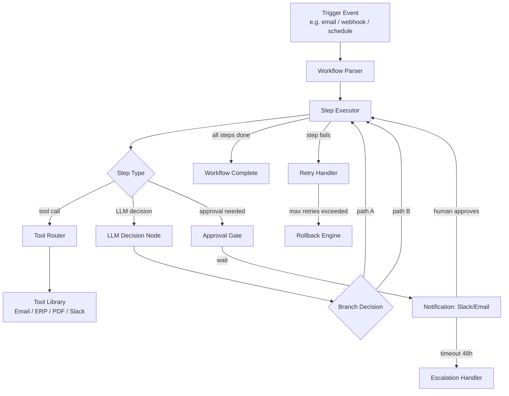
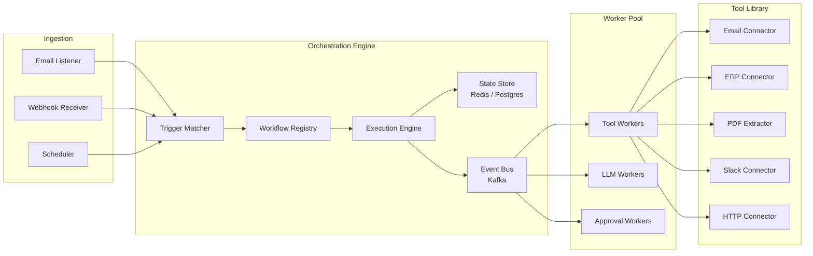
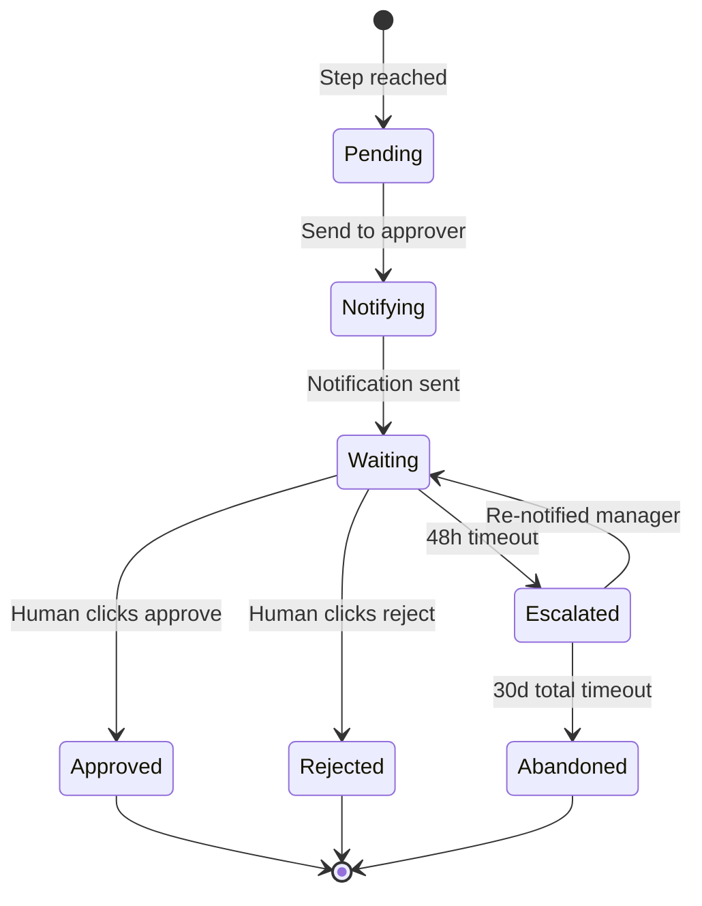

# Design a Workflow Automation Agent — Event-Driven Business Process Orchestration

**Difficulty**: 🟡 Intermediate
**Reading Time**: 25 minutes
**Interview Frequency**: Medium — popular in enterprise AI and intelligent automation interviews

> **The critical insight: workflow automation agents fail not on the happy path but on the exception path — a tool timeout at step 7 of 12 that requires rollback of steps 1-6 while notifying the right humans.**

---

## Table of Contents

| Section | What You'll Learn |
|---------|-------------------|
| [Mental Model](#mental-model) | DAG-based workflow execution with AI decision points |
| [Requirements](#requirements) | Scale targets and reliability constraints |
| [Architecture](#architecture) | Component breakdown with event-driven design |
| [Deep Dive: Workflow DAG](#deep-dive-workflow-dag) | YAML workflow definition and execution engine |
| [Deep Dive: Human Approval Gates](#deep-dive-human-approval-gates) | Pause/resume and dead workflow prevention |
| [Deep Dive: Retry and Rollback](#deep-dive-retry-and-rollback) | Compensating transactions at workflow level |
| [Failure Modes](#failure-modes) | Loop detection, timeouts, orphaned workflows |
| [Interview Q&A](#interview-qa) | How to answer common questions |

---

## Mental Model

A workflow automation agent replaces manual multi-step business processes. "Process all invoices received today, extract line items, update the ERP, and notify approvers for anything over $10,000" becomes a durable, observable, retryable execution — triggered by an event, stepped through by the agent, paused for human input when needed.



---

## Requirements

### Functional Requirements

1. Define workflows as YAML DAGs with steps, conditions, and tool calls
2. Execute multi-step workflows triggered by events (email, webhook, schedule, file upload)
3. Support tool library: email read/send, ERP API, PDF extraction, Slack notify, HTTP calls
4. LLM decision nodes for content understanding (classify invoice → route to correct approver)
5. Human approval gates: pause workflow, notify via Slack/email, resume on response
6. Retry failed steps with configurable backoff
7. Rollback completed steps when a downstream step fails irrecoverably

### Non-Functional Requirements

| Requirement | Target |
|-------------|--------|
| Workflow step execution latency | < 2s for tool calls, < 10s for LLM nodes |
| Workflow state persistence | Survives agent restart — durable execution |
| Max workflow duration | 30 days (approval gate can wait up to 30d) |
| Concurrent active workflows | 10,000 simultaneous |
| Step retry budget | 3 retries with exponential backoff (1s, 4s, 16s) |
| Dead workflow detection | Any workflow idle > 48h without expected pause → alert |
| Audit log retention | 7 years (regulatory requirement for finance workflows) |

### Capacity Estimation

- 10,000 concurrent workflows × avg 12 steps each = 120,000 pending step executions
- Steps complete in ~2s avg → throughput needed: ~1,000 step executions/second
- Tool call rate: 1,000/s across ERP/email/Slack integrations → needs connection pooling

---

## Architecture



### Key Design: Durable Execution

Workflow state is persisted after every step completion. If the agent process crashes mid-workflow at step 7, on restart it loads state from `G[State Store]` and resumes from step 8. This is the **sagas pattern** applied to AI workflows.

```
Workflow State Schema:
{
  workflow_id: "wf-abc123",
  definition_id: "invoice-processing-v3",
  trigger: { type: "email", message_id: "msg-456" },
  status: "running",
  current_step: 7,
  completed_steps: [
    { step_id: 1, tool: "email_read", result: {...}, completed_at: "..." },
    ...
  ],
  context: { invoice_amount: 15000, vendor: "Acme Corp" },
  created_at: "...",
  last_active_at: "..."
}
```

---

## Deep Dive: Workflow DAG

### YAML Workflow Definition

```yaml
name: invoice-processing
version: 3
trigger:
  type: email
  filter:
    subject_contains: "Invoice"
    from_domain: "*.vendor.com"

steps:
  - id: extract_invoice
    tool: pdf_extractor
    input:
      attachment: "{{ trigger.attachment }}"
    output: invoice_data

  - id: classify_invoice
    type: llm_decision
    prompt: |
      Classify this invoice by department:
      Amount: {{ invoice_data.total_amount }}
      Line items: {{ invoice_data.line_items }}
      Choose one: [engineering, marketing, finance, operations]
    output: department

  - id: check_approval_required
    type: condition
    condition: "{{ invoice_data.total_amount }} > 10000"
    if_true: request_approval
    if_false: auto_approve

  - id: request_approval
    type: approval_gate
    notify:
      channel: slack
      recipient: "{{ department }}-approver"
      message: "Invoice from {{ invoice_data.vendor }} for ${{ invoice_data.total_amount }} needs approval"
    timeout_hours: 48
    on_timeout: escalate_to_manager

  - id: update_erp
    tool: erp_api
    input:
      endpoint: /invoices
      method: POST
      body: "{{ invoice_data }}"
    retry:
      max_attempts: 3
      backoff: exponential
    rollback:
      tool: erp_api
      endpoint: /invoices/{{ erp_result.id }}
      method: DELETE

  - id: notify_finance
    tool: slack_notify
    input:
      channel: "#finance-ops"
      message: "Invoice {{ invoice_data.id }} processed and added to ERP"
```

### LLM Decision Nodes

Decision nodes use the LLM to interpret unstructured content and route the workflow. Key design rules:

1. **Always enumerate output options** — "choose one: [A, B, C]" prevents hallucinated branch names
2. **Include confidence threshold** — if LLM returns confidence < 0.8, route to human review step
3. **Cache decisions** — same invoice from same vendor likely gets same classification; cache with TTL 24h
4. **Log reasoning** — store LLM's chain-of-thought in audit log for compliance

---

## Deep Dive: Human Approval Gates

### Gate State Machine



### Preventing Dead Workflows

**Problem**: Approver leaves company; workflow waits forever.

**Solution — three-layer timeout**:
1. **Primary timeout** (48h): notify original approver's manager
2. **Secondary timeout** (7 days from escalation): notify department head
3. **Terminal timeout** (30 days total): auto-abandon workflow, notify workflow owner, create Jira ticket

**Approval link security**:
- Each approval link contains a signed JWT (expires after gate timeout)
- JWT includes: workflow_id, step_id, approver_email, action (approve/reject)
- One-time use: after first click, token is invalidated to prevent double-approval

---

## Deep Dive: Retry and Rollback

### Compensating Transactions

When step N fails after M steps have succeeded, the rollback engine executes compensating actions in reverse order:

```
Forward execution:    Step 1 → Step 2 → Step 3 → Step 4 (FAIL)
Rollback execution:   Step 3_rollback → Step 2_rollback → Step 1_rollback
```

Not all steps are rollbackable:
- **Rollbackable**: ERP POST → DELETE, file upload → delete, calendar booking → cancel
- **Not rollbackable**: Sent emails, Slack messages, SMS notifications (idempotency note appended)
- **Best-effort**: External API calls where rollback depends on third-party support

For non-rollbackable steps, the system logs a "compensation required" record and notifies a human operator: "Invoice processing workflow failed at step 4. Steps 1-3 completed and cannot be undone. Manual intervention required."

### Idempotency Keys

Every tool call generates an idempotency key: `{workflow_id}:{step_id}:{attempt_number}`. The Tool Library uses this key to prevent duplicate actions on retry:

```
ERP API call: POST /invoices
Headers:
  Idempotency-Key: wf-abc123:step-5:attempt-2

If ERP already received attempt-1 with same key: return 200 with cached result
If ERP not seen key yet: execute and store result against key for 24h
```

---

## Failure Modes

### 1. Infinite Loop in Conditional Branches
**Scenario**: Step 3 branches to Step 5, Step 5 branches back to Step 3
**Impact**: Workflow runs forever, consuming quota and generating duplicate tool calls
**Mitigation**:
- Static analysis at workflow load time: detect cycles in DAG using DFS
- Runtime guard: if same step_id executed > 10 times in a workflow, halt with "cycle detected" error
- Reject workflow YAML upload if static analysis finds a cycle

### 2. Tool Timeout Blocking Whole Workflow
**Scenario**: ERP API is slow; step times out at 30s; 1,000 workflows pile up
**Impact**: All workflows depending on ERP stall; cascading queue backup
**Mitigation**:
- Each tool call is async: step submits call to Tool Workers via Kafka, doesn't block Execution Engine
- Tool-level circuit breaker: if ERP returns 5xx on > 50% of calls in 60s, open circuit — all ERP steps get immediate "circuit open" error with human notification
- Tool timeout budget per step: configurable in YAML (default 30s, max 300s for slow APIs)

### 3. Approval Gate Never Fulfilled (Dead Workflows)
**Scenario**: Approver on vacation; escalation email goes to wrong manager; 30-day timeout hits
**Impact**: Invoice never processed; vendor payment delayed; potential late fees
**Mitigation**:
- Out-of-office detection: integrate with calendar API; if approver OOO, immediately escalate
- Approval dashboard: show all pending approvals sorted by age; highlight > 24h items in red
- Weekly digest to workflow owners: "You have 12 workflows awaiting approval, oldest: 5 days"

### 4. Workflow State Corruption on Crash
**Scenario**: Agent crashes mid-step between writing result to state store and marking step complete
**Impact**: Step runs twice on restart (double ERP insert, duplicate Slack message)
**Mitigation**:
- Two-phase state update: write result → mark step complete in single DB transaction
- Idempotency keys on all tool calls prevent duplicate effects even if step re-runs
- Step completion is idempotent: marking an already-complete step as complete is a no-op

---

## Interview Q&A

### "How do you handle a workflow that depends on an external API that's down?"

> "Circuit breaker at the tool level. We track error rate per tool over a 60-second sliding window. If ERP errors > 50%, we open the circuit — new ERP calls immediately return a 'service unavailable' error without trying. This prevents queue buildup and cascading timeouts. The workflow step is marked as failed with reason 'circuit open.' We then have two options based on the step's configuration: (1) park the workflow in a 'waiting' state and retry automatically when the circuit closes, or (2) notify a human operator immediately. Most financial workflows choose option 2 since SLA timelines can't be paused arbitrarily."

### "How would you handle GDPR compliance for workflows processing EU customer data?"

> "Several layers: (1) Data minimization — only extract and pass the specific fields needed for each tool call, not entire records. (2) Audit log encryption — workflow state containing personal data is encrypted at rest with customer-managed keys. (3) Right to erasure — when a GDPR deletion request arrives, we have a workflow-scrubber job that redacts personal data from completed workflow state while preserving structural audit logs. (4) Data residency — EU customers' workflows run on EU-region workers only, enforced by a routing tag on each workflow. (5) Retention — workflow state with personal data auto-deleted after 90 days unless overridden by a longer legal hold."

---

## Key Takeaways

| Number | What It Means |
|--------|--------------|
| **Durable execution** | Persist state after every step — agent restart ≠ workflow restart |
| **10 iterations max** | Runtime cycle guard on any step — prevents infinite loops |
| **3 retry attempts** | Exponential backoff (1s, 4s, 16s) before escalating to rollback |
| **48h approval timeout** | Primary gate; 3-layer escalation prevents orphaned workflows |
| **Idempotency keys** | Every tool call tagged — safe to retry without duplicate side effects |
| **Circuit breaker** | 50% error rate in 60s → open circuit — prevents cascading tool timeouts |

---

## 📚 Resources & References

| Resource | Type | What You'll Learn |
|----------|------|------------------|
| [LangGraph: Building Stateful Multi-Actor Applications](https://langchain-ai.github.io/langgraph/) | 📚 Docs | Production framework for agent workflow DAGs with human-in-the-loop |
| [Temporal: Durable Execution](https://temporal.io/blog/workflow-orchestration) | 📖 Blog | How Temporal handles workflow persistence and retry at Uber/Netflix scale |
| [Zapier Engineering: Automating Billions of Tasks](https://zapier.com/engineering/automating-billions-of-tasks/) | 📖 Blog | Real architecture behind workflow automation at massive scale |
| [Sam Witteveen — LangGraph Tutorial](https://www.youtube.com/@samwitteveenai) | 📺 YouTube | Hands-on workflow agent patterns with LangGraph |
| [Lilian Weng — Task-Oriented Dialogue](https://lilianweng.github.io/posts/2020-11-30-task-oriented-dialogue/) | 📖 Blog | Background on structured task completion with AI |
| [ByteByteGo — Design a Job Scheduler](https://www.youtube.com/@ByteByteGo) | 📺 YouTube | Search "job scheduler" — relevant scheduling and retry patterns |
