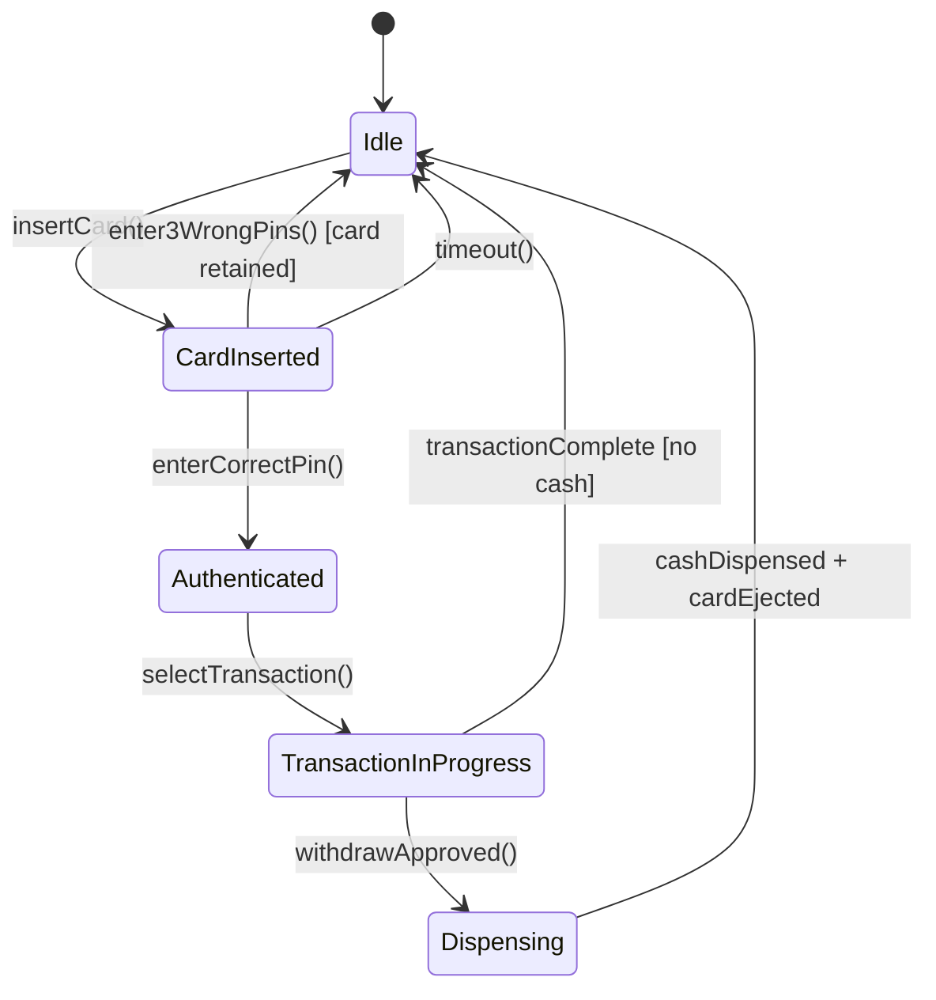
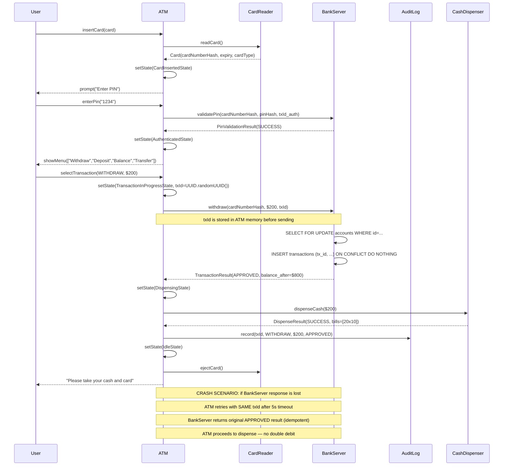

# Design an ATM System (OOD)

**Difficulty**: 🟢 Beginner
**Reading Time**: Coming Soon
**Interview Frequency**: High

---

> 🚧 **Full article coming soon.** This stub gives you the essentials to start thinking about this problem.

---

## The Core Problem

Modeling ATM states (idle → card_inserted → pin_entered → transaction → dispensing) with security constraints — the ATM must never dispense cash before verifying PIN, and must never allow PIN bypass. The State pattern encapsulates these constraints: each state only exposes valid operations, making illegal transitions compile-time errors rather than runtime bugs.

## Functional Requirements

- Accept card insertion and PIN entry
- Support transactions: withdraw, deposit, balance inquiry, transfer
- Dispense cash from cash dispenser
- Eject card at transaction completion or after 3 PIN failures
- Maintain audit log of all transactions

## Non-Functional Requirements

| Requirement | Target |
|-------------|--------|
| Security | PIN attempts locked after 3 failures |
| Atomicity | Cash dispensed ↔ account debited (never one without other) |
| Availability | 99.9% (bank-grade, monitored 24/7) |

## Back-of-Envelope Estimates

- **States**: 5 states (Idle, CardInserted, Authenticated, TransactionInProgress, Dispensing)
- **Core classes**: ~8-10 classes
- **Audit log**: Every transaction = 1 record (timestamp, card_number_hash, type, amount, result)

## Key Design Decisions

1. **State Pattern for ATM States** — `ATMState` interface with methods: `insertCard()`, `enterPin()`, `selectTransaction()`, `dispense()`, `ejectCard()`; invalid transitions throw `IllegalStateException` rather than proceeding silently; e.g., `Idle.enterPin()` throws — can't enter PIN without card.
2. **Idempotent Transaction with Server-Side Dedup** — ATM sends transaction to bank server with unique transaction_id; if network times out, ATM retries with same transaction_id; bank deduplicates and returns original result — cash dispensed iff account successfully debited.
3. **Cash Dispenser as Hardware Abstraction** — `CashDispenser` interface with `dispenseCash(amount)` and `getCashAvailable()`; concrete impl talks to physical hardware; testable with mock impl; `Nominal`/`DenominationSet` handles bill combination algorithm.

## High-Level Architecture



## Top Interview Questions for This Problem

| Question | Tests |
|----------|-------|
| What happens if the ATM crashes between debiting the account and dispensing cash? | Atomicity, 2-phase commit, idempotency |
| How do you prevent a user from withdrawing while another transaction is in progress? | State machine, concurrent requests |
| How would you model multiple card types (credit, debit, prepaid)? | Polymorphism, card abstraction |

## Related Concepts

- [Digital wallet for the bank account side of ATM transactions](../07-security/digital-wallet)
- [Vending machine OOD for similar cash-handling state machine](./vending-machine)

---

## Class Design

The ATM system revolves around a small set of well-defined collaborators. The `ATM` class is the context that holds the current state object; every user action delegates to the current state, which either performs the operation or throws `IllegalStateException`. This makes invalid state transitions a programming error caught at compile time (or at the first test), not a runtime path that slips through conditionals.

```mermaid
classDiagram
    class ATM {
        -currentState: ATMState
        -cashDispenser: CashDispenser
        -cardReader: CardReader
        -screen: Screen
        -keypad: Keypad
        -auditLog: AuditLog
        +insertCard(card: Card) void
        +enterPin(pin: String) void
        +selectTransaction(type: TransactionType, amount: Money) void
        +cancelTransaction() void
        +ejectCard() void
        +setState(state: ATMState) void
    }

    class ATMState {
        <<interface>>
        +insertCard(atm: ATM, card: Card) void
        +enterPin(atm: ATM, pin: String) void
        +selectTransaction(atm: ATM, type: TransactionType, amount: Money) void
        +dispense(atm: ATM) void
        +ejectCard(atm: ATM) void
    }

    class IdleState {
        +insertCard(atm: ATM, card: Card) void
        +enterPin(atm, pin) throws IllegalStateException
        +selectTransaction(atm, type, amount) throws IllegalStateException
        +dispense(atm) throws IllegalStateException
        +ejectCard(atm) throws IllegalStateException
    }

    class CardInsertedState {
        -pinAttempts: int
        -card: Card
        +insertCard(atm, card) throws IllegalStateException
        +enterPin(atm: ATM, pin: String) void
        +selectTransaction(atm, type, amount) throws IllegalStateException
        +dispense(atm) throws IllegalStateException
        +ejectCard(atm: ATM) void
    }

    class AuthenticatedState {
        -card: Card
        +insertCard(atm, card) throws IllegalStateException
        +enterPin(atm, pin) throws IllegalStateException
        +selectTransaction(atm: ATM, type: TransactionType, amount: Money) void
        +dispense(atm) throws IllegalStateException
        +ejectCard(atm: ATM) void
    }

    class TransactionInProgressState {
        -card: Card
        -transactionId: UUID
        -type: TransactionType
        -amount: Money
        +insertCard(atm, card) throws IllegalStateException
        +enterPin(atm, pin) throws IllegalStateException
        +selectTransaction(atm, type, amount) throws IllegalStateException
        +dispense(atm: ATM) void
        +ejectCard(atm: ATM) void
    }

    class DispensingState {
        -card: Card
        -amount: Money
        +insertCard(atm, card) throws IllegalStateException
        +enterPin(atm, pin) throws IllegalStateException
        +selectTransaction(atm, type, amount) throws IllegalStateException
        +dispense(atm: ATM) void
        +ejectCard(atm: ATM) void
    }

    class Card {
        -cardNumber: String
        -cardNumberHash: String
        -expiryDate: LocalDate
        -cardType: CardType
        +isExpired() boolean
        +getMaskedNumber() String
    }

    class CashDispenser {
        <<interface>>
        +dispenseCash(amount: Money) boolean
        +getCashAvailable() Money
        +getDenominationCounts() Map~Denomination, Integer~
    }

    class PhysicalCashDispenser {
        -denominationSlots: Map~Denomination, Integer~
        +dispenseCash(amount: Money) boolean
        +getCashAvailable() Money
        +computeDenominations(amount: Money) Map~Denomination, Integer~
    }

    class BankServer {
        <<interface>>
        +validatePin(cardNumberHash: String, pinHash: String, txId: UUID) PinValidationResult
        +withdraw(cardNumberHash: String, amount: Money, txId: UUID) TransactionResult
        +deposit(cardNumberHash: String, amount: Money, txId: UUID) TransactionResult
        +getBalance(cardNumberHash: String, txId: UUID) BalanceResult
        +transfer(from: String, to: String, amount: Money, txId: UUID) TransactionResult
    }

    class AuditLog {
        +record(entry: AuditEntry) void
        +getEntriesForCard(cardNumberHash: String) List~AuditEntry~
    }

    class Money {
        -amount: BigDecimal
        -currency: Currency
        +add(other: Money) Money
        +subtract(other: Money) Money
        +isPositive() boolean
    }

    ATM --> ATMState : currentState
    ATM --> CashDispenser
    ATM --> BankServer
    ATM --> AuditLog
    ATMState <|.. IdleState
    ATMState <|.. CardInsertedState
    ATMState <|.. AuthenticatedState
    ATMState <|.. TransactionInProgressState
    ATMState <|.. DispensingState
    CashDispenser <|.. PhysicalCashDispenser
    ATM --> Card : transient during session
    TransactionInProgressState --> Money
```



The `Money` value object is deliberately immutable — every arithmetic operation returns a new instance. This prevents the subtle bug where two threads share a mutable balance and one modifies it mid-calculation. `Card` stores only a `cardNumberHash` (SHA-256 of PAN) in memory after validation — the raw card number is never retained past the initial read.

---

## Design Patterns Applied

### State Pattern

**How it's used**: `ATMState` is the state interface; `ATM` is the context. Each concrete state (`IdleState`, `CardInsertedState`, `AuthenticatedState`, `TransactionInProgressState`, `DispensingState`) implements every method. Methods that are invalid in that state throw `IllegalStateException` immediately. The `ATM` context delegates every user action to `currentState`; states call `atm.setState(newState)` to transition.

**Why it fits**: Without the State pattern, the `ATM` class would need a large `switch` or chain of `if/else` checking the current mode before every operation. Adding a new state (e.g., `CardRetained`) means touching that central switch. With the State pattern, a new state is a new class — the existing states and `ATM` are untouched. The pattern also makes it impossible for `Idle.enterPin()` to silently succeed — the throw is the specification.

### Strategy Pattern (denomination algorithm)

**How it's used**: `CashDispenser` accepts a `DenominationStrategy` — e.g., `GreedyDenominationStrategy` (largest bills first) vs. `ExactChangeStrategy` (minimize bill count when change is needed). The strategy is injected at construction; swapping it requires no ATM logic changes.

**Why it fits**: Different banks configure ATMs with different bill mixes. The algorithm for computing which bills to dispense must vary without touching the dispenser hardware abstraction.

### Template Method Pattern (transaction flow)

**How it's used**: An abstract `Transaction` class defines the sequence: `validate()` → `execute()` → `postProcess()` → `audit()`. `WithdrawTransaction`, `DepositTransaction`, `BalanceInquiryTransaction`, and `TransferTransaction` override only `validate()` and `execute()`. `audit()` is final — every transaction must be logged.

**Why it fits**: The audit step must always run, even if `execute()` throws. A template method with a `try/finally` inside `run()` guarantees this — subclasses cannot accidentally skip logging.

### Facade Pattern (ATM class itself)

**How it's used**: The `ATM` class is a facade over `CardReader`, `CashDispenser`, `Keypad`, `Screen`, `BankServer`, and `AuditLog`. The UI (or a test harness) talks only to `ATM`; it never touches the subsystems directly.

**Why it fits**: Hardware changes (new card reader model) are isolated inside their own class. The ATM facade API stays stable. Tests use mock subsystem implementations injected at construction.

### Observer Pattern (screen and receipt updates)

**How it's used**: The `Screen` and `AuditLog` subscribe to `ATMEvents` emitted by the state machine. When `AuthenticatedState` successfully validates a PIN, it emits `PinValidatedEvent`; the `Screen` observer shows the main menu. When `DispensingState` completes, it emits `CashDispensedEvent`; the `AuditLog` observer writes the record and the `ReceiptPrinter` observer prints a receipt.

**Why it fits**: Without Observer, every state class would need to directly call `screen.showMenu()`, `auditLog.record()`, and `receiptPrinter.print()` — coupling business logic to I/O. With Observer, states emit events and remain ignorant of which output devices are active. Adding a new observer (e.g., a fraud-detection listener) requires zero changes to existing state classes.

---

## SOLID Principles

**Single Responsibility**: `ATM` orchestrates state transitions but does not implement any state logic — each state class is responsible for exactly one mode of operation. `CashDispenser` only knows how to dispense; it has no knowledge of accounts or PINs. `AuditLog` only writes records; it has no business logic.

**Open/Closed**: Adding a new state (e.g., a `MaintenanceMode` state that disables all user operations but allows a technician PIN) requires creating a new class and one new `setState()` call — no existing state class or the `ATM` context changes. Adding a new transaction type means a new `Transaction` subclass only.

**Liskov Substitution**: Every concrete state is substitutable for `ATMState`. The `ATM` context never downcasts — it calls the same interface method regardless of which state is current. `PhysicalCashDispenser` and `MockCashDispenser` are fully substitutable for `CashDispenser`.

**Interface Segregation**: `BankServer` exposes only four operations (`validatePin`, `withdraw`, `deposit`, `getBalance`, `transfer`). The ATM does not receive a "God interface" with 50 bank API methods it doesn't use. Hardware interfaces (`CardReader`, `CashDispenser`, `Keypad`, `Screen`) are separate — states import only the interfaces they need.

**Dependency Inversion**: `ATM` depends on `CashDispenser` (interface), `BankServer` (interface), and `AuditLog` (interface) — never on their concrete implementations. This makes unit tests possible without physical hardware.

---

## Concurrency and Thread Safety

An ATM machine handles one physical user at a time, but in a banking system, the same account can be accessed from multiple ATMs simultaneously. Three concurrency concerns must be handled:

**1. Single ATM — one session at a time**: The `ATM` object itself is accessed by one user at a time. The state machine does not need internal locking because the physical hardware serializes input — you cannot insert two cards simultaneously. However, if the ATM class is driven via a networked API (for testing or remote management), access to `currentState` must be synchronized.

```java
// Thread-safe state transition
public synchronized void setState(ATMState newState) {
    this.currentState = newState;
}
```

**2. Bank-side account locking**: When `WithdrawTransaction.execute()` sends the withdraw request to `BankServer`, the bank applies an optimistic lock on the account row. If two ATMs submit concurrent withdrawals for the same account, the bank uses:
- **Pessimistic locking** (SELECT FOR UPDATE): one withdrawal blocks until the other completes — safe, but creates a bottleneck for high-volume accounts.
- **Optimistic locking** (version column): both withdrawals attempt to update `WHERE version = N`; one fails and retries — better throughput, requires retry logic.

Most production banking cores use pessimistic locking for debit operations because the risk of a lost-update bug (double debit or double dispense) is too high to manage with retries alone.

**3. Idempotency key prevents double-dispense**: Every transaction carries a `txId` (UUID v4 generated by the ATM). If the ATM sends a withdraw request and receives a network timeout, it retries with the **same txId**. The bank deduplicates on `txId`:

```sql
INSERT INTO transactions (tx_id, card_hash, type, amount, result, created_at)
VALUES ($1, $2, $3, $4, $5, NOW())
ON CONFLICT (tx_id) DO NOTHING
RETURNING result;
```

If the original request succeeded (money already debited), the retry returns the original result without debiting again. The ATM then dispenses cash as if the first attempt had returned successfully. This is the core of exactly-once semantics for financial transactions.

**4. Timeout and session expiry**: If a user inserts a card and does nothing for 30 seconds, the ATM transitions to `Idle` and ejects the card. This timeout must run on a background thread. The ATM uses a `ScheduledExecutorService` that fires a `SessionTimeout` event; the event calls `atm.cancelSession()` under the same synchronized lock as normal user input.

---

## Extension Points

**Adding a new card type (e.g., prepaid card with no bank account)**:
- Create `PrepaidCard extends Card` with a `balance` field.
- Create `PrepaidBankServer implements BankServer` that reads from an in-memory store or a prepaid ledger.
- Inject `PrepaidBankServer` when constructing the ATM for prepaid mode.
- No state classes change. The `ATM` context is open/closed compliant.

**Adding contactless (NFC) card reading**:
- Create `NFCCardReader implements CardReader` with an `onTap()` event.
- The `ATM` constructor accepts a `CardReader` — inject the NFC implementation.
- `IdleState.insertCard()` works identically whether the card is swiped, dipped, or tapped — it receives a `Card` object regardless of how it was read.

**Adding a receipt printer**:
- Create a `ReceiptPrinter` interface with `print(receipt: Receipt) void`.
- Inject it into `ATM`.
- In `TransactionInProgressState.dispense()`, after calling `atm.cashDispenser.dispenseCash()`, call `atm.receiptPrinter.print(buildReceipt())`.
- Existing states and the `ATM` context require one new field + one new call per transaction type — no structural changes.

**Adding multi-currency support**:
- `Money` already carries a `Currency` field.
- `CashDispenser.getDenominationCounts()` returns `Map<Denomination, Integer>` where `Denomination` includes a currency code.
- `BankServer.withdraw()` accepts a `Money` with currency; the bank handles FX conversion.
- No state class changes — the currency is encapsulated in `Money`.

**Adding two-factor authentication (OTP via SMS)**:
- Create `OTPVerificationState` inserted between `CardInsertedState` and `AuthenticatedState`.
- `CardInsertedState.enterPin()` transitions to `OTPVerificationState` (not `AuthenticatedState`) when the bank's `validatePin()` response includes `requires_otp: true`.
- `OTPVerificationState.enterOtp(otp)` calls `BankServer.validateOtp()` and transitions to `AuthenticatedState` on success.
- All existing states are unchanged; the new state is purely additive.

---

## Sequence: Full Withdrawal Transaction

The following sequence diagram shows the exact message flow from card insertion through cash dispensing, including the bank network round-trip and the crash-safety retry path.



This sequence makes explicit the two-phase structure: the bank is debited first, then cash is dispensed. If the ATM crashes after the bank debit but before dispensing, a reconciliation job on the bank side will detect the `completed_at IS NULL` transaction and flag it for manual review. The customer will be reimbursed — this is a known financial industry reconciliation case called a "dispense mismatch" and every bank has operational procedures for it.

---

## Data Model

The ATM itself is stateless between sessions. The persistent data lives in the bank's backend. Below is the schema for the bank's transaction store that makes idempotency and audit work.

```sql
-- Card store (bank side)
CREATE TABLE cards (
    card_number_hash    CHAR(64)        NOT NULL PRIMARY KEY,  -- SHA-256 of PAN
    account_id          BIGINT          NOT NULL REFERENCES accounts(id),
    card_type           VARCHAR(16)     NOT NULL,              -- 'debit', 'credit', 'prepaid'
    expiry_date         DATE            NOT NULL,
    pin_hash            CHAR(64)        NOT NULL,              -- bcrypt hash of PIN
    pin_attempt_count   SMALLINT        NOT NULL DEFAULT 0,
    locked_until        TIMESTAMPTZ     NULL,                  -- NULL = not locked
    created_at          TIMESTAMPTZ     NOT NULL DEFAULT NOW(),
    updated_at          TIMESTAMPTZ     NOT NULL DEFAULT NOW()
);

-- Account balances
CREATE TABLE accounts (
    id                  BIGSERIAL       PRIMARY KEY,
    owner_id            BIGINT          NOT NULL,
    balance             NUMERIC(18, 2)  NOT NULL,
    currency            CHAR(3)         NOT NULL DEFAULT 'USD',
    version             BIGINT          NOT NULL DEFAULT 0,    -- optimistic lock version
    created_at          TIMESTAMPTZ     NOT NULL DEFAULT NOW(),
    updated_at          TIMESTAMPTZ     NOT NULL DEFAULT NOW()
);

-- Transaction log (idempotency + audit)
CREATE TABLE transactions (
    tx_id               UUID            NOT NULL PRIMARY KEY,  -- ATM-generated idempotency key
    card_number_hash    CHAR(64)        NOT NULL,
    atm_id              VARCHAR(32)     NOT NULL,              -- physical ATM identifier
    tx_type             VARCHAR(16)     NOT NULL,              -- 'withdraw','deposit','balance','transfer'
    amount              NUMERIC(18, 2)  NOT NULL,
    currency            CHAR(3)         NOT NULL DEFAULT 'USD',
    result_code         VARCHAR(16)     NOT NULL,              -- 'approved','declined','insufficient_funds','error'
    account_balance_after NUMERIC(18,2) NULL,                  -- snapshot after tx, NULL if declined
    created_at          TIMESTAMPTZ     NOT NULL DEFAULT NOW(),
    completed_at        TIMESTAMPTZ     NULL                   -- NULL = still in-flight or timed out
);

CREATE INDEX idx_transactions_card ON transactions(card_number_hash, created_at DESC);
CREATE INDEX idx_transactions_atm  ON transactions(atm_id, created_at DESC);

-- ATM cash inventory
CREATE TABLE atm_cash_inventory (
    atm_id              VARCHAR(32)     NOT NULL,
    denomination        NUMERIC(10, 2)  NOT NULL,              -- e.g., 100.00, 20.00, 10.00
    bill_count          INT             NOT NULL DEFAULT 0,
    last_replenished_at TIMESTAMPTZ     NOT NULL DEFAULT NOW(),
    PRIMARY KEY (atm_id, denomination)
);
```

**Key design choices in the schema**:
- `card_number_hash` is a SHA-256 of the Primary Account Number (PAN) — the raw card number is never stored. Even if the database is compromised, no raw PANs are exposed (PCI-DSS requirement).
- `tx_id` is the primary key on `transactions` — the `ON CONFLICT DO NOTHING` pattern makes retries safe without any application-level deduplication.
- `accounts.version` enables optimistic locking: `UPDATE accounts SET balance = balance - $amount, version = version + 1 WHERE id = $id AND version = $expected_version`.
- `completed_at` allows distinguishing in-flight transactions from completed ones. A background reconciliation job looks for rows where `completed_at IS NULL AND created_at < NOW() - INTERVAL '5 minutes'` and marks them as timed out.

---

## Cash Denomination Algorithm

Deciding which bills to dispense is a constrained variant of the **coin-change problem** (a classic dynamic programming problem). The ATM must dispense exactly the requested amount using available bill denominations (e.g., $100, $50, $20, $10) while minimizing the number of bills used — or failing gracefully when exact change is impossible.

**Greedy algorithm** (used by most ATMs in practice):

```java
public Map<Denomination, Integer> computeDispense(
        Money amount, Map<Denomination, Integer> available) {
    
    BigDecimal remaining = amount.getAmount();
    Map<Denomination, Integer> result = new LinkedHashMap<>();
    
    // Sort denominations largest-first
    List<Denomination> sorted = available.keySet().stream()
        .sorted(Comparator.reverseOrder())
        .collect(toList());
    
    for (Denomination denom : sorted) {
        int billsNeeded = remaining.divideToIntegralValue(
            denom.getValue()).intValue();
        int billsAvailable = available.get(denom);
        int billsToUse = Math.min(billsNeeded, billsAvailable);
        
        if (billsToUse > 0) {
            result.put(denom, billsToUse);
            remaining = remaining.subtract(
                denom.getValue().multiply(BigDecimal.valueOf(billsToUse)));
        }
    }
    
    if (remaining.compareTo(BigDecimal.ZERO) != 0) {
        throw new InsufficientDenominationsException(
            "Cannot make exact change for " + amount);
    }
    return result;
}
```

**Why greedy works for ATM denominations**: Standard ATM denominations ($100, $50, $20, $10) are all multiples of the smallest denomination. For such "canonical" denomination sets, the greedy algorithm always produces the minimum bill count and never fails when the total is available. This is not true for arbitrary denomination sets (e.g., coins: 1¢, 3¢, 4¢), but ATM bill sets are designed specifically to avoid this failure mode.

**Trade-offs between denomination strategies**:

| Strategy | Latency | Bill conservation | Complexity | Use when |
|----------|---------|-------------------|------------|----------|
| Greedy (largest-first) | O(d) where d = # denominations | Poor — burns large bills fast | Trivial | Standard bank ATMs with canonical denominations |
| Dynamic programming (exact min) | O(amount × d) | Optimal | Medium | Dispensers with non-canonical or low-inventory mixes |
| Inventory-aware greedy | O(d log d) | Good — avoids depleting any one denomination | Low-medium | High-traffic ATMs that replenish infrequently |

Most production ATMs use the greedy approach because denomination sets are canonical and the algorithm is deterministic and fast. The `InsufficientDenominationsException` triggers an "exact change not available" screen, prompting the user to enter a different amount (typically a multiple of $20). ATMs in markets with $5 and $1 bills use the inventory-aware greedy to avoid burning small denomination reserves too quickly during busy periods.

---

## Scale Bottlenecks

| Traffic Level | Component That Breaks | Symptoms | Mitigation |
|---------------|----------------------|----------|------------|
| 10x baseline (e.g., 10 ATMs → 100 ATMs per bank) | Bank database — single writer for account updates | Locking contention on hot accounts; P99 latency spikes to 2-5s | Connection pooling (PgBouncer); read replicas for balance inquiries; separate writer pool for updates |
| 100x baseline (major event — festival, month-end payroll) | `transactions` table — 100k inserts/sec against a single PostgreSQL instance | INSERT queue backs up; `completed_at` never set; reconciliation backlog grows | Partition `transactions` by month; use append-only writes to a message broker (Kafka) first, flush to DB asynchronously |
| 1000x baseline (national-scale event — government payment day) | `accounts` table row-level locks; PIN validation service | All ATMs attempting to debit same batch of accounts; PIN service CPU-bound on bcrypt | Horizontal shard accounts by `account_id % N`; cache PIN validation results with a 30s TTL (bcrypt is intentionally slow — 300ms/op); use hardware security modules (HSMs) for PIN validation offload |

Real-world ATM networks in India (NPCI / NFS) handle peak volumes of ~1.5 million transactions per hour during salary-day rushes. Each transaction takes 3-8 seconds end-to-end including network round-trips to the issuer bank. At that scale, the bottleneck is the VISA/Mastercard/NPCI switch network, not any single ATM's state machine.

---

## How NCR Built ATM Transaction Reliability

NCR (National Cash Register) is the world's largest ATM manufacturer, with over 500,000 active units. Their software stack — XFS (eXtensions for Financial Services, now CEN/XFS standard) — is the de facto hardware abstraction layer that maps to the `CashDispenser`, `CardReader`, and `Keypad` interfaces described above.

**Technology choices**: NCR ATMs run Windows Embedded or Linux with a C++ XFS service layer. The application layer is often Java or C#, communicating with XFS via COM/IPC calls on Windows or custom Unix sockets on Linux. The `CashDispenser` interface in our OOD model directly mirrors an XFS device service — a software layer that talks to a hardware controller without the application knowing the physical wiring.

**Specific numbers**: An NCR SelfServ 80 dispenses up to 200 bills in a single transaction. The physical dispensing mechanism takes 4-8 seconds for a 20-bill transaction. The ATM keeps an in-memory denomination inventory updated after every dispense; it synchronizes to a persistent store (local SQLite or a remote inventory service) every 60 seconds and on every replenishment event. At peak, a high-traffic airport ATM processes 600-800 transactions per day.

**Non-obvious architectural decision**: NCR separates the "logical dispense" (deduct from inventory, mark transaction complete) from the "physical dispense" (motor runs, bills exit the slot) with an explicit two-step confirmation. After the physical dispense completes, a sensor confirms that bills left the cassette. If the sensor does not fire within 10 seconds, the ATM enters `JournalConflict` state — a supervisor must manually reconcile whether cash was actually delivered. This sensor-confirmation step is invisible to the state machine design described above but is the single most important reliability feature in the hardware layer.

**Source**: NCR Developer Zone (developer.ncr.com), XFS SDK documentation, and the CEN/XFS standard published at [cenxfs.sourceforge.net](https://cenxfs.sourceforge.net/). NCR publishes deployment statistics in their annual Payments Trend Report.

**Additional context**: Diebold Nixdorf (the second-largest ATM manufacturer) uses a similar architecture but ships their own "Vynamic" middleware, which provides the same hardware abstraction over XFS with additional telemetry. Their "Distributed Services Architecture" (DSA) separates the customer-facing UI, the transaction logic, and the hardware drivers into independently deployable services — a microservices decomposition of the same components that our OOD model expresses as collaborating objects within a single process. At large enough scale, the boundary between "object that calls a method" and "service that calls an API" is just a deployment decision.

---

## Interview Angle

**What the interviewer is testing**: Whether the candidate understands that ATM design is fundamentally about _state management_ and _financial atomicity_ — not CRUD. A candidate who jumps straight to "I'll create a `User`, `Account`, and `Transaction` class" without mentioning states or idempotency is showing surface-level OOD skills only.

**Common mistakes candidates make:**

1. **Forgetting the crash-between-debit-and-dispense scenario**: This is the #1 interview question for ATM OOD. A candidate who says "if the network fails, just retry" without specifying that the retry uses the same idempotency key will double-debit the account. The correct answer requires explaining `tx_id`, server-side dedup, and why the retry is safe.

2. **Modeling PIN as a field on `User` instead of `Card`**: A debit card PIN is tied to the card, not the account holder. The same person may have multiple cards with different PINs, and a card PIN can be changed independently of the account. Conflating `User`, `Account`, and `Card` into a single class fails the Single Responsibility principle and models the domain incorrectly.

3. **Using booleans/enums for state instead of the State pattern**: Candidates who write `if (state == AUTHENTICATED) { ... } else if (state == CARD_INSERTED) { ... }` in every method have technically solved the problem but have produced unmaintainable code. The State pattern answer shows familiarity with Gang of Four, which is what a senior OOD interviewer is listening for.

**The insight that separates good from great answers**: The best candidates note that the ATM state machine and the bank transaction are two distinct distributed state machines that must stay consistent across a network boundary. The ATM's `TransactionInProgressState` and the bank's pending transaction record are coupled by the `tx_id` idempotency key — and the timeout/reconciliation job on the bank side is the safety net that makes the entire system correct even when ATMs crash. Most candidates describe the ATM in isolation; the great ones describe the ATM + bank as a distributed system with explicit failure modes.

The best candidates also note that PCI-DSS compliance shapes the entire data model: no raw PANs stored anywhere, bcrypt for PINs, TLS 1.2+ for all bank communication, and an immutable audit log that cannot be deleted. These are not optional engineering choices — they are regulatory requirements backed by $50,000-$100,000 per violation fines. A senior interviewer will appreciate a candidate who mentions these constraints without being prompted.

---

## Key Numbers to Remember

| Metric | Value | Context |
|--------|-------|---------|
| PIN lockout threshold | 3 failed attempts | Industry standard; card retained on 3rd failure at some banks |
| Physical dispense time | 4-8 seconds | Per NCR SelfServ 80 for a 20-bill transaction |
| Session timeout | 30-90 seconds | Varies by bank; typically 30s after last keypad input |
| Max bills per dispense | 40-200 bills | Hardware-limited; NCR SelfServ 80 = 200 bills max |
| bcrypt PIN validation latency | 200-400 ms | Intentionally slow; cost factor 12 = ~300ms on server CPU |
| ATM uptime target | 99.9% | ~8.7 hours downtime per year; cash replenishment is the main planned downtime |
| Transaction P99 latency | 3-8 seconds | End-to-end, including bank network round-trip via VISA/Mastercard switch |
| Peak ATM transactions (India NPCI) | ~1.5 million/hour | Salary-day peak across the National Financial Switch network |
| Idempotency key TTL | 24 hours | Bank deduplicates on tx_id for 24h window; after that, retries are treated as new transactions |
| Max withdrawal per session | $200-$1,000 | Bank-configured limit; can be higher with prior arrangement |
| Daily ATM withdrawal limit | $300-$2,000 | Fraud prevention; enforced by bank server during `withdraw()` authorization |
| PCI-DSS fine per violation | $50,000-$100,000 | Storing raw PAN or PIN in plaintext is the fastest route to this fine |
| Reconciliation window | 24-48 hours | Time for bank to detect and resolve dispense mismatches via audit log |
| Denomination algorithm complexity | O(d) greedy | d = number of bill types; canonical sets make greedy always optimal |

---

*📚 Full deep-dive with multiple approaches, trade-off tables, and pseudocode coming soon.*

## 📚 Resources & References

| Resource | Type | What You'll Learn |
|----------|------|------------------|
| [ByteByteGo — ATM System Design](https://www.youtube.com/@ByteByteGo) | 📺 YouTube | Search "ATM system design" — state machine, transaction flow, error handling |
| [Grokking Object-Oriented Design](https://www.educative.io/courses/grokking-the-object-oriented-design-interview) | 📚 Book | Chapter on ATM system — classes, responsibilities, and state transitions |
| [ISO 8583: Financial Transaction Card Messages](https://en.wikipedia.org/wiki/ISO_8583) | 📖 Blog | The standard protocol powering ATM and POS transactions globally |
| [ACID Transactions for Financial Systems](https://fauna.com/blog/database-transaction-acid-properties) | 📖 Blog | Why ATM systems require strict ACID compliance for balance operations |
| [State Machine Design Pattern](https://refactoring.guru/design-patterns/state) | 📚 Docs | Implementing the State pattern — applicable to ATM transaction flow |
