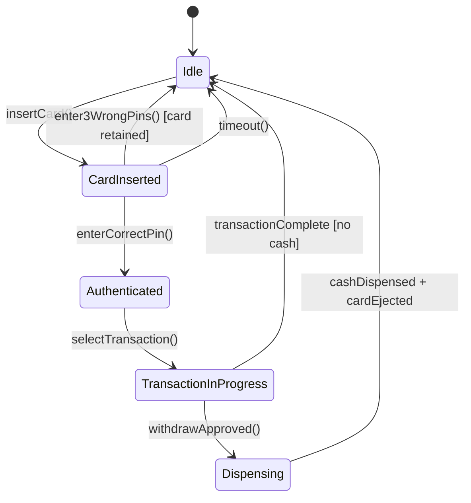

# Design an ATM System (OOD)

**Difficulty**: 🟢 Beginner
**Reading Time**: Coming Soon
**Interview Frequency**: High

---

> 🚧 **Full article coming soon.** This stub gives you the essentials to start thinking about this problem.

---

## The Core Problem

Modeling ATM states (idle → card_inserted → pin_entered → transaction → dispensing) with security constraints — the ATM must never dispense cash before verifying PIN, and must never allow PIN bypass. The State pattern encapsulates these constraints: each state only exposes valid operations, making illegal transitions compile-time errors rather than runtime bugs.

## Functional Requirements

- Accept card insertion and PIN entry
- Support transactions: withdraw, deposit, balance inquiry, transfer
- Dispense cash from cash dispenser
- Eject card at transaction completion or after 3 PIN failures
- Maintain audit log of all transactions

## Non-Functional Requirements

| Requirement | Target |
|-------------|--------|
| Security | PIN attempts locked after 3 failures |
| Atomicity | Cash dispensed ↔ account debited (never one without other) |
| Availability | 99.9% (bank-grade, monitored 24/7) |

## Back-of-Envelope Estimates

- **States**: 5 states (Idle, CardInserted, Authenticated, TransactionInProgress, Dispensing)
- **Core classes**: ~8-10 classes
- **Audit log**: Every transaction = 1 record (timestamp, card_number_hash, type, amount, result)

## Key Design Decisions

1. **State Pattern for ATM States** — `ATMState` interface with methods: `insertCard()`, `enterPin()`, `selectTransaction()`, `dispense()`, `ejectCard()`; invalid transitions throw `IllegalStateException` rather than proceeding silently; e.g., `Idle.enterPin()` throws — can't enter PIN without card.
2. **Idempotent Transaction with Server-Side Dedup** — ATM sends transaction to bank server with unique transaction_id; if network times out, ATM retries with same transaction_id; bank deduplicates and returns original result — cash dispensed iff account successfully debited.
3. **Cash Dispenser as Hardware Abstraction** — `CashDispenser` interface with `dispenseCash(amount)` and `getCashAvailable()`; concrete impl talks to physical hardware; testable with mock impl; `Nominal`/`DenominationSet` handles bill combination algorithm.

## High-Level Architecture

## Top Interview Questions for This Problem

| Question | Tests |
|----------|-------|
| What happens if the ATM crashes between debiting the account and dispensing cash? | Atomicity, 2-phase commit, idempotency |
| How do you prevent a user from withdrawing while another transaction is in progress? | State machine, concurrent requests |
| How would you model multiple card types (credit, debit, prepaid)? | Polymorphism, card abstraction |

## Related Concepts

- [Digital wallet for the bank account side of ATM transactions](../07-security/digital-wallet)
- [Vending machine OOD for similar cash-handling state machine](./vending-machine)

---

*📚 Full deep-dive with multiple approaches, trade-off tables, and pseudocode coming soon.*

## 📚 Resources & References

| Resource | Type | What You'll Learn |
|----------|------|------------------|
| [ByteByteGo — ATM System Design](https://www.youtube.com/@ByteByteGo) | 📺 YouTube | Search "ATM system design" — state machine, transaction flow, error handling |
| [Grokking Object-Oriented Design](https://www.educative.io/courses/grokking-the-object-oriented-design-interview) | 📚 Book | Chapter on ATM system — classes, responsibilities, and state transitions |
| [ISO 8583: Financial Transaction Card Messages](https://en.wikipedia.org/wiki/ISO_8583) | 📖 Blog | The standard protocol powering ATM and POS transactions globally |
| [ACID Transactions for Financial Systems](https://fauna.com/blog/database-transaction-acid-properties) | 📖 Blog | Why ATM systems require strict ACID compliance for balance operations |
| [State Machine Design Pattern](https://refactoring.guru/design-patterns/state) | 📚 Docs | Implementing the State pattern — applicable to ATM transaction flow |
