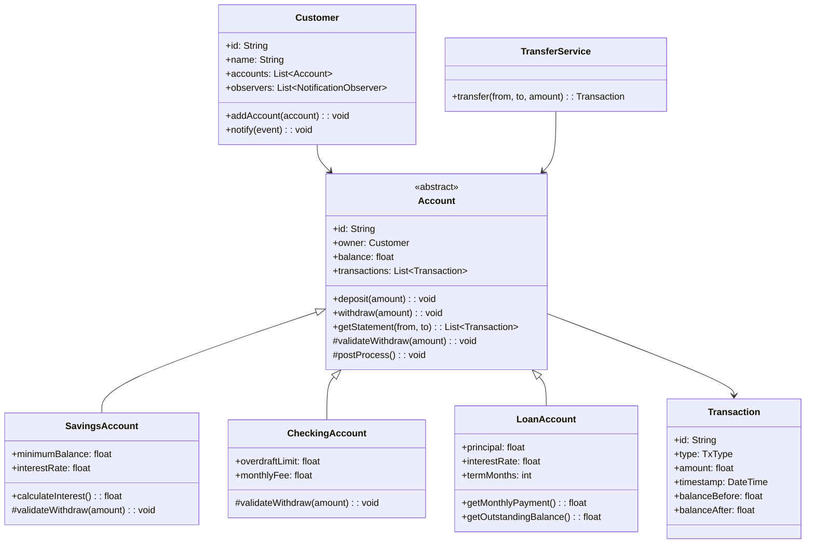
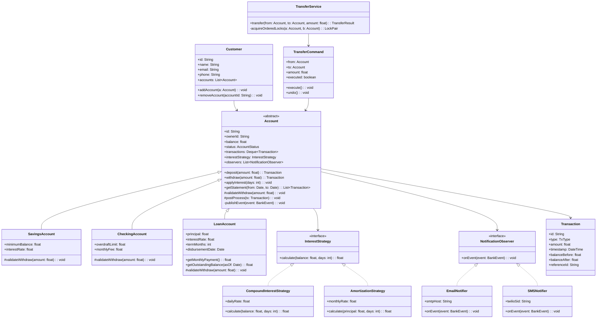
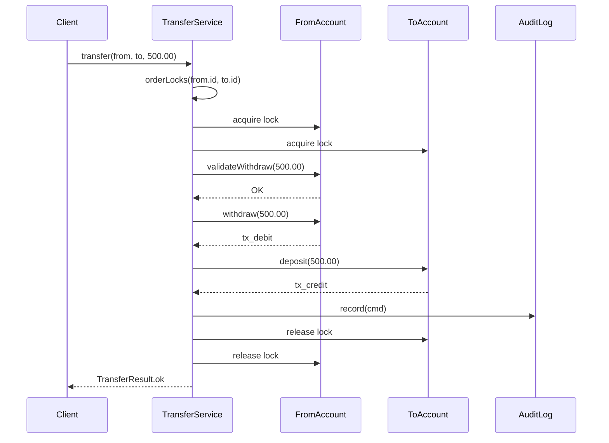
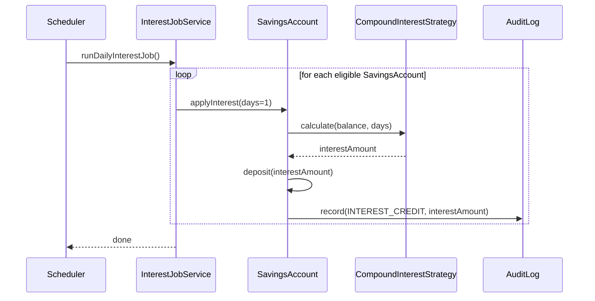

# Design a Banking System (OOD)

**Difficulty**: 🟡 Intermediate
**Codemania**: #122
**Interview Frequency**: High

---

## Problem Statement

Model a banking system that supports multiple account types, atomic fund transfers, transaction history, and real-time notifications. The OOD challenge is extensibility — adding a new account type or notification channel must not require changes to existing account logic. A naive implementation uses large `if/else` chains on account type and breaks when the bank introduces new products.

---

## Functional Requirements

- Open and close accounts (Savings, Checking, Loan)
- Deposit and withdraw from any account type
- Transfer funds between accounts atomically
- Calculate interest on savings/loan accounts (different formulas)
- Notify customer on low balance or unusual transaction
- Full transaction audit log (last 100 transactions per account)

---

## Core Entities

| Class | Responsibility |
|-------|---------------|
| `Account` | Abstract base: balance, ID, owner, deposit/withdraw skeleton |
| `SavingsAccount` | Monthly compound interest, minimum balance enforcement |
| `CheckingAccount` | Overdraft allowance, flat monthly fee |
| `LoanAccount` | Outstanding principal + accrued interest, amortization |
| `Transaction` | Immutable record: type, amount, timestamp, before/after balance |
| `Customer` | Personal details, list of accounts, notification preferences |
| `Branch` | Contains customers and ATMs; region-level limits |
| `ATM` | Subset of banking ops: withdraw, deposit, balance check |
| `InterestStrategy` | Interface: `calculateInterest(account, days): float` |
| `TransactionCommand` | Encapsulates an operation for undo/redo and audit |

---

## Class Diagram



---

## Design Patterns Used

### 1. Template Method — `Account.withdraw()`

**Why it fits**: Every account type shares the same transaction lifecycle — validate → debit → record → post-process. Only the validation rule differs. Template Method lets the base class own the algorithm skeleton while subclasses fill in the variable step.

```
Account (abstract):
  withdraw(amount):
    validateWithdraw(amount)          // hook — subclass defines rules
    balance -= amount
    tx = new Transaction(DEBIT, amount, balance+amount, balance)
    transactions.add(tx)
    postProcess()                     // hook — e.g. low-balance alert

SavingsAccount:
  validateWithdraw(amount):
    if balance - amount < minimumBalance:
      throw InsufficientFundsException

CheckingAccount:
  validateWithdraw(amount):
    if balance + overdraftLimit < amount:
      throw OverdraftLimitExceededException
```

### 2. Strategy — Interest Calculation

**Why it fits**: Savings uses compound interest; loans use amortization; checking has no interest. The formula is a hot-swappable behavior, not a fixed inheritance rule. Injecting the strategy at construction means adding a new account product is one new class.

```
interface InterestStrategy:
  calculateInterest(balance: float, days: int): float

CompoundInterestStrategy:
  calculateInterest(balance, days):
    return balance * ((1 + dailyRate)^days - 1)

AmortizationStrategy:
  calculateInterest(principal, days):
    return principal * monthlyRate * (days / 30)

SavingsAccount(interestStrategy: InterestStrategy)
LoanAccount(interestStrategy: InterestStrategy)
```

### 3. Observer — Low Balance Notification

**Why it fits**: The account should not know about SMS, push, or email. Observer decouples event source (account state change) from notification channels. New channels plug in without touching `Account`.

```
interface NotificationObserver:
  onEvent(event: BankEvent): void

class EmailNotifier implements NotificationObserver
class SMSNotifier implements NotificationObserver
class PushNotifier implements NotificationObserver

Account:
  observers: List<NotificationObserver>
  postProcess():
    if balance < LOW_BALANCE_THRESHOLD:
      publish(new LowBalanceEvent(this))

  publish(event):
    for obs in observers: obs.onEvent(event)
```

### 4. Command — Atomic Transfer + Undo

**Why it fits**: A fund transfer is two operations (debit + credit) that must be atomic. Wrapping them in a `TransferCommand` lets us execute both, roll back on failure, and store the command for audit replay.

```
class TransferCommand:
  from: Account
  to: Account
  amount: float
  executed: boolean

  execute():
    from.withdraw(amount)
    to.deposit(amount)
    executed = true

  undo():
    if executed:
      to.withdraw(amount)
      from.deposit(amount)
      executed = false
```

---

## Key Method: `transfer(from, to, amount)`

The transfer operation must be atomic — partial execution leaves both accounts in an inconsistent state.

```
TransferService:
  transfer(from: Account, to: Account, amount: float): TransferResult
    // 1. Validate both accounts are active
    if from.status != ACTIVE or to.status != ACTIVE:
      throw AccountNotActiveException

    // 2. Validate sufficient funds (before acquiring locks)
    if from.balance < amount:
      throw InsufficientFundsException

    // 3. Acquire locks in deterministic order to prevent deadlock
    lock1, lock2 = orderLocks(from.id, to.id)
    acquire(lock1)
    acquire(lock2)

    try:
      cmd = new TransferCommand(from, to, amount)
      cmd.execute()
      auditLog.record(cmd)
      return TransferResult.success(cmd)
    catch Exception e:
      cmd.undo()
      throw e
    finally:
      release(lock2)
      release(lock1)
```

**Atomicity guarantee**: Lock ordering prevents deadlock when two concurrent transfers cross each other (A→B and B→A). The `undo()` in the catch ensures both accounts stay consistent on failure.

---

## Design Decisions & Trade-offs

| Decision | Option A | Option B | Choice |
|----------|----------|----------|--------|
| Account hierarchy | Inheritance | Composition | Inheritance — accounts share identity fields; behavior variation is limited and mapped 1:1 to type |
| Transaction storage | In-memory list (last 100) | DB-backed audit table | In-memory for OOD interview; in production, append-only DB table |
| Interest trigger | Scheduled job calls `applyInterest()` | Account self-calculates on every read | Scheduled job — avoids "phantom balance" inconsistency on read |
| Notification coupling | Account calls notifier directly | Observer pattern | Observer — decouples channels; new notification type = new class |
| Transfer atomicity | Two-phase commit | Lock + undo | Lock + undo for OOD scope; 2PC in distributed context |

---

## Top Interview Questions

| Question | What It Tests |
|----------|--------------|
| How would you add a new "Premium Savings" account with a tiered interest rate without changing `Account`? | Open/Closed Principle, Strategy composition |
| How do you prevent a deadlock when two threads simultaneously transfer A→B and B→A? | Lock ordering, concurrency awareness |
| How would you implement a monthly statement that groups transactions by category? | Iterator pattern, aggregate operations |

---

## Related Concepts

- [ATM System OOD for state machine and single-machine design](./atm-system)
- [Vending Machine OOD for simpler state machine comparison](./vending-machine)

---

## Class Design (Full)

The diagram below expands on the core class hierarchy to include the Strategy, Observer, and Command participants alongside account types:



---

## Component Deep Dive 1: Atomic Transfer Service

The `TransferService` is the most safety-critical component in the entire design. A fund transfer touches two account balances and must complete entirely or not at all — partial execution is a financial loss.

### Why naive approaches fail

The simplest implementation calls `from.withdraw(amount)` followed by `to.deposit(amount)`. This breaks in three ways:

1. **Crash between the two calls** — `from` is debited; system restarts; `to` never receives the credit. Money vanishes.
2. **Concurrent transfer deadlock** — Thread 1 transfers A→B and Thread 2 transfers B→A. Thread 1 locks A then waits for B. Thread 2 locks B then waits for A. Both threads wait forever.
3. **Double-check race** — Thread 1 reads `from.balance = 500`, decides the transfer is valid, is suspended; Thread 2 also reads `from.balance = 500`, executes a 400-unit transfer; Thread 1 resumes and executes a 300-unit transfer. Total debited: 700. Total credited: 300+400=700. Balance goes negative.

### Correct implementation: deterministic lock ordering

Deadlock prevention uses a canonical rule: always acquire locks in ascending account-ID order regardless of the transfer direction. If both threads want locks for A and B, they both request lock(A) first. Only one gets it. The other waits. No circular wait, no deadlock.

```
TransferService.transfer(from, to, amount):
  // Guard against self-transfer
  if from.id == to.id: throw SameAccountException

  // Validate before locking (reduces lock contention)
  if amount <= 0: throw InvalidAmountException

  // Canonical lock order
  first, second = (from, to) if from.id < to.id else (to, from)

  synchronized(first):
    synchronized(second):
      // Re-check balance inside lock (balance could have changed)
      if from.balance < amount:
        throw InsufficientFundsException

      cmd = TransferCommand(from, to, amount)
      try:
        cmd.execute()
        auditLog.append(cmd)
        return TransferResult.ok(cmd)
      catch any:
        cmd.undo()
        throw
```

### Sequence diagram: successful transfer



### Transfer implementation options

| Approach | Latency | Throughput | Trade-off |
|----------|---------|------------|-----------|
| Synchronized lock + undo (chosen) | ~0.1 ms in-process | ~50k/sec single JVM | Simple; breaks at multi-node scale |
| Database transaction (ACID) | ~5–20 ms per transfer | ~5k/sec (RDS) | Correct at scale; requires DB round-trip |
| Two-phase commit (distributed) | ~50–200 ms | ~500/sec | Correct across microservices; operationally complex |
| Saga pattern (eventual consistency) | ~100–500 ms | ~10k/sec | High throughput; requires compensating transactions |

---

## Component Deep Dive 2: Interest Strategy and Scheduled Application

The `InterestStrategy` interface is a classic Strategy pattern, but the operational design — when and how interest is applied — matters as much as the formula.

### Why inline calculation breaks at scale

A common mistake is to calculate interest on every balance read:

```
SavingsAccount.getBalance():
  return principal + calculateAccruedInterest(lastInterestDate, now)
```

This creates a "phantom balance" — the displayed balance includes interest not yet posted. When the customer transfers the phantom balance, the actual posting job later finds insufficient funds and fails. At 1M accounts, running this formula on every read also wastes CPU.

### Correct approach: scheduled posting job

A nightly batch job (or end-of-month job) calls `account.applyInterest(daysSinceLast)` for every eligible account. The interest is posted as a real `CREDIT` transaction and the balance is updated atomically. The strategy object is injected at account creation and can be swapped via configuration (e.g., promotional rate change) without touching the account class.



### Behavior at 10x load

With 100k accounts the nightly job runs in seconds. At 1M accounts it takes minutes (bulk SQL UPDATE is the production answer). At 10M accounts the job must be parallelized across partitions by account-ID range. The OOD design is unchanged — only the job runner changes, not the `InterestStrategy` classes.

| Strategy Class | Formula | Typical Rate | Used For |
|----------------|---------|--------------|----------|
| `CompoundInterestStrategy` | `P × ((1 + r/365)^d − 1)` | 4–5% APY | Savings accounts |
| `AmortizationStrategy` | `P × r/12` per month | 8–24% APR | Loan accounts |
| `ZeroInterestStrategy` | Always returns 0 | 0% | Checking accounts |

---

## Component Deep Dive 3: Transaction Audit Log

Every deposit, withdrawal, transfer credit, transfer debit, and interest posting must be recorded as an immutable `Transaction` object. This is the audit trail regulators require and customers depend on.

### Internal mechanics

`Account` maintains a bounded `Deque<Transaction>` capped at 100 entries (last 100 transactions in-memory for the OOD interview scope). Each `Transaction` is constructed inside `deposit()` and `withdraw()` after the balance mutation, capturing `balanceBefore` and `balanceAfter`. It is append-only — no `Transaction` is ever modified or deleted in memory.

Transactions carry a `referenceId` field: for a transfer, both the debit transaction on the source account and the credit transaction on the destination account share the same `referenceId` UUID. This makes reconciliation trivial — given any transaction, you can find its counterpart.

### Extension to durable storage

The in-memory deque works for OOD interviews but not production. The natural extension is:

1. `Account` fires an event after each balance change.
2. A `TransactionRepository` subscriber persists the event to an append-only `transactions` table.
3. Statement queries (`getStatement(from, to)`) hit the DB, not memory.

This swap requires zero changes to `Account`, `SavingsAccount`, or the strategy classes — the deque and the DB-backed repository both implement a `TransactionStore` interface.

---

## Design Patterns Applied

### 1. Template Method — `Account.withdraw()` / `Account.deposit()`

The abstract `Account` class owns the algorithm skeleton for every balance mutation:
1. Validate the operation (subclass hook)
2. Mutate the balance
3. Create and append the immutable `Transaction`
4. Post-process (subclass hook — fires observers)

Only steps 1 and 4 vary by account type. The invariant steps (2, 3) can never be accidentally skipped by a subclass because they live in the base class. Without Template Method, each subclass would duplicate the transaction recording logic and some would inevitably get it wrong.

### 2. Strategy — `InterestStrategy`

`InterestStrategy` separates the interest formula from account identity. A `SavingsAccount` holding a `CompoundInterestStrategy` is open to extension (inject a new strategy class) but closed to modification (no `if accountType == "SAVINGS_PREMIUM"` branches needed). Adding a tiered-rate promotional strategy for a new account product requires one new class and one configuration change.

### 3. Observer — `NotificationObserver`

The account publishes `BankEvent` objects; registered observers consume them. The account never imports `EmailNotifier` or `SMSNotifier`. New channels (Slack, webhook, in-app) are added by implementing `NotificationObserver` and registering it on the customer's account — zero changes to account logic.

### 4. Command — `TransferCommand`

`TransferCommand` is a value object that encapsulates two operations as a unit. It provides:
- **Execute**: debit source, credit destination
- **Undo**: credit source, debit destination
- **Auditability**: the command object can be serialized and stored as a full record of what happened

The Command pattern also makes replay possible: if you re-execute stored commands in order you can reconstruct any account's balance at any point in time.

---

## SOLID Principles

### Single Responsibility Principle

Each class has one reason to change:
- `Account` changes only if the deposit/withdraw lifecycle changes.
- `CompoundInterestStrategy` changes only if the compound formula changes.
- `EmailNotifier` changes only if email delivery mechanics change.
- `TransferService` changes only if transfer coordination rules change.

### Open/Closed Principle

Adding a new account product (e.g., "Youth Savings" with a higher minimum balance and a fixed 6% rate) requires:
1. A new `YouthSavingsAccount extends SavingsAccount` (or `extends Account`)
2. No changes to existing `Account`, `SavingsAccount`, `TransferService`, or any notification class

Adding a new notification channel:
1. Implement `NotificationObserver`
2. Register it — no changes anywhere else

### Liskov Substitution Principle

Every concrete `Account` subclass can substitute for `Account` without breaking `TransferService`. `TransferService` calls `from.withdraw(amount)` and `to.deposit(amount)` — it does not check the runtime type. Any `Account` subclass that correctly implements `validateWithdraw()` will work correctly in a transfer.

### Interface Segregation Principle

`InterestStrategy` is a focused single-method interface. `NotificationObserver` is a focused single-method interface. Neither forces implementors to implement irrelevant methods.

### Dependency Inversion Principle

`Account` depends on the `InterestStrategy` interface, not on `CompoundInterestStrategy`. `Account` depends on the `NotificationObserver` interface, not on `EmailNotifier`. `TransferService` depends on the `Account` abstraction. All high-level modules depend on abstractions; all details depend on abstractions.

---

## Concurrency and Thread Safety

### Concurrent operations that can collide

| Operation Pair | Collision Risk | Safe Approach |
|----------------|---------------|---------------|
| Two withdrawals on same account | Race: both pass balance check, both execute → overdraft | `synchronized` on account instance |
| Transfer A→B and Transfer B→A | Deadlock | Canonical lock ordering (lower ID first) |
| Interest posting + concurrent withdrawal | Balance inconsistency | Interest job acquires account lock before posting |
| Balance read during transfer | Stale read | Use `synchronized` accessor or `volatile` field |

### Lock design rules

1. **Always lock a single account for single-account ops** — `synchronized(account)` in `deposit()` and `withdraw()`.
2. **Always lock in ascending account-ID order for transfers** — prevents circular wait.
3. **Never hold a lock across I/O** — if the transaction is being persisted to a DB, release the in-memory lock first (or use optimistic locking on the DB row).
4. **Prefer fine-grained locks** — one lock per account instance, not one global bank lock. A global lock serializes all operations across the entire bank.

### Thread-safe `balance` field

In Java: declare `balance` as `volatile` and access it only inside synchronized methods. In Python: use `threading.Lock()` per account instance. The `transactions` deque must also be accessed inside the same lock to keep `balanceBefore` / `balanceAfter` consistent with the actual balance at the time of the transaction.

---

## Extension Points

### How to add "Premium Savings" with a tiered interest rate

```
class TieredInterestStrategy implements InterestStrategy:
  tiers: List~(threshold: float, rate: float)~

  calculate(balance, days):
    for threshold, rate in tiers (descending):
      if balance >= threshold:
        return balance * ((1 + rate/365)^days - 1)
    return 0.0

// At construction:
premiumAccount = SavingsAccount(
  interestStrategy = TieredInterestStrategy([
    (100_000, 0.055),   // 5.5% on balances ≥ $100k
    (10_000,  0.045),   // 4.5% on balances ≥ $10k
    (0,       0.030),   // 3.0% otherwise
  ]),
  minimumBalance = 1_000
)
```

No changes to `Account`, `SavingsAccount`, `TransferService`, or any observer.

### How to add a "Freeze Account" feature

Add `FROZEN` to the `AccountStatus` enum. Override `validateWithdraw()` in a `FreezableAccount` mixin (or add a status check in the base class `validateWithdraw()` before delegating to the subclass hook). All transfer operations flow through `withdraw()` and `deposit()`, so freeze enforcement is automatic.

### How to add transaction categories (for monthly statement summaries)

Add a `category: TxCategory` field to `Transaction` (SALARY_CREDIT, RENT_DEBIT, ATM_WITHDRAWAL, etc.). Add a `CategoryClassifier` strategy injected into `Account`. On every transaction creation, call `classifier.classify(tx)` to populate the category. `getStatement()` can then group and aggregate by category without changing `Account`.

---

## Data Model

```sql
-- Accounts table (one row per account)
CREATE TABLE accounts (
    account_id       VARCHAR(36)      PRIMARY KEY,       -- UUID
    customer_id      VARCHAR(36)      NOT NULL,
    account_type     ENUM('SAVINGS','CHECKING','LOAN') NOT NULL,
    status           ENUM('ACTIVE','CLOSED','FROZEN') NOT NULL DEFAULT 'ACTIVE',
    balance          DECIMAL(18,2)    NOT NULL DEFAULT 0.00,
    currency         CHAR(3)          NOT NULL DEFAULT 'USD',
    interest_rate    DECIMAL(6,4)     NOT NULL DEFAULT 0.0000, -- e.g. 0.0450 = 4.50%
    minimum_balance  DECIMAL(18,2)    NOT NULL DEFAULT 0.00,
    overdraft_limit  DECIMAL(18,2)    NOT NULL DEFAULT 0.00,
    term_months      SMALLINT,                                 -- NULL for non-loan
    opened_at        TIMESTAMP        NOT NULL DEFAULT CURRENT_TIMESTAMP,
    closed_at        TIMESTAMP,
    INDEX idx_customer (customer_id)
);

-- Transactions table (append-only audit log)
CREATE TABLE transactions (
    transaction_id   VARCHAR(36)      PRIMARY KEY,
    account_id       VARCHAR(36)      NOT NULL,
    type             ENUM('DEPOSIT','WITHDRAWAL','TRANSFER_DEBIT',
                          'TRANSFER_CREDIT','INTEREST_CREDIT',
                          'FEE_DEBIT','REVERSAL') NOT NULL,
    amount           DECIMAL(18,2)    NOT NULL,
    balance_before   DECIMAL(18,2)    NOT NULL,
    balance_after    DECIMAL(18,2)    NOT NULL,
    reference_id     VARCHAR(36),     -- shared UUID for transfer pairs
    description      VARCHAR(255),
    created_at       TIMESTAMP        NOT NULL DEFAULT CURRENT_TIMESTAMP,
    INDEX idx_account_time (account_id, created_at DESC),
    INDEX idx_reference   (reference_id)
) ENGINE=InnoDB;

-- Customers table
CREATE TABLE customers (
    customer_id      VARCHAR(36)      PRIMARY KEY,
    full_name        VARCHAR(200)     NOT NULL,
    email            VARCHAR(320)     NOT NULL UNIQUE,
    phone            VARCHAR(20),
    kyc_status       ENUM('PENDING','VERIFIED','REJECTED') NOT NULL DEFAULT 'PENDING',
    created_at       TIMESTAMP        NOT NULL DEFAULT CURRENT_TIMESTAMP,
    INDEX idx_email  (email)
);

-- Notification preferences
CREATE TABLE notification_preferences (
    customer_id      VARCHAR(36)      NOT NULL,
    channel          ENUM('EMAIL','SMS','PUSH') NOT NULL,
    event_type       ENUM('LOW_BALANCE','LARGE_TRANSACTION','LOGIN','ALL') NOT NULL,
    enabled          BOOLEAN          NOT NULL DEFAULT TRUE,
    threshold        DECIMAL(18,2),   -- e.g. low-balance threshold = 100.00
    PRIMARY KEY (customer_id, channel, event_type)
);
```

---

## Scale Bottlenecks

| Traffic Level | Component That Breaks | Symptoms | Mitigation |
|---------------|----------------------|----------|------------|
| 10x baseline (100k transfers/day) | In-memory account locks | Lock contention; transfer latency spikes to 50–200ms | Move to DB row-level locking; use `SELECT FOR UPDATE` |
| 100x baseline (1M transfers/day) | Single `transactions` table | Slow index scans for statements; INSERT throughput ceiling ~5k/sec | Partition `transactions` by `account_id` hash; archive rows older than 90 days |
| 1000x baseline (10M transfers/day) | Monolithic `TransferService` | Single-process throughput ceiling ~50k transfers/sec; no horizontal scale | Split into transfer microservice; use outbox pattern + Kafka for durable event delivery |
| 10000x baseline (100M transfers/day, e.g. Visa scale) | Any centralized coordinator | Network partition causes split-brain balance | Move to eventual consistency with saga pattern; reconcile via nightly settlement jobs |

---

## How Nubank Built This

Nubank (Brazil), the world's largest digital bank with 100M+ customers and 85M active accounts as of 2024, built their core banking system on Clojure and Datomic (an immutable, append-only database) running on AWS.

**Technology choices:**
- **Datomic** as the account ledger — every fact is stored with a transaction timestamp and is never overwritten. The equivalent of the OOD `transactions: List<Transaction>` deque is the entire database; balance is always derived by replaying or querying the immutable log. This eliminates the "phantom balance" problem entirely.
- **Clojure** for the business logic layer — immutable data structures by default make the equivalent of `Transaction` objects inherently thread-safe.
- **Kafka** for event streaming — every account mutation fires an event consumed by notification services, fraud detection, and reporting pipelines. This is the production equivalent of the Observer pattern.
- **Core.async** (Clojure's CSP channels) for concurrency — rather than Java-style synchronized locks, transfer operations are serialized through a per-account agent (actor model), eliminating lock ordering complexity.

**Specific numbers:**
- 85M+ active accounts, processing over 7M transactions per day (2024)
- P99 transaction latency under 200ms end-to-end
- Zero planned downtime for core ledger upgrades (Datomic's immutability makes schema migration a read concern, not a write concern)

**Non-obvious decision:** Nubank chose to derive the current balance from the transaction log on every read rather than storing a mutable balance field. This trades read CPU for write simplicity and eliminates the entire class of balance-inconsistency bugs that plague systems with mutable balance fields. The OOD interview design stores mutable `balance` for simplicity; in production the correct answer is "balance is a view over the transaction log."

Source: Nubank Engineering Blog — ["How Nubank Uses Datomic"](https://building.nubank.com.br/working-with-datomic-ten-years-later/) and Clojure/conj 2019 talk by Nubank engineers.

---

## Interview Angle

**What the interviewer is testing:** Whether you can apply extensibility patterns (Strategy, Observer, Template Method) to a domain with real consistency requirements, and whether you understand the concurrency implications of shared mutable state.

**Common mistakes candidates make:**

1. **Using a single `if/else` chain on account type in `withdraw()`** — e.g., `if type == SAVINGS: check minimumBalance; else if type == CHECKING: check overdraft`. This violates OCP and forces a code change every time the bank launches a new product.

2. **Ignoring atomicity in `transfer()`** — implementing transfer as two independent `withdraw()` + `deposit()` calls with no locking. Interviewers specifically probe this: "what happens if the server crashes after the withdrawal but before the deposit?" The answer must include either locks + undo or a Command wrapping both.

3. **Locking on `this` inside `withdraw()` and `deposit()` only** — this protects single-account ops but does not prevent deadlock in `transfer()`. Candidates who lock per-method but don't explain lock ordering will be caught with the follow-up: "what if A→B and B→A happen simultaneously?"

**The insight that separates good from great answers:** Proposing that `balance` should be *derived* from the immutable transaction log rather than stored as a mutable field. This eliminates the entire race-condition category on balance reads, makes auditing trivial, and is how production banking systems (Nubank, Monzo, Stripe's ledger) actually work. Mentioning this — even as "in production I would consider an append-only ledger approach" — signals senior-level thinking.

---

## Key Numbers to Remember

| Metric | Value | Context |
|--------|-------|---------|
| Lock acquisition overhead (JVM) | ~50–100 ns | Per `synchronized` block, uncontended |
| In-process transfer throughput | ~50,000/sec | Single JVM, in-memory accounts, no I/O |
| DB-backed transfer throughput | ~3,000–5,000/sec | PostgreSQL `SELECT FOR UPDATE` + row lock |
| `transactions` table insert rate | ~5,000 rows/sec | Single PostgreSQL instance before partitioning |
| Nubank daily transaction volume | 7M+ transactions/day | 85M active accounts, 2024 |
| Nubank P99 transaction latency | < 200 ms | End-to-end including Kafka event publication |
| Typical savings APY (US, 2024) | 4.5–5.5% | High-yield savings; daily compound |
| Typical overdraft fee | $25–$35 | Per-event; CheckingAccount `postProcess()` hook |

---

## 📚 Resources & References

| Resource | Type | What You'll Learn |
|----------|------|------------------|
| [NeetCode OOD Playlist](https://www.youtube.com/@NeetCode) | 📺 YouTube | OOD interview walkthroughs |
| [ByteByteGo System Design](https://www.youtube.com/@ByteByteGo) | 📺 YouTube | Banking system architecture |
| [Head First Design Patterns](https://www.oreilly.com/library/view/head-first-design/0596007124/) | 📖 Blog | Template Method, Strategy, Observer chapters |
| [Clean Code — Robert Martin](https://www.amazon.com/Clean-Code-Handbook-Software-Craftsmanship/dp/0132350882) | 📚 Book | SOLID principles in practice |
| [GoF Design Patterns](https://www.amazon.com/Design-Patterns-Elements-Reusable-Object-Oriented/dp/0201633612) | 📚 Book | Command, Observer, Strategy reference |
