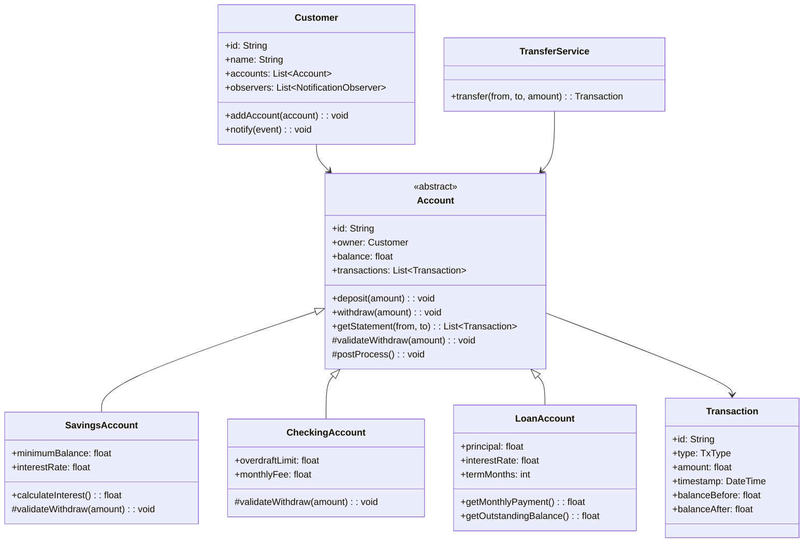

# Design a Banking System (OOD)

**Difficulty**: 🟡 Intermediate
**Codemania**: #122
**Interview Frequency**: High

---

## Problem Statement

Model a banking system that supports multiple account types, atomic fund transfers, transaction history, and real-time notifications. The OOD challenge is extensibility — adding a new account type or notification channel must not require changes to existing account logic. A naive implementation uses large `if/else` chains on account type and breaks when the bank introduces new products.

---

## Functional Requirements

- Open and close accounts (Savings, Checking, Loan)
- Deposit and withdraw from any account type
- Transfer funds between accounts atomically
- Calculate interest on savings/loan accounts (different formulas)
- Notify customer on low balance or unusual transaction
- Full transaction audit log (last 100 transactions per account)

---

## Core Entities

| Class | Responsibility |
|-------|---------------|
| `Account` | Abstract base: balance, ID, owner, deposit/withdraw skeleton |
| `SavingsAccount` | Monthly compound interest, minimum balance enforcement |
| `CheckingAccount` | Overdraft allowance, flat monthly fee |
| `LoanAccount` | Outstanding principal + accrued interest, amortization |
| `Transaction` | Immutable record: type, amount, timestamp, before/after balance |
| `Customer` | Personal details, list of accounts, notification preferences |
| `Branch` | Contains customers and ATMs; region-level limits |
| `ATM` | Subset of banking ops: withdraw, deposit, balance check |
| `InterestStrategy` | Interface: `calculateInterest(account, days): float` |
| `TransactionCommand` | Encapsulates an operation for undo/redo and audit |

---

## Class Diagram



---

## Design Patterns Used

### 1. Template Method — `Account.withdraw()`

**Why it fits**: Every account type shares the same transaction lifecycle — validate → debit → record → post-process. Only the validation rule differs. Template Method lets the base class own the algorithm skeleton while subclasses fill in the variable step.

```
Account (abstract):
  withdraw(amount):
    validateWithdraw(amount)          // hook — subclass defines rules
    balance -= amount
    tx = new Transaction(DEBIT, amount, balance+amount, balance)
    transactions.add(tx)
    postProcess()                     // hook — e.g. low-balance alert

SavingsAccount:
  validateWithdraw(amount):
    if balance - amount < minimumBalance:
      throw InsufficientFundsException

CheckingAccount:
  validateWithdraw(amount):
    if balance + overdraftLimit < amount:
      throw OverdraftLimitExceededException
```

### 2. Strategy — Interest Calculation

**Why it fits**: Savings uses compound interest; loans use amortization; checking has no interest. The formula is a hot-swappable behavior, not a fixed inheritance rule. Injecting the strategy at construction means adding a new account product is one new class.

```
interface InterestStrategy:
  calculateInterest(balance: float, days: int): float

CompoundInterestStrategy:
  calculateInterest(balance, days):
    return balance * ((1 + dailyRate)^days - 1)

AmortizationStrategy:
  calculateInterest(principal, days):
    return principal * monthlyRate * (days / 30)

SavingsAccount(interestStrategy: InterestStrategy)
LoanAccount(interestStrategy: InterestStrategy)
```

### 3. Observer — Low Balance Notification

**Why it fits**: The account should not know about SMS, push, or email. Observer decouples event source (account state change) from notification channels. New channels plug in without touching `Account`.

```
interface NotificationObserver:
  onEvent(event: BankEvent): void

class EmailNotifier implements NotificationObserver
class SMSNotifier implements NotificationObserver
class PushNotifier implements NotificationObserver

Account:
  observers: List<NotificationObserver>
  postProcess():
    if balance < LOW_BALANCE_THRESHOLD:
      publish(new LowBalanceEvent(this))

  publish(event):
    for obs in observers: obs.onEvent(event)
```

### 4. Command — Atomic Transfer + Undo

**Why it fits**: A fund transfer is two operations (debit + credit) that must be atomic. Wrapping them in a `TransferCommand` lets us execute both, roll back on failure, and store the command for audit replay.

```
class TransferCommand:
  from: Account
  to: Account
  amount: float
  executed: boolean

  execute():
    from.withdraw(amount)
    to.deposit(amount)
    executed = true

  undo():
    if executed:
      to.withdraw(amount)
      from.deposit(amount)
      executed = false
```

---

## Key Method: `transfer(from, to, amount)`

The transfer operation must be atomic — partial execution leaves both accounts in an inconsistent state.

```
TransferService:
  transfer(from: Account, to: Account, amount: float): TransferResult
    // 1. Validate both accounts are active
    if from.status != ACTIVE or to.status != ACTIVE:
      throw AccountNotActiveException

    // 2. Validate sufficient funds (before acquiring locks)
    if from.balance < amount:
      throw InsufficientFundsException

    // 3. Acquire locks in deterministic order to prevent deadlock
    lock1, lock2 = orderLocks(from.id, to.id)
    acquire(lock1)
    acquire(lock2)

    try:
      cmd = new TransferCommand(from, to, amount)
      cmd.execute()
      auditLog.record(cmd)
      return TransferResult.success(cmd)
    catch Exception e:
      cmd.undo()
      throw e
    finally:
      release(lock2)
      release(lock1)
```

**Atomicity guarantee**: Lock ordering prevents deadlock when two concurrent transfers cross each other (A→B and B→A). The `undo()` in the catch ensures both accounts stay consistent on failure.

---

## Design Decisions & Trade-offs

| Decision | Option A | Option B | Choice |
|----------|----------|----------|--------|
| Account hierarchy | Inheritance | Composition | Inheritance — accounts share identity fields; behavior variation is limited and mapped 1:1 to type |
| Transaction storage | In-memory list (last 100) | DB-backed audit table | In-memory for OOD interview; in production, append-only DB table |
| Interest trigger | Scheduled job calls `applyInterest()` | Account self-calculates on every read | Scheduled job — avoids "phantom balance" inconsistency on read |
| Notification coupling | Account calls notifier directly | Observer pattern | Observer — decouples channels; new notification type = new class |
| Transfer atomicity | Two-phase commit | Lock + undo | Lock + undo for OOD scope; 2PC in distributed context |

---

## Top Interview Questions

| Question | What It Tests |
|----------|--------------|
| How would you add a new "Premium Savings" account with a tiered interest rate without changing `Account`? | Open/Closed Principle, Strategy composition |
| How do you prevent a deadlock when two threads simultaneously transfer A→B and B→A? | Lock ordering, concurrency awareness |
| How would you implement a monthly statement that groups transactions by category? | Iterator pattern, aggregate operations |

---

## Related Concepts

- [ATM System OOD for state machine and single-machine design](./atm-system)
- [Vending Machine OOD for simpler state machine comparison](./vending-machine)

---

## 📚 Resources & References

| Resource | Type | What You'll Learn |
|----------|------|------------------|
| [NeetCode OOD Playlist](https://www.youtube.com/@NeetCode) | 📺 YouTube | OOD interview walkthroughs |
| [ByteByteGo System Design](https://www.youtube.com/@ByteByteGo) | 📺 YouTube | Banking system architecture |
| [Head First Design Patterns](https://www.oreilly.com/library/view/head-first-design/0596007124/) | 📖 Blog | Template Method, Strategy, Observer chapters |
| [Clean Code — Robert Martin](https://www.amazon.com/Clean-Code-Handbook-Software-Craftsmanship/dp/0132350882) | 📚 Book | SOLID principles in practice |
| [GoF Design Patterns](https://www.amazon.com/Design-Patterns-Elements-Reusable-Object-Oriented/dp/0201633612) | 📚 Book | Command, Observer, Strategy reference |
