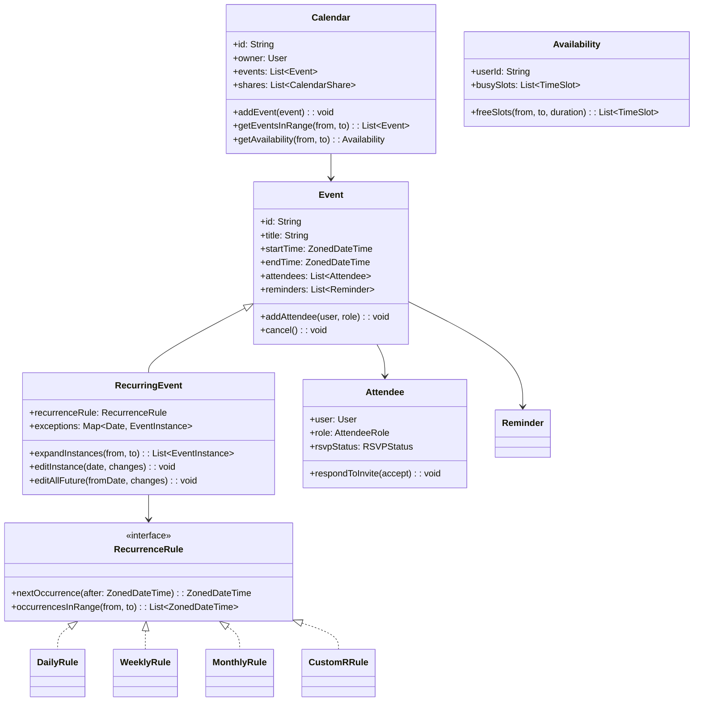

# Design a Calendar System (OOD)

**Difficulty**: 🔴 Advanced
**Codemania**: #134
**Interview Frequency**: High

---

## Problem Statement

Model a calendar system (Google Calendar-level) where users create one-time and recurring events, invite attendees, and check availability across time zones. The OOD challenge: recurring events have many expansion strategies (daily, weekly, monthly, custom RRULE) and modifying one occurrence of a recurring series must not corrupt the rest. Strategy pattern for recurrence rules and Composite for calendar hierarchy keep this extensible.

---

## Functional Requirements

- Create events: single, recurring (daily/weekly/monthly/custom)
- Invite attendees; attendees accept/decline
- Query availability: find open slots for N attendees across a duration
- Recurring events: edit one instance vs all future instances
- Reminders via email, push, or SMS at configurable lead time
- Share calendar with read or edit permissions

---

## Core Entities

| Class | Responsibility |
|-------|---------------|
| `Calendar` | Container for a user's events; shareable with permissions |
| `Event` | Core booking: title, start, end, location, description |
| `RecurringEvent` | Event with a recurrence rule; expands to instances on demand |
| `EventInstance` | Single occurrence of a `RecurringEvent`; may be overridden |
| `Attendee` | Link between User and Event: RSVP status |
| `Reminder` | Notification at N minutes before event; multiple per event |
| `Availability` | Computed free/busy blocks for a user over a date range |
| `TimeSlot` | Start + end DateTime pair; used in availability queries |
| `CalendarShare` | Grants another user read or edit access to a calendar |
| `RecurrenceRule` | Interface for recurrence expansion strategies |

---

## Class Diagram



---

## Design Patterns Used

### 1. Strategy — Recurrence Rules

**Why it fits**: Daily, weekly, monthly, and custom RRULE recurrences all answer the same question — "give me the occurrences in date range X to Y" — but with completely different algorithms. Strategy makes each rule independently testable and swappable without touching `RecurringEvent`.

```
interface RecurrenceRule:
  nextOccurrence(after: ZonedDateTime): ZonedDateTime
  occurrencesInRange(from: ZonedDateTime, to: ZonedDateTime): List<ZonedDateTime>

DailyRule(interval: int = 1):
  nextOccurrence(after):
    return after.plusDays(interval)

  occurrencesInRange(from, to):
    result = []
    current = seriesStart
    while current <= to:
      if current >= from: result.add(current)
      current = current.plusDays(interval)
    return result

WeeklyRule(daysOfWeek: Set<DayOfWeek>, interval: int = 1):
  occurrencesInRange(from, to):
    // Expand all matching weekdays within range

CustomRRule(rruleString: String):
  // Parse RFC 5545 RRULE; delegate to rrule library
  occurrencesInRange(from, to):
    return rruleParser.parse(rruleString).between(from, to)
```

### 2. Observer — Attendee Notification

**Why it fits**: When an event is updated (time change, cancellation), all attendees must be notified. When a new attendee is added, they receive an invite. The `Event` should not call email/push services directly — Observer pattern decouples the event lifecycle from delivery mechanisms.

```
class Event:
  observers: List<EventObserver>

  updateTime(newStart, newEnd): void
    startTime = newStart
    endTime = newEnd
    publish(EventUpdatedEvent(this, "time_change"))

  addAttendee(user, role): void
    attendee = new Attendee(user, role, PENDING)
    attendees.add(attendee)
    publish(AttendeeAddedEvent(this, attendee))

  publish(event): void
    for obs in observers: obs.onEvent(event)

class AttendeeNotifier implements EventObserver:
  onEvent(event):
    if event instanceof EventUpdatedEvent:
      for attendee in event.source.attendees:
        emailService.send(attendee.user, UpdateEmail(event.source))
```

### 3. Template Method — Event Creation with Invite Flow

**Why it fits**: Creating a single event and a recurring event both follow: validate → persist → invite attendees → schedule reminders. The shared skeleton lives in the base class; only the "persist" and "expand" steps differ.

```
abstract class EventCreationHandler:
  create(request: CreateEventRequest): Event
    validate(request)                   // shared validation
    event = buildEvent(request)         // hook — single vs recurring
    calendarRepo.save(event)
    sendInvites(event.attendees)        // shared
    scheduleReminders(event.reminders)  // shared
    return event

  abstract buildEvent(request): Event

class SingleEventHandler extends EventCreationHandler:
  buildEvent(request): Event
    return new Event(request.title, request.start, request.end)

class RecurringEventHandler extends EventCreationHandler:
  buildEvent(request): Event
    rule = recurrenceRuleFactory.create(request.rrule)
    return new RecurringEvent(request.title, request.start, request.end, rule)
```

### 4. Composite — Calendar Hierarchy

**Why it fits**: A user may have multiple calendars (Personal, Work, Team Shared) and view them in an overlay. Treating a `CalendarGroup` (overlay of multiple calendars) with the same interface as a single `Calendar` allows uniform availability queries.

```
interface CalendarNode:
  getEventsInRange(from, to): List<Event>
  getAvailability(from, to): Availability

class Calendar implements CalendarNode:
  getEventsInRange(from, to): List<Event>
    return events.filter(e -> e.overlaps(from, to))

class CalendarGroup implements CalendarNode:
  children: List<CalendarNode>

  getEventsInRange(from, to): List<Event>
    return children.flatMap(c -> c.getEventsInRange(from, to))
```

---

## Key Method: `findAvailability(attendees, duration)`

Finding a common open slot for multiple attendees is the classic interview follow-up — merge interval intersection.

```
AvailabilityService:
  findAvailability(
    attendees: List<User>,
    duration: Duration,
    searchWindow: TimeSlot
  ): List<TimeSlot>

    // 1. Collect all busy slots for all attendees
    allBusy = []
    for user in attendees:
      busy = user.calendar.getAvailability(searchWindow.start, searchWindow.end).busySlots
      allBusy.addAll(busy)

    // 2. Sort and merge overlapping busy slots
    allBusy.sortBy(s -> s.start)
    merged = mergeBusySlots(allBusy)

    // 3. Invert to find free slots within the window
    freeSlots = []
    cursor = searchWindow.start
    for busy in merged:
      if cursor < busy.start:
        freeSlots.add(new TimeSlot(cursor, busy.start))
      cursor = max(cursor, busy.end)
    if cursor < searchWindow.end:
      freeSlots.add(new TimeSlot(cursor, searchWindow.end))

    // 4. Filter by minimum duration
    return freeSlots.filter(s -> s.duration() >= duration)
```

---

## Design Decisions & Trade-offs

| Decision | Option A | Option B | Choice |
|----------|----------|----------|--------|
| Recurrence storage | RRULE string (compact) | Pre-expanded instances | RRULE string — expanding up-front wastes storage for far-future events |
| Edit recurring event | Edit all instances | Edit one / edit all future | Both — UI offers three choices; store exception map on RecurringEvent |
| Timezone handling | Store in UTC, convert on display | Store in local timezone | Store in UTC — avoids DST bugs; convert to user's tz on render |
| Conflict detection | Client-side only | Server-side on save | Server-side — client can be bypassed |

---

## Top Interview Questions

| Question | What It Tests |
|----------|--------------|
| A user in UTC+5 creates a weekly event at 9 AM — does it still show at 9 AM after a DST change? | Timezone and DST handling |
| How do you detect when a new event overlaps an existing one on the user's calendar? | Interval overlap detection |
| An attendee deletes a single instance of a recurring meeting — how is this stored? | Exception map on RecurringEvent |

---

## Related Concepts

- [Ride-Sharing Service OOD for time-slot and location-based matching](./ride-sharing-service)
- [Learning Management OOD for scheduling course deadlines](./learning-management)

---

## 📚 Resources & References

| Resource | Type | What You'll Learn |
|----------|------|------------------|
| [NeetCode OOD Playlist](https://www.youtube.com/@NeetCode) | 📺 YouTube | Strategy pattern and interval problems |
| [ByteByteGo System Design](https://www.youtube.com/@ByteByteGo) | 📺 YouTube | Google Calendar system design |
| [RFC 5545 — iCalendar Spec](https://datatracker.ietf.org/doc/html/rfc5545) | 📖 Blog | RRULE standard for recurrence rules |
| [Head First Design Patterns](https://www.oreilly.com/library/view/head-first-design/0596007124/) | 📚 Book | Strategy and Observer pattern chapters |
| [GoF Design Patterns](https://www.amazon.com/Design-Patterns-Elements-Reusable-Object-Oriented/dp/0201633612) | 📚 Book | Composite and Template Method reference |
