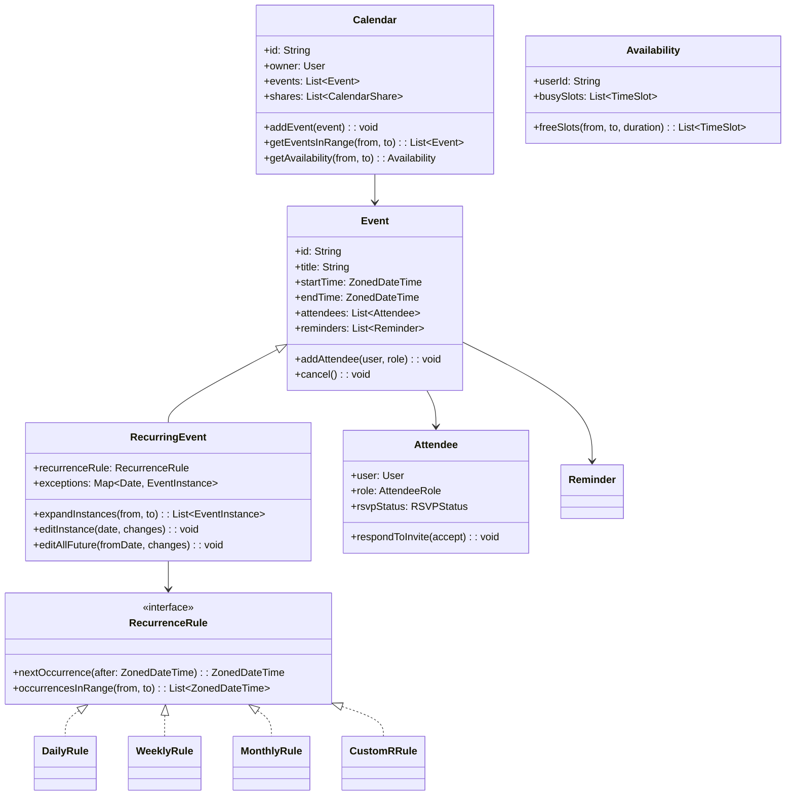
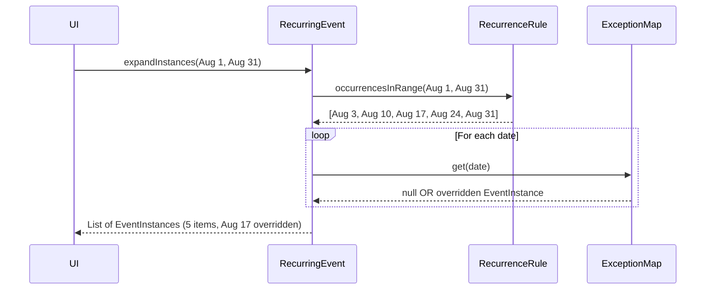
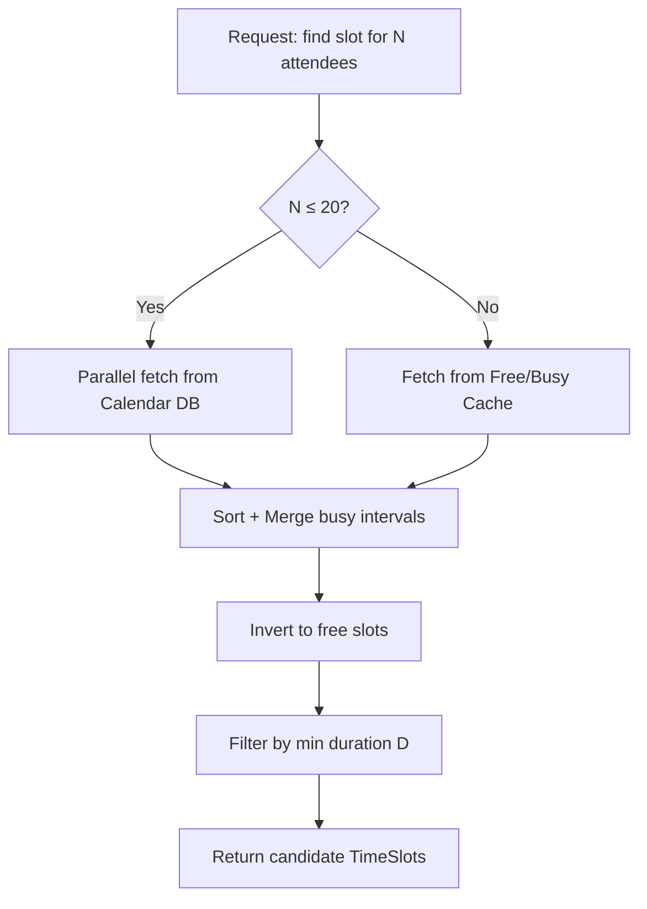
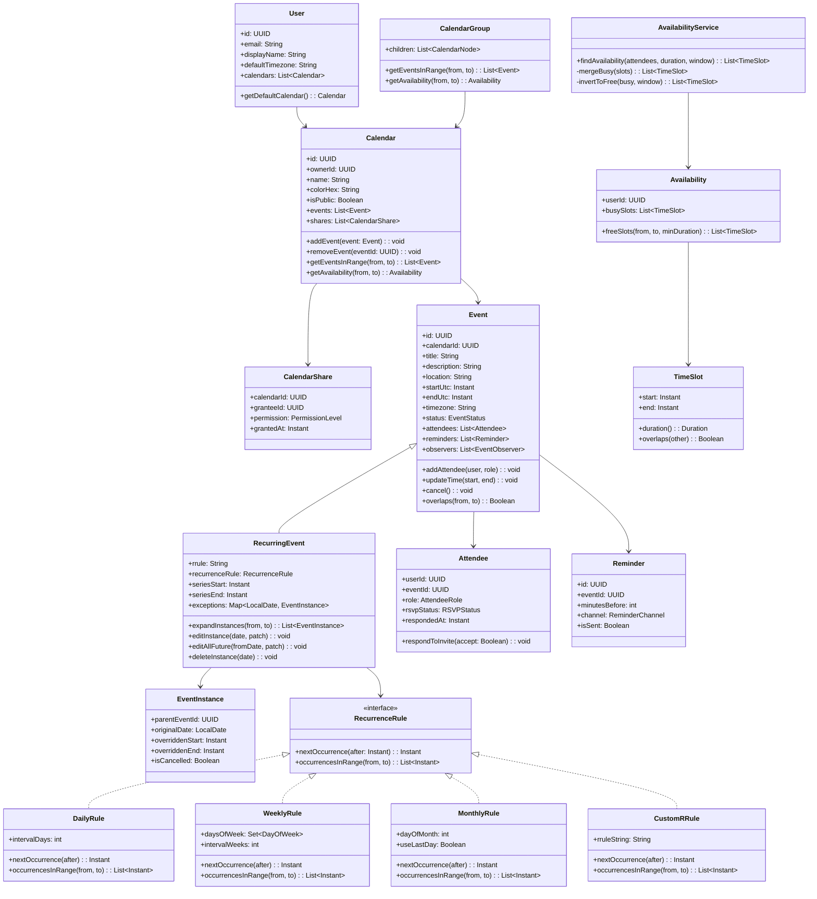

# Design a Calendar System (OOD)

**Difficulty**: 🔴 Advanced
**Codemania**: #134
**Interview Frequency**: High

---

## Problem Statement

Model a calendar system (Google Calendar-level) where users create one-time and recurring events, invite attendees, and check availability across time zones. The OOD challenge: recurring events have many expansion strategies (daily, weekly, monthly, custom RRULE) and modifying one occurrence of a recurring series must not corrupt the rest. Strategy pattern for recurrence rules and Composite for calendar hierarchy keep this extensible.

---

## Functional Requirements

- Create events: single, recurring (daily/weekly/monthly/custom)
- Invite attendees; attendees accept/decline
- Query availability: find open slots for N attendees across a duration
- Recurring events: edit one instance vs all future instances
- Reminders via email, push, or SMS at configurable lead time
- Share calendar with read or edit permissions

---

## Core Entities

| Class | Responsibility |
|-------|---------------|
| `Calendar` | Container for a user's events; shareable with permissions |
| `Event` | Core booking: title, start, end, location, description |
| `RecurringEvent` | Event with a recurrence rule; expands to instances on demand |
| `EventInstance` | Single occurrence of a `RecurringEvent`; may be overridden |
| `Attendee` | Link between User and Event: RSVP status |
| `Reminder` | Notification at N minutes before event; multiple per event |
| `Availability` | Computed free/busy blocks for a user over a date range |
| `TimeSlot` | Start + end DateTime pair; used in availability queries |
| `CalendarShare` | Grants another user read or edit access to a calendar |
| `RecurrenceRule` | Interface for recurrence expansion strategies |

---

## Class Diagram



---

## Design Patterns Used

### 1. Strategy — Recurrence Rules

**Why it fits**: Daily, weekly, monthly, and custom RRULE recurrences all answer the same question — "give me the occurrences in date range X to Y" — but with completely different algorithms. Strategy makes each rule independently testable and swappable without touching `RecurringEvent`.

```
interface RecurrenceRule:
  nextOccurrence(after: ZonedDateTime): ZonedDateTime
  occurrencesInRange(from: ZonedDateTime, to: ZonedDateTime): List<ZonedDateTime>

DailyRule(interval: int = 1):
  nextOccurrence(after):
    return after.plusDays(interval)

  occurrencesInRange(from, to):
    result = []
    current = seriesStart
    while current <= to:
      if current >= from: result.add(current)
      current = current.plusDays(interval)
    return result

WeeklyRule(daysOfWeek: Set<DayOfWeek>, interval: int = 1):
  occurrencesInRange(from, to):
    // Expand all matching weekdays within range

CustomRRule(rruleString: String):
  // Parse RFC 5545 RRULE; delegate to rrule library
  occurrencesInRange(from, to):
    return rruleParser.parse(rruleString).between(from, to)
```

### 2. Observer — Attendee Notification

**Why it fits**: When an event is updated (time change, cancellation), all attendees must be notified. When a new attendee is added, they receive an invite. The `Event` should not call email/push services directly — Observer pattern decouples the event lifecycle from delivery mechanisms.

```
class Event:
  observers: List<EventObserver>

  updateTime(newStart, newEnd): void
    startTime = newStart
    endTime = newEnd
    publish(EventUpdatedEvent(this, "time_change"))

  addAttendee(user, role): void
    attendee = new Attendee(user, role, PENDING)
    attendees.add(attendee)
    publish(AttendeeAddedEvent(this, attendee))

  publish(event): void
    for obs in observers: obs.onEvent(event)

class AttendeeNotifier implements EventObserver:
  onEvent(event):
    if event instanceof EventUpdatedEvent:
      for attendee in event.source.attendees:
        emailService.send(attendee.user, UpdateEmail(event.source))
```

### 3. Template Method — Event Creation with Invite Flow

**Why it fits**: Creating a single event and a recurring event both follow: validate → persist → invite attendees → schedule reminders. The shared skeleton lives in the base class; only the "persist" and "expand" steps differ.

```
abstract class EventCreationHandler:
  create(request: CreateEventRequest): Event
    validate(request)                   // shared validation
    event = buildEvent(request)         // hook — single vs recurring
    calendarRepo.save(event)
    sendInvites(event.attendees)        // shared
    scheduleReminders(event.reminders)  // shared
    return event

  abstract buildEvent(request): Event

class SingleEventHandler extends EventCreationHandler:
  buildEvent(request): Event
    return new Event(request.title, request.start, request.end)

class RecurringEventHandler extends EventCreationHandler:
  buildEvent(request): Event
    rule = recurrenceRuleFactory.create(request.rrule)
    return new RecurringEvent(request.title, request.start, request.end, rule)
```

### 4. Composite — Calendar Hierarchy

**Why it fits**: A user may have multiple calendars (Personal, Work, Team Shared) and view them in an overlay. Treating a `CalendarGroup` (overlay of multiple calendars) with the same interface as a single `Calendar` allows uniform availability queries.

```
interface CalendarNode:
  getEventsInRange(from, to): List<Event>
  getAvailability(from, to): Availability

class Calendar implements CalendarNode:
  getEventsInRange(from, to): List<Event>
    return events.filter(e -> e.overlaps(from, to))

class CalendarGroup implements CalendarNode:
  children: List<CalendarNode>

  getEventsInRange(from, to): List<Event>
    return children.flatMap(c -> c.getEventsInRange(from, to))
```

---

## Key Method: `findAvailability(attendees, duration)`

Finding a common open slot for multiple attendees is the classic interview follow-up — merge interval intersection.

```
AvailabilityService:
  findAvailability(
    attendees: List<User>,
    duration: Duration,
    searchWindow: TimeSlot
  ): List<TimeSlot>

    // 1. Collect all busy slots for all attendees
    allBusy = []
    for user in attendees:
      busy = user.calendar.getAvailability(searchWindow.start, searchWindow.end).busySlots
      allBusy.addAll(busy)

    // 2. Sort and merge overlapping busy slots
    allBusy.sortBy(s -> s.start)
    merged = mergeBusySlots(allBusy)

    // 3. Invert to find free slots within the window
    freeSlots = []
    cursor = searchWindow.start
    for busy in merged:
      if cursor < busy.start:
        freeSlots.add(new TimeSlot(cursor, busy.start))
      cursor = max(cursor, busy.end)
    if cursor < searchWindow.end:
      freeSlots.add(new TimeSlot(cursor, searchWindow.end))

    // 4. Filter by minimum duration
    return freeSlots.filter(s -> s.duration() >= duration)
```

---

## Design Decisions & Trade-offs

| Decision | Option A | Option B | Choice |
|----------|----------|----------|--------|
| Recurrence storage | RRULE string (compact) | Pre-expanded instances | RRULE string — expanding up-front wastes storage for far-future events |
| Edit recurring event | Edit all instances | Edit one / edit all future | Both — UI offers three choices; store exception map on RecurringEvent |
| Timezone handling | Store in UTC, convert on display | Store in local timezone | Store in UTC — avoids DST bugs; convert to user's tz on render |
| Conflict detection | Client-side only | Server-side on save | Server-side — client can be bypassed |

---

## Top Interview Questions

| Question | What It Tests |
|----------|--------------|
| A user in UTC+5 creates a weekly event at 9 AM — does it still show at 9 AM after a DST change? | Timezone and DST handling |
| How do you detect when a new event overlaps an existing one on the user's calendar? | Interval overlap detection |
| An attendee deletes a single instance of a recurring meeting — how is this stored? | Exception map on RecurringEvent |

---

## Related Concepts

- [Ride-Sharing Service OOD for time-slot and location-based matching](./ride-sharing-service)
- [Learning Management OOD for scheduling course deadlines](./learning-management)

---

## Component Deep Dive 1: RecurrenceRule Strategy Engine

The `RecurrenceRule` interface is the most critical architectural component in the calendar system. It is the contract that separates stable event infrastructure from volatile scheduling logic. Without this abstraction, every recurrence variant (daily, weekly, bi-weekly, monthly-on-weekday, custom) would require if/else branching inside `RecurringEvent`, making every new recurrence type a high-risk change to a central class.

**How It Works Internally**

Each concrete `RecurrenceRule` implementation encapsulates two behaviours: `nextOccurrence(after)` returns the single next date after a given point, and `occurrencesInRange(from, to)` returns the full list within a window. For `DailyRule`, this is trivial arithmetic. For `MonthlyRule`, it must handle edge cases: "every 31st" in February expands to the last day of February (per RFC 5545 §3.3.10). For `CustomRRule`, the implementation delegates to an RFC 5545 parser such as the `rrule.js` library, which handles BYMONTH, BYDAY, BYSETPOS, COUNT, and UNTIL modifiers.

**Why Naive Approaches Fail at Scale**

Storing pre-expanded event rows in the database for every occurrence seems simpler — one row per occurrence means a single indexed SELECT. But a user who creates a "daily standup, no end date" immediately generates tens of thousands of future rows. At Google Calendar's scale of 500 million users, even modest recurrence series produce billions of pre-expanded rows. Instead, the RRULE string is stored (average 60 bytes) and occurrences are computed on the fly during a date-range query. The computation cost for a 30-day window is O(occurrences_in_window) — negligible for all standard rules.

**Exception Overrides**

The `exceptions: Map<LocalDate, EventInstance>` field on `RecurringEvent` handles per-instance edits. When `expandInstances(from, to)` is called, it generates the base sequence from the rule, then replaces any date found in the exceptions map with the overridden `EventInstance`. This allows "edit this occurrence only" without touching the RRULE.



| Approach | Expansion Latency | Storage per Series | Trade-off |
|----------|------------------|--------------------|-----------|
| Pre-expand all instances | 0 ms (SELECT) | O(n × years) rows | Unbounded storage; backfill needed on RRULE edit |
| Compute on demand from RRULE | 1–5 ms | 1 row + 60-byte string | CPU per query; cached easily |
| Hybrid: expand 90-day rolling window | 0 ms for current quarter | O(90 days) rows per series | Complexity of expiry and re-expansion job |

The **compute on demand** approach is the industry standard, used by Google Calendar, Apple iCloud, and Microsoft Exchange. The 90-day hybrid is used in legacy Exchange environments to support fast free/busy lookups via pre-materialized availability blocks.

---

## Component Deep Dive 2: Availability Query Engine

The availability engine answers "when are all N attendees free for at least D minutes within window W?" It is the most latency-sensitive operation in the system because it runs interactively as the user adjusts meeting duration or window.

**Internal Mechanics**

The algorithm has four phases:

1. **Fetch busy slots** for all attendees in parallel — each user's busy list is retrieved from their calendar (or a dedicated free/busy cache).
2. **Sort by start time** — O(k log k) where k is total busy-slot count across all attendees.
3. **Merge overlapping intervals** — linear scan; tracks `mergeEnd = max(mergeEnd, slot.end)`.
4. **Invert to free slots** — linear scan over merged list; any gap longer than D is a candidate.

**Scale Behaviour at 10x Load**

At baseline (meeting organizer with 5 attendees, 2-week window), a typical user has ~10 events/week, so k ≈ 100. At 10x meeting requests per second with 500-person all-hands scheduling (k ≈ 10,000), sorting dominates at ~1 ms. At 100x with recursive org-tree lookups (N = 2,000 attendees), the bottleneck shifts to fetching individual busy lists — 2,000 serial DB reads at 1 ms each = 2 seconds. Mitigation: a **free/busy cache** (Redis, 15-minute TTL) reduces DB fan-out to near zero for repeat queries on the same attendees.



| Strategy | Latency at N=5 | Latency at N=500 | Notes |
|----------|---------------|-----------------|-------|
| Direct DB reads | 5 ms | 500 ms | Linear in N |
| Free/busy cache (Redis) | 2 ms | 20 ms | Cache miss = DB fallback |
| Pre-computed availability bitmap | <1 ms | <1 ms | 30-min granularity; 1 bit/slot |

---

## Component Deep Dive 3: Timezone and DST Handling

Timezone correctness is the single most common production bug in calendar systems. Naive systems store local time strings ("9:00 AM Monday") and break during DST transitions. The correct model stores a UTC epoch timestamp alongside the user's IANA timezone identifier (e.g., `America/New_York`), never a UTC offset such as `+05:30`.

**Why the offset-only approach fails**: UTC offsets change during DST. A meeting stored as `2024-03-09T09:00:00-05:00` (EST) becomes `2024-03-10T09:00:00-04:00` (EDT) after the spring-forward. If only the offset is stored and not the IANA zone name, the system cannot know whether the user intended "9 AM New York time always" or "9 AM UTC-5 always". Only the IANA zone name (`America/New_York`) encodes the DST rule.

**Recurring Events Across DST Boundaries**: When `WeeklyRule` expands instances, it must re-derive the local display time for each occurrence using the IANA zone, not the stored UTC offset. An "every Monday 9 AM" recurring event has UTC epoch values that shift by 1 hour at DST boundaries — this is correct behaviour. The `ZonedDateTime` type in Java (or `pytz`/`zoneinfo` in Python) handles this automatically when constructed from an IANA zone.

**Storage Decision**: Store `startUtc: TIMESTAMP` (UTC epoch), `endUtc: TIMESTAMP`, and `timezone: VARCHAR(64)` (IANA name). Display layer converts UTC → local using the stored IANA name. This ensures any future timezone database update (e.g., a country changing its DST rules) can be re-applied to stored events by recomputing UTC offsets.

---

## Class Design (Full Detail)



---

## Design Patterns Applied

### Strategy — RecurrenceRule

Each concrete rule (`DailyRule`, `WeeklyRule`, `MonthlyRule`, `CustomRRule`) implements the same two-method interface. `RecurringEvent` holds a reference to the interface and never checks the rule type. Adding a new recurrence type (e.g., `YearlyRule`) requires only a new class — zero changes to `RecurringEvent`. This is the Open/Closed Principle in action.

### Observer — Event Lifecycle Notifications

`Event` maintains a list of `EventObserver` instances. When state changes (attendee added, time updated, cancellation), the event calls `publish(DomainEvent)`. Concrete observers handle delivery: `EmailNotifier`, `PushNotifier`, `SlackNotifier`. The `Event` class knows nothing about delivery channels — new channels are added by registering new observers, not editing `Event`.

### Template Method — EventCreationHandler

`EventCreationHandler.create()` defines the fixed skeleton: validate → buildEvent → persist → sendInvites → scheduleReminders. The abstract `buildEvent()` hook is overridden by `SingleEventHandler` and `RecurringEventHandler`. Shared steps (validation, invite sending, reminder scheduling) are written once in the base class, guaranteeing consistency across event types.

### Composite — CalendarGroup

`Calendar` and `CalendarGroup` both implement `CalendarNode`. A `CalendarGroup` holds a list of `CalendarNode` children — each child may itself be a `CalendarGroup`. The `AvailabilityService` calls `getEventsInRange()` on a `CalendarNode` without knowing whether it is a single calendar or an overlay of ten. This enables features like "check availability across all team calendars" with no special casing.

### Factory — RecurrenceRuleFactory

`RecurrenceRuleFactory.create(request)` inspects the request fields and returns the appropriate concrete `RecurrenceRule`. This centralises the creation logic and prevents `RecurringEventHandler` from needing to branch on recurrence type.

```
class RecurrenceRuleFactory:
  create(request: CreateEventRequest): RecurrenceRule
    if request.rrule != null:
      return new CustomRRule(request.rrule)
    switch request.recurrenceType:
      case DAILY:   return new DailyRule(request.intervalDays)
      case WEEKLY:  return new WeeklyRule(request.daysOfWeek, request.intervalWeeks)
      case MONTHLY: return new MonthlyRule(request.dayOfMonth)
      default: throw new InvalidRecurrenceException()
```

---

## SOLID Principles

**Single Responsibility Principle**: `RecurrenceRule` implementations know only about date arithmetic. `AttendeeNotifier` knows only about sending messages. `AvailabilityService` knows only about interval merging. None of these classes has a second reason to change.

**Open/Closed Principle**: `RecurringEvent` is closed for modification. Adding `YearlyRule` opens only `RecurrenceRuleFactory` (one-line addition) and creates a new `YearlyRule` class. The existing `RecurringEvent`, `RecurrenceRule`, and all other rules are untouched. Same for `Observer`: adding `SlackNotifier` requires no changes to `Event`.

**Liskov Substitution Principle**: Any `RecurrenceRule` implementation can replace any other without breaking `RecurringEvent`. Any `CalendarNode` (single `Calendar` or `CalendarGroup`) can replace any other without breaking `AvailabilityService`. The subtypes honour the contracts of their interfaces.

**Interface Segregation Principle**: `RecurrenceRule` exposes exactly two methods. Callers needing only `nextOccurrence` (e.g., a reminder scheduler that fires one day before the next occurrence) are not forced to depend on `occurrencesInRange`. If `RecurrenceRule` had been combined with `Availability`, callers would depend on methods they do not use.

**Dependency Inversion Principle**: `RecurringEvent` depends on the `RecurrenceRule` interface, not on `DailyRule`. `Event` depends on the `EventObserver` interface, not on `EmailService`. High-level policy (`RecurringEvent` expansion) does not depend on low-level detail (specific date arithmetic or transport protocol).

---

## Concurrency and Thread Safety

**Concurrent Operations That Can Conflict**

1. Two users simultaneously accept an invitation to a meeting room with a 1-person capacity.
2. A user edits a recurring event's RRULE at the same time the availability service is expanding it.
3. Two organizers create meetings for the same attendee within overlapping time windows.

**Thread Safety Approaches**

For the invitation acceptance race (case 1), an optimistic lock on the `Event` row (a `version: Long` column) detects concurrent writes. The first writer increments the version; the second writer's UPDATE finds `version != expected` and retries. This is the same mechanism used in JPA `@Version` fields.

For recurring event RRULE edits (case 2), immutable value objects for `RecurrenceRule` eliminate the race entirely. Instead of mutating the rule object in place, `editAllFuture()` creates a new `RecurringEvent` for the tail of the series (tombstoning the original from the edit date onward) and persists it atomically. This is the "split series" approach used by Google Calendar and Microsoft Exchange.

For conflict detection (case 3), the server-side `ConflictChecker` runs inside a database transaction with a SELECT FOR UPDATE on the attendee's busy-slot index. No calendar event is saved until the conflict check completes, preventing phantom reads.

```
ConflictChecker:
  checkConflict(userId, newSlot):
    -- Run inside transaction with row-level lock
    BEGIN TRANSACTION
    SELECT * FROM events
    WHERE calendar_owner = userId
      AND start_utc < newSlot.end
      AND end_utc > newSlot.start
    FOR UPDATE
    -- If any row returned: throw ConflictException
    COMMIT
```

---

## Extension Points

**Adding a New Recurrence Type (e.g., Yearly)**

The design is closed for modification and open for extension:
1. Create `YearlyRule implements RecurrenceRule` with `nextOccurrence` and `occurrencesInRange`.
2. Add a one-line case to `RecurrenceRuleFactory.create()`.
3. No other class changes. Zero regression risk to daily/weekly/monthly paths.

**Adding a New Notification Channel (e.g., Slack)**

1. Create `SlackNotifier implements EventObserver` with `onEvent(domainEvent)`.
2. Register `SlackNotifier` with the `Event`'s observer list at configuration time (e.g., via dependency injection).
3. No changes to `Event`, `Attendee`, or existing notifiers.

**Adding a New Calendar View (e.g., Resource Calendar for meeting rooms)**

1. Create `ResourceCalendar implements CalendarNode`. A resource calendar tracks room bookings instead of personal events.
2. Add it as a child of the relevant `CalendarGroup`.
3. `AvailabilityService` treats it identically — `getAvailability()` on a `CalendarNode` returns busy slots regardless of whether it is a personal or resource calendar.

**Extending Attendee Roles (e.g., Optional vs Required)**

`AttendeeRole` is an enum. Extending it adds a new variant. The availability service already supports an `attendeeFilter` predicate — passing `role == REQUIRED` excludes optional attendees from the conflict check without changing the algorithm.

---

## Data Model

```sql
-- Users
CREATE TABLE users (
    id          UUID PRIMARY KEY DEFAULT gen_random_uuid(),
    email       VARCHAR(320) NOT NULL UNIQUE,
    display_name VARCHAR(256) NOT NULL,
    timezone    VARCHAR(64)  NOT NULL DEFAULT 'UTC',
    created_at  TIMESTAMPTZ  NOT NULL DEFAULT now()
);

-- Calendars
CREATE TABLE calendars (
    id          UUID PRIMARY KEY DEFAULT gen_random_uuid(),
    owner_id    UUID         NOT NULL REFERENCES users(id),
    name        VARCHAR(256) NOT NULL,
    color_hex   CHAR(7)      NOT NULL DEFAULT '#4285F4',
    is_public   BOOLEAN      NOT NULL DEFAULT FALSE,
    created_at  TIMESTAMPTZ  NOT NULL DEFAULT now()
);

CREATE INDEX idx_calendars_owner ON calendars(owner_id);

-- Calendar sharing permissions
CREATE TABLE calendar_shares (
    id           UUID PRIMARY KEY DEFAULT gen_random_uuid(),
    calendar_id  UUID         NOT NULL REFERENCES calendars(id) ON DELETE CASCADE,
    grantee_id   UUID         NOT NULL REFERENCES users(id),
    permission   VARCHAR(16)  NOT NULL CHECK (permission IN ('READ', 'EDIT')),
    granted_at   TIMESTAMPTZ  NOT NULL DEFAULT now(),
    UNIQUE(calendar_id, grantee_id)
);

-- Events (single and base of recurring series)
CREATE TABLE events (
    id              UUID         PRIMARY KEY DEFAULT gen_random_uuid(),
    calendar_id     UUID         NOT NULL REFERENCES calendars(id) ON DELETE CASCADE,
    title           VARCHAR(512) NOT NULL,
    description     TEXT,
    location        VARCHAR(512),
    start_utc       TIMESTAMPTZ  NOT NULL,
    end_utc         TIMESTAMPTZ  NOT NULL,
    timezone        VARCHAR(64)  NOT NULL,
    is_recurring    BOOLEAN      NOT NULL DEFAULT FALSE,
    rrule           VARCHAR(1024),          -- RFC 5545 RRULE string if recurring
    series_end_utc  TIMESTAMPTZ,            -- null = no end date
    status          VARCHAR(16)  NOT NULL DEFAULT 'CONFIRMED'
                                 CHECK (status IN ('CONFIRMED', 'TENTATIVE', 'CANCELLED')),
    version         BIGINT       NOT NULL DEFAULT 0,  -- optimistic lock
    created_at      TIMESTAMPTZ  NOT NULL DEFAULT now(),
    updated_at      TIMESTAMPTZ  NOT NULL DEFAULT now(),
    CHECK (end_utc > start_utc)
);

CREATE INDEX idx_events_calendar_time ON events(calendar_id, start_utc, end_utc);
CREATE INDEX idx_events_status        ON events(calendar_id, status) WHERE status != 'CANCELLED';

-- Per-instance overrides for recurring events
CREATE TABLE event_exceptions (
    id              UUID        PRIMARY KEY DEFAULT gen_random_uuid(),
    parent_event_id UUID        NOT NULL REFERENCES events(id) ON DELETE CASCADE,
    original_date   DATE        NOT NULL,            -- the date being overridden
    overridden_start TIMESTAMPTZ,                    -- null = use original
    overridden_end   TIMESTAMPTZ,
    is_cancelled    BOOLEAN     NOT NULL DEFAULT FALSE,
    title_override  VARCHAR(512),
    UNIQUE(parent_event_id, original_date)
);

-- Attendees
CREATE TABLE attendees (
    id          UUID        PRIMARY KEY DEFAULT gen_random_uuid(),
    event_id    UUID        NOT NULL REFERENCES events(id) ON DELETE CASCADE,
    user_id     UUID        NOT NULL REFERENCES users(id),
    role        VARCHAR(16) NOT NULL DEFAULT 'REQUIRED'
                            CHECK (role IN ('ORGANIZER', 'REQUIRED', 'OPTIONAL')),
    rsvp_status VARCHAR(16) NOT NULL DEFAULT 'PENDING'
                            CHECK (rsvp_status IN ('PENDING', 'ACCEPTED', 'DECLINED', 'TENTATIVE')),
    responded_at TIMESTAMPTZ,
    UNIQUE(event_id, user_id)
);

CREATE INDEX idx_attendees_user ON attendees(user_id, rsvp_status);

-- Reminders
CREATE TABLE reminders (
    id              UUID        PRIMARY KEY DEFAULT gen_random_uuid(),
    event_id        UUID        NOT NULL REFERENCES events(id) ON DELETE CASCADE,
    user_id         UUID        NOT NULL REFERENCES users(id),
    minutes_before  INT         NOT NULL CHECK (minutes_before >= 0),
    channel         VARCHAR(16) NOT NULL CHECK (channel IN ('EMAIL', 'PUSH', 'SMS')),
    is_sent         BOOLEAN     NOT NULL DEFAULT FALSE,
    scheduled_utc   TIMESTAMPTZ NOT NULL,   -- pre-computed: start_utc - interval
    sent_at         TIMESTAMPTZ
);

CREATE INDEX idx_reminders_scheduled ON reminders(scheduled_utc) WHERE is_sent = FALSE;
```

---

## Scale Bottlenecks

| Traffic Level | Component That Breaks | Symptoms | Mitigation |
|---------------|----------------------|----------|------------|
| 10x baseline (500k events/day) | `idx_events_calendar_time` index | Query planner switches to full scan on large calendars (>10k events) | Partition `events` by `calendar_id` hash; add covering index including `status` |
| 100x baseline (5M events/day) | `AvailabilityService` DB fan-out | P99 latency for 20-person meeting scheduling exceeds 500 ms | Introduce Redis free/busy cache keyed by `userId:date`; 15-min TTL |
| 100x baseline | Reminder scheduler (cron job) | Missed reminders when `reminders` table exceeds 50M rows | Partition `reminders` by `scheduled_utc` (weekly partitions); fan-out scheduler across workers |
| 1000x baseline (50M events/day) | Single PostgreSQL writer for `events` | Write latency >100 ms; connection pool exhaustion | Shard by `calendar_id` (consistent hash across 16 shards); each shard is a separate PG instance |
| 1000x baseline | `event_exceptions` point reads | EditInstance latency spikes during viral events with 1000+ exceptions | Cap exceptions per series at 500; force RRULE split for large exception sets |
| 1000x + large org scheduling (N=5000 attendees) | Availability merge algorithm | O(k log k) sort over 100k busy slots takes 50 ms in memory | Pre-materialise availability bitmaps (30-min slots, 1 bit/slot, 90-day window = 4,380 bits = 548 bytes per user); ANDs across N users in microseconds |

---

## How Google Calendar Built This

Google Calendar serves over 500 million users, processes approximately 3 billion event writes per month, and stores an estimated 2 trillion event records including recurrence expansions. Here is what is publicly known about their architecture from Google Engineering blog posts and papers.

**Storage: Spanner, Not SQL**

Google Calendar migrated from a MySQL-based backend to Cloud Spanner by 2017. Spanner gives Calendar globally consistent reads at any replica, which is essential when a Tokyo-based attendee checks a meeting created in New York: they must see the same event data within milliseconds of the write. The migration reduced cross-region inconsistency bugs (where an attendee saw the event before the organizer) from dozens per day to near zero.

**RRULE Storage and Expansion**

Google does not pre-expand recurring events into individual rows. Each recurring series is stored as a single protobuf with the RRULE string and an exceptions map. The expansion is performed server-side on every calendar view request, cached in Memcache with a 5-minute TTL keyed by `(calendarId, viewWindowHash)`. At their scale (billions of daily active series expansions), the Memcache hit rate is above 95%, reducing Spanner reads for recurring event expansion by 20x.

**Free/Busy Infrastructure**

Google has a dedicated `free/busy` microservice separate from the event storage service. It maintains pre-computed availability bitmaps at 15-minute granularity for all users, stored in Bigtable with row key `userId#date`. The bitmap for a single user-day is 96 bits (1 bit per 15-min slot) = 12 bytes. For 500 million users × 90 days of rolling window = ~540 GB of availability data, easily within Bigtable's capacity. The "find a time" feature in Google Calendar queries this Bigtable table, not the event store, achieving sub-20 ms P99 for groups of up to 100 attendees.

**Non-Obvious Architectural Decision: Event Identity for Recurring Instances**

Each recurring instance is identified by `(seriesId, originalStartTime)` rather than a standalone UUID. When an instance is edited, the `originalStartTime` key is preserved even if the displayed time changes. This means calendar sharing, cross-calendar references, and email invites all use a stable key that survives time edits. Microsoft Exchange uses a similar concept called `GlobalObjectId`. This is non-obvious because it requires the client to track two timestamps: the original occurrence time (for the key) and the overridden display time.

Source: [Google Cloud Blog — Google Workspace on Spanner](https://cloud.google.com/blog/products/databases/google-workspace-runs-on-spanner), [Google Calendar Data API Documentation](https://developers.google.com/calendar/api/concepts/recurring_events).

---

## Interview Angle

**What the interviewer is testing:** Whether you can model a domain with genuinely complex state (recurring events with exceptions) using patterns that keep the model extensible and safe to edit, and whether you understand the latency vs. correctness trade-offs in a multi-user scheduling system.

**Common mistakes candidates make:**

1. **Storing pre-expanded instances for all future dates.** Candidates model `RecurringEvent` as a factory that writes one row per occurrence into an `events` table. This breaks immediately for infinite recurrence (no end date) and scales poorly even with an end date — a "daily standup for 5 years" creates 1,825 rows per event. The interviewer will probe this with "what if a user has a daily event for 10 years?" The correct answer is RRULE + on-demand expansion.

2. **Mutating the RRULE when editing "this and all future" occurrences.** Changing the RRULE on the original `RecurringEvent` alters all past instances too (their computed dates change). The correct model is to tombstone the original series at the edit date and create a new `RecurringEvent` for the tail — a "series split". Candidates who miss this will fail the follow-up: "how does your design ensure past instances are unaffected by a future edit?"

3. **Ignoring timezone DST edge cases.** Candidates often say "store start/end as UTC" but then compute `weeklyRule.nextOccurrence()` by adding 7 × 86400 seconds. This gives the wrong local time across a DST boundary. The fix is to add 7 days in the wall-clock timezone (using `ZonedDateTime.plusDays(7)` with the IANA zone), not in raw seconds.

**The insight that separates good from great answers:** Recognising that "edit this occurrence" vs "edit all future" are fundamentally different operations requiring different data mutations — the former writes to the exceptions map (a single-row update), the latter performs a series split (atomic two-row transaction: update existing series end date, insert new series from edit date). Candidates who spontaneously describe the series split pattern demonstrate production-level thinking about calendar systems.

---

## Key Numbers to Remember

| Metric | Value | Context |
|--------|-------|---------|
| RRULE string size | ~60 bytes | Compact vs. thousands of pre-expanded rows |
| Google Calendar users | 500 million | Scale context for architecture decisions |
| Event writes per month (Google) | ~3 billion | Justifies dedicated write path |
| Free/busy Bigtable row size | 12 bytes/user/day | 96 bits at 15-min granularity |
| Free/busy cache hit rate | >95% | Memcache with 5-min TTL |
| Availability query P99 (cached) | <20 ms | For groups up to 100 attendees |
| Exception map cap (recommended) | 500 per series | Beyond this: force series split |
| Max pre-expanded window (hybrid) | 90 days | Balances storage cost vs. query speed |
| Merge interval algorithm complexity | O(k log k) | k = total busy slots across all attendees |
| Optimistic lock retry rate | <0.1% | Under normal load for event writes |

---

## 📚 Resources & References

| Resource | Type | What You'll Learn |
|----------|------|------------------|
| [NeetCode OOD Playlist](https://www.youtube.com/@NeetCode) | 📺 YouTube | Strategy pattern and interval problems |
| [ByteByteGo System Design](https://www.youtube.com/@ByteByteGo) | 📺 YouTube | Google Calendar system design |
| [RFC 5545 — iCalendar Spec](https://datatracker.ietf.org/doc/html/rfc5545) | 📖 Blog | RRULE standard for recurrence rules |
| [Head First Design Patterns](https://www.oreilly.com/library/view/head-first-design/0596007124/) | 📚 Book | Strategy and Observer pattern chapters |
| [GoF Design Patterns](https://www.amazon.com/Design-Patterns-Elements-Reusable-Object-Oriented/dp/0201633612) | 📚 Book | Composite and Template Method reference |
| [Google Cloud Blog — Spanner](https://cloud.google.com/blog/products/databases/google-workspace-runs-on-spanner) | 📖 Blog | How Google Workspace migrated to Spanner |
| [Google Calendar Recurring Events API](https://developers.google.com/calendar/api/concepts/recurring_events) | 📖 Docs | Series split and exception model documentation |
