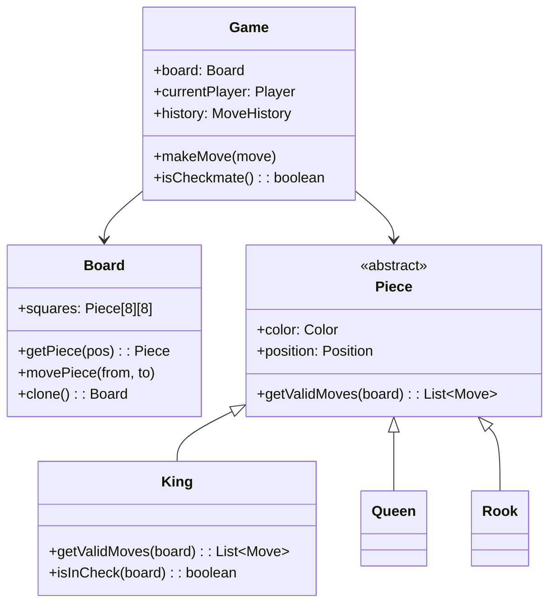

# Design a Chess Game (OOD)

**Difficulty**: 🟡 Intermediate
**Reading Time**: Coming Soon
**Interview Frequency**: High

---

> 🚧 **Full article coming soon.** This stub gives you the essentials to start thinking about this problem.

---

## The Core Problem

Modeling chess pieces, moves, and rules with clean OOP design — each piece type has unique movement rules, yet they share common properties. Checkmate detection requires testing all possible moves for both sides. The Command pattern enables undo/redo, and the polymorphic piece hierarchy makes it easy to add new piece types (like a custom fairy chess variant).

## Functional Requirements

- Two players take turns making moves on an 8×8 board
- Each piece type has its own legal movement rules
- Validate moves: illegal moves rejected, check is warned
- Detect checkmate and stalemate
- Support undo/redo move history

## Non-Functional Requirements

| Requirement | Target |
|-------------|--------|
| Move validation | O(1) for simple moves, O(n) for check detection |
| Correctness | All chess rules implemented (en passant, castling) |
| Extensibility | New piece type requires 1 new class |

## Back-of-Envelope Estimates

- **Board state**: 64 squares × 4 bytes = 256 bytes per board state — trivial
- **Move generation**: Each position has avg 30 legal moves; checking all for checkmate = 30 recursive calls
- **Classes needed**: ~10 core classes (Board, Piece hierarchy, Game, Move, Player, MoveHistory)

## Key Design Decisions

1. **Piece Class Hierarchy** — abstract `Piece` with `getValidMoves(board): List<Move>` method; subclasses: `King`, `Queen`, `Rook`, `Bishop`, `Knight`, `Pawn`; each implements movement logic; `PieceFactory` creates pieces by type; polymorphism makes move validation clean.
2. **Command Pattern for Moves** — `Move` is a command object: `execute()` applies move, `undo()` reverses it; `MoveHistory` is a stack; undo = pop and call undo(); enables replay and analysis.
3. **Board as Immutable Snapshot for Check Detection** — to check if a move results in check, apply move to a copy of board and test if king is attacked; using immutable board copies is cleaner than apply-then-rollback with mutable board.

## High-Level Architecture

## Top Interview Questions for This Problem

| Question | Tests |
|----------|-------|
| How do you detect checkmate efficiently without evaluating all possible future games? | Move generation, check detection |
| How do you implement castling, which requires knowing if the king has moved? | State tracking, move history |
| How would you extend this to support chess variants (like 5D chess)? | Extensibility, Open/Closed Principle |

## Related Concepts

- [Task management app OOD for simpler Command pattern usage](./task-management)
- [Vending machine OOD for state machine comparison](./vending-machine)

---

*📚 Full deep-dive with multiple approaches, trade-off tables, and pseudocode coming soon.*
