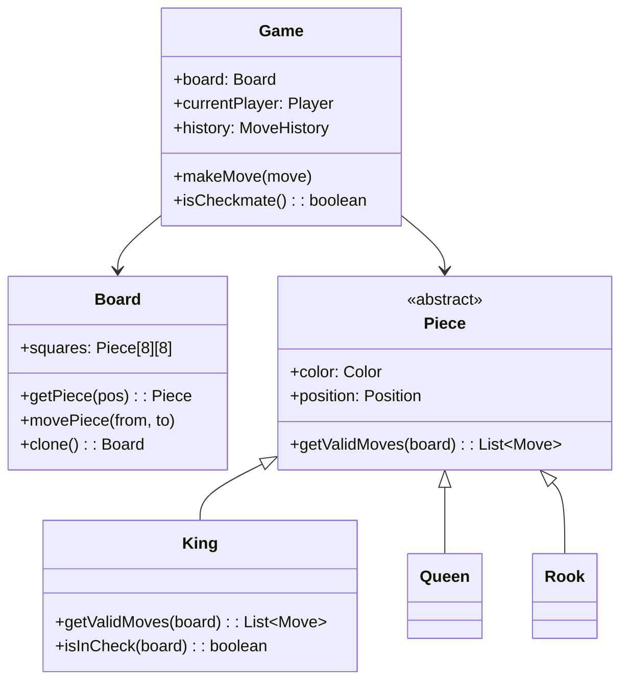
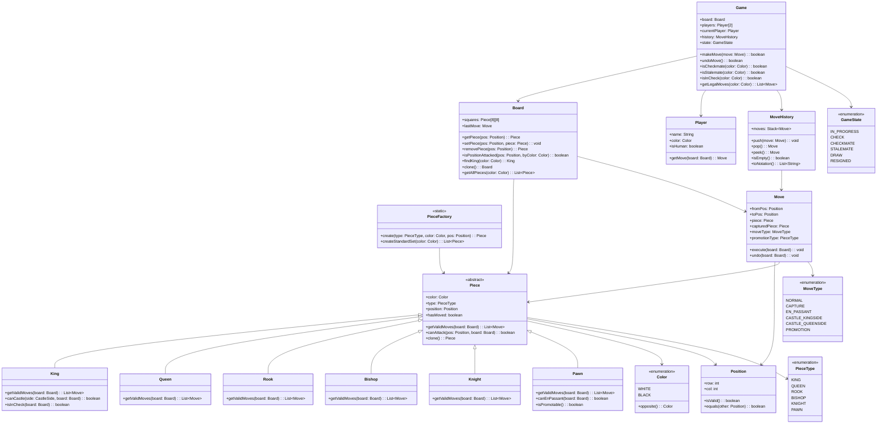
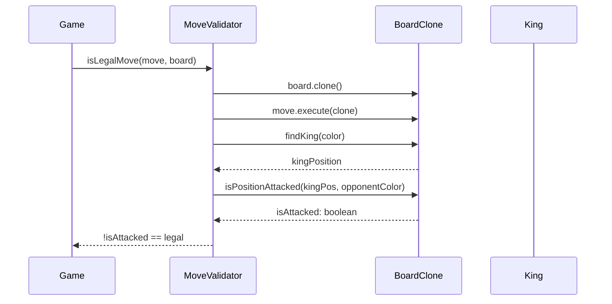

# Design a Chess Game (OOD)

**Difficulty**: 🟡 Intermediate
**Reading Time**: Coming Soon
**Interview Frequency**: High

---

> 🚧 **Full article coming soon.** This stub gives you the essentials to start thinking about this problem.

---

## The Core Problem

Modeling chess pieces, moves, and rules with clean OOP design — each piece type has unique movement rules, yet they share common properties. Checkmate detection requires testing all possible moves for both sides. The Command pattern enables undo/redo, and the polymorphic piece hierarchy makes it easy to add new piece types (like a custom fairy chess variant).

## Functional Requirements

- Two players take turns making moves on an 8×8 board
- Each piece type has its own legal movement rules
- Validate moves: illegal moves rejected, check is warned
- Detect checkmate and stalemate
- Support undo/redo move history

## Non-Functional Requirements

| Requirement | Target |
|-------------|--------|
| Move validation | O(1) for simple moves, O(n) for check detection |
| Correctness | All chess rules implemented (en passant, castling) |
| Extensibility | New piece type requires 1 new class |

## Back-of-Envelope Estimates

- **Board state**: 64 squares × 4 bytes = 256 bytes per board state — trivial
- **Move generation**: Each position has avg 30 legal moves; checking all for checkmate = 30 recursive calls
- **Classes needed**: ~10 core classes (Board, Piece hierarchy, Game, Move, Player, MoveHistory)

## Key Design Decisions

1. **Piece Class Hierarchy** — abstract `Piece` with `getValidMoves(board): List<Move>` method; subclasses: `King`, `Queen`, `Rook`, `Bishop`, `Knight`, `Pawn`; each implements movement logic; `PieceFactory` creates pieces by type; polymorphism makes move validation clean.
2. **Command Pattern for Moves** — `Move` is a command object: `execute()` applies move, `undo()` reverses it; `MoveHistory` is a stack; undo = pop and call undo(); enables replay and analysis.
3. **Board as Immutable Snapshot for Check Detection** — to check if a move results in check, apply move to a copy of board and test if king is attacked; using immutable board copies is cleaner than apply-then-rollback with mutable board.

## High-Level Architecture



## Top Interview Questions for This Problem

| Question | Tests |
|----------|-------|
| How do you detect checkmate efficiently without evaluating all possible future games? | Move generation, check detection |
| How do you implement castling, which requires knowing if the king has moved? | State tracking, move history |
| How would you extend this to support chess variants (like 5D chess)? | Extensibility, Open/Closed Principle |

## Related Concepts

- [Task management app OOD for simpler Command pattern usage](./task-management)
- [Vending machine OOD for state machine comparison](./vending-machine)

---

## Class Design

The full class diagram with all key classes, relationships, and methods:



Key design points:
- `Piece` is abstract with `hasMoved: boolean` to support castling and pawn's first double-step.
- `Move` is a first-class value object carrying enough data to both `execute()` and `undo()` itself without the caller needing to know board state before the move.
- `Board.clone()` enables check-detection in a scratch copy without modifying game state.
- `PieceFactory` decouples piece creation from the `Game` class — adding a new fairy-chess piece means creating one subclass and one factory branch.

---

## Design Patterns Applied

### 1. Template Method (Piece hierarchy)

`Piece.getValidMoves()` is the template — it calls an internal `getCandidateMoves()` hook provided by each subclass, then filters out moves that leave the king in check. The filtering logic lives once in `Piece`, not duplicated across six subclasses.

```
Piece.getValidMoves(board):
    candidates = this.getCandidateMoves(board)  // subclass hook
    return candidates.filter(move ->
        !resultingBoardHasKingInCheck(move, board, this.color)
    )
```

Each subclass overrides only `getCandidateMoves()` (geometry), not the legality check (rule engine). This enforces Single Responsibility: geometry logic vs. rule enforcement live in separate methods.

### 2. Command Pattern (Move)

`Move` encapsulates all information needed to `execute()` a move (piece reference, from/to squares, captured piece, move type) and to `undo()` it. `MoveHistory` is the invoker — it stores a `Stack<Move>`. Undo simply calls `move.undo(board)` after popping.

This makes move replay, move annotation (PGN export), and undo/redo trivial to add without touching `Game` or `Board` logic.

### 3. Factory Method (PieceFactory)

`PieceFactory.create(type, color, pos)` centralises construction. When the user promotes a pawn, `Game` calls `PieceFactory.create(QUEEN, WHITE, pos)` — it doesn't need to know which constructor parameters each piece type needs. Adding a custom fairy-chess piece requires changing exactly one `switch` statement.

### 4. Prototype (Board.clone)

Cloning the entire board (64 squares + piece references) to test moves without side effects is an application of the Prototype pattern. Each `Piece` implements `clone()` so the board copy contains independent piece instances. This avoids complex apply/rollback logic on a mutable board.

### 5. State Pattern (GameState)

`Game` holds a `GameState` enum. Transitions (`IN_PROGRESS` → `CHECK` → `CHECKMATE`) are driven by `Game.makeMove()` after each move is applied. UI components observe the state and render accordingly — they don't contain state-transition logic themselves.

---

## SOLID Principles

### Single Responsibility

- `Board` manages only square-occupancy and position-attack queries. It does NOT know rules.
- `Game` orchestrates turns, validates legality, and transitions state. It does NOT manage board memory layout.
- `Move` knows how to execute and undo itself. It does NOT compute legality.

### Open/Closed

Adding a fairy-chess piece (e.g., Archbishop = Bishop + Knight) requires:
1. New class `Archbishop extends Piece` — implements `getCandidateMoves()`.
2. One new `case` in `PieceFactory`.

No existing class is modified. The hierarchy is open for extension, closed for modification.

### Liskov Substitution

`Board.getAllPieces(color)` returns `List<Piece>`. Code iterating this list calls `piece.getValidMoves(board)` — it works correctly whether the piece is a `King`, `Pawn`, or any future subclass, because every subclass fully honours the `Piece` contract.

### Interface Segregation

`Player` exposes only `getMove(board): Move`. A `HumanPlayer` reads from UI input; an `AIPlayer` runs a minimax search. Neither implementation leaks its internals to `Game`. If later you need a `SpectatorPlayer` (read-only), it doesn't need to implement `getMove` at all — split the interface.

### Dependency Inversion

`Game` depends on the `Player` abstraction, not `HumanPlayer` or `AIPlayer` concretions. This allows injecting a test double `MockPlayer` in unit tests without any UI or engine dependency.

---

## Concurrency and Thread Safety

In a standard two-player local game, concurrency is not a concern — moves are sequential. But in an online chess server (e.g., Lichess, Chess.com) several concurrent operations appear:

| Operation | Concurrency Risk |
|-----------|-----------------|
| Two players submit moves simultaneously (network race) | Both moves accepted — board corrupted |
| Clock tick thread vs. move submission thread | Move accepted after flag fall |
| Analysis engine thread reads board mid-move | Sees partially applied move |
| Spectator reads board state during move application | Torn read |

**Mitigation strategies:**

1. **Per-game lock (ReentrantLock)**: The `Game` object holds a single lock. `makeMove()` acquires it before reading or writing `Board`. Simple and sufficient for most cases.

2. **Immutable board snapshots**: Each move produces a new `Board` snapshot rather than mutating in place. Readers always get a consistent snapshot. Writers CAS (compare-and-swap) the board reference. This is the approach Lichess uses internally.

3. **Actor model (Akka/Erlang)**: Each game is an actor. All messages (move request, clock tick, resign) are queued and processed sequentially. No shared state between actors. This is how Lichess's Scala backend handles 100k+ concurrent games — each game actor processes messages one at a time with zero locking.

For an OOD interview, option 1 (per-game lock) is sufficient. Mention option 3 as the production-scale answer.

---

## Extension Points

### Adding Timed Chess (Clock)

```java
class ChessClock {
    Map<Color, Duration> remaining;
    void start(Color player);
    void stop(Color player);
    boolean isExpired(Color player);
}
```

`Game` receives a `ChessClock` via constructor injection. After each `makeMove()`, `Game` calls `clock.stop(currentPlayer)` and `clock.start(nextPlayer)`. The clock is completely decoupled from board logic. No existing class changes.

### Adding Move Analysis / Hints

Inject a `MoveEvaluator` interface into `Game`:

```java
interface MoveEvaluator {
    double evaluate(Board board, Color perspective);
    List<Move> getBestMoves(Board board, Color color, int topN);
}
```

`StockfishEvaluator` and `RandomEvaluator` both implement it. `Game` calls `evaluator.getBestMoves(board, color, 3)` for hint display. The `Game` class does not know whether it's calling a neural network or a lookup table.

### Adding Persistent Game Storage

Add a `GameRepository` interface:

```java
interface GameRepository {
    void save(String gameId, MoveHistory history);
    MoveHistory load(String gameId);
}
```

Implement `PostgresGameRepository` storing PGN notation. `Game` holds a reference to `GameRepository` and calls `save()` after each move. To replay any game: load history, create empty board, replay moves in sequence.

### Supporting Chess960 (Fischer Random)

`Board.setupStandardPosition()` is a concrete method, but `Board.setupPosition(Map<Position, Piece> layout)` is the hook for any starting configuration. A `Chess960Setup` class generates a legal Fisher-Random starting position and passes it to `Board`. No subclassing of `Board` needed.

---

## Component Deep Dive 1: Check and Checkmate Detection

Check detection is the most computationally expensive operation in a chess engine — and the most common source of bugs in interview implementations. Naive approaches recurse infinitely or miss edge cases like discovered check.

**Naive approach (wrong):** Call `king.isInCheck()` directly on the mutable game board after making a move. Problem: if the move is illegal (it leaves the king in check), you've already applied it to the board. You must then roll it back — requiring `move.undo()` to work perfectly, and the board to be mutable in a predictable way. Any bug in undo logic corrupts the game state permanently.

**Correct approach — clone-then-test:**



`Board.isPositionAttacked(pos, byColor)` scans all opponent pieces and asks each: "can you attack `pos` from your current position?" This is O(16) piece checks, each O(1) to O(7) depending on piece type — total O(112) worst case per move validation. For checkmate detection, repeat for all ~30 legal candidate moves: O(3360) operations — negligible.

**Checkmate algorithm:**

```
isCheckmate(color, board):
    if not isInCheck(color, board): return false
    legalMoves = []
    for each piece of color on board:
        for each candidateMove of piece.getCandidateMoves(board):
            if isLegalMove(candidateMove, board):
                legalMoves.add(candidateMove)
    return legalMoves.isEmpty()
```

Stalemate uses the same algorithm with the initial check removed.

| Approach | Safety | Performance | Complexity |
|----------|--------|-------------|------------|
| Clone-then-test (recommended) | Safe — original board unchanged | O(30 × 112) per turn = ~3360 ops | Low — no undo logic needed |
| Apply-then-rollback (mutable board) | Risky — undo bugs corrupt state | Same asymptotic cost | High — undo must be perfect |
| Bitboard attack maps (engines) | Safe | O(1) per square via precomputed bitmasks | Very high — not needed for OOD interview |

For an interview context, clone-then-test is the right answer. Mention bitboards as the production chess-engine approach.

---

## Component Deep Dive 2: Move Representation and History

The `Move` class is the core Command object. Its design determines how clean undo/redo, PGN export, and move analysis will be.

A minimal `Move` needs: source square, destination square, and moving piece. But special moves require more:

| Move Type | Extra Data Needed |
|-----------|------------------|
| Capture | `capturedPiece` reference (for undo, restore it) |
| En passant | `capturedPawn` position (not same as `toPos`) |
| Castling | `rookFrom`, `rookTo` positions |
| Promotion | `promotionType` (what the pawn becomes) |
| Any move | `piecePreviousHasMoved` boolean (for castling eligibility undo) |

The `hasMoved` flag on pieces is critical for castling: a king that has moved once cannot castle later even if it returns to its original square. `Move.execute()` sets `piece.hasMoved = true`. `Move.undo()` must restore `piece.hasMoved` to its pre-move value, so `Move` stores `wasFirstMove: boolean`.

**What happens at 10x game load:** `MoveHistory` is a `Stack<Move>`. Each `Move` holds references to `Piece` objects that exist on the board. If 1 million games are in memory simultaneously (Chess.com scale), Move objects accumulate. For long games (80+ moves × 2 players), history depth is manageable. At extreme scale, serialize completed games to PGN (algebraic notation) and discard Move objects from memory.

**PGN export** maps directly from `MoveHistory` — iterate moves, convert each to algebraic notation using `piece.type`, `toPos`, capture flag, and `+`/`#` suffixes for check/checkmate.

---

## Component Deep Dive 3: Special Move Handling (En Passant and Castling)

En passant and castling are the two moves that break naive position-only move validation. Both require temporal state — knowledge of what happened in previous moves.

**En passant:**
A pawn can capture en passant only if: (a) opponent's pawn just moved two squares, and (b) it lands adjacent to the capturing pawn. The capturing pawn moves diagonally, but the captured pawn is NOT on the destination square — it's on the square the opponent's pawn started from (one rank back).

Implementation: `Board.lastMove` stores the most recent `Move`. `Pawn.getCandidateMoves()` checks:
1. Is `board.lastMove.piece` a Pawn?
2. Did it move exactly 2 squares?
3. Does it land adjacent to `this`?

If yes, add an `EN_PASSANT` move. `Move.execute()` for en passant moves the pawn diagonally AND removes the opponent pawn from its actual square (not `toPos`).

**Castling:**
Conditions: King has not moved (`!king.hasMoved`), chosen Rook has not moved (`!rook.hasMoved`), squares between them are empty, King is not currently in check, King does not pass through a checked square.

`King.canCastle(side, board)` checks all conditions. The "does not pass through check" condition requires calling `isPositionAttacked()` for 2-3 intermediate squares — exactly the same mechanism as regular check detection.

Both special moves are fully reversible: `Move.undo()` for castling moves King and Rook back AND resets their `hasMoved` flags.

---

## Data Model

For a production online chess platform, games are stored in a relational database with game events as an append-only log:

```sql
-- Players / users
CREATE TABLE players (
    player_id       UUID PRIMARY KEY DEFAULT gen_random_uuid(),
    username        VARCHAR(50) UNIQUE NOT NULL,
    elo_rating      SMALLINT NOT NULL DEFAULT 1200,
    created_at      TIMESTAMPTZ NOT NULL DEFAULT NOW()
);

-- A single game session
CREATE TABLE games (
    game_id         UUID PRIMARY KEY DEFAULT gen_random_uuid(),
    white_player_id UUID NOT NULL REFERENCES players(player_id),
    black_player_id UUID NOT NULL REFERENCES players(player_id),
    state           VARCHAR(20) NOT NULL DEFAULT 'IN_PROGRESS',
        -- 'IN_PROGRESS' | 'CHECKMATE' | 'STALEMATE' | 'DRAW' | 'RESIGNED' | 'TIMEOUT'
    winner_color    VARCHAR(5),  -- 'WHITE' | 'BLACK' | NULL (draw)
    time_control    VARCHAR(20) NOT NULL,  -- e.g., '10+5' (10 min + 5s increment)
    pgn_notation    TEXT,        -- full PGN export after game ends
    created_at      TIMESTAMPTZ NOT NULL DEFAULT NOW(),
    ended_at        TIMESTAMPTZ,
    CONSTRAINT no_self_play CHECK (white_player_id != black_player_id)
);

-- Individual moves (append-only event log)
CREATE TABLE game_moves (
    move_id         BIGSERIAL PRIMARY KEY,
    game_id         UUID NOT NULL REFERENCES games(game_id),
    move_number     SMALLINT NOT NULL,    -- 1, 2, 3 ... full move number
    color           VARCHAR(5) NOT NULL,  -- 'WHITE' | 'BLACK'
    piece_type      VARCHAR(8) NOT NULL,  -- 'KING'|'QUEEN'|'ROOK'|'BISHOP'|'KNIGHT'|'PAWN'
    from_square     CHAR(2) NOT NULL,     -- algebraic notation: 'e2'
    to_square       CHAR(2) NOT NULL,     -- algebraic notation: 'e4'
    move_type       VARCHAR(20) NOT NULL DEFAULT 'NORMAL',
        -- 'NORMAL'|'CAPTURE'|'EN_PASSANT'|'CASTLE_KINGSIDE'|'CASTLE_QUEENSIDE'|'PROMOTION'
    promotion_piece VARCHAR(8),           -- if move_type='PROMOTION'
    is_check        BOOLEAN NOT NULL DEFAULT FALSE,
    is_checkmate    BOOLEAN NOT NULL DEFAULT FALSE,
    algebraic       VARCHAR(10) NOT NULL, -- e.g. 'Nf3', 'O-O', 'exd5', 'e8=Q#'
    time_spent_ms   INT,                  -- milliseconds spent thinking
    created_at      TIMESTAMPTZ NOT NULL DEFAULT NOW(),
    UNIQUE (game_id, move_number, color)
);

-- Indexes for common queries
CREATE INDEX idx_games_white_player ON games(white_player_id);
CREATE INDEX idx_games_black_player ON games(black_player_id);
CREATE INDEX idx_games_state ON games(state) WHERE state = 'IN_PROGRESS';
CREATE INDEX idx_game_moves_game_id ON game_moves(game_id, move_number);
```

For in-memory representation during an active game, the `Board` is a 64-element array (or 8×8 matrix). After the game ends, the entire move list is serialized to PGN and stored in `games.pgn_notation` for replay without re-running SQL joins.

---

## Scale Bottlenecks

| Traffic Level | Component That Breaks | Symptoms | Mitigation |
|---------------|----------------------|----------|------------|
| 10x baseline (100k concurrent games) | Per-game in-memory board state RAM | ~256 bytes per board × 100k = 25 MB; manageable. But Move object graphs grow to ~50 KB/game → 5 GB total RAM | Evict ended-game state to DB; keep only active games in RAM |
| 100x baseline (1M concurrent games) | Single DB write per move (game_moves inserts) | At 3 moves/sec average × 1M games = 3M inserts/sec; PostgreSQL single-writer ceiling ~100k/sec | Partition `game_moves` by `game_id` hash; use Kafka as move-event log; async DB writes with at-least-once delivery |
| 1000x baseline (10M concurrent games) | WebSocket connection count per server | 10M persistent WebSocket connections exceed OS ephemeral port limits and file descriptor limits on a single host | Horizontal scale WebSocket servers; use Redis Pub/Sub or Kafka for cross-server move fan-out to spectators |
| Any level | Checkmate detection during high-traffic tournaments | All game servers simultaneously run O(3360) op checkmate checks when tournament ends | Offload final-position analysis to async worker queue; return result asynchronously |

---

## How Lichess Built This

**Lichess** is the world's largest open-source chess platform — 5 million+ games played daily, 700k+ concurrent users at peak. Their architecture is a direct implementation of the patterns described above, but at production scale.

**Technology choices:**
- Backend written entirely in **Scala** using the **Akka actor model**. Every active game is a dedicated actor — all moves, clock ticks, and resign requests are messages sent to that actor. The actor processes messages sequentially, eliminating all locking overhead across 500k+ concurrent actors on a single cluster.
- **Scalachess** library (open source) handles all chess rules — piece movement, check/checkmate detection, PGN parsing. The library uses **immutable board snapshots** for check detection, exactly the clone-then-test pattern described above. A board `clone()` in Scala is cheap because Scala's immutable collections share structure.
- **MongoDB** stores completed games — ~5 TB of game data as of 2023. Each game document contains a flat array of UCI move strings (e.g., `["e2e4", "e7e5", "g1f3"]`). Reconstruction requires replaying moves from scratch, which takes <1ms for 80-move games.
- **Redis** powers real-time features: game state for reconnection, user presence, active game counts. Each game's current board FEN (Forsyth–Edwards Notation, 87 bytes max) is stored in Redis with a 2-hour TTL.

**Non-obvious architectural decision:** Lichess does NOT store the board state in the database — only moves. The board is always reconstructed by replaying moves from move 1. This makes storage 10x smaller, guarantees the move log is the single source of truth, and means any bug in board state representation is self-healing (re-replay from moves). The trade-off: replaying a 100-move game costs ~50ms CPU — acceptable since it only happens on reconnect, not on every move.

**Numbers:** 5M+ games/day ≈ 58 games/second average; peak at ~500 games/second during major tournaments; median game duration 10 minutes; ~50 moves per game average.

Source: [Lichess Open Source Repository](https://github.com/lichess-org/lila) and [Scalachess Library](https://github.com/lichess-org/scalachess).

---

## Interview Angle

**What the interviewer is testing:** The interviewer is evaluating whether you understand the difference between OOP polymorphism (each piece knows its own movement rules) and centralized rule enforcement (only `Game` decides legality). They also want to see that you understand how to handle stateful special moves — castling and en passant — without hacking global state.

**Common mistakes candidates make:**

1. **Putting move validation in `Game.makeMove()` with giant if/else chains.** This centralises all piece-specific logic in one method: `if piece is knight, check L-shape; else if piece is bishop, check diagonal`. This violates OCP — adding a new piece means modifying `Game`. The correct design: each `Piece` subclass encapsulates its own movement geometry via `getCandidateMoves()`.

2. **Forgetting that `getValidMoves()` must filter for self-check.** Candidates list candidate moves (geometry) and return them as "valid." But a move is only legal if it doesn't leave your own king in check. The Template Method in `Piece.getValidMoves()` — filter candidates via clone-then-test — is non-obvious and candidates often skip it entirely.

3. **Not accounting for en passant and castling in the data model.** Candidates design `Move(from, to)` and discover mid-explanation that castling moves TWO pieces and en passant captures a piece NOT on the destination square. The `MoveType` enum and extra fields on `Move` (capturedPiece, capturedPiecePosition, rookFrom/rookTo) must be in the design from the start.

**The insight that separates good from great answers:** Recognizing that `Board.clone()` for check detection is a Prototype pattern application, and that the alternative (apply-then-rollback on a mutable board) introduces stateful complexity that cascades into bugs. Great candidates also know that checkmate detection is algorithmically the same as "generate all legal moves and check if the list is empty" — no special-case logic needed.

---

## Key Numbers to Remember

| Metric | Value | Context |
|--------|-------|---------|
| Board state size | 256 bytes | 64 squares × 4 bytes (piece type + color + flags) |
| Average legal moves per position | 30 | Used to size move generation buffers |
| Checkmate check cost | ~3,360 operations | 30 candidate moves × 112 attack-check ops per move |
| Piece subclasses needed | 6 | King, Queen, Rook, Bishop, Knight, Pawn |
| Total core classes | ~12 | Board, Piece×6, Game, Move, MoveHistory, Player, PieceFactory |
| En passant window | 1 move | Must capture immediately after opponent's double pawn push |
| Castling conditions | 5 | King not moved, rook not moved, path clear, not in check, not through check |
| Lichess concurrent games | 500k+ | Peak during major tournaments; Scala Akka actor per game |
| Lichess daily games | 5M+ | ~58 games/second average; stored as move arrays not board states |
| Board FEN string size | ≤ 87 bytes | Compact board serialization format for Redis/WebSocket |

---

## 📚 Resources & References

| Resource | Type | What You'll Learn |
|----------|------|------------------|
| [ByteByteGo — Design a Chess Game](https://www.youtube.com/@ByteByteGo) | 📺 YouTube | Search "chess game design" — board representation, piece hierarchy, move validation |
| [Grokking Object-Oriented Design](https://www.educative.io/courses/grokking-the-object-oriented-design-interview) | 📚 Book | OOD interview approach with UML and class design |
| [Lichess Open Source Chess Platform](https://lichess.org/source) | 📖 Blog | Open-source chess platform — real production codebase to study |
| [Stockfish Chess Engine: Open Source](https://github.com/official-stockfish/Stockfish) | 📖 Blog | World's strongest open-source chess engine — study move generation algorithms |
| [Chess Programming Wiki](https://www.chessprogramming.org/Main_Page) | 📚 Docs | Comprehensive resource on board representation, move generation, and search algorithms |
