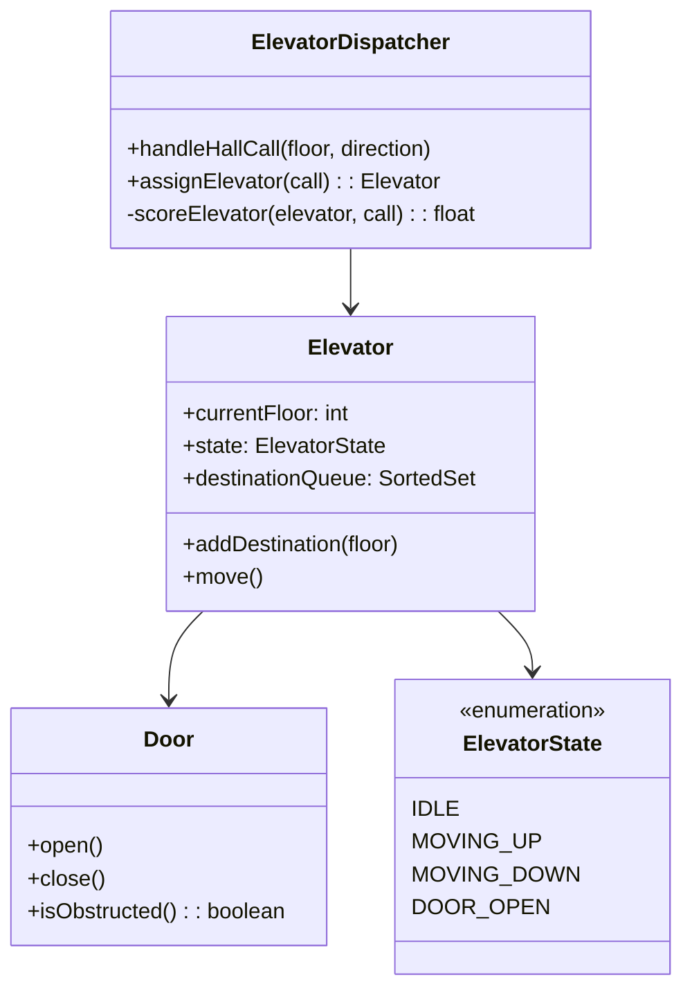

# Design an Elevator System (OOD)

**Difficulty**: 🟡 Intermediate
**Reading Time**: Coming Soon
**Interview Frequency**: High

---

> 🚧 **Full article coming soon.** This stub gives you the essentials to start thinking about this problem.

---

## The Core Problem

Managing multiple elevators in a building with efficient scheduling — the naive "respond to every floor call independently" approach causes elevators to travel back and forth past waiting passengers. The SCAN algorithm (move in one direction until no more requests, then reverse) minimizes total travel distance, but a dispatcher must assign the right elevator to each hall call.

## Functional Requirements

- Passengers press hall buttons (up/down) on each floor
- Passengers inside elevator press floor buttons to choose destination
- System assigns the optimal elevator to each hall call
- Elevator opens/closes doors, handles overweight sensor
- Display current floor and direction on each elevator

## Non-Functional Requirements

| Requirement | Target |
|-------------|--------|
| Scheduling efficiency | Minimize average wait time |
| Correctness | All hall calls eventually serviced (no starvation) |
| Safety | Doors never close on passenger (door sensor) |
| Scale | 10 elevators, 50 floors |

## Back-of-Envelope Estimates

- **State space**: 10 elevators × 50 floors × 3 states (going up, going down, idle) × direction = manageable
- **Classes needed**: ~7-9 classes (Elevator, Floor, HallButton, CarButton, Dispatcher, ElevatorController, Door)
- **Scheduling decision**: For 10 elevators, evaluate all 10 candidates → pick optimal → O(10) per decision

## Key Design Decisions

1. **SCAN Algorithm per Elevator** — elevator maintains sorted set of destination floors; moves in current direction servicing all stops; reverses when no more floors in that direction; this is the "elevator algorithm" that minimizes seek time (borrowed from disk I/O).
2. **Dispatcher Pattern for Assignment** — when hall call arrives at floor X (direction UP), dispatcher evaluates all elevators: score = f(current_floor_distance, current_direction, load); assigns to lowest-score elevator; centralized logic, easy to swap algorithms.
3. **Observer Pattern for State Updates** — elevator state changes (arrived at floor, door opened) notify observers: Display (update floor indicator), Dispatcher (reassign pending calls if elevator passes them), Logger (audit trail).

## High-Level Architecture

## Top Interview Questions for This Problem

| Question | Tests |
|----------|-------|
| How do you prevent elevator starvation (one floor never gets served)? | SCAN algorithm, priority aging |
| How would the design change for a building with 100 elevators and 200 floors? | Zoning, bank assignment |
| How would you model emergency mode where all elevators go to ground floor? | State transition, override mechanism |

## Related Concepts

- [Vending machine OOD for similar state machine patterns](./vending-machine)
- [Task scheduler for similar dispatching/scheduling logic](../04-reservation-scheduling/task-scheduler)

---

*📚 Full deep-dive with multiple approaches, trade-off tables, and pseudocode coming soon.*

## 📚 Resources & References

| Resource | Type | What You'll Learn |
|----------|------|------------------|
| [ByteByteGo — Design an Elevator System](https://www.youtube.com/@ByteByteGo) | 📺 YouTube | Search "elevator system design" — scheduling algorithms, state management |
| [Grokking Object-Oriented Design](https://www.educative.io/courses/grokking-the-object-oriented-design-interview) | 📚 Book | Elevator system OOD — dispatch algorithm and class hierarchy |
| [SCAN Algorithm for Elevator Scheduling](https://www.geeksforgeeks.org/scan-elevator-disk-scheduling-algorithms/) | 📖 Blog | Elevator (SCAN) algorithm — the standard disk and elevator scheduling approach |
| [Strategy Design Pattern](https://refactoring.guru/design-patterns/strategy) | 📚 Docs | Pluggable scheduling algorithm using the Strategy pattern |
| [Observer Pattern for Event-Driven Systems](https://refactoring.guru/design-patterns/observer) | 📚 Docs | How to model elevator button presses as events |
