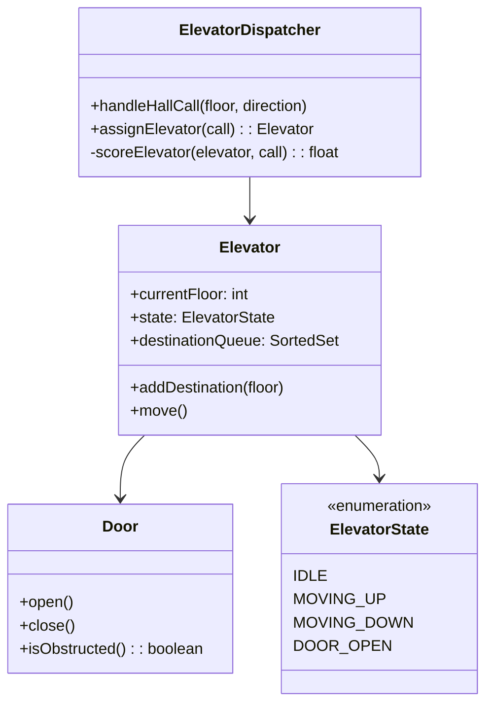
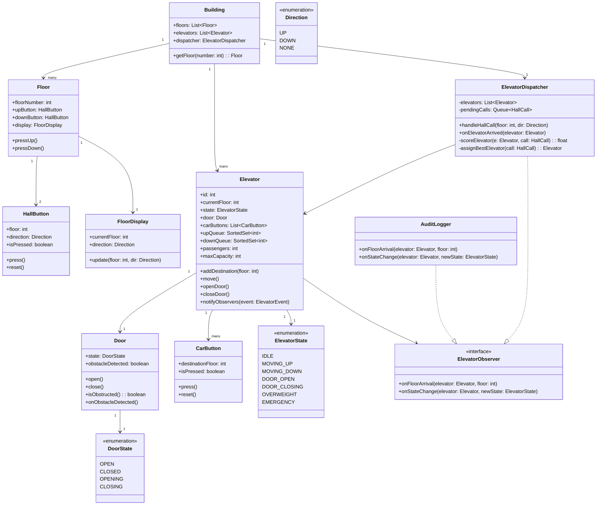
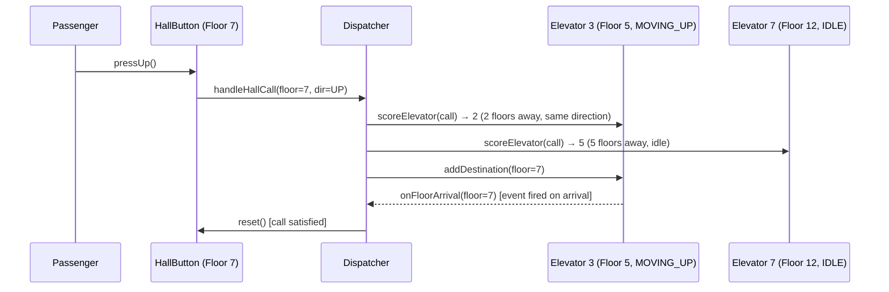
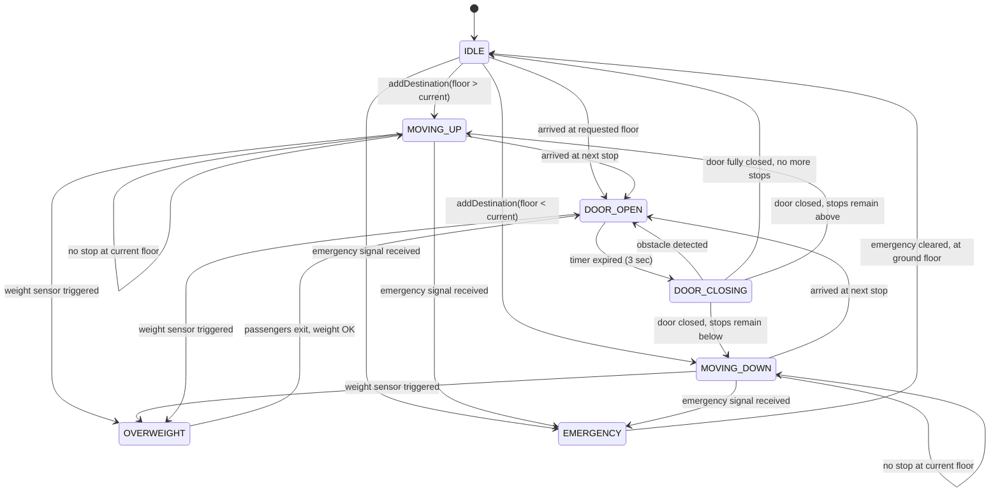

# Design an Elevator System (OOD)

**Difficulty**: 🟡 Intermediate
**Reading Time**: ~20 minutes
**Interview Frequency**: High

---

## The Core Problem

Managing multiple elevators in a building with efficient scheduling — the naive "respond to every floor call independently" approach causes elevators to travel back and forth past waiting passengers. The SCAN algorithm (move in one direction until no more requests, then reverse) minimizes total travel distance, but a dispatcher must assign the right elevator to each hall call.

## Functional Requirements

- Passengers press hall buttons (up/down) on each floor
- Passengers inside elevator press floor buttons to choose destination
- System assigns the optimal elevator to each hall call
- Elevator opens/closes doors, handles overweight sensor
- Display current floor and direction on each elevator

## Non-Functional Requirements

| Requirement | Target |
|-------------|--------|
| Scheduling efficiency | Minimize average wait time |
| Correctness | All hall calls eventually serviced (no starvation) |
| Safety | Doors never close on passenger (door sensor) |
| Scale | 10 elevators, 50 floors |

## Back-of-Envelope Estimates

- **State space**: 10 elevators × 50 floors × 3 states (going up, going down, idle) × direction = manageable
- **Classes needed**: ~7-9 classes (Elevator, Floor, HallButton, CarButton, Dispatcher, ElevatorController, Door)
- **Scheduling decision**: For 10 elevators, evaluate all 10 candidates → pick optimal → O(10) per decision

## Key Design Decisions

1. **SCAN Algorithm per Elevator** — elevator maintains sorted set of destination floors; moves in current direction servicing all stops; reverses when no more floors in that direction; this is the "elevator algorithm" that minimizes seek time (borrowed from disk I/O).
2. **Dispatcher Pattern for Assignment** — when hall call arrives at floor X (direction UP), dispatcher evaluates all elevators: score = f(current_floor_distance, current_direction, load); assigns to lowest-score elevator; centralized logic, easy to swap algorithms.
3. **Observer Pattern for State Updates** — elevator state changes (arrived at floor, door opened) notify observers: Display (update floor indicator), Dispatcher (reassign pending calls if elevator passes them), Logger (audit trail).

## High-Level Architecture



## Top Interview Questions for This Problem

| Question | Tests |
|----------|-------|
| How do you prevent elevator starvation (one floor never gets served)? | SCAN algorithm, priority aging |
| How would the design change for a building with 100 elevators and 200 floors? | Zoning, bank assignment |
| How would you model emergency mode where all elevators go to ground floor? | State transition, override mechanism |

## Related Concepts

- [Vending machine OOD for similar state machine patterns](./vending-machine)
- [Task scheduler for similar dispatching/scheduling logic](../04-reservation-scheduling/task-scheduler)

---

## Class Design

The full class hierarchy shows all relationships, responsibilities, and key methods. The design separates concerns cleanly: buttons produce requests, the dispatcher consumes them, elevators execute them, and observers react to state transitions.



### Key Class Responsibilities

**Building** — the top-level facade. It wires floors, elevators, and the dispatcher together. Clients (button presses) enter through Building. This avoids tight coupling between Floor and Elevator.

**ElevatorDispatcher** — the brain. It implements the scoring function that determines which elevator should serve a hall call. It also implements `ElevatorObserver` so it receives arrival events and can clear assigned calls when an elevator actually stops at a floor.

**Elevator** — a self-contained state machine. It maintains two sorted queues (`upQueue`, `downQueue`) — the SCAN algorithm's core data structures. The `move()` method is called on a timer tick and advances the elevator one floor toward the next stop.

**Door** — a small but safety-critical class. It retries `close()` up to 3 times if `isObstructed()` returns true, then raises an alarm. The Door's state transitions (`CLOSING` → `OPEN` on obstacle) are intentionally kept inside the Door class, not in Elevator.

---

## Component Deep Dive 1: Dispatcher and Scheduling Algorithm

The dispatcher is the most critical architectural component in an elevator system. When a passenger presses the UP button on floor 7, the dispatcher must decide which of the 10 available elevators should respond. A wrong decision here — assigning an elevator that is already full, moving away, or at the far end of the building — directly translates to passenger wait time.

### How the Dispatcher Works Internally

The dispatcher maintains a registry of all elevator states. On every hall call event it runs a scoring function over all elevators and picks the minimum-score elevator. The SCAN-based scoring function works as follows:

```
score(elevator, call):
  distance = abs(elevator.currentFloor - call.floor)

  # Penalty: elevator moving AWAY from call direction
  if elevator.state == MOVING_UP and call.floor < elevator.currentFloor:
    direction_penalty = 2 * (elevator.currentFloor - call.floor)
  elif elevator.state == MOVING_DOWN and call.floor > elevator.currentFloor:
    direction_penalty = 2 * (call.floor - elevator.currentFloor)
  else:
    direction_penalty = 0

  # Penalty: elevator nearly at capacity
  load_penalty = (elevator.passengers / elevator.maxCapacity) * 10

  return distance + direction_penalty + load_penalty
```

The `direction_penalty` term is critical. Without it, an elevator moving down from floor 40 toward floor 1 might be assigned a call on floor 35 (direction UP) — it would overshoot, reverse, and return. The penalty forces the dispatcher to prefer idle elevators or those moving in the correct direction.

### Why Naive Approaches Fail

**Nearest elevator first (no direction check)**: Assigns to the closest elevator regardless of direction. Works fine with 1 elevator, breaks badly with multiple because two elevators may race to serve the same corridor while the opposite end of the building goes unserved.

**Round-robin**: Ignores distance entirely. Floor 1 gets elevator 9 (currently on floor 48) while elevator 2 is sitting idle on floor 3. Average wait time explodes.

**Greedy without load balancing**: Ignores passenger count. An elevator at capacity gets assigned more calls, doors open, passengers can't board, hall call stays unresolved — silent starvation.

### Dispatcher State Sequence



### Algorithm Trade-offs

| Algorithm | Avg Wait Time | Starvation Risk | Complexity | Best For |
|-----------|--------------|-----------------|------------|----------|
| SCAN + scoring | Low (good direction bonus) | Low (SCAN guarantees reversal) | Medium | General-purpose buildings |
| LOOK (skip empty ranges) | Lowest | Low | Medium-high | High-rise with sparse traffic |
| Round-robin | High | None | Trivial | Uniform floor distribution (rare) |
| Nearest without direction | Medium | Medium (busy floors dominate) | Low | Single-elevator buildings |

---

## Component Deep Dive 2: Elevator State Machine

The elevator is a finite state machine (FSM). Every operation — moving between floors, opening doors, handling overweight — is a legal state transition. Implementing it as a proper FSM rather than a pile of boolean flags eliminates an entire class of bugs: doors cannot close while moving, an overweight elevator cannot move, an emergency-locked elevator ignores all normal commands.

### State Transition Diagram



### Internal Mechanics of `move()`

The `move()` method is called on a 1-second timer tick by the ElevatorController. It is the only entry point for floor transitions:

```python
def move(self):
    if self.state == ElevatorState.MOVING_UP:
        next_stop = self.upQueue.first()  # smallest floor >= currentFloor
        if next_stop is None:
            # Reverse: check downQueue
            if self.downQueue:
                self.state = ElevatorState.MOVING_DOWN
            else:
                self.state = ElevatorState.IDLE
            return
        self.currentFloor += 1
        if self.currentFloor == next_stop:
            self.upQueue.remove(next_stop)
            self._arrive_at_floor(next_stop)

    elif self.state == ElevatorState.MOVING_DOWN:
        next_stop = self.downQueue.last()  # largest floor <= currentFloor
        if next_stop is None:
            if self.upQueue:
                self.state = ElevatorState.MOVING_UP
            else:
                self.state = ElevatorState.IDLE
            return
        self.currentFloor -= 1
        if self.currentFloor == next_stop:
            self.downQueue.remove(next_stop)
            self._arrive_at_floor(next_stop)
```

The dual-queue structure (separate `upQueue` and `downQueue`) is the SCAN algorithm's implementation. Each queue is a sorted set. Moving up, the elevator drains `upQueue`; when empty it switches to draining `downQueue` in reverse order.

### Behavior at 10x Load

With 10 elevators and 50 floors at normal load, each elevator processes ~5-10 calls per minute. At 10x load (peak morning rush — 500 people arriving simultaneously):

- All 10 elevators are in `MOVING_UP` state simultaneously
- `pendingCalls` queue in dispatcher grows; calls arriving for floor 12 can't be assigned because all elevators are above floor 20
- Solution: **Dispatcher re-evaluates pending calls every 5 seconds** — an elevator finishing its upward pass and reversing downward becomes newly eligible for pending UP calls it skipped

---

## Component Deep Dive 3: Door Safety and Obstacle Handling

The Door class is small but disproportionately important. In real elevator systems, door malfunction accounts for roughly 90% of elevator-related incidents. The software model must make it impossible to move while a door is not fully closed.

### Design

```python
class Door:
    MAX_CLOSE_ATTEMPTS = 3
    DOOR_TIMEOUT_SECONDS = 10

    def close(self) -> bool:
        for attempt in range(self.MAX_CLOSE_ATTEMPTS):
            self.state = DoorState.CLOSING
            time.sleep(2)  # simulate close duration
            if self.is_obstructed():
                self.state = DoorState.OPEN
                self.notify_observers(DoorEvent.OBSTRUCTION_DETECTED)
                time.sleep(1)  # wait before retry
            else:
                self.state = DoorState.CLOSED
                return True
        # All attempts failed
        self.notify_observers(DoorEvent.DOOR_FAULT)
        self.trigger_maintenance_alarm()
        return False
```

The elevator's `_arrive_at_floor()` calls `door.open()`, waits for the configured boarding time (typically 5 seconds), then calls `door.close()`. If `close()` returns `False`, the elevator stays in `DOOR_OPEN` state and dispatches a maintenance alert. The elevator is marked `UNAVAILABLE` and the dispatcher stops scoring it for new calls.

### Technical Decisions

- Door state is owned by `Door`, not `Elevator`. This is a Single Responsibility boundary: `Elevator` tells the door to open/close but does not track door internals.
- The obstacle sensor is polled during `CLOSING` state (not during `OPEN` state). This avoids false positives from passengers simply standing near the door.
- Emergency mode bypasses the `MAX_CLOSE_ATTEMPTS` limit: in emergency, doors close immediately with a 1-second warning buzzer and do not retry.

---

## Design Patterns Applied

### 1. Strategy Pattern — Scheduling Algorithm

The dispatcher's scoring function is injected as a strategy, not hardcoded. This allows swapping algorithms without changing the dispatcher:

```python
class ElevatorDispatcher:
    def __init__(self, elevators: List[Elevator], strategy: SchedulingStrategy):
        self.strategy = strategy

    def assign_elevator(self, call: HallCall) -> Elevator:
        scores = [(e, self.strategy.score(e, call)) for e in self.elevators]
        return min(scores, key=lambda x: x[1])[0]
```

Concrete strategies: `SCANStrategy`, `LookStrategy`, `ZonedStrategy` (for skyscrapers where elevators serve floor ranges). This is the classic Strategy pattern — the algorithm is interchangeable without touching the context class.

### 2. Observer Pattern — Event Propagation

`Elevator` maintains a list of `ElevatorObserver` implementations. On state transitions, it calls `notify_observers()`. Three observers are registered by default:

- **ElevatorDispatcher**: clears assigned hall calls when elevator arrives at the correct floor
- **FloorDisplay**: updates the floor indicator panel on each floor
- **AuditLogger**: records every state transition with timestamp for safety audits

This decouples the elevator's core motion logic from all side-effects. Adding a new observer (say, an energy monitoring system) requires zero changes to `Elevator`.

### 3. State Pattern — Elevator FSM

Rather than tracking state with `if/elif` chains across multiple methods, the state transitions are explicit. Each `ElevatorState` enum value implies which transitions are legal. The `move()` method returns early if the state is not `MOVING_UP` or `MOVING_DOWN`. The door cannot operate if the state is not `DOOR_OPEN` or `DOOR_CLOSING`.

At scale, this matters: when adding Emergency mode, only the `EMERGENCY` enum value and its legal transitions needed to be added — no existing method needed modification.

### 4. Facade Pattern — Building Class

`Building` is a facade. External clients (a test harness, a UI) interact only with `Building.pressHallButton(floor, direction)` and `Building.pressCarButton(elevatorId, floor)`. The internal wiring of Floor → HallButton → Dispatcher → Elevator is invisible to callers.

---

## SOLID Principles

**Single Responsibility**: `Door` handles only door mechanics. `ElevatorDispatcher` handles only assignment logic. `Elevator` handles only floor-to-floor movement. Adding a weight logging system does not require modifying `Elevator` — it adds a new `WeightObserver`.

**Open/Closed**: The `SchedulingStrategy` interface keeps `ElevatorDispatcher` open for extension (new algorithm) but closed for modification. Deploying a peak-hour zone strategy on Monday mornings requires no change to dispatcher code.

**Liskov Substitution**: Any `SchedulingStrategy` implementation can be dropped into `ElevatorDispatcher` without breaking contracts. `ZonedStrategy` obeys the same `score(elevator, call): float` contract as `SCANStrategy`.

**Interface Segregation**: `ElevatorObserver` is split: `FloorDisplay` only needs `onFloorArrival()`, not `onStateChange()`. In a full implementation, these could be separate interfaces — `FloorArrivalObserver` and `StateChangeObserver` — to avoid forcing displays to implement irrelevant methods.

**Dependency Inversion**: `ElevatorDispatcher` depends on the `SchedulingStrategy` abstraction, not on `SCANStrategy` concretely. `Building` depends on the `Elevator` interface, not a specific elevator vendor implementation.

---

## Concurrency and Thread Safety

In a real system, multiple events occur simultaneously:
- A passenger presses a hall button (thread A)
- An elevator arrives at a floor and fires observer events (thread B)
- A car button is pressed by a passenger inside the elevator (thread C)
- The dispatcher runs its 5-second pending-call re-evaluation (timer thread D)

### Race Conditions to Prevent

**Double-assignment**: Two hall calls arrive simultaneously for floor 7 UP. Both dispatcher threads score elevators concurrently and both pick Elevator 3. Elevator 3 gets the call added twice.

**Fix**: `pendingCalls` is a `ConcurrentLinkedQueue`. `assignElevator()` uses a per-elevator lock when calling `addDestination()`. The scoring phase is lock-free (read-only), only the assignment write is synchronized.

**Queue corruption**: `move()` (called from the elevator's timer thread) reads `upQueue` while `addDestination()` (called from the dispatcher thread) writes to it.

**Fix**: `upQueue` and `downQueue` are `TreeSet` instances wrapped with `ReentrantLock`. All reads and writes acquire the lock. Since lock hold time is microseconds, this is safe.

**Observer notification during state change**: `Elevator.notifyObservers()` iterates the observer list while another thread adds an observer.

**Fix**: Observer list is a `CopyOnWriteArrayList` — iteration works on a snapshot, additions are safe.

### Thread Model

```
Timer Thread (1/sec) → Elevator.move() [per elevator, 10 threads]
Event Thread          → ElevatorDispatcher.handleHallCall() [inbound events]
Timer Thread (5/sec)  → ElevatorDispatcher.reschedulePending()
```

Using one thread per elevator is acceptable at 10 elevators. At 1000 elevators (a large skyscraper complex), switch to a single-threaded event loop with a priority queue of `(next_event_time, elevator_id)` pairs — eliminates 990 idle threads.

---

## Extension Points

### Adding Express Elevators (Skip Floors)

`SCANStrategy` is extended or replaced with `ZonedSCANStrategy`. The `Building` class is given a `zones: List[FloorRange]` property. Dispatcher passes the zone configuration to the strategy at construction. `Elevator` is unchanged — it still responds to `addDestination(floor)` calls, and the strategy simply never assigns cross-zone calls to a restricted elevator.

### Adding VIP Priority

A new `PriorityHallCall` subclass carries a `priority: int` field. `ElevatorDispatcher.handleHallCall()` already takes a `HallCall` parameter; the method is open/closed compliant — it can check `call instanceof PriorityHallCall` and apply a negative score offset. `Elevator`, `Door`, and `Floor` are all unchanged.

### Adding Real-Time Weight Monitoring

A `WeightSensor` class emits events. `Elevator` registers a `WeightSensorObserver`. When weight exceeds capacity, the observer calls `elevator.setState(ElevatorState.OVERWEIGHT)` — the existing state machine handles the rest (stop accepting destinations, alert maintenance). Zero new state machine logic required.

---

## Data Model

For a software simulation (embedded controller or cloud-based building management system):

```sql
-- Elevator current state (in-memory in production; persisted for audit/recovery)
CREATE TABLE elevators (
    elevator_id        INT PRIMARY KEY,
    building_id        INT NOT NULL,
    current_floor      SMALLINT NOT NULL DEFAULT 1,
    state              ENUM('IDLE','MOVING_UP','MOVING_DOWN','DOOR_OPEN','DOOR_CLOSING','OVERWEIGHT','EMERGENCY') NOT NULL,
    passengers         SMALLINT NOT NULL DEFAULT 0,
    max_capacity       SMALLINT NOT NULL DEFAULT 12,
    last_updated_at    TIMESTAMP NOT NULL DEFAULT CURRENT_TIMESTAMP ON UPDATE CURRENT_TIMESTAMP,
    INDEX idx_building_state (building_id, state)
);

-- Pending hall calls not yet assigned
CREATE TABLE hall_calls (
    call_id        BIGINT PRIMARY KEY AUTO_INCREMENT,
    building_id    INT NOT NULL,
    floor          SMALLINT NOT NULL,
    direction      ENUM('UP','DOWN') NOT NULL,
    requested_at   TIMESTAMP NOT NULL DEFAULT CURRENT_TIMESTAMP,
    assigned_to    INT REFERENCES elevators(elevator_id),
    fulfilled_at   TIMESTAMP,
    INDEX idx_pending (building_id, fulfilled_at)
);

-- Elevator destination queues (active floor stops)
CREATE TABLE elevator_destinations (
    elevator_id    INT NOT NULL REFERENCES elevators(elevator_id),
    floor          SMALLINT NOT NULL,
    direction      ENUM('UP','DOWN') NOT NULL,  -- which pass to service on
    added_at       TIMESTAMP NOT NULL DEFAULT CURRENT_TIMESTAMP,
    PRIMARY KEY (elevator_id, floor, direction)
);

-- Immutable audit log — append-only
CREATE TABLE elevator_events (
    event_id       BIGINT PRIMARY KEY AUTO_INCREMENT,
    elevator_id    INT NOT NULL,
    event_type     ENUM('FLOOR_ARRIVAL','STATE_CHANGE','DOOR_OBSTRUCTION','OVERWEIGHT','EMERGENCY') NOT NULL,
    floor          SMALLINT,
    old_state      VARCHAR(20),
    new_state      VARCHAR(20),
    occurred_at    TIMESTAMP(6) NOT NULL DEFAULT CURRENT_TIMESTAMP(6),
    INDEX idx_elevator_time (elevator_id, occurred_at)
);
```

In a real embedded controller, `hall_calls` and `elevator_destinations` live entirely in memory as sorted data structures. The SQL schema above is for a cloud-connected building management system where the elevator controller syncs state for remote monitoring and predictive maintenance.

---

## Scale Bottlenecks

| Traffic Level | Component That Breaks | Symptoms | Mitigation |
|---------------|----------------------|----------|------------|
| 10x baseline (100 simultaneous calls) | `pendingCalls` queue in dispatcher | Calls sit unassigned for >30 sec; some elevators idle while others are overloaded | Priority queue with aging; re-evaluate pending calls every 5 sec |
| 100x baseline (building-wide emergency evacuation) | Single dispatcher thread | Dispatcher cannot score 10 elevators × 500 calls fast enough; assignment latency > 5 sec | Pre-compute elevator zones; dispatch is O(10) not O(500) in zone mode |
| 1000 elevators (skyscraper campus) | Per-elevator thread model | 1000 idle threads, 50MB memory overhead, context-switch overhead | Single event-loop + priority queue of `(next_tick_time, elevator_id)` |
| Persistent audit log (10 years) | `elevator_events` table | Table grows to 50B rows (5 events/sec × 10 elevators × 315M seconds) | Partition by month; move cold partitions to S3/cold storage; keep hot 30 days in DB |

---

## How ThyssenKrupp Built This (MULTI/MAX)

ThyssenKrupp Elevator (now TK Elevator) launched **MULTI** in 2017 — the world's first ropeless elevator system, capable of moving multiple cabins in the same shaft both vertically and horizontally using linear induction motors (LIMs). Their engineering decisions are directly relevant to this OOD problem.

**Technology choices**: Each MULTI cabin is independently controlled by a distributed controller running a real-time OS. The central dispatcher is replaced by a **multi-agent negotiation system**: each cabin is an autonomous agent that bids on hall calls. The scoring function is the same SCAN-based cost model, but bids are computed in parallel on-cabin hardware, not serially in a central server. This eliminates the dispatcher as a single point of failure.

**Numbers**: A single MULTI shaft in the East Side Tower (Berlin) carries cabins moving at 5 m/s. Each cabin makes a dispatch decision in under 50ms. The building handles 3,000 passenger movements per hour across 6 shafts — 3× the throughput of conventional rope elevators in the same floor area.

**Non-obvious architectural decision**: TK Elevator separated the **safety-critical firmware** (door sensors, brake control, LIM power control — runs on a certified MISRA-C codebase with formal verification) from the **scheduling software** (runs on a standard Linux process with Python-based dispatch logic). The two communicate over a hardened serial bus with a 10ms heartbeat. If the scheduling process crashes, the safety firmware places all cabins in IDLE at the nearest floor — the scheduling layer is not trusted with physical safety.

**Source**: TK Elevator MULTI white paper (2017), published at the 14th International Symposium on Lift and Escalator Technologies; also covered in IEEE Spectrum "The Elevator of the Future" (October 2017).

---

## Interview Angle

**What the interviewer is testing:** Whether you can decompose a real-time, concurrent, safety-critical system into clean class boundaries using standard OOP patterns — and whether you understand that the *scheduling algorithm* is the system's core intellectual challenge, not just the class diagram.

**Common mistakes candidates make:**

1. **Designing only the happy path** — sketching Elevator, Floor, Button without addressing the FSM, door safety retries, or starvation. A button that calls `elevator.goTo(floor)` without considering that the elevator may be full, moving away, or in emergency mode is an incomplete design.

2. **Monolithic Elevator class with 20 methods** — putting scheduling logic, door control, weight sensor handling, and display updates all in one class. The interviewer will ask "how do you change the scheduling algorithm?" and the answer becomes "rewrite Elevator" — a red flag.

3. **Ignoring concurrency** — stating "the dispatcher picks the best elevator" without explaining what happens when two hall calls arrive simultaneously. In a multi-threaded system, two dispatcher threads both assign Elevator 3 to different calls, corrupting its destination queue. The fix (locks on queue writes, lock-free scoring phase) distinguishes candidates who've shipped concurrent code from those who haven't.

**The insight that separates good from great answers:** Recognizing that the SCAN algorithm uses **two separate sorted queues** (one for the up pass, one for the down pass) rather than a single queue. A single queue requires re-sorting on direction change and can't express "service floor 15 on the way down but not on the way up." The dual-queue structure makes the O(log n) insertion and O(1) next-stop lookup possible, and it's what real elevator firmware uses.

---

## Key Numbers to Remember

| Metric | Value | Context |
|--------|-------|---------|
| Scoring function complexity | O(E) where E = number of elevators | For 10 elevators: O(10) per hall call — effectively constant time |
| Door close retry limit | 3 attempts before fault alarm | Standard in EN 81-20 (European Elevator Safety Standard) |
| Door open hold time | 3–7 seconds | Configurable; accessibility mode extends to 20 seconds |
| SCAN queue operation | O(log n) insert, O(1) peek | TreeSet/SortedSet gives both; n = max pending destinations per elevator (~50 max) |
| Floors per elevator bank in skyscrapers | 15–25 floors | Buildings over 40 floors use zoned dispatch; elevators don't serve all floors |
| Emergency evacuation time (50-floor building) | ~8–12 minutes | All elevators to ground floor, 10 trips × 30 seconds each |
| State transitions per elevator per minute | ~10–20 | IDLE→MOVING→DOOR_OPEN→DOOR_CLOSING→MOVING per floor stop |
| Max cabins per shaft (MULTI system) | 3–5 | ThyssenKrupp MULTI; conventional rope systems: 1 |

---

## 📚 Resources & References

| Resource | Type | What You'll Learn |
|----------|------|------------------|
| [ByteByteGo — Design an Elevator System](https://www.youtube.com/@ByteByteGo) | 📺 YouTube | Search "elevator system design" — scheduling algorithms, state management |
| [Grokking Object-Oriented Design](https://www.educative.io/courses/grokking-the-object-oriented-design-interview) | 📚 Book | Elevator system OOD — dispatch algorithm and class hierarchy |
| [SCAN Algorithm for Elevator Scheduling](https://www.geeksforgeeks.org/scan-elevator-disk-scheduling-algorithms/) | 📖 Blog | Elevator (SCAN) algorithm — the standard disk and elevator scheduling approach |
| [Strategy Design Pattern](https://refactoring.guru/design-patterns/strategy) | 📚 Docs | Pluggable scheduling algorithm using the Strategy pattern |
| [Observer Pattern for Event-Driven Systems](https://refactoring.guru/design-patterns/observer) | 📚 Docs | How to model elevator button presses as events |
| [TK Elevator MULTI System](https://www.tkelevator.com/global-en/innovations/multi/) | 📚 Docs | Real-world ropeless multi-cabin elevator — distributed dispatch in production |
| [IEEE Spectrum: The Elevator of the Future](https://spectrum.ieee.org) | 📖 Blog | TK Elevator MULTI architecture — safety firmware vs. scheduling software separation |
