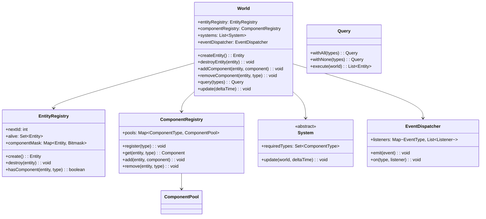
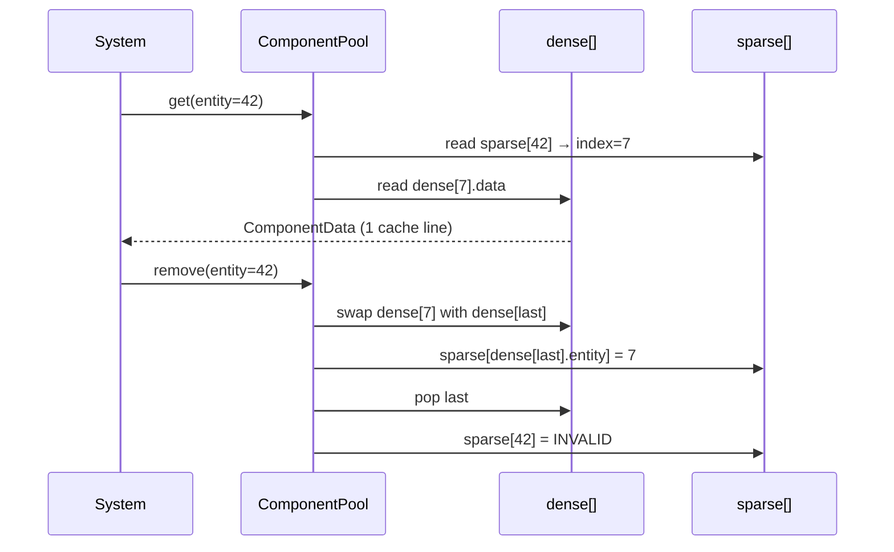
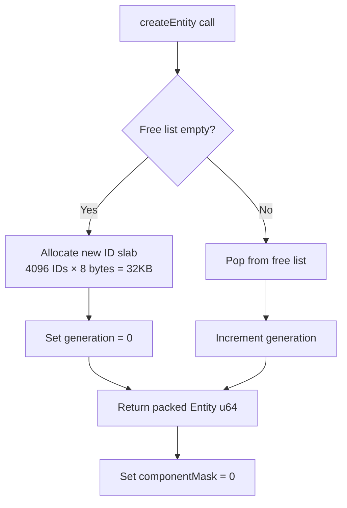
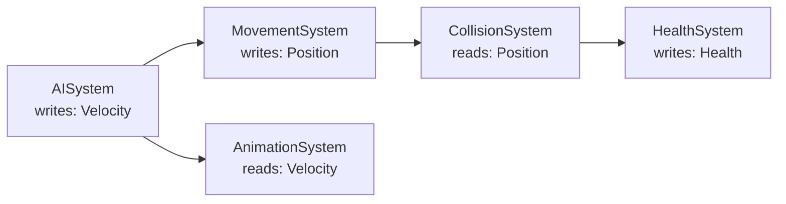
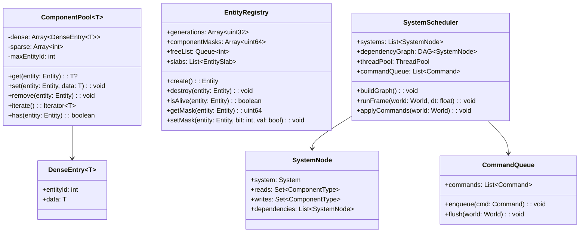

# Design an Entity-Component-System (ECS) Architecture (OOD)

**Difficulty**: 🔴 Advanced
**Codemania**: #141
**Interview Frequency**: Medium

---

## Problem Statement

Design a data-oriented ECS framework used by game engines (Unity DOTS, Bevy, EnTT). Classic OOP inheritance for game objects leads to rigid class hierarchies and cache-unfriendly memory layouts. ECS separates the "what" (Entity — an ID), "data" (Component — plain structs), and "logic" (System — stateless processors) to enable flat composition, hot-swappable behaviour, and CPU cache-friendly iteration over 100,000+ entities at 60 FPS.

---

## Functional Requirements

- Create and destroy entities at runtime
- Attach, detach, and query components on any entity
- Run systems in a defined order each frame; each system filters to its required components
- Dispatch and receive inter-system events without tight coupling
- Support dense storage for frequent components (position, velocity) and sparse for rare ones (sound emitter)

---

## Core Entities (Meta-Architecture)

| Class/Concept | Responsibility |
|---------------|---------------|
| `World` | Root container: entity registry + component storage + system runner |
| `Entity` | Opaque integer ID; carries no data itself |
| `Component` | Plain data struct; no methods; tagged by type |
| `System` | Logic unit; declares required component types; stateless |
| `ComponentRegistry` | Maps component type → storage pool |
| `EntityRegistry` | Tracks which components each entity has (bitmask) |
| `EventDispatcher` | Typed publish/subscribe for inter-system communication |
| `Query` | Fluent builder: filters entities by component set |
| `Archetype` | Group of entities sharing the same component layout |
| `ComponentPool` | Typed dense array storing one component type |

---

## Class Diagram



---

## Design Patterns Used

### 1. ECS (Data-Oriented Design)

**Why it fits**: 10,000 entities with position + velocity updated at 60 FPS = 600,000 update calls/second. With OOP inheritance, each `Entity.update()` call touches scattered heap objects causing cache misses. With ECS, all `PositionComponent` values live in one contiguous array — the CPU prefetcher loads them in bulk. Benchmark: inheritance = ~3M entities/sec; ECS = ~30M entities/sec (10× speedup on modern CPUs).

```
// Struct-of-Arrays layout: all X values together, all Y values together
class PositionPool:
  xs: float[]   // index = entity id
  ys: float[]

// System iterates over a tight array — no pointer chasing
class MovementSystem extends System:
  requiredTypes = {PositionComponent, VelocityComponent}

  update(world: World, dt: float):
    entities = world.query().withAll(requiredTypes).execute(world)
    posPool = world.getPool(PositionComponent)
    velPool = world.getPool(VelocityComponent)

    for entity in entities:
      posPool.xs[entity] += velPool.dxs[entity] * dt
      posPool.ys[entity] += velPool.dys[entity] * dt
```

### 2. Registry — Component Type → Pool

**Why it fits**: At runtime, callers add/get components by type (`world.addComponent(e, new HealthComponent(100))`). The `ComponentRegistry` maps each type to a strongly-typed pool. This is a Type Object / Registry pattern: the component type is a first-class runtime key.

```
class ComponentRegistry:
  pools: Map<ComponentType, ComponentPool>

  register(type: ComponentType): void
    pools[type] = new DenseComponentPool(type)

  add(entity: Entity, component: Component): void
    pool = pools[component.type]
    if pool == null: throw ComponentNotRegisteredException(component.type)
    pool.set(entity, component)

  get(entity: Entity, type: ComponentType): Component
    pool = pools[type]
    return pool?.get(entity)  // null if entity doesn't have this component

  remove(entity: Entity, type: ComponentType): void
    pools[type]?.remove(entity)
    entityRegistry.clearBit(entity, type)
```

### 3. Observer — EventDispatcher for Inter-System Communication

**Why it fits**: Systems must not hold references to each other — that reintroduces coupling. The `CollisionSystem` detecting a hit should not directly call `HealthSystem.damage()`. Instead it emits a `CollisionEvent`; `HealthSystem` subscribes. Any new consumer (audio, achievements) just subscribes — zero changes to `CollisionSystem`.

```
class EventDispatcher:
  listeners: Map<EventType, List<Listener>>

  emit(event: ECSEvent): void
    for listener in listeners.get(event.type) ?? []:
      listener.onEvent(event)

  on(type: EventType, listener: Listener): Subscription
    listeners.computeIfAbsent(type, () -> []).add(listener)
    return Subscription(() -> listeners[type].remove(listener))

// CollisionSystem
class CollisionSystem extends System:
  update(world, dt):
    // detect overlapping bounding boxes
    for (a, b) in broadPhase(world):
      world.eventDispatcher.emit(CollisionEvent(a, b))

// HealthSystem subscribes at startup
world.eventDispatcher.on(CollisionEvent, (e) -> {
  damage = world.getComponent(e.a, DamageComponent)?.value ?? 0
  health = world.getComponent(e.b, HealthComponent)
  if health != null: health.current -= damage
})
```

---

## Key Method: `getEntitiesWith<T>(types)`

The query is the heart of ECS — it must be fast because every System calls it every frame.

```
World:
  query(): Query
    return new Query(this)

Query:
  requiredTypes: Set<ComponentType>
  excludedTypes: Set<ComponentType>

  withAll(types): Query
    requiredTypes.addAll(types)
    return this

  withNone(types): Query
    excludedTypes.addAll(types)
    return this

  execute(world: World): List<Entity>
    requiredMask = world.componentRegistry.buildMask(requiredTypes)
    excludedMask = world.componentRegistry.buildMask(excludedTypes)

    result = []
    for entity in world.entityRegistry.alive:
      entityMask = world.entityRegistry.componentMask[entity]
      // Bitmask check: O(1) per entity
      if (entityMask AND requiredMask) == requiredMask
         AND (entityMask AND excludedMask) == 0:
        result.add(entity)

    return result
```

**Performance**: A bitmask AND for 64-component types fits in a single 64-bit integer comparison. 100,000 entities × 1 comparison = trivial per frame.

---

## Design Decisions & Trade-offs

| Decision | Option A | Option B | Choice |
|----------|----------|----------|--------|
| Component storage | Array-of-structs (all data per entity) | Struct-of-arrays (all data per type) | Struct-of-arrays — CPU cache locality; better for SIMD |
| Entity ID recycling | Increment forever (sparse) | Recycle freed IDs with generation counter | Recycle with generation — avoids stale entity references |
| System ordering | Explicit list ordering | Dependency graph auto-sort | Explicit list for small games; DAG for large engines |
| Sparse components | Same dense pool | Sparse set (hashtable) | Sparse set for components present on <5% of entities |

---

## Top Interview Questions

| Question | What It Tests |
|----------|--------------|
| Why is struct-of-arrays faster than array-of-structs for ECS iteration? | CPU cache lines, memory layout, SIMD |
| An entity is destroyed mid-frame while a system is iterating over it — how do you handle this? | Deferred destruction, tombstone pattern |
| How do you implement a query that finds entities with Position AND Velocity but NOT Static? | Bitmask AND/NOT query, exclude mask |

---

## Related Concepts

- [Game State Management OOD for ECS in full game loop context](./game-state-management)
- [Resource Management OOD for pool/allocation patterns](./resource-management)

---

## Component Deep Dive 1: ComponentPool — Dense vs Sparse Storage

The `ComponentPool` is the single most performance-critical class in the entire ECS. Every frame, every system iterates over component data, and the layout of that data in memory determines whether you hit 30M entities/sec or 3M entities/sec.

### Why Naive Approaches Fail

The first instinct is to store components in a `HashMap<EntityId, Component>`. This works for correctness but kills CPU performance. A hash-map lookup involves pointer chasing: the map resolves to a bucket pointer, the bucket to a linked-list node, the node to the heap-allocated value. For 100,000 entities × 60 FPS = 6M lookups/second, each lookup causing a cache miss at ~200 ns, that's 1.2 seconds of stall per second — the game runs at 0 FPS.

The second instinct is an `ArrayList<(EntityId, Component)>` sorted by entity ID. Linear scan is cache-friendly but O(n) lookup and O(n) removal.

The production solution is a **sparse set** backed by a **dense array**:

- `dense[]` — contiguous array of `(entityId, componentData)` pairs; this is what the CPU prefetcher loads
- `sparse[]` — array indexed by entity ID mapping to position in `dense[]`; used for O(1) lookup

Insertion: `sparse[entity] = dense.size(); dense.append((entity, data))`
Lookup: `dense[sparse[entity]].data`
Removal (swap-and-pop): swap target with last element in dense, update sparse for swapped entity, pop last

This gives O(1) insert/remove/lookup AND cache-friendly iteration over all entities that have the component.

### Pool Internals Diagram



### Storage Strategy Trade-offs

| Approach | Lookup | Iteration | Memory | Best For |
|----------|--------|-----------|--------|----------|
| HashMap | O(1) avg, cache-miss | O(n) scattered | Variable | Prototypes only |
| Dense array (entity-indexed) | O(1) direct | O(max_entity_id) | entity_count × component_size | Components present on >50% of entities |
| Sparse set | O(1), cache-friendly | O(component_count) | 2× dense array | Components present on 1–99% of entities |
| Archetype chunks | O(1) with archetype lookup | O(entities_in_archetype) | Compact per archetype | Engines with fixed component sets (Unity DOTS) |

For a typical game with 100,000 entities where `PositionComponent` is on 90% and `SoundEmitter` is on 2%, the correct choice is: dense array for position/velocity, sparse set for audio/AI/rare components.

---

## Component Deep Dive 2: EntityRegistry — Bitmask and Generation Counters

The `EntityRegistry` has two jobs: (1) track which components each entity currently has, and (2) prevent use-after-free bugs where a destroyed entity's ID gets reused and an old reference silently points at the new entity.

### Bitmask Component Tracking

Each entity gets a 64-bit integer where bit N is set if the entity has component type N. A system that needs `{Position, Velocity, Health}` builds a required mask `0b...0111` and runs one AND per entity to filter. 100,000 entities × one 64-bit AND = ~10 microseconds on modern CPUs — negligible for a 16ms frame budget.

When the component count exceeds 64, use a 128-bit mask (two uint64) or a fixed-size bitset. Unity DOTS uses 128-bit archetypes (up to 128 component types per archetype chunk).

### Generation Counter Pattern

Entity IDs are recycled. When entity 42 dies, its ID goes onto a free list. Next `createEntity()` call pops 42 from the free list and assigns it to the new entity. But any `EntityRef{ id: 42 }` held by a bullet object now silently refers to the new entity (a player perhaps), causing ghost damage bugs.

The fix: entity IDs are `(index: u32, generation: u32)` packed into one u64. The registry stores `generations[index]`. On destroy, `generations[index]++`. On lookup, compare stored generation to the reference's generation — mismatch means stale reference.

### Scale Behavior at 10x Load

At baseline (100k entities), entity creation/destruction fits in L3 cache. At 1M entities (10x), the `generations[]` array is 8MB — exceeds typical L3. Creation becomes cache-miss heavy. Mitigation: slab allocate entity blocks of 4096 IDs; each slab fits in 32KB (L1 cache). The `EntityRegistry` manages slabs, not individual IDs.



---

## Component Deep Dive 3: System Scheduler — Ordering, Parallelism, and Deferred Mutations

A naive ECS runs systems sequentially in a hand-ordered list. This works for a single-threaded game but leaves 7 of 8 CPU cores idle. The system scheduler is where ECS gains its final performance multiplier.

### Dependency Graph Construction

Each system declares:
- `reads: {PositionComponent, VelocityComponent}` — shared read access
- `writes: {PositionComponent}` — exclusive write access

Two systems can run in parallel if their write sets don't overlap and neither writes what the other reads. This is a classic read-write dependency problem; the scheduler builds a DAG and runs independent systems concurrently using a thread pool.



In this DAG, `AISystem` and nothing else runs first; then `MovementSystem` and `AnimationSystem` run in parallel; then `CollisionSystem`; then `HealthSystem`.

### Deferred Mutations

Systems may not modify the entity set while iterating (add/destroy entities). Any mutation mid-iteration invalidates pool iterators. The solution is a **command queue**: mutations are recorded as `{CREATE_ENTITY, DESTROY_ENTITY, ADD_COMPONENT, REMOVE_COMPONENT}` commands and replayed at the end of the frame after all systems finish. This also enables safe multi-threaded system execution — systems write to thread-local command queues, then the scheduler merges and applies them.

---

## Class Design

The expanded class diagram showing pool internals and scheduler:



---

## Design Patterns Applied

### 1. Data-Oriented Design (Struct-of-Arrays)

The `ComponentPool<T>` uses struct-of-arrays layout: all components of the same type are stored contiguously. This is not a GoF pattern, but the foundational pattern of ECS. It enables the CPU prefetcher to load the next 16 `PositionComponent` values while the current 16 are being processed, eliminating cache-miss stalls that dominate OOP object-per-entity designs.

### 2. Registry (Type Object)

`ComponentRegistry` maps `ComponentType` (a runtime token) to a `ComponentPool`. This is the Registry/Type Object pattern from GoF: types themselves become first-class objects. It allows the component system to be fully extensible at runtime — mods and plugins can register new component types without recompiling.

### 3. Observer (EventDispatcher)

`EventDispatcher` decouples systems by letting them communicate through events. `CollisionSystem` emits `CollisionEvent`; `HealthSystem`, `AudioSystem`, and `AchievementSystem` subscribe. This is GoF Observer. The key ECS twist is that subscriptions are managed per-World lifecycle, not per-object, avoiding the classic Observer memory leak of forgotten unsubscriptions.

### 4. Command (Deferred Mutations)

The `CommandQueue` records mutation operations (`AddComponent`, `DestroyEntity`) and replays them after all systems finish. This is GoF Command pattern. It enables safe multi-threaded system execution by serializing mutations to a single commit point.

### 5. Flyweight (Entity as Opaque ID)

An `Entity` is just a `uint64` — an index+generation pair. It carries no data itself. This is GoF Flyweight: the intrinsic state (component data) lives in the pools; the entity is a pure extrinsic key. Millions of entities cost only 8 bytes each.

---

## SOLID Principles

**Single Responsibility**: `ComponentPool<T>` stores one component type; `EntityRegistry` tracks existence and masks; `SystemScheduler` orders and runs systems. No class does more than one job.

**Open/Closed**: Adding a new component type (e.g., `PhysicsBodyComponent`) requires registering a new pool — no existing code changes. Adding a new system (e.g., `ParticleSystem`) requires registering it with the scheduler — no existing code changes. The World is open for extension via registration, closed for modification.

**Liskov Substitution**: All `System` subclasses override `update(world, dt)` and declare their `reads`/`writes`. Any `System` can be swapped with another — the scheduler treats them identically. A `MockPhysicsSystem` can replace `PhysicsSystem` in tests without the scheduler knowing.

**Interface Segregation**: `ComponentPool<T>` exposes `get/set/remove/iterate` — not serialization, not debugging, not networking. Separate interfaces (`Serializable`, `Debuggable`) are added via composition when needed.

**Dependency Inversion**: `System.update(world: World, dt: float)` depends on the `World` abstraction, not on concrete pools. In tests, inject a `TestWorld` with fixed component data. Systems are pure logic — they don't instantiate storage.

---

## Concurrency and Thread Safety

### Concurrent Operations

Three concurrent operations are possible in a parallel ECS:
1. **Parallel system reads** — multiple systems reading different or same component types simultaneously
2. **Parallel system writes** — two systems writing different component types simultaneously (safe)
3. **Command queue writes** — systems enqueue mutations to thread-local queues (safe); scheduler applies them serially after all systems complete

### Thread Safety Mechanisms

**Read-write locks per ComponentPool**: Each `ComponentPool<T>` carries a `RWLock`. Systems declare upfront whether they read or write each component type. The scheduler acquires read locks for all read pools and write locks for all write pools before dispatching a system. Two systems with overlapping write sets are never dispatched simultaneously — the dependency graph ensures this.

**Atomic generation counter**: `EntityRegistry.generations[index]` is incremented on destroy. This must be an atomic store — if a system reads `generations[id]` while the scheduler destroys entity `id` on another thread, a non-atomic increment yields a torn read. Use `std::atomic<uint32_t>` (C++) or `AtomicInteger` (Java/Kotlin).

**Lock-free command queues**: Each worker thread has its own `CommandQueue`. Worker threads push commands without synchronization (no sharing). After the frame, the scheduler thread iterates each worker's queue and applies mutations. This is a classic producer-consumer partitioned by thread identity — zero lock contention during system execution.

---

## Extension Points

### Adding a New Component Type

```
// 1. Define the struct (no methods needed)
struct BurningComponent:
  damagePerSecond: float
  remainingDuration: float

// 2. Register with the World at startup
world.componentRegistry.register(BurningComponent)

// 3. System that processes it
class BurningSystem extends System:
  reads = {}
  writes = {HealthComponent, BurningComponent}
  update(world, dt):
    for entity in world.query().withAll({BurningComponent, HealthComponent}).execute():
      burning = world.getComponent(entity, BurningComponent)
      health  = world.getComponent(entity, HealthComponent)
      health.current -= burning.damagePerSecond * dt
      burning.remainingDuration -= dt
      if burning.remainingDuration <= 0:
        world.commandQueue.enqueue(RemoveComponent(entity, BurningComponent))
```

Zero changes to existing systems. Zero changes to `World`, `EntityRegistry`, or `ComponentRegistry`. This is the Open/Closed principle in practice.

### Adding Network Synchronization

Attach a `NetworkSyncComponent` to entities that should replicate. A `NetworkSyncSystem` subscribes to component change events (emitted by pools on `set()`), serializes changed components, and sends deltas over UDP. Non-networked entities never pay the serialization cost because they lack `NetworkSyncComponent`.

---

## Data Model

The ECS data model maps cleanly to typed arrays. Below is a representative in-memory layout for a game with three core component types, plus the SQL equivalent for a game that persists entity state to a database (e.g., an MMO server):

```sql
-- Entity table: one row per entity, tracks liveness and component bitmask
CREATE TABLE entities (
    entity_index    INTEGER      NOT NULL,     -- lower 32 bits of entity ID
    generation      INTEGER      NOT NULL,     -- upper 32 bits; detects stale refs
    component_mask  BIGINT       NOT NULL DEFAULT 0,  -- bit N = has component N
    created_at      TIMESTAMPTZ  NOT NULL DEFAULT now(),
    destroyed_at    TIMESTAMPTZ,               -- NULL = alive
    PRIMARY KEY (entity_index, generation)
);

-- PositionComponent: present on ~90% of entities → dense storage
CREATE TABLE component_position (
    entity_index    INTEGER NOT NULL,
    generation      INTEGER NOT NULL,
    x               FLOAT   NOT NULL,
    y               FLOAT   NOT NULL,
    z               FLOAT   NOT NULL,
    PRIMARY KEY (entity_index, generation),
    FOREIGN KEY (entity_index, generation) REFERENCES entities(entity_index, generation)
);
CREATE INDEX idx_position_entity ON component_position(entity_index);

-- HealthComponent: present on ~40% of entities
CREATE TABLE component_health (
    entity_index    INTEGER NOT NULL,
    generation      INTEGER NOT NULL,
    current_hp      FLOAT   NOT NULL,
    max_hp          FLOAT   NOT NULL,
    regen_per_sec   FLOAT   NOT NULL DEFAULT 0,
    PRIMARY KEY (entity_index, generation)
);

-- SoundEmitterComponent: present on ~2% of entities → sparse
CREATE TABLE component_sound_emitter (
    entity_index    INTEGER  NOT NULL,
    generation      INTEGER  NOT NULL,
    sound_asset_id  VARCHAR(128) NOT NULL,
    volume          FLOAT    NOT NULL DEFAULT 1.0,
    is_looping      BOOLEAN  NOT NULL DEFAULT FALSE,
    PRIMARY KEY (entity_index, generation)
);

-- Archetype table: groups of entities sharing the same component layout
CREATE TABLE archetypes (
    archetype_id    SERIAL  PRIMARY KEY,
    component_mask  BIGINT  NOT NULL UNIQUE,     -- bitmask of components in this archetype
    entity_count    INTEGER NOT NULL DEFAULT 0
);

-- Map entities to archetypes for chunk-based iteration (Unity DOTS style)
CREATE INDEX idx_entities_mask ON entities(component_mask);
CREATE INDEX idx_entities_alive ON entities(destroyed_at) WHERE destroyed_at IS NULL;
```

In-memory (C++/Rust/Java), the same layout uses typed arrays:

```
struct World:
  positions:     PositionPool     // xs: float[], ys: float[], zs: float[]
  healths:       HealthPool        // current: float[], max: float[], regen: float[]
  soundEmitters: SoundEmitterPool  // sparse: HashMap<EntityIndex, SoundEmitterData>
  entities:      EntityRegistry    // generations: uint32[], masks: uint64[]
```

---

## Scale Bottlenecks

| Traffic Level | Component That Breaks | Symptoms | Mitigation |
|---------------|----------------------|----------|------------|
| Baseline (100k entities, 60 FPS) | None | Stable 16ms frame | — |
| 10x (1M entities) | `EntityRegistry.generations[]` array | 8MB array evicts L3 cache; entity creation latency spikes 5x | Slab-allocate entity blocks of 4096; keep hot slabs in L1/L2 |
| 10x (1M entities) | Bitmask query linear scan | Query time grows from 0.1ms to 1ms per system; frame budget exceeded | Maintain per-archetype entity lists; query skips archetypes missing required bits |
| 100x (10M entities) | ComponentPool dense arrays | PositionPool alone = 120MB; exceeds L3; DRAM latency dominates | Archetype chunks (Unity DOTS style): pack all components of same archetype into 16KB chunks; chunk fits in L1 |
| 100x (10M entities) | System scheduler DAG construction | Rebuild DAG each frame is O(systems²) | Build DAG once at startup; only rebuild when system set changes (rare) |
| 1000x (100M entities) | Single-machine memory | 100M entities × 24 bytes position = 2.4GB; OOM on game console | Hierarchical ECS: active entities in hot ECS, inactive entities serialized to disk; stream in/out based on spatial proximity |
| 1000x (100M entities, MMO server) | Command queue flush | 10M mutations per frame; serial flush takes >16ms | Partition by spatial region; each region runs its own mini-ECS; inter-region events only for boundary crossings |

---

## How Unity Technologies Built This (Unity DOTS)

Unity's Data-Oriented Technology Stack (DOTS) is the most publicly documented production ECS implementation. Unity shipped DOTS as part of Unity 2019 LTS and has published detailed engineering blog posts and Unite conference talks.

**Technology choices**: Unity DOTS uses C# with the Burst compiler, which compiles a restricted subset of C# (no GC allocations, no managed references) to native SIMD instructions. This is critical: the ECS pattern buys cache locality, but you also need the CPU to execute SIMD instructions over those arrays. Burst auto-vectorizes loops over `NativeArray<float3>` (SIMD-packed position arrays), achieving 4-8x speedup over scalar C# on AVX2 hardware.

**Archetype Chunk Layout**: Unity DOTS groups entities by archetype (the exact set of components they carry). Each archetype chunk is exactly 16KB — the size of an L1 cache line block. A chunk holds as many entity component sets as fit in 16KB. The chunk is the unit of iteration: systems iterate chunks, not individual entities. With 16KB chunks and a 256KB L1 cache, 16 chunks are in flight simultaneously.

**Specific numbers**: Unity reports that a prototype of 100,000 units in a real-time strategy game ran at ~1ms/frame for the movement and collision systems using DOTS, compared to ~80ms/frame for the equivalent MonoBehaviour (classic Unity OOP) implementation — an **80x speedup**. At Unite Copenhagen 2019, the Megacity demo ran 4.5 million entities (vehicles, pedestrians, buildings) at 60 FPS on a mid-range PC, which would be impossible with OOP.

**Non-obvious architectural decision**: Unity made `Entity` a value type (struct) rather than a reference type (class). This seems obvious in hindsight but was a breaking change from classic Unity. It means holding an `Entity` doesn't prevent GC collection of anything, there are no circular reference cycles, and entity arrays are blittable — the Burst compiler can treat them as raw memory.

**Source**: Unite Copenhagen 2019 — "Converting Your Game to DOTS" talk by Mike Geig. Unity DOTS documentation at docs.unity3d.com/Packages/com.unity.entities@latest.

---

## Interview Angle

**What the interviewer is testing:** The ability to reason about memory layout and CPU cache behavior in a large-scale iteration problem, and the judgment to choose composition over inheritance when behavior must be mixed at runtime.

**Common mistakes candidates make:**

1. **Jumping to HashMap for component storage** without mentioning cache misses. HashMap lookup is O(1) in theory but causes pointer chasing in practice. Candidates who propose HashMap without acknowledging the cache miss cost will lose points in a systems-level interview. Always mention the sparse set or dense array alternative.

2. **Ignoring the stale entity reference problem.** Candidates design `create`/`destroy` entity methods but forget that an entity ID can be recycled. Any system holding an old `EntityId` now refers to the wrong entity. The generation counter solution must be volunteered — if the interviewer has to ask "what if the entity is destroyed and the ID is reused?", you've missed a key reliability concern.

3. **Treating system ordering as a simple sorted list.** Saying "just run systems in order" ignores that systems can run in parallel if their write sets don't overlap. Missing the dependency graph means missing the primary performance mechanism for multi-core CPUs — in 2024, a game engine that can only use 1 of 8 cores is a failed design.

**The insight that separates good from great answers:** The best candidates explain that ECS is not primarily about composition (though that's a benefit) — it's about **turning a random-access memory pattern into a sequential-access memory pattern**. The CPU cache is the bottleneck in entity-heavy simulations, and ECS is the pattern that makes 10M entity games possible by ensuring that every byte fetched from DRAM is used, not discarded as irrelevant object header overhead.

---

## Key Numbers to Remember

| Metric | Value | Context |
|--------|-------|---------|
| Cache-miss penalty | ~200 ns (~600 CPU cycles at 3 GHz) | One pointer chase to a random heap location on a cold cache |
| OOP entity throughput | ~3M entities/sec | Classic `Entity.update()` with virtual dispatch and scattered heap objects |
| ECS entity throughput (single-core) | ~30M entities/sec | Struct-of-arrays with dense iteration; 10x over OOP |
| ECS entity throughput (SIMD, Burst) | ~200M entities/sec | Unity DOTS with AVX2 vectorization over float3 arrays |
| Bitmask query cost | ~0.1ms for 100k entities | One 64-bit AND + compare per entity; fits in a single SIMD instruction for 4 entities |
| Archetype chunk size | 16KB | Unity DOTS; matches L1 cache; pack as many entity component sets as fit |
| Unity Megacity demo | 4.5M entities @ 60 FPS | Unite Copenhagen 2019; impossible with OOP MonoBehaviour |
| DOTS vs MonoBehaviour speedup | 80x | 100k-unit RTS prototype: 1ms vs 80ms per frame for movement + collision |
| Sparse set overhead vs dense array | ~20% | Indirection through sparse[] array; negligible for components on <50% of entities |
| Deferred command queue flush | <0.5ms for 10k mutations | Serial apply after all systems complete; safe for multi-threaded system execution |

---

## 📚 Resources & References

| Resource | Type | What You'll Learn |
|----------|------|------------------|
| [NeetCode OOD Playlist](https://www.youtube.com/@NeetCode) | 📺 YouTube | Component and composition patterns |
| [Game Programming Patterns — Component](https://gameprogrammingpatterns.com/component.html) | 📖 Blog | ECS rationale and implementation (free) |
| [ByteByteGo System Design](https://www.youtube.com/@ByteByteGo) | 📺 YouTube | Data-oriented design overview |
| [Head First Design Patterns](https://www.oreilly.com/library/view/head-first-design/0596007124/) | 📚 Book | Registry and Observer pattern chapters |
| [GoF Design Patterns](https://www.amazon.com/Design-Patterns-Elements-Reusable-Object-Oriented/dp/0201633612) | 📚 Book | Observer and Flyweight (Entity as flyweight) reference |
