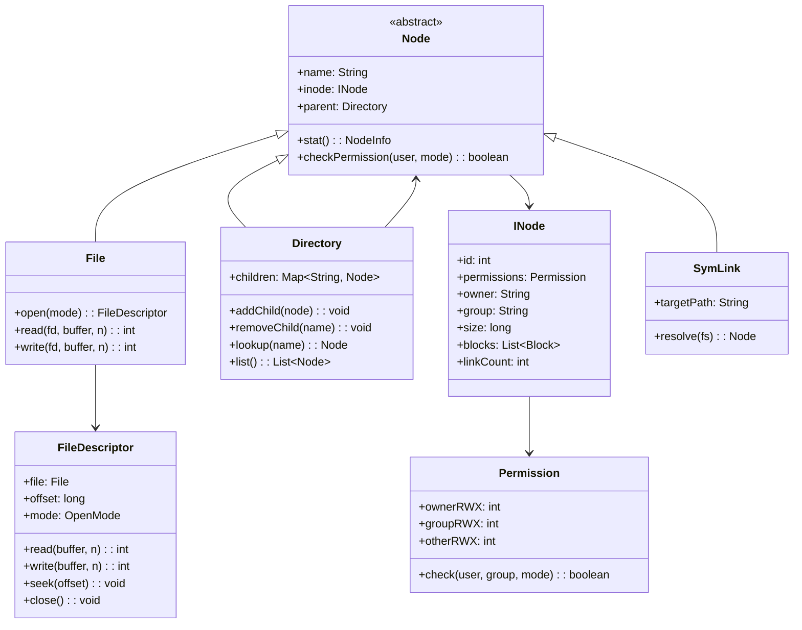
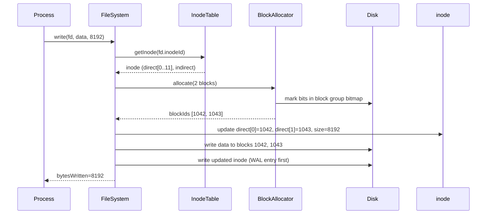
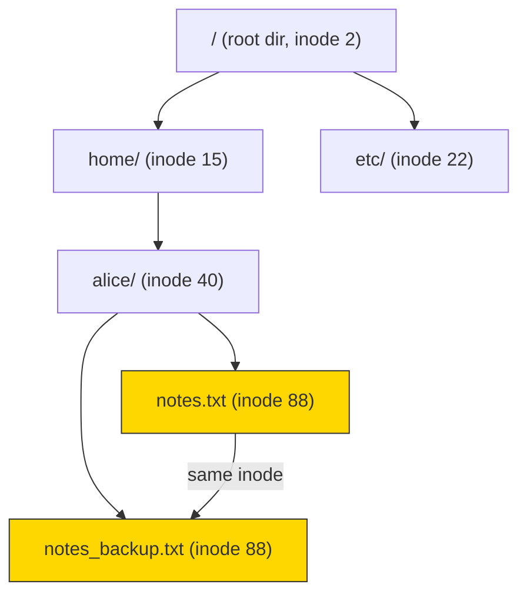
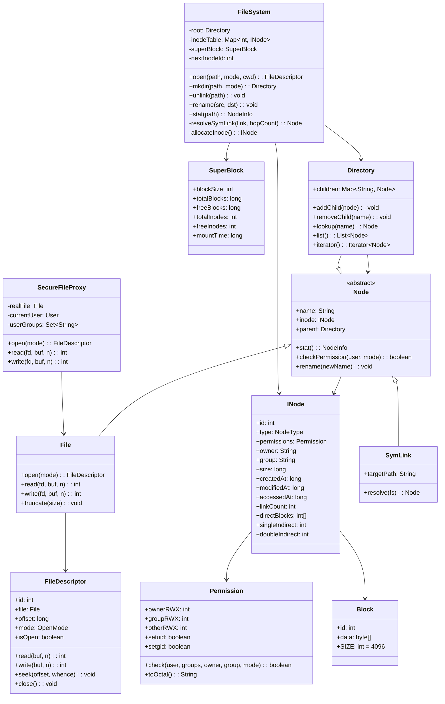

# Design a File System (OOD)

**Difficulty**: 🔴 Advanced
**Codemania**: #129
**Interview Frequency**: Medium

---

## Problem Statement

Model a UNIX-like file system where files and directories share a common interface, access is permission-controlled, and the directory tree can be traversed uniformly. The OOD challenge is the dual nature of the tree: `Directory` contains `Node`s, and each `Node` can itself be a `Directory` — Composite pattern fits perfectly. Security enforcement must not pollute the file's core read/write logic — that's a Proxy.

---

## Functional Requirements

- Create, read, write, delete files and directories
- Navigate directory tree via absolute or relative paths
- Enforce POSIX-style permissions (owner/group/other × read/write/execute)
- Open files and return a file descriptor for subsequent reads/writes
- Traverse directories recursively (BFS or DFS)
- Support hard links (two names → same inode) and symbolic links

---

## Core Entities

| Class | Responsibility |
|-------|---------------|
| `FileSystem` | Root entry point; mounts volumes; path resolution |
| `INode` | On-disk representation: permissions, size, block pointers |
| `Node` (abstract) | Common interface: name, permissions, parent, stat() |
| `File` | Leaf node; delegates reads/writes to block storage |
| `Directory` | Container node; holds children by name; resolves relative paths |
| `FileDescriptor` | Per-process handle: file ref + offset + open mode |
| `Permission` | Bitmask: owner/group/other × rwx; validates access |
| `Block` | Fixed-size (4 KB) data unit stored on disk |
| `SuperBlock` | Volume metadata: block size, total blocks, free list |
| `SymLink` | Stores target path; resolved on each open |

---

## Class Diagram



---

## Design Patterns Used

### 1. Composite — Uniform Node Interface

**Why it fits**: Both `File` and `Directory` need the same `stat()`, `checkPermission()`, and `rename()` operations. Treating them as the same `Node` type means path traversal, permission checking, and link counting work identically without `instanceof` checks.

```
abstract class Node:
  name: String
  inode: INode

  stat(): NodeInfo
    return NodeInfo(name, inode.size, inode.permissions, inode.modifiedAt)

  checkPermission(user: String, mode: AccessMode): boolean
    return inode.permissions.check(user, inode.owner, inode.group, mode)

class Directory extends Node:
  children: Map<String, Node>

  lookup(name: String): Node
    return children.get(name)  // returns File, Directory, or SymLink

class File extends Node:
  // no children — leaf node
```

### 2. Proxy — Permission-Enforced File Access

**Why it fits**: Inserting permission checks into `File.read()` and `File.write()` violates Single Responsibility — the file should focus on I/O. A `SecureFileProxy` wraps the real `File`, checks permissions before delegating, and can also add logging or caching without touching the file logic.

```
class SecureFileProxy:
  realFile: File
  currentUser: User

  open(mode: OpenMode): FileDescriptor
    if not realFile.checkPermission(currentUser, mode):
      throw PermissionDeniedException(currentUser, realFile.name, mode)
    return realFile.open(mode)

  read(fd, buffer, n):
    // permission already checked at open; just delegate
    return realFile.read(fd, buffer, n)
```

### 3. Iterator — Directory Traversal

**Why it fits**: Callers need to walk the tree without knowing the internal structure of `Directory`. Iterator hides whether traversal is BFS or DFS and makes it easy to swap strategies (e.g., alphabetical order, depth limit).

```
class BFSDirectoryIterator implements Iterator<Node>:
  queue: Queue<Node>

  constructor(root: Directory):
    queue.enqueue(root)

  hasNext(): boolean
    return not queue.isEmpty()

  next(): Node
    node = queue.dequeue()
    if node instanceof Directory:
      for child in node.list():
        queue.enqueue(child)
    return node
```

### 4. Template Method — File Open/Read/Write/Close Protocol

**Why it fits**: Every file type (regular, pipe, socket, device) follows the same open → read/write → flush → close lifecycle. The base class owns the protocol; subtypes override only the parts that differ (e.g., a pipe has no seek).

```
abstract class AbstractFile extends Node:
  open(mode): FileDescriptor
    fd = allocateDescriptor(mode)
    onOpen(fd)         // hook
    return fd

  close(fd): void
    onFlush(fd)        // hook — flush buffers
    releaseDescriptor(fd)

  abstract onOpen(fd): void
  abstract onFlush(fd): void
```

---

## Key Method: `open(path, mode)`

Path resolution is the most complex method in a file system — it handles absolute paths, relative paths, `.` and `..` components, and symlink resolution.

```
FileSystem:
  open(path: String, mode: OpenMode, currentDir: Directory): FileDescriptor
    // 1. Tokenize path
    parts = path.split("/")
    node = path.startsWith("/") ? root : currentDir

    // 2. Walk each component
    for part in parts:
      if part == "" or part == ".":
        continue
      if part == "..":
        node = node.parent ?? node   // root has no parent
        continue

      if node is not Directory:
        throw NotADirectoryException(node.name)

      child = node.lookup(part)
      if child == null:
        if mode has CREATE flag:
          child = new File(part, defaultPermissions)
          node.addChild(child)
        else:
          throw FileNotFoundException(path)

      // 3. Resolve symlinks (guard against cycles with hop count)
      if child instanceof SymLink:
        child = resolveSymLink(child, hopCount=0)

      node = child

    // 4. Check permission on the final node
    proxy = new SecureFileProxy(node as File, currentUser)
    return proxy.open(mode)
```

---

## Design Decisions & Trade-offs

| Decision | Option A | Option B | Choice |
|----------|----------|----------|--------|
| Permission model | POSIX rwx bitmask | ACL (per-user entries) | POSIX for OOD scope; ACL in enterprise FS (NTFS, ext4 with ACL) |
| Hard links | Share INode (linkCount++) | Copy INode on link | Share INode — UNIX semantics: delete removes link, not inode |
| Symlink resolution | Resolve at open() | Resolve at every syscall | Resolve at open() — performance; store resolved fd |
| Directory children | HashMap (O(1) lookup) | Sorted array (O(log n)) | HashMap — lookup-heavy workloads dominate |
| Block size | Fixed 4 KB | Variable | Fixed — simplifies allocation and disk layout |

---

## Top Interview Questions

| Question | What It Tests |
|----------|--------------|
| How do you detect a symlink cycle (A → B → A) during path resolution? | Cycle detection, hop count guard |
| How would you implement `cp -r` (recursive copy) using the tree structure? | Composite traversal, deep copy |
| How does deleting a hard-linked file work — when is the data actually freed? | INode reference counting, linkCount |

---

## Related Concepts

- [Resource Management OOD for pool/lease abstraction](./resource-management)
- [Warehouse Management OOD for similar hierarchical location model](./warehouse-management)

---

## Component Deep Dive 1: INode and Block Allocation

The `INode` (index node) is the heart of a UNIX-like file system — it stores every piece of metadata about a file except its name. Names live in directory entries; the inode holds permissions, timestamps, size, owner, group, link count, and pointers to the actual data blocks on disk.

### How It Works Internally

Each inode is a fixed-size structure (128–256 bytes in ext4). The file system pre-allocates an inode table at format time, so every inode has a stable numeric ID. File data is split into fixed-size blocks (4 KB by default). The inode holds a list of block pointers using a multi-level indirection scheme:

- **Direct blocks** (12 pointers): store the first 48 KB inline — zero additional I/O for small files.
- **Single indirect block** (1 pointer → block of 1024 pointers): covers up to 4 MB.
- **Double indirect** (1 → 1024 → 1024): covers up to 4 GB.
- **Triple indirect**: covers up to 4 TB — enough for practical use cases.

This tiered scheme means small files (< 48 KB) are accessed in a single read; large files incur one or two extra block reads for pointer lookup.

### Why Naive Approaches Fail at Scale

A flat array of all block addresses stored inside the inode fails for two reasons:

1. **Fixed inode size limit**: You can only fit ~12 direct pointers in a 128-byte structure. Storing a 10 GB file's 2.5 million block addresses inside the inode itself is impossible.
2. **Fragmentation during concurrent writes**: If two processes allocate blocks simultaneously from a single free-block bitmap without locking, they collide. Production kernels use per-group block bitmaps (ext4 block groups) so contention is localized.



### Implementation Options

| Approach | Max File Size | Small File Read Overhead | Implementation Complexity |
|----------|--------------|--------------------------|--------------------------|
| Flat direct pointers (12 only) | 48 KB | 0 extra I/Os | Very low |
| Multi-level indirection (ext4 style) | 4 TB+ | 0 for < 48 KB, 1-2 for large | Medium |
| Extent-based (NTFS, ext4 extents) | 16 TB+ | 0-1 (contiguous range pointer) | Medium-high |

Extent-based allocation (a range descriptor: start-block + length) is the modern choice: a single extent covers a contiguous 128 MB chunk with one pointer, eliminating most indirect lookups entirely. ext4 defaults to extent-mode for new files, falling back to indirect only for heavily fragmented legacy files.

---

## Component Deep Dive 2: Directory Entry and Path Resolution

A `Directory` in POSIX is itself a special file whose contents are a list of `(name → inode_number)` mappings called directory entries (dirents). The directory does not store file data — it stores names and inode IDs. This indirection is what makes hard links possible: two directory entries can point to the same inode number.

### Internal Mechanics



`notes.txt` and `notes_backup.txt` share inode 88. Both are hard links. The inode's `linkCount` is 2. When one is deleted (`unlink`), `linkCount` drops to 1. The inode and its data blocks are only freed when `linkCount` reaches 0 and no open file descriptors hold a reference to the inode.

### Path Resolution Algorithm

```
resolve(path: String, cwd: Directory): Node
  components = tokenize(path)     // split on "/"
  cursor = path.startsWith("/") ? root : cwd

  for each component in components:
    if component == "." or component == "":
      continue
    if component == "..":
      cursor = cursor.parent ?? cursor   // root's parent = root
      continue
    entry = cursor.lookup(component)
    if entry == null: throw FileNotFoundException
    if entry is SymLink:
      target = resolveSymLink(entry, hopLimit=40)  // POSIX max = 40
      entry = target
    cursor = entry

  return cursor
```

### Scale Behavior at 10x Load

A single directory with 1 million children degrades from O(1) HashMap lookup to O(n) linear scan if the backing store is a simple linked list (as in early ext2). ext4 introduced `dir_index`, a hash tree (HTree) — essentially a B-tree keyed by the filename hash — enabling O(log n) lookup in large directories. At 10x the directory entry count, linear scan latency grows 10x; HTree grows only log₁₀ slower.

| Directory Size | Linear List Lookup | HTree (ext4) Lookup |
|---------------|-------------------|---------------------|
| 1,000 entries | ~0.1 ms | ~0.01 ms |
| 100,000 entries | ~10 ms | ~0.04 ms |
| 1,000,000 entries | ~100 ms (unusable) | ~0.06 ms |

---

## Component Deep Dive 3: Permission Model and the Proxy Layer

POSIX permissions encode three 3-bit fields (owner/group/other) × three permission bits (read=4, write=2, execute=1). A file with mode `0644` grants owner read+write (6), group read (4), others read (4). The execute bit on a directory means "can enter" (traverse), not "run."

### Technical Decisions

The `Permission` class stores three integers and exposes a single `check(user, userGroups, targetOwner, targetGroup, mode)` method:

```
class Permission:
  ownerRWX: int   // 0..7
  groupRWX: int
  otherRWX: int

  check(user: String, userGroups: Set<String>,
        owner: String, group: String,
        mode: AccessMode): boolean
    if user == "root": return true      // root bypasses all checks
    if user == owner:
      return (ownerRWX & mode.bit) != 0
    if userGroups.contains(group):
      return (groupRWX & mode.bit) != 0
    return (otherRWX & mode.bit) != 0
```

The `SecureFileProxy` enforces this check at `open()` time (not at every `read()/write()`), matching POSIX semantics: permission is evaluated once when the file descriptor is created. Subsequent reads use the already-opened fd. This is non-obvious to many candidates — you can `chmod 000 file` after opening it, and existing fds remain valid.

### setuid / setgid Bit Extension

A real system also handles the setuid bit (bit 4 on owner), which causes the process to run as the file's owner. The `Permission` class needs a `setuid: boolean` flag and the `FileDescriptor` must carry the effective UID for downstream checks. This is the minimal extension that separates a toy OOD answer from a production-aware one.

---

## Class Design (Extended)



---

## Design Patterns Applied

### 1. Composite — Uniform Tree Node Interface

`Node` is the Component, `File` is the Leaf, `Directory` is the Composite. Both share `stat()`, `checkPermission()`, and `rename()`. The client (e.g., `cp -r`) recurses through the tree without caring whether each node is a file or directory — it calls the same interface. Without Composite, every traversal algorithm would need `instanceof Directory` guards.

### 2. Proxy — Permission-Enforced Access

`SecureFileProxy` implements the same interface as `File` and wraps a real `File`. It intercepts `open()`, verifies the calling user's permissions, and only then delegates to the real file. This cleanly separates the security concern from I/O logic (Single Responsibility). The same proxy can be extended to add audit logging, rate limiting, or encryption without modifying `File`.

### 3. Iterator — Decoupled Tree Traversal

`BFSDirectoryIterator` (and an optional `DFSDirectoryIterator`) expose a uniform `hasNext()/next()` interface over the tree. Clients like `find`, `du`, or `grep -r` consume the iterator without knowing whether traversal is BFS or DFS, alphabetically sorted, or depth-limited. Swapping traversal strategy is a one-line constructor change.

### 4. Template Method — File Lifecycle Protocol

`AbstractFile.open()` defines the skeleton: allocate descriptor → `onOpen()` hook → return fd. `AbstractFile.close()` defines: `onFlush()` hook → release descriptor. Regular files override `onFlush()` to flush dirty pages. Pipes override `onOpen()` to set up the read/write ends. Device files override both. The protocol never changes; only the hooks do.

### 5. Factory Method — Node Creation

`FileSystem.mkdir()` and `FileSystem.createFile()` are factory methods: callers ask for a new directory or file without knowing the concrete class (could be `EncryptedFile`, `CompressedFile`, `ReadOnlyFile`). This lets the file system swap implementations based on mount options without changing call sites.

---

## SOLID Principles

**Single Responsibility (S)**: `INode` holds metadata only — no I/O logic. `File` handles I/O only — no permission logic. `SecureFileProxy` handles permissions only — no I/O logic. `Block` holds raw bytes only. Each class has exactly one axis of change.

**Open/Closed (O)**: Adding a new node type (e.g., `SocketFile`, `NamedPipe`) means subclassing `Node` — no modifications to `Directory`, `FileSystem`, or any traversal algorithm. Adding new security policies (rate limiting, encryption) means creating a new proxy class wrapping `File` — the real `File` never changes.

**Liskov Substitution (L)**: Anywhere a `Node` is expected, you can substitute `File`, `Directory`, or `SymLink`. A `cp -r` function that accepts `Node` and recurses works correctly with all subtypes. `SymLink` is the tricky case: it overrides `stat()` to follow the link, matching the expected behavior.

**Interface Segregation (I)**: `FileDescriptor` exposes `read()/write()/seek()/close()` — clients that only read never see `write()`. `Directory` exposes `addChild()/removeChild()/lookup()` — clients that only traverse never interact with mutation methods. Separating the read interface from the write interface prevents accidental writes through read-only descriptors.

**Dependency Inversion (D)**: `BFSDirectoryIterator` depends on the `Node` abstraction, not `File` or `Directory` concretions. `FileSystem.open()` depends on the `INodeTable` interface — the in-memory table and an on-disk table are interchangeable. Tests inject a mock `BlockAllocator` without touching `INode`.

---

## Concurrency and Thread Safety

Several operations must be made concurrent-safe in a multi-process/multi-thread file system:

### Concurrent Operations

1. **Concurrent writes to the same file**: Two processes writing to the same file at different offsets can corrupt data if block allocation isn't atomic. The inode must be locked during the block-allocation + inode-update cycle.

2. **Concurrent directory mutations**: `addChild()` and `removeChild()` on a `Directory` must be protected by a per-directory read-write lock. Reads (lookup, list) can proceed concurrently; writes (add, remove) require exclusive access.

3. **FileDescriptor offset**: Each `FileDescriptor` has its own `offset` — no sharing needed between descriptors. But if two descriptors reference the same file opened with `O_APPEND`, both writes must atomically seek-to-end + write.

### Thread Safety Design

```
class Directory:
  children: Map<String, Node>
  lock: ReadWriteLock

  lookup(name: String): Node
    lock.readLock().lock()
    try: return children.get(name)
    finally: lock.readLock().unlock()

  addChild(node: Node): void
    lock.writeLock().lock()
    try:
      if children.containsKey(node.name): throw FileExistsException
      children.put(node.name, node)
    finally: lock.writeLock().unlock()
```

For inode updates (size, linkCount, timestamps), use compare-and-swap (CAS) on atomic fields to avoid lock contention on high-read workloads where many files are opened simultaneously.

### Deadlock Prevention

If a rename crosses two directories (`mv /a/x /b/x`), the naive approach of locking `dir_a` then `dir_b` causes deadlock if another thread simultaneously does `mv /b/y /a/y`. The fix: always acquire directory locks in inode-number order (lower ID first), ensuring a global lock ordering that prevents cycles.

---

## Extension Points

### Adding Encryption

Create `EncryptedFileProxy` that wraps `File`, decrypts data on `read()` and encrypts on `write()`. The proxy chain becomes: `SecureFileProxy` → `EncryptedFileProxy` → `File`. The Decorator pattern enables stacking: encrypted + logged + rate-limited without modifying `File`.

### Adding File Watches (inotify-style)

Extend `INode` with an `ObserverList<FileWatcher>`. `File.write()` calls `inode.notifyObservers(EVENT_MODIFY)` after each write. `Directory.addChild()` calls `notifyObservers(EVENT_CREATE)`. This is the Observer pattern: watchers register on the inode and receive events asynchronously, enabling tools like `webpack --watch` or `jest --watch`.

### Adding Quotas

Create a `QuotaManager` that tracks (user, group) → (used_blocks, inode_count). `BlockAllocator.allocate()` calls `quotaManager.checkAndReserve(user, blocks)` before allocation — throws `QuotaExceededException` if over limit. The file system never needs to know about quotas directly.

### Adding Compression

Create `CompressedFile extends File` that overrides `read()` to decompress from blocks and `write()` to compress before writing. Because the base type is `File`, existing code that accepts `File` works unchanged — open/closed principle in action.

---

## Data Model

```sql
-- INode table (stored on disk, one row per file/directory/symlink)
CREATE TABLE inodes (
    inode_id        BIGINT PRIMARY KEY,
    node_type       ENUM('file', 'directory', 'symlink') NOT NULL,
    owner_uid       INT NOT NULL,
    group_gid       INT NOT NULL,
    permissions     SMALLINT NOT NULL,          -- 12-bit: setuid|setgid|sticky|rwx*3
    size_bytes      BIGINT NOT NULL DEFAULT 0,
    link_count      INT NOT NULL DEFAULT 1,
    created_at      BIGINT NOT NULL,            -- Unix timestamp nanoseconds
    modified_at     BIGINT NOT NULL,
    accessed_at     BIGINT NOT NULL,
    direct_block_0  BIGINT REFERENCES blocks(block_id),
    direct_block_1  BIGINT REFERENCES blocks(block_id),
    -- ... direct_block_11
    single_indirect BIGINT REFERENCES blocks(block_id),
    double_indirect BIGINT REFERENCES blocks(block_id),
    triple_indirect BIGINT REFERENCES blocks(block_id)
);

-- Directory entries (one row per name in a directory)
CREATE TABLE dir_entries (
    parent_inode_id BIGINT NOT NULL REFERENCES inodes(inode_id),
    child_name      VARCHAR(255) NOT NULL,
    child_inode_id  BIGINT NOT NULL REFERENCES inodes(inode_id),
    PRIMARY KEY (parent_inode_id, child_name),
    INDEX idx_parent (parent_inode_id)          -- fast directory listing
);

-- Blocks (raw data pages)
CREATE TABLE blocks (
    block_id        BIGINT PRIMARY KEY,
    data            BLOB(4096) NOT NULL,         -- fixed 4 KB
    is_free         BOOLEAN NOT NULL DEFAULT TRUE
);

-- File descriptors (in-memory only; not persisted)
-- Represented as a Java/Python object at runtime:
-- { fd_id: int, inode_id: bigint, offset: long, mode: enum, is_open: bool }

-- Symlinks
CREATE TABLE symlinks (
    inode_id        BIGINT PRIMARY KEY REFERENCES inodes(inode_id),
    target_path     VARCHAR(4096) NOT NULL
);

-- Super block (one row per volume)
CREATE TABLE super_block (
    volume_id       INT PRIMARY KEY DEFAULT 1,
    block_size      INT NOT NULL DEFAULT 4096,
    total_blocks    BIGINT NOT NULL,
    free_blocks     BIGINT NOT NULL,
    total_inodes    INT NOT NULL,
    free_inodes     INT NOT NULL,
    mount_count     INT NOT NULL DEFAULT 0,
    last_mount_time BIGINT
);
```

---

## Scale Bottlenecks

| Traffic Level | Component That Breaks | Symptoms | Mitigation |
|---------------|----------------------|----------|------------|
| 10x baseline (1K open()/sec → 10K/sec) | Per-inode mutex on `lookup()` | Directory reads serialized; p99 latency spikes to 50 ms | Switch to ReadWriteLock; allow concurrent reads |
| 100x baseline (10K → 100K ops/sec) | Single `BlockAllocator` free-list | Allocation becomes a global lock; write throughput collapses | Per-block-group free bitmaps (ext4 block groups); parallel allocation |
| 100x (large directory: 1M entries) | Linear dirent scan in Directory | `ls` takes > 1s; any lookup > 10 ms | HTree (hash-indexed B-tree on dirents) — ext4's `dir_index` feature |
| 1000x baseline (1M ops/sec) | INode table in single process memory | OOM; inode eviction thrashing | Distributed inode server (CephFS MDS, HDFS NameNode) |
| 1000x with large files (TB range) | Triple-indirect pointer chains | 3 extra disk reads per large-file access | Extent-based block mapping (one pointer per contiguous run) |

---

## How Linux's ext4 File System Built This

Linux ext4, first released in 2006 and the default file system for the majority of Linux servers including Google Cloud's boot volumes, is the production incarnation of the exact design modeled above.

**Scale numbers**: A single ext4 volume supports up to 1 exabyte of storage, 4 billion inodes, and 4 TB per individual file. Google's Persistent Disk service, backed by ext4 on the guest side, handles hundreds of thousands of IOPS per volume for customer workloads at < 1 ms latency at p50.

**Specific technology choices**:
- **Extents instead of indirect blocks**: ext4 replaced the three-level indirect pointer chain with an extent tree (a B-tree of `[logical_start, physical_start, length]` tuples). A single extent covers up to 128 MB contiguous blocks — a 1 GB sequential file needs only 8 extent entries rather than 262,144 direct block pointers.
- **Journal (Write-Ahead Log)**: Before writing any inode or directory block, ext4 writes a journal entry to a reserved area of the disk. On crash, recovery replays the journal — metadata is always consistent. The journal is the production answer to "what happens if the machine crashes mid-write."
- **Delayed allocation**: ext4 does not assign physical block numbers when `write()` is called — it buffers dirty pages in memory and only allocates blocks at `fsync()` or memory pressure. This allows the allocator to see the full write pattern and assign contiguous extents, dramatically reducing fragmentation. The Linux kernel's `writeback` thread calls `ext4_writepages()` which triggers `mpage_map_and_submit_buffers()` — the actual allocation point.
- **dir_index (HTree)**: Directory entries are stored as an HTree (half-htree: a single-level hash index with 2-level overflow). A lookup in a 500,000-entry directory costs a constant 2 disk reads regardless of directory size, versus a linear scan that would cost up to 500,000 reads.

**Non-obvious architectural decision**: ext4 chose to make the journal mode configurable (`data=writeback`, `data=ordered`, `data=journal`) rather than hard-coding one safety level. `data=ordered` (the default) journals metadata but not file data — it guarantees metadata consistency and prevents stale data exposure after a crash, but does not journal file data (that would double write I/O). This is a deliberate trade-off between durability and write throughput that most candidates don't know exists.

Source: [ext4 wiki — kernel.org](https://ext4.wiki.kernel.org/index.php/Main_Page), [Linux kernel source — fs/ext4](https://github.com/torvalds/linux/tree/master/fs/ext4)

---

## Interview Angle

**What the interviewer is testing:** Whether the candidate understands that a file system is a tree traversal problem layered with identity/permissions, and whether they can map each concern (storage, naming, security, traversal) to a distinct, composable design construct rather than stuffing everything into one `File` class.

**Common mistakes candidates make:**

1. **Putting permission checks inside `File.read()` and `File.write()`**: This violates SRP — the file class now has two reasons to change (I/O semantics change, or access policy changes). The correct design isolates permission logic in `SecureFileProxy`, so the `File` class is only concerned with reading and writing bytes.

2. **Forgetting the INode / treating filename as identity**: Many candidates model `File` with a `filename` field and never introduce `INode`. This makes hard links impossible (two names, one data), and forces re-designing when the interviewer asks "how would you implement `ln`?" The inode is the identity; the directory entry is just a name alias.

3. **Using a single global lock for directory operations**: Candidates who add `synchronized` to `Directory` methods use a single monitor lock that serializes all reads and writes. The correct answer is a `ReadWriteLock` so concurrent `lookup()` calls never block each other — only `addChild()` and `removeChild()` need exclusive access.

**The insight that separates good from great answers:** POSIX permission checks happen at `open()` time, not at `read()/write()` time. Once a file descriptor is open, changing the file's permissions does not revoke existing fds. A great candidate models this by having `SecureFileProxy.open()` check permissions and return a plain (permission-less) `FileDescriptor` — the fd carries no ongoing security obligation after creation. This matches real kernel behavior and shows the candidate understands that the fd is a capability token, not a live permission check.

---

## Key Numbers to Remember

| Metric | Value | Context |
|--------|-------|---------|
| Default block size | 4 KB | ext4, XFS, APFS — chosen to match page size for zero-copy I/O |
| INode size | 256 bytes | ext4 default; 128 bytes in older ext2/ext3 |
| Max inodes per ext4 volume | ~4 billion (2³²) | Fixed at format time — cannot be increased without reformatting |
| Max file size (ext4 extents) | 16 TB | With 4 KB blocks; older indirect method capped at ~2 TB |
| Max path component length | 255 bytes | POSIX NAME_MAX — applies to each individual directory entry name |
| Symlink resolution hop limit | 40 | POSIX requirement; Linux ELOOP error after 40 redirects |
| Hard link limit per inode | 65,000 | ext4 DIR_LINK_MAX — relevant for directories with many subdirs |
| ext4 HTree lookup cost | 2 disk reads | Constant regardless of directory size (up to millions of entries) |

---

## 📚 Resources & References

| Resource | Type | What You'll Learn |
|----------|------|------------------|
| [NeetCode OOD Playlist](https://www.youtube.com/@NeetCode) | 📺 YouTube | Composite and Proxy pattern walkthroughs |
| [ByteByteGo System Design](https://www.youtube.com/@ByteByteGo) | 📺 YouTube | File system internals overview |
| [The Linux Programming Interface](https://man7.org/tlpi/) | 📖 Blog | POSIX file system semantics and inode model |
| [Head First Design Patterns](https://www.oreilly.com/library/view/head-first-design/0596007124/) | 📚 Book | Composite and Proxy pattern chapters |
| [GoF Design Patterns](https://www.amazon.com/Design-Patterns-Elements-Reusable-Object-Oriented/dp/0201633612) | 📚 Book | Iterator and Template Method reference |
