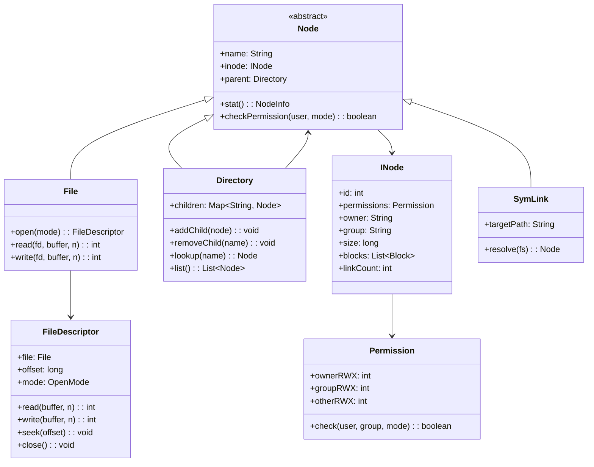

# Design a File System (OOD)

**Difficulty**: 🔴 Advanced
**Codemania**: #129
**Interview Frequency**: Medium

---

## Problem Statement

Model a UNIX-like file system where files and directories share a common interface, access is permission-controlled, and the directory tree can be traversed uniformly. The OOD challenge is the dual nature of the tree: `Directory` contains `Node`s, and each `Node` can itself be a `Directory` — Composite pattern fits perfectly. Security enforcement must not pollute the file's core read/write logic — that's a Proxy.

---

## Functional Requirements

- Create, read, write, delete files and directories
- Navigate directory tree via absolute or relative paths
- Enforce POSIX-style permissions (owner/group/other × read/write/execute)
- Open files and return a file descriptor for subsequent reads/writes
- Traverse directories recursively (BFS or DFS)
- Support hard links (two names → same inode) and symbolic links

---

## Core Entities

| Class | Responsibility |
|-------|---------------|
| `FileSystem` | Root entry point; mounts volumes; path resolution |
| `INode` | On-disk representation: permissions, size, block pointers |
| `Node` (abstract) | Common interface: name, permissions, parent, stat() |
| `File` | Leaf node; delegates reads/writes to block storage |
| `Directory` | Container node; holds children by name; resolves relative paths |
| `FileDescriptor` | Per-process handle: file ref + offset + open mode |
| `Permission` | Bitmask: owner/group/other × rwx; validates access |
| `Block` | Fixed-size (4 KB) data unit stored on disk |
| `SuperBlock` | Volume metadata: block size, total blocks, free list |
| `SymLink` | Stores target path; resolved on each open |

---

## Class Diagram



---

## Design Patterns Used

### 1. Composite — Uniform Node Interface

**Why it fits**: Both `File` and `Directory` need the same `stat()`, `checkPermission()`, and `rename()` operations. Treating them as the same `Node` type means path traversal, permission checking, and link counting work identically without `instanceof` checks.

```
abstract class Node:
  name: String
  inode: INode

  stat(): NodeInfo
    return NodeInfo(name, inode.size, inode.permissions, inode.modifiedAt)

  checkPermission(user: String, mode: AccessMode): boolean
    return inode.permissions.check(user, inode.owner, inode.group, mode)

class Directory extends Node:
  children: Map<String, Node>

  lookup(name: String): Node
    return children.get(name)  // returns File, Directory, or SymLink

class File extends Node:
  // no children — leaf node
```

### 2. Proxy — Permission-Enforced File Access

**Why it fits**: Inserting permission checks into `File.read()` and `File.write()` violates Single Responsibility — the file should focus on I/O. A `SecureFileProxy` wraps the real `File`, checks permissions before delegating, and can also add logging or caching without touching the file logic.

```
class SecureFileProxy:
  realFile: File
  currentUser: User

  open(mode: OpenMode): FileDescriptor
    if not realFile.checkPermission(currentUser, mode):
      throw PermissionDeniedException(currentUser, realFile.name, mode)
    return realFile.open(mode)

  read(fd, buffer, n):
    // permission already checked at open; just delegate
    return realFile.read(fd, buffer, n)
```

### 3. Iterator — Directory Traversal

**Why it fits**: Callers need to walk the tree without knowing the internal structure of `Directory`. Iterator hides whether traversal is BFS or DFS and makes it easy to swap strategies (e.g., alphabetical order, depth limit).

```
class BFSDirectoryIterator implements Iterator<Node>:
  queue: Queue<Node>

  constructor(root: Directory):
    queue.enqueue(root)

  hasNext(): boolean
    return not queue.isEmpty()

  next(): Node
    node = queue.dequeue()
    if node instanceof Directory:
      for child in node.list():
        queue.enqueue(child)
    return node
```

### 4. Template Method — File Open/Read/Write/Close Protocol

**Why it fits**: Every file type (regular, pipe, socket, device) follows the same open → read/write → flush → close lifecycle. The base class owns the protocol; subtypes override only the parts that differ (e.g., a pipe has no seek).

```
abstract class AbstractFile extends Node:
  open(mode): FileDescriptor
    fd = allocateDescriptor(mode)
    onOpen(fd)         // hook
    return fd

  close(fd): void
    onFlush(fd)        // hook — flush buffers
    releaseDescriptor(fd)

  abstract onOpen(fd): void
  abstract onFlush(fd): void
```

---

## Key Method: `open(path, mode)`

Path resolution is the most complex method in a file system — it handles absolute paths, relative paths, `.` and `..` components, and symlink resolution.

```
FileSystem:
  open(path: String, mode: OpenMode, currentDir: Directory): FileDescriptor
    // 1. Tokenize path
    parts = path.split("/")
    node = path.startsWith("/") ? root : currentDir

    // 2. Walk each component
    for part in parts:
      if part == "" or part == ".":
        continue
      if part == "..":
        node = node.parent ?? node   // root has no parent
        continue

      if node is not Directory:
        throw NotADirectoryException(node.name)

      child = node.lookup(part)
      if child == null:
        if mode has CREATE flag:
          child = new File(part, defaultPermissions)
          node.addChild(child)
        else:
          throw FileNotFoundException(path)

      // 3. Resolve symlinks (guard against cycles with hop count)
      if child instanceof SymLink:
        child = resolveSymLink(child, hopCount=0)

      node = child

    // 4. Check permission on the final node
    proxy = new SecureFileProxy(node as File, currentUser)
    return proxy.open(mode)
```

---

## Design Decisions & Trade-offs

| Decision | Option A | Option B | Choice |
|----------|----------|----------|--------|
| Permission model | POSIX rwx bitmask | ACL (per-user entries) | POSIX for OOD scope; ACL in enterprise FS (NTFS, ext4 with ACL) |
| Hard links | Share INode (linkCount++) | Copy INode on link | Share INode — UNIX semantics: delete removes link, not inode |
| Symlink resolution | Resolve at open() | Resolve at every syscall | Resolve at open() — performance; store resolved fd |
| Directory children | HashMap (O(1) lookup) | Sorted array (O(log n)) | HashMap — lookup-heavy workloads dominate |
| Block size | Fixed 4 KB | Variable | Fixed — simplifies allocation and disk layout |

---

## Top Interview Questions

| Question | What It Tests |
|----------|--------------|
| How do you detect a symlink cycle (A → B → A) during path resolution? | Cycle detection, hop count guard |
| How would you implement `cp -r` (recursive copy) using the tree structure? | Composite traversal, deep copy |
| How does deleting a hard-linked file work — when is the data actually freed? | INode reference counting, linkCount |

---

## Related Concepts

- [Resource Management OOD for pool/lease abstraction](./resource-management)
- [Warehouse Management OOD for similar hierarchical location model](./warehouse-management)

---

## 📚 Resources & References

| Resource | Type | What You'll Learn |
|----------|------|------------------|
| [NeetCode OOD Playlist](https://www.youtube.com/@NeetCode) | 📺 YouTube | Composite and Proxy pattern walkthroughs |
| [ByteByteGo System Design](https://www.youtube.com/@ByteByteGo) | 📺 YouTube | File system internals overview |
| [The Linux Programming Interface](https://man7.org/tlpi/) | 📖 Blog | POSIX file system semantics and inode model |
| [Head First Design Patterns](https://www.oreilly.com/library/view/head-first-design/0596007124/) | 📚 Book | Composite and Proxy pattern chapters |
| [GoF Design Patterns](https://www.amazon.com/Design-Patterns-Elements-Reusable-Object-Oriented/dp/0201633612) | 📚 Book | Iterator and Template Method reference |
