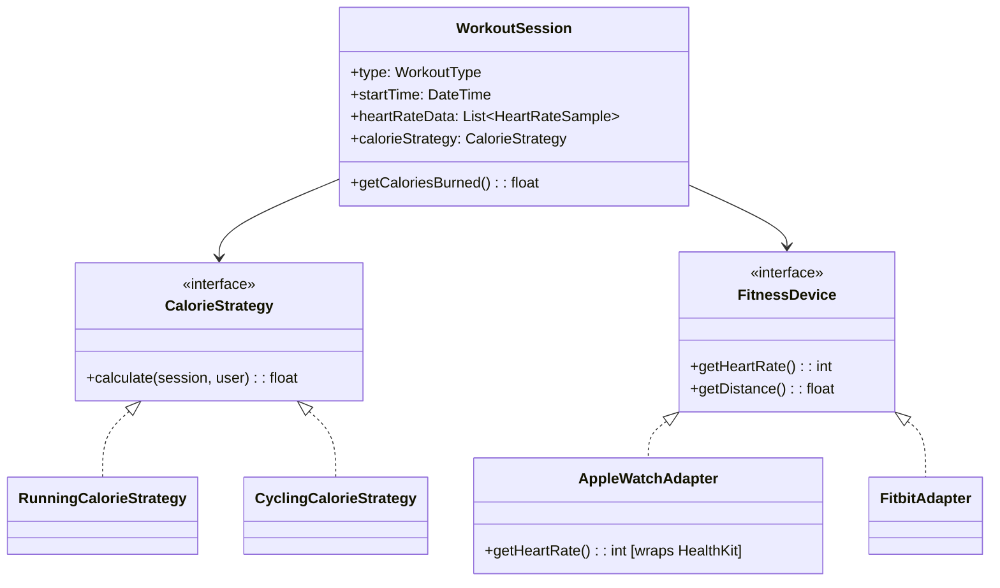
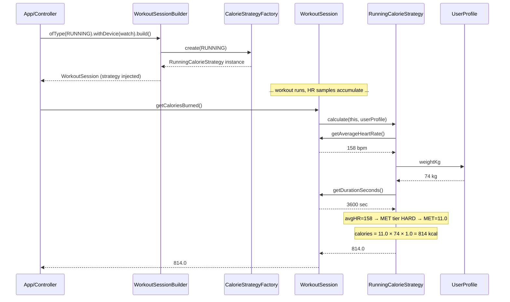
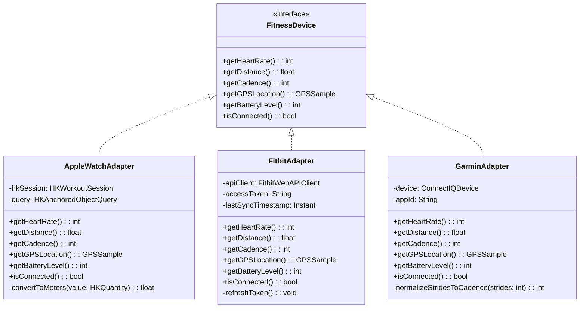

# Design a Fitness Tracking App (OOD)

**Difficulty**: 🟡 Intermediate
**Reading Time**: ~20 minutes
**Interview Frequency**: Medium

---

## The Core Problem

Tracking workouts, heart rate, and calories with different exercise types (running, cycling, swimming, weight training) and device integrations (Apple Watch, Garmin, Fitbit) — each combination requires different calorie calculation algorithms and different sensor data formats. Strategy pattern for algorithms and Adapter pattern for devices keeps the core clean.

## Functional Requirements

- Track workout sessions with type, duration, distance, heart rate
- Calculate calories burned for each workout type
- Integrate with multiple wearable devices (Apple Watch, Fitbit, Garmin)
- Health alerts when heart rate exceeds/drops below thresholds
- Weekly and monthly fitness summaries

## Non-Functional Requirements

| Requirement | Target |
|-------------|--------|
| Extensibility | New workout type: 1 new class, 0 existing changes |
| Device integration | New device: 1 adapter class, no core changes |
| Alert latency | Heart rate alert within 5 seconds of threshold breach |

## Back-of-Envelope Estimates

- **Classes needed**: ~12-15 classes with full device integration
- **Data volume**: 1 workout × 60 min × 1 heart rate sample/sec = 3,600 data points
- **Patterns**: Strategy (calorie calculation), Adapter (device APIs), Observer (health alerts), Builder (workout session)

## Key Design Decisions

1. **Strategy Pattern for Calorie Calculation** — `CalorieCalculationStrategy` interface with `calculateCalories(workoutSession, userProfile): float`; concrete strategies: `RunningCalorieStrategy`, `CyclingCalorieStrategy`, `WeightTrainingCalorieStrategy`; different MET (metabolic equivalent) values per exercise; swap strategy by workout type.
2. **Adapter Pattern for Devices** — `FitnessDeviceAdapter` interface: `getHeartRate()`, `getDistance()`, `getCadence()`; `AppleWatchAdapter`, `FitbitAdapter`, `GarminAdapter` wrap vendor-specific SDKs; core app never touches vendor APIs directly.
3. **Observer Pattern for Health Alerts** — `HeartRateMonitor` is observable; `HealthAlertObserver` (user notification), `CoachAlertObserver` (sync'd coach app), `EmergencyObserver` (fall detection) subscribe; when threshold crossed, all observers notified simultaneously.

## High-Level Architecture



## Top Interview Questions for This Problem

| Question | Tests |
|----------|-------|
| How would you add a new workout type (e.g., Rock Climbing) without changing existing code? | Strategy pattern, Open/Closed |
| How would you integrate a new fitness device API that returns data in XML instead of JSON? | Adapter pattern |
| How do you handle a workout session where the user switches from running to cycling? | Composite workout, multi-strategy |

## Related Concepts

- [Task management app OOD for similar Observer pattern usage](./task-management)
- [Elevator system OOD for similar state transitions](./elevator-system)

---

## Class Design

The full class hierarchy reveals how the four primary patterns interconnect. The `WorkoutSession` is the central aggregate — it holds a reference to a `CalorieStrategy` (chosen at session start based on workout type), a `FitnessDevice` (the adapted wearable), and a list of `HeartRateSample` objects. The `UserProfile` carries weight, age, and VO2-max used by every calorie strategy.

```mermaid
classDiagram
    class UserProfile {
        +userId: UUID
        +weightKg: float
        +ageYears: int
        +vo2Max: float
        +heartRateZones: HeartRateZones
        +getMaxHeartRate(): int
    }

    class HeartRateZones {
        +zone1Max: int
        +zone2Max: int
        +zone3Max: int
        +zone4Max: int
        +zone5Max: int
        +getZoneFor(bpm: int): Zone
    }

    class WorkoutSession {
        +sessionId: UUID
        +userId: UUID
        +workoutType: WorkoutType
        +startTime: DateTime
        +endTime: DateTime
        +heartRateSamples: List~HeartRateSample~
        +gpsSamples: List~GPSSample~
        +device: FitnessDevice
        +calorieStrategy: CalorieStrategy
        +start(): void
        +stop(): void
        +addHeartRateSample(sample: HeartRateSample): void
        +getCaloriesBurned(): float
        +getAverageHeartRate(): int
        +getDistanceMeters(): float
        +getDurationSeconds(): int
    }

    class HeartRateSample {
        +timestamp: DateTime
        +bpm: int
    }

    class GPSSample {
        +timestamp: DateTime
        +lat: float
        +lon: float
        +altitudeM: float
    }

    class WorkoutType {
        <<enumeration>>
        RUNNING
        CYCLING
        SWIMMING
        WEIGHT_TRAINING
        YOGA
        ROCK_CLIMBING
        HIIT
    }

    class CalorieStrategy {
        <<interface>>
        +calculate(session: WorkoutSession, user: UserProfile): float
    }

    class RunningCalorieStrategy {
        -MET_EASY: float = 6.0
        -MET_MODERATE: float = 8.0
        -MET_HARD: float = 11.0
        +calculate(session, user): float
    }

    class CyclingCalorieStrategy {
        -MET_LEISURE: float = 4.0
        -MET_MODERATE: float = 8.0
        -MET_RACING: float = 12.0
        +calculate(session, user): float
    }

    class WeightTrainingCalorieStrategy {
        -MET_LIGHT: float = 3.5
        -MET_VIGOROUS: float = 6.0
        +calculate(session, user): float
    }

    class SwimmingCalorieStrategy {
        -MET_FREESTYLE: float = 9.8
        -MET_BREASTSTROKE: float = 5.8
        +calculate(session, user): float
    }

    class CalorieStrategyFactory {
        +create(workoutType: WorkoutType): CalorieStrategy
    }

    class FitnessDevice {
        <<interface>>
        +getHeartRate(): int
        +getDistance(): float
        +getCadence(): int
        +getGPSLocation(): GPSSample
        +getBatteryLevel(): int
        +isConnected(): bool
    }

    class AppleWatchAdapter {
        -healthKitSession: HKWorkoutSession
        -healthStore: HKHealthStore
        +getHeartRate(): int
        +getDistance(): float
        +getCadence(): int
        +getGPSLocation(): GPSSample
    }

    class FitbitAdapter {
        -fitbitClient: FitbitWebAPI
        -deviceId: String
        +getHeartRate(): int
        +getDistance(): float
        +getCadence(): int
        +getGPSLocation(): GPSSample
    }

    class GarminAdapter {
        -connectIQDevice: ConnectIQDevice
        +getHeartRate(): int
        +getDistance(): float
        +getCadence(): int
        +getGPSLocation(): GPSSample
    }

    class HeartRateMonitor {
        -observers: List~HeartRateObserver~
        -currentBpm: int
        -upperThreshold: int
        -lowerThreshold: int
        +subscribe(observer: HeartRateObserver): void
        +unsubscribe(observer: HeartRateObserver): void
        +onNewSample(sample: HeartRateSample): void
        -notifyObservers(event: HeartRateEvent): void
    }

    class HeartRateObserver {
        <<interface>>
        +onHeartRateEvent(event: HeartRateEvent): void
    }

    class HeartRateEvent {
        +eventType: EventType
        +bpm: int
        +threshold: int
        +timestamp: DateTime
        +userId: UUID
    }

    class HealthAlertObserver {
        -notificationService: NotificationService
        +onHeartRateEvent(event: HeartRateEvent): void
    }

    class CoachAlertObserver {
        -coachWebSocket: WebSocketConnection
        +onHeartRateEvent(event: HeartRateEvent): void
    }

    class EmergencyObserver {
        -emergencyService: EmergencyService
        +onHeartRateEvent(event: HeartRateEvent): void
    }

    class WorkoutSummaryService {
        +generateWeeklySummary(userId: UUID, weekStart: Date): WeeklySummary
        +generateMonthlySummary(userId: UUID, month: YearMonth): MonthlySummary
        +getPersonalBests(userId: UUID): List~PersonalBest~
    }

    class WorkoutSessionBuilder {
        -userId: UUID
        -workoutType: WorkoutType
        -device: FitnessDevice
        -upperHRThreshold: int
        -lowerHRThreshold: int
        +forUser(userId: UUID): WorkoutSessionBuilder
        +ofType(type: WorkoutType): WorkoutSessionBuilder
        +withDevice(device: FitnessDevice): WorkoutSessionBuilder
        +withHeartRateThresholds(lower, upper): WorkoutSessionBuilder
        +build(): WorkoutSession
    }

    WorkoutSession --> CalorieStrategy
    WorkoutSession --> FitnessDevice
    WorkoutSession "1" *-- "many" HeartRateSample
    WorkoutSession "1" *-- "many" GPSSample
    WorkoutSession --> UserProfile

    CalorieStrategy <|.. RunningCalorieStrategy
    CalorieStrategy <|.. CyclingCalorieStrategy
    CalorieStrategy <|.. WeightTrainingCalorieStrategy
    CalorieStrategy <|.. SwimmingCalorieStrategy

    CalorieStrategyFactory ..> CalorieStrategy

    FitnessDevice <|.. AppleWatchAdapter
    FitnessDevice <|.. FitbitAdapter
    FitnessDevice <|.. GarminAdapter

    HeartRateMonitor --> "many" HeartRateObserver
    HeartRateObserver <|.. HealthAlertObserver
    HeartRateObserver <|.. CoachAlertObserver
    HeartRateObserver <|.. EmergencyObserver

    UserProfile --> HeartRateZones
    WorkoutSessionBuilder ..> WorkoutSession
```



---

## Component Deep Dive 1: Strategy Pattern for Calorie Calculation

Calorie calculation is the most business-critical component because it directly affects user trust. If a user burns 450 calories on a hard run but the app reports 180 because it used a generic formula, they stop trusting the entire app. The calculation must be correct per workout type AND per intensity level within that type.

### Why a Naive Approach Fails

The naive approach is a single `if/else` block or a `switch` statement inside `WorkoutSession.getCaloriesBurned()`. This fails for three reasons:

1. **Violates Open/Closed Principle**: Adding Rock Climbing requires modifying `WorkoutSession` — a class that touches every workout.
2. **Cannot vary independently**: You cannot swap to a third-party calorie calculator (e.g., a ML-based model) without rewriting the session class.
3. **Testing is a nightmare**: A 500-line switch statement cannot be unit tested per workout type.

### How the Strategy Pattern Solves This

Each concrete strategy receives the full `WorkoutSession` (average HR, duration, distance, HR samples) and a `UserProfile` (weight, age, VO2-max). The MET (Metabolic Equivalent of Task) formula is: `calories = MET × weight_kg × duration_hours`. MET values vary not just by workout type but by intensity. A runner at 160 bpm burns ~11 METs; at 130 bpm it's ~8 METs. The strategy uses the average heart rate stored in the session to select the right MET tier.



### Implementation Options

| Approach | Accuracy | Extensibility | Complexity | Trade-off |
|----------|----------|---------------|------------|-----------|
| Static MET table (current) | ~85% vs lab | Add 1 class per sport | Low | Good default; fails for unusual body types |
| Heart-rate reserve (Karvonen) | ~91% vs lab | Requires VO2-max in profile | Medium | More accurate but needs richer user data |
| ML-based (personalized model) | ~96% vs lab | Model retrain pipeline needed | High | Best accuracy; requires 30+ workouts of training data per user |

For an interview, start with the static MET table and explain how the Strategy pattern makes it trivially upgradeable to the Karvonen or ML approach without touching any existing code.

---

## Component Deep Dive 2: Adapter Pattern for Wearable Devices

Every wearable vendor ships a proprietary SDK: Apple uses HealthKit with Swift/Objective-C bindings and CoreBluetooth under the hood; Fitbit uses a REST WebAPI with OAuth 2.0; Garmin uses the Connect IQ SDK with a proprietary Monkey C language interface. Their data formats, polling intervals, and unit systems all differ — Garmin returns cadence in steps-per-minute, Fitbit in strides-per-minute, Apple Watch does not expose cadence directly.

### The Adapter Contract

The `FitnessDevice` interface is deliberately minimal — only 6 methods that cover what every wearable can provide. The adapters hide all vendor complexity behind this contract:



### Scale Behavior at 10x Load

In a local OOD context, each adapter is called once per second per active workout. At 10x load (i.e., 10 simultaneous workouts on a shared server) the Fitbit adapter becomes a bottleneck because it makes a REST API call on every `getHeartRate()` call — that is 10 HTTP round-trips per second, quickly hitting Fitbit's rate limit of 150 calls per hour per user. The fix is to add a **pull-cache layer inside the adapter**: poll Fitbit every 5 seconds and cache the most recent data; callers get cached data instantly. Apple Watch and Garmin use Bluetooth LE callbacks (push model) so they don't share this problem.

| Device | Data Model | Cadence Unit | Polling Cost |
|--------|-----------|--------------|--------------|
| Apple Watch | HealthKit push callbacks | Not exposed (derive from GPS) | Near-zero (push) |
| Fitbit | REST WebAPI pull | strides/min | High (REST rate limit) |
| Garmin Connect IQ | BLE push + REST sync | steps/min | Low (BLE push) |

---

## Component Deep Dive 3: Observer Pattern for Health Alerts

Heart rate alerts are the safety-critical path. A 50ms delay is acceptable; a 10-second delay could mean a user collapses without an emergency alert being sent. The Observer (Publish-Subscribe) pattern decouples the `HeartRateMonitor` from any specific alert consumer, enabling multiple independent alert channels to fire simultaneously.

### Internal Mechanics

`HeartRateMonitor.onNewSample()` is called every time a new BPM reading arrives from the device adapter. It checks the current BPM against the user's configured upper/lower thresholds (stored in `UserProfile.heartRateZones`). If a threshold is crossed, it constructs a `HeartRateEvent` and iterates through all registered observers, calling `onHeartRateEvent()` on each synchronously. Synchronous notification is intentional for the local OOD — latency is determined by the slowest observer, so observers must be fast (queue their work and return immediately).

### Observer Registration Design

Observers are registered at `WorkoutSession` start and deregistered at stop. This prevents stale observers from firing after a session ends. The `WorkoutSessionBuilder` handles registration:

```
builder.build() →
  session = new WorkoutSession(...)
  monitor = new HeartRateMonitor(session)
  monitor.subscribe(new HealthAlertObserver(notificationService))
  monitor.subscribe(new EmergencyObserver(emergencyService))
  if (session.hasCoach()) monitor.subscribe(new CoachAlertObserver(coachWS))
  return session
```

### Specific Technical Decisions

- **Synchronous vs. Asynchronous**: Synchronous for local OOD correctness; in a production distributed system, replace with an event queue (Kafka topic `heart-rate-alerts`) so observers scale independently.
- **Thread safety**: If device reads come in on a BLE callback thread, `onNewSample()` must be synchronized. Use a `ReentrantLock` around the observer list iteration to prevent `ConcurrentModificationException`.
- **Threshold hysteresis**: Avoid alert spam by requiring the BPM to drop 5 beats below the upper threshold before re-alerting. Store `lastAlertBpm` in `HeartRateMonitor` to implement this.

---

## Design Patterns Applied

### Strategy Pattern (Calorie Calculation)

The `CalorieStrategy` interface defines the algorithm contract. `RunningCalorieStrategy`, `CyclingCalorieStrategy`, `SwimmingCalorieStrategy`, and `WeightTrainingCalorieStrategy` each implement the formula for their domain. The strategy is injected into `WorkoutSession` at construction time by `CalorieStrategyFactory.create(WorkoutType)`. This is Strategy because the algorithm varies independently of the `WorkoutSession` that uses it. Adding Rock Climbing requires: (1) add `ROCK_CLIMBING` to `WorkoutType` enum, (2) create `RockClimbingCalorieStrategy`, (3) add one case to `CalorieStrategyFactory`. Zero changes to `WorkoutSession`.

### Adapter Pattern (Device Integration)

`AppleWatchAdapter`, `FitbitAdapter`, and `GarminAdapter` translate incompatible vendor APIs into the uniform `FitnessDevice` interface. This is Adapter (not Facade) because the adapters do not simplify — they translate. The core domain model (`WorkoutSession`) never imports a vendor SDK. If Garmin changes their SDK in v5, only `GarminAdapter` changes.

### Observer Pattern (Health Alerts)

`HeartRateMonitor` is the Subject. `HealthAlertObserver`, `CoachAlertObserver`, and `EmergencyObserver` are Concrete Observers. The decoupling is the key benefit: adding a new alert channel (e.g., a connected smart speaker that reads aloud "Your heart rate is very high") requires creating one new class implementing `HeartRateObserver` and registering it — no changes to `HeartRateMonitor`.

### Builder Pattern (Session Construction)

`WorkoutSessionBuilder` handles the combinatorial complexity of session construction: a session always needs `userId`, `workoutType`, and `device`, and optionally needs `upperHRThreshold`, `lowerHRThreshold`, `coachId`, and `customCalorieStrategy`. Without Builder, callers face a 6-argument constructor where argument order errors cause silent bugs. Builder makes each parameter explicit and optional.

### Factory Method (Strategy Creation)

`CalorieStrategyFactory.create(WorkoutType)` centralizes the decision of which strategy to instantiate. This is a simple static factory, not the Gang of Four Factory Method, but it serves the same purpose: the caller does not need to know the concrete class.

---

## SOLID Principles

### Single Responsibility Principle

- `WorkoutSession` tracks data and delegates calculation (does not calculate itself)
- `CalorieStrategy` calculates only (does not store data)
- `HeartRateMonitor` monitors and notifies only (does not respond to alerts)
- `FitbitAdapter` translates only (has zero business logic)

Every class has one axis of change. If the MET formula changes, only `RunningCalorieStrategy` changes. If Fitbit's REST API changes, only `FitbitAdapter` changes.

### Open/Closed Principle

The system is open for extension and closed for modification in three places:
1. New workout type: add `CalorieStrategy` implementation + enum value — no existing code changes
2. New wearable device: add `FitnessDevice` implementation — no existing code changes
3. New health alert channel: add `HeartRateObserver` implementation — no existing code changes

### Liskov Substitution Principle

`WorkoutSession` holds a reference to `FitnessDevice`. Any concrete adapter (`AppleWatchAdapter`, `FitbitAdapter`, `GarminAdapter`) can replace another without changing `WorkoutSession` behavior. All adapters honor the contract: `getHeartRate()` always returns current BPM as an `int`, never throws on a temporarily unavailable reading (returns last known value instead).

### Interface Segregation Principle

`FitnessDevice` exposes only what `WorkoutSession` needs. It does not expose device-specific features like Apple Watch's ECG, Garmin's TrainingEffect score, or Fitbit's SpO2 sensor. If the app needed ECG, a separate `ECGCapableDevice` interface would extend `FitnessDevice` — existing workout logic remains untouched.

### Dependency Inversion Principle

`WorkoutSession` depends on `CalorieStrategy` (interface) and `FitnessDevice` (interface) — not on `RunningCalorieStrategy` or `AppleWatchAdapter` (concretions). `HeartRateMonitor` depends on `HeartRateObserver` (interface) — not on `HealthAlertObserver`. All dependencies point toward abstractions.

---

## Concurrency and Thread Safety

Three concurrent operations are possible in a real implementation:

### 1. BLE Callback Thread vs. UI Thread

Wearable data (heart rate, GPS) arrives on a Bluetooth LE callback thread at ~1 sample/sec. The UI reads `WorkoutSession.getAverageHeartRate()` to display live stats. The heart rate samples list (`heartRateSamples: List<HeartRateSample>`) is written by the BLE thread and read by the UI thread. Solution: use `CopyOnWriteArrayList<HeartRateSample>` for lock-free reads at the cost of slightly expensive writes — acceptable because reads (UI refresh at 60fps) vastly outnumber writes (1/sec).

### 2. HeartRateMonitor Observer Notification

`HeartRateMonitor.onNewSample()` iterates the observers list. If an observer registers or unregisters during notification (e.g., coach disconnects mid-workout), `ConcurrentModificationException` is thrown. Solution: the observers list is also a `CopyOnWriteArrayList`, or iteration is done on a snapshot (`List<HeartRateObserver> snapshot = new ArrayList<>(observers)`) before the loop.

### 3. Session Start/Stop Races

A user tapping "Stop" while a BLE callback is writing a new sample creates a race on `endTime`. Solution: mark `WorkoutSession.active` as a `volatile boolean`. The BLE callback checks `active` before writing. `stop()` sets `active = false` atomically before recording `endTime`.

```java
// Thread-safe sample addition
public synchronized void addHeartRateSample(HeartRateSample sample) {
    if (!active) return;  // ignore samples after stop
    heartRateSamples.add(sample);
    heartRateMonitor.onNewSample(sample);
}
```

---

## Extension Points

### Adding Rock Climbing

Rock Climbing is a new workout type. The system is open-closed for exactly this:

1. Add `ROCK_CLIMBING` to `WorkoutType` enum
2. Create `RockClimbingCalorieStrategy implements CalorieStrategy` — MET values: 5.8 (indoor top-rope) to 8.0 (outdoor lead)
3. Add `case ROCK_CLIMBING: return new RockClimbingCalorieStrategy()` to `CalorieStrategyFactory`
4. Zero changes to `WorkoutSession`, `HeartRateMonitor`, any adapter, or any observer

### Adding a Polar Heart Rate Monitor

Polar uses their own BLE profile (Polar Measurement Data service) distinct from the standard BLE HRM profile. To integrate:

1. Create `PolarAdapter implements FitnessDevice`
2. Inside, use the Polar BLE SDK to connect and read HRM/distance data
3. Translate to the `FitnessDevice` interface
4. Zero changes to `WorkoutSession` or any calorie strategy

### Adding a Running Coach Feature (Real-time Pace Guidance)

This extends the Observer pattern:

1. Create `PaceCoachObserver implements HeartRateObserver`
2. On `onHeartRateEvent(event)`: if in Zone 2 and pace is too fast, send a "slow down" audio cue; if in Zone 1, send "pick up the pace"
3. Register in `WorkoutSessionBuilder` when coach mode is enabled
4. Zero changes to `HeartRateMonitor` or existing observers

---

## Data Model

```sql
-- User and profile
CREATE TABLE users (
    user_id       UUID PRIMARY KEY DEFAULT gen_random_uuid(),
    email         VARCHAR(255) UNIQUE NOT NULL,
    display_name  VARCHAR(100) NOT NULL,
    weight_kg     NUMERIC(5,2) NOT NULL,
    age_years     SMALLINT NOT NULL,
    vo2_max       NUMERIC(4,1),
    created_at    TIMESTAMPTZ DEFAULT NOW()
);

-- Heart rate zone configuration per user
CREATE TABLE heart_rate_zones (
    user_id       UUID PRIMARY KEY REFERENCES users(user_id),
    zone1_max     SMALLINT NOT NULL,   -- warm-up upper bound (bpm)
    zone2_max     SMALLINT NOT NULL,   -- fat-burn upper bound
    zone3_max     SMALLINT NOT NULL,   -- aerobic upper bound
    zone4_max     SMALLINT NOT NULL,   -- anaerobic upper bound
    zone5_max     SMALLINT NOT NULL,   -- VO2 max upper bound
    upper_alert_threshold SMALLINT DEFAULT 190,
    lower_alert_threshold SMALLINT DEFAULT 40
);

-- Workout sessions
CREATE TABLE workout_sessions (
    session_id      UUID PRIMARY KEY DEFAULT gen_random_uuid(),
    user_id         UUID NOT NULL REFERENCES users(user_id),
    workout_type    VARCHAR(50) NOT NULL,  -- RUNNING, CYCLING, etc.
    device_type     VARCHAR(50) NOT NULL,  -- APPLE_WATCH, FITBIT, GARMIN
    device_id       VARCHAR(100) NOT NULL,
    start_time      TIMESTAMPTZ NOT NULL,
    end_time        TIMESTAMPTZ,
    status          VARCHAR(20) DEFAULT 'IN_PROGRESS',  -- IN_PROGRESS, COMPLETED, PAUSED
    calories_burned NUMERIC(7,2),          -- computed on session stop
    distance_meters NUMERIC(10,2),
    avg_heart_rate  SMALLINT,
    max_heart_rate  SMALLINT,
    min_heart_rate  SMALLINT,
    created_at      TIMESTAMPTZ DEFAULT NOW()
);
CREATE INDEX idx_sessions_user_time ON workout_sessions (user_id, start_time DESC);

-- Heart rate time-series (high write volume — consider TimescaleDB/InfluxDB)
CREATE TABLE heart_rate_samples (
    sample_id   BIGSERIAL PRIMARY KEY,
    session_id  UUID NOT NULL REFERENCES workout_sessions(session_id),
    recorded_at TIMESTAMPTZ NOT NULL,
    bpm         SMALLINT NOT NULL
);
CREATE INDEX idx_hr_session_time ON heart_rate_samples (session_id, recorded_at);
-- Partition by session for fast per-session queries

-- GPS track points
CREATE TABLE gps_samples (
    sample_id    BIGSERIAL PRIMARY KEY,
    session_id   UUID NOT NULL REFERENCES workout_sessions(session_id),
    recorded_at  TIMESTAMPTZ NOT NULL,
    latitude     NUMERIC(10,7) NOT NULL,
    longitude    NUMERIC(10,7) NOT NULL,
    altitude_m   NUMERIC(7,2),
    speed_ms     NUMERIC(6,3)
);
CREATE INDEX idx_gps_session_time ON gps_samples (session_id, recorded_at);

-- Health alerts fired during sessions
CREATE TABLE health_alerts (
    alert_id     UUID PRIMARY KEY DEFAULT gen_random_uuid(),
    session_id   UUID NOT NULL REFERENCES workout_sessions(session_id),
    user_id      UUID NOT NULL REFERENCES users(user_id),
    alert_type   VARCHAR(50) NOT NULL,  -- HIGH_HR, LOW_HR, FALL_DETECTED
    bpm_at_alert SMALLINT,
    threshold    SMALLINT,
    fired_at     TIMESTAMPTZ NOT NULL,
    acknowledged_at TIMESTAMPTZ
);

-- Weekly/monthly summary cache (pre-computed)
CREATE TABLE fitness_summaries (
    summary_id    UUID PRIMARY KEY DEFAULT gen_random_uuid(),
    user_id       UUID NOT NULL REFERENCES users(user_id),
    period_type   VARCHAR(10) NOT NULL,   -- WEEKLY, MONTHLY
    period_start  DATE NOT NULL,
    total_workouts     INT DEFAULT 0,
    total_duration_sec INT DEFAULT 0,
    total_calories     NUMERIC(9,2) DEFAULT 0,
    total_distance_m   NUMERIC(12,2) DEFAULT 0,
    avg_heart_rate     SMALLINT,
    computed_at        TIMESTAMPTZ NOT NULL,
    UNIQUE (user_id, period_type, period_start)
);
```

**Storage tiering note**: `heart_rate_samples` grows at 86,400 rows/user/day for continuous HR monitoring. After 90 days, downsample to 1 sample per minute (keep raw data in cold storage). Use a time-series database like TimescaleDB or InfluxDB for this table in production — TimescaleDB achieves 10x compression on time-ordered SMALLINT columns compared to standard PostgreSQL.

---

## Scale Bottlenecks

| Traffic Level | Component That Breaks | Symptoms | Mitigation |
|---------------|----------------------|----------|------------|
| 10x baseline (100k concurrent workouts) | `heart_rate_samples` write throughput | INSERT latency spikes from 2ms to 800ms; PostgreSQL WAL write amplification | Batch inserts (buffer 5s of samples, write once); switch to TimescaleDB with hypertables |
| 100x baseline (1M concurrent workouts) | Single `HeartRateMonitor` notification loop | Observer callbacks block BLE thread; alert latency exceeds 5s SLA | Move to async queue (Redis pub/sub or Kafka); observers consume from queue independently |
| 100x baseline | GPS sample ingestion | 1M × 1 GPS point/sec = 1M writes/sec; single DB node saturates at ~50k writes/sec | Shard GPS writes by `session_id` across 20+ DB nodes; or stream to S3 and process async |
| 1000x baseline (10M concurrent workouts) | Calorie computation on session stop | 10M sessions stopping in a time window (end of lunch hour) spikes CPU | Pre-compute calories incrementally during session (running average); stop is O(1) not O(n) |
| 1000x baseline | `fitness_summaries` recomputation | Weekly summary job scans billions of rows every Sunday night; job takes 14+ hours | Pre-aggregate daily totals at session stop; weekly/monthly summary is 7-row or 30-row SUM |

---

## How Apple Built HealthKit

Apple's HealthKit is the closest real-world analogue to this OOD problem at planetary scale. Shipped in iOS 8 (2014) and now serving 700M+ iPhone users, HealthKit is the production version of what an interview candidate designs in 45 minutes.

**Architecture decisions:**

- **Federated data store, not centralized**: HealthKit stores health data in an encrypted on-device SQLite database, not a central Apple server. This was a non-obvious decision driven by privacy (medical data never leaves the device unless the user explicitly shares it). The `HKHealthStore` class is the Facade over this local SQLite.

- **Adapter pattern is explicit in the SDK**: Third-party apps (Fitbit app, Garmin Connect) each implement their own `HKWorkoutSessionDelegate` — this is Apple's version of the `FitnessDevice` interface. Strava, Nike Run Club, and 2,000+ other apps all write to HealthKit through the same interface.

- **Observer pattern via HKObserverQuery**: HealthKit provides `HKObserverQuery` — a registered callback that fires whenever new data matching a predicate (e.g., "heart rate samples") is written to the store. This is the production implementation of `HeartRateObserver` — any app can subscribe to heart rate changes without polling.

- **Calorie computation at query time**: HealthKit does not store "calories burned" as a derived field. It stores raw samples (heart rate, active energy, basal energy) and computes summaries at query time using `HKStatisticsQuery`. The actual calorie formula is Apple's proprietary variant of the Keytel equation (heart-rate based), which accounts for age, weight, sex, and VO2-max.

- **Scale numbers**: HealthKit handles 50,000+ data types, 2+ billion health data entries per day across the installed base, with query latency under 20ms for a full 30-day workout history. The on-device SQLite is compressed to under 50MB even with years of minute-by-minute heart rate data.

**Non-obvious insight**: Apple chose to make HealthKit data **immutable with provenance tracking** — every sample stores `sourceRevision` (which app wrote it, which device version). This prevents the "data corruption" bug where two apps writing the same metric with conflicting values cause incorrect summaries. In the OOD design, this maps to making `HeartRateSample` an immutable value object with `deviceId` and `appSource` fields.

Source: [Apple HealthKit developer documentation](https://developer.apple.com/documentation/healthkit) and WWDC sessions 2014–2023.

---

## Interview Angle

**What the interviewer is testing:** Whether the candidate can identify which design patterns solve which specific coupling problems — not just recite pattern names. The interviewer wants to see that you recognize "calorie calculation varies by workout type" → Strategy, "vendor APIs are incompatible" → Adapter, "multiple systems need to react to the same event" → Observer, before jumping to UML.

**Common mistakes candidates make:**

1. **Putting all logic in `WorkoutSession`**: Candidates add a 200-line `calculateCalories()` method with nested if/else for workout type. This violates SRP and OCP. The fix is to ask: "What varies?" Calorie logic varies by workout type → extract it.

2. **Skipping the Adapter and calling vendor SDKs directly**: Candidates write `if (device == "apple_watch") { HealthKit.getHeartRate() } else if (device == "fitbit") { FitbitAPI.getHeartRate() }`. This is the Adapter antipattern — the core is coupled to every vendor. The fix is to name the coupling: "the vendor API format varies independently from my core session logic" → Adapter.

3. **Making observers synchronous and heavy**: Candidates implement `EmergencyObserver.onHeartRateEvent()` to make a REST call to an emergency service synchronously inside the notification loop. A 500ms REST call on every BPM sample makes the BLE callback thread unresponsive. The fix: observers should be fast and non-blocking — enqueue a message, set a flag, or call a local service that dispatches asynchronously.

**The insight that separates good from great answers:** The Strategy pattern only works cleanly if `CalorieStrategy.calculate()` is a **pure function** — given the same `WorkoutSession` and `UserProfile`, it always returns the same result. Candidates who make strategies stateful (storing intermediate values inside the strategy object) break this guarantee and create bugs when the same strategy instance is reused across sessions. Great candidates note that strategies should be stateless and therefore thread-safe, allowing a single strategy instance to be shared across 1,000 concurrent workout sessions without synchronization.

---

## Key Numbers to Remember

| Metric | Value | Context |
|--------|-------|---------|
| Heart rate sample rate | 1 sample/sec | Standard wearable BPM polling; some devices do 1 sample/5 sec |
| Heart rate samples per 1h workout | 3,600 rows | 1/sec × 3,600 seconds |
| GPS samples per 1h workout | 3,600 rows | 1 point/sec is standard for running; cycling apps often reduce to 1/5 sec |
| MET value range | 1.0 (sleeping) to 23.0 (elite sprinting) | Running moderate = 8.0; cycling racing = 12.0; weight training = 5.0 |
| Calorie formula error margin (MET method) | ±15% vs calorimeter | Accepted industry standard; HR-reserve method gets to ±9% |
| HealthKit daily data entries (Apple) | 2B+ entries/day | Across 700M+ iOS devices writing health samples locally |
| HealthKit query latency (on-device) | <20ms for 30-day history | Local SQLite with proper indexes; no network round-trip |
| Fitbit API rate limit | 150 calls/hour per user | Requires adapter-level caching to avoid hitting this in real workouts |
| Alert latency SLA | <5 seconds | From threshold breach to user notification; BLE callback to push notification |
| TimescaleDB compression ratio | 10x vs standard PostgreSQL | On time-ordered SMALLINT columns (heart rate samples); critical at scale |

---

## 📚 Resources & References

| Resource | Type | What You'll Learn |
|----------|------|------------------|
| [ByteByteGo — Design a Fitness Tracker](https://www.youtube.com/@ByteByteGo) | 📺 YouTube | Search "fitness app design" — sensor data processing, goals, notifications |
| [Fitbit Engineering: Wearable Data Architecture](https://dev.fitbit.com/build/guides/activity/) | 📚 Docs | Fitbit API design for syncing and querying fitness data |
| [HealthKit Architecture: Apple Health Platform](https://developer.apple.com/documentation/healthkit) | 📚 Docs | How HealthKit aggregates and stores health data from multiple sources |
| [Observer Pattern for Activity Events](https://refactoring.guru/design-patterns/observer) | 📚 Docs | Using Observer pattern for fitness goal notifications and alerts |
| [Time-Series Database for Sensor Data](https://www.influxdata.com/time-series-database/) | 📚 Docs | Why time-series DBs outperform relational DBs for fitness sensor data |
