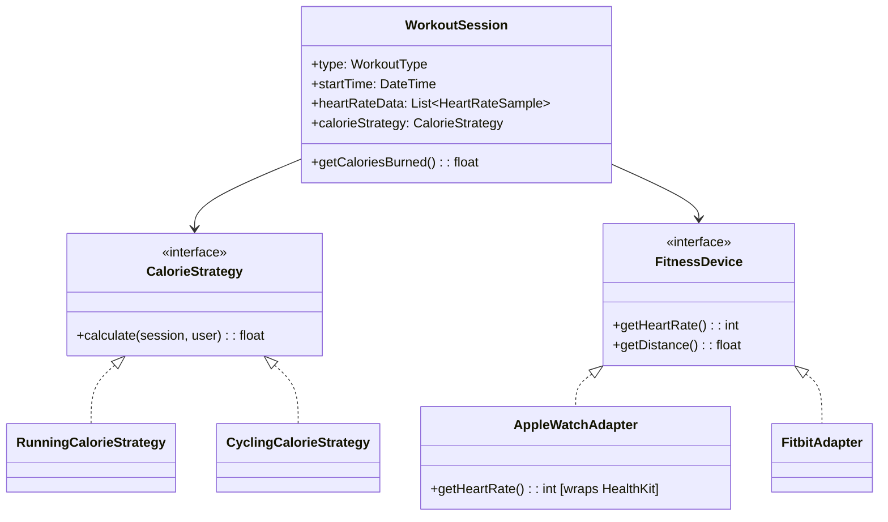

# Design a Fitness Tracking App (OOD)

**Difficulty**: 🟡 Intermediate
**Reading Time**: Coming Soon
**Interview Frequency**: Medium

---

> 🚧 **Full article coming soon.** This stub gives you the essentials to start thinking about this problem.

---

## The Core Problem

Tracking workouts, heart rate, and calories with different exercise types (running, cycling, swimming, weight training) and device integrations (Apple Watch, Garmin, Fitbit) — each combination requires different calorie calculation algorithms and different sensor data formats. Strategy pattern for algorithms and Adapter pattern for devices keeps the core clean.

## Functional Requirements

- Track workout sessions with type, duration, distance, heart rate
- Calculate calories burned for each workout type
- Integrate with multiple wearable devices (Apple Watch, Fitbit, Garmin)
- Health alerts when heart rate exceeds/drops below thresholds
- Weekly and monthly fitness summaries

## Non-Functional Requirements

| Requirement | Target |
|-------------|--------|
| Extensibility | New workout type: 1 new class, 0 existing changes |
| Device integration | New device: 1 adapter class, no core changes |
| Alert latency | Heart rate alert within 5 seconds of threshold breach |

## Back-of-Envelope Estimates

- **Classes needed**: ~12-15 classes with full device integration
- **Data volume**: 1 workout × 60 min × 1 heart rate sample/sec = 3,600 data points
- **Patterns**: Strategy (calorie calculation), Adapter (device APIs), Observer (health alerts), Builder (workout session)

## Key Design Decisions

1. **Strategy Pattern for Calorie Calculation** — `CalorieCalculationStrategy` interface with `calculateCalories(workoutSession, userProfile): float`; concrete strategies: `RunningCalorieStrategy`, `CyclingCalorieStrategy`, `WeightTrainingCalorieStrategy`; different MET (metabolic equivalent) values per exercise; swap strategy by workout type.
2. **Adapter Pattern for Devices** — `FitnessDeviceAdapter` interface: `getHeartRate()`, `getDistance()`, `getCadence()`; `AppleWatchAdapter`, `FitbitAdapter`, `GarminAdapter` wrap vendor-specific SDKs; core app never touches vendor APIs directly.
3. **Observer Pattern for Health Alerts** — `HeartRateMonitor` is observable; `HealthAlertObserver` (user notification), `CoachAlertObserver` (sync'd coach app), `EmergencyObserver` (fall detection) subscribe; when threshold crossed, all observers notified simultaneously.

## High-Level Architecture

## Top Interview Questions for This Problem

| Question | Tests |
|----------|-------|
| How would you add a new workout type (e.g., Rock Climbing) without changing existing code? | Strategy pattern, Open/Closed |
| How would you integrate a new fitness device API that returns data in XML instead of JSON? | Adapter pattern |
| How do you handle a workout session where the user switches from running to cycling? | Composite workout, multi-strategy |

## Related Concepts

- [Task management app OOD for similar Observer pattern usage](./task-management)
- [Elevator system OOD for similar state transitions](./elevator-system)

---

*📚 Full deep-dive with multiple approaches, trade-off tables, and pseudocode coming soon.*

## 📚 Resources & References

| Resource | Type | What You'll Learn |
|----------|------|------------------|
| [ByteByteGo — Design a Fitness Tracker](https://www.youtube.com/@ByteByteGo) | 📺 YouTube | Search "fitness app design" — sensor data processing, goals, notifications |
| [Fitbit Engineering: Wearable Data Architecture](https://dev.fitbit.com/build/guides/activity/) | 📚 Docs | Fitbit API design for syncing and querying fitness data |
| [HealthKit Architecture: Apple Health Platform](https://developer.apple.com/documentation/healthkit) | 📚 Docs | How HealthKit aggregates and stores health data from multiple sources |
| [Observer Pattern for Activity Events](https://refactoring.guru/design-patterns/observer) | 📚 Docs | Using Observer pattern for fitness goal notifications and alerts |
| [Time-Series Database for Sensor Data](https://www.influxdata.com/time-series-database/) | 📚 Docs | Why time-series DBs outperform relational DBs for fitness sensor data |
