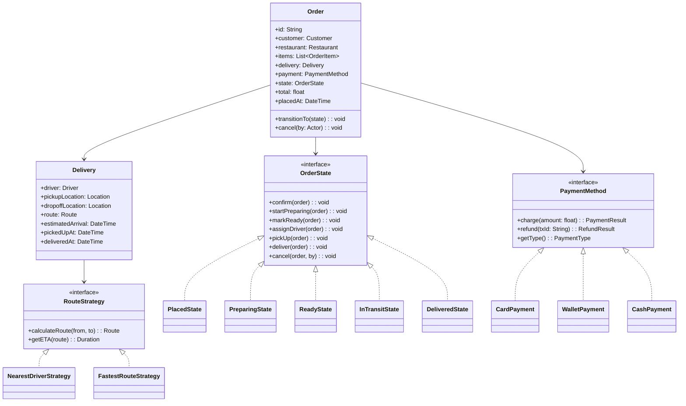

# Design a Food Delivery System (OOD)

**Difficulty**: 🔴 Advanced (OOD Focus)
**Codemania**: #125
**Interview Frequency**: High

> **Note**: This article covers the OOD class design perspective. For the distributed systems architecture (message queues, geospatial routing, microservices), see the system design section.

---

## Problem Statement

Model the OOD layer of a food delivery platform (DoorDash/Uber Eats level): customers build orders from restaurant menus, orders are placed and assigned to drivers, and real-time status updates flow back. The OOD challenge: an `Order` passes through a rich state machine (placed → confirmed → preparing → ready → picked-up → delivered); payment processors vary (card, wallet, cash); and driver assignment involves a swappable routing algorithm. Builder, State, Strategy, Observer, and Factory each handle a distinct concern.

---

## Functional Requirements

- Customer selects a restaurant, adds items to cart, places order
- Restaurant confirms and prepares the order; updates status
- Driver assigned when order is ready; picks up and delivers
- Real-time ETA updates pushed to customer
- Multiple payment methods: card, in-app wallet, cash on delivery
- Both customer and restaurant can cancel with applicable policies

---

## Core Entities

| Class | Responsibility |
|-------|---------------|
| `Order` | Core domain object: items, restaurant, customer, driver, state, payment |
| `OrderItem` | Line item: menu item reference, quantity, customizations |
| `Restaurant` | Profile, menu, preparation time estimate |
| `Menu` | Catalog of MenuItems; categorized |
| `MenuItem` | Food item: name, price, options/add-ons |
| `Delivery` | Delivery leg: driver, pickup time, route, ETA |
| `Driver` | Account: vehicle, current location, availability |
| `Customer` | Account: address book, payment methods, order history |
| `Route` | Pickup → dropoff path with ETA |
| `PaymentMethod` | Interface: charge, refund (card/wallet/cash implementations) |

---

## Class Diagram



---

## Design Patterns Used

### 1. Builder — Order Construction

**Why it fits**: An order has many optional parts: delivery instructions, promotional code, scheduled delivery time, tip amount. A builder lets callers set each field explicitly and validates the complete order before creating it, preventing partially-constructed order objects.

```
class OrderBuilder:
  customer: Customer
  restaurant: Restaurant
  items: List<OrderItem>
  paymentMethod: PaymentMethod
  deliveryAddress: Address
  promoCode: String  // optional
  scheduledFor: DateTime  // optional, default = ASAP
  tipAmount: float  // optional, default = 0

  withItem(menuItem, qty, customizations): OrderBuilder
    items.add(new OrderItem(menuItem, qty, customizations))
    return this

  withPromo(code): OrderBuilder
    promoCode = code
    return this

  build(): Order
    if items.isEmpty(): throw EmptyOrderException()
    if deliveryAddress == null: throw NoDeliveryAddressException()
    if paymentMethod == null: throw NoPaymentMethodException()
    total = calculateTotal()
    return new Order(this, total)
```

### 2. State — Order Lifecycle

**Why it fits**: Transition rules are strict: a restaurant can't mark an order ready if it hasn't confirmed it; a driver can't pick up an unassigned order. Each state class enforces its own invariants, preventing illegal state transitions with clear error messages.

```
interface OrderState:
  confirm(order): void
  startPreparing(order): void
  markReady(order): void
  cancel(order, by: Actor): void

class PlacedState implements OrderState:
  confirm(order):
    order.transitionTo(new ConfirmedState())
    notifier.notify(order.customer, "Restaurant confirmed your order!")

  cancel(order, by):
    // Free cancel before restaurant accepts
    refundService.fullRefund(order)
    order.transitionTo(new CancelledState())

class PreparingState implements OrderState:
  markReady(order):
    order.transitionTo(new ReadyState())
    driverAssignmentService.assign(order)

  cancel(order, by):
    if by == Actor.CUSTOMER:
      // Partial refund — restaurant has started cooking
      refundService.partialRefund(order, pct = 0.50)
    order.transitionTo(new CancelledState())

class InTransitState implements OrderState:
  deliver(order):
    order.delivery.deliveredAt = now()
    order.transitionTo(new DeliveredState())
    notifier.notify(order.customer, "Your order has been delivered!")

  cancel(order, by):
    throw CannotCancelInTransitOrderException()
```

### 3. Strategy — Driver Assignment / Route Calculation

**Why it fits**: Driver assignment can use "nearest idle driver" (minimize pickup time), "highest rated driver in area" (quality-first), or "batch assignment" (one driver picks up multiple orders from same restaurant). Route calculation varies between map providers. Both are injectable strategies.

```
interface DriverAssignmentStrategy:
  findDriver(order: Order): Driver

NearestIdleDriverStrategy:
  findDriver(order):
    candidates = driverRepo.findAvailable(
      near = order.restaurant.location, radiusKm = 3)
    return candidates.minBy(d ->
      haversine(d.location, order.restaurant.location))

interface RouteStrategy:
  calculateRoute(from: Location, to: Location): Route

FastestRouteStrategy:
  calculateRoute(from, to):
    // Call maps API with traffic data
    result = mapsApi.directions(from, to, optimize = FASTEST)
    return new Route(result.polyline, result.distanceKm, result.durationMin)
```

### 4. Observer — Real-Time Status Updates

**Why it fits**: When an order transitions state, the customer app, the restaurant tablet, and the analytics pipeline all need updates. The `Order` publishes `OrderStateChangedEvent` to observers — each subscriber handles its own notification logic.

```
class Order:
  observers: List<OrderObserver>

  transitionTo(newState: OrderState): void
    oldState = state
    state = newState
    state.onEnter(this)
    publish(OrderStateChangedEvent(this, oldState, newState))

  publish(event): void
    for obs in observers: obs.onEvent(event)

class CustomerPushNotifier implements OrderObserver:
  onEvent(OrderStateChangedEvent e):
    msg = switch e.newState:
      PlacedState: "Order received!"
      ConfirmedState: "Restaurant confirmed — preparing now"
      ReadyState: "Looking for your driver"
      InTransitState: "Driver picked up your order. ETA: " + e.order.delivery.eta
      DeliveredState: "Delivered! Enjoy your meal"
    pushService.send(e.order.customer.deviceToken, msg)
```

### 5. Factory — Payment Processor Selection

**Why it fits**: At checkout, the customer selects their payment method type. A factory maps the type to the correct implementation, avoiding `if/else` scattered across the order flow.

```
class PaymentMethodFactory:
  create(type: PaymentType, credentials: PaymentCredentials): PaymentMethod
    switch type:
      case CARD:   return new CardPayment(credentials.cardToken)
      case WALLET: return new WalletPayment(credentials.walletId)
      case CASH:   return new CashPayment()  // no credentials needed
      default:     throw UnsupportedPaymentTypeException(type)
```

---

## Key Method: `placeOrder(cart, customer)`

```
OrderService:
  placeOrder(cart: Cart, customer: Customer): Order
    // 1. Validate restaurant is accepting orders
    restaurant = cart.restaurant
    if not restaurant.isOpen():
      throw RestaurantClosedException(restaurant)

    // 2. Validate item availability
    for item in cart.items:
      if not restaurant.menu.isAvailable(item.menuItemId):
        throw ItemUnavailableException(item)

    // 3. Build order
    builder = new OrderBuilder()
      .withCustomer(customer)
      .withRestaurant(restaurant)
      .withDeliveryAddress(customer.defaultAddress)
    for item in cart.items:
      builder.withItem(item.menuItem, item.qty, item.customizations)
    order = builder.withPayment(paymentFactory.create(cart.paymentType, customer.credentials))
                   .build()

    // 4. Charge payment
    result = order.payment.charge(order.total)
    if not result.success:
      throw PaymentFailedException(result.errorCode)

    // 5. Persist and transition to Placed
    orderRepo.save(order)
    order.transitionTo(new PlacedState())

    // 6. Notify restaurant
    notificationService.notify(restaurant, NewOrderNotification(order))

    return order
```

---

## Design Decisions & Trade-offs

| Decision | Option A | Option B | Choice |
|----------|----------|----------|--------|
| Driver assignment timing | On order confirmed | On order ready | On order ready — avoids driver waiting for restaurant prep |
| ETA calculation | Static (avg prep + avg delivery) | Real-time (maps API + restaurant queue) | Real-time — wildly wrong static ETAs hurt trust |
| Cancellation refund | All-or-nothing | Partial by lifecycle stage | Partial — fairer to restaurant who has started cooking |
| Cash payment | Supported (no pre-charge) | Card-only | Supported via CashPayment strategy returning no-op charge |

---

## Top Interview Questions

| Question | What It Tests |
|----------|--------------|
| How do you handle a driver who accepts an order but then goes offline? | Driver reassignment, order timeout, state rollback |
| A customer places an order at 11:58 PM and the restaurant closes at midnight — what happens? | Restaurant availability check, order rejection |
| How would you add "group ordering" where multiple friends add items to the same cart? | Cart ownership model, concurrent access |

---

## Related Concepts

- [Ride-Sharing Service OOD for similar trip state machine](./ride-sharing-service)
- [Online Shopping OOD for order builder and payment patterns](./online-shopping)

---

## 📚 Resources & References

| Resource | Type | What You'll Learn |
|----------|------|------------------|
| [NeetCode OOD Playlist](https://www.youtube.com/@NeetCode) | 📺 YouTube | State machine and Builder pattern walkthroughs |
| [ByteByteGo System Design](https://www.youtube.com/@ByteByteGo) | 📺 YouTube | DoorDash / Uber Eats system design |
| [Head First Design Patterns](https://www.oreilly.com/library/view/head-first-design/0596007124/) | 📖 Blog | Builder, State, and Observer pattern chapters |
| [Clean Code — Robert Martin](https://www.amazon.com/Clean-Code-Handbook-Software-Craftsmanship/dp/0132350882) | 📚 Book | Clean order lifecycle management |
| [GoF Design Patterns](https://www.amazon.com/Design-Patterns-Elements-Reusable-Object-Oriented/dp/0201633612) | 📚 Book | Builder, State, and Strategy pattern reference |
