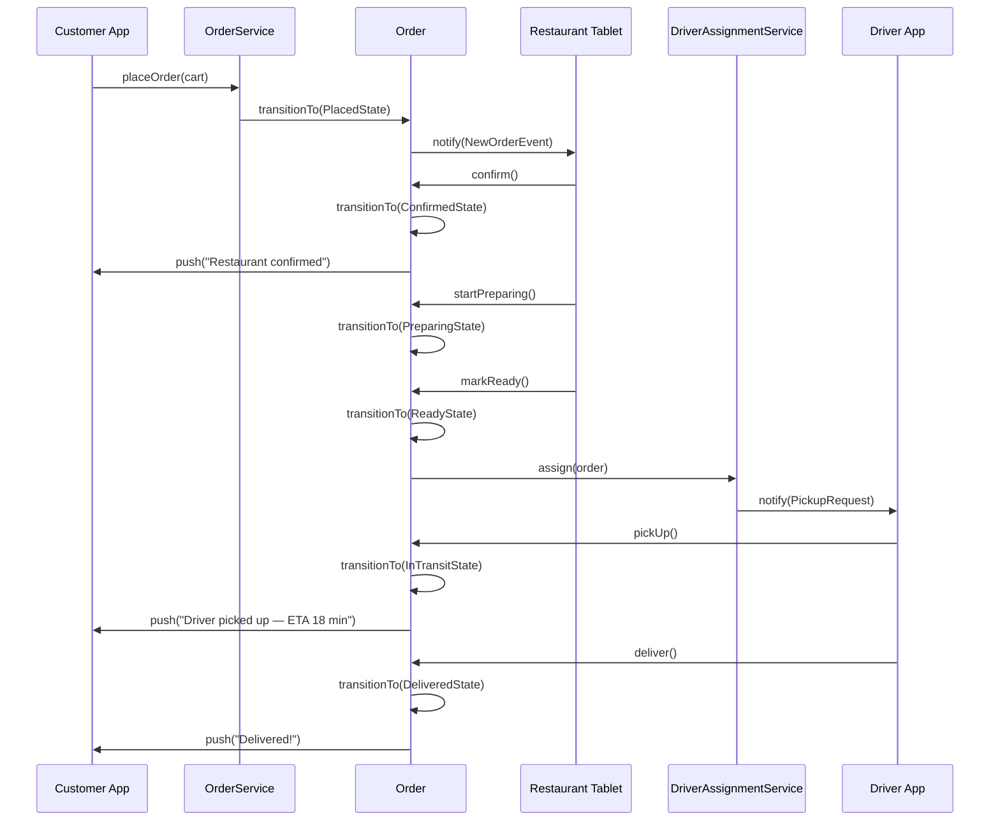

# Design a Food Delivery System (OOD)

**Difficulty**: 🔴 Advanced (OOD Focus)
**Codemania**: #125
**Interview Frequency**: High

> **Note**: This article covers the OOD class design perspective. For the distributed systems architecture (message queues, geospatial routing, microservices), see the system design section.

---

## Problem Statement

Model the OOD layer of a food delivery platform (DoorDash/Uber Eats level): customers build orders from restaurant menus, orders are placed and assigned to drivers, and real-time status updates flow back. The OOD challenge: an `Order` passes through a rich state machine (placed → confirmed → preparing → ready → picked-up → delivered); payment processors vary (card, wallet, cash); and driver assignment involves a swappable routing algorithm. Builder, State, Strategy, Observer, and Factory each handle a distinct concern.

---

## Functional Requirements

- Customer selects a restaurant, adds items to cart, places order
- Restaurant confirms and prepares the order; updates status
- Driver assigned when order is ready; picks up and delivers
- Real-time ETA updates pushed to customer
- Multiple payment methods: card, in-app wallet, cash on delivery
- Both customer and restaurant can cancel with applicable policies

---

## Core Entities

| Class | Responsibility |
|-------|---------------|
| `Order` | Core domain object: items, restaurant, customer, driver, state, payment |
| `OrderItem` | Line item: menu item reference, quantity, customizations |
| `Restaurant` | Profile, menu, preparation time estimate |
| `Menu` | Catalog of MenuItems; categorized |
| `MenuItem` | Food item: name, price, options/add-ons |
| `Delivery` | Delivery leg: driver, pickup time, route, ETA |
| `Driver` | Account: vehicle, current location, availability |
| `Customer` | Account: address book, payment methods, order history |
| `Route` | Pickup → dropoff path with ETA |
| `PaymentMethod` | Interface: charge, refund (card/wallet/cash implementations) |

---

## Class Diagram


---

## Design Patterns Used

### 1. Builder — Order Construction

**Why it fits**: An order has many optional parts: delivery instructions, promotional code, scheduled delivery time, tip amount. A builder lets callers set each field explicitly and validates the complete order before creating it, preventing partially-constructed order objects.

```
class OrderBuilder:
  customer: Customer
  restaurant: Restaurant
  items: List<OrderItem>
  paymentMethod: PaymentMethod
  deliveryAddress: Address
  promoCode: String  // optional
  scheduledFor: DateTime  // optional, default = ASAP
  tipAmount: float  // optional, default = 0

  withItem(menuItem, qty, customizations): OrderBuilder
    items.add(new OrderItem(menuItem, qty, customizations))
    return this

  withPromo(code): OrderBuilder
    promoCode = code
    return this

  build(): Order
    if items.isEmpty(): throw EmptyOrderException()
    if deliveryAddress == null: throw NoDeliveryAddressException()
    if paymentMethod == null: throw NoPaymentMethodException()
    total = calculateTotal()
    return new Order(this, total)
```

### 2. State — Order Lifecycle

**Why it fits**: Transition rules are strict: a restaurant can't mark an order ready if it hasn't confirmed it; a driver can't pick up an unassigned order. Each state class enforces its own invariants, preventing illegal state transitions with clear error messages.

```
interface OrderState:
  confirm(order): void
  startPreparing(order): void
  markReady(order): void
  cancel(order, by: Actor): void

class PlacedState implements OrderState:
  confirm(order):
    order.transitionTo(new ConfirmedState())
    notifier.notify(order.customer, "Restaurant confirmed your order!")

  cancel(order, by):
    // Free cancel before restaurant accepts
    refundService.fullRefund(order)
    order.transitionTo(new CancelledState())

class PreparingState implements OrderState:
  markReady(order):
    order.transitionTo(new ReadyState())
    driverAssignmentService.assign(order)

  cancel(order, by):
    if by == Actor.CUSTOMER:
      // Partial refund — restaurant has started cooking
      refundService.partialRefund(order, pct = 0.50)
    order.transitionTo(new CancelledState())

class InTransitState implements OrderState:
  deliver(order):
    order.delivery.deliveredAt = now()
    order.transitionTo(new DeliveredState())
    notifier.notify(order.customer, "Your order has been delivered!")

  cancel(order, by):
    throw CannotCancelInTransitOrderException()
```

### 3. Strategy — Driver Assignment / Route Calculation

**Why it fits**: Driver assignment can use "nearest idle driver" (minimize pickup time), "highest rated driver in area" (quality-first), or "batch assignment" (one driver picks up multiple orders from same restaurant). Route calculation varies between map providers. Both are injectable strategies.

```
interface DriverAssignmentStrategy:
  findDriver(order: Order): Driver

NearestIdleDriverStrategy:
  findDriver(order):
    candidates = driverRepo.findAvailable(
      near = order.restaurant.location, radiusKm = 3)
    return candidates.minBy(d ->
      haversine(d.location, order.restaurant.location))

interface RouteStrategy:
  calculateRoute(from: Location, to: Location): Route

FastestRouteStrategy:
  calculateRoute(from, to):
    // Call maps API with traffic data
    result = mapsApi.directions(from, to, optimize = FASTEST)
    return new Route(result.polyline, result.distanceKm, result.durationMin)
```

### 4. Observer — Real-Time Status Updates

**Why it fits**: When an order transitions state, the customer app, the restaurant tablet, and the analytics pipeline all need updates. The `Order` publishes `OrderStateChangedEvent` to observers — each subscriber handles its own notification logic.

```
class Order:
  observers: List<OrderObserver>

  transitionTo(newState: OrderState): void
    oldState = state
    state = newState
    state.onEnter(this)
    publish(OrderStateChangedEvent(this, oldState, newState))

  publish(event): void
    for obs in observers: obs.onEvent(event)

class CustomerPushNotifier implements OrderObserver:
  onEvent(OrderStateChangedEvent e):
    msg = switch e.newState:
      PlacedState: "Order received!"
      ConfirmedState: "Restaurant confirmed — preparing now"
      ReadyState: "Looking for your driver"
      InTransitState: "Driver picked up your order. ETA: " + e.order.delivery.eta
      DeliveredState: "Delivered! Enjoy your meal"
    pushService.send(e.order.customer.deviceToken, msg)
```

### 5. Factory — Payment Processor Selection

**Why it fits**: At checkout, the customer selects their payment method type. A factory maps the type to the correct implementation, avoiding `if/else` scattered across the order flow.

```
class PaymentMethodFactory:
  create(type: PaymentType, credentials: PaymentCredentials): PaymentMethod
    switch type:
      case CARD:   return new CardPayment(credentials.cardToken)
      case WALLET: return new WalletPayment(credentials.walletId)
      case CASH:   return new CashPayment()  // no credentials needed
      default:     throw UnsupportedPaymentTypeException(type)
```

---

## Key Method: `placeOrder(cart, customer)`

```
OrderService:
  placeOrder(cart: Cart, customer: Customer): Order
    // 1. Validate restaurant is accepting orders
    restaurant = cart.restaurant
    if not restaurant.isOpen():
      throw RestaurantClosedException(restaurant)

    // 2. Validate item availability
    for item in cart.items:
      if not restaurant.menu.isAvailable(item.menuItemId):
        throw ItemUnavailableException(item)

    // 3. Build order
    builder = new OrderBuilder()
      .withCustomer(customer)
      .withRestaurant(restaurant)
      .withDeliveryAddress(customer.defaultAddress)
    for item in cart.items:
      builder.withItem(item.menuItem, item.qty, item.customizations)
    order = builder.withPayment(paymentFactory.create(cart.paymentType, customer.credentials))
                   .build()

    // 4. Charge payment
    result = order.payment.charge(order.total)
    if not result.success:
      throw PaymentFailedException(result.errorCode)

    // 5. Persist and transition to Placed
    orderRepo.save(order)
    order.transitionTo(new PlacedState())

    // 6. Notify restaurant
    notificationService.notify(restaurant, NewOrderNotification(order))

    return order
```

---

## Design Decisions & Trade-offs

| Decision | Option A | Option B | Choice |
|----------|----------|----------|--------|
| Driver assignment timing | On order confirmed | On order ready | On order ready — avoids driver waiting for restaurant prep |
| ETA calculation | Static (avg prep + avg delivery) | Real-time (maps API + restaurant queue) | Real-time — wildly wrong static ETAs hurt trust |
| Cancellation refund | All-or-nothing | Partial by lifecycle stage | Partial — fairer to restaurant who has started cooking |
| Cash payment | Supported (no pre-charge) | Card-only | Supported via CashPayment strategy returning no-op charge |

---

## Top Interview Questions

| Question | What It Tests |
|----------|--------------|
| How do you handle a driver who accepts an order but then goes offline? | Driver reassignment, order timeout, state rollback |
| A customer places an order at 11:58 PM and the restaurant closes at midnight — what happens? | Restaurant availability check, order rejection |
| How would you add "group ordering" where multiple friends add items to the same cart? | Cart ownership model, concurrent access |

---

## Related Concepts

- [Ride-Sharing Service OOD for similar trip state machine](./ride-sharing-service)
- [Online Shopping OOD for order builder and payment patterns](./online-shopping)

---

## Class Design (Expanded)

The class diagram above captures the top-level relationships. The expanded view below adds the concrete state classes, the builder, the factory, and the observer contracts — giving interviewers a complete picture of how every pattern connects.

```mermaid
classDiagram
    class OrderBuilder {
        -customer: Customer
        -restaurant: Restaurant
        -items: List~OrderItem~
        -paymentMethod: PaymentMethod
        -deliveryAddress: Address
        -promoCode: String
        -scheduledFor: DateTime
        -tipAmount: float
        +withCustomer(c: Customer): OrderBuilder
        +withRestaurant(r: Restaurant): OrderBuilder
        +withItem(mi: MenuItem, qty: int, opts: List~String~): OrderBuilder
        +withDeliveryAddress(a: Address): OrderBuilder
        +withPayment(pm: PaymentMethod): OrderBuilder
        +withPromo(code: String): OrderBuilder
        +withTip(amount: float): OrderBuilder
        +build(): Order
        -calculateTotal(): float
        -validateCart(): void
    }

    class OrderObserver {
        <<interface>>
        +onEvent(e: OrderStateChangedEvent): void
    }

    class CustomerPushNotifier {
        -pushService: PushService
        +onEvent(e: OrderStateChangedEvent): void
    }

    class RestaurantTabletNotifier {
        -wsGateway: WebSocketGateway
        +onEvent(e: OrderStateChangedEvent): void
    }

    class AnalyticsSink {
        -eventBus: EventBus
        +onEvent(e: OrderStateChangedEvent): void
    }

    class PlacedState {
        +confirm(order): void
        +cancel(order, by): void
    }

    class ConfirmedState {
        +startPreparing(order): void
        +cancel(order, by): void
    }

    class PreparingState {
        +markReady(order): void
        +cancel(order, by): void
    }

    class ReadyState {
        +assignDriver(order): void
    }

    class InTransitState {
        +deliver(order): void
    }

    class DeliveredState {
        +confirm(order): void
    }

    class CancelledState {
        +confirm(order): void
    }

    class PaymentMethodFactory {
        +create(type: PaymentType, creds: PaymentCredentials): PaymentMethod
    }

    class CardPayment {
        -cardToken: String
        +charge(amount): PaymentResult
        +refund(txId): RefundResult
        +getType(): PaymentType
    }

    class WalletPayment {
        -walletId: String
        -balance: float
        +charge(amount): PaymentResult
        +refund(txId): RefundResult
        +getType(): PaymentType
    }

    class CashPayment {
        +charge(amount): PaymentResult
        +refund(txId): RefundResult
        +getType(): PaymentType
    }

    OrderObserver <|.. CustomerPushNotifier
    OrderObserver <|.. RestaurantTabletNotifier
    OrderObserver <|.. AnalyticsSink
    OrderState <|.. PlacedState
    OrderState <|.. ConfirmedState
    OrderState <|.. PreparingState
    OrderState <|.. ReadyState
    OrderState <|.. InTransitState
    OrderState <|.. DeliveredState
    OrderState <|.. CancelledState
    PaymentMethod <|.. CardPayment
    PaymentMethod <|.. WalletPayment
    PaymentMethod <|.. CashPayment
    PaymentMethodFactory ..> PaymentMethod
    OrderBuilder ..> Order
```



---

## Component Deep Dive 1: Order State Machine

The `Order` state machine is the most critical architectural component of this design. An order progresses through seven distinct states: `Placed → Confirmed → Preparing → Ready → InTransit → Delivered` (or `Cancelled` from any pre-transit state). The challenge is enforcing valid transitions while keeping each state's logic encapsulated and independently testable.

**How it works internally**: Each state is a class implementing `OrderState`. The `Order` object holds a reference to the current state instance and delegates every lifecycle call (`confirm()`, `markReady()`, `cancel()`, etc.) to that instance. When a transition occurs, `Order.transitionTo(newState)` atomically swaps the state reference, fires `onEnter()` on the new state (which may trigger side effects like driver assignment), and publishes an `OrderStateChangedEvent` to all registered observers.

**Why naive approaches fail at scale**: A common naive approach uses a single `status` enum field with `if/else` or `switch` blocks inside `OrderService`. This works for five states but collapses at seven or more: every new state adds a branch to every method, cyclomatic complexity explodes, and a developer adding "ScheduledDelivery" state must touch ten locations. More critically, invalid transitions become silent bugs — a misplaced `status = READY` assignment bypasses all validation.

**State transition sequence**:



**Trade-off comparison for state management approaches**:

| Approach | Transition Safety | Extensibility | Testability | Complexity |
|----------|-----------------|---------------|-------------|------------|
| State pattern (classes) | Compile-time enforcement per state | Add new state class without touching others | Each state isolated and unit-testable | Higher initial setup |
| Enum + switch in service | Runtime only, easy to miss a case | New state = edit all switch blocks | Must test entire service for each state | Low initially, high at 7+ states |
| Event sourcing (append events) | Replay-safe, full audit trail | New projections without touching events | Can replay to any point in time | Highest — requires event store and projectors |

The State pattern wins for OOD interviews because it makes illegal states unrepresentable at the class level. Event sourcing wins in production at DoorDash scale (explained in the real company section below).

---

## Component Deep Dive 2: Driver Assignment Strategy

Driver assignment is the most latency-sensitive operation in the delivery pipeline. When an order transitions to `ReadyState`, the system must find and assign a driver within seconds — a restaurant can only hold a hot meal for so long, and idle-driver time directly cuts into driver earnings.

**How it works internally**: `DriverAssignmentService` accepts a `DriverAssignmentStrategy` (injected at construction). The strategy receives the order and queries a geospatial driver index (typically Redis GEO or PostGIS) for available drivers within a configurable search radius. The default strategy — `NearestIdleDriver` — sorts candidates by haversine distance and returns the closest one. A secondary strategy — `BatchAssignment` — groups orders from the same restaurant that are simultaneously ready and assigns one driver to pick up all of them (important for ghost kitchens processing 40+ orders per hour from a single address).

**What happens at 10x load**: At 10x load, driver lookup becomes a hot path. A naive PostgreSQL `ST_Distance` query scanning all active drivers takes 80–200 ms at 5,000 concurrent drivers. At 50,000 concurrent drivers it takes 1.5–4 seconds — orders sit ready while food cools. The mitigation is a Redis GEO index updated every 5 seconds by driver location pings, with `GEORADIUS` queries completing in under 5 ms even at 100,000 concurrent drivers.

**Strategy comparison**:

| Strategy | Assignment Quality | Pickup Time | Driver Satisfaction | Use Case |
|----------|------------------|-------------|--------------------|-|
| Nearest idle driver | Good (minimizes cold food) | Lowest (avg 3–7 min) | Neutral | Standard single orders |
| Highest-rated in area | Best customer experience | Medium (avg 5–10 min) | Rewarding for top drivers | Premium / subscription tiers |
| Batch assignment | Lower per-order quality | Slightly higher (5–12 min) | Higher earnings per trip | Ghost kitchens, dense corridors |
| Auction (drivers bid) | Variable | Variable | Market-driven | Surge periods |

The strategy is injectable, so business logic changes (e.g., "during surge pricing, prefer batch assignment") require zero changes to `Order` or `DriverAssignmentService` — only a different strategy instance is wired in at startup.

---

## Component Deep Dive 3: Payment Abstraction Layer

The `PaymentMethod` interface hides three radically different charge semantics behind a single API. `CardPayment` issues an immediate hold through a payment gateway (Stripe/Braintree) and captures on delivery confirmation. `WalletPayment` deducts from a local balance with optimistic concurrency control — it must handle concurrent orders draining the same wallet. `CashPayment` is a no-op at charge time and instead creates a "collect on delivery" flag that the driver confirms.

**Technical decisions**:

- `charge()` returns a `PaymentResult` rather than throwing, because partial gateway failures (timeout vs. card declined vs. fraud block) each require different handling in `OrderService`.
- `refund()` accepts a `transactionId` (not an amount) because the refundable amount may differ from the original charge once promotions and loyalty points are applied — the payment processor calculates the net refundable amount from the original transaction record.
- `WalletPayment.charge()` uses an optimistic lock on `wallet.version` field: if two concurrent orders attempt to charge the same wallet simultaneously, one will fail the version check and retry with a fresh balance read.

**Thread safety concern**: `WalletPayment` requires the balance check and deduction to be atomic. If the wallet is stored in PostgreSQL, a `SELECT ... FOR UPDATE` inside a transaction handles this. If stored in Redis, a Lua script executes the check-and-decrement atomically. The `PaymentMethod` interface contract specifies atomicity as a requirement — implementations must satisfy it.

---

## Data Model

```sql
-- Customers
CREATE TABLE customers (
    customer_id     UUID PRIMARY KEY DEFAULT gen_random_uuid(),
    name            VARCHAR(100) NOT NULL,
    email           VARCHAR(255) UNIQUE NOT NULL,
    phone           VARCHAR(20),
    device_token    VARCHAR(500),       -- FCM/APNs push token
    created_at      TIMESTAMPTZ DEFAULT NOW()
);

-- Addresses (one customer, many saved addresses)
CREATE TABLE addresses (
    address_id      UUID PRIMARY KEY DEFAULT gen_random_uuid(),
    customer_id     UUID REFERENCES customers(customer_id),
    label           VARCHAR(50),        -- "Home", "Work"
    street          VARCHAR(255) NOT NULL,
    city            VARCHAR(100) NOT NULL,
    lat             DECIMAL(9,6) NOT NULL,
    lng             DECIMAL(9,6) NOT NULL,
    is_default      BOOLEAN DEFAULT FALSE
);

-- Restaurants
CREATE TABLE restaurants (
    restaurant_id   UUID PRIMARY KEY DEFAULT gen_random_uuid(),
    name            VARCHAR(150) NOT NULL,
    lat             DECIMAL(9,6) NOT NULL,
    lng             DECIMAL(9,6) NOT NULL,
    avg_prep_min    SMALLINT DEFAULT 20,
    is_open         BOOLEAN DEFAULT TRUE,
    opens_at        TIME,
    closes_at       TIME
);

-- Menu Items
CREATE TABLE menu_items (
    item_id         UUID PRIMARY KEY DEFAULT gen_random_uuid(),
    restaurant_id   UUID REFERENCES restaurants(restaurant_id),
    name            VARCHAR(200) NOT NULL,
    description     TEXT,
    price_cents     INTEGER NOT NULL,   -- store in cents, avoid float
    category        VARCHAR(100),
    is_available    BOOLEAN DEFAULT TRUE,
    image_url       VARCHAR(500)
);

-- Orders
CREATE TABLE orders (
    order_id        UUID PRIMARY KEY DEFAULT gen_random_uuid(),
    customer_id     UUID REFERENCES customers(customer_id),
    restaurant_id   UUID REFERENCES restaurants(restaurant_id),
    delivery_address_id UUID REFERENCES addresses(address_id),
    status          VARCHAR(20) NOT NULL DEFAULT 'PLACED',
                    -- PLACED|CONFIRMED|PREPARING|READY|IN_TRANSIT|DELIVERED|CANCELLED
    total_cents     INTEGER NOT NULL,
    delivery_fee_cents INTEGER NOT NULL DEFAULT 0,
    tip_cents       INTEGER NOT NULL DEFAULT 0,
    promo_code      VARCHAR(50),
    payment_type    VARCHAR(20) NOT NULL,   -- CARD|WALLET|CASH
    payment_tx_id   VARCHAR(255),           -- gateway transaction ID
    scheduled_for   TIMESTAMPTZ,           -- NULL = ASAP
    placed_at       TIMESTAMPTZ DEFAULT NOW(),
    confirmed_at    TIMESTAMPTZ,
    ready_at        TIMESTAMPTZ,
    picked_up_at    TIMESTAMPTZ,
    delivered_at    TIMESTAMPTZ,
    cancelled_at    TIMESTAMPTZ,
    cancel_by       VARCHAR(20)            -- CUSTOMER|RESTAURANT|SYSTEM
);

CREATE INDEX idx_orders_customer ON orders(customer_id, placed_at DESC);
CREATE INDEX idx_orders_restaurant ON orders(restaurant_id, status);
CREATE INDEX idx_orders_status ON orders(status) WHERE status NOT IN ('DELIVERED','CANCELLED');

-- Order Items (line items)
CREATE TABLE order_items (
    order_item_id   UUID PRIMARY KEY DEFAULT gen_random_uuid(),
    order_id        UUID REFERENCES orders(order_id) ON DELETE CASCADE,
    item_id         UUID REFERENCES menu_items(item_id),
    item_name       VARCHAR(200) NOT NULL,  -- snapshot at order time
    unit_price_cents INTEGER NOT NULL,      -- snapshot at order time
    quantity        SMALLINT NOT NULL DEFAULT 1,
    customizations  JSONB                   -- [{"option":"No onions"},{"addon":"Extra cheese","price_cents":75}]
);

-- Drivers
CREATE TABLE drivers (
    driver_id       UUID PRIMARY KEY DEFAULT gen_random_uuid(),
    name            VARCHAR(100) NOT NULL,
    phone           VARCHAR(20) NOT NULL,
    vehicle_type    VARCHAR(20),           -- BIKE|SCOOTER|CAR
    rating          DECIMAL(3,2) DEFAULT 5.00,
    is_available    BOOLEAN DEFAULT FALSE,
    last_lat        DECIMAL(9,6),
    last_lng        DECIMAL(9,6),
    last_location_at TIMESTAMPTZ
);

-- Deliveries
CREATE TABLE deliveries (
    delivery_id     UUID PRIMARY KEY DEFAULT gen_random_uuid(),
    order_id        UUID UNIQUE REFERENCES orders(order_id),
    driver_id       UUID REFERENCES drivers(driver_id),
    pickup_lat      DECIMAL(9,6) NOT NULL,
    pickup_lng      DECIMAL(9,6) NOT NULL,
    dropoff_lat     DECIMAL(9,6) NOT NULL,
    dropoff_lng     DECIMAL(9,6) NOT NULL,
    estimated_min   SMALLINT,
    distance_km     DECIMAL(6,2),
    assigned_at     TIMESTAMPTZ,
    picked_up_at    TIMESTAMPTZ,
    delivered_at    TIMESTAMPTZ
);
```

**Key modeling decisions**:
- `unit_price_cents` and `item_name` are snapshotted in `order_items` — a menu item's price may change after the order is placed, but the customer's receipt must reflect what they were charged.
- `status` is a VARCHAR not a foreign key to a states table, because state transition logic lives in application code (State pattern), not in the DB.
- `customizations` is JSONB — the open-ended nature of food customizations (extra cheese, no onions, double shot) maps poorly to a fixed schema; JSONB allows per-restaurant option schemas with GIN indexing for analytics queries.

---

## Scale Bottlenecks

| Traffic Level | Component That Breaks | Symptoms | Mitigation |
|---------------|----------------------|----------|------------|
| 10x baseline (100k orders/day) | Synchronous driver lookup in PostgreSQL | Assignment latency > 500 ms; food ready-wait time increases | Move driver location index to Redis GEO; `GEORADIUS` in < 5 ms |
| 50x baseline (500k orders/day) | Order status writes on single PostgreSQL primary | Write lock contention on `orders` table; p99 write > 2 s | Partition `orders` by `placed_at` month; shard by `restaurant_id` |
| 100x baseline (1M orders/day) | Observer fan-out in-process | State change triggers 3+ slow I/O calls synchronously; thread pool exhaustion | Move observer notifications to async message queue (Kafka topic `order.state.changed`) |
| 500x baseline (5M orders/day) | Monolithic `OrderService` | Single deployment bottleneck; any failure takes all order processing down | Split into microservices: OrderLifecycle, PaymentService, DriverAssignment, NotificationService |
| 1000x baseline (10M orders/day) | Wallet payment concurrent deductions | Wallet row-level locks create queue under burst; 10–50 ms average, 2 s p99 | Move wallet balance to Redis with Lua atomic check-and-decrement; DB becomes eventual audit log |

---

## How DoorDash Built This

DoorDash's engineering blog and conference talks (2019–2023) reveal an architecture that evolved directly from the class-level concerns described in this article.

**Starting point**: DoorDash originally used a Rails monolith with a straightforward state machine gem (`aasm`) — essentially the same State pattern described here but implemented in Ruby. This worked at 10k orders/day.

**The breaking point**: At roughly 500k orders/day (2018), the monolith's synchronous dispatch path — `placeOrder` → `chargeCard` → `assignDriver` → `notifyRestaurant` all in one HTTP request — hit 8–12 second p99 latency. Any slow Stripe call or maps API timeout caused visible failures.

**Technology pivot**: DoorDash moved to an event-driven microservices architecture built on Apache Kafka. The key non-obvious decision: they chose **event sourcing** for the order lifecycle rather than just publishing state-change events. Every transition (`OrderPlaced`, `OrderConfirmed`, `DriverAssigned`, `OrderPickedUp`) is an immutable event appended to Kafka. The current order state is a projection of replayed events. This gave them free audit trails, replay-based debugging, and A/B testability of dispatch algorithms without touching live orders.

**Specific numbers**:
- At peak (dinner rush in major US cities): ~80,000 concurrent active orders
- Driver location updates: ~5 million GPS pings/minute ingested into their dispatch system
- Assignment latency target: < 30 seconds from order ready to driver assigned (p95)
- Driver location index: Redis cluster with ~200,000 active driver entries, `GEORADIUS` queries averaging 3 ms

**Non-obvious decision**: DoorDash separates the "dispatch" microservice (which finds and contacts drivers) from the "order" microservice (which manages lifecycle). The dispatch service maintains its own read replica of driver locations and can be deployed and scaled independently. A bug in dispatch never takes down order placement — drivers just get assigned slightly slower.

Sources: DoorDash Engineering Blog — "Rebuilding DoorDash's Dispatch" (2020), QCon New York 2019 talk by DoorDash engineers.

---

## Design Patterns Applied

| Pattern | Where Used | Why It Fits |
|---------|-----------|-------------|
| **Builder** | `OrderBuilder` assembles an `Order` | 8+ optional fields (promo, tip, schedule, instructions); validates complete object before creation |
| **State** | `OrderState` and its 7 concrete classes | 7 states x 6 transitions = 42 potential methods; State pattern keeps each state's rules co-located and independently testable |
| **Strategy** | `DriverAssignmentStrategy`, `RouteStrategy` | Assignment algorithm varies by business rule (nearest, batch, auction); injectable without changing `Order` or `OrderService` |
| **Observer** | `OrderObserver` with CustomerPushNotifier, RestaurantTabletNotifier, AnalyticsSink | Multiple independent consumers of state changes; adding a new consumer (e.g., SMS fallback) requires zero changes to `Order` |
| **Factory Method** | `PaymentMethodFactory` | Maps `PaymentType` enum to the correct `PaymentMethod` implementation; centralizes the `if/else` that would otherwise scatter across checkout flows |

---

## SOLID Principles

**Single Responsibility**: `Order` owns lifecycle state transitions. `OrderBuilder` owns construction and validation. `DriverAssignmentService` owns driver selection. No class handles more than one of these concerns.

**Open/Closed**: Adding a new payment method (e.g., cryptocurrency) requires creating `CryptoPayment implements PaymentMethod` and adding one case to `PaymentMethodFactory` — zero changes to `Order`, `OrderService`, or `OrderBuilder`. Adding a new notification channel (SMS) requires creating `SMSNotifier implements OrderObserver` and registering it — zero changes to `Order`.

**Liskov Substitution**: Every `PaymentMethod` implementation honors the contract: `charge()` returns a `PaymentResult` (never throws for business failures), `refund()` accepts a transaction ID. `CashPayment.charge()` returns a synthetic success result — no violation of the interface contract.

**Interface Segregation**: `OrderState` is the only interface that could violate ISP — it exposes `confirm()`, `startPreparing()`, `markReady()`, `assignDriver()`, `pickUp()`, `deliver()`, and `cancel()` methods, many of which throw `IllegalStateException` from most concrete states. The mitigation: provide a `BaseOrderState` abstract class that throws by default, and let each concrete state override only the transitions it legally handles.

**Dependency Inversion**: `OrderService` depends on `PaymentMethod` (interface), `DriverAssignmentStrategy` (interface), `OrderObserver` (interface), and `OrderRepository` (interface) — never on `CardPayment`, `NearestIdleDriverStrategy`, or `PostgresOrderRepository` directly. All concrete bindings happen in the DI container (Spring, Guice, etc.).

---

## Concurrency and Thread Safety

Three concurrent-access scenarios require explicit handling:

**1. Concurrent state transitions**: If the customer app and the restaurant tablet simultaneously trigger `cancel()` and `confirm()` on the same order (race condition at restaurant acceptance time), one must win and one must fail gracefully. The mitigation: use optimistic locking on `Order` with a `version` column. The state transition that writes `UPDATE orders SET status=?, version=version+1 WHERE order_id=? AND version=?` will fail for the second writer, who retries and finds the order in an unexpected state — both operations then follow the appropriate error path.

**2. Concurrent wallet deductions**: Covered in Component Deep Dive 3. TL;DR: atomic check-and-decrement via `SELECT ... FOR UPDATE` (PostgreSQL) or a Redis Lua script.

**3. Observer fan-out**: If observers are called synchronously inside `transitionTo()`, a slow push notification call blocks the order-saving transaction. The fix: publish to an in-memory queue (or Kafka) inside the transaction, with a background thread consuming and calling observers asynchronously. This decouples notification latency from order write latency.

---

## Extension Points

**Adding "Scheduled Delivery" (order placed now, delivered at 7 PM)**:
- `OrderBuilder.withScheduledFor(DateTime)` already exists.
- Add `ScheduledState` implementing `OrderState` — the order sits in `ScheduledState` until a scheduler triggers `activate()` at the scheduled time, moving it to `PlacedState` and starting the normal flow.
- Zero changes to existing states.

**Adding "Group Order" (multiple customers add items to one cart)**:
- Introduce `Cart` as a first-class entity with `ownerId` and `collaborators: List<Customer>`.
- `CartService` manages concurrent `addItem` calls with optimistic locking on `Cart.version`.
- `OrderBuilder.fromCart(cart)` creates the order as today — no changes to `Order` itself.

**Adding "In-App Live Tracking"**:
- Add `LocationUpdateEvent` (published by driver app every 5 seconds).
- Create `LiveTrackingObserver implements OrderObserver` that pushes driver coordinates via WebSocket to the customer's connected session.
- Register with the order's observer list when the order enters `InTransitState`; deregister on `DeliveredState`.

---

## Interview Angle

**What the interviewer is testing**: Can the candidate identify which design patterns solve which concrete problems in the food delivery domain — not just name patterns in the abstract, but justify the choice based on the specific failure mode each pattern prevents.

**Common mistakes candidates make**:

1. **Using a single `OrderStatus` enum with if/else in the service layer** — works for 3 states, becomes unmaintainable at 7 states, and allows invalid transitions (e.g., `order.status = DELIVERED` without calling `deliver()`). The State pattern eliminates this class of bug entirely.

2. **Assigning a driver immediately when the order is placed** — the restaurant hasn't confirmed yet; if it rejects (out of ingredient, closed early), the driver has already been pulled from the pool unnecessarily. Correct timing: assign on `ReadyState`, when the food is actually waiting.

3. **Not snapshotting menu item prices in order line items** — storing only a `menu_item_id` reference means if a restaurant raises its prices, historical orders appear to cost the new price, breaking receipt integrity and refund calculations. Always snapshot `item_name` and `unit_price_cents` at order time.

**The insight that separates good from great answers**: The State pattern does more than enforce valid transitions — it makes the _refund policy_ a first-class citizen of the state machine. A `PlacedState.cancel()` issues a full refund; a `PreparingState.cancel()` issues a partial refund; an `InTransitState.cancel()` throws. This business logic is captured at exactly the right abstraction level, without a single `if (status == PREPARING && cancelledBy == CUSTOMER)` conditional in `OrderService`.

---

## Key Numbers to Remember

| Metric | Value | Context |
|--------|-------|---------|
| Order state count | 7 states (Placed, Confirmed, Preparing, Ready, InTransit, Delivered, Cancelled) | State pattern justified at 5+ states |
| Driver assignment SLA | < 30 seconds from order ready to driver assigned (p95) | DoorDash production target |
| Driver location index query | < 5 ms via Redis GEO `GEORADIUS` | At 200k concurrent active drivers |
| Wallet payment atomic window | < 1 ms with Redis Lua script vs. 10–50 ms with Postgres `FOR UPDATE` | Under 100 concurrent wallet deductions |
| Observer fan-out budget | < 10 ms synchronous path | Async Kafka fan-out adds < 50 ms end-to-end |
| Price snapshot importance | 100% of order_items rows must snapshot price | Prevents receipt corruption on price changes |
| DoorDash peak concurrent orders | ~80,000 active orders | Dinner rush in major US cities, 2022 |
| Driver GPS ping rate | ~5 million pings/minute | DoorDash dispatch ingestion at scale |

---

## 📚 Resources & References

| Resource | Type | What You'll Learn |
|----------|------|------------------|
| [NeetCode OOD Playlist](https://www.youtube.com/@NeetCode) | 📺 YouTube | State machine and Builder pattern walkthroughs |
| [ByteByteGo System Design](https://www.youtube.com/@ByteByteGo) | 📺 YouTube | DoorDash / Uber Eats system design |
| [Head First Design Patterns](https://www.oreilly.com/library/view/head-first-design/0596007124/) | 📖 Blog | Builder, State, and Observer pattern chapters |
| [Clean Code — Robert Martin](https://www.amazon.com/Clean-Code-Handbook-Software-Craftsmanship/dp/0132350882) | 📚 Book | Clean order lifecycle management |
| [GoF Design Patterns](https://www.amazon.com/Design-Patterns-Elements-Reusable-Object-Oriented/dp/0201633612) | 📚 Book | Builder, State, and Strategy pattern reference |
