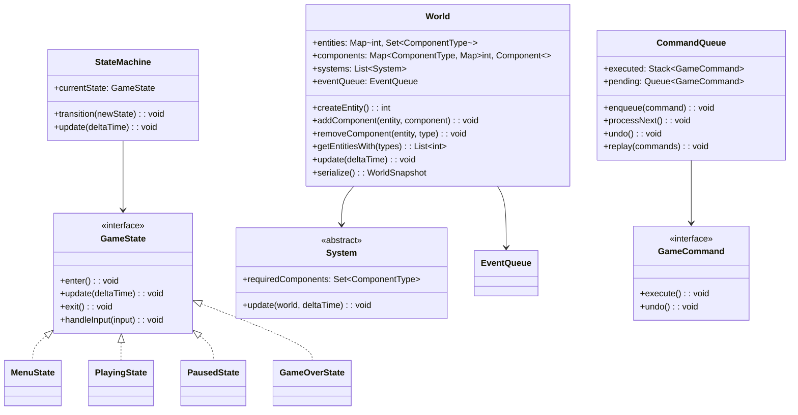

# Design a Game State Management System (OOD)

**Difficulty**: 🔴 Advanced
**Codemania**: #138
**Interview Frequency**: Medium

---

## Problem Statement

Design a game engine's state management layer that supports an Entity-Component-System (ECS) architecture, a top-level game state machine (menu → playing → paused → game-over), save/load with Memento, and undo/replay via Command. The OOD challenge: classic inheritance hierarchies for game objects (Player extends Character, Enemy extends Character with Weapon…) explode at scale. ECS separates data (Component) from logic (System) giving flat composition with no inheritance overhead.

---

## Functional Requirements

- Game loop: update all systems each frame with variable delta time
- ECS: create entities dynamically; attach/detach components at runtime
- Top-level state machine: menu, playing, paused, game-over transitions
- Save game: serialize full ECS world snapshot to a slot
- Load game: restore ECS world from a saved slot
- Command-based actions: every player action supports undo and replay recording

---

## Core Entities

| Class | Responsibility |
|-------|---------------|
| `World` | ECS root: entity registry, component storage, system runner |
| `Entity` | Unique integer ID; no data of its own |
| `Component` | Pure data struct: position, velocity, health, input |
| `System` | Logic unit: queries entities with required components and updates them |
| `EventQueue` | Deferred inter-system messaging |
| `SaveSlot` | Named snapshot of entire World state |
| `StateMachine` | Top-level game state: menu/playing/paused/game-over |
| `GameState` | Interface for each state: `enter()`, `update()`, `exit()` |
| `CommandQueue` | FIFO of player actions; supports undo and replay |
| `Memento` | Serialized world snapshot used by save system |

---

## Class Diagram



---

## Design Patterns Used

### 1. Entity-Component-System (ECS)

**Why it fits**: Inheritance hierarchies for game objects collapse under complexity — a flying wizard archer would need diamond inheritance. ECS treats an entity as just an ID. Components are pure data bags. Systems contain all logic and operate on any entity that has the required components. Adding "flying" to a character is attaching a `FlyingComponent` — no class change.

```
// Entity = just an ID
type Entity = int

// Components = pure data
class PositionComponent implements Component:
  x: float
  y: float

class VelocityComponent implements Component:
  dx: float
  dy: float

class HealthComponent implements Component:
  current: int
  max: int

// System = logic over component sets
class MovementSystem extends System:
  requiredComponents = {PositionComponent, VelocityComponent}

  update(world: World, dt: float): void
    for entity in world.getEntitiesWith(requiredComponents):
      pos = world.getComponent(entity, PositionComponent)
      vel = world.getComponent(entity, VelocityComponent)
      pos.x += vel.dx * dt
      pos.y += vel.dy * dt
```

### 2. Command — Game Actions for Undo/Replay

**Why it fits**: Every player action (move, attack, use item) is a `GameCommand`. Storing commands lets you undo the last N actions, replay a recorded run, and send commands over the network for multiplayer sync — without the game world knowing it's being replayed.

```
interface GameCommand:
  execute(): void
  undo(): void

class MoveCommand implements GameCommand:
  entity: int
  world: World
  direction: Vector2
  previousPosition: PositionComponent

  execute():
    previousPosition = world.getComponent(entity, PositionComponent).copy()
    pos = world.getComponent(entity, PositionComponent)
    pos.x += direction.x
    pos.y += direction.y

  undo():
    world.setComponent(entity, previousPosition)

CommandQueue:
  processNext():
    cmd = pending.dequeue()
    cmd.execute()
    executed.push(cmd)

  undo():
    if not executed.isEmpty():
      executed.pop().undo()
```

### 3. State Machine — Game Phase Transitions

**Why it fits**: Pausing in the game-over state makes no sense; the input handling in menu and playing states is completely different. A state machine with each phase as a class enforces legal transitions and keeps update/input logic isolated per phase.

```
interface GameState:
  enter(): void
  update(deltaTime: float): void
  exit(): void
  handleInput(input: InputEvent): void

class PlayingState implements GameState:
  enter():
    audioManager.playGameMusic()
    world.resumeSystems()

  update(dt):
    world.update(dt)
    commandQueue.processAll()

  handleInput(input):
    if input == PAUSE_KEY:
      stateMachine.transition(new PausedState())
    else:
      commandQueue.enqueue(inputMapper.map(input))

  exit():
    audioManager.stopMusic()

class PausedState implements GameState:
  enter():
    world.pauseSystems()
    ui.showPauseMenu()

  handleInput(input):
    if input == RESUME_KEY:
      stateMachine.transition(new PlayingState())
    if input == SAVE_KEY:
      saveSystem.save(world, "slot_1")
    if input == QUIT_KEY:
      stateMachine.transition(new MenuState())
```

### 4. Memento — Save/Load

**Why it fits**: Saving a game means capturing the entire world state without exposing internals to an external save manager. `World.serialize()` returns a `WorldSnapshot` (Memento) containing opaque serialized state. `World.restore(snapshot)` reconstructs it. The save manager stores snapshots without knowing their structure.

```
class WorldSnapshot:   // Memento
  timestamp: DateTime
  entityData: bytes   // serialized entity-component store
  version: int

World:
  serialize(): WorldSnapshot
    data = componentStore.serializeAll()  // struct-of-arrays → bytes
    return WorldSnapshot(now(), data, SCHEMA_VERSION)

  restore(snapshot: WorldSnapshot): void
    if snapshot.version != SCHEMA_VERSION:
      snapshot = migrationService.migrate(snapshot)
    componentStore.deserializeAll(snapshot.entityData)
```

---

## Key Method: `update(deltaTime)` — The Game Loop

```
World:
  update(deltaTime: float): void
    // 1. Process deferred events from last frame
    eventQueue.drainAll()

    // 2. Run each system in defined order
    // Order matters: input → AI → physics → collision → render
    for system in orderedSystems:
      entities = getEntitiesWith(system.requiredComponents)
      if not entities.isEmpty():
        system.update(this, deltaTime)

    // 3. Clean up destroyed entities
    for entity in pendingDestruction:
      removeAllComponents(entity)
      entityRegistry.remove(entity)
    pendingDestruction.clear()
```

**Fixed vs variable timestep**: Variable `deltaTime` is passed so physics systems can scale correctly (`pos += vel * dt`). For deterministic replay, fixed timestep (16 ms) is used instead — same inputs always produce same outputs.

---

## Design Decisions & Trade-offs

| Decision | Option A | Option B | Choice |
|----------|----------|----------|--------|
| Object model | Inheritance hierarchy | ECS (flat composition) | ECS — avoids diamond inheritance; more cache-friendly |
| Component storage | Array-of-structs (component per entity in sequence) | Struct-of-arrays (all positions contiguous) | Struct-of-arrays — better CPU cache locality for system iteration |
| Timestep | Variable (real elapsed time) | Fixed (16 ms) | Fixed for physics and replay; variable for rendering |
| Save format | JSON (human-readable) | Binary (compact) | Binary for production; JSON for debugging |

---

## Top Interview Questions

| Question | What It Tests |
|----------|--------------|
| How do you ensure the game loop runs at a stable 60 FPS regardless of frame time variance? | Fixed timestep with accumulator pattern |
| How would you add a "flying" ability to an enemy without changing the Enemy class? | ECS component attachment, Open/Closed |
| A player saves mid-combat — how do you restore the exact AI state on load? | Memento completeness, AI component serialization |

---

## Related Concepts

- [Entity-Component-System OOD for the pure ECS architecture deep-dive](./entity-component-system)
- [IOT Smart Home OOD for Command pattern with undo](./iot-smart-home)

---

## 📚 Resources & References

| Resource | Type | What You'll Learn |
|----------|------|------------------|
| [NeetCode OOD Playlist](https://www.youtube.com/@NeetCode) | 📺 YouTube | State machine and Command walkthroughs |
| [Game Programming Patterns](https://gameprogrammingpatterns.com/) | 📖 Blog | ECS, State, Command, and Memento for games (free book) |
| [ByteByteGo System Design](https://www.youtube.com/@ByteByteGo) | 📺 YouTube | Game engine architecture overview |
| [Head First Design Patterns](https://www.oreilly.com/library/view/head-first-design/0596007124/) | 📚 Book | Memento, Command, and State pattern chapters |
| [GoF Design Patterns](https://www.amazon.com/Design-Patterns-Elements-Reusable-Object-Oriented/dp/0201633612) | 📚 Book | Memento and State pattern reference |
