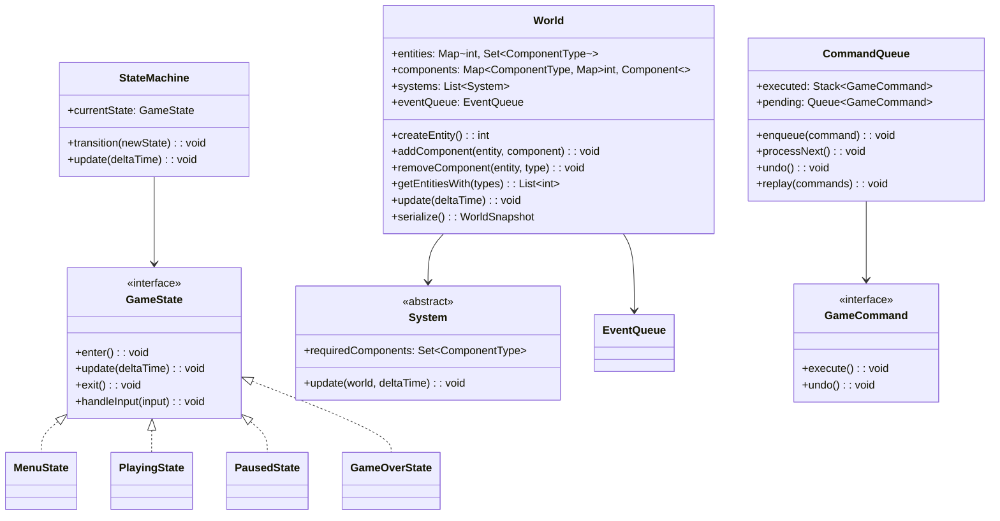
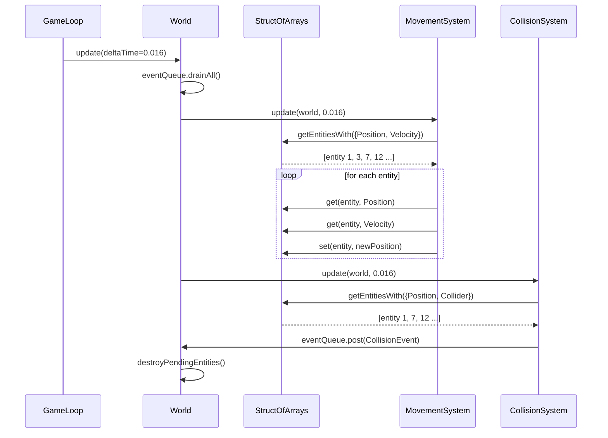
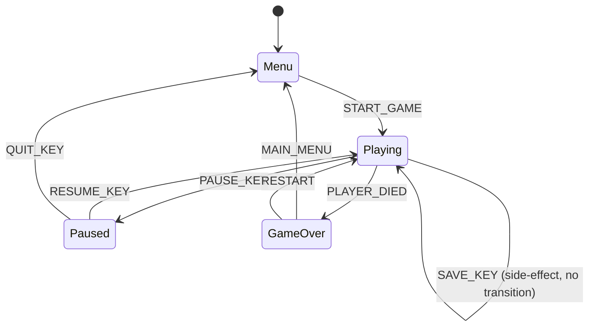

# Design a Game State Management System (OOD)

**Difficulty**: 🔴 Advanced
**Codemania**: #138
**Interview Frequency**: Medium

---

## Problem Statement

Design a game engine's state management layer that supports an Entity-Component-System (ECS) architecture, a top-level game state machine (menu → playing → paused → game-over), save/load with Memento, and undo/replay via Command. The OOD challenge: classic inheritance hierarchies for game objects (Player extends Character, Enemy extends Character with Weapon…) explode at scale. ECS separates data (Component) from logic (System) giving flat composition with no inheritance overhead.

---

## Functional Requirements

- Game loop: update all systems each frame with variable delta time
- ECS: create entities dynamically; attach/detach components at runtime
- Top-level state machine: menu, playing, paused, game-over transitions
- Save game: serialize full ECS world snapshot to a slot
- Load game: restore ECS world from a saved slot
- Command-based actions: every player action supports undo and replay recording

---

## Core Entities

| Class | Responsibility |
|-------|---------------|
| `World` | ECS root: entity registry, component storage, system runner |
| `Entity` | Unique integer ID; no data of its own |
| `Component` | Pure data struct: position, velocity, health, input |
| `System` | Logic unit: queries entities with required components and updates them |
| `EventQueue` | Deferred inter-system messaging |
| `SaveSlot` | Named snapshot of entire World state |
| `StateMachine` | Top-level game state: menu/playing/paused/game-over |
| `GameState` | Interface for each state: `enter()`, `update()`, `exit()` |
| `CommandQueue` | FIFO of player actions; supports undo and replay |
| `Memento` | Serialized world snapshot used by save system |

---

## Class Diagram



---

## Design Patterns Used

### 1. Entity-Component-System (ECS)

**Why it fits**: Inheritance hierarchies for game objects collapse under complexity — a flying wizard archer would need diamond inheritance. ECS treats an entity as just an ID. Components are pure data bags. Systems contain all logic and operate on any entity that has the required components. Adding "flying" to a character is attaching a `FlyingComponent` — no class change.

```
// Entity = just an ID
type Entity = int

// Components = pure data
class PositionComponent implements Component:
  x: float
  y: float

class VelocityComponent implements Component:
  dx: float
  dy: float

class HealthComponent implements Component:
  current: int
  max: int

// System = logic over component sets
class MovementSystem extends System:
  requiredComponents = {PositionComponent, VelocityComponent}

  update(world: World, dt: float): void
    for entity in world.getEntitiesWith(requiredComponents):
      pos = world.getComponent(entity, PositionComponent)
      vel = world.getComponent(entity, VelocityComponent)
      pos.x += vel.dx * dt
      pos.y += vel.dy * dt
```

### 2. Command — Game Actions for Undo/Replay

**Why it fits**: Every player action (move, attack, use item) is a `GameCommand`. Storing commands lets you undo the last N actions, replay a recorded run, and send commands over the network for multiplayer sync — without the game world knowing it's being replayed.

```
interface GameCommand:
  execute(): void
  undo(): void

class MoveCommand implements GameCommand:
  entity: int
  world: World
  direction: Vector2
  previousPosition: PositionComponent

  execute():
    previousPosition = world.getComponent(entity, PositionComponent).copy()
    pos = world.getComponent(entity, PositionComponent)
    pos.x += direction.x
    pos.y += direction.y

  undo():
    world.setComponent(entity, previousPosition)

CommandQueue:
  processNext():
    cmd = pending.dequeue()
    cmd.execute()
    executed.push(cmd)

  undo():
    if not executed.isEmpty():
      executed.pop().undo()
```

### 3. State Machine — Game Phase Transitions

**Why it fits**: Pausing in the game-over state makes no sense; the input handling in menu and playing states is completely different. A state machine with each phase as a class enforces legal transitions and keeps update/input logic isolated per phase.

```
interface GameState:
  enter(): void
  update(deltaTime: float): void
  exit(): void
  handleInput(input: InputEvent): void

class PlayingState implements GameState:
  enter():
    audioManager.playGameMusic()
    world.resumeSystems()

  update(dt):
    world.update(dt)
    commandQueue.processAll()

  handleInput(input):
    if input == PAUSE_KEY:
      stateMachine.transition(new PausedState())
    else:
      commandQueue.enqueue(inputMapper.map(input))

  exit():
    audioManager.stopMusic()

class PausedState implements GameState:
  enter():
    world.pauseSystems()
    ui.showPauseMenu()

  handleInput(input):
    if input == RESUME_KEY:
      stateMachine.transition(new PlayingState())
    if input == SAVE_KEY:
      saveSystem.save(world, "slot_1")
    if input == QUIT_KEY:
      stateMachine.transition(new MenuState())
```

### 4. Memento — Save/Load

**Why it fits**: Saving a game means capturing the entire world state without exposing internals to an external save manager. `World.serialize()` returns a `WorldSnapshot` (Memento) containing opaque serialized state. `World.restore(snapshot)` reconstructs it. The save manager stores snapshots without knowing their structure.

```
class WorldSnapshot:   // Memento
  timestamp: DateTime
  entityData: bytes   // serialized entity-component store
  version: int

World:
  serialize(): WorldSnapshot
    data = componentStore.serializeAll()  // struct-of-arrays → bytes
    return WorldSnapshot(now(), data, SCHEMA_VERSION)

  restore(snapshot: WorldSnapshot): void
    if snapshot.version != SCHEMA_VERSION:
      snapshot = migrationService.migrate(snapshot)
    componentStore.deserializeAll(snapshot.entityData)
```

---

## Key Method: `update(deltaTime)` — The Game Loop

```
World:
  update(deltaTime: float): void
    // 1. Process deferred events from last frame
    eventQueue.drainAll()

    // 2. Run each system in defined order
    // Order matters: input → AI → physics → collision → render
    for system in orderedSystems:
      entities = getEntitiesWith(system.requiredComponents)
      if not entities.isEmpty():
        system.update(this, deltaTime)

    // 3. Clean up destroyed entities
    for entity in pendingDestruction:
      removeAllComponents(entity)
      entityRegistry.remove(entity)
    pendingDestruction.clear()
```

**Fixed vs variable timestep**: Variable `deltaTime` is passed so physics systems can scale correctly (`pos += vel * dt`). For deterministic replay, fixed timestep (16 ms) is used instead — same inputs always produce same outputs.

---

## Design Decisions & Trade-offs

| Decision | Option A | Option B | Choice |
|----------|----------|----------|--------|
| Object model | Inheritance hierarchy | ECS (flat composition) | ECS — avoids diamond inheritance; more cache-friendly |
| Component storage | Array-of-structs (component per entity in sequence) | Struct-of-arrays (all positions contiguous) | Struct-of-arrays — better CPU cache locality for system iteration |
| Timestep | Variable (real elapsed time) | Fixed (16 ms) | Fixed for physics and replay; variable for rendering |
| Save format | JSON (human-readable) | Binary (compact) | Binary for production; JSON for debugging |

---

## Top Interview Questions

| Question | What It Tests |
|----------|--------------|
| How do you ensure the game loop runs at a stable 60 FPS regardless of frame time variance? | Fixed timestep with accumulator pattern |
| How would you add a "flying" ability to an enemy without changing the Enemy class? | ECS component attachment, Open/Closed |
| A player saves mid-combat — how do you restore the exact AI state on load? | Memento completeness, AI component serialization |

---

## Related Concepts

- [Entity-Component-System OOD for the pure ECS architecture deep-dive](./entity-component-system)
- [IOT Smart Home OOD for Command pattern with undo](./iot-smart-home)

---

---

## Class Design

The full class hierarchy shows how World, StateMachine, CommandQueue, and the supporting value objects interlock. Every arrow is a dependency; note the absence of inheritance between entity types — that is the whole point of ECS.

```mermaid
classDiagram
    class World {
        -entityCounter: int
        -entities: Map~int, Set~ComponentType~~
        -componentStore: StructOfArrays
        -systems: List~System~
        -eventQueue: EventQueue
        -pendingDestruction: Set~int~
        +createEntity(): int
        +destroyEntity(entity: int): void
        +addComponent(entity: int, comp: Component): void
        +removeComponent(entity: int, type: ComponentType): void
        +getComponent(entity: int, type: ComponentType): Component
        +getEntitiesWith(types: Set): List~int~
        +update(deltaTime: float): void
        +serialize(): WorldSnapshot
        +restore(snapshot: WorldSnapshot): void
    }

    class StructOfArrays {
        -positions: float[][]
        -velocities: float[][]
        -healthValues: int[][]
        -sparse: Map~ComponentType, Map~int,int~~
        +get(entity: int, type: ComponentType): Component
        +set(entity: int, comp: Component): void
        +remove(entity: int, type: ComponentType): void
        +serializeAll(): bytes
        +deserializeAll(data: bytes): void
    }

    class System {
        <<abstract>>
        +requiredComponents: Set~ComponentType~
        +priority: int
        +update(world: World, deltaTime: float): void
    }

    class MovementSystem {
        +requiredComponents = {Position, Velocity}
        +update(world, dt): void
    }

    class CollisionSystem {
        +requiredComponents = {Position, Collider}
        +update(world, dt): void
    }

    class RenderSystem {
        +requiredComponents = {Position, Sprite}
        +update(world, dt): void
    }

    class EventQueue {
        -queue: Queue~GameEvent~
        +post(event: GameEvent): void
        +drainAll(): List~GameEvent~
        +subscribe(type, handler): void
    }

    class StateMachine {
        -currentState: GameState
        -history: Stack~GameState~
        +transition(newState: GameState): void
        +update(deltaTime: float): void
        +handleInput(input: InputEvent): void
        +pushState(state: GameState): void
        +popState(): void
    }

    class GameState {
        <<interface>>
        +enter(): void
        +update(deltaTime: float): void
        +exit(): void
        +handleInput(input: InputEvent): void
    }

    class MenuState {
        +enter(): void
        +update(dt): void
        +exit(): void
        +handleInput(input): void
    }

    class PlayingState {
        -world: World
        -commandQueue: CommandQueue
        +enter(): void
        +update(dt): void
        +exit(): void
        +handleInput(input): void
    }

    class PausedState {
        +enter(): void
        +update(dt): void
        +exit(): void
        +handleInput(input): void
    }

    class GameOverState {
        -finalScore: int
        +enter(): void
        +update(dt): void
        +exit(): void
        +handleInput(input): void
    }

    class CommandQueue {
        -executed: Stack~GameCommand~
        -pending: Queue~GameCommand~
        -maxHistory: int
        +enqueue(command: GameCommand): void
        +processNext(): void
        +processAll(): void
        +undo(): void
        +redo(): void
        +replay(commands: List~GameCommand~): void
        +snapshot(): List~GameCommand~
    }

    class GameCommand {
        <<interface>>
        +execute(): void
        +undo(): void
        +getTimestamp(): long
    }

    class MoveCommand {
        -entity: int
        -world: World
        -direction: Vector2
        -previousPosition: PositionComponent
        +execute(): void
        +undo(): void
    }

    class AttackCommand {
        -attacker: int
        -target: int
        -world: World
        -previousHealth: int
        +execute(): void
        +undo(): void
    }

    class WorldSnapshot {
        +timestamp: DateTime
        +entityData: bytes
        +version: int
        +checksum: string
    }

    class SaveSystem {
        -slots: Map~string, WorldSnapshot~
        +save(world: World, slotName: string): void
        +load(slotName: string): WorldSnapshot
        +listSlots(): List~string~
        +deleteSlot(slotName: string): void
    }

    World --> StructOfArrays
    World --> System
    World --> EventQueue
    System <|-- MovementSystem
    System <|-- CollisionSystem
    System <|-- RenderSystem
    StateMachine --> GameState
    GameState <|.. MenuState
    GameState <|.. PlayingState
    GameState <|.. PausedState
    GameState <|.. GameOverState
    PlayingState --> CommandQueue
    PlayingState --> World
    CommandQueue --> GameCommand
    GameCommand <|.. MoveCommand
    GameCommand <|.. AttackCommand
    SaveSystem --> WorldSnapshot
    World ..> WorldSnapshot : produces/consumes
```

---

## Component Deep Dive 1: World & StructOfArrays — ECS Core

The `World` class is the beating heart of the entire design. It owns everything: the entity ID registry, the component store, the ordered system list, and the event queue. Every other subsystem reaches into `World` to read or write state.

### Why naive OOP fails here

The classic inheritance approach — `Player extends Character`, `FlyingEnemy extends Enemy extends Character` — collapses under three pressures:

1. **Combinatorial explosion**: A wizard who is also a merchant who can also fly needs `FlyingMerchantWizard` in C++. With 20 traits that is 2²⁰ potential classes.
2. **Cache thrashing**: Virtual dispatch and pointer chasing through object trees cause L1 cache misses at hundreds of entities. A modern CPU processes 64 bytes per cache line — if `pos.x` and `pos.y` are not adjacent in memory, every frame pays cache miss cost.
3. **Tight coupling**: `Character.update()` mixes movement, AI, rendering, and health into one method. Unit-testing movement requires instantiating a full `Character`.

ECS solves all three. Entities are integers — zero memory overhead. Components are plain data structs with no methods. The `StructOfArrays` stores all positions in one contiguous array, all velocities in another: iterating 10,000 entities in `MovementSystem` touches only position and velocity memory — everything fits in cache.

### StructOfArrays internals

```
StructOfArrays:
  // All position data in one block — cache-line friendly
  posX: float[MAX_ENTITIES]    // index = entity ID
  posY: float[MAX_ENTITIES]
  velX: float[MAX_ENTITIES]
  velY: float[MAX_ENTITIES]
  health: int[MAX_ENTITIES]
  maxHealth: int[MAX_ENTITIES]

  // Sparse presence bitmask — fast "does entity have component?" check
  componentMask: long[MAX_ENTITIES]   // bit N = component type N present

  get(entity, PositionComponent):
    if not (componentMask[entity] & POSITION_BIT): throw
    return PositionComponent(posX[entity], posY[entity])

  getEntitiesWith(types):
    required = buildMask(types)
    result = []
    for i in 0..MAX_ENTITIES:
      if (componentMask[i] & required) == required:
        result.append(i)
    return result
```

The bitmask scan is O(MAX_ENTITIES) but is entirely sequential memory access — extremely cache-friendly even for 100,000 entities.



### Component storage trade-offs

| Approach | Cache Efficiency | Add/Remove Speed | Memory Use | Best For |
|----------|-----------------|-----------------|------------|----------|
| Struct-of-arrays (SOA) | Excellent — all positions contiguous | O(1) amortized | Fixed MAX_ENTITIES arrays | Dense worlds, 1k–100k entities |
| Array-of-structs (AOS) | Poor — component data interleaved | O(1) | Same | Small entity counts (<500) |
| Sparse hash map | Variable | O(1) average | Low for sparse worlds | Dynamic attach/detach heavy workloads |

**Production choice**: Struct-of-arrays with a 65,536 entity ceiling is standard for AAA titles. Unity DOTS uses this exact layout with Burst Compiler auto-vectorization.

---

## Component Deep Dive 2: StateMachine — Game Phase Transitions

The `StateMachine` is a finite automaton over `GameState` implementations. The transition table is implicit in each state's `handleInput()` and `update()` methods. This avoids a giant switch statement in a monolithic `Game.update()` and isolates illegal transitions (you cannot reach `GameOver` from `Menu` directly).

### Internal mechanics

```
StateMachine:
  currentState: GameState
  history: Stack~GameState~

  transition(newState):
    if currentState != null:
      currentState.exit()
    currentState = newState
    currentState.enter()

  pushState(newState):   // overlay (e.g., inventory screen over playing)
    currentState.pause() // optional pause hook
    history.push(currentState)
    currentState = newState
    currentState.enter()

  popState():
    currentState.exit()
    currentState = history.pop()
    currentState.resume()  // optional resume hook
```

The `push/pop` variant supports overlay states — showing an inventory screen on top of the playing state without fully exiting it. The playing world continues to exist in memory; only systems that advance time are paused.

### State transition diagram



### What breaks at 10x load

For a multiplayer game server running 1,000 concurrent game rooms, each with its own `StateMachine`, transitions that trigger heavy work (serializing `World` on pause, loading assets on `enter()`) block the event loop. The fix is to make `enter()`/`exit()` async, returning a `Future<void>` so the server loop continues processing other rooms during the transition.

### State machine trade-offs

| Approach | Extensibility | Illegal Transition Safety | Code Volume |
|----------|--------------|--------------------------|-------------|
| State pattern (this design) | High — add new class | Enforced by class boundary | Medium — one class per state |
| Switch/enum | Low — edit central method | None | Low — one method |
| Hierarchical state machine | Highest — nested states | Best — parent handles fallback | High — framework needed |

---

## Component Deep Dive 3: CommandQueue — Undo, Replay, and Network Sync

The `CommandQueue` is the bridge between player input and world mutation. It enforces that every state change is an encapsulated, reversible operation. This has three concrete payoffs: undo, deterministic replay, and network synchronization.

### Why this matters beyond undo

In a multiplayer game, the server and all clients must agree on world state. If client A sends "MoveCommand(entity=5, direction=RIGHT, timestamp=1234)" and the server applies it and broadcasts the command object (not the resulting state), every client can replay the command and converge to identical state — this is the authoritative server model used by games like Minecraft and Valve's Source engine.

For a turn-based game, replay is a feature: storing every `GameCommand` from a session lets you reconstruct any position in the game for a replay viewer.

### Redo stack management

```
CommandQueue:
  executed: Stack~GameCommand~   // undo history
  redoStack: Stack~GameCommand~  // cleared on new command

  enqueue(cmd):
    redoStack.clear()            // new action invalidates redo tree
    pending.add(cmd)

  undo():
    if executed.isEmpty(): return
    cmd = executed.pop()
    cmd.undo()
    redoStack.push(cmd)

  redo():
    if redoStack.isEmpty(): return
    cmd = redoStack.pop()
    cmd.execute()
    executed.push(cmd)

  replay(commands: List~GameCommand~):
    world.restore(initialSnapshot)  // reset to start
    for cmd in commands:
      cmd.execute()
      sleep(cmd.timestamp delta)   // preserve original timing
```

**Memory bound**: Storing 60 commands/second × 3,600 seconds = 216,000 command objects per hour. At ~200 bytes each that is ~43 MB per session — acceptable. Games like Starcraft II cap replay files at ~2 MB by storing only input events, not full command objects.

---

## Design Patterns Applied

### 1. Entity-Component-System (Composition over Inheritance)

Entities are pure integers. Components are data-only structs. Systems are stateless logic units. The result is a flat composition model: any entity can gain or lose behaviors at runtime by attaching or detaching components. This directly implements the Composition over Inheritance principle from GoF.

**Concrete example**: Adding a shield to a player during gameplay is `world.addComponent(playerEntity, new ShieldComponent(durability=100))`. The existing `DamageSystem` already queries for entities with `{HealthComponent, ShieldComponent}` and handles shield absorption. No class change, no inheritance, no recompile.

### 2. Command Pattern — Encapsulated Reversible Actions

Every `GameCommand` encapsulates a mutation and its inverse. The queue does not know what the command does — it only calls `execute()` and `undo()`. This is the classic Command pattern from GoF. The addition of `undo()` to the interface elevates it to the "Undoable Command" variant.

**Why it fits**: Player actions in a game are naturally discrete and bounded — move to (x, y), deal N damage, consume item at slot K. These are easy to invert. Contrast with streaming audio or particle effects, which are not undoable and are driven by events, not commands.

### 3. State Pattern — Polymorphic Game Phases

Each game phase (`MenuState`, `PlayingState`, `PausedState`, `GameOverState`) implements the `GameState` interface. The `StateMachine` holds a reference to the current `GameState` and delegates all `update()` and `handleInput()` calls to it. This eliminates the switch-case anti-pattern and makes adding a new phase (`LoadingState`, `CutsceneState`) a matter of adding one class without modifying existing code — satisfying Open/Closed.

### 4. Memento Pattern — Save/Load Without Exposing Internals

`World.serialize()` returns a `WorldSnapshot` (Memento). The `SaveSystem` stores and retrieves snapshots by slot name without needing to understand the internal structure of the ECS. The snapshot is opaque bytes plus metadata. This is the Memento pattern: the originator (`World`) creates and consumes mementos; the caretaker (`SaveSystem`) stores them without inspecting them.

### 5. Observer / Event Queue — Decoupled System Communication

Systems do not call each other directly. When `CollisionSystem` detects an overlap, it posts a `CollisionEvent` to the `EventQueue`. At the top of the next frame, `World.update()` drains the queue and routes events to subscribed handlers — typically other systems. This is the Observer pattern with a deferred queue, preventing re-entrant system calls during an update tick.

---

## SOLID Principles

**Single Responsibility**: `MovementSystem` only updates positions from velocities. `CollisionSystem` only detects and resolves overlaps. `RenderSystem` only writes to the frame buffer. Each system has exactly one reason to change.

**Open/Closed**: Adding a `FlyingComponent` and `FlyingSystem` adds flight behavior without modifying any existing class. Adding a new game state (`LoadingState`) requires adding one class, not editing `StateMachine`. The command queue accepts any new `GameCommand` implementation without modification.

**Liskov Substitution**: Any `GameState` implementation can be substituted into `StateMachine.currentState` and the contract — `enter()`, `update()`, `exit()`, `handleInput()` — holds without surprise behavior.

**Interface Segregation**: `GameCommand` exposes only `execute()` and `undo()`. If some commands are not undoable (e.g., a network sync command), they implement `undo()` as a no-op — but the design anticipates separating a `UndoableCommand` sub-interface if that distinction grows.

**Dependency Inversion**: `StateMachine` depends on the `GameState` interface, not `PlayingState` directly. `CommandQueue` depends on `GameCommand` interface, not `MoveCommand`. `World` depends on the `System` abstract class. All high-level modules depend on abstractions.

---

## Concurrency and Thread Safety

### Concurrent operations that arise

1. **Input thread vs game loop thread**: Raw input events arrive on the OS input thread. The game loop reads them every frame.
2. **Audio thread**: Sound effects triggered by game events run on a separate audio thread.
3. **Save thread**: Serializing a large world while the game loop continues would cause data races on component arrays.
4. **Network thread** (multiplayer): Incoming commands from other players arrive out of band.

### Safe patterns for each

**Input thread**: The input mapper enqueues `InputEvent` objects into a thread-safe ring buffer (fixed-size, lock-free via compare-and-swap). The game loop drains this buffer at the start of each frame — single consumer, single producer, no lock needed.

**Audio**: Audio system subscribes to the `EventQueue`. Events are posted during `World.update()` (game loop thread) and the audio thread reads from its own subscription queue — again a single-producer, single-consumer ring buffer.

**Save thread**: Use a copy-on-write snapshot. `World.serialize()` performs a shallow copy of component arrays under a brief read lock (< 1 ms), then the serialization to disk runs on a worker thread against the frozen copy. The game loop continues against live arrays.

**Network commands**: Commands from remote players are validated and timestamped on the network thread, then pushed into the `CommandQueue.pending` queue with a spinlock (contention is rare and brief — the lock is held only for a pointer enqueue).

```
// Lock-free input ring buffer
class InputRingBuffer:
  buffer: InputEvent[256]
  writeHead: atomic<int>
  readHead: atomic<int>

  push(event):   // called from input thread
    idx = writeHead.fetch_add(1) % 256
    buffer[idx] = event

  drain():       // called from game loop thread
    while readHead != writeHead:
      yield buffer[readHead.fetch_add(1) % 256]
```

---

## Extension Points

### Adding a New Ability (e.g., Teleport)

1. Create `TeleportComponent { targetX: float, targetY: float, cooldown: float }`.
2. Create `TeleportSystem extends System` with `requiredComponents = {Position, TeleportComponent}`.
3. Create `TeleportCommand implements GameCommand` with `execute()` (attach component, set target) and `undo()` (restore previous position, remove component).
4. Register `TeleportSystem` in `World` between `MovementSystem` and `CollisionSystem`.

Zero modifications to existing classes. This is the Open/Closed principle in action.

### Adding a New Game Phase (e.g., Cutscene)

1. Create `CutsceneState implements GameState`.
2. `enter()` starts the cutscene video/animation, disables player input.
3. `update(dt)` advances cutscene timer; when done, calls `stateMachine.transition(new PlayingState())`.
4. Register no new routes in `StateMachine` — transitions are declared in the states themselves.

### Adding Multiplayer Sync

1. Replace `CommandQueue.enqueue()` with a `NetworkCommandBroker` that either executes locally (single-player) or broadcasts the command and awaits acknowledgment (multiplayer).
2. The `GameCommand` interface gains an optional `serialize(): bytes` and `networkPriority: int`.
3. No other class changes.

---

## Data Model

The ECS data model avoids a traditional relational schema. Component data is stored as struct-of-arrays in memory and serialized to binary on disk. Here is the schema expressed as SQL for documentation purposes, plus the binary snapshot format.

```sql
-- Entity registry (lightweight — just tracks existence)
CREATE TABLE entities (
    entity_id     INTEGER PRIMARY KEY,   -- monotonically increasing int
    created_at    BIGINT NOT NULL,        -- frame number of creation
    tag           VARCHAR(64)            -- debug label: "player", "enemy_orc_3"
);

-- Component presence index (for queries and serialization manifest)
CREATE TABLE entity_components (
    entity_id         INTEGER NOT NULL REFERENCES entities(entity_id),
    component_type    VARCHAR(64) NOT NULL,   -- "PositionComponent"
    PRIMARY KEY (entity_id, component_type)
);

-- Position component
CREATE TABLE position_components (
    entity_id   INTEGER PRIMARY KEY REFERENCES entities(entity_id),
    pos_x       FLOAT NOT NULL DEFAULT 0.0,
    pos_y       FLOAT NOT NULL DEFAULT 0.0,
    pos_z       FLOAT NOT NULL DEFAULT 0.0,
    layer       SMALLINT NOT NULL DEFAULT 0   -- render layer
);

-- Velocity component
CREATE TABLE velocity_components (
    entity_id   INTEGER PRIMARY KEY REFERENCES entities(entity_id),
    vel_x       FLOAT NOT NULL DEFAULT 0.0,
    vel_y       FLOAT NOT NULL DEFAULT 0.0,
    vel_z       FLOAT NOT NULL DEFAULT 0.0,
    max_speed   FLOAT NOT NULL DEFAULT 10.0
);

-- Health component
CREATE TABLE health_components (
    entity_id    INTEGER PRIMARY KEY REFERENCES entities(entity_id),
    current_hp   INTEGER NOT NULL,
    max_hp       INTEGER NOT NULL,
    regen_rate   FLOAT NOT NULL DEFAULT 0.0,   -- HP per second
    is_invincible BOOLEAN NOT NULL DEFAULT FALSE
);

-- Sprite / render component
CREATE TABLE sprite_components (
    entity_id        INTEGER PRIMARY KEY REFERENCES entities(entity_id),
    atlas_id         VARCHAR(128) NOT NULL,     -- texture atlas filename
    sprite_rect_x    SMALLINT NOT NULL,
    sprite_rect_y    SMALLINT NOT NULL,
    sprite_rect_w    SMALLINT NOT NULL,
    sprite_rect_h    SMALLINT NOT NULL,
    scale_x          FLOAT NOT NULL DEFAULT 1.0,
    scale_y          FLOAT NOT NULL DEFAULT 1.0,
    tint_r           TINYINT NOT NULL DEFAULT 255,
    tint_g           TINYINT NOT NULL DEFAULT 255,
    tint_b           TINYINT NOT NULL DEFAULT 255
);

-- Save slot metadata
CREATE TABLE save_slots (
    slot_name    VARCHAR(64) PRIMARY KEY,
    saved_at     TIMESTAMP NOT NULL,
    schema_version INTEGER NOT NULL,
    playtime_seconds INTEGER NOT NULL,
    thumbnail_png BLOB,              -- 128x72 JPEG thumbnail
    snapshot_bytes BLOB NOT NULL     -- full binary ECS snapshot
);

-- Command history (for replay files)
CREATE TABLE command_history (
    session_id    UUID NOT NULL,
    sequence_num  INTEGER NOT NULL,
    frame_number  BIGINT NOT NULL,
    command_type  VARCHAR(64) NOT NULL,    -- "MoveCommand", "AttackCommand"
    entity_id     INTEGER NOT NULL,
    payload_json  JSON NOT NULL,           -- command parameters
    PRIMARY KEY (session_id, sequence_num)
);
CREATE INDEX idx_cmd_session_frame ON command_history (session_id, frame_number);
```

**Binary snapshot format** (for production save files):

```
WorldSnapshot binary layout:
  [4 bytes]  magic: 0x47534D47  ("GSMG")
  [4 bytes]  schema_version: uint32
  [8 bytes]  timestamp: unix_ms
  [4 bytes]  entity_count: uint32
  [4 bytes]  component_block_count: uint32
  --- per component block ---
  [64 bytes] component_type_name: char[64]
  [4 bytes]  entry_count: uint32
  [entry_count * 4 bytes] entity_ids: uint32[]
  [entry_count * component_size bytes] component_data: raw structs
  --- end ---
  [4 bytes]  checksum: crc32
```

This format supports partial loads: a save manager can read only the entity registry and component manifest without deserializing all component data.

---

## Scale Bottlenecks

| Traffic Level | Component That Breaks | Symptoms | Mitigation |
|---|---|---|---|
| 10x baseline (10k entities, 60 FPS) | `getEntitiesWith()` bitmask scan | Frame time spikes from 2 ms to 20 ms | Pre-build per-archetype entity lists; invalidate only on component attach/detach |
| 100x baseline (100k entities) | `StructOfArrays` cache thrashing | CPU L1 miss rate rises above 30%; frame time unpredictable | Partition entities into archetypes (same component set); store each archetype in separate contiguous arrays |
| 1000x baseline (multiplayer server, 1000 concurrent rooms) | Single-threaded game loop per room | Server CPU saturates; tick rate drops below 20 Hz | Run each room on a worker thread from a thread pool; use lock-free command queues per room |
| Save/load under 10k entity world | Synchronous `serialize()` blocking game loop | 200–500 ms hitch visible as frame freeze | Snapshot component arrays under brief read-lock; serialize to disk on background thread |
| Replay file for 1-hour session | In-memory `CommandQueue` storing full objects | 43 MB heap allocation; GC pauses (JVM/C# runtimes) | Store only serialized input events (8–16 bytes each); reconstruct `GameCommand` objects on replay |
| 10,000 AI entities with pathfinding | `AISystem.update()` running A* every frame | 60 fps drops to 15 fps | Throttle AI updates: full A* every 500 ms, lightweight steering every frame |

---

## How Unity Built This (Unity DOTS — Data-Oriented Technology Stack)

Unity Technologies published detailed architecture write-ups between 2018 and 2022 documenting how they rebuilt Unity's engine core around ECS principles. The result is Unity DOTS (Data-Oriented Technology Stack), and it is the closest production implementation of this design pattern at massive scale.

**The problem they were solving**: The classic Unity `MonoBehaviour` system — essentially the inheritance-based alternative to ECS — reached hard performance limits around 10,000–50,000 active game objects. A flagship mobile game with 30,000 enemies experienced 80 ms frame times on a mid-range device, making 60 FPS impossible with the old architecture.

**Technology choices**:
- **Entities package**: Pure ECS with `EntityManager` acting as the `World` class. Each entity is a 64-bit `Entity` struct (index + version to detect stale references).
- **ComponentData**: Unmanaged `IComponentData` structs stored in `Chunks` — 16 KB blocks of contiguous memory holding all entities of the same archetype. This is struct-of-arrays taken further: each chunk holds ~128 entities of identical component composition.
- **Systems**: `ISystem` (job-compatible) and `SystemBase`. The `SystemAPI.Query<T1,T2>()` pattern replaces the manual bitmask scan with a compile-time-generated query that the Burst Compiler optimizes to SIMD instructions.
- **Job System**: `IJobEntity` allows systems to process entities in parallel across worker threads. A `MovementJob` touching 100,000 entities runs across 8 cores simultaneously.
- **Burst Compiler**: Compiles C# ECS code to native x86/ARM SIMD — achieving performance within 10–20% of hand-written C++.

**Specific numbers from Unity blog posts**:
- 100,000 entities with position+velocity update: **0.3 ms** with Burst/DOTS vs **22 ms** with classic MonoBehaviour — a 73x improvement.
- The DOTS demo "MegaCity" runs 100,000 vehicles with full AI, physics, and rendering at **60 FPS** on a 2019 mid-range laptop.
- Chunk size of 16 KB was chosen to fit two chunks in an L1 cache (typical L1 = 32 KB), maximizing cache utilization during system iteration.

**Non-obvious architectural decision**: Unity chose to make archetypes (unique component combinations) the fundamental unit of storage, not individual component types. When an entity gains a new component, it is *moved* to a different chunk (a different archetype). This makes `addComponent` O(n) in entity size but makes iteration over homogeneous archetypes extremely cache-friendly. The trade-off is that frequent component attachment/detachment is expensive — games should design archetypes to be stable at runtime.

**Source**: Unity DOTS documentation at docs.unity3d.com/Packages/com.unity.entities; "Performance by Default" GDC 2018 talk by Joachim Ante.

---

## Interview Angle

**What the interviewer is testing**: Whether the candidate understands why composition beats inheritance for complex domain models, and whether they can identify the correct pattern (Command, State, Memento, Observer) for each sub-problem without over-engineering. Senior candidates are expected to address cache locality, determinism, and save-format versioning unprompted.

**Common mistakes candidates make:**

1. **Designing a deep inheritance hierarchy first** — `Player extends Character extends Entity` — and then struggling to explain how to add "flying" to an enemy. This shows the candidate has not internalized composition over inheritance. The correct move is to name ECS immediately and explain why the flat component model avoids the combinatorial explosion.

2. **Forgetting determinism requirements for replay** — implementing variable delta time (`dt = elapsed_real_time`) and then being unable to explain why replay breaks. Fixed timestep (typically 16 ms at 60 FPS) is required for replay: given the same sequence of inputs, the same fixed-step simulation always produces the same output.

3. **Making `World.serialize()` synchronous and blocking** — calling it from the game loop without acknowledging the 200–500 ms frame hitch this causes on large worlds. The correct answer is: copy component arrays under a brief read lock, then serialize on a background thread.

**The insight that separates good from great answers**: Recognizing that `CommandQueue` is not just an undo feature — it is the foundation for multiplayer synchronization. When commands are serializable and deterministic, clients do not need to sync full world state every frame. They sync commands, and every client independently replays the same commands against the same initial state to converge. This is the authoritative server model and it reduces network bandwidth by 10–100x compared to state-sync approaches.

---

## Key Numbers to Remember

| Metric | Value | Context |
|--------|-------|---------|
| Cache line size | 64 bytes | Motivates struct-of-arrays layout; aligning component data to 64 bytes eliminates false sharing |
| Unity DOTS speedup vs MonoBehaviour | 73x | 100,000 entity movement: 0.3 ms (DOTS) vs 22 ms (classic) |
| Entity bitmask scan | O(MAX_ENTITIES) | Sequential memory — 65,536 entities scanned in ~0.05 ms |
| Save hitch (synchronous, 10k entities) | 200–500 ms | Visible as frame freeze; fix with async copy-then-serialize |
| Command history at 60 Hz, 1 hour | ~216,000 objects, ~43 MB | At ~200 bytes/command object; reduce to ~3 MB storing raw inputs only |
| Fixed timestep target | 16 ms (60 FPS) | Required for deterministic replay; variable dt breaks replay |
| Archetype chunk size (Unity DOTS) | 16 KB | Fits 2 chunks in typical 32 KB L1 cache |
| MegaCity demo (Unity 2019) | 100,000 vehicles, 60 FPS | On mid-range laptop using DOTS + Burst Compiler |

---

## 📚 Resources & References

| Resource | Type | What You'll Learn |
|----------|------|------------------|
| [NeetCode OOD Playlist](https://www.youtube.com/@NeetCode) | 📺 YouTube | State machine and Command walkthroughs |
| [Game Programming Patterns](https://gameprogrammingpatterns.com/) | 📖 Blog | ECS, State, Command, and Memento for games (free book) |
| [ByteByteGo System Design](https://www.youtube.com/@ByteByteGo) | 📺 YouTube | Game engine architecture overview |
| [Head First Design Patterns](https://www.oreilly.com/library/view/head-first-design/0596007124/) | 📚 Book | Memento, Command, and State pattern chapters |
| [GoF Design Patterns](https://www.amazon.com/Design-Patterns-Elements-Reusable-Object-Oriented/dp/0201633612) | 📚 Book | Memento and State pattern reference |
