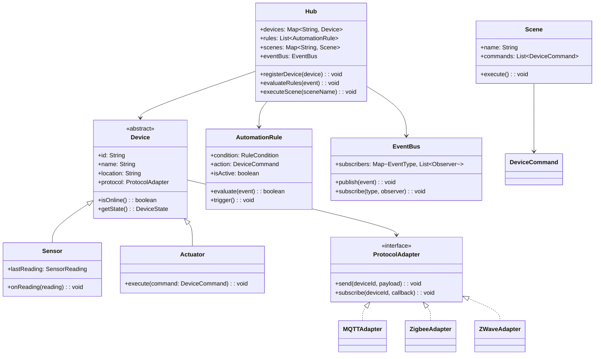

# Design an IoT Smart Home System (OOD)

**Difficulty**: 🟡 Intermediate
**Codemania**: #133
**Interview Frequency**: Medium

---

## Problem Statement

Model a smart home hub that registers heterogeneous IoT devices (thermostats, smart locks, sensors, lights), evaluates automation rules when devices fire events, and executes scenes (grouped device commands). The OOD challenge: new device types and communication protocols (MQTT, Zigbee, Z-Wave) must be pluggable without modifying the hub's rule engine. Factory + Strategy + Command + Observer cleanly separate these concerns.

---

## Functional Requirements

- Register and unregister IoT devices (thermostat, lock, light, sensor)
- Devices publish events (motion detected, temperature changed, door opened)
- Automation rules fire actions when event conditions match
- Scenes group multiple device commands into a single activation
- Support multiple communication protocols per device
- Conflict detection when two rules target the same device

---

## Core Entities

| Class | Responsibility |
|-------|---------------|
| `Hub` | Central controller: device registry, event bus, rule engine |
| `Device` | Abstract base: id, name, location, protocol adapter |
| `Sensor` | Read-only device: publishes events (motion, temp, humidity) |
| `Actuator` | Writable device: accepts commands (on/off, set temperature) |
| `Thermostat` | Dual-role: reads temperature, controls HVAC |
| `SmartLock` | Actuator with state: locked/unlocked + audit trail |
| `AutomationRule` | Condition → action mapping evaluated on every event |
| `Scene` | Named collection of device commands executed together |
| `EventBus` | Publish-subscribe channel for device events |
| `ProtocolAdapter` | Interface abstracting MQTT/Zigbee/Z-Wave communication |

---

## Class Diagram



---

## Design Patterns Used

### 1. Observer — Device Event → Rule Evaluation

**Why it fits**: When a motion sensor fires, multiple consumers react: the rule engine checks automation rules, the mobile app updates the UI, and the logging service records the event. Publishing through `EventBus` means the sensor never knows its subscribers — new consumers plug in without any device changes.

```
class EventBus:
  subscribers: Map<EventType, List<EventObserver>>

  publish(event: DeviceEvent): void
    handlers = subscribers.get(event.type) ?? []
    for handler in handlers:
      handler.onEvent(event)

  subscribe(type: EventType, observer: EventObserver): void
    subscribers.computeIfAbsent(type, () -> []).add(observer)

class RuleEngine implements EventObserver:
  rules: List<AutomationRule>

  onEvent(event: DeviceEvent): void
    hub.evaluateRules(event)
```

### 2. Strategy — Communication Protocols

**Why it fits**: A Zigbee bulb and an MQTT thermostat speak completely different protocols but both need `send()` and `subscribe()`. Injecting a `ProtocolAdapter` at device registration means adding a new protocol (Thread, Matter) requires only one new adapter class with zero hub changes.

```
interface ProtocolAdapter:
  send(deviceId: String, payload: Map): void
  subscribe(deviceId: String, callback: Function): void

class MQTTAdapter implements ProtocolAdapter:
  send(deviceId, payload):
    mqttClient.publish("home/" + deviceId, json(payload))

  subscribe(deviceId, callback):
    mqttClient.subscribe("home/" + deviceId + "/events", callback)

class ZigbeeAdapter implements ProtocolAdapter:
  send(deviceId, payload):
    zigbeeCoordinator.unicast(deviceId, payload)
```

### 3. Command — Automation Rules and Scenes

**Why it fits**: Automation rules and scenes are lists of operations to execute later — "turn off all lights at 11 PM" or "set thermostat to 68°F when everyone leaves". Wrapping each operation as a `DeviceCommand` (execute/undo) enables scenes, undo, and scheduled execution uniformly.

```
interface DeviceCommand:
  execute(): void
  undo(): void

class SetThermostatCommand implements DeviceCommand:
  thermostat: Thermostat
  targetTemp: float
  previousTemp: float

  execute():
    previousTemp = thermostat.getTemperature()
    thermostat.setTemperature(targetTemp)

  undo():
    thermostat.setTemperature(previousTemp)

class Scene:
  commands: List<DeviceCommand>

  execute(): void
    for cmd in commands:
      cmd.execute()
      executedCommands.push(cmd)

  undoAll(): void
    while not executedCommands.isEmpty():
      executedCommands.pop().undo()
```

### 4. Factory — Device Creation

**Why it fits**: Devices arrive as raw config payloads (`{ type: "thermostat", protocol: "mqtt", ... }`). The hub shouldn't contain `if type == "thermostat"` logic — that's the Factory's job. Adding a new device type means one new class and one new Factory branch.

```
class DeviceFactory:
  create(config: DeviceConfig): Device
    protocol = protocolAdapterFactory.create(config.protocol)
    switch config.type:
      case "thermostat":  return new Thermostat(config, protocol)
      case "smart_lock":  return new SmartLock(config, protocol)
      case "motion_sensor": return new MotionSensor(config, protocol)
      case "smart_light": return new SmartLight(config, protocol)
      default: throw UnknownDeviceTypeException(config.type)
```

---

## Key Method: `evaluateRules(event)`

```
Hub:
  evaluateRules(event: DeviceEvent): void
    // 1. Find rules that match this event's source device and type
    matchingRules = rules.filter(r ->
      r.isActive and r.condition.matches(event))

    // 2. Check for conflicts (two rules target the same device)
    targets = matchingRules.map(r -> r.action.targetDeviceId)
    conflicts = findDuplicates(targets)
    if not conflicts.isEmpty():
      conflictResolver.resolve(matchingRules, conflicts)
      return

    // 3. Execute each matching rule's action
    for rule in matchingRules:
      try:
        rule.trigger()
        auditLog.record(RuleExecutionEvent(rule, event))
      catch DeviceUnreachableException e:
        notificationService.alertOwner("Device offline: " + rule.action.targetDeviceId)
```

**Conflict resolution strategy**: When two rules target the same device (rule A says "lock front door" and rule B says "unlock front door"), the resolver applies priority ordering — higher-priority rules win, or the conflict is logged for manual resolution.

---

## Design Decisions & Trade-offs

| Decision | Option A | Option B | Choice |
|----------|----------|----------|--------|
| Rule evaluation | Local (hub evaluates) | Cloud (rules sent to server) | Local — rules still work when internet is down |
| Protocol abstraction | Adapter per protocol | Single protocol (MQTT) | Adapter per protocol — real devices use Zigbee/Z-Wave |
| Conflict resolution | Priority-based | First-rule-wins | Priority-based — user-configurable; deterministic |
| Scene undo | Support undo (stack of commands) | Fire-and-forget | Support undo — restoring pre-scene state is user-facing feature |

---

## Top Interview Questions

| Question | What It Tests |
|----------|--------------|
| How do you handle a rule that fires every second from a high-frequency sensor without overwhelming actuators? | Rate limiting, event debouncing |
| How would you add a new device type (e.g., robotic vacuum) without changing Hub or RuleEngine? | Factory extension, Open/Closed Principle |
| Two automation rules both target the thermostat — how do you detect and resolve the conflict? | Conflict detection, rule priority |

---

## Related Concepts

- [Social Media Platform OOD for event bus fan-out patterns](./social-media-platform)
- [Game State Management OOD for Command pattern with undo](./game-state-management)

---

## 📚 Resources & References

| Resource | Type | What You'll Learn |
|----------|------|------------------|
| [NeetCode OOD Playlist](https://www.youtube.com/@NeetCode) | 📺 YouTube | Command and Observer pattern walkthroughs |
| [ByteByteGo System Design](https://www.youtube.com/@ByteByteGo) | 📺 YouTube | IoT architecture and event-driven design |
| [Head First Design Patterns](https://www.oreilly.com/library/view/head-first-design/0596007124/) | 📖 Blog | Command, Strategy, and Factory chapters |
| [Clean Code — Robert Martin](https://www.amazon.com/Clean-Code-Handbook-Software-Craftsmanship/dp/0132350882) | 📚 Book | Clean OOP class design principles |
| [GoF Design Patterns](https://www.amazon.com/Design-Patterns-Elements-Reusable-Object-Oriented/dp/0201633612) | 📚 Book | Observer and Command pattern reference |
