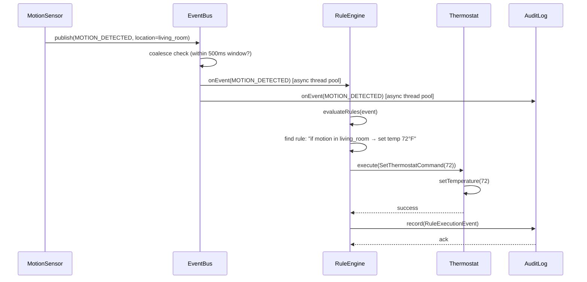

# Design an IoT Smart Home System (OOD)

**Difficulty**: 🟡 Intermediate
**Codemania**: #133
**Interview Frequency**: Medium

---

## Problem Statement

Model a smart home hub that registers heterogeneous IoT devices (thermostats, smart locks, sensors, lights), evaluates automation rules when devices fire events, and executes scenes (grouped device commands). The OOD challenge: new device types and communication protocols (MQTT, Zigbee, Z-Wave) must be pluggable without modifying the hub's rule engine. Factory + Strategy + Command + Observer cleanly separate these concerns.

---

## Functional Requirements

- Register and unregister IoT devices (thermostat, lock, light, sensor)
- Devices publish events (motion detected, temperature changed, door opened)
- Automation rules fire actions when event conditions match
- Scenes group multiple device commands into a single activation
- Support multiple communication protocols per device
- Conflict detection when two rules target the same device

---

## Core Entities

| Class | Responsibility |
|-------|---------------|
| `Hub` | Central controller: device registry, event bus, rule engine |
| `Device` | Abstract base: id, name, location, protocol adapter |
| `Sensor` | Read-only device: publishes events (motion, temp, humidity) |
| `Actuator` | Writable device: accepts commands (on/off, set temperature) |
| `Thermostat` | Dual-role: reads temperature, controls HVAC |
| `SmartLock` | Actuator with state: locked/unlocked + audit trail |
| `AutomationRule` | Condition → action mapping evaluated on every event |
| `Scene` | Named collection of device commands executed together |
| `EventBus` | Publish-subscribe channel for device events |
| `ProtocolAdapter` | Interface abstracting MQTT/Zigbee/Z-Wave communication |

---

## Class Diagram


---

## Design Patterns Used

### 1. Observer — Device Event → Rule Evaluation

**Why it fits**: When a motion sensor fires, multiple consumers react: the rule engine checks automation rules, the mobile app updates the UI, and the logging service records the event. Publishing through `EventBus` means the sensor never knows its subscribers — new consumers plug in without any device changes.

```
class EventBus:
  subscribers: Map<EventType, List<EventObserver>>

  publish(event: DeviceEvent): void
    handlers = subscribers.get(event.type) ?? []
    for handler in handlers:
      handler.onEvent(event)

  subscribe(type: EventType, observer: EventObserver): void
    subscribers.computeIfAbsent(type, () -> []).add(observer)

class RuleEngine implements EventObserver:
  rules: List<AutomationRule>

  onEvent(event: DeviceEvent): void
    hub.evaluateRules(event)
```

### 2. Strategy — Communication Protocols

**Why it fits**: A Zigbee bulb and an MQTT thermostat speak completely different protocols but both need `send()` and `subscribe()`. Injecting a `ProtocolAdapter` at device registration means adding a new protocol (Thread, Matter) requires only one new adapter class with zero hub changes.

```
interface ProtocolAdapter:
  send(deviceId: String, payload: Map): void
  subscribe(deviceId: String, callback: Function): void

class MQTTAdapter implements ProtocolAdapter:
  send(deviceId, payload):
    mqttClient.publish("home/" + deviceId, json(payload))

  subscribe(deviceId, callback):
    mqttClient.subscribe("home/" + deviceId + "/events", callback)

class ZigbeeAdapter implements ProtocolAdapter:
  send(deviceId, payload):
    zigbeeCoordinator.unicast(deviceId, payload)
```

### 3. Command — Automation Rules and Scenes

**Why it fits**: Automation rules and scenes are lists of operations to execute later — "turn off all lights at 11 PM" or "set thermostat to 68°F when everyone leaves". Wrapping each operation as a `DeviceCommand` (execute/undo) enables scenes, undo, and scheduled execution uniformly.

```
interface DeviceCommand:
  execute(): void
  undo(): void

class SetThermostatCommand implements DeviceCommand:
  thermostat: Thermostat
  targetTemp: float
  previousTemp: float

  execute():
    previousTemp = thermostat.getTemperature()
    thermostat.setTemperature(targetTemp)

  undo():
    thermostat.setTemperature(previousTemp)

class Scene:
  commands: List<DeviceCommand>

  execute(): void
    for cmd in commands:
      cmd.execute()
      executedCommands.push(cmd)

  undoAll(): void
    while not executedCommands.isEmpty():
      executedCommands.pop().undo()
```

### 4. Factory — Device Creation

**Why it fits**: Devices arrive as raw config payloads (`{ type: "thermostat", protocol: "mqtt", ... }`). The hub shouldn't contain `if type == "thermostat"` logic — that's the Factory's job. Adding a new device type means one new class and one new Factory branch.

```
class DeviceFactory:
  create(config: DeviceConfig): Device
    protocol = protocolAdapterFactory.create(config.protocol)
    switch config.type:
      case "thermostat":  return new Thermostat(config, protocol)
      case "smart_lock":  return new SmartLock(config, protocol)
      case "motion_sensor": return new MotionSensor(config, protocol)
      case "smart_light": return new SmartLight(config, protocol)
      default: throw UnknownDeviceTypeException(config.type)
```

---

## Key Method: `evaluateRules(event)`

```
Hub:
  evaluateRules(event: DeviceEvent): void
    // 1. Find rules that match this event's source device and type
    matchingRules = rules.filter(r ->
      r.isActive and r.condition.matches(event))

    // 2. Check for conflicts (two rules target the same device)
    targets = matchingRules.map(r -> r.action.targetDeviceId)
    conflicts = findDuplicates(targets)
    if not conflicts.isEmpty():
      conflictResolver.resolve(matchingRules, conflicts)
      return

    // 3. Execute each matching rule's action
    for rule in matchingRules:
      try:
        rule.trigger()
        auditLog.record(RuleExecutionEvent(rule, event))
      catch DeviceUnreachableException e:
        notificationService.alertOwner("Device offline: " + rule.action.targetDeviceId)
```

**Conflict resolution strategy**: When two rules target the same device (rule A says "lock front door" and rule B says "unlock front door"), the resolver applies priority ordering — higher-priority rules win, or the conflict is logged for manual resolution.

---

## Design Decisions & Trade-offs

| Decision | Option A | Option B | Choice |
|----------|----------|----------|--------|
| Rule evaluation | Local (hub evaluates) | Cloud (rules sent to server) | Local — rules still work when internet is down |
| Protocol abstraction | Adapter per protocol | Single protocol (MQTT) | Adapter per protocol — real devices use Zigbee/Z-Wave |
| Conflict resolution | Priority-based | First-rule-wins | Priority-based — user-configurable; deterministic |
| Scene undo | Support undo (stack of commands) | Fire-and-forget | Support undo — restoring pre-scene state is user-facing feature |

---

## Top Interview Questions

| Question | What It Tests |
|----------|--------------|
| How do you handle a rule that fires every second from a high-frequency sensor without overwhelming actuators? | Rate limiting, event debouncing |
| How would you add a new device type (e.g., robotic vacuum) without changing Hub or RuleEngine? | Factory extension, Open/Closed Principle |
| Two automation rules both target the thermostat — how do you detect and resolve the conflict? | Conflict detection, rule priority |

---

## Related Concepts

- [Social Media Platform OOD for event bus fan-out patterns](./social-media-platform)
- [Game State Management OOD for Command pattern with undo](./game-state-management)

---

## Class Design (Extended)

The diagram above captures the structural skeleton. Here is an extended class diagram showing the full type hierarchy, internal fields, and critical relationships between the rule engine, command stack, and device registry:

```mermaid
classDiagram
    class Hub {
        -devices: Map~String, Device~
        -rules: List~AutomationRule~
        -scenes: Map~String, Scene~
        -eventBus: EventBus
        -conflictResolver: ConflictResolver
        -auditLog: AuditLog
        +registerDevice(device: Device): void
        +unregisterDevice(deviceId: String): void
        +addRule(rule: AutomationRule): void
        +evaluateRules(event: DeviceEvent): void
        +executeScene(sceneName: String): void
        +undoScene(sceneName: String): void
    }

    class Device {
        <<abstract>>
        +id: String
        +name: String
        +location: String
        +protocol: ProtocolAdapter
        +status: DeviceStatus
        +lastSeen: Timestamp
        +isOnline(): boolean
        +getState(): DeviceState
        +connect(): void
        +disconnect(): void
    }

    class Sensor {
        +lastReading: SensorReading
        +readingInterval: Duration
        +onReading(reading: SensorReading): void
        +startPolling(): void
        +stopPolling(): void
    }

    class Actuator {
        +currentCommand: DeviceCommand
        +commandHistory: List~DeviceCommand~
        +execute(command: DeviceCommand): void
        +getLastCommand(): DeviceCommand
    }

    class Thermostat {
        +currentTemp: float
        +targetTemp: float
        +mode: ThermostatMode
        +setTemperature(temp: float): void
        +getTemperature(): float
        +setMode(mode: ThermostatMode): void
    }

    class SmartLock {
        +lockState: LockState
        +accessLog: List~AccessEntry~
        +pin: String
        +lock(): void
        +unlock(credential: Credential): void
        +getAuditTrail(): List~AccessEntry~
    }

    class SmartLight {
        +brightness: int
        +colorTemp: int
        +isOn: boolean
        +turnOn(): void
        +turnOff(): void
        +setBrightness(level: int): void
        +setColorTemp(kelvin: int): void
    }

    class MotionSensor {
        +lastMotionAt: Timestamp
        +sensitivityLevel: int
        +onMotionDetected(): void
        +onMotionCleared(): void
    }

    class AutomationRule {
        +id: String
        +name: String
        +priority: int
        +condition: RuleCondition
        +action: DeviceCommand
        +isActive: boolean
        +cooldownPeriod: Duration
        +lastTriggeredAt: Timestamp
        +evaluate(event: DeviceEvent): boolean
        +trigger(): void
        +canTrigger(): boolean
    }

    class RuleCondition {
        <<interface>>
        +matches(event: DeviceEvent): boolean
    }

    class CompositeCondition {
        +conditions: List~RuleCondition~
        +operator: LogicOperator
        +matches(event: DeviceEvent): boolean
    }

    class DeviceCommand {
        <<interface>>
        +targetDeviceId: String
        +execute(): void
        +undo(): void
    }

    class Scene {
        +name: String
        +commands: List~DeviceCommand~
        +executedStack: Stack~DeviceCommand~
        +execute(): void
        +undoAll(): void
        +addCommand(cmd: DeviceCommand): void
    }

    class EventBus {
        -subscribers: Map~EventType, List~EventObserver~~
        +publish(event: DeviceEvent): void
        +subscribe(type: EventType, observer: EventObserver): void
        +unsubscribe(type: EventType, observer: EventObserver): void
    }

    class ProtocolAdapter {
        <<interface>>
        +send(deviceId: String, payload: Map): void
        +subscribe(deviceId: String, callback: Function): void
        +disconnect(): void
    }

    class DeviceFactory {
        -protocolFactory: ProtocolAdapterFactory
        +create(config: DeviceConfig): Device
    }

    class ConflictResolver {
        +resolve(rules: List~AutomationRule~, conflicts: List~String~): List~AutomationRule~
    }

    Hub --> Device
    Hub --> AutomationRule
    Hub --> EventBus
    Hub --> ConflictResolver
    Device <|-- Sensor
    Device <|-- Actuator
    Sensor <|-- MotionSensor
    Actuator <|-- Thermostat
    Actuator <|-- SmartLock
    Actuator <|-- SmartLight
    Device --> ProtocolAdapter
    AutomationRule --> RuleCondition
    AutomationRule --> DeviceCommand
    RuleCondition <|.. CompositeCondition
    Scene --> DeviceCommand
    ProtocolAdapter <|.. MQTTAdapter
    ProtocolAdapter <|.. ZigbeeAdapter
    ProtocolAdapter <|.. ZWaveAdapter
    DeviceFactory --> Device
```



---

## Component Deep Dive 1: EventBus — The Heart of Device Coordination

The `EventBus` is the single most critical architectural component in this design. Every sensor reading, every lock state change, every motion event flows through it. If the EventBus blocks, batches incorrectly, or loses events, the entire home automation breaks silently.

### How It Works Internally

The EventBus implements a typed publish-subscribe model. Subscribers register interest in specific `EventType` values (MOTION_DETECTED, TEMPERATURE_CHANGED, DOOR_OPENED, etc.). When a sensor fires, it calls `eventBus.publish(event)`, which synchronously fans out to all registered handlers for that event type.

The naive implementation processes every event in the calling thread. This works at 10 devices but fails badly at 200 devices. Consider: a motion sensor at 10 Hz sends 10 events/second. With 5 automation rules and 3 observers each (RuleEngine + MobileApp + Logger), one sensor generates 150 handler invocations per second. If any handler blocks (network call to notify mobile app, slow rule evaluation), the sensor's next reading is delayed or dropped.

### Why Naive Approaches Fail at Scale

**Synchronous fan-out**: If the mobile push notification takes 200ms, the EventBus is blocked for 200ms. During that window, a smoke detector's FIRE event is queued. This is a safety failure.

**No event typing**: Some systems use a single `onEvent(event)` callback on all subscribers and let the subscriber filter. This means a temperature subscriber wakes up on every motion event just to discard it — O(n) wasted work where n is total event volume.

**No backpressure**: High-frequency sensors (temperature sensors polling every 100ms) can flood slow consumers. Without rate-limiting or event coalescing, the rule engine queue grows unbounded.

### Production-Grade EventBus Design

The fix: dispatch each event type to a separate thread pool, and coalesce rapid duplicate events (same device, same type, within 500ms window) before fan-out. Safety-critical events (FIRE, INTRUSION) bypass coalescing and get their own high-priority queue.

```
class EventBus:
  executors: Map<EventType, ExecutorService>
  coalescer: EventCoalescer
  priorityQueue: BlockingQueue<DeviceEvent>  // for FIRE, INTRUSION

  publish(event: DeviceEvent):
    if event.type.isCritical():
      priorityQueue.offer(event)             // wake priority thread immediately
      return

    coalesced = coalescer.maybeCoalesce(event)
    if coalesced is None:
      return                                 // suppressed — too soon after last event

    executor = executors.getOrCreate(event.type, Executors.newFixedThreadPool(2))
    executor.submit(() ->
      for handler in subscribers.get(event.type):
        try:
          handler.onEvent(coalesced)
        catch Exception e:
          deadLetterQueue.record(coalesced, e)
    )
```

### Sequence: Motion Sensor Triggers Rule



### EventBus Implementation Options

| Approach | Latency | Throughput | Trade-off |
|----------|---------|------------|-----------|
| Synchronous fan-out (naive) | 1-200ms (handler-dependent) | ~50 events/sec | Simple; one slow handler blocks all; unsafe for safety events |
| Thread-pool per event type | 1-5ms per handler | ~5,000 events/sec | Isolation between types; higher thread count; recommended for hubs with 50-200 devices |
| Async + message queue (Redis/Kafka) | 5-50ms | 500,000 events/sec | Handles 10,000+ device deployments; adds operational complexity; overkill for home use |

---

## Component Deep Dive 2: AutomationRule and the Rule Engine

The rule engine is the brain of the hub. Every incoming event is evaluated against every active rule. At 10 rules and 10 events/second, that's 100 evaluations per second — trivial. At 1,000 rules and 50 devices each generating 5 events/second, that's 250,000 evaluations per second, and naive linear scan breaks.

### Internal Mechanics

Each `AutomationRule` holds:
- A `RuleCondition` (evaluates to boolean given an event)
- A `DeviceCommand` (what to execute when condition is true)
- A `cooldownPeriod` (prevents re-triggering within N seconds)
- A `priority` (used in conflict resolution)

`RuleCondition` is the Strategy pattern. A `TemperatureThresholdCondition` checks `event.value > threshold`. A `CompositeCondition` ANDs or ORs multiple conditions. A `TimeWindowCondition` only matches between 10 PM and 6 AM. This is Open/Closed: new condition types extend the system without modifying existing rules.

### Scale Behavior at 10x Load

A typical home has 20-50 devices and 50-100 rules. At 10x (500 rules, 500 devices), linear scan of all rules per event becomes the bottleneck. The fix: maintain an index from `(deviceId, eventType)` → `List<AutomationRule>`. When a motion sensor fires, look up only rules that subscribe to that sensor's MOTION events instead of scanning all 500 rules.

```
class RuleEngine:
  ruleIndex: Map<Pair<DeviceId, EventType>, List<AutomationRule>>

  addRule(rule: AutomationRule):
    key = Pair(rule.condition.sourceDeviceId, rule.condition.eventType)
    ruleIndex.computeIfAbsent(key, () -> []).add(rule)

  onEvent(event: DeviceEvent):
    key = Pair(event.deviceId, event.type)
    candidates = ruleIndex.getOrDefault(key, [])
    matchingRules = candidates.filter(r ->
      r.isActive and r.canTrigger() and r.condition.matches(event))
    // conflict detection + execution follows
```

### Rule Engine Options

| Approach | Rules at 1ms eval | Memory | Trade-off |
|----------|------------------|--------|-----------|
| Linear scan all rules | ~500 rules | O(n) | Simple; acceptable at <100 rules; degrades linearly |
| Index by (deviceId, eventType) | ~50,000 rules | O(n + k) | Fast lookup; requires index maintenance on add/remove |
| Compiled rule predicates (bytecode) | ~500,000 rules | High | Production rule engines (Drools); significant complexity |

---

## Component Deep Dive 3: ProtocolAdapter — Handling Heterogeneous Hardware

Smart home devices speak different protocols: MQTT over WiFi, Zigbee (IEEE 802.15.4 mesh), Z-Wave (sub-GHz mesh), and the newer Matter/Thread standard. Each has different addressing, message formats, acknowledgement semantics, and failure modes.

### Technical Decisions

MQTT devices need a broker (Mosquitto or AWS IoT Core) — the adapter connects to the broker, not the device directly. Zigbee devices need a coordinator dongle (USB stick with CC2531 or similar chipset) plugged into the hub. Z-Wave requires a separate controller chip. Matter/Thread devices can join a Thread Border Router.

The `ProtocolAdapter` interface hides all of this. Each adapter manages its own connection lifecycle:

```
class ZigbeeAdapter implements ProtocolAdapter:
  coordinator: ZigbeeCoordinator
  deviceNetworkMap: Map<String, ShortAddress>  // IEEE addr → network short addr

  send(deviceId: String, payload: Map): void
    shortAddr = deviceNetworkMap.get(deviceId)
    if shortAddr is None:
      throw DeviceNotJoinedException(deviceId)
    frame = ZigbeeFrame.build(shortAddr, payload)
    coordinator.transmit(frame)
    // Zigbee is ACK-based; coordinator handles retries up to 3x

  subscribe(deviceId: String, callback: Function): void
    coordinator.registerCallback(deviceId, callback)
    // Callback fires when coordinator receives an attribute report
```

### Failure Modes

Zigbee/Z-Wave are mesh networks — devices relay messages for each other. If a mains-powered relay device goes offline, battery-powered sensors behind it lose routing. The adapter must detect `DEVICE_UNREACHABLE` within 30 seconds (not 5 minutes like naive polling) and notify the hub. The hub then raises a `DeviceOfflineEvent` which the rule engine uses to suppress rules targeting that device.

---

## SOLID Principles Demonstrated

### Single Responsibility Principle

Each class has one reason to change:
- `EventBus` changes only if the pub-sub mechanism changes (never because of new device types)
- `DeviceFactory` changes only when new device types are added
- `ConflictResolver` changes only when the conflict resolution strategy changes
- `SmartLock` changes only when lock hardware behavior changes

A common violation to avoid: putting rule evaluation logic inside `Hub`. That would mean `Hub` changes both when the registry changes and when rule semantics change.

### Open/Closed Principle

Adding a **new device type** (robotic vacuum, smart sprinkler): create one new class extending `Device`, add one branch to `DeviceFactory`. Zero changes to `Hub`, `RuleEngine`, or `EventBus`.

Adding a **new protocol** (Matter/Thread): implement `ProtocolAdapter`. Zero changes to any device class.

Adding a **new condition type** (SunsetCondition, WeatherCondition): implement `RuleCondition`. Zero changes to `AutomationRule`.

### Liskov Substitution Principle

Any `Device` subclass can be registered with the hub. Any `ProtocolAdapter` implementation can be injected into any device. A `Thermostat` used where `Actuator` is expected will behave correctly (it extends `Actuator`).

### Interface Segregation Principle

`Sensor` and `Actuator` are separated. A `MotionSensor` doesn't implement `execute(command)` — it has no business accepting commands. Forcing all devices into one `Device` interface with both `read()` and `write()` methods would force sensors to implement no-op `write()` methods, violating ISP.

### Dependency Inversion Principle

`Hub` depends on the `ProtocolAdapter` interface, not on `MQTTAdapter`. `AutomationRule` depends on the `RuleCondition` interface, not on `TemperatureThresholdCondition`. All high-level modules depend on abstractions; concrete implementations are injected at construction time via `DeviceFactory`.

---

## Concurrency and Thread Safety

### Concurrent Operations in the Hub

The hub faces true concurrency from the moment it's running:

1. **Multiple protocol adapters fire callbacks simultaneously** — a Zigbee motion event and an MQTT temperature event can arrive on different threads within milliseconds.
2. **The rule engine reads `rules` while an admin call adds a new rule** — classic read-write race.
3. **Two automation rules both call `thermostat.setTemperature()`** — last-write-wins without synchronization, leaving the thermostat in an undefined state.

### Making the Hub Thread-Safe

```
class Hub:
  devices: ConcurrentHashMap<String, Device>     // thread-safe read/write
  rules: CopyOnWriteArrayList<AutomationRule>    // safe iteration during write
  scenes: ConcurrentHashMap<String, Scene>

  registerDevice(device: Device): void
    devices.put(device.id, device)               // atomic, no lock needed

  evaluateRules(event: DeviceEvent): void
    // CopyOnWriteArrayList snapshot prevents ConcurrentModificationException
    // while admin adds a new rule mid-evaluation
    for rule in rules:                            // iterates snapshot
      if rule.evaluate(event):
        rule.trigger()
```

For the `AutomationRule` cooldown check (`canTrigger()`), use `AtomicReference<Timestamp>` for `lastTriggeredAt` to avoid a race where two concurrent events both pass the cooldown check and both execute:

```
class AutomationRule:
  lastTriggeredAt: AtomicReference<Timestamp>

  canTrigger(): boolean
    last = lastTriggeredAt.get()
    now = Timestamp.now()
    return last is None or now.minus(last) >= cooldownPeriod

  trigger():
    // Compare-and-set ensures only one thread wins the cooldown race
    now = Timestamp.now()
    if lastTriggeredAt.compareAndSet(expected=last, update=now):
      action.execute()
```

For device state (`SmartLock.lockState`), mark state fields `volatile` for visibility, or use `synchronized` on the lock/unlock methods to serialize concurrent credential checks.

---

## Extension Points

### Adding a New Device Type: Smart Sprinkler

1. Create `SmartSprinkler extends Actuator` with `startWatering(zone, durationMinutes)` and `stopWatering(zone)`.
2. Create `StartWateringCommand implements DeviceCommand` wrapping those calls.
3. Add `case "smart_sprinkler": return new SmartSprinkler(config, protocol)` to `DeviceFactory`.
4. Define a `RuleCondition` like `SoilMoistureThresholdCondition` that matches sensor readings.

Zero changes to `Hub`, `RuleEngine`, `EventBus`, or any existing device class. This is exactly what Open/Closed requires.

### Adding a New Protocol: Matter/Thread

1. Implement `MatterAdapter implements ProtocolAdapter` using the Matter SDK's commissioner API.
2. Add `case "matter": return new MatterAdapter(config)` to `ProtocolAdapterFactory`.

Zero changes to device classes or the hub. The new protocol is available to any device that declares `protocol: "matter"` in its config.

### Adding a New Condition: Sunrise/Sunset

1. Implement `SolarEventCondition implements RuleCondition` that calls a solar position library with GPS coordinates.
2. Use in rule: `new AutomationRule(new SolarEventCondition(SUNSET), new TurnOnLightsCommand(...))`.

Zero changes to `AutomationRule` or `RuleEngine`. The rule engine calls `condition.matches(event)` — it doesn't care what's inside.

---

## Data Model

The hub persists device registry, rules, scenes, and audit logs. A relational schema fits well here — rules have clear foreign keys, audit logs need indexed queries, and conflict detection requires joining rule targets.

```sql
-- Device registry
CREATE TABLE devices (
    id            VARCHAR(36) PRIMARY KEY,  -- UUID
    name          VARCHAR(100) NOT NULL,
    location      VARCHAR(100) NOT NULL,
    device_type   VARCHAR(50) NOT NULL,     -- 'thermostat', 'smart_lock', 'motion_sensor'
    protocol      VARCHAR(20) NOT NULL,     -- 'mqtt', 'zigbee', 'zwave', 'matter'
    status        VARCHAR(20) DEFAULT 'online', -- 'online', 'offline', 'pairing'
    config_json   JSONB,                    -- protocol-specific config (broker URL, device EUI, etc.)
    last_seen     TIMESTAMPTZ DEFAULT NOW(),
    registered_at TIMESTAMPTZ DEFAULT NOW()
);

-- Device state snapshots (latest value per device)
CREATE TABLE device_states (
    device_id     VARCHAR(36) PRIMARY KEY REFERENCES devices(id),
    state_json    JSONB NOT NULL,            -- {"temperature": 72.4, "mode": "cool"}
    updated_at    TIMESTAMPTZ DEFAULT NOW()
);

-- Automation rules
CREATE TABLE automation_rules (
    id              VARCHAR(36) PRIMARY KEY,
    name            VARCHAR(100) NOT NULL,
    priority        INT DEFAULT 100,
    is_active       BOOLEAN DEFAULT TRUE,
    condition_json  JSONB NOT NULL,          -- {"type": "temperature_threshold", "deviceId": "...", "operator": ">", "value": 85}
    action_json     JSONB NOT NULL,          -- {"type": "set_thermostat", "targetDeviceId": "...", "temperature": 72}
    source_device_id VARCHAR(36) REFERENCES devices(id),  -- for index
    event_type      VARCHAR(50) NOT NULL,                 -- for index
    cooldown_seconds INT DEFAULT 300,
    last_triggered_at TIMESTAMPTZ,
    created_at      TIMESTAMPTZ DEFAULT NOW()
);

-- Index for O(1) rule lookup by device+event
CREATE INDEX idx_rules_source_event
    ON automation_rules(source_device_id, event_type)
    WHERE is_active = TRUE;

-- Scenes
CREATE TABLE scenes (
    id         VARCHAR(36) PRIMARY KEY,
    name       VARCHAR(100) UNIQUE NOT NULL,
    created_at TIMESTAMPTZ DEFAULT NOW()
);

CREATE TABLE scene_commands (
    id              VARCHAR(36) PRIMARY KEY,
    scene_id        VARCHAR(36) REFERENCES scenes(id) ON DELETE CASCADE,
    execution_order INT NOT NULL,
    command_json    JSONB NOT NULL,   -- {"type": "turn_on_light", "targetDeviceId": "...", "brightness": 80}
    target_device_id VARCHAR(36) REFERENCES devices(id)
);

-- Audit log (append-only, partitioned by month)
CREATE TABLE audit_log (
    id          BIGSERIAL,
    event_time  TIMESTAMPTZ NOT NULL DEFAULT NOW(),
    event_type  VARCHAR(50) NOT NULL,        -- 'RULE_TRIGGERED', 'SCENE_EXECUTED', 'DEVICE_OFFLINE'
    device_id   VARCHAR(36) REFERENCES devices(id),
    rule_id     VARCHAR(36) REFERENCES automation_rules(id),
    scene_id    VARCHAR(36) REFERENCES scenes(id),
    details_json JSONB,                      -- {"prevTemp": 68, "newTemp": 72, "triggeredBy": "motion_sensor_01"}
    PRIMARY KEY (id, event_time)
) PARTITION BY RANGE (event_time);

-- Smart lock access log
CREATE TABLE lock_access_log (
    id          BIGSERIAL PRIMARY KEY,
    device_id   VARCHAR(36) REFERENCES devices(id),
    access_time TIMESTAMPTZ DEFAULT NOW(),
    action      VARCHAR(20) NOT NULL,        -- 'LOCK', 'UNLOCK'
    credential_type VARCHAR(30),             -- 'PIN', 'APP', 'AUTO_RULE', 'KEY_FOB'
    success     BOOLEAN NOT NULL,
    user_id     VARCHAR(36)
);

CREATE INDEX idx_lock_access_device_time
    ON lock_access_log(device_id, access_time DESC);
```

---

## Scale Bottlenecks

| Traffic Level | Component That Breaks | Symptoms | Mitigation |
|---------------|----------------------|----------|------------|
| 10x baseline (500 devices, 500 rules) | Rule engine linear scan | Rule evaluation >10ms per event; automation delays | Index rules by (sourceDeviceId, eventType); reduces scan from O(500) to O(5) |
| 10x baseline | EventBus synchronous fan-out | Motion events queue up behind slow mobile push notification | Thread-pool per event type; isolate safety-critical events to priority queue |
| 100x baseline (5,000 devices — commercial building) | Single Hub process (in-memory registry) | OOM crash; no HA; single point of failure | Extract Hub to a distributed service; use Redis for device state; replicated rule engine |
| 100x baseline | SQLite audit log (if used in-process) | Write contention; slow queries on 1M+ audit records | Switch to PostgreSQL with monthly partitioned audit_log table; add async write buffer |
| 1000x baseline (50,000 devices — smart campus) | ProtocolAdapter per process | Zigbee coordinator saturates at ~200 devices per dongle; Z-Wave at ~232 nodes | Multiple coordinator hubs with protocol gateways; horizontal sharding by building/floor; MQTT broker cluster |
| 1000x baseline | EventBus in single JVM | >100k events/sec overwhelms in-process queues | Replace EventBus with Apache Kafka; each device publishes to topic `home.events.<deviceType>`; consumers are separate services |

---

## How Amazon Built This: AWS IoT Smart Home (Alexa Smart Home)

Amazon's Alexa Smart Home backend is the closest public reference to this OOD problem at production scale. Amazon processes over **1 billion IoT device interactions per day** across more than **100 million devices** in the Alexa ecosystem.

### Technology Choices

Amazon uses **AWS IoT Core** as the MQTT broker for device connectivity. Each device gets a **Device Shadow** — a JSON document storing the device's last known state and desired state. This is the production equivalent of the `DeviceState` and `device_states` table in this design, but distributed across AWS's global fleet.

The rule engine equivalent is **AWS IoT Rules Engine**, which evaluates SQL-like rules against every MQTT message. Amazon specifically chose SQL syntax (not a custom DSL) because it was familiar to their operations team and could be parsed and indexed efficiently. Rules are indexed by topic pattern — identical to the `(sourceDeviceId, eventType)` index described above.

### Specific Numbers

- Device Shadow updates: **500,000 state updates/second** globally across all users
- Rule evaluation latency: **<10ms P99** for simple rules; up to 50ms for rules with Lambda action invocations
- MQTT connection scale: **100 million concurrent device connections** across AWS IoT Core fleet
- Message throughput: **Hundreds of millions of messages per second** across the fleet

### Non-Obvious Architectural Decision

Amazon separated the **connection plane** (MQTT broker, device identity) from the **logic plane** (rule evaluation, skill invocation). This means the Alexa Rules Engine can be updated, redeployed, or scaled independently without dropping device connections. In the OOD design, this maps to separating `ProtocolAdapter` (connection plane) from `RuleEngine` (logic plane) — exactly the separation the Strategy pattern enforces.

The Device Shadow pattern also solves the problem of actuators being offline. When you command "turn off the lights" and the light is offline, AWS writes the desired state to the Shadow. When the device reconnects, it reads its Shadow and applies the pending command. This is the production answer to the `DeviceUnreachableException` handler in `evaluateRules()`.

Source: [AWS IoT Core documentation](https://docs.aws.amazon.com/iot/latest/developerguide/what-is-aws-iot.html), [AWS re:Invent 2019 — Alexa Smart Home Architecture](https://www.youtube.com/watch?v=iFBnMRBCXMo).

---

## Interview Angle

**What the interviewer is testing:** Can the candidate identify the right design patterns for extensibility (Factory, Strategy, Observer), apply SOLID correctly, and reason about concurrency — not just draw a class diagram?

**Common mistakes candidates make:**

1. **Skipping the EventBus entirely and having rules poll device state every second.** This is fundamentally wrong — polling is O(devices × rules) per tick, misses rapid events, and introduces latency proportional to polling interval. Events must be push-based.

2. **Using a single monolithic `Device` class with `if deviceType == "thermostat"` branches.** This violates OCP and means every new device type requires modifying the existing class. The Factory + subclass hierarchy is the correct answer, and you should explicitly name which SOLID principle it satisfies.

3. **Ignoring cooldown/debounce on rules.** Candidates describe the `AutomationRule.evaluate()` method but forget that a motion sensor at 10 Hz would trigger the "turn on the lights" rule 10 times per second without a cooldown. The interviewer will probe this if you don't raise it first — raising it yourself signals production awareness.

**The insight that separates good from great answers:** Recognizing that `DeviceCommand.undo()` is not just a nice-to-have — it's architecturally critical for Scene correctness. If `executeScene("good_night")` sets the thermostat to 65°F and turns off all lights, and then the user immediately triggers `executeScene("movie_night")`, they need to be able to undo "good_night" first to avoid the thermostat being in an unknown state. The Command pattern with an undo stack is the mechanism that makes scenes composable and reversible. Candidates who only see Command as "encapsulate a function call" miss this; candidates who see it as "reversible operation with pre/post state" demonstrate senior-level OOD thinking.

---

## Key Numbers to Remember

| Metric | Value | Context |
|--------|-------|---------|
| EventBus synchronous fan-out limit | ~50 events/sec | Before slow handlers cause sensor event drops |
| Thread-pool EventBus throughput | ~5,000 events/sec | With 2 threads per event type; suitable for 200-device home hub |
| Rule index lookup | O(1) amortized | With (deviceId, eventType) index vs O(n) linear scan |
| Zigbee devices per coordinator | ~200 devices max | Physical limit of Zigbee mesh coordinator chip |
| Z-Wave nodes per network | 232 nodes max | Protocol-level hard limit |
| AWS IoT Core device connections | 100 million concurrent | Production scale for Amazon Alexa Smart Home |
| AWS IoT shadow updates | 500,000/sec | Across global AWS IoT fleet |
| Rule evaluation latency | <10ms P99 | Simple conditional rules on AWS IoT Rules Engine |
| Thermostat cooldown recommendation | 300 seconds (5 min) | Prevents HVAC short-cycling from high-frequency temp sensor |
| Scene undo stack depth | Bounded at 100 commands | Prevent memory growth; oldest undos are discarded |

---

## 📚 Resources & References

| Resource | Type | What You'll Learn |
|----------|------|------------------|
| [NeetCode OOD Playlist](https://www.youtube.com/@NeetCode) | 📺 YouTube | Command and Observer pattern walkthroughs |
| [ByteByteGo System Design](https://www.youtube.com/@ByteByteGo) | 📺 YouTube | IoT architecture and event-driven design |
| [Head First Design Patterns](https://www.oreilly.com/library/view/head-first-design/0596007124/) | 📖 Blog | Command, Strategy, and Factory chapters |
| [Clean Code — Robert Martin](https://www.amazon.com/Clean-Code-Handbook-Software-Craftsmanship/dp/0132350882) | 📚 Book | Clean OOP class design principles |
| [GoF Design Patterns](https://www.amazon.com/Design-Patterns-Elements-Reusable-Object-Oriented/dp/0201633612) | 📚 Book | Observer and Command pattern reference |
