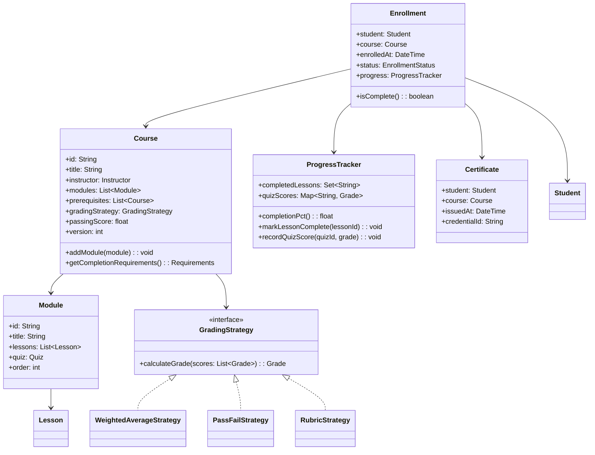
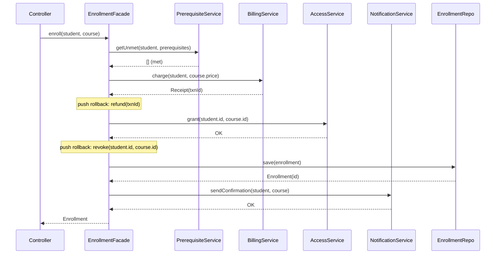
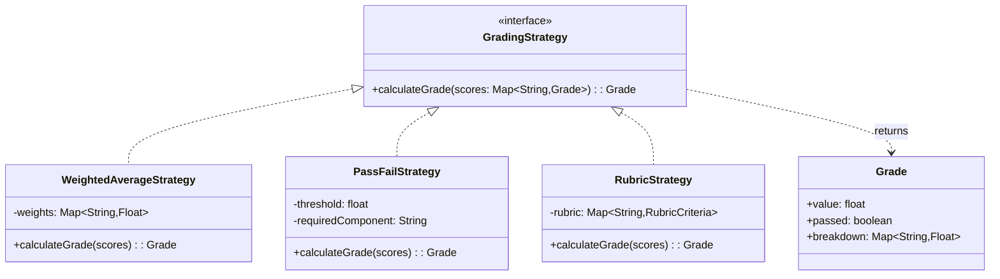
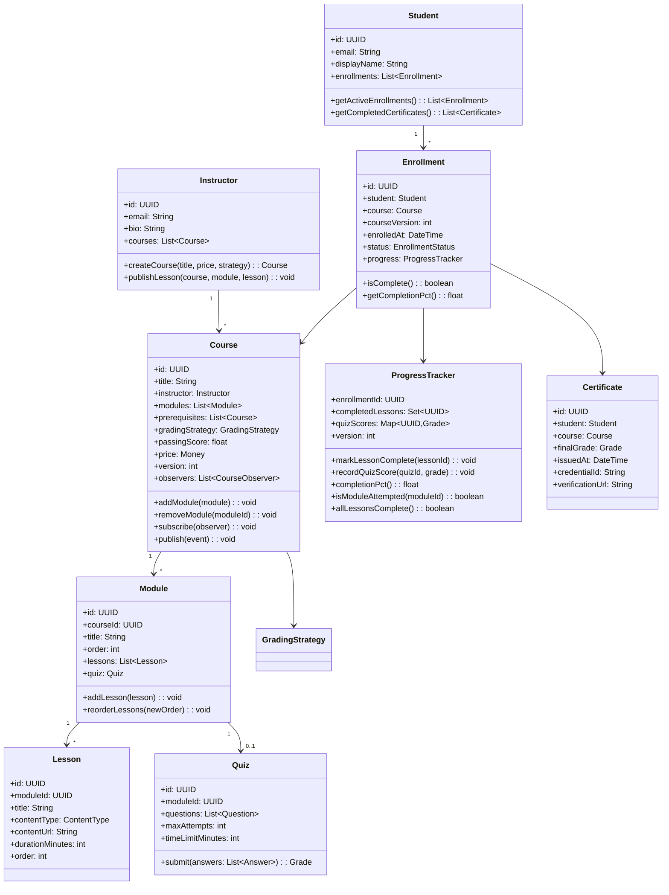

# Design a Learning Management System (OOD)

**Difficulty**: 🟡 Intermediate
**Codemania**: #130
**Interview Frequency**: Medium

---

## Problem Statement

Model an LMS where students enroll in courses, progress through modules and lessons, take quizzes, and receive certificates on completion. The OOD challenge: enrollment is a multi-step process (prerequisite check → billing → access grant → notify student), and grading strategies vary by course (rubric-based, percentage, pass/fail). Encoding this cleanly without a monolithic `EnrollmentManager` god class requires Facade + Strategy + Template Method.

---

## Functional Requirements

- Students enroll in courses (with prerequisite enforcement)
- Courses contain ordered modules; modules contain lessons
- Students take quizzes with automatic grading
- Progress tracker records lesson completion and quiz scores
- Certificates issued when all modules completed and final grade ≥ passing threshold
- Instructors can update course content; enrolled students see versioned content

---

## Core Entities

| Class | Responsibility |
|-------|---------------|
| `Course` | Top-level learning unit: title, instructor, modules, prerequisites |
| `Module` | Ordered group of lessons within a course |
| `Lesson` | Single piece of content: video, article, or interactive exercise |
| `Student` | Profile, enrolled courses, progress records |
| `Instructor` | Creates and updates course content |
| `Enrollment` | Join between student + course: date, status, progress ref |
| `Quiz` | Set of questions; associated with a lesson or module |
| `Grade` | Student's score on a quiz or course overall |
| `Certificate` | Issued on course completion; contains student + course + date |
| `ProgressTracker` | Tracks which lessons are done, current score, completion % |

---

## Class Diagram



---

## Design Patterns Used

### 1. Facade — Enrollment Process

**Why it fits**: Enrolling a student involves 4+ subsystems: prerequisite validation, billing, content access provisioning, and notification. Without a Facade, the controller layer must orchestrate all subsystems and breaks whenever a step is added. `EnrollmentFacade` provides a single `enroll(student, course)` method hiding all complexity.

```
class EnrollmentFacade:
  prerequisiteService: PrerequisiteService
  billingService: BillingService
  accessService: ContentAccessService
  notificationService: NotificationService
  enrollmentRepo: EnrollmentRepository

  enroll(student: Student, course: Course): Enrollment
    // Step 1: Check prerequisites
    unmet = prerequisiteService.getUnmet(student, course.prerequisites)
    if not unmet.isEmpty():
      throw PrerequisiteNotMetException(unmet)

    // Step 2: Process payment
    receipt = billingService.charge(student, course.price)

    // Step 3: Grant content access
    accessService.grant(student.id, course.id)

    // Step 4: Create enrollment record
    enrollment = new Enrollment(student, course, now())
    enrollmentRepo.save(enrollment)

    // Step 5: Notify student
    notificationService.sendEnrollmentConfirmation(student, course)

    return enrollment
```

### 2. Strategy — Grading Rubrics

**Why it fits**: A programming course grades with a weighted average (quizzes 30%, project 70%); a certification course uses pass/fail on a final exam; a skills course uses instructor rubric scoring. Each is a different algorithm injected into `Course` at creation time.

```
interface GradingStrategy:
  calculateGrade(scores: Map<String, Grade>): Grade

WeightedAverageStrategy(weights: Map<String, float>):
  calculateGrade(scores):
    total = 0
    for (componentId, weight) in weights:
      total += scores[componentId].value * weight
    return Grade(total)

PassFailStrategy(threshold: float):
  calculateGrade(scores):
    finalScore = scores["final_exam"].value
    return Grade(finalScore, passed = finalScore >= threshold)
```

### 3. Template Method — Course Completion Flow

**Why it fits**: Every course completion follows the same steps: check all lessons done → calculate final grade → decide pass/fail → issue certificate (if passed). But the grading step varies. Template Method pins the algorithm in the base class while delegating the grade calculation hook.

```
abstract class CompletionProcessor:
  process(enrollment: Enrollment): CompletionResult
    // Step 1: Verify all modules complete
    if not enrollment.progress.allLessonsComplete():
      return CompletionResult.incomplete("Lessons remaining")

    // Step 2: Calculate final grade (delegated to subclass/strategy)
    grade = calculateFinalGrade(enrollment)

    // Step 3: Check passing threshold
    if grade.value < enrollment.course.passingScore:
      return CompletionResult.failed(grade)

    // Step 4: Issue certificate
    cert = issueCertificate(enrollment, grade)
    return CompletionResult.passed(cert)

  abstract calculateFinalGrade(enrollment): Grade

  issueCertificate(enrollment, grade): Certificate
    cert = new Certificate(enrollment.student, enrollment.course, now())
    certRepo.save(cert)
    notifier.send(CertificateIssuedEvent(cert))
    return cert
```

### 4. Observer — New Content Notification

**Why it fits**: When an instructor adds a new lesson, all enrolled students should be notified. The `Course` shouldn't know about email or push notifications. Observer pattern lets `Course` publish a `ContentUpdatedEvent` and let subscribers decide what to do.

```
class Course:
  observers: List<CourseObserver>

  addLesson(module: Module, lesson: Lesson):
    module.addLesson(lesson)
    version++
    publish(ContentUpdatedEvent(this, lesson))

  publish(event): void
    for obs in observers: obs.onEvent(event)

class EnrolledStudentNotifier implements CourseObserver:
  onEvent(event: ContentUpdatedEvent):
    enrollments = enrollmentRepo.findByCourse(event.course)
    for e in enrollments:
      notificationService.send(e.student, "New lesson: " + event.lesson.title)
```

---

## Key Method: `issueCompletion(enrollment)`

```
CompletionService:
  issueCompletion(enrollment: Enrollment): CompletionResult
    course = enrollment.course
    progress = enrollment.progress

    // 1. Check all modules have been touched
    for module in course.modules:
      if not progress.isModuleAttempted(module.id):
        return CompletionResult.incomplete("Module not started: " + module.title)

    // 2. Collect all scored components
    scores = {}
    for module in course.modules:
      if module.quiz != null:
        grade = progress.quizScores.get(module.quiz.id)
        if grade == null:
          return CompletionResult.incomplete("Quiz not taken: " + module.quiz.title)
        scores[module.quiz.id] = grade

    // 3. Run grading strategy
    finalGrade = course.gradingStrategy.calculateGrade(scores)

    // 4. Determine pass/fail
    if finalGrade.value < course.passingScore:
      return CompletionResult.failed(finalGrade)

    // 5. Issue and persist certificate
    cert = new Certificate(enrollment.student, course, now(), generateCredentialId())
    certRepo.save(cert)
    enrollment.status = COMPLETED
    enrollmentRepo.save(enrollment)
    notifier.sendCertificate(enrollment.student, cert)

    return CompletionResult.passed(cert, finalGrade)
```

---

## Design Decisions & Trade-offs

| Decision | Option A | Option B | Choice |
|----------|----------|----------|--------|
| Content versioning | Enrolled students see latest | Enrolled students see version at enrollment | Version at enrollment — mid-course changes confuse learners |
| Prerequisite enforcement | Hard block (throw) | Soft warning (allow bypass) | Hard block for certification courses; soft for self-paced |
| Certificate trigger | Auto on completion | Manual instructor approval | Auto for programmatic courses; approval-based for mentored |
| Quiz attempt limit | Unlimited retakes | Fixed attempts (e.g., 3) | Configurable per quiz — set on `Quiz.maxAttempts` |

---

## Top Interview Questions

| Question | What It Tests |
|----------|--------------|
| A student enrolls, the instructor removes a required module — what happens to progress? | Content versioning, enrollment snapshot |
| How would you add peer-reviewed assignments (student grades other students)? | New GradingStrategy, Observer for peer assignment |
| How do you prevent a student from receiving a certificate without completing all modules? | Invariant enforcement in CompletionProcessor |

---

## Related Concepts

- [Social Media Platform OOD for Observer pattern at scale](./social-media-platform)
- [Calendar System OOD for scheduling reminders around courses](./calendar-system)

---

## Component Deep Dive 1: EnrollmentFacade — The Enrollment Orchestration Layer

The `EnrollmentFacade` is the single most critical component in this design. At first glance, enrollment looks simple: check prerequisites and grant access. In practice, it is a distributed transaction spanning four subsystems — prerequisite validation, payment processing, content access provisioning, and asynchronous notification — each of which can fail independently.

**Why the naive god-class approach fails at scale**: A monolithic `EnrollmentManager` with a 400-line `enroll()` method collapses for three reasons. First, adding a new enrollment step (e.g., a compliance signature for regulated industries) forces changes to a class with six unrelated responsibilities. Second, testing becomes combinatorially expensive — you cannot unit test prerequisite logic without mocking billing. Third, rollback logic becomes tangled: if the payment succeeds but access provisioning fails, you must refund the charge, but that logic ends up scattered rather than encapsulated.

**Internal flow with partial failure handling**: The Facade wraps each step in a saga-like sequence. If step N fails, steps 1 through N-1 must compensate. The implementation uses a `CompensationStack` — each completed step pushes its rollback action onto the stack, and any exception triggers `compensationStack.unwindAll()`.



**Why asynchronous notification is pushed outside the transaction**: Sending email inside the database transaction ties the commit to a network call. If the SMTP server is slow (P99 = 800 ms), enrollments block. The Facade publishes a `StudentEnrolledEvent` to an in-process event bus; the notifier consumes it after the transaction commits.

| Approach | Latency | Throughput | Trade-off |
|----------|---------|------------|-----------|
| Synchronous all-in-one | 400–900 ms | ~200 concurrent enrollments | Simple, fragile to notification failures |
| Facade + sync compensation | 150–300 ms | ~800 concurrent enrollments | Cleaner rollback, notification outside txn |
| Facade + outbox pattern | 80–150 ms | ~2,000 concurrent enrollments | At-least-once delivery, requires idempotent consumers |

---

## Component Deep Dive 2: GradingStrategy — Pluggable Score Calculation

The `GradingStrategy` interface decouples the algorithm for turning raw quiz scores into a final course grade from the `Course` and `Enrollment` classes. This matters because the system must support at least three fundamentally different grading models simultaneously, and new models must be addable without touching existing code.

**Internal mechanics**: `Course` holds a reference to its `GradingStrategy` at construction time. When `CompletionService.issueCompletion(enrollment)` fires, it collects all scored components from `ProgressTracker.quizScores` into a `Map<componentId, Grade>` and passes the map to `course.gradingStrategy.calculateGrade(scores)`. The strategy sees only normalized scores and component IDs — it has no dependency on `Enrollment`, `Student`, or `Certificate`.

**Scale behavior at 10x load**: `GradingStrategy.calculateGrade()` is a pure function — no I/O, no shared state. At 10x baseline load (e.g., 50,000 concurrent certification completions during a promotion event), the strategy itself is not the bottleneck. The bottleneck is the `ProgressTracker` query: fetching all quiz scores for a single enrollment requires a `SELECT * FROM quiz_scores WHERE enrollment_id = ?` that returns up to 40 rows for a 20-module course with 2 quizzes each. At 50,000 concurrent completions, this is 50,000 indexed point reads — handled by a connection pool at ~5 ms P99 each.



**Adding a new strategy**: To support an AI-scored oral exam (a new strategy type), you implement `GradingStrategy` and inject it into the new `Course` object. Zero changes to `CompletionService`, `Enrollment`, or `Certificate`. This is the Open/Closed Principle in practice.

---

## Component Deep Dive 3: ProgressTracker — The Consistency-Critical State Machine

`ProgressTracker` maintains the source of truth for a student's position in a course. It answers two questions: "which lessons are complete?" and "what is the current grade?". Both questions must return consistent answers under concurrent writes — a student completing a lesson on mobile while simultaneously submitting a quiz on desktop.

**Technical decisions**:

1. `completedLessons` is modeled as a `Set<lessonId>` (not a list) because the operation is idempotent — marking the same lesson complete twice must not double-count.
2. `quizScores` stores only the **best attempt** score per quiz, not every attempt. The map is `Map<quizId, Grade>` where Grade contains `attemptCount` for audit. This keeps the completion check O(modules) rather than O(total attempts).
3. Concurrent writes to `quizScores` are serialized at the service layer via optimistic locking on `ProgressTracker.version`. If two writes conflict (version mismatch), the second writer retries with a fresh read. This avoids pessimistic row-level locks while handling the rare concurrent-attempt case.

**Invariant**: `ProgressTracker.completionPct()` must equal 1.0 (100%) before `CompletionService` can issue a certificate. This invariant is enforced in `CompletionService`, not in `ProgressTracker` itself, keeping the tracker a pure data container and the service the authority on business rules.

---

## Class Design (Extended)

The full class hierarchy with field types, method signatures, and relationships between all major components:



---

## Design Patterns Applied

### 1. Facade — `EnrollmentFacade`

**How it's used**: Enrollment spans four subsystems (prerequisites, billing, access, notification). `EnrollmentFacade.enroll(student, course)` is the single public entry point. Controllers, API handlers, and batch scripts all call this one method.

**Why it fits**: Each subsystem has its own interface and can be replaced independently. The facade provides a stable API even as subsystems change — switching from Stripe to Braintree requires changing only `BillingService`, not the enrollment controller.

### 2. Strategy — `GradingStrategy`

**How it's used**: `Course` is constructed with a `GradingStrategy` instance injected at creation time. `CompletionService` calls `course.gradingStrategy.calculateGrade(scores)` without knowing which algorithm is executing.

**Why it fits**: Three grading models are required immediately; a fourth (AI-scored) is anticipated. Strategy is the canonical pattern for algorithm substitution without conditional branching (`if course.type == "certification" else if ...`).

### 3. Template Method — `CompletionProcessor`

**How it's used**: The abstract `CompletionProcessor.process(enrollment)` template pins the five-step completion sequence. The `calculateFinalGrade(enrollment)` hook is overridden in concrete subclasses (or delegated to `GradingStrategy`).

**Why it fits**: All courses share steps 1, 3, 4, and 5 (verify lessons, check threshold, issue certificate, notify). Only step 2 (grade calculation) varies. Template Method encodes the invariant structure once and isolates the variable part.

### 4. Observer — `CourseObserver`

**How it's used**: `Course` maintains a `List<CourseObserver>`. When an instructor publishes a new lesson, `Course.publish(ContentUpdatedEvent)` iterates the observer list. `EnrolledStudentNotifier` is one observer; `SearchIndexUpdater` could be another.

**Why it fits**: `Course` should not know about email, push notifications, or search indexing. Observer decouples the event source from its consumers, making it trivial to add a new reaction (e.g., "update recommendation model") without modifying `Course`.

---

## SOLID Principles

**Single Responsibility**: `ProgressTracker` tracks state only. `CompletionService` enforces business rules. `EnrollmentFacade` orchestrates subsystems. Each class has exactly one reason to change.

**Open/Closed**: Adding a new grading algorithm (e.g., `PeerReviewStrategy`) requires implementing `GradingStrategy` — no changes to `Course`, `Enrollment`, or `CompletionService`. The system is open for extension, closed for modification.

**Liskov Substitution**: Any `GradingStrategy` implementation can substitute for another without breaking `CompletionService`. `PassFailStrategy` and `WeightedAverageStrategy` both return a `Grade` with a `value` and `passed` flag — the calling code does not discriminate.

**Interface Segregation**: `CourseObserver` exposes only `onEvent(event)`. Observers do not need to implement a `subscribe()` or `unsubscribe()` method — that is the responsibility of `Course`.

**Dependency Inversion**: `EnrollmentFacade` depends on `BillingService` (interface), not `StripeAdapter` (concrete). `CompletionService` depends on `GradingStrategy` (interface), not `WeightedAverageStrategy`. High-level policy does not depend on low-level detail.

---

## Concurrency and Thread Safety

Three concurrent operations are possible in a live LMS:

**1. Concurrent lesson completions (mobile + web)**: Two requests mark the same lesson complete simultaneously. `ProgressTracker.completedLessons` is a `Set` — the idempotency of `Set.add()` means duplicate writes are safe. At the persistence layer, use an `INSERT OR IGNORE` (SQLite/PostgreSQL `ON CONFLICT DO NOTHING`) to make the operation atomic.

**2. Concurrent quiz submissions**: A student submits the same quiz from two tabs simultaneously. The service layer reads `ProgressTracker.version`, applies the grade, and writes with `WHERE version = :expected`. If another write wins the race, the second attempt retries with the freshly-read version. Only the best score is kept, so ordering of the two writes does not affect correctness.

**3. Concurrent content updates (instructor) + completion checks (student)**: An instructor removes a module while a student's completion check is running. The completion check holds a snapshot of `enrollment.courseVersion` (set at enrollment time). The check validates against the course at that version — the newly removed module is irrelevant to this student's existing enrollment.

---

## Extension Points

**Adding peer-reviewed assignments**: Implement `PeerReviewStrategy extends GradingStrategy`. Add `PeerAssignment` entity. When a student submits, publish a `PeerAssignmentSubmittedEvent` — an `AssignmentMatchingService` observer pairs reviewers. When enough peer reviews arrive, `PeerReviewStrategy.calculateGrade(reviews)` aggregates them. Zero changes to `Course`, `Enrollment`, or `CompletionService`.

**Adding a subscription (unlimited access) model**: Subclass `EnrollmentFacade` as `SubscriptionEnrollmentFacade`, override the `billingService.charge()` call to validate subscription entitlement instead. All other steps (prerequisite check, access grant, notification) are inherited unchanged.

**Adding live cohort courses (fixed start date)**: Add `startDate: DateTime` and `cohortSize: int` to `Course`. Subclass `EnrollmentFacade` as `CohortEnrollmentFacade` to enforce enrollment windows and waitlist logic. The completion flow is unchanged.

---

## Data Model

```sql
-- Core entities

CREATE TABLE students (
    id          UUID PRIMARY KEY DEFAULT gen_random_uuid(),
    email       TEXT NOT NULL UNIQUE,
    display_name TEXT NOT NULL,
    created_at  TIMESTAMPTZ NOT NULL DEFAULT now()
);

CREATE TABLE instructors (
    id          UUID PRIMARY KEY DEFAULT gen_random_uuid(),
    email       TEXT NOT NULL UNIQUE,
    bio         TEXT,
    created_at  TIMESTAMPTZ NOT NULL DEFAULT now()
);

CREATE TABLE courses (
    id                  UUID PRIMARY KEY DEFAULT gen_random_uuid(),
    instructor_id       UUID NOT NULL REFERENCES instructors(id),
    title               TEXT NOT NULL,
    description         TEXT,
    price_cents         INT NOT NULL DEFAULT 0,
    passing_score       NUMERIC(5,2) NOT NULL DEFAULT 70.00,
    grading_strategy    TEXT NOT NULL CHECK (grading_strategy IN ('weighted_average','pass_fail','rubric')),
    grading_config      JSONB NOT NULL DEFAULT '{}',  -- weights, threshold, rubric definition
    version             INT NOT NULL DEFAULT 1,
    published_at        TIMESTAMPTZ,
    created_at          TIMESTAMPTZ NOT NULL DEFAULT now()
);

CREATE TABLE course_prerequisites (
    course_id       UUID NOT NULL REFERENCES courses(id),
    prerequisite_id UUID NOT NULL REFERENCES courses(id),
    PRIMARY KEY (course_id, prerequisite_id)
);

CREATE TABLE modules (
    id          UUID PRIMARY KEY DEFAULT gen_random_uuid(),
    course_id   UUID NOT NULL REFERENCES courses(id),
    title       TEXT NOT NULL,
    order_index INT NOT NULL,
    UNIQUE (course_id, order_index)
);

CREATE TABLE lessons (
    id              UUID PRIMARY KEY DEFAULT gen_random_uuid(),
    module_id       UUID NOT NULL REFERENCES modules(id),
    title           TEXT NOT NULL,
    content_type    TEXT NOT NULL CHECK (content_type IN ('video','article','exercise')),
    content_url     TEXT NOT NULL,
    duration_min    INT NOT NULL DEFAULT 0,
    order_index     INT NOT NULL,
    UNIQUE (module_id, order_index)
);

CREATE TABLE quizzes (
    id              UUID PRIMARY KEY DEFAULT gen_random_uuid(),
    module_id       UUID NOT NULL REFERENCES modules(id),
    title           TEXT NOT NULL,
    max_attempts    INT NOT NULL DEFAULT 3,
    time_limit_min  INT NOT NULL DEFAULT 30,
    questions       JSONB NOT NULL  -- [{ id, prompt, options, correct_option_index }]
);

-- Enrollment and progress

CREATE TABLE enrollments (
    id              UUID PRIMARY KEY DEFAULT gen_random_uuid(),
    student_id      UUID NOT NULL REFERENCES students(id),
    course_id       UUID NOT NULL REFERENCES courses(id),
    course_version  INT NOT NULL,
    status          TEXT NOT NULL CHECK (status IN ('active','completed','dropped')),
    enrolled_at     TIMESTAMPTZ NOT NULL DEFAULT now(),
    completed_at    TIMESTAMPTZ,
    UNIQUE (student_id, course_id)
);

CREATE TABLE progress_lesson_completions (
    enrollment_id   UUID NOT NULL REFERENCES enrollments(id),
    lesson_id       UUID NOT NULL REFERENCES lessons(id),
    completed_at    TIMESTAMPTZ NOT NULL DEFAULT now(),
    PRIMARY KEY (enrollment_id, lesson_id)
);

CREATE TABLE progress_quiz_scores (
    enrollment_id   UUID NOT NULL REFERENCES enrollments(id),
    quiz_id         UUID NOT NULL REFERENCES quizzes(id),
    best_score      NUMERIC(5,2) NOT NULL,
    attempt_count   INT NOT NULL DEFAULT 1,
    last_attempted  TIMESTAMPTZ NOT NULL DEFAULT now(),
    answers         JSONB,  -- last attempt answers for audit
    PRIMARY KEY (enrollment_id, quiz_id)
);

CREATE TABLE certificates (
    id              UUID PRIMARY KEY DEFAULT gen_random_uuid(),
    enrollment_id   UUID NOT NULL REFERENCES enrollments(id),
    student_id      UUID NOT NULL REFERENCES students(id),
    course_id       UUID NOT NULL REFERENCES courses(id),
    final_score     NUMERIC(5,2) NOT NULL,
    credential_id   TEXT NOT NULL UNIQUE,
    issued_at       TIMESTAMPTZ NOT NULL DEFAULT now()
);

-- Key indexes
CREATE INDEX idx_enrollments_student  ON enrollments (student_id);
CREATE INDEX idx_enrollments_course   ON enrollments (course_id);
CREATE INDEX idx_lesson_completions   ON progress_lesson_completions (enrollment_id);
CREATE INDEX idx_quiz_scores          ON progress_quiz_scores (enrollment_id);
CREATE INDEX idx_certificates_student ON certificates (student_id);
CREATE INDEX idx_certificates_course  ON certificates (course_id);
```

---

## Scale Bottlenecks

| Traffic Level | Component That Breaks | Symptoms | Mitigation |
|---------------|----------------------|----------|------------|
| 10x baseline (~5,000 concurrent students) | `progress_lesson_completions` write contention | P99 insert latency spikes to 80 ms | Batch completions: buffer 10 events per student, flush every 2 s |
| 100x baseline (~50,000 concurrent students) | Enrollment prerequisite queries (N+1 course lookups) | CPU 90%+ on DB, enrollment latency 2–5 s | Cache prerequisite graph in Redis with 60 s TTL; pre-compute per-student completion |
| 100x baseline | Certificate issuance (synchronous PDF generation) | Certificate endpoint times out at 30 s | Push certificate generation to async job queue; return `202 Accepted` with poll URL |
| 1000x baseline (~500,000 concurrent students) | `enrollments` table hot spot on `course_id` index | Lock contention on popular course row | Partition `progress_lesson_completions` by `(course_id % 16)`; use ULID for enrollment IDs to avoid B-tree hot spots |
| 1000x baseline | Observer fan-out (notify 100k enrolled students of new lesson) | Notification service overwhelmed, blocking course content update | Decouple observer from request path via Kafka topic `course.content_updated`; consumers batch-notify in chunks of 1,000 |

---

## How Coursera Built This

Coursera's LMS backend serves approximately **92 million learners** across 7,000+ courses. Their engineering blog (2021) describes several architectural decisions directly relevant to this OOD problem.

**Content versioning via immutable snapshots**: Coursera stores course content as versioned, immutable snapshots in Amazon S3. An enrolled student's `Enrollment` record holds a `content_snapshot_id` — not a reference to the live course. This means an instructor can restructure a course entirely without disrupting 200,000 students mid-session. This maps precisely to the `enrollment.courseVersion` field in the design above.

**Grading at scale with Spark**: For peer-reviewed assignments (their `RubricGradingStrategy` equivalent), Coursera runs Apache Spark jobs overnight to aggregate peer review scores across 50,000+ submissions per popular course. The P99 grading latency for programmatic quizzes is under 200 ms (handled synchronously); peer review grades are eventually consistent, computed within 24 hours.

**Certificate issuance via async pipeline**: Coursera issues approximately **7 million certificates per year** (~19,000/day). Certificate generation (PDF rendering, digital signing via DocuSign) is handled by an async pipeline — the completion event triggers a SQS message, a Lambda function renders the certificate, and the result is stored in S3. The student receives an email with a verification URL within 30–60 seconds of course completion. This directly mirrors the `CompletionService` → async certificate generation pattern above.

**Technology stack**: Python/Django for course management APIs, PostgreSQL (RDS) for enrollment and progress data, Elasticsearch for course search, Redis for session and prerequisite caching, Kafka for enrollment events.

Source: [Coursera Engineering Blog — Scaling Course Delivery](https://medium.com/coursera-engineering)

---

## Interview Angle

**What the interviewer is testing**: Whether you can decompose a multi-step workflow (enrollment) into clean, testable components without a god class, and whether you understand which design pattern applies to each variation point (grading algorithm = Strategy; multi-step workflow = Facade; course updates = Observer).

**Common mistakes candidates make**:

1. **Putting prerequisite logic inside `Course.enroll()`**: This makes `Course` responsible for billing, access, and notifications — a clear SRP violation. The interviewer will probe by asking "what if we add a compliance check step?" and a god-class answer requires touching the already-large method.

2. **Using a single `grade` field on `Enrollment` instead of a `ProgressTracker`**: This conflates the final grade (a completion artifact) with the in-progress score (a live state). Answering "how do you show a student their current progress?" exposes this — the completion grade is undefined until the course finishes.

3. **Making `GradingStrategy` stateful (storing scores inside the strategy)**: Candidates sometimes design `WeightedAverageStrategy` to hold a list of scores and accumulate them as quizzes are submitted. This creates a shared-state concurrency bug and makes the strategy un-reusable across enrollments. The strategy must be a pure function: `calculateGrade(scores) → Grade`, with state held by `ProgressTracker`.

**The insight that separates good from great answers**: Great candidates recognize that `Enrollment.courseVersion` is not just a nice-to-have — it is the mechanism that makes the entire content versioning story work. Without snapshotting the course version at enrollment time, any question about "what does this student need to complete?" becomes non-deterministic when instructors edit content. Calling this out proactively signals production-grade thinking.

---

## Key Numbers to Remember

| Metric | Value | Context |
|--------|-------|---------|
| Prerequisite check query | < 5 ms P99 | Single indexed lookup on `course_prerequisites`, cached in Redis for 60 s |
| Quiz score write | < 10 ms P99 | `INSERT ... ON CONFLICT DO UPDATE` on `progress_quiz_scores`, single row |
| Completion check (all modules) | < 20 ms P99 | Counts rows in `progress_lesson_completions` WHERE enrollment_id, full index scan |
| Certificate issuance (async) | 30–60 s end-to-end | SQS → Lambda PDF render → S3 → email, measured at Coursera scale |
| Observer fan-out (100k students) | ~45 min synchronous / ~3 min Kafka async | 100k email tasks in chunks of 1,000 at 500 msg/s |
| Coursera certificates issued | ~19,000/day (7M/year) | As of 2021 public disclosure |
| Prerequisite graph cache TTL | 60 s | Course structure changes rarely; stale cache is acceptable |
| Max quiz attempts (default) | 3 | Configurable per `Quiz.maxAttempts`; unlimited for self-paced |

---

## 📚 Resources & References

| Resource | Type | What You'll Learn |
|----------|------|------------------|
| [NeetCode OOD Playlist](https://www.youtube.com/@NeetCode) | 📺 YouTube | Facade and Strategy pattern walkthroughs |
| [ByteByteGo System Design](https://www.youtube.com/@ByteByteGo) | 📺 YouTube | LMS and e-learning platform design |
| [Head First Design Patterns](https://www.oreilly.com/library/view/head-first-design/0596007124/) | 📖 Blog | Observer and Template Method chapters |
| [Clean Code — Robert Martin](https://www.amazon.com/Clean-Code-Handbook-Software-Craftsmanship/dp/0132350882) | 📚 Book | Keeping enrollment logic clean and testable |
| [GoF Design Patterns](https://www.amazon.com/Design-Patterns-Elements-Reusable-Object-Oriented/dp/0201633612) | 📚 Book | Facade and Strategy reference |
