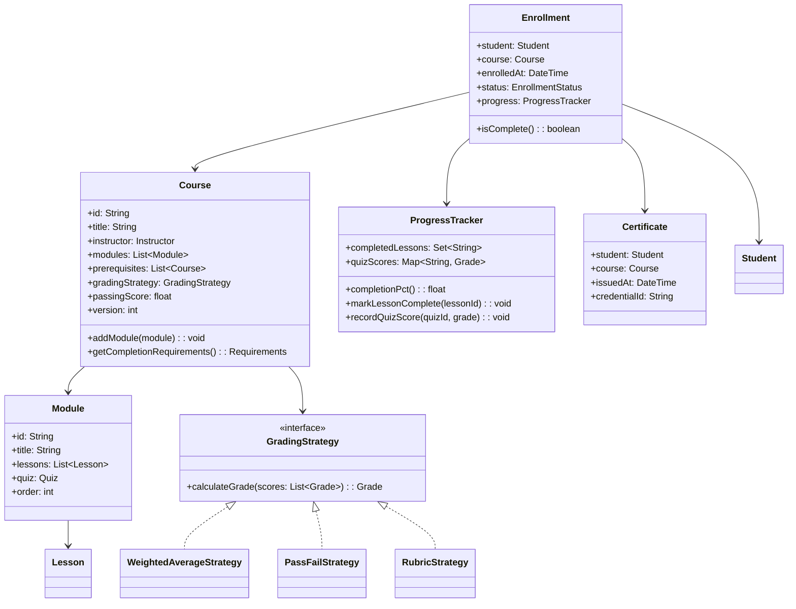

# Design a Learning Management System (OOD)

**Difficulty**: 🟡 Intermediate
**Codemania**: #130
**Interview Frequency**: Medium

---

## Problem Statement

Model an LMS where students enroll in courses, progress through modules and lessons, take quizzes, and receive certificates on completion. The OOD challenge: enrollment is a multi-step process (prerequisite check → billing → access grant → notify student), and grading strategies vary by course (rubric-based, percentage, pass/fail). Encoding this cleanly without a monolithic `EnrollmentManager` god class requires Facade + Strategy + Template Method.

---

## Functional Requirements

- Students enroll in courses (with prerequisite enforcement)
- Courses contain ordered modules; modules contain lessons
- Students take quizzes with automatic grading
- Progress tracker records lesson completion and quiz scores
- Certificates issued when all modules completed and final grade ≥ passing threshold
- Instructors can update course content; enrolled students see versioned content

---

## Core Entities

| Class | Responsibility |
|-------|---------------|
| `Course` | Top-level learning unit: title, instructor, modules, prerequisites |
| `Module` | Ordered group of lessons within a course |
| `Lesson` | Single piece of content: video, article, or interactive exercise |
| `Student` | Profile, enrolled courses, progress records |
| `Instructor` | Creates and updates course content |
| `Enrollment` | Join between student + course: date, status, progress ref |
| `Quiz` | Set of questions; associated with a lesson or module |
| `Grade` | Student's score on a quiz or course overall |
| `Certificate` | Issued on course completion; contains student + course + date |
| `ProgressTracker` | Tracks which lessons are done, current score, completion % |

---

## Class Diagram



---

## Design Patterns Used

### 1. Facade — Enrollment Process

**Why it fits**: Enrolling a student involves 4+ subsystems: prerequisite validation, billing, content access provisioning, and notification. Without a Facade, the controller layer must orchestrate all subsystems and breaks whenever a step is added. `EnrollmentFacade` provides a single `enroll(student, course)` method hiding all complexity.

```
class EnrollmentFacade:
  prerequisiteService: PrerequisiteService
  billingService: BillingService
  accessService: ContentAccessService
  notificationService: NotificationService
  enrollmentRepo: EnrollmentRepository

  enroll(student: Student, course: Course): Enrollment
    // Step 1: Check prerequisites
    unmet = prerequisiteService.getUnmet(student, course.prerequisites)
    if not unmet.isEmpty():
      throw PrerequisiteNotMetException(unmet)

    // Step 2: Process payment
    receipt = billingService.charge(student, course.price)

    // Step 3: Grant content access
    accessService.grant(student.id, course.id)

    // Step 4: Create enrollment record
    enrollment = new Enrollment(student, course, now())
    enrollmentRepo.save(enrollment)

    // Step 5: Notify student
    notificationService.sendEnrollmentConfirmation(student, course)

    return enrollment
```

### 2. Strategy — Grading Rubrics

**Why it fits**: A programming course grades with a weighted average (quizzes 30%, project 70%); a certification course uses pass/fail on a final exam; a skills course uses instructor rubric scoring. Each is a different algorithm injected into `Course` at creation time.

```
interface GradingStrategy:
  calculateGrade(scores: Map<String, Grade>): Grade

WeightedAverageStrategy(weights: Map<String, float>):
  calculateGrade(scores):
    total = 0
    for (componentId, weight) in weights:
      total += scores[componentId].value * weight
    return Grade(total)

PassFailStrategy(threshold: float):
  calculateGrade(scores):
    finalScore = scores["final_exam"].value
    return Grade(finalScore, passed = finalScore >= threshold)
```

### 3. Template Method — Course Completion Flow

**Why it fits**: Every course completion follows the same steps: check all lessons done → calculate final grade → decide pass/fail → issue certificate (if passed). But the grading step varies. Template Method pins the algorithm in the base class while delegating the grade calculation hook.

```
abstract class CompletionProcessor:
  process(enrollment: Enrollment): CompletionResult
    // Step 1: Verify all modules complete
    if not enrollment.progress.allLessonsComplete():
      return CompletionResult.incomplete("Lessons remaining")

    // Step 2: Calculate final grade (delegated to subclass/strategy)
    grade = calculateFinalGrade(enrollment)

    // Step 3: Check passing threshold
    if grade.value < enrollment.course.passingScore:
      return CompletionResult.failed(grade)

    // Step 4: Issue certificate
    cert = issueCertificate(enrollment, grade)
    return CompletionResult.passed(cert)

  abstract calculateFinalGrade(enrollment): Grade

  issueCertificate(enrollment, grade): Certificate
    cert = new Certificate(enrollment.student, enrollment.course, now())
    certRepo.save(cert)
    notifier.send(CertificateIssuedEvent(cert))
    return cert
```

### 4. Observer — New Content Notification

**Why it fits**: When an instructor adds a new lesson, all enrolled students should be notified. The `Course` shouldn't know about email or push notifications. Observer pattern lets `Course` publish a `ContentUpdatedEvent` and let subscribers decide what to do.

```
class Course:
  observers: List<CourseObserver>

  addLesson(module: Module, lesson: Lesson):
    module.addLesson(lesson)
    version++
    publish(ContentUpdatedEvent(this, lesson))

  publish(event): void
    for obs in observers: obs.onEvent(event)

class EnrolledStudentNotifier implements CourseObserver:
  onEvent(event: ContentUpdatedEvent):
    enrollments = enrollmentRepo.findByCourse(event.course)
    for e in enrollments:
      notificationService.send(e.student, "New lesson: " + event.lesson.title)
```

---

## Key Method: `issueCompletion(enrollment)`

```
CompletionService:
  issueCompletion(enrollment: Enrollment): CompletionResult
    course = enrollment.course
    progress = enrollment.progress

    // 1. Check all modules have been touched
    for module in course.modules:
      if not progress.isModuleAttempted(module.id):
        return CompletionResult.incomplete("Module not started: " + module.title)

    // 2. Collect all scored components
    scores = {}
    for module in course.modules:
      if module.quiz != null:
        grade = progress.quizScores.get(module.quiz.id)
        if grade == null:
          return CompletionResult.incomplete("Quiz not taken: " + module.quiz.title)
        scores[module.quiz.id] = grade

    // 3. Run grading strategy
    finalGrade = course.gradingStrategy.calculateGrade(scores)

    // 4. Determine pass/fail
    if finalGrade.value < course.passingScore:
      return CompletionResult.failed(finalGrade)

    // 5. Issue and persist certificate
    cert = new Certificate(enrollment.student, course, now(), generateCredentialId())
    certRepo.save(cert)
    enrollment.status = COMPLETED
    enrollmentRepo.save(enrollment)
    notifier.sendCertificate(enrollment.student, cert)

    return CompletionResult.passed(cert, finalGrade)
```

---

## Design Decisions & Trade-offs

| Decision | Option A | Option B | Choice |
|----------|----------|----------|--------|
| Content versioning | Enrolled students see latest | Enrolled students see version at enrollment | Version at enrollment — mid-course changes confuse learners |
| Prerequisite enforcement | Hard block (throw) | Soft warning (allow bypass) | Hard block for certification courses; soft for self-paced |
| Certificate trigger | Auto on completion | Manual instructor approval | Auto for programmatic courses; approval-based for mentored |
| Quiz attempt limit | Unlimited retakes | Fixed attempts (e.g., 3) | Configurable per quiz — set on `Quiz.maxAttempts` |

---

## Top Interview Questions

| Question | What It Tests |
|----------|--------------|
| A student enrolls, the instructor removes a required module — what happens to progress? | Content versioning, enrollment snapshot |
| How would you add peer-reviewed assignments (student grades other students)? | New GradingStrategy, Observer for peer assignment |
| How do you prevent a student from receiving a certificate without completing all modules? | Invariant enforcement in CompletionProcessor |

---

## Related Concepts

- [Social Media Platform OOD for Observer pattern at scale](./social-media-platform)
- [Calendar System OOD for scheduling reminders around courses](./calendar-system)

---

## 📚 Resources & References

| Resource | Type | What You'll Learn |
|----------|------|------------------|
| [NeetCode OOD Playlist](https://www.youtube.com/@NeetCode) | 📺 YouTube | Facade and Strategy pattern walkthroughs |
| [ByteByteGo System Design](https://www.youtube.com/@ByteByteGo) | 📺 YouTube | LMS and e-learning platform design |
| [Head First Design Patterns](https://www.oreilly.com/library/view/head-first-design/0596007124/) | 📖 Blog | Observer and Template Method chapters |
| [Clean Code — Robert Martin](https://www.amazon.com/Clean-Code-Handbook-Software-Craftsmanship/dp/0132350882) | 📚 Book | Keeping enrollment logic clean and testable |
| [GoF Design Patterns](https://www.amazon.com/Design-Patterns-Elements-Reusable-Object-Oriented/dp/0201633612) | 📚 Book | Facade and Strategy reference |
