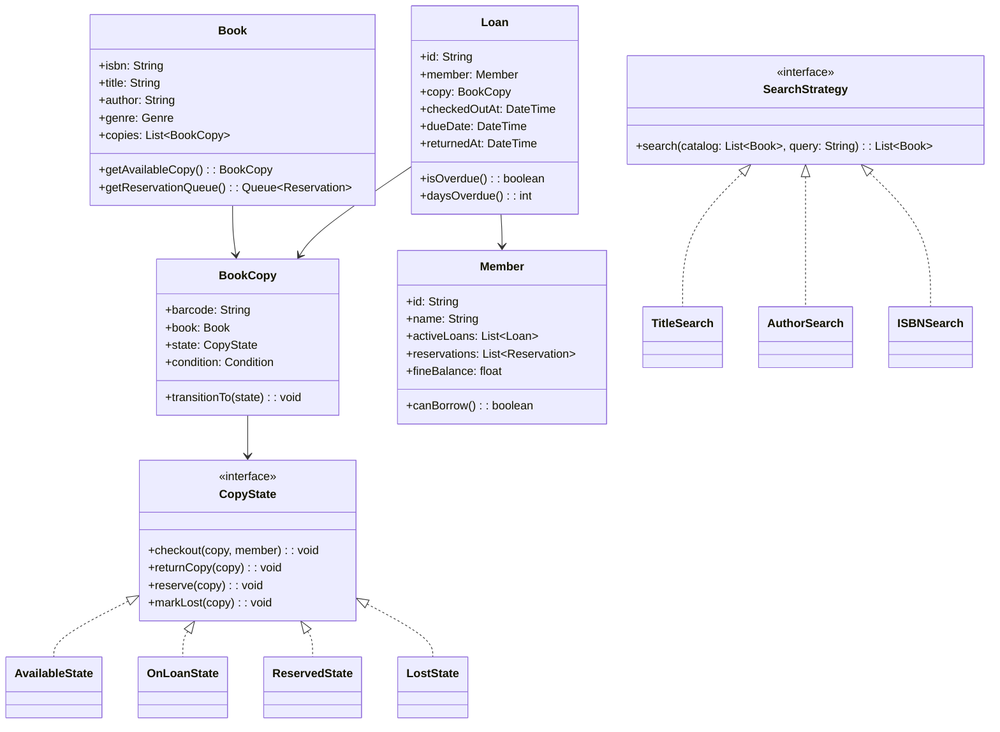
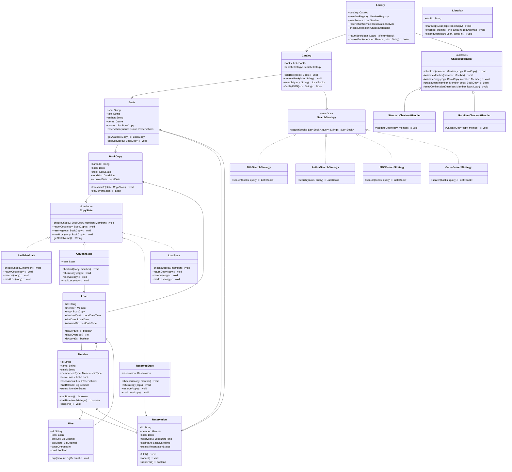
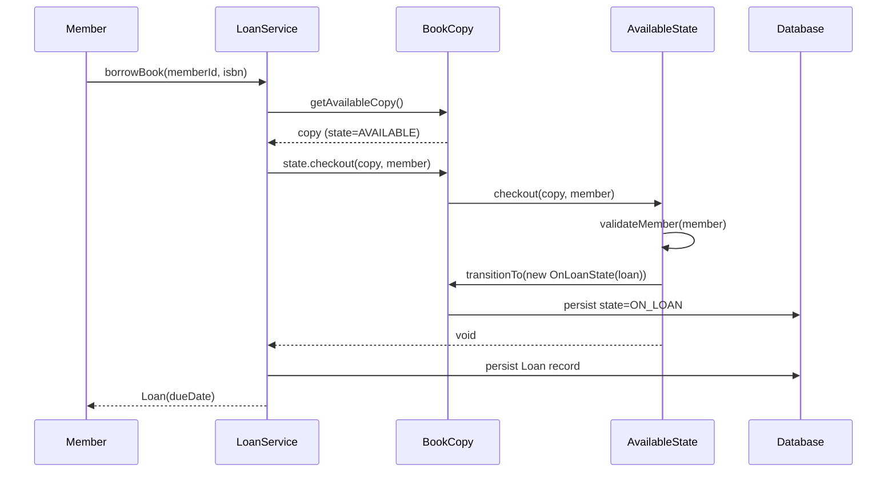
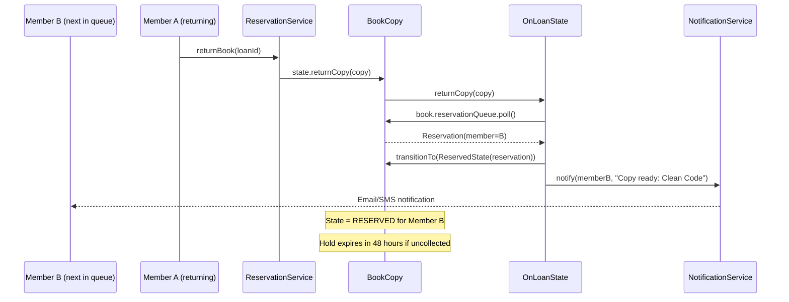

# Design a Library Management System (OOD)

**Difficulty**: 🟡 Intermediate
**Codemania**: #142
**Interview Frequency**: High

---

## Problem Statement

Model a library system that manages physical book copies, member checkouts, reservations, overdue notifications, and fine calculation. The OOD challenge: a `BookCopy` (the physical object) has its own state machine (available → on-loan → reserved → lost) separate from the book's catalog entry. Search algorithms vary by query type and must be swappable. Template Method owns the checkout flow while subclasses add type-specific rules (e.g., reference books can't be borrowed).

---

## Functional Requirements

- Members borrow book copies and return them within a loan period
- Members reserve unavailable copies (FIFO queue)
- Overdue: daily fine for each day past due date
- Catalog search: by title, author, ISBN, or genre
- Librarian marks copies as lost; member charged replacement cost
- Notifications: reminder 1 day before due, alert on overdue

---

## Core Entities

| Class | Responsibility |
|-------|---------------|
| `Library` | Root: catalog, member registry, loan and reservation management |
| `Book` | Catalog entry: ISBN, title, author, genre; has many BookCopies |
| `BookCopy` | Physical copy: barcode, condition, current state |
| `Member` | Registered borrower: active loans, reservations, fine balance |
| `Loan` | Active borrowing record: member, copy, due date |
| `Reservation` | Hold request: member, book (not a specific copy), position in queue |
| `Fine` | Accrued late fee: linked to a Loan, calculated daily |
| `Catalog` | Index: searchable list of Books with filtering |
| `Librarian` | Staff role: override capabilities, mark copies lost |

---

## Class Diagram



---

## Design Patterns Used

### 1. State — BookCopy Lifecycle

**Why it fits**: A copy that is "on-loan" cannot be checked out again; a "reserved" copy can only be checked out by the reserving member. Without State pattern, `BookCopy.checkout()` becomes a cascade of `if status == AVAILABLE && not reserved`. Each state class enforces its own rules clearly.

```
interface CopyState:
  checkout(copy, member): void
  returnCopy(copy): void
  markLost(copy): void

class AvailableState implements CopyState:
  checkout(copy, member):
    if not member.canBorrow():
      throw BorrowingPrivilegeSuspendedException(member)
    copy.transitionTo(new OnLoanState())

  markLost(copy):
    copy.transitionTo(new LostState())

class OnLoanState implements CopyState:
  checkout(copy, member):
    throw CopyAlreadyCheckedOutException(copy)

  returnCopy(copy):
    nextReservation = copy.book.reservationQueue.peek()
    if nextReservation != null:
      copy.transitionTo(new ReservedState(nextReservation))
      notifier.notify(nextReservation.member, CopyAvailableNotification(copy.book))
    else:
      copy.transitionTo(new AvailableState())

class ReservedState(reservation: Reservation) implements CopyState:
  checkout(copy, member):
    if member != reservation.member:
      throw CopyReservedForAnotherMemberException()
    reservation.fulfill()
    copy.transitionTo(new OnLoanState())
```

### 2. Strategy — Catalog Search

**Why it fits**: Searching by title uses fuzzy string matching; by ISBN is an exact lookup; by author needs tokenization. Different algorithms behind the same interface let callers swap search modes without touching `Catalog`.

```
interface SearchStrategy:
  search(books: List<Book>, query: String): List<Book>

TitleSearchStrategy:
  search(books, query):
    normalized = query.toLowerCase()
    return books.filter(b -> b.title.toLowerCase().contains(normalized))
         .sortedBy(b -> levenshteinDistance(b.title, query))

ISBNSearchStrategy:
  search(books, query):
    return books.filter(b -> b.isbn == query.strip())

AuthorSearchStrategy:
  search(books, query):
    parts = query.split(" ")
    return books.filter(b ->
      parts.all(p -> b.author.toLowerCase().contains(p.toLowerCase())))

Catalog:
  searchStrategy: SearchStrategy

  search(query): List<Book>
    return searchStrategy.search(books, query)
```

### 3. Template Method — Checkout Flow

**Why it fits**: All checkouts follow: validate member → validate copy → create loan → update copy state → send confirmation. Only the validation rules differ per book type (reference books can't be borrowed, rare items need librarian approval). Template Method pins the flow.

```
abstract class CheckoutHandler:
  checkout(member: Member, copy: BookCopy): Loan
    validateMember(member)         // shared: fines, loan limit
    validateCopy(copy, member)     // hook: type-specific rules
    loan = createLoan(member, copy)  // shared
    copy.state.checkout(copy, member)  // triggers state transition
    sendConfirmation(member, loan)  // shared
    return loan

  validateMember(member):
    if member.fineBalance > MAX_UNPAID_FINE:
      throw UnpaidFinesException(member)
    if member.activeLoans.size() >= MAX_LOANS:
      throw LoanLimitExceededException(member)

  abstract validateCopy(copy, member): void

class StandardCheckoutHandler extends CheckoutHandler:
  validateCopy(copy, member):
    // No extra rules for standard books

class RareItemCheckoutHandler extends CheckoutHandler:
  validateCopy(copy, member):
    if not member.hasRareItemPrivilege():
      throw InsufficientPrivilegeException()
```

### 4. Observer — Overdue Notifications

**Why it fits**: The library scheduler runs a nightly job checking for overdue loans. Multiple systems react: email the member, accrue the fine, and flag the member record. Observer decouples the overdue check from notification channels.

```
class OverdueCheckJob:
  run():
    today = LocalDate.now()
    overdueLoans = loanRepo.findOverdue(today)
    for loan in overdueLoans:
      fine = calculateFine(loan)
      fineRepo.save(fine)
      eventBus.publish(OverdueLoanEvent(loan, fine))

class MemberNotifier implements EventObserver:
  onEvent(OverdueLoanEvent e):
    emailService.send(e.loan.member.email, OverdueEmail(e.loan, e.fine))

class MemberFlagService implements EventObserver:
  onEvent(OverdueLoanEvent e):
    if e.fine.totalAmount > SUSPENSION_THRESHOLD:
      e.loan.member.suspend()
```

---

## Key Method: `returnBook(loan)`

```
LibraryService:
  returnBook(loan: Loan): ReturnResult
    copy = loan.copy

    // 1. Mark loan as returned
    loan.returnedAt = now()
    loanRepo.save(loan)

    // 2. Calculate fine if overdue
    fine = null
    if loan.isOverdue():
      fine = new Fine(loan, loan.daysOverdue() * DAILY_FINE_RATE)
      loan.member.fineBalance += fine.amount
      fineRepo.save(fine)

    // 3. Transition copy state (state machine handles next reservation)
    copy.state.returnCopy(copy)
    copyRepo.save(copy)

    // 4. Remove from member's active loans
    loan.member.activeLoans.remove(loan)

    return ReturnResult(loan, fine)
```

---

## Design Decisions & Trade-offs

| Decision | Option A | Option B | Choice |
|----------|----------|----------|--------|
| Copy vs title inventory | Track individual copies (barcode) | Track title-level count | Individual copies — needed for condition tracking and physical location |
| Reservation queue | FIFO (simple) | Priority by member tier | FIFO — fair; member tier handled by separate premium lane |
| Fine calculation | Nightly batch | Real-time on return | Real-time on return — member knows fine immediately |
| Lost book charge | Replacement cost + admin fee | Replacement cost only | Replacement + admin fee — covers librarian processing time |

---

## Top Interview Questions

| Question | What It Tests |
|----------|--------------|
| A member returns a book — there are 3 reservations. Which member gets it first? | FIFO queue, reservation fulfillment logic |
| How would you add digital e-books that have no physical copy state? | Open/Closed Principle, new state machine or digital-only subtype |
| How do you prevent a member with unpaid fines from borrowing despite a librarian override? | Role-based validation, Override capability |

---

## Related Concepts

- [Warehouse Management OOD for physical inventory state tracking](./warehouse-management)
- [Online Shopping OOD for inventory reservation patterns](./online-shopping)

---

## Class Design — Full Hierarchy

The complete class diagram shows all relationships including inheritance, composition, and dependency. This is the version an interviewer expects to see on a whiteboard — not just the happy-path entities, but the full inheritance tree for state machine, the strategy hierarchy, and the template method hierarchy.



---

## Component Deep Dive 1: BookCopy State Machine

The `BookCopy` state machine is the most critical architectural component in this design. A physical book copy at any given moment is in exactly one of four states: `AVAILABLE`, `ON_LOAN`, `RESERVED`, or `LOST`. Getting this wrong causes double-checkouts, phantom availability, and reservation corruption.

**Why naive approaches fail at scale**: The naive approach is to store `status: String` on `BookCopy` and write conditional logic inline:

```
// BAD — naive approach
BookCopy.checkout(member):
  if this.status == "AVAILABLE":
    this.status = "ON_LOAN"
  elif this.status == "RESERVED":
    if this.reservedFor != member:
      throw IllegalStateException()
    this.status = "ON_LOAN"
  elif this.status == "ON_LOAN":
    throw AlreadyCheckedOutException()
  // Lost state? What happens? Was it forgotten?
```

When you add a 5th state (e.g., `UNDER_REPAIR`, `RECALLED`), every method on `BookCopy` needs updating. This violates Open/Closed Principle. The State Pattern solves this by encapsulating each state's allowed transitions in its own class. Adding `UnderRepairState` only requires implementing `CopyState` — all other states remain untouched.

**Internal mechanics**: Each state class holds a reference back to the `BookCopy` context so it can call `transitionTo()`. The state doesn't mutate the copy directly — it requests a transition, and the copy's `transitionTo()` logs the event, persists the new state, and swaps the reference.

```
class OnLoanState implements CopyState:
  returnCopy(copy: BookCopy):
    nextReservation = copy.book.reservationQueue.poll()  // dequeue FIFO
    if nextReservation != null and not nextReservation.isExpired():
      copy.transitionTo(new ReservedState(nextReservation))
      notifier.send(nextReservation.member, "Your reserved copy is ready")
    else:
      copy.transitionTo(new AvailableState())

  markLost(copy: BookCopy):
    copy.transitionTo(new LostState())
    fineService.chargeReplacementFee(copy.getCurrentLoan().member, copy)
```

**Sequence: checkout with reservation queue**



**State transition trade-offs**

| Approach | Complexity | Extensibility | Concurrency Safety | Trade-off |
|----------|------------|---------------|-------------------|-----------|
| Enum + switch/case | Low | Poor — all methods need updating | Requires external locking | Fast to write, hard to maintain |
| State Pattern (OOP) | Medium | Excellent — add new states in isolation | State class is lightweight to lock | Preferred for interview; slight indirection overhead |
| Event sourcing (state from events) | High | Excellent | Natural audit log | Overkill for interview; valid for production audit requirements |

---

## Component Deep Dive 2: Reservation Queue and FIFO Fulfillment

The reservation subsystem manages the queue of members waiting for a specific book title. Unlike airline seat reservations, library reservations are title-level (member wants "Clean Code", not a specific copy with barcode "BC-00042"). When any copy of that title is returned, the FIFO queue determines who gets it.

**Internal mechanics**: `Book` owns a `Queue<Reservation>` (FIFO). When `OnLoanState.returnCopy()` fires, it calls `book.reservationQueue.poll()` to dequeue the next reservation. It then transitions the copy to `ReservedState(reservation)` and sends a notification. The member has a configurable hold window (typically 48–72 hours) to collect the copy. If they don't, the reservation expires and the next member in queue is offered it.



**Scale behavior at 10x load**: At 1,000 active members and 50 popular titles, a single in-memory `Queue<Reservation>` per book works. At 10,000 members and 500 popular titles, the queue must be persisted to a database (a `reservations` table ordered by `reserved_at ASC`). At 100,000 members, the poll + notify path becomes a hot write path — consider a dedicated reservations service with Redis-backed queues for the top 1,000 most-reserved titles.

| Approach | Correctness | Storage | Notification Latency |
|----------|-------------|---------|----------------------|
| In-memory Queue per Book | Correct but lost on restart | None — volatile | Immediate |
| DB-persisted FIFO (ORDER BY reserved_at) | Correct, durable | O(reservations) rows | Query latency: ~5ms |
| Redis LPUSH/RPOP per book key | Correct, durable, fast | ~200 bytes/reservation | Sub-millisecond |

---

## Component Deep Dive 3: Fine Calculation and Member Suspension

The fine system links overdue loans to financial penalties and enforces borrowing privilege suspension. It has two phases: detection (nightly batch or real-time on return) and enforcement (suspend member if unpaid balance exceeds threshold).

**Technical decisions**:

- **When to calculate**: Calculate the fine at return time (not nightly) so the member sees the exact amount immediately. Use a nightly job only to flag overdue loans for suspension decisions — not for fine generation, which is already done on return.
- **Precision**: Use `BigDecimal`, not `float`, for all monetary amounts. `float` rounding errors accumulate across thousands of loans. At `$0.25/day × 14 days = $3.50`, a `float` gives `3.4999999...` which creates confusing display and incorrect comparisons.
- **Suspension threshold**: Store `MAX_UNPAID_FINE` as a configurable constant, not hardcoded. Libraries in different jurisdictions have different thresholds ($5, $10, $25).

```
// Fine calculation at return
FineCalculator:
  calculate(loan: Loan): Fine
    days = max(0, loan.daysOverdue())
    amount = BigDecimal(days).multiply(DAILY_FINE_RATE)
    return new Fine(loan, amount, days, DAILY_FINE_RATE)

// Suspension check
MemberService:
  updateStatus(member: Member):
    if member.fineBalance.compareTo(SUSPENSION_THRESHOLD) > 0:
      member.status = MemberStatus.SUSPENDED
    else if member.fineBalance.compareTo(BigDecimal.ZERO) == 0:
      member.status = MemberStatus.ACTIVE
```

---

## Data Model

The schema below maps the OOD class hierarchy to a relational database. Key design choices: `book_copies.state` stores the current state machine state as an enum column; `reservations` uses `reserved_at` for FIFO ordering; all monetary columns use `DECIMAL(10,2)` to avoid floating-point errors.

```sql
-- Catalog
CREATE TABLE books (
    isbn            VARCHAR(13)     PRIMARY KEY,
    title           VARCHAR(255)    NOT NULL,
    author          VARCHAR(255)    NOT NULL,
    genre           VARCHAR(50)     NOT NULL,
    publisher       VARCHAR(255),
    published_year  SMALLINT,
    created_at      TIMESTAMP       DEFAULT NOW()
);

CREATE INDEX idx_books_title  ON books (title);
CREATE INDEX idx_books_author ON books (author);
CREATE INDEX idx_books_genre  ON books (genre);

-- Physical copies
CREATE TABLE book_copies (
    barcode         VARCHAR(50)     PRIMARY KEY,
    isbn            VARCHAR(13)     NOT NULL REFERENCES books(isbn),
    state           VARCHAR(20)     NOT NULL DEFAULT 'AVAILABLE'
                    CHECK (state IN ('AVAILABLE','ON_LOAN','RESERVED','LOST')),
    condition       VARCHAR(20)     NOT NULL DEFAULT 'GOOD'
                    CHECK (condition IN ('NEW','GOOD','WORN','DAMAGED')),
    acquired_date   DATE            NOT NULL,
    location_shelf  VARCHAR(50),
    updated_at      TIMESTAMP       DEFAULT NOW()
);

CREATE INDEX idx_copies_isbn_state ON book_copies (isbn, state);

-- Members
CREATE TABLE members (
    member_id       UUID            PRIMARY KEY DEFAULT gen_random_uuid(),
    name            VARCHAR(255)    NOT NULL,
    email           VARCHAR(255)    UNIQUE NOT NULL,
    membership_type VARCHAR(20)     NOT NULL DEFAULT 'STANDARD'
                    CHECK (membership_type IN ('STANDARD','PREMIUM','STAFF')),
    status          VARCHAR(20)     NOT NULL DEFAULT 'ACTIVE'
                    CHECK (status IN ('ACTIVE','SUSPENDED','EXPIRED')),
    fine_balance    DECIMAL(10,2)   NOT NULL DEFAULT 0.00,
    joined_at       DATE            NOT NULL,
    expires_at      DATE            NOT NULL
);

-- Active and historical loans
CREATE TABLE loans (
    loan_id         UUID            PRIMARY KEY DEFAULT gen_random_uuid(),
    member_id       UUID            NOT NULL REFERENCES members(member_id),
    barcode         VARCHAR(50)     NOT NULL REFERENCES book_copies(barcode),
    checked_out_at  TIMESTAMP       NOT NULL DEFAULT NOW(),
    due_date        DATE            NOT NULL,
    returned_at     TIMESTAMP,                              -- NULL = still active
    is_active       BOOLEAN         GENERATED ALWAYS AS (returned_at IS NULL) STORED
);

CREATE INDEX idx_loans_member_active  ON loans (member_id) WHERE returned_at IS NULL;
CREATE INDEX idx_loans_due_date       ON loans (due_date)  WHERE returned_at IS NULL;

-- Reservations (FIFO by reserved_at)
CREATE TABLE reservations (
    reservation_id  UUID            PRIMARY KEY DEFAULT gen_random_uuid(),
    member_id       UUID            NOT NULL REFERENCES members(member_id),
    isbn            VARCHAR(13)     NOT NULL REFERENCES books(isbn),
    reserved_at     TIMESTAMP       NOT NULL DEFAULT NOW(),
    expires_at      TIMESTAMP       NOT NULL,               -- 48h hold window
    status          VARCHAR(20)     NOT NULL DEFAULT 'PENDING'
                    CHECK (status IN ('PENDING','FULFILLED','EXPIRED','CANCELLED'))
);

CREATE INDEX idx_reservations_isbn_pending
    ON reservations (isbn, reserved_at ASC)
    WHERE status = 'PENDING';

-- Fines
CREATE TABLE fines (
    fine_id         UUID            PRIMARY KEY DEFAULT gen_random_uuid(),
    loan_id         UUID            NOT NULL REFERENCES loans(loan_id),
    amount          DECIMAL(10,2)   NOT NULL,
    daily_rate      DECIMAL(10,2)   NOT NULL,
    days_overdue    INT             NOT NULL,
    paid            BOOLEAN         NOT NULL DEFAULT FALSE,
    paid_at         TIMESTAMP,
    created_at      TIMESTAMP       DEFAULT NOW()
);

CREATE INDEX idx_fines_loan    ON fines (loan_id);
CREATE INDEX idx_fines_unpaid  ON fines (paid) WHERE paid = FALSE;
```

---

## Scale Bottlenecks

| Traffic Level | Component That Breaks | Symptoms | Mitigation |
|---------------|----------------------|----------|------------|
| 10x baseline (10k members, 50k checkouts/month) | In-memory `Queue<Reservation>` per `Book` object | Reservations lost on app restart; no cross-instance consistency | Persist reservations to DB; load queue from DB on startup |
| 100x baseline (100k members, 500k checkouts/month) | `loans` table full-scan for overdue detection | Nightly job scans millions of rows; takes hours | Partial index on `due_date WHERE returned_at IS NULL`; job finishes in seconds |
| 100x baseline | Single-threaded `Catalog.search()` | Title search blocks; response time exceeds 5 seconds | Move catalog search to Elasticsearch; index `title`, `author`, `genre` fields |
| 1000x baseline (1M members, 5M checkouts/month) | Write contention on `members.fine_balance` | Deadlocks on `UPDATE members SET fine_balance = ...` during peak returns | Use a separate `fine_balance_ledger` table; compute balance as `SUM(amount) WHERE paid=FALSE` |
| 1000x baseline | Notification fan-out at 9am daily reminder | Email service gets 100k requests in 60 seconds; rate-limited by SMTP provider | Queue reminder emails to SQS/Kafka; process at 500/second rate-limited consumer |

---

## SOLID Principles in This Design

**Single Responsibility Principle**: Each class has one reason to change. `Fine` only knows about penalty calculation. `Catalog` only knows about search. `LoanService` orchestrates but delegates fine logic to `FineCalculator`. If the fine formula changes (e.g., from flat rate to graduated rate), only `FineCalculator` changes — not `LoanService`.

**Open/Closed Principle**: The State Pattern makes `BookCopy` open for extension (add `UnderRepairState`) but closed for modification — existing state classes are not touched. The Strategy Pattern makes `Catalog` open for new search algorithms without modifying `Catalog` itself.

**Liskov Substitution Principle**: Every `CopyState` implementation can substitute for the interface. `LostState.checkout()` throws a meaningful domain exception — it doesn't silently return null or corrupt state. Every `SearchStrategy` returns a `List<Book>`, never null (return empty list if no results).

**Interface Segregation Principle**: `CopyState` has exactly the operations relevant to a copy's lifecycle. `SearchStrategy` is a single-method interface. Neither is bloated with unrelated methods. `Librarian` extends capability via composition (holds a reference to `LoanService`, `FineService`) rather than inheriting from `Member`.

**Dependency Inversion Principle**: `CheckoutHandler` depends on the `CopyState` abstraction, not concrete state classes. `Catalog` depends on `SearchStrategy` interface. High-level orchestration (`Library`, `LoanService`) depends on abstractions injected at construction time, making the system fully testable with mocks.

---

## Concurrency and Thread Safety

Three concurrent operations are possible in a multi-user library system:

1. **Two members simultaneously request the last available copy of a book.** Without synchronization, both see `state=AVAILABLE`, both call `checkout()`, and both get a loan for the same physical copy.

2. **A member returns a copy while a reservation expiry job is processing.** The return triggers `OnLoanState.returnCopy()` which polls the reservation queue. The expiry job simultaneously removes expired reservations. Without a lock, the return could notify a member whose reservation was already expired and removed.

3. **Fine payment and borrowing privilege check happen concurrently.** A member pays their fine (reducing `fineBalance` to $0) while simultaneously the suspension check reads `fineBalance` mid-payment and suspends the member.

**Solutions**:

```
// Solution 1: Optimistic locking on BookCopy
BookCopy {
  @Version
  version: Long    // JPA/Hibernate optimistic lock
}

// Checkout path: if two threads load the same version, 
// the second UPDATE fails with OptimisticLockException
// → retry loop with exponential backoff (max 3 attempts)

// Solution 2: Pessimistic lock on reservation queue dequeue
ReservationService.fulfillNextReservation(book):
  synchronized(book.reservationQueue):
    next = book.reservationQueue.poll()
    if next != null and not next.isExpired():
      // safe to assign copy

// Solution 3: Database-level atomic fine update
// Use SQL: UPDATE members SET fine_balance = fine_balance - ? 
//          WHERE member_id = ? AND fine_balance >= ?
// Returns rows_affected; if 0, retry or throw InsufficientBalanceException
```

At scale, pessimistic in-memory locks become a bottleneck. The production solution is to push checkout serialization to the database using row-level locking (`SELECT ... FOR UPDATE`) on the `book_copies` row, ensuring only one transaction can check out a given barcode at a time.

---

## Extension Points

**Adding digital e-books**: Create `DigitalBookCopy extends BookCopy` with state machine simplified to `AVAILABLE` / `ON_LOAN` only (no physical "lost" state). Override `getAvailableCopy()` in `Book` to return a `DigitalBookCopy` that supports concurrent loans up to the license limit (e.g., 5 simultaneous digital loans per title). The `CheckoutHandler` template method works unchanged — only `validateCopy()` in a new `DigitalCheckoutHandler` differs (checks license count, not physical availability).

**Adding membership tiers**: `Member` currently has a `membershipType` enum. Add `MembershipPolicy` strategy per type: `StandardPolicy` (3 loans, 14 days), `PremiumPolicy` (10 loans, 30 days). Inject `MembershipPolicy` into `CheckoutHandler.validateMember()` so limits are applied per type without touching the core checkout flow.

**Adding self-checkout kiosks**: The `CheckoutHandler` template method already abstracts the checkout flow. A `KioskCheckoutHandler` extends it with `validateCopy()` that requires the copy's barcode scan to match a self-service–eligible shelf location. The rest of the flow (loan creation, notification, state transition) is inherited unchanged.

---

## How Seattle Public Library Built This

Seattle Public Library (SPL), one of the highest-circulation public library systems in the US, processes over **11 million checkouts per year** across 27 branches. Their catalog contains **2.2 million items** (physical + digital). Their system architecture illustrates the exact design decisions this OOD problem is modeling.

SPL migrated from a legacy Integrated Library System (ILS) to a cloud-backed architecture using **SirsiDynix Symphony** (a commercial ILS) combined with a custom API layer. Key architectural decisions:

- **Physical copy state** is maintained in the ILS database with row-level locking. Each item (equivalent to `BookCopy`) has a `ITEM_STATUS` field with values identical to the state machine modeled here: `AVAILABLE`, `CHECKED_OUT`, `ON_HOLD` (reserved), `LOST`, `IN_TRANSIT`.
- **Reservation queues** are persisted in the ILS database, ordered by request timestamp (FIFO). Popular titles like new releases have queues of 300–500 patrons. The system sends automated email and SMS notifications when a hold is fulfilled — SPL sends approximately **50,000 hold notification messages per month**.
- **Fine calculation** is real-time on check-in. SPL charges $0.25/day for most adult materials. They implemented a **fine forgiveness program in 2019** where fines under $10 are automatically waived — a business-rule change that required only modifying the fine calculation strategy, not the checkout/return flow.
- **Digital content**: SPL integrates with OverDrive (now Libby) for e-books and audiobooks. Digital items have simultaneous-user limits (typically 1–3 per title purchased) rather than a single physical copy. This is the `DigitalBookCopy` extension described above — SPL handles 1.2 million digital checkouts per year through this parallel system.
- **Search**: SPL uses **BiblioCommons** as a discovery layer sitting in front of the ILS. BiblioCommons indexes the catalog in Elasticsearch and serves faceted search (by format, availability, branch). This is the `SearchStrategy` abstraction at scale — search is completely decoupled from the inventory state machine.

Source: SPL Annual Report 2022 (spl.org/about-the-library/library-reports); BiblioCommons case study (bibliocommons.com/case-studies).

---

## Interview Angle

**What the interviewer is testing**: Whether you can decompose a domain with interacting state machines and multiple behavioral variations — without reaching for inheritance-heavy hierarchies. The library problem specifically tests your ability to separate the catalog entity (`Book`) from the inventory entity (`BookCopy`) and model their independent concerns correctly.

**Common mistakes candidates make**:

1. **Storing state as a String/enum and branching on it inline**: Writing `if (copy.status.equals("AVAILABLE"))` throughout the codebase. When a 5th state is needed, every method breaks. The interviewer will probe this by asking "how would you add an `UNDER_REPAIR` state?" — the correct answer triggers no changes to existing state logic.

2. **Making `Reservation` point to a specific `BookCopy`**: Reservations are placed against a title (`Book`), not a physical copy. The copy is assigned only at fulfillment time, from whichever copy is returned first. Candidates who model `Reservation.copy = BookCopy` block themselves when asked "what if that specific copy is damaged before the reservation is fulfilled?"

3. **Using `float` or `double` for `fineBalance`**: A `$0.25/day` fine over 14 days should equal exactly `$3.50`. Using `float` gives `3.4999999...`. Interviewers at companies like PayPal and Stripe specifically probe this; `BigDecimal` with `DECIMAL(10,2)` in the DB is the correct answer.

**The insight that separates good from great answers**: Recognizing that `Book` and `BookCopy` have completely independent identity and lifecycle. `Book` is a logical catalog record (immortal — it exists even if all copies are destroyed); `BookCopy` is a physical inventory item with its own state machine. The reservation queue belongs to `Book` (members reserve a title), but the state machine belongs to `BookCopy` (individual copies are checked out). Candidates who get this right naturally arrive at the correct class diagram without prompting.

---

## Key Numbers to Remember

| Metric | Value | Context |
|--------|-------|---------|
| Daily fine rate | $0.25/day | Standard US public library; charge `DECIMAL(10,2)` not `float` |
| Hold window | 48–72 hours | After notification, copy reserved for member; then offered to next in queue |
| Max active loans | 3 (Standard) / 10 (Premium) | Enforced in `validateMember()` inside `CheckoutHandler` |
| Suspension threshold | $10 unpaid fines | Member's `canBorrow()` returns false above this balance |
| Queue depth for bestsellers | 300–500 reservations | SPL data; drives need for persisted, indexed reservation table |
| SPL annual checkouts | 11 million/year | ~30,000/day across 27 branches; ~1 checkout/second peak |
| Digital concurrent loan limit | 1–3 per title | OverDrive/Libby licensing model; drives `DigitalBookCopy` extension |
| Catalog index update latency | <5 seconds | Elasticsearch near-real-time indexing when new copy added |

---

## 📚 Resources & References

| Resource | Type | What You'll Learn |
|----------|------|------------------|
| [NeetCode OOD Playlist](https://www.youtube.com/@NeetCode) | 📺 YouTube | State and Strategy pattern walkthroughs |
| [ByteByteGo System Design](https://www.youtube.com/@ByteByteGo) | 📺 YouTube | Library and inventory system design |
| [Head First Design Patterns](https://www.oreilly.com/library/view/head-first-design/0596007124/) | 📖 Blog | State and Template Method chapters |
| [Clean Code — Robert Martin](https://www.amazon.com/Clean-Code-Handbook-Software-Craftsmanship/dp/0132350882) | 📚 Book | Clean checkout and return logic |
| [GoF Design Patterns](https://www.amazon.com/Design-Patterns-Elements-Reusable-Object-Oriented/dp/0201633612) | 📚 Book | State and Strategy pattern reference |
