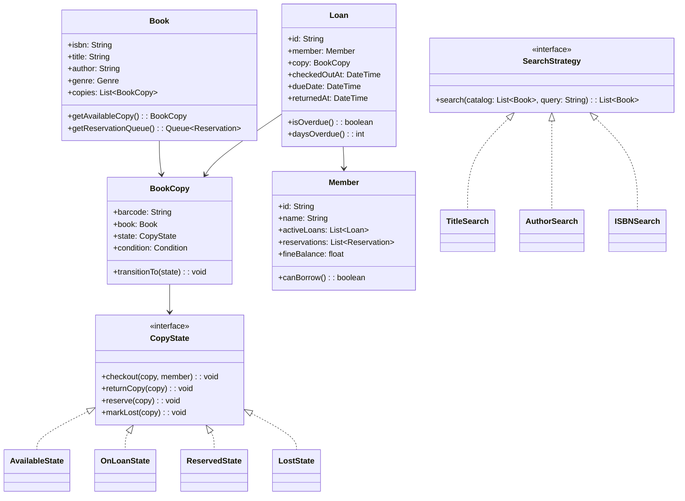

# Design a Library Management System (OOD)

**Difficulty**: 🟡 Intermediate
**Codemania**: #142
**Interview Frequency**: High

---

## Problem Statement

Model a library system that manages physical book copies, member checkouts, reservations, overdue notifications, and fine calculation. The OOD challenge: a `BookCopy` (the physical object) has its own state machine (available → on-loan → reserved → lost) separate from the book's catalog entry. Search algorithms vary by query type and must be swappable. Template Method owns the checkout flow while subclasses add type-specific rules (e.g., reference books can't be borrowed).

---

## Functional Requirements

- Members borrow book copies and return them within a loan period
- Members reserve unavailable copies (FIFO queue)
- Overdue: daily fine for each day past due date
- Catalog search: by title, author, ISBN, or genre
- Librarian marks copies as lost; member charged replacement cost
- Notifications: reminder 1 day before due, alert on overdue

---

## Core Entities

| Class | Responsibility |
|-------|---------------|
| `Library` | Root: catalog, member registry, loan and reservation management |
| `Book` | Catalog entry: ISBN, title, author, genre; has many BookCopies |
| `BookCopy` | Physical copy: barcode, condition, current state |
| `Member` | Registered borrower: active loans, reservations, fine balance |
| `Loan` | Active borrowing record: member, copy, due date |
| `Reservation` | Hold request: member, book (not a specific copy), position in queue |
| `Fine` | Accrued late fee: linked to a Loan, calculated daily |
| `Catalog` | Index: searchable list of Books with filtering |
| `Librarian` | Staff role: override capabilities, mark copies lost |

---

## Class Diagram



---

## Design Patterns Used

### 1. State — BookCopy Lifecycle

**Why it fits**: A copy that is "on-loan" cannot be checked out again; a "reserved" copy can only be checked out by the reserving member. Without State pattern, `BookCopy.checkout()` becomes a cascade of `if status == AVAILABLE && not reserved`. Each state class enforces its own rules clearly.

```
interface CopyState:
  checkout(copy, member): void
  returnCopy(copy): void
  markLost(copy): void

class AvailableState implements CopyState:
  checkout(copy, member):
    if not member.canBorrow():
      throw BorrowingPrivilegeSuspendedException(member)
    copy.transitionTo(new OnLoanState())

  markLost(copy):
    copy.transitionTo(new LostState())

class OnLoanState implements CopyState:
  checkout(copy, member):
    throw CopyAlreadyCheckedOutException(copy)

  returnCopy(copy):
    nextReservation = copy.book.reservationQueue.peek()
    if nextReservation != null:
      copy.transitionTo(new ReservedState(nextReservation))
      notifier.notify(nextReservation.member, CopyAvailableNotification(copy.book))
    else:
      copy.transitionTo(new AvailableState())

class ReservedState(reservation: Reservation) implements CopyState:
  checkout(copy, member):
    if member != reservation.member:
      throw CopyReservedForAnotherMemberException()
    reservation.fulfill()
    copy.transitionTo(new OnLoanState())
```

### 2. Strategy — Catalog Search

**Why it fits**: Searching by title uses fuzzy string matching; by ISBN is an exact lookup; by author needs tokenization. Different algorithms behind the same interface let callers swap search modes without touching `Catalog`.

```
interface SearchStrategy:
  search(books: List<Book>, query: String): List<Book>

TitleSearchStrategy:
  search(books, query):
    normalized = query.toLowerCase()
    return books.filter(b -> b.title.toLowerCase().contains(normalized))
         .sortedBy(b -> levenshteinDistance(b.title, query))

ISBNSearchStrategy:
  search(books, query):
    return books.filter(b -> b.isbn == query.strip())

AuthorSearchStrategy:
  search(books, query):
    parts = query.split(" ")
    return books.filter(b ->
      parts.all(p -> b.author.toLowerCase().contains(p.toLowerCase())))

Catalog:
  searchStrategy: SearchStrategy

  search(query): List<Book>
    return searchStrategy.search(books, query)
```

### 3. Template Method — Checkout Flow

**Why it fits**: All checkouts follow: validate member → validate copy → create loan → update copy state → send confirmation. Only the validation rules differ per book type (reference books can't be borrowed, rare items need librarian approval). Template Method pins the flow.

```
abstract class CheckoutHandler:
  checkout(member: Member, copy: BookCopy): Loan
    validateMember(member)         // shared: fines, loan limit
    validateCopy(copy, member)     // hook: type-specific rules
    loan = createLoan(member, copy)  // shared
    copy.state.checkout(copy, member)  // triggers state transition
    sendConfirmation(member, loan)  // shared
    return loan

  validateMember(member):
    if member.fineBalance > MAX_UNPAID_FINE:
      throw UnpaidFinesException(member)
    if member.activeLoans.size() >= MAX_LOANS:
      throw LoanLimitExceededException(member)

  abstract validateCopy(copy, member): void

class StandardCheckoutHandler extends CheckoutHandler:
  validateCopy(copy, member):
    // No extra rules for standard books

class RareItemCheckoutHandler extends CheckoutHandler:
  validateCopy(copy, member):
    if not member.hasRareItemPrivilege():
      throw InsufficientPrivilegeException()
```

### 4. Observer — Overdue Notifications

**Why it fits**: The library scheduler runs a nightly job checking for overdue loans. Multiple systems react: email the member, accrue the fine, and flag the member record. Observer decouples the overdue check from notification channels.

```
class OverdueCheckJob:
  run():
    today = LocalDate.now()
    overdueLoans = loanRepo.findOverdue(today)
    for loan in overdueLoans:
      fine = calculateFine(loan)
      fineRepo.save(fine)
      eventBus.publish(OverdueLoanEvent(loan, fine))

class MemberNotifier implements EventObserver:
  onEvent(OverdueLoanEvent e):
    emailService.send(e.loan.member.email, OverdueEmail(e.loan, e.fine))

class MemberFlagService implements EventObserver:
  onEvent(OverdueLoanEvent e):
    if e.fine.totalAmount > SUSPENSION_THRESHOLD:
      e.loan.member.suspend()
```

---

## Key Method: `returnBook(loan)`

```
LibraryService:
  returnBook(loan: Loan): ReturnResult
    copy = loan.copy

    // 1. Mark loan as returned
    loan.returnedAt = now()
    loanRepo.save(loan)

    // 2. Calculate fine if overdue
    fine = null
    if loan.isOverdue():
      fine = new Fine(loan, loan.daysOverdue() * DAILY_FINE_RATE)
      loan.member.fineBalance += fine.amount
      fineRepo.save(fine)

    // 3. Transition copy state (state machine handles next reservation)
    copy.state.returnCopy(copy)
    copyRepo.save(copy)

    // 4. Remove from member's active loans
    loan.member.activeLoans.remove(loan)

    return ReturnResult(loan, fine)
```

---

## Design Decisions & Trade-offs

| Decision | Option A | Option B | Choice |
|----------|----------|----------|--------|
| Copy vs title inventory | Track individual copies (barcode) | Track title-level count | Individual copies — needed for condition tracking and physical location |
| Reservation queue | FIFO (simple) | Priority by member tier | FIFO — fair; member tier handled by separate premium lane |
| Fine calculation | Nightly batch | Real-time on return | Real-time on return — member knows fine immediately |
| Lost book charge | Replacement cost + admin fee | Replacement cost only | Replacement + admin fee — covers librarian processing time |

---

## Top Interview Questions

| Question | What It Tests |
|----------|--------------|
| A member returns a book — there are 3 reservations. Which member gets it first? | FIFO queue, reservation fulfillment logic |
| How would you add digital e-books that have no physical copy state? | Open/Closed Principle, new state machine or digital-only subtype |
| How do you prevent a member with unpaid fines from borrowing despite a librarian override? | Role-based validation, Override capability |

---

## Related Concepts

- [Warehouse Management OOD for physical inventory state tracking](./warehouse-management)
- [Online Shopping OOD for inventory reservation patterns](./online-shopping)

---

## 📚 Resources & References

| Resource | Type | What You'll Learn |
|----------|------|------------------|
| [NeetCode OOD Playlist](https://www.youtube.com/@NeetCode) | 📺 YouTube | State and Strategy pattern walkthroughs |
| [ByteByteGo System Design](https://www.youtube.com/@ByteByteGo) | 📺 YouTube | Library and inventory system design |
| [Head First Design Patterns](https://www.oreilly.com/library/view/head-first-design/0596007124/) | 📖 Blog | State and Template Method chapters |
| [Clean Code — Robert Martin](https://www.amazon.com/Clean-Code-Handbook-Software-Craftsmanship/dp/0132350882) | 📚 Book | Clean checkout and return logic |
| [GoF Design Patterns](https://www.amazon.com/Design-Patterns-Elements-Reusable-Object-Oriented/dp/0201633612) | 📚 Book | State and Strategy pattern reference |
