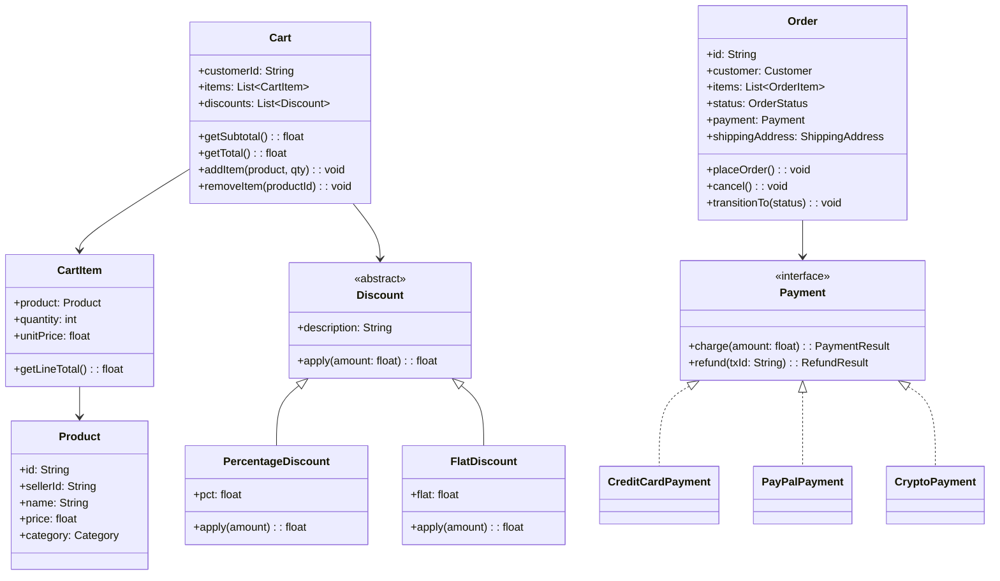
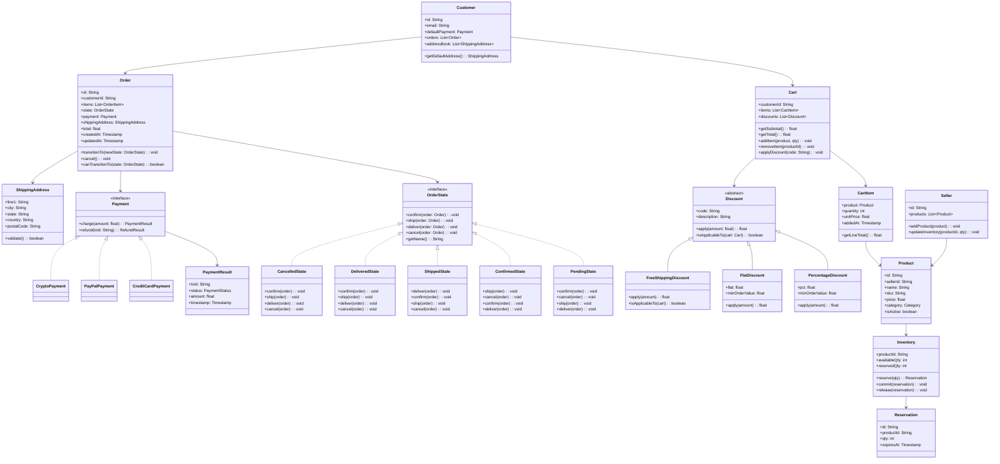

# Design an Online Shopping System (OOD)

**Difficulty**: 🟡 Intermediate
**Codemania**: #128
**Interview Frequency**: High

---

## Problem Statement

Model an online shopping platform where customers browse products, manage a cart, apply multiple stacked discounts, and place orders through various payment methods. The OOD challenge: an order passes through several lifecycle states (pending → paid → shipped → delivered → returned) and discounts stack in varying combinations without creating an explosion of subclasses.

---

## Functional Requirements

- Customers can add/remove products to/from cart
- Apply one or more discount codes (percentage, flat amount, free shipping)
- Place order: validates inventory, processes payment, reduces stock
- Track order status lifecycle with timestamps
- Sellers manage their product inventory separately
- Support multiple payment methods: credit card, PayPal, crypto

---

## Core Entities

| Class | Responsibility |
|-------|---------------|
| `Product` | SKU, name, price, category; managed by seller |
| `Inventory` | Per-product stock count; thread-safe reserve/release |
| `Cart` | Session or persistent list of CartItems; total calculation |
| `CartItem` | Product ref + quantity + snapshot of price at add-time |
| `Order` | Confirmed cart: items, customer, payment, status, timestamps |
| `Customer` | Profile, list of orders, default payment method |
| `Payment` | Interface for charge/refund; multiple implementations |
| `Discount` | Wraps a CartItem or Order to modify price (Decorator) |
| `ShippingAddress` | Validated address; linked to order |
| `Seller` | Manages product catalog and inventory |

---

## Class Diagram



---

## Design Patterns Used

### 1. Builder — Order Construction

**Why it fits**: An `Order` has many optional fields (gift message, shipping speed, promo code, split payment). A constructor with 10 parameters is error-prone. Builder lets each field be set explicitly and validates the complete order before construction.

```
class OrderBuilder:
  customer: Customer
  items: List<CartItem>
  shippingAddress: ShippingAddress
  payment: Payment
  giftMessage: String  // optional
  shippingSpeed: ShippingSpeed  // optional, default STANDARD

  withCustomer(c): OrderBuilder
  withItems(items): OrderBuilder
  withShipping(addr): OrderBuilder
  withPayment(p): OrderBuilder
  withGiftMessage(msg): OrderBuilder
  withShippingSpeed(speed): OrderBuilder

  build(): Order
    validate()   // throws if customer/items/payment missing
    return new Order(this)
```

### 2. Strategy — Payment Methods

**Why it fits**: Credit card, PayPal, and crypto all charge/refund but use completely different APIs and retry logic. Injecting a `Payment` strategy decouples the `Order` from payment provider details. Swapping providers is a config change, not a code change.

```
interface Payment:
  charge(amount: float): PaymentResult
  refund(txId: String): RefundResult

CreditCardPayment:
  charge(amount):
    result = stripeClient.charge(cardToken, amount)
    return PaymentResult(result.txId, result.status)

PayPalPayment:
  charge(amount):
    result = paypalSDK.createPayment(email, amount)
    return PaymentResult(result.id, PENDING)  // async confirm
```

### 3. Decorator — Discount Stacking

**Why it fits**: Discounts layer on top of each other: first a 10% member discount, then a $5 flat coupon, then free shipping. Subclassing every combination (MemberWithFlatDiscount, MemberWithFreeShipping…) explodes. Decorator wraps the price calculation so each discount is independent and composable.

```
abstract class Discount:
  apply(amount: float): float

PercentageDiscount(pct: 0.10):
  apply(amount): amount * (1 - pct)

FlatDiscount(flat: 5.00):
  apply(amount): max(0, amount - flat)

Cart.getTotal():
  total = getSubtotal()
  for discount in discounts:   // applied in order added
    total = discount.apply(total)
  return total
```

### 4. State — Order Lifecycle

**Why it fits**: An order's allowed transitions are strict: you can't ship a cancelled order. State pattern models each lifecycle phase as a class with its own `transitionTo()` guard. Adding a new state (e.g., "held for fraud review") means one new class, not editing a giant `switch`.

```
interface OrderState:
  confirm(order): void
  ship(order): void
  deliver(order): void
  cancel(order): void

PendingState:
  confirm(order): order.setState(new ConfirmedState())
  cancel(order):  order.setState(new CancelledState())
  ship(order):    throw IllegalStateTransitionException

ConfirmedState:
  ship(order): order.setState(new ShippedState())
  cancel(order): order.setState(new CancelledState())
  confirm(order): throw IllegalStateTransitionException
```

### 5. Observer — Inventory Alert

**Why it fits**: Multiple systems care when inventory hits zero: the seller dashboard, the reordering service, and the search index (to hide out-of-stock items). Observer lets `Inventory` notify all of them without knowing their implementation.

---

## Key Method: `placeOrder(cart, customer)`

```
OrderService:
  placeOrder(cart: Cart, customer: Customer, payment: Payment): Order
    // 1. Snapshot prices (prices may change between add-to-cart and checkout)
    items = cart.items.map(item -> OrderItem(item.product.id, item.quantity, item.unitPrice))

    // 2. Reserve inventory atomically — fail fast before charging
    reservations = []
    for item in items:
      reservation = inventory.reserve(item.productId, item.quantity)
      if reservation == null:
        inventory.releaseAll(reservations)
        throw OutOfStockException(item.productId)
      reservations.add(reservation)

    // 3. Calculate final total with discounts
    total = cart.getTotal()

    // 4. Charge payment — if this fails, release inventory
    try:
      result = payment.charge(total)
    catch PaymentException e:
      inventory.releaseAll(reservations)
      throw e

    // 5. Commit inventory reductions
    inventory.commitAll(reservations)

    // 6. Build and persist order
    order = new OrderBuilder()
      .withCustomer(customer)
      .withItems(items)
      .withPayment(payment)
      .withTotal(total)
      .build()

    order.transitionTo(CONFIRMED)
    return order
```

---

## Design Decisions & Trade-offs

| Decision | Option A | Option B | Choice |
|----------|----------|----------|--------|
| Cart persistence | Session-scoped (lost on logout) | DB-backed per customer | DB-backed — customers expect cart to survive sessions |
| Discount stacking | Additive (all apply to original) | Sequential (each wraps previous) | Sequential — matches real-world couponing (bigger discounts first) |
| Price snapshot | Store current price | Re-fetch on checkout | Snapshot at add-to-cart — avoids price-change surprises at checkout |
| Inventory reserve | Optimistic (check on confirm) | Pessimistic (lock on add-to-cart) | Reserve on checkout — locks too early hurts conversion |

---

## Top Interview Questions

| Question | What It Tests |
|----------|--------------|
| How do you prevent two customers from buying the last item simultaneously? | Inventory reservation, optimistic vs pessimistic locking |
| A discount code should only apply once per customer — where does this logic live? | Single Responsibility, coupon ledger |
| How would you add a "Buy-One-Get-One" discount without changing existing discount classes? | Decorator extension, Open/Closed Principle |

---

## Related Concepts

- [Warehouse Management OOD for the inventory picking side](./warehouse-management)
- [Food Delivery OOD for similar order state machine](./food-delivery-ood)

---

## Class Design

The following expanded class diagram shows all relationships, including the State pattern hierarchy for `OrderState`, the full `Discount` decorator chain, and supporting value objects that are typically omitted in high-level diagrams but matter greatly in real implementations.



---

## Design Patterns Applied

### 1. Builder — Order Construction

**Why it fits**: An `Order` has many optional fields (gift message, shipping speed, coupon codes, split payment, special handling instructions). A telescoping constructor with 10+ parameters becomes unmaintainable — callers can't tell which argument is which without an IDE, and adding a new optional field requires touching every call site. Builder enforces a fluent, self-documenting construction API and centralizes validation in `build()` before the object ever exists.

**The non-obvious part**: The `build()` method should check cross-field invariants that can't be enforced by individual setters. For example, a crypto payment requires the order total to be above a $50 minimum (gas fees make micro-transactions uneconomical), but neither `withPayment()` nor `withTotal()` alone can enforce this — only `build()` can cross-check them.

### 2. Strategy — Payment Methods

**Why it fits**: Credit card, PayPal, and crypto all implement the same `charge/refund` interface but differ completely in: API calls, idempotency key semantics, retry rules, async vs synchronous confirmation, and refund windows. Strategy injects the right implementation at construction time. `Order` never has an `if paymentType == "crypto"` branch — it just calls `payment.charge(total)`.

**Extension**: When PayPal requires async webhook confirmation (payment is PENDING until webhook fires), the `PayPalPayment` strategy handles the polling/callback internally. The `Order` remains unaware.

### 3. Decorator — Discount Stacking

**Why it fits**: Discounts compose dynamically. A customer might have: a 10% loyalty tier discount, a $5 flat coupon, and a free-shipping promo. If these were subclasses, you'd need `LoyaltyWithFlatWithFreeShipping`, `LoyaltyWithFlat`, `FlatWithFreeShipping`, and more — 2^n subclasses for n discount types. Decorator wraps each discount layer around the price, applying them in sequence.

**Order matters**: Apply percentage discounts first (they're more valuable when applied to a higher base), then flat discounts, then free shipping last. `Cart.applyDiscount()` enforces this ordering when codes are added.

### 4. State — Order Lifecycle

**Why it fits**: Order state transitions follow strict business rules. A `ShippedState` order cannot be re-confirmed or cancelled without a return flow. Encoding this as a `switch (status)` in `Order.transitionTo()` means every new state requires editing the core order class — violating Open/Closed. State pattern makes each lifecycle phase an object with its own transition guards. Adding "held for fraud review" is one new class.

**The critical method**: Each state's illegal transitions call `throw IllegalStateTransitionException(from, to)` with enough context for the API layer to return a sensible HTTP 409 with a message like "Cannot cancel an order that has already shipped."

### 5. Observer — Inventory and Post-Order Events

**Why it fits**: When inventory hits zero, multiple systems need to react: the seller dashboard shows an alert, the reordering service queues a restock, the search index marks the product out-of-stock, and any customers with the item in their cart get an email. `Inventory` should not know about dashboards, reorder services, or search indexes. Observer lets it emit `InventoryDepletedEvent` and let each subscriber handle it independently.

Similarly, `Order` emits `OrderPlacedEvent` after `placeOrder()` commits, which triggers confirmation email, loyalty points accrual, and analytics — all without coupling `OrderService` to those systems.

---

## SOLID Principles

### Single Responsibility Principle (SRP)

Every class has one reason to change:
- `Inventory` changes only when stock management logic changes. It does not send emails or update dashboards.
- `Cart` changes only when cart behavior changes. It delegates total calculation to `Discount` objects — it does not own discount logic.
- `OrderService.placeOrder()` orchestrates the workflow but delegates each step: reservation to `Inventory`, charging to `Payment`, persistence to `OrderRepository`. If the payment API changes, only `CreditCardPayment` changes, not `OrderService`.

**Common violation to call out in interviews**: Putting `sendConfirmationEmail()` inside `Order.placeOrder()` violates SRP — email is a notification concern, not an order domain concern. The fix is Observer or an event bus.

### Open/Closed Principle (OCP)

- Adding a new payment method (e.g., `ApplePayPayment`) requires creating one new class implementing `Payment`. No existing class changes.
- Adding a new discount type (e.g., `BuyOneGetOneDiscount`) requires one new class extending `Discount`. `Cart.getTotal()` does not change — it just iterates over whatever discounts are in the list.
- Adding a new order state (e.g., `FraudReviewState`) requires one new class implementing `OrderState`. The `Order` class does not gain new `if` branches.

### Liskov Substitution Principle (LSP)

Every `Payment` implementation can substitute for `Payment` without breaking callers. `Order.placeOrder()` calls `payment.charge(total)` identically regardless of whether it's `CreditCardPayment` or `CryptoPayment`. The `PaymentResult` returned has the same structure — callers never need to downcast.

`Discount` subclasses follow the same contract: `apply(amount)` always returns a non-negative float less than or equal to `amount`. A `FlatDiscount` that returns a negative number (if flat > amount) would violate LSP — hence the `max(0, amount - flat)` guard.

### Interface Segregation Principle (ISP)

`Payment` exposes only `charge()` and `refund()`. It does not include `getBalance()`, `getTransactionHistory()`, or other methods some payment providers support. If we added those, `CryptoPayment` would be forced to implement methods that don't apply. Instead, if those capabilities are needed, a separate `PaymentHistoryProvider` interface is defined.

### Dependency Inversion Principle (DIP)

`OrderService` depends on the `Payment` interface, not on `CreditCardPayment` or `PayPalPayment`. `Cart` depends on the `Discount` abstract class, not on concrete discount types. `Inventory` publishes to an `InventoryEventListener` interface — it doesn't know which concrete listeners are registered at runtime. All dependencies flow toward abstractions, not concrete implementations.

---

## Concurrency and Thread Safety

### The Core Race Condition

Two customers simultaneously adding the last unit of a product to their carts is fine — cart operations are per-customer. The race condition occurs at `placeOrder()` when both try to reserve inventory for the same `productId`.

```
Customer A: inventory.getAvailable("SKU-001") → 1
Customer B: inventory.getAvailable("SKU-001") → 1
Customer A: inventory.reserve("SKU-001", 1) → succeeds
Customer B: inventory.reserve("SKU-001", 1) → succeeds [BUG: oversold]
```

### Fix: Optimistic Locking on Inventory

```
-- Atomic compare-and-swap reservation (SQL)
UPDATE inventory
SET available_qty = available_qty - :qty,
    reserved_qty  = reserved_qty  + :qty,
    version       = version + 1
WHERE product_id = :productId
  AND available_qty >= :qty
  AND version = :expectedVersion;

-- If 0 rows updated: concurrent reservation won, retry or throw OutOfStockException
```

The `Inventory.reserve()` method uses optimistic locking with a `version` field. If two concurrent requests both read `version=5`, the first `UPDATE` succeeds and sets `version=6`, the second finds `version != 5` and updates 0 rows — which the application layer detects and retries or surfaces as out-of-stock.

### Discount Code One-Time Use

A discount code limited to one use per customer requires a write to a `coupon_redemptions` table with a `(customer_id, coupon_code)` unique constraint. This ensures that even under concurrent `placeOrder()` calls, only one redemption commits — the second fails with a unique constraint violation, which `CartService` converts to a `CouponAlreadyUsedException`.

### Cart Modification During Checkout

If a customer updates their cart while `placeOrder()` is running (possible in multi-tab browsers), the `placeOrder()` method works from a snapshot of `cart.items` taken at the start — not from a live cart reference. `Cart.checkout()` returns an immutable `CartSnapshot` that `OrderService` uses throughout the reservation and payment flow.

### Thread Safety in `Inventory`

In a single-JVM (non-distributed) context, `Inventory` methods use `synchronized` blocks scoped to the `productId` lock object from a `ConcurrentHashMap<String, ReentrantLock>`. In distributed deployments (the real production case), the atomic SQL `UPDATE` with `available_qty >= qty` provides the necessary serialization at the database level.

---

## Extension Points

### Adding a New Payment Method (Open/Closed in action)

To add `ApplePayPayment`:
1. Create `ApplePayPayment implements Payment` — ~50 lines
2. Register it in the `PaymentFactory` with key `"apple_pay"`
3. No changes to `Order`, `OrderService`, or any existing payment class

```
class ApplePayPayment implements Payment:
  applePayToken: String

  charge(amount: float): PaymentResult
    result = applePaySDK.authorize(applePayToken, amount)
    return PaymentResult(result.transactionId, result.status, amount)

  refund(txId: String): RefundResult
    result = applePaySDK.refund(txId)
    return RefundResult(result.refundId, result.status)
```

### Adding "Buy-One-Get-One" (BOGO) Discount

BOGO is not a price modifier — it's a cart modifier (adds a free item). It cannot extend `Discount` cleanly because `Discount.apply(amount)` only transforms a float.

The correct extension: introduce a second interface `CartPromotion` with `applyToCart(cart: Cart): void`. `BOGOPromotion` implements `CartPromotion` by adding a `CartItem` with `unitPrice=0`. `Cart` maintains two separate lists: `discounts: List<Discount>` for price modifiers, and `promotions: List<CartPromotion>` for cart structure changes. Existing code is unaffected.

### Adding Order Cancellation with Partial Refund

The `CancelledState` transition currently triggers a full refund. To support partial refunds (e.g., item already shipped, only return fee deducted):

1. Add `partialRefund(txId, amount)` to the `Payment` interface
2. Add a `ReturnInitiatedState` between `ShippedState` and `CancelledState`
3. `ReturnInitiatedState.cancel()` calls `payment.partialRefund(txId, order.total - shippingFee)`

No other state classes change. The existing `CancelledState` full-refund path is preserved.

### Adding a Subscription / Recurring Order

Introduce a `RecurringOrderPolicy` that wraps an `Order` template and a cron schedule. `SubscriptionService` periodically calls `OrderService.placeOrder(policy.getTemplate())`. Because `OrderService.placeOrder()` already accepts a `Cart` snapshot and `Payment` strategy, recurring orders reuse the entire checkout flow without modification.

---

## Data Model

Real field names, types, and indexes for a relational (PostgreSQL) implementation:

```sql
-- Core product catalog
CREATE TABLE products (
    id           UUID PRIMARY KEY DEFAULT gen_random_uuid(),
    seller_id    UUID NOT NULL REFERENCES sellers(id),
    sku          VARCHAR(64) UNIQUE NOT NULL,
    name         VARCHAR(255) NOT NULL,
    description  TEXT,
    price_cents  INTEGER NOT NULL CHECK (price_cents >= 0),
    category     VARCHAR(64) NOT NULL,
    is_active    BOOLEAN NOT NULL DEFAULT true,
    created_at   TIMESTAMPTZ NOT NULL DEFAULT NOW(),
    updated_at   TIMESTAMPTZ NOT NULL DEFAULT NOW()
);
CREATE INDEX idx_products_seller_id ON products(seller_id);
CREATE INDEX idx_products_category  ON products(category) WHERE is_active = true;

-- Inventory with optimistic lock version
CREATE TABLE inventory (
    product_id     UUID PRIMARY KEY REFERENCES products(id),
    available_qty  INTEGER NOT NULL CHECK (available_qty >= 0),
    reserved_qty   INTEGER NOT NULL CHECK (reserved_qty >= 0),
    version        INTEGER NOT NULL DEFAULT 0
);

-- Timed reservations (expire after 15 minutes if order not placed)
CREATE TABLE inventory_reservations (
    id          UUID PRIMARY KEY DEFAULT gen_random_uuid(),
    product_id  UUID NOT NULL REFERENCES products(id),
    order_id    UUID,               -- null until order is confirmed
    qty         INTEGER NOT NULL,
    expires_at  TIMESTAMPTZ NOT NULL,
    released_at TIMESTAMPTZ,
    committed_at TIMESTAMPTZ
);
CREATE INDEX idx_reservations_expires ON inventory_reservations(expires_at)
    WHERE released_at IS NULL AND committed_at IS NULL;

-- Persistent carts (survive session logout)
CREATE TABLE carts (
    id           UUID PRIMARY KEY DEFAULT gen_random_uuid(),
    customer_id  UUID NOT NULL REFERENCES customers(id),
    status       VARCHAR(20) NOT NULL DEFAULT 'active',  -- active, checked_out, abandoned
    created_at   TIMESTAMPTZ NOT NULL DEFAULT NOW(),
    updated_at   TIMESTAMPTZ NOT NULL DEFAULT NOW()
);
CREATE UNIQUE INDEX idx_carts_active_customer ON carts(customer_id)
    WHERE status = 'active';

CREATE TABLE cart_items (
    id              UUID PRIMARY KEY DEFAULT gen_random_uuid(),
    cart_id         UUID NOT NULL REFERENCES carts(id) ON DELETE CASCADE,
    product_id      UUID NOT NULL REFERENCES products(id),
    quantity        INTEGER NOT NULL CHECK (quantity > 0),
    unit_price_cents INTEGER NOT NULL,  -- snapshot at add-to-cart time
    added_at        TIMESTAMPTZ NOT NULL DEFAULT NOW(),
    UNIQUE (cart_id, product_id)
);

-- Discount codes
CREATE TABLE discount_codes (
    id                UUID PRIMARY KEY DEFAULT gen_random_uuid(),
    code              VARCHAR(50) UNIQUE NOT NULL,
    type              VARCHAR(30) NOT NULL,  -- percentage, flat, free_shipping, bogo
    value_cents       INTEGER,               -- null for free_shipping/bogo
    pct               NUMERIC(5,4),          -- null for flat/free_shipping
    min_order_cents   INTEGER NOT NULL DEFAULT 0,
    max_redemptions   INTEGER,               -- null = unlimited
    per_customer_limit INTEGER NOT NULL DEFAULT 1,
    valid_from        TIMESTAMPTZ NOT NULL,
    valid_until       TIMESTAMPTZ,
    is_active         BOOLEAN NOT NULL DEFAULT true
);

CREATE TABLE coupon_redemptions (
    id           UUID PRIMARY KEY DEFAULT gen_random_uuid(),
    order_id     UUID NOT NULL REFERENCES orders(id),
    customer_id  UUID NOT NULL REFERENCES customers(id),
    code_id      UUID NOT NULL REFERENCES discount_codes(id),
    applied_at   TIMESTAMPTZ NOT NULL DEFAULT NOW(),
    UNIQUE (customer_id, code_id)  -- enforces one-use-per-customer at DB level
);

-- Orders
CREATE TABLE orders (
    id                  UUID PRIMARY KEY DEFAULT gen_random_uuid(),
    customer_id         UUID NOT NULL REFERENCES customers(id),
    status              VARCHAR(30) NOT NULL DEFAULT 'pending',
    subtotal_cents      INTEGER NOT NULL,
    discount_cents      INTEGER NOT NULL DEFAULT 0,
    shipping_cents      INTEGER NOT NULL DEFAULT 0,
    total_cents         INTEGER NOT NULL,
    payment_tx_id       VARCHAR(255),
    payment_method      VARCHAR(30) NOT NULL,
    shipping_address_id UUID NOT NULL REFERENCES shipping_addresses(id),
    gift_message        TEXT,
    placed_at           TIMESTAMPTZ,
    shipped_at          TIMESTAMPTZ,
    delivered_at        TIMESTAMPTZ,
    cancelled_at        TIMESTAMPTZ,
    created_at          TIMESTAMPTZ NOT NULL DEFAULT NOW(),
    updated_at          TIMESTAMPTZ NOT NULL DEFAULT NOW()
);
CREATE INDEX idx_orders_customer_id ON orders(customer_id);
CREATE INDEX idx_orders_status      ON orders(status);
CREATE INDEX idx_orders_placed_at   ON orders(placed_at DESC);

CREATE TABLE order_items (
    id               UUID PRIMARY KEY DEFAULT gen_random_uuid(),
    order_id         UUID NOT NULL REFERENCES orders(id),
    product_id       UUID NOT NULL REFERENCES products(id),
    seller_id        UUID NOT NULL REFERENCES sellers(id),
    sku              VARCHAR(64) NOT NULL,       -- snapshot in case product later changes
    product_name     VARCHAR(255) NOT NULL,      -- snapshot
    quantity         INTEGER NOT NULL,
    unit_price_cents INTEGER NOT NULL,           -- snapshot at order time
    status           VARCHAR(30) NOT NULL DEFAULT 'pending'
);
CREATE INDEX idx_order_items_order_id  ON order_items(order_id);
CREATE INDEX idx_order_items_seller_id ON order_items(seller_id);

-- Order status transition audit log
CREATE TABLE order_status_history (
    id           UUID PRIMARY KEY DEFAULT gen_random_uuid(),
    order_id     UUID NOT NULL REFERENCES orders(id),
    from_status  VARCHAR(30),
    to_status    VARCHAR(30) NOT NULL,
    changed_by   VARCHAR(255),  -- customer_id, system, admin_id
    changed_at   TIMESTAMPTZ NOT NULL DEFAULT NOW(),
    reason       TEXT
);
```

---

## Scale Bottlenecks

| Traffic Level | Component That Breaks | Symptoms | Mitigation |
|---|---|---|---|
| 10x baseline (~10k orders/hr) | Single `inventory` DB writer | Reservation UPDATE latency spikes to 500ms+; checkout timeouts | Connection pool tuning; read replica for catalog reads; separate inventory DB |
| 100x baseline (~100k orders/hr) | `cart_items` table hot rows | Row-level lock contention on popular-product cart rows; P99 checkout > 2s | Shard carts by `customer_id`; move active carts to Redis with async DB sync |
| 100x baseline | `coupon_redemptions` unique constraint | High contention on viral promo codes; DB lock waits spike | Redis SET NX as fast gate before DB write; rate-limit coupon check endpoint |
| 100x baseline | `order_status_history` write volume | Append-heavy table causes table bloat and vacuum pressure | Partition by month; archive orders older than 90 days to cold storage |
| 1000x baseline (~1M orders/hr) | Monolithic `OrderService` | Single deployment unit can't scale payment processing independently | Decompose into `CartService`, `InventoryService`, `PaymentService`, `OrderService` microservices with event-driven coordination |
| 1000x baseline | Synchronous payment call in checkout flow | Payment provider latency (avg 300ms, P99 2s) becomes checkout bottleneck under load | Async payment: reserve inventory → emit `PaymentRequested` event → respond 202 Accepted → confirm via webhook |
| 1000x baseline | `products` table full-text search | PostgreSQL ILIKE queries degrade; P99 search > 3s | Offload search to Elasticsearch/OpenSearch; keep DB as source of truth |

---

## How Amazon Built This

Amazon's e-commerce order pipeline is one of the most documented at-scale systems in industry. The following is drawn from Amazon engineering blog posts, Werner Vogels' technical essays, and the well-known "Dynamo" and "Checkout" papers.

**Scale context**: Amazon processes approximately 66,000 orders per hour on a normal day, spiking to 300,000+ orders per hour during Prime Day events. The cart service alone handles over 1 billion cart additions per day globally.

**Technology choices**:
- **DynamoDB for cart persistence**: Amazon moved cart storage from an Oracle relational DB to what eventually became DynamoDB in 2007, precisely because cart data access patterns (read/write by `customer_id`, no cross-cart joins) fit key-value semantics perfectly. A relational DB was the wrong tool — it added join and schema overhead for a workload that didn't need it.
- **Optimistic concurrency for inventory**: Amazon uses a variant of optimistic concurrency control (similar to the `version` column approach above) for inventory reservations. Items are not hard-locked at add-to-cart — only at checkout. This maximizes cart conversion by avoiding premature "item unavailable" errors during browsing.
- **Service decomposition**: By 2003, checkout was already decomposed into >20 independent services: tax calculation, shipping rate estimation, payment authorization, fraud scoring, inventory reservation, and order confirmation each run as separate services with independent scaling and deployment. A single "checkout" user action is actually an orchestrated call to 20+ downstream services.
- **Idempotent payment**: Amazon's payment service requires an idempotency key on every `charge()` call. If the calling service crashes after the charge succeeds but before it records the result, retrying with the same key returns the original result rather than double-charging. This is the non-obvious insight: in distributed systems, `charge()` is not safe to retry without an idempotency key.
- **Event-driven post-order**: After order placement, Amazon uses an internal event bus (predecessor to EventBridge) to fan out the `OrderPlaced` event to: fulfillment, loyalty points, seller notification, analytics, and recommendation systems. None of these are synchronous calls in the checkout critical path.

**Key numbers**:
- Cart read latency target: under 10ms at P99 (DynamoDB with caching)
- Checkout end-to-end target: under 400ms at P50 (excluding slow payment providers)
- Inventory reservation hold time: 15 minutes for standard items; 5 minutes during high-traffic events
- Payment idempotency key TTL: 24 hours

Source: Werner Vogels, "A Decade of Dynamo" (2017); Amazon Builders' Library articles on "Avoiding insurmountable queue backlogs" and "Implementing idempotent APIs."

---

## Interview Angle

**What the interviewer is testing:** Whether you can design a system with genuine concurrency hazards (inventory race conditions, payment idempotency) while applying appropriate OOP patterns — not just reciting pattern names, but justifying why each pattern is the right tool for that specific problem.

**Common mistakes candidates make:**

1. **Skipping the inventory race condition entirely.** Most candidates describe `Inventory.reserve()` as a simple decrement without addressing what happens when two customers hit it simultaneously. Interviewers specifically look for whether you mention optimistic locking, compare-and-swap, or database-level `UPDATE WHERE qty >= requested`. Not mentioning this signals lack of production system experience.

2. **Overusing inheritance for discounts.** Creating `MemberDiscount extends Discount` and `MemberWithFlatDiscount extends MemberDiscount` is the textbook OCP violation. It suggests unfamiliarity with Decorator. When asked "how do discounts stack?", jump straight to Decorator and name the specific problem it solves: 2^n subclasses for n discount types.

3. **Putting email/notification logic in `Order.placeOrder()`**. This is the SRP violation that catches intermediate candidates. `Order` is a domain object — it should model ordering rules, not integrate with email providers. The fix — Observer or domain events — is what separates candidates who understand clean architecture from those who just know CRUD.

**The insight that separates good from great answers:** Pointing out that `placeOrder()` must work in the correct order — inventory reserve, then payment charge, then inventory commit — and that each step needs a compensating action if a later step fails (inventory release if payment fails). This is the saga pattern in miniature, and recognizing it shows you've thought about distributed transactions, not just happy paths.

---

## Key Numbers to Remember

| Metric | Value | Context |
|--------|-------|---------|
| Cart item read latency | < 10ms P99 | DynamoDB key-value access pattern, no joins |
| Checkout end-to-end latency | < 400ms P50 | Amazon target; payment provider is the main variable |
| Inventory reservation TTL | 15 minutes | Hold released if order not placed; 5 min during peak events |
| Payment idempotency key TTL | 24 hours | Safe retry window after crash-before-commit |
| Discount types causing subclass explosion | 2^n | n=5 discount types → 32 subclasses without Decorator |
| Order status transitions | 5 valid states | pending → confirmed → shipped → delivered → cancelled |
| Illegal transitions caught by State | 20 forbidden pairs | State pattern eliminates all `if/switch` guards in `Order` |
| Unique constraint enforcement | 1 DB write | `(customer_id, coupon_code)` prevents concurrent double-redemption |
| Amazon Prime Day peak | 300k+ orders/hr | ~83 orders/second sustained; inventory service is the critical path |
| Async post-order fan-out | 20+ consumers | Observer/event bus; none in checkout critical path |

---

## 📚 Resources & References

| Resource | Type | What You'll Learn |
|----------|------|------------------|
| [NeetCode OOD Playlist](https://www.youtube.com/@NeetCode) | 📺 YouTube | OOD interview walkthroughs |
| [ByteByteGo System Design](https://www.youtube.com/@ByteByteGo) | 📺 YouTube | E-commerce architecture overview |
| [Head First Design Patterns](https://www.oreilly.com/library/view/head-first-design/0596007124/) | 📖 Blog | Decorator and Builder pattern chapters |
| [Clean Code — Robert Martin](https://www.amazon.com/Clean-Code-Handbook-Software-Craftsmanship/dp/0132350882) | 📚 Book | Clean class design and SRP |
| [GoF Design Patterns](https://www.amazon.com/Design-Patterns-Elements-Reusable-Object-Oriented/dp/0201633612) | 📚 Book | State and Strategy pattern reference |
