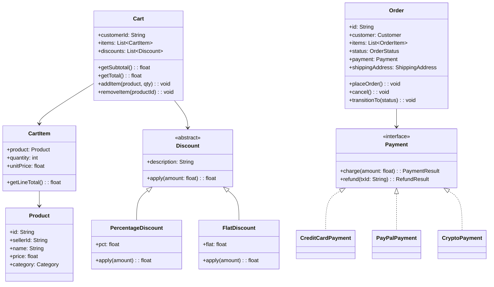

# Design an Online Shopping System (OOD)

**Difficulty**: 🟡 Intermediate
**Codemania**: #128
**Interview Frequency**: High

---

## Problem Statement

Model an online shopping platform where customers browse products, manage a cart, apply multiple stacked discounts, and place orders through various payment methods. The OOD challenge: an order passes through several lifecycle states (pending → paid → shipped → delivered → returned) and discounts stack in varying combinations without creating an explosion of subclasses.

---

## Functional Requirements

- Customers can add/remove products to/from cart
- Apply one or more discount codes (percentage, flat amount, free shipping)
- Place order: validates inventory, processes payment, reduces stock
- Track order status lifecycle with timestamps
- Sellers manage their product inventory separately
- Support multiple payment methods: credit card, PayPal, crypto

---

## Core Entities

| Class | Responsibility |
|-------|---------------|
| `Product` | SKU, name, price, category; managed by seller |
| `Inventory` | Per-product stock count; thread-safe reserve/release |
| `Cart` | Session or persistent list of CartItems; total calculation |
| `CartItem` | Product ref + quantity + snapshot of price at add-time |
| `Order` | Confirmed cart: items, customer, payment, status, timestamps |
| `Customer` | Profile, list of orders, default payment method |
| `Payment` | Interface for charge/refund; multiple implementations |
| `Discount` | Wraps a CartItem or Order to modify price (Decorator) |
| `ShippingAddress` | Validated address; linked to order |
| `Seller` | Manages product catalog and inventory |

---

## Class Diagram



---

## Design Patterns Used

### 1. Builder — Order Construction

**Why it fits**: An `Order` has many optional fields (gift message, shipping speed, promo code, split payment). A constructor with 10 parameters is error-prone. Builder lets each field be set explicitly and validates the complete order before construction.

```
class OrderBuilder:
  customer: Customer
  items: List<CartItem>
  shippingAddress: ShippingAddress
  payment: Payment
  giftMessage: String  // optional
  shippingSpeed: ShippingSpeed  // optional, default STANDARD

  withCustomer(c): OrderBuilder
  withItems(items): OrderBuilder
  withShipping(addr): OrderBuilder
  withPayment(p): OrderBuilder
  withGiftMessage(msg): OrderBuilder
  withShippingSpeed(speed): OrderBuilder

  build(): Order
    validate()   // throws if customer/items/payment missing
    return new Order(this)
```

### 2. Strategy — Payment Methods

**Why it fits**: Credit card, PayPal, and crypto all charge/refund but use completely different APIs and retry logic. Injecting a `Payment` strategy decouples the `Order` from payment provider details. Swapping providers is a config change, not a code change.

```
interface Payment:
  charge(amount: float): PaymentResult
  refund(txId: String): RefundResult

CreditCardPayment:
  charge(amount):
    result = stripeClient.charge(cardToken, amount)
    return PaymentResult(result.txId, result.status)

PayPalPayment:
  charge(amount):
    result = paypalSDK.createPayment(email, amount)
    return PaymentResult(result.id, PENDING)  // async confirm
```

### 3. Decorator — Discount Stacking

**Why it fits**: Discounts layer on top of each other: first a 10% member discount, then a $5 flat coupon, then free shipping. Subclassing every combination (MemberWithFlatDiscount, MemberWithFreeShipping…) explodes. Decorator wraps the price calculation so each discount is independent and composable.

```
abstract class Discount:
  apply(amount: float): float

PercentageDiscount(pct: 0.10):
  apply(amount): amount * (1 - pct)

FlatDiscount(flat: 5.00):
  apply(amount): max(0, amount - flat)

Cart.getTotal():
  total = getSubtotal()
  for discount in discounts:   // applied in order added
    total = discount.apply(total)
  return total
```

### 4. State — Order Lifecycle

**Why it fits**: An order's allowed transitions are strict: you can't ship a cancelled order. State pattern models each lifecycle phase as a class with its own `transitionTo()` guard. Adding a new state (e.g., "held for fraud review") means one new class, not editing a giant `switch`.

```
interface OrderState:
  confirm(order): void
  ship(order): void
  deliver(order): void
  cancel(order): void

PendingState:
  confirm(order): order.setState(new ConfirmedState())
  cancel(order):  order.setState(new CancelledState())
  ship(order):    throw IllegalStateTransitionException

ConfirmedState:
  ship(order): order.setState(new ShippedState())
  cancel(order): order.setState(new CancelledState())
  confirm(order): throw IllegalStateTransitionException
```

### 5. Observer — Inventory Alert

**Why it fits**: Multiple systems care when inventory hits zero: the seller dashboard, the reordering service, and the search index (to hide out-of-stock items). Observer lets `Inventory` notify all of them without knowing their implementation.

---

## Key Method: `placeOrder(cart, customer)`

```
OrderService:
  placeOrder(cart: Cart, customer: Customer, payment: Payment): Order
    // 1. Snapshot prices (prices may change between add-to-cart and checkout)
    items = cart.items.map(item -> OrderItem(item.product.id, item.quantity, item.unitPrice))

    // 2. Reserve inventory atomically — fail fast before charging
    reservations = []
    for item in items:
      reservation = inventory.reserve(item.productId, item.quantity)
      if reservation == null:
        inventory.releaseAll(reservations)
        throw OutOfStockException(item.productId)
      reservations.add(reservation)

    // 3. Calculate final total with discounts
    total = cart.getTotal()

    // 4. Charge payment — if this fails, release inventory
    try:
      result = payment.charge(total)
    catch PaymentException e:
      inventory.releaseAll(reservations)
      throw e

    // 5. Commit inventory reductions
    inventory.commitAll(reservations)

    // 6. Build and persist order
    order = new OrderBuilder()
      .withCustomer(customer)
      .withItems(items)
      .withPayment(payment)
      .withTotal(total)
      .build()

    order.transitionTo(CONFIRMED)
    return order
```

---

## Design Decisions & Trade-offs

| Decision | Option A | Option B | Choice |
|----------|----------|----------|--------|
| Cart persistence | Session-scoped (lost on logout) | DB-backed per customer | DB-backed — customers expect cart to survive sessions |
| Discount stacking | Additive (all apply to original) | Sequential (each wraps previous) | Sequential — matches real-world couponing (bigger discounts first) |
| Price snapshot | Store current price | Re-fetch on checkout | Snapshot at add-to-cart — avoids price-change surprises at checkout |
| Inventory reserve | Optimistic (check on confirm) | Pessimistic (lock on add-to-cart) | Reserve on checkout — locks too early hurts conversion |

---

## Top Interview Questions

| Question | What It Tests |
|----------|--------------|
| How do you prevent two customers from buying the last item simultaneously? | Inventory reservation, optimistic vs pessimistic locking |
| A discount code should only apply once per customer — where does this logic live? | Single Responsibility, coupon ledger |
| How would you add a "Buy-One-Get-One" discount without changing existing discount classes? | Decorator extension, Open/Closed Principle |

---

## Related Concepts

- [Warehouse Management OOD for the inventory picking side](./warehouse-management)
- [Food Delivery OOD for similar order state machine](./food-delivery-ood)

---

## 📚 Resources & References

| Resource | Type | What You'll Learn |
|----------|------|------------------|
| [NeetCode OOD Playlist](https://www.youtube.com/@NeetCode) | 📺 YouTube | OOD interview walkthroughs |
| [ByteByteGo System Design](https://www.youtube.com/@ByteByteGo) | 📺 YouTube | E-commerce architecture overview |
| [Head First Design Patterns](https://www.oreilly.com/library/view/head-first-design/0596007124/) | 📖 Blog | Decorator and Builder pattern chapters |
| [Clean Code — Robert Martin](https://www.amazon.com/Clean-Code-Handbook-Software-Craftsmanship/dp/0132350882) | 📚 Book | Clean class design and SRP |
| [GoF Design Patterns](https://www.amazon.com/Design-Patterns-Elements-Reusable-Object-Oriented/dp/0201633612) | 📚 Book | State and Strategy pattern reference |
