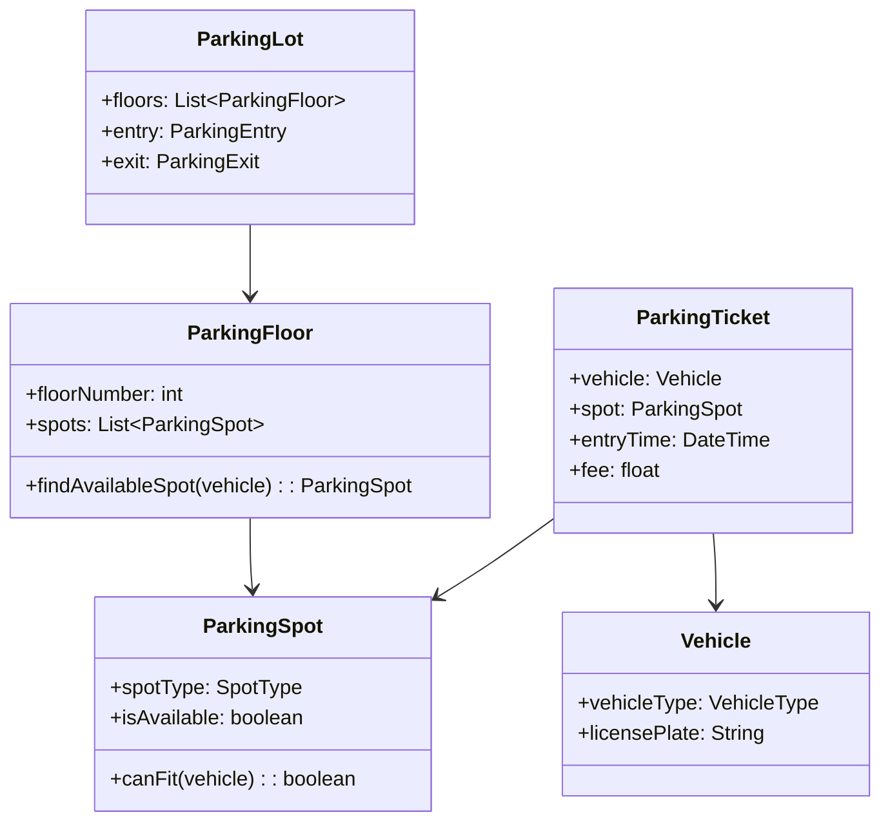

# Design a Parking Lot System (OOD)

**Difficulty**: 🟢 Beginner
**Reading Time**: Coming Soon
**Interview Frequency**: High

---

> 🚧 **Full article coming soon.** This stub gives you the essentials to start thinking about this problem.

---

## The Core Problem

Modeling a multi-floor parking lot with different vehicle types (motorcycle, car, truck) and real-time availability tracking. The key OOD challenge is extensibility — adding a new vehicle type or pricing model should require minimal code changes. Incorrect design leads to large switch statements scattered across the codebase.

## Functional Requirements

- Vehicle enters, gets assigned to an appropriate spot
- Vehicle exits, spot is freed, fee is calculated
- Display available spots by type and floor
- Support spot types: motorcycle, compact, large
- Different pricing for different vehicle types and durations

## Non-Functional Requirements

| Requirement | Target |
|-------------|--------|
| Availability | Real-time spot count accuracy |
| Extensibility | Add new vehicle type with 0 existing code changes |
| Scale | 1,000-spot lot with real-time availability |

## Back-of-Envelope Estimates

- **State**: 1,000 spots × 1 bit (occupied/free) = 125 bytes — trivial
- **Classes needed**: ~8 core classes to cover all requirements with clean OOP
- **Patterns**: Observer (availability updates), Strategy (pricing), Polymorphism (vehicle/spot hierarchy)

## Key Design Decisions

1. **Vehicle and Spot Hierarchy** — `Vehicle` base class with `Motorcycle`, `Car`, `Truck` subclasses; `ParkingSpot` base with `MotorcycleSpot`, `CompactSpot`, `LargeSpot`; `canFit(vehicle)` method on spot determines compatibility; Open/Closed Principle — extend without modifying.
2. **Observer Pattern for Availability** — `ParkingFloor` maintains spot counts; when spot changes state (occupied/free), notifies `ParkingDisplay` observers; display always reflects current state without polling.
3. **Strategy Pattern for Pricing** — `PricingStrategy` interface with `HourlyPricing`, `DailyPricing`, `WeekendPricing` implementations; `ParkingTicket` holds a strategy; changing pricing policy = swap strategy, not rewrite ticket class.

## High-Level Architecture

## Top Interview Questions for This Problem

| Question | Tests |
|----------|-------|
| How would you handle a truck that can take up 3 compact spots? | Spot aggregation, composite spots |
| How would you add electric vehicle charging spots without changing existing code? | Open/Closed Principle, extension |
| How do you handle concurrent entry — two cars racing for the last spot? | Thread safety, synchronization |

## Related Concepts

- [Elevator system OOD for similar state machine design](./elevator-system)
- [ATM system OOD for similar state-driven design patterns](./atm-system)

---

*📚 Full deep-dive with multiple approaches, trade-off tables, and pseudocode coming soon.*
