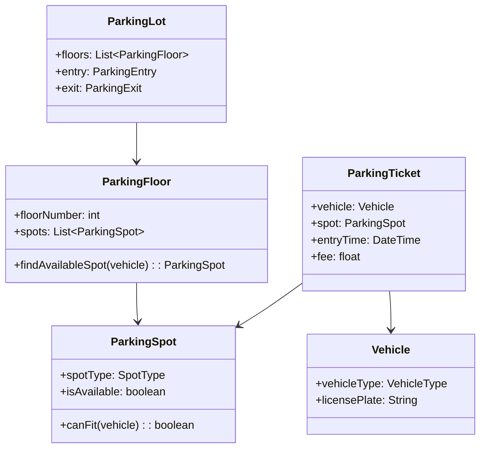
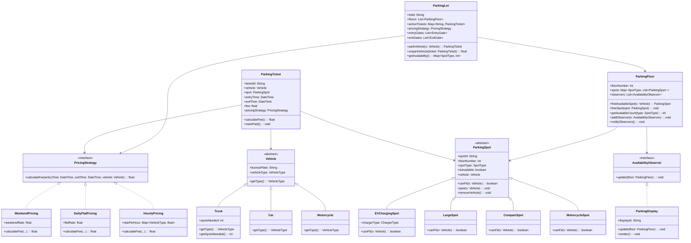
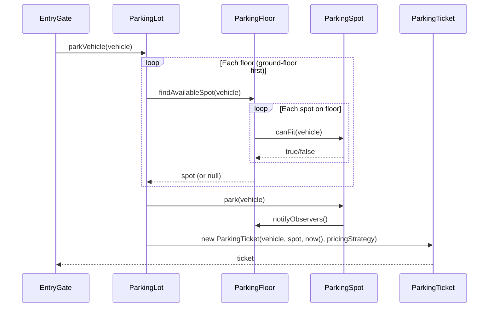
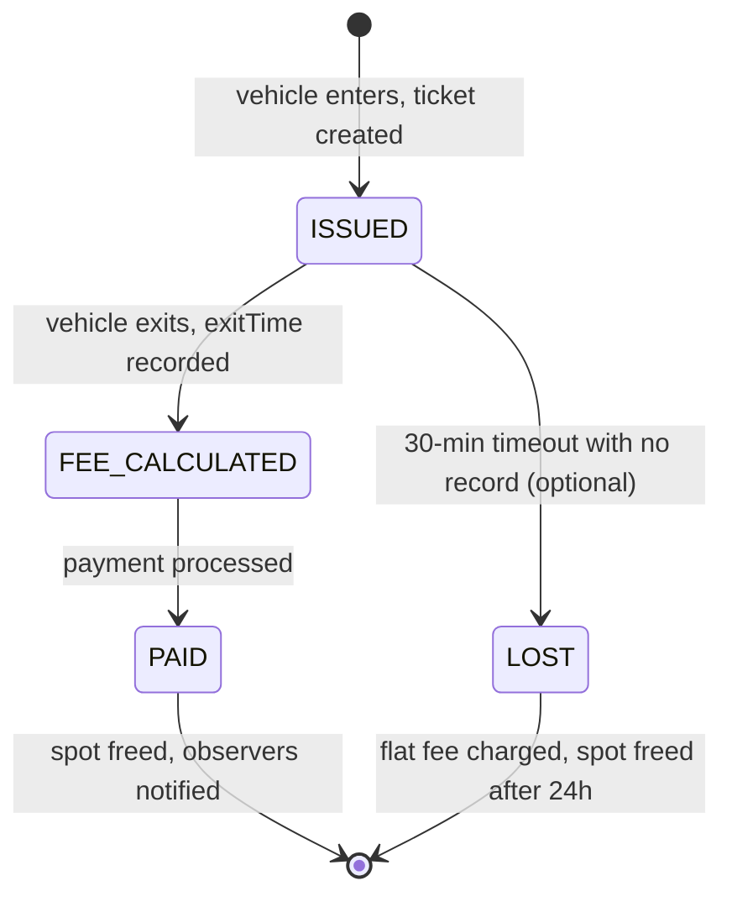

# Design a Parking Lot System (OOD)

**Difficulty**: 🟢 Beginner
**Reading Time**: 20 min
**Interview Frequency**: High

---

## The Core Problem

Modeling a multi-floor parking lot with different vehicle types (motorcycle, car, truck) and real-time availability tracking. The key OOD challenge is extensibility — adding a new vehicle type or pricing model should require minimal code changes. Incorrect design leads to large switch statements scattered across the codebase.

## Functional Requirements

- Vehicle enters, gets assigned to an appropriate spot
- Vehicle exits, spot is freed, fee is calculated
- Display available spots by type and floor
- Support spot types: motorcycle, compact, large
- Different pricing for different vehicle types and durations

## Non-Functional Requirements

| Requirement | Target |
|-------------|--------|
| Availability | Real-time spot count accuracy |
| Extensibility | Add new vehicle type with 0 existing code changes |
| Scale | 1,000-spot lot with real-time availability |

## Back-of-Envelope Estimates

- **State**: 1,000 spots × 1 bit (occupied/free) = 125 bytes — trivial
- **Classes needed**: ~8 core classes to cover all requirements with clean OOP
- **Patterns**: Observer (availability updates), Strategy (pricing), Polymorphism (vehicle/spot hierarchy)

## Key Design Decisions

1. **Vehicle and Spot Hierarchy** — `Vehicle` base class with `Motorcycle`, `Car`, `Truck` subclasses; `ParkingSpot` base with `MotorcycleSpot`, `CompactSpot`, `LargeSpot`; `canFit(vehicle)` method on spot determines compatibility; Open/Closed Principle — extend without modifying.
2. **Observer Pattern for Availability** — `ParkingFloor` maintains spot counts; when spot changes state (occupied/free), notifies `ParkingDisplay` observers; display always reflects current state without polling.
3. **Strategy Pattern for Pricing** — `PricingStrategy` interface with `HourlyPricing`, `DailyPricing`, `WeekendPricing` implementations; `ParkingTicket` holds a strategy; changing pricing policy = swap strategy, not rewrite ticket class.

## High-Level Architecture



## Top Interview Questions for This Problem

| Question | Tests |
|----------|-------|
| How would you handle a truck that can take up 3 compact spots? | Spot aggregation, composite spots |
| How would you add electric vehicle charging spots without changing existing code? | Open/Closed Principle, extension |
| How do you handle concurrent entry — two cars racing for the last spot? | Thread safety, synchronization |

## Related Concepts

- [Elevator system OOD for similar state machine design](./elevator-system)
- [ATM system OOD for similar state-driven design patterns](./atm-system)

---

## Class Design

The full class hierarchy showing all relationships, fields, and methods:



---

## Component Deep Dive 1: Spot Assignment and Vehicle-Spot Compatibility

The most critical architectural decision in a parking lot system is how vehicles are matched to spots. A naive approach uses a giant `if-else` or `switch` statement inside a single `assign()` method: "if motorcycle, find motorcycle spot; if car, find compact spot; if truck, find large spot." This works for three vehicle types but breaks the moment you add a fourth (electric vehicle, handicapped vehicle, oversized delivery truck). Every addition requires modifying the existing method — a direct violation of the Open/Closed Principle.

The correct design inverts the responsibility: the **spot** decides whether it can fit a **vehicle**, not the other way around. `ParkingSpot.canFit(Vehicle v)` is a polymorphic method overridden by each spot subclass. `CompactSpot.canFit()` returns true for `Car` and `Motorcycle`. `LargeSpot.canFit()` returns true for `Truck`, `Car`, and `Motorcycle`. `MotorcycleSpot.canFit()` returns true only for `Motorcycle`.

This design means `ParkingFloor.findAvailableSpot(Vehicle v)` simply iterates spots and calls `spot.canFit(v)` — no type checks, no switch statements. Adding `ElectricVehicle` and `EVChargingSpot` requires only two new subclasses; zero changes to `ParkingFloor`, zero changes to `ParkingLot`.

**Truck spanning multiple spots** is the hardest edge case. One clean approach: `Truck` carries a `spotsNeeded` field (default 1, or 3 for an oversized truck). `ParkingFloor.findContiguousSpots(n, SpotType.LARGE)` finds `n` adjacent large spots and returns them as a `SpotGroup`. `ParkingTicket` then holds a `List<ParkingSpot>` instead of a single spot, and all spots in the group are marked occupied atomically inside a `synchronized` block.



| Approach | Complexity | Extensibility | Thread Safety |
|----------|------------|---------------|---------------|
| Switch in `ParkingLot.assign()` | O(1) lookup, O(n) code growth | Poor — modify existing code per new type | Easy — single lock point |
| `canFit()` on each `ParkingSpot` subclass | O(spots) scan | Excellent — add subclass, zero existing changes | Needs per-floor lock |
| Bitmap index per spot type | O(1) find-first-free | Good — new type = new bitmap | Lock-free with `AtomicLong` bitmask |

---

## Component Deep Dive 2: Pricing Strategy and Ticket Lifecycle

The `PricingStrategy` interface isolates fee calculation from the ticket's identity. Without this pattern, `ParkingTicket.calculateFee()` becomes a sprawling method with date checks (is it a weekend?), vehicle type checks (is it a motorcycle half-price?), and duration checks (is it under 15 minutes — grace period?). Each new promotion requires touching the ticket class.

With Strategy, `ParkingLot` selects the appropriate strategy at ticket-creation time (or at exit time, depending on business rules) and injects it into the ticket. The ticket stores entry time and delegates `calculateFee(entryTime, exitTime, vehicle)` to whichever strategy it holds.

**At 10x load** (a large city garage during an event): 500 vehicles entering in 10 minutes = ~1 ticket creation/sec. Each ticket creation touches one `ParkingFloor` (to find and lock a spot), one `ParkingSpot` (to mark occupied), and one `Map.put()` in `ParkingLot.activeTickets`. All three are in-memory operations; the bottleneck at this scale is not throughput but **lock contention** — multiple threads calling `ParkingFloor.findAvailableSpot()` on the same floor simultaneously. Fine-grained locking per floor (rather than a single lot-level lock) reduces contention from O(floors) to O(1) per floor.



| Pricing Approach | Flexibility | Complexity | Change Risk |
|-----------------|-------------|------------|-------------|
| Hardcoded in `Ticket.calculateFee()` | None | Low | High — any change touches tickets |
| Strategy pattern (injected at creation) | High | Medium | Low — swap strategy object |
| Rules engine (config-driven) | Very high | High | Very low — no code deploy needed |

---

## Component Deep Dive 3: Observer Pattern for Real-Time Availability Display

Every parking display board (physical LED boards at garage entrances, mobile app availability screens) needs accurate counts without polling every spot every second. The naive solution polls `ParkingFloor.getAvailableCount()` on a timer — wasteful and introduces up to N seconds of staleness where N is the poll interval.

The Observer pattern makes `ParkingFloor` the **subject** and `ParkingDisplay` the **observer**. When `ParkingSpot.park(vehicle)` or `ParkingSpot.removeVehicle()` is called, it calls `floor.notifyObservers()`. Each registered display immediately receives the updated counts and re-renders. Latency from state change to display update: ~1ms (in-process method call). Zero polling, zero staleness.

The `AvailabilityObserver` interface keeps `ParkingFloor` decoupled from any specific display technology. A mobile app backend, an LED driver, or an admin dashboard all implement the same interface — `ParkingFloor` does not import any of them. Adding a new display type requires no changes to `ParkingFloor`.

**Extension for distributed systems**: If the lot spans multiple buildings (a real airport scenario), floors in different processes can publish state changes to a Redis pub/sub channel. Remote displays subscribe to that channel. The OOD Observer pattern maps cleanly onto distributed event systems — the abstraction holds across scales.

---

## Design Patterns Applied

### Strategy Pattern — Pricing
`PricingStrategy` interface with `HourlyPricing`, `DailyFlatPricing`, and `WeekendPricing` implementations. `ParkingLot` holds the active strategy and injects it into each `ParkingTicket`. Swapping from hourly to event-flat-rate pricing means one line change: `lot.setPricingStrategy(new EventFlatPricing(20.00))`. No ticket code changes.

### Observer Pattern — Availability Notification
`ParkingFloor` (subject) notifies registered `AvailabilityObserver` instances (displays, dashboards) on every state change. Decouples the parking core from all display concerns. Adding a new display type = implement the interface + register. Zero changes to `ParkingFloor`.

### Template Method Pattern — Spot Compatibility
`ParkingSpot` defines the template: `canFit(Vehicle v)` is called by `ParkingFloor.findAvailableSpot()`. Each subclass overrides `canFit()` with its own compatibility logic. The algorithm skeleton (iterate spots, call canFit, return first match) never changes; only the per-type rules differ.

### Factory Method — Vehicle Creation (optional but clean)
`VehicleFactory.create(VehicleType type, String licensePlate)` centralizes object creation. Entry gate calls the factory — it does not `new Car(...)` directly. Useful when vehicle creation involves validation (license plate format, banned vehicles list) that should not live in the caller.

### Composite Pattern — Multi-Spot Truck Parking
A truck that spans 3 contiguous large spots can be modeled as a `SpotGroup` (Composite) that implements the same `ParkingSpot` interface. `SpotGroup.park(vehicle)` delegates to each child spot. `SpotGroup.canFit(vehicle)` checks that all children are available and that the vehicle is a truck. The ticket holds one `SpotGroup`, not three separate spots — fee calculation is unaffected.

---

## SOLID Principles

**Single Responsibility**
Each class has one reason to change. `ParkingTicket` changes only if ticket data structure changes. `HourlyPricing` changes only if hourly rate logic changes. `ParkingDisplay` changes only if display rendering changes. `ParkingFloor` changes only if floor layout logic changes.

**Open/Closed**
The spot hierarchy is open for extension (add `HandicappedSpot`, `EVChargingSpot`) but closed for modification — `ParkingFloor.findAvailableSpot()` never changes when a new spot type is added. The pricing system is open for new strategies without modifying `ParkingTicket`.

**Liskov Substitution**
Any `ParkingSpot` subclass can be used wherever `ParkingSpot` is expected. `EVChargingSpot.canFit(Car car)` behaves consistently with the base class contract — it returns true or false, it parks the vehicle, it frees correctly. No surprises.

**Interface Segregation**
`AvailabilityObserver` contains only `update(ParkingFloor floor)`. Displays don't have to implement unrelated methods. `PricingStrategy` contains only `calculateFee(...)`. These are minimal, focused interfaces.

**Dependency Inversion**
`ParkingLot` depends on `PricingStrategy` (interface), not `HourlyPricing` (concrete class). `ParkingFloor` depends on `AvailabilityObserver` (interface), not `ParkingDisplay`. High-level policy (`ParkingLot`) does not depend on low-level detail (specific pricing or display implementations).

---

## Concurrency and Thread Safety

Three concurrent operations can collide:

**1. Two vehicles racing for the last spot**
`ParkingFloor.findAvailableSpot()` must be atomic with `ParkingSpot.park()`. Without synchronization: thread A finds spot 42 free, thread B finds spot 42 free, both park — double booking. Fix: synchronize the entire find-and-park sequence at the floor level:

```java
public synchronized ParkingSpot findAndParkVehicle(Vehicle v) {
    for (ParkingSpot spot : spots) {
        if (spot.canFit(v) && spot.isAvailable()) {
            spot.park(v);
            notifyObservers();
            return spot;
        }
    }
    return null; // lot full
}
```

A finer-grained alternative uses `ConcurrentHashMap` keyed by spotId and `spot.compareAndSetAvailable(true, false)` — reduces contention to per-spot level instead of per-floor level.

**2. Concurrent exit payments**
`ParkingTicket.calculateFee()` and `markPaid()` must be atomic. Use a ticket-level lock or make `ticketState` an `AtomicReference<TicketState>` with a CAS transition from `FEE_CALCULATED` to `PAID`.

**3. Observer notification during heavy entry**
If 50 vehicles enter simultaneously, `notifyObservers()` fires 50 times per floor. Each call updates displays synchronously. Solution: debounce notifications — notify at most once per 100ms using a scheduled flush thread, or make `ParkingDisplay.update()` non-blocking (post to a queue, render asynchronously).

**Pseudocode for thread-safe spot assignment with CAS:**

```java
// Lock-free spot assignment using AtomicBoolean per spot
public class ParkingSpot {
    private final AtomicBoolean available = new AtomicBoolean(true);
    private volatile Vehicle parkedVehicle = null;

    public boolean tryPark(Vehicle v) {
        if (!canFit(v)) return false;
        // CAS: only one thread wins the transition from true -> false
        if (available.compareAndSet(true, false)) {
            parkedVehicle = v;
            return true;
        }
        return false; // another thread grabbed it first
    }

    public void release() {
        parkedVehicle = null;
        available.set(true);
    }
}

// ParkingFloor uses tryPark — no synchronized block needed
public ParkingSpot findAndPark(Vehicle v) {
    for (ParkingSpot spot : spots) {
        if (spot.tryPark(v)) {
            notifyObserversAsync(); // non-blocking
            return spot;
        }
    }
    return null; // full
}
```

This CAS-based approach is **lock-free** — threads never block waiting for a mutex. In the worst case (many threads competing for the last spot), exactly one succeeds and the rest retry on the next available spot or return null. Average-case throughput scales linearly with CPU cores up to ~32 concurrent threads before cache-line contention on `AtomicBoolean` becomes a bottleneck.

---

## Data Model

```sql
-- Core tables for a persistent parking lot system

CREATE TABLE parking_spot (
    spot_id       VARCHAR(20) PRIMARY KEY,  -- e.g., "F2-C-042" (floor2-compact-042)
    floor_number  TINYINT     NOT NULL,
    spot_type     ENUM('MOTORCYCLE','COMPACT','LARGE','EV_CHARGING') NOT NULL,
    is_available  BOOLEAN     NOT NULL DEFAULT TRUE,
    charger_type  ENUM('LEVEL2','DCFAST') NULL,  -- only for EV spots
    created_at    TIMESTAMP   NOT NULL DEFAULT CURRENT_TIMESTAMP
);

CREATE INDEX idx_spot_type_available ON parking_spot(spot_type, is_available);
CREATE INDEX idx_floor_available ON parking_spot(floor_number, is_available);

CREATE TABLE parking_ticket (
    ticket_id       CHAR(36)       PRIMARY KEY,  -- UUID
    license_plate   VARCHAR(20)    NOT NULL,
    vehicle_type    ENUM('MOTORCYCLE','CAR','TRUCK','EV') NOT NULL,
    spot_id         VARCHAR(20)    NOT NULL REFERENCES parking_spot(spot_id),
    entry_time      TIMESTAMP      NOT NULL,
    exit_time       TIMESTAMP      NULL,
    fee_cents       INT            NULL,  -- store in cents to avoid float rounding
    payment_status  ENUM('UNPAID','PAID','LOST_TICKET') NOT NULL DEFAULT 'UNPAID',
    pricing_plan    ENUM('HOURLY','DAILY','WEEKEND','EVENT') NOT NULL DEFAULT 'HOURLY',
    paid_at         TIMESTAMP      NULL
);

CREATE INDEX idx_ticket_license ON parking_ticket(license_plate);
CREATE INDEX idx_ticket_spot ON parking_ticket(spot_id, payment_status);
CREATE INDEX idx_ticket_unpaid ON parking_ticket(payment_status, entry_time)
    WHERE payment_status = 'UNPAID';  -- partial index for active tickets

CREATE TABLE pricing_rate (
    rate_id       INT          PRIMARY KEY AUTO_INCREMENT,
    plan          ENUM('HOURLY','DAILY','WEEKEND','EVENT') NOT NULL,
    vehicle_type  ENUM('MOTORCYCLE','CAR','TRUCK','EV') NOT NULL,
    rate_cents    INT          NOT NULL,  -- cents per hour for HOURLY, flat for DAILY
    valid_from    TIMESTAMP    NOT NULL,
    valid_to      TIMESTAMP    NULL,
    UNIQUE KEY uk_plan_vehicle_period (plan, vehicle_type, valid_from)
);
```

---

## Extension Points

**Adding Electric Vehicle Charging Spots**
Create `EVChargingSpot extends ParkingSpot` with `chargerType: ChargerType` field. Override `canFit(v)` to return true for `ElectricVehicle`. Create `EVChargingPricing implements PricingStrategy` that adds per-kWh charging fees on top of hourly rate. Register `EVChargingSpot` instances on the relevant floors. Zero changes to `ParkingLot`, `ParkingFloor`, `ParkingTicket`.

**Adding Monthly Pass / Reserved Spots**
Create `ReservedSpot extends ParkingSpot` with `ownerId: String`. Override `canFit(v)` to check `vehicle.licensePlate.equals(this.ownerLicensePlate)`. Create `MonthlyPassPricing` that returns 0 for the pass holder. Pass holders skip the standard `findAvailableSpot()` and call `findReservedSpot(licensePlate)` directly.

**Adding Valet Parking**
Add `ValetAttendant` class with `assignSpot(Vehicle v): ParkingSpot` and `retrieveVehicle(ticket): void`. `ValetParkingLot extends ParkingLot` overrides `parkVehicle()` to enqueue requests to a `ValetQueue` instead of assigning spots directly. The OCP holds — base `ParkingLot` is untouched.

**Adding Real-Time Pricing (Surge)**
Create `SurgePricingStrategy` that queries current occupancy from `ParkingLot.getOccupancyRate()` and multiplies the base hourly rate by a surge multiplier. Inject via the existing `PricingStrategy` interface. No changes to tickets, spots, or floors.

---

## How Stripe Built Parking Payment Infrastructure (Analogous System)

While Stripe is not a parking company, their approach to **idempotent payment flows** directly applies to parking lot fee collection and is the canonical reference for this pattern at scale.

Stripe's payment API handles ~1 million transactions per day across thousands of merchants. Their key architectural insight — published in their engineering blog — is **idempotency keys**: every payment request carries a client-generated key. If the request is retried (network timeout, user double-clicks Pay), the server returns the original result without double-charging. At Stripe's scale: 1M tx/day = ~12 tx/sec average, with peaks at ~500 tx/sec during business hours.

**Applied to parking lot payment**: When a vehicle exits and payment is processed, the ticket ID serves as the idempotency key. If the payment terminal crashes mid-transaction and retries, `ParkingLot.processPayment(ticketId, amount)` checks whether `ticket.paymentStatus == PAID` before charging again. The `ticket_id` + `payment_status` index in the data model above directly supports this O(1) check.

Stripe's second non-obvious decision: store fees in **integer cents**, not floating-point dollars. `$2.50 * 3 hours = $7.499999...` in IEEE 754 float. In a parking lot handling 100,000 transactions/day, float rounding errors accumulate to measurable revenue discrepancy. The data model above stores `fee_cents INT` for exactly this reason — a decision Stripe documents explicitly in their API design guides.

Stripe engineering blog reference: https://stripe.com/blog/idempotency

---

## Scale Bottlenecks

| Traffic Level | Component That Breaks | Symptoms | Mitigation |
|---------------|-----------------------|----------|------------|
| 10x baseline (100 entries/min) | `ParkingFloor` synchronized block | Entry gate latency spikes from 2ms to 50ms | Per-floor locks instead of lot-level lock |
| 100x baseline (1,000 entries/min) | `activeTickets` HashMap in `ParkingLot` | ConcurrentModificationException under load | Replace with `ConcurrentHashMap`; shard by floor |
| 100x (airport scale) | Observer notification backlog | Display boards lag 5-10 seconds behind reality | Async notification queue; debounce to 1 update/100ms |
| 1000x baseline (10,000 entries/min) | In-memory state — single JVM | JVM crashes = all state lost | Persist spot state to Redis; ticket state to PostgreSQL |
| 1000x (multi-building campus) | Single `ParkingLot` instance | Can't scale horizontally | Shard by building; each building = independent `ParkingLot` instance; aggregate availability via pub/sub |

---

## Interview Angle

**What the interviewer is testing:** Whether you can identify the right abstraction boundaries — specifically, that spot assignment logic belongs on the spot (polymorphism), not on a central dispatcher — and whether you understand how to keep a class hierarchy extensible under the Open/Closed Principle.

**Common mistakes candidates make:**

1. **Putting all type logic in `ParkingLot`** — writing `if (vehicle instanceof Truck) findLargeSpot()` inside the lot class. This forces every new vehicle type to modify `ParkingLot`, coupling core orchestration to leaf-level type details.

2. **Ignoring concurrency entirely** — describing a design that has a race condition on the last available spot. Interviewers at senior level specifically probe this: "what happens if two cars enter at the same millisecond?" Candidates who have no answer signal they have not shipped production concurrent systems.

3. **Over-engineering pricing from the start** — spending 15 minutes designing a full rules engine with database-driven rate tables before establishing the basic class hierarchy. Solve the core OOD problem first; mention the rules engine as a future extension.

**The insight that separates good from great answers:** Recognizing that `canFit(Vehicle v)` belongs on `ParkingSpot`, not `Vehicle`. This single inversion — asking the spot if it accepts the vehicle, rather than asking the vehicle which spot it needs — is what makes the entire class hierarchy Open/Closed. Great candidates name this explicitly as a design decision and explain why the naive alternative fails.

---

## Key Numbers to Remember

| Metric | Value | Context |
|--------|-------|---------|
| Core classes for full OOD | ~10 classes | Vehicle (3 subclasses), Spot (3 subclasses), Floor, Lot, Ticket, PricingStrategy |
| Concurrent entry handling | Per-floor synchronized block | Floor-level lock reduces contention vs lot-level lock by factor of N floors |
| State storage for 1,000 spots | 125 bytes for availability bits | Trivially fits in L1 cache; persistence is optional for single-lot |
| Observer notification latency | ~1ms | In-process method call; no polling overhead |
| Fee precision | Store in integer cents | Avoids IEEE 754 float errors at 100k+ transactions/day |
| Stripe payment idempotency | 1M tx/day, peaks at 500 tx/sec | Reference for idempotent payment pattern applied to ticket fees |
| Truck spot aggregation | 3 contiguous LargeSpots | `SpotGroup` Composite holds 3 children; ticket holds 1 SpotGroup |
| Design patterns used | 4 named patterns | Strategy (pricing), Observer (display), Template Method (canFit), Composite (truck) |

---

## 📚 Resources & References

| Resource | Type | What You'll Learn |
|----------|------|------------------|
| [ByteByteGo — Design a Parking Lot](https://www.youtube.com/@ByteByteGo) | 📺 YouTube | Search "parking lot design" — spot types, ticket management, payment |
| [Grokking Object-Oriented Design](https://www.educative.io/courses/grokking-the-object-oriented-design-interview) | 📚 Book | Parking lot — a classic OOD interview question with full class design |
| [Factory Pattern for Vehicle Types](https://refactoring.guru/design-patterns/factory-method) | 📚 Docs | Using Factory pattern to create different vehicle type objects |
| [Strategy Pattern for Pricing Models](https://refactoring.guru/design-patterns/strategy) | 📚 Docs | Pluggable pricing strategies — hourly, daily, EV charging rates |
| [Composite Pattern for Multi-Level Parking](https://refactoring.guru/design-patterns/composite) | 📚 Docs | Modeling multi-floor parking structures with Composite pattern |
| [Stripe Idempotency Blog](https://stripe.com/blog/idempotency) | 📖 Blog | Idempotent payment design — directly applicable to parking fee collection |
